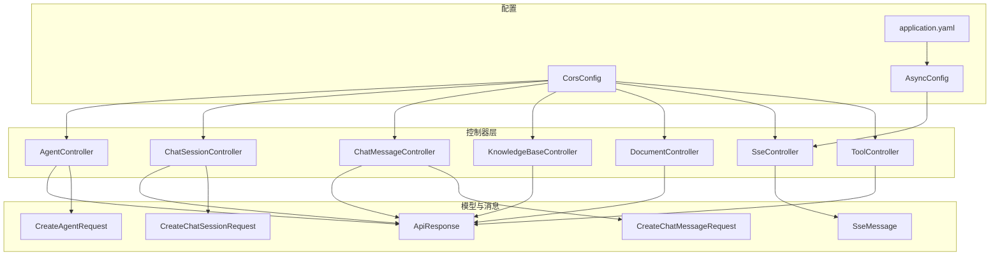
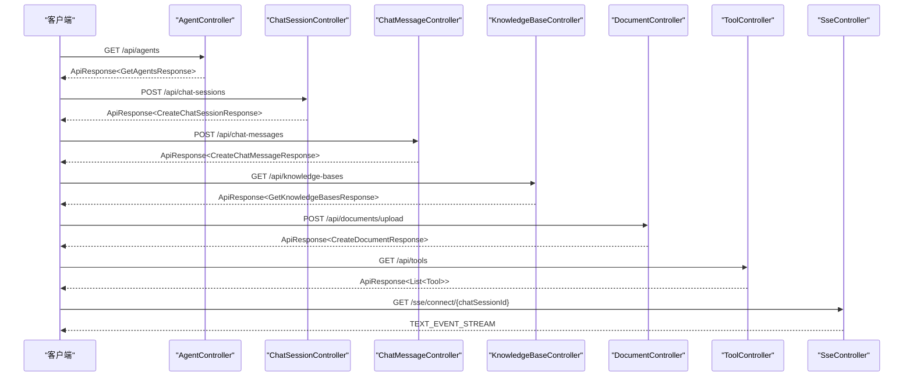
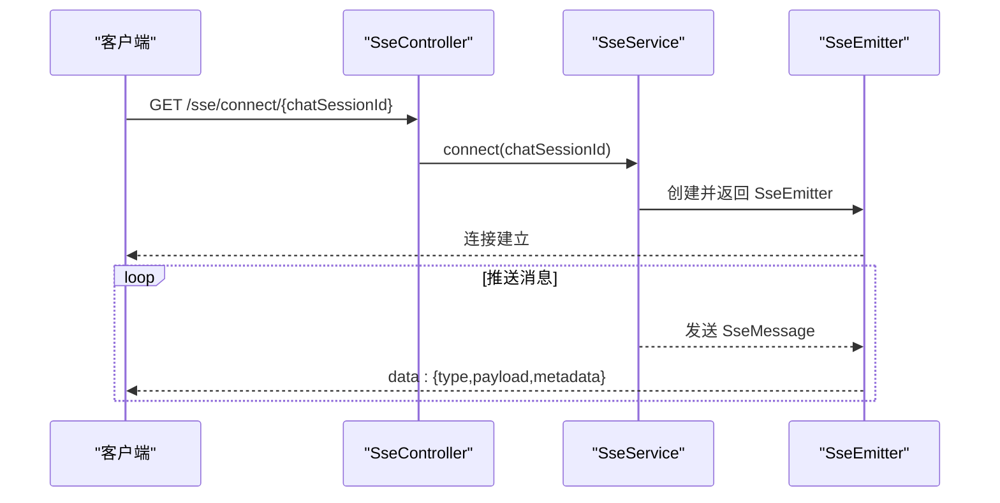
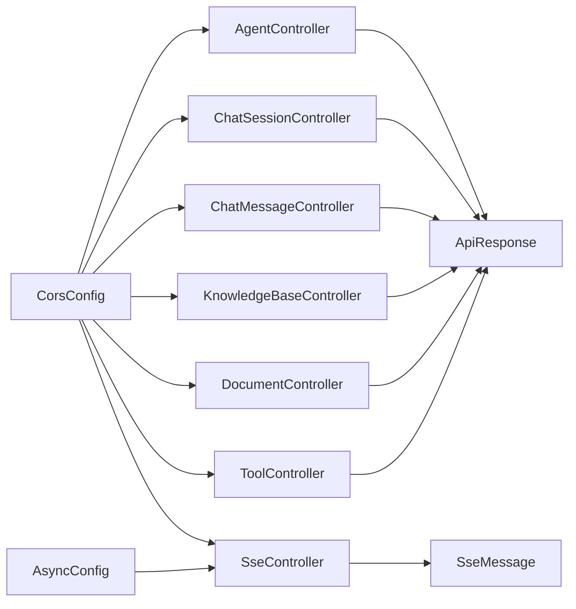

# API参考文档

<cite>
**本文引用的文件**
- [AgentController.java](file://jchatmind/src/main/java/com/kama/jchatmind/controller/AgentController.java)
- [ChatSessionController.java](file://jchatmind/src/main/java/com/kama/jchatmind/controller/ChatSessionController.java)
- [ChatMessageController.java](file://jchatmind/src/main/java/com/kama/jchatmind/controller/ChatMessageController.java)
- [KnowledgeBaseController.java](file://jchatmind/src/main/java/com/kama/jchatmind/controller/KnowledgeBaseController.java)
- [DocumentController.java](file://jchatmind/src/main/java/com/kama/jchatmind/controller/DocumentController.java)
- [SseController.java](file://jchatmind/src/main/java/com/kama/jchatmind/controller/SseController.java)
- [ToolController.java](file://jchatmind/src/main/java/com/kama/jchatmind/controller/ToolController.java)
- [ApiResponse.java](file://jchatmind/src/main/java/com/kama/jchatmind/model/common/ApiResponse.java)
- [SseMessage.java](file://jchatmind/src/main/java/com/kama/jchatmind/message/SseMessage.java)
- [CreateAgentRequest.java](file://jchatmind/src/main/java/com/kama/jchatmind/model/request/CreateAgentRequest.java)
- [CreateChatSessionRequest.java](file://jchatmind/src/main/java/com/kama/jchatmind/model/request/CreateChatSessionRequest.java)
- [CreateChatMessageRequest.java](file://jchatmind/src/main/java/com/kama/jchatmind/model/request/CreateChatMessageRequest.java)
- [application.yaml](file://jchatmind/src/main/resources/application.yaml)
- [CorsConfig.java](file://jchatmind/src/main/java/com/kama/jchatmind/config/CorsConfig.java)
- [AsyncConfig.java](file://jchatmind/src/main/java/com/kama/jchatmind/config/AsyncConfig.java)
</cite>

## 目录
1. [简介](#简介)
2. [项目结构](#项目结构)
3. [核心组件](#核心组件)
4. [架构总览](#架构总览)
5. [详细组件分析](#详细组件分析)
6. [依赖分析](#依赖分析)
7. [性能考虑](#性能考虑)
8. [故障排除指南](#故障排除指南)
9. [结论](#结论)
10. [附录](#附录)

## 简介
本文件为 JChatMind 后端服务的完整 API 参考文档，覆盖以下能力域：
- Agent 管理：查询、创建、更新、删除智能体
- 聊天会话：查询、创建、更新、删除会话
- 聊天消息：按会话查询、创建、更新、删除消息
- 知识库管理：查询、创建、更新、删除知识库
- 文档管理：查询、创建、上传、更新、删除文档
- 工具调用：获取可用工具清单
- 实时通信：SSE 流式推送

文档提供每个端点的 HTTP 方法、URL 模式、请求参数、响应格式与错误码说明，并给出认证机制、请求/响应示例路径、常见使用场景、SSE 协议与消息格式规范、以及版本控制与兼容性建议。

## 项目结构
后端采用 Spring Boot 架构，API 控制器位于 controller 包下，统一前缀为 /api；SSE 端点位于 /sse；通用响应封装在 model.common.ApiResponse 中；实时消息模型在 message 包中定义。

图表来源
- [AgentController.java:12-44](file://jchatmind/src/main/java/com/kama/jchatmind/controller/AgentController.java#L12-L44)
- [ChatSessionController.java:13-57](file://jchatmind/src/main/java/com/kama/jchatmind/controller/ChatSessionController.java#L13-L57)
- [ChatMessageController.java:12-44](file://jchatmind/src/main/java/com/kama/jchatmind/controller/ChatMessageController.java#L12-L44)
- [KnowledgeBaseController.java:12-44](file://jchatmind/src/main/java/com/kama/jchatmind/controller/KnowledgeBaseController.java#L12-L44)
- [DocumentController.java:13-59](file://jchatmind/src/main/java/com/kama/jchatmind/controller/DocumentController.java#L13-L59)
- [SseController.java:11-23](file://jchatmind/src/main/java/com/kama/jchatmind/controller/SseController.java#L11-L23)
- [ToolController.java:13-25](file://jchatmind/src/main/java/com/kama/jchatmind/controller/ToolController.java#L13-L25)
- [ApiResponse.java:7-58](file://jchatmind/src/main/java/com/kama/jchatmind/model/common/ApiResponse.java#L7-L58)
- [SseMessage.java:8-46](file://jchatmind/src/main/java/com/kama/jchatmind/message/SseMessage.java#L8-L46)
- [CorsConfig.java:14-34](file://jchatmind/src/main/java/com/kama/jchatmind/config/CorsConfig.java#L14-L34)
- [AsyncConfig.java:10-24](file://jchatmind/src/main/java/com/kama/jchatmind/config/AsyncConfig.java#L10-L24)
- [application.yaml:1-43](file://jchatmind/src/main/resources/application.yaml#L1-L43)

章节来源
- [AgentController.java:12-44](file://jchatmind/src/main/java/com/kama/jchatmind/controller/AgentController.java#L12-L44)
- [ChatSessionController.java:13-57](file://jchatmind/src/main/java/com/kama/jchatmind/controller/ChatSessionController.java#L13-L57)
- [ChatMessageController.java:12-44](file://jchatmind/src/main/java/com/kama/jchatmind/controller/ChatMessageController.java#L12-L44)
- [KnowledgeBaseController.java:12-44](file://jchatmind/src/main/java/com/kama/jchatmind/controller/KnowledgeBaseController.java#L12-L44)
- [DocumentController.java:13-59](file://jchatmind/src/main/java/com/kama/jchatmind/controller/DocumentController.java#L13-L59)
- [SseController.java:11-23](file://jchatmind/src/main/java/com/kama/jchatmind/controller/SseController.java#L11-L23)
- [ToolController.java:13-25](file://jchatmind/src/main/java/com/kama/jchatmind/controller/ToolController.java#L13-L25)
- [ApiResponse.java:7-58](file://jchatmind/src/main/java/com/kama/jchatmind/model/common/ApiResponse.java#L7-L58)
- [SseMessage.java:8-46](file://jchatmind/src/main/java/com/kama/jchatmind/message/SseMessage.java#L8-L46)
- [CorsConfig.java:14-34](file://jchatmind/src/main/java/com/kama/jchatmind/config/CorsConfig.java#L14-L34)
- [AsyncConfig.java:10-24](file://jchatmind/src/main/java/com/kama/jchatmind/config/AsyncConfig.java#L10-L24)
- [application.yaml:1-43](file://jchatmind/src/main/resources/application.yaml#L1-L43)

## 核心组件
- 统一响应封装：所有 API 响应均以 ApiResponse<T> 返回，包含 code、message、data 字段。成功状态码为 200，失败为 500。
- SSE 消息模型：SseMessage 定义了类型、载荷与元数据，支持 AI 生成、规划、思考、执行、完成等阶段消息。
- 跨域配置：默认允许本地开发环境（http://localhost:*、http://127.0.0.1:*）跨域访问，支持凭证与预检缓存。
- 异步事件：启用异步线程池，用于事件驱动的消息推送与后台任务。

章节来源
- [ApiResponse.java:7-58](file://jchatmind/src/main/java/com/kama/jchatmind/model/common/ApiResponse.java#L7-L58)
- [SseMessage.java:8-46](file://jchatmind/src/main/java/com/kama/jchatmind/message/SseMessage.java#L8-L46)
- [CorsConfig.java:14-34](file://jchatmind/src/main/java/com/kama/jchatmind/config/CorsConfig.java#L14-L34)
- [AsyncConfig.java:10-24](file://jchatmind/src/main/java/com/kama/jchatmind/config/AsyncConfig.java#L10-L24)

## 架构总览
JChatMind API 采用 RESTful 设计，控制器通过 Spring MVC 提供 HTTP 接口，服务层负责业务编排，MyBatis 访问数据库，SSE 通过 Spring MVC 的 SseEmitter 实现实时推送。

图表来源
- [AgentController.java:19-23](file://jchatmind/src/main/java/com/kama/jchatmind/controller/AgentController.java#L19-L23)
- [ChatSessionController.java:38-42](file://jchatmind/src/main/java/com/kama/jchatmind/controller/ChatSessionController.java#L38-L42)
- [ChatMessageController.java:25-29](file://jchatmind/src/main/java/com/kama/jchatmind/controller/ChatMessageController.java#L25-L29)
- [KnowledgeBaseController.java:19-23](file://jchatmind/src/main/java/com/kama/jchatmind/controller/KnowledgeBaseController.java#L19-L23)
- [DocumentController.java:38-44](file://jchatmind/src/main/java/com/kama/jchatmind/controller/DocumentController.java#L38-L44)
- [ToolController.java:20-24](file://jchatmind/src/main/java/com/kama/jchatmind/controller/ToolController.java#L20-L24)
- [SseController.java:18-22](file://jchatmind/src/main/java/com/kama/jchatmind/controller/SseController.java#L18-L22)

## 详细组件分析

### Agent 管理
- 查询所有智能体
  - 方法与路径：GET /api/agents
  - 请求参数：无
  - 响应：ApiResponse<GetAgentsResponse>
  - 示例：[示例路径:19-23](file://jchatmind/src/main/java/com/kama/jchatmind/controller/AgentController.java#L19-L23)
- 创建智能体
  - 方法与路径：POST /api/agents
  - 请求体：CreateAgentRequest
  - 响应：ApiResponse<CreateAgentResponse>
  - 示例：[示例路径:25-29](file://jchatmind/src/main/java/com/kama/jchatmind/controller/AgentController.java#L25-L29)
- 删除智能体
  - 方法与路径：DELETE /api/agents/{agentId}
  - 路径参数：agentId
  - 响应：ApiResponse<Void>
  - 示例：[示例路径:31-36](file://jchatmind/src/main/java/com/kama/jchatmind/controller/AgentController.java#L31-L36)
- 更新智能体
  - 方法与路径：PATCH /api/agents/{agentId}
  - 路径参数：agentId
  - 请求体：UpdateAgentRequest
  - 响应：ApiResponse<Void>
  - 示例：[示例路径:38-43](file://jchatmind/src/main/java/com/kama/jchatmind/controller/AgentController.java#L38-L43)

请求体字段（CreateAgentRequest）
- name：字符串
- description：字符串
- systemPrompt：字符串
- model：字符串
- allowedTools：字符串数组
- allowedKbs：字符串数组
- chatOptions：对象（见 DTO 定义）

响应体字段（CreateAgentResponse）
- agentId：字符串

章节来源
- [AgentController.java:19-43](file://jchatmind/src/main/java/com/kama/jchatmind/controller/AgentController.java#L19-L43)
- [CreateAgentRequest.java:8-17](file://jchatmind/src/main/java/com/kama/jchatmind/model/request/CreateAgentRequest.java#L8-L17)
- [ApiResponse.java:20-38](file://jchatmind/src/main/java/com/kama/jchatmind/model/common/ApiResponse.java#L20-L38)

### 聊天会话
- 查询所有会话
  - 方法与路径：GET /api/chat-sessions
  - 响应：ApiResponse<GetChatSessionsResponse>
  - 示例：[示例路径:20-24](file://jchatmind/src/main/java/com/kama/jchatmind/controller/ChatSessionController.java#L20-L24)
- 查询单个会话
  - 方法与路径：GET /api/chat-sessions/{chatSessionId}
  - 路径参数：chatSessionId
  - 响应：ApiResponse<GetChatSessionResponse>
  - 示例：[示例路径:26-30](file://jchatmind/src/main/java/com/kama/jchatmind/controller/ChatSessionController.java#L26-L30)
- 按 Agent 查询会话
  - 方法与路径：GET /api/chat-sessions/agent/{agentId}
  - 路径参数：agentId
  - 响应：ApiResponse<GetChatSessionsResponse>
  - 示例：[示例路径:32-36](file://jchatmind/src/main/java/com/kama/jchatmind/controller/ChatSessionController.java#L32-L36)
- 创建会话
  - 方法与路径：POST /api/chat-sessions
  - 请求体：CreateChatSessionRequest
  - 响应：ApiResponse<CreateChatSessionResponse>
  - 示例：[示例路径:38-42](file://jchatmind/src/main/java/com/kama/jchatmind/controller/ChatSessionController.java#L38-L42)
- 删除会话
  - 方法与路径：DELETE /api/chat-sessions/{chatSessionId}
  - 路径参数：chatSessionId
  - 响应：ApiResponse<Void>
  - 示例：[示例路径:44-49](file://jchatmind/src/main/java/com/kama/jchatmind/controller/ChatSessionController.java#L44-L49)
- 更新会话
  - 方法与路径：PATCH /api/chat-sessions/{chatSessionId}
  - 路径参数：chatSessionId
  - 请求体：UpdateChatSessionRequest
  - 响应：ApiResponse<Void>
  - 示例：[示例路径:51-56](file://jchatmind/src/main/java/com/kama/jchatmind/controller/ChatSessionController.java#L51-L56)

请求体字段（CreateChatSessionRequest）
- agentId：字符串
- title：字符串

响应体字段（CreateChatSessionResponse）
- chatSessionId：字符串

章节来源
- [ChatSessionController.java:20-56](file://jchatmind/src/main/java/com/kama/jchatmind/controller/ChatSessionController.java#L20-L56)
- [CreateChatSessionRequest.java:5-9](file://jchatmind/src/main/java/com/kama/jchatmind/model/request/CreateChatSessionRequest.java#L5-L9)
- [ApiResponse.java:20-38](file://jchatmind/src/main/java/com/kama/jchatmind/model/common/ApiResponse.java#L20-L38)

### 聊天消息
- 按会话查询消息
  - 方法与路径：GET /api/chat-messages/session/{sessionId}
  - 路径参数：sessionId
  - 响应：ApiResponse<GetChatMessagesResponse>
  - 示例：[示例路径:19-23](file://jchatmind/src/main/java/com/kama/jchatmind/controller/ChatMessageController.java#L19-L23)
- 创建消息
  - 方法与路径：POST /api/chat-messages
  - 请求体：CreateChatMessageRequest
  - 响应：ApiResponse<CreateChatMessageResponse>
  - 示例：[示例路径:25-29](file://jchatmind/src/main/java/com/kama/jchatmind/controller/ChatMessageController.java#L25-L29)
- 删除消息
  - 方法与路径：DELETE /api/chat-messages/{chatMessageId}
  - 路径参数：chatMessageId
  - 响应：ApiResponse<Void>
  - 示例：[示例路径:31-36](file://jchatmind/src/main/java/com/kama/jchatmind/controller/ChatMessageController.java#L31-L36)
- 更新消息
  - 方法与路径：PATCH /api/chat-messages/{chatMessageId}
  - 路径参数：chatMessageId
  - 请求体：UpdateChatMessageRequest
  - 响应：ApiResponse<Void>
  - 示例：[示例路径:38-43](file://jchatmind/src/main/java/com/kama/jchatmind/controller/ChatMessageController.java#L38-L43)

请求体字段（CreateChatMessageRequest）
- agentId：字符串
- sessionId：字符串
- role：枚举（如 user、assistant）
- content：字符串
- metadata：对象（见 DTO 定义）

响应体字段（CreateChatMessageResponse）
- chatMessageId：字符串

章节来源
- [ChatMessageController.java:19-43](file://jchatmind/src/main/java/com/kama/jchatmind/controller/ChatMessageController.java#L19-L43)
- [CreateChatMessageRequest.java:7-15](file://jchatmind/src/main/java/com/kama/jchatmind/model/request/CreateChatMessageRequest.java#L7-L15)
- [ApiResponse.java:20-38](file://jchatmind/src/main/java/com/kama/jchatmind/model/common/ApiResponse.java#L20-L38)

### 知识库管理
- 查询所有知识库
  - 方法与路径：GET /api/knowledge-bases
  - 响应：ApiResponse<GetKnowledgeBasesResponse>
  - 示例：[示例路径:19-23](file://jchatmind/src/main/java/com/kama/jchatmind/controller/KnowledgeBaseController.java#L19-L23)
- 创建知识库
  - 方法与路径：POST /api/knowledge-bases
  - 请求体：CreateKnowledgeBaseRequest
  - 响应：ApiResponse<CreateKnowledgeBaseResponse>
  - 示例：[示例路径:25-29](file://jchatmind/src/main/java/com/kama/jchatmind/controller/KnowledgeBaseController.java#L25-L29)
- 删除知识库
  - 方法与路径：DELETE /api/knowledge-bases/{knowledgeBaseId}
  - 路径参数：knowledgeBaseId
  - 响应：ApiResponse<Void>
  - 示例：[示例路径:31-36](file://jchatmind/src/main/java/com/kama/jchatmind/controller/KnowledgeBaseController.java#L31-L36)
- 更新知识库
  - 方法与路径：PATCH /api/knowledge-bases/{knowledgeBaseId}
  - 路径参数：knowledgeBaseId
  - 请求体：UpdateKnowledgeBaseRequest
  - 响应：ApiResponse<Void>
  - 示例：[示例路径:38-43](file://jchatmind/src/main/java/com/kama/jchatmind/controller/KnowledgeBaseController.java#L38-L43)

章节来源
- [KnowledgeBaseController.java:19-43](file://jchatmind/src/main/java/com/kama/jchatmind/controller/KnowledgeBaseController.java#L19-L43)
- [ApiResponse.java:20-38](file://jchatmind/src/main/java/com/kama/jchatmind/model/common/ApiResponse.java#L20-L38)

### 文档管理
- 查询所有文档
  - 方法与路径：GET /api/documents
  - 响应：ApiResponse<GetDocumentsResponse>
  - 示例：[示例路径:20-24](file://jchatmind/src/main/java/com/kama/jchatmind/controller/DocumentController.java#L20-L24)
- 按知识库查询文档
  - 方法与路径：GET /api/documents/kb/{kbId}
  - 路径参数：kbId
  - 响应：ApiResponse<GetDocumentsResponse>
  - 示例：[示例路径:26-30](file://jchatmind/src/main/java/com/kama/jchatmind/controller/DocumentController.java#L26-L30)
- 创建文档（仅创建记录）
  - 方法与路径：POST /api/documents
  - 请求体：CreateDocumentRequest
  - 响应：ApiResponse<CreateDocumentResponse>
  - 示例：[示例路径:32-36](file://jchatmind/src/main/java/com/kama/jchatmind/controller/DocumentController.java#L32-L36)
- 上传文档（创建记录并上传文件）
  - 方法与路径：POST /api/documents/upload
  - 表单参数：
    - kbId：字符串
    - file：二进制文件
  - 响应：ApiResponse<CreateDocumentResponse>
  - 示例：[示例路径:38-44](file://jchatmind/src/main/java/com/kama/jchatmind/controller/DocumentController.java#L38-L44)
- 删除文档
  - 方法与路径：DELETE /api/documents/{documentId}
  - 路径参数：documentId
  - 响应：ApiResponse<Void>
  - 示例：[示例路径:46-51](file://jchatmind/src/main/java/com/kama/jchatmind/controller/DocumentController.java#L46-L51)
- 更新文档
  - 方法与路径：PATCH /api/documents/{documentId}
  - 路径参数：documentId
  - 请求体：UpdateDocumentRequest
  - 响应：ApiResponse<Void>
  - 示例：[示例路径:53-58](file://jchatmind/src/main/java/com/kama/jchatmind/controller/DocumentController.java#L53-L58)

章节来源
- [DocumentController.java:20-59](file://jchatmind/src/main/java/com/kama/jchatmind/controller/DocumentController.java#L20-L59)
- [ApiResponse.java:20-38](file://jchatmind/src/main/java/com/kama/jchatmind/model/common/ApiResponse.java#L20-L38)

### 工具调用
- 获取可用工具列表
  - 方法与路径：GET /api/tools
  - 响应：ApiResponse<List<Tool>>
  - 示例：[示例路径:20-24](file://jchatmind/src/main/java/com/kama/jchatmind/controller/ToolController.java#L20-L24)

章节来源
- [ToolController.java:20-24](file://jchatmind/src/main/java/com/kama/jchatmind/controller/ToolController.java#L20-L24)
- [ApiResponse.java:20-38](file://jchatmind/src/main/java/com/kama/jchatmind/model/common/ApiResponse.java#L20-L38)

### 实时通信（SSE）
- 建立 SSE 连接
  - 方法与路径：GET /sse/connect/{chatSessionId}
  - 响应类型：text/event-stream
  - 响应消息模型：SseMessage
    - type：枚举（AI_GENERATED_CONTENT、AI_PLANNING、AI_THINKING、AI_EXECUTING、AI_DONE）
    - payload：包含 message、statusText、done
    - metadata：包含 chatMessageId
  - 示例：[示例路径:18-22](file://jchatmind/src/main/java/com/kama/jchatmind/controller/SseController.java#L18-L22)

图表来源
- [SseController.java:18-22](file://jchatmind/src/main/java/com/kama/jchatmind/controller/SseController.java#L18-L22)
- [SseMessage.java:11-46](file://jchatmind/src/main/java/com/kama/jchatmind/message/SseMessage.java#L11-L46)

章节来源
- [SseController.java:18-22](file://jchatmind/src/main/java/com/kama/jchatmind/controller/SseController.java#L18-L22)
- [SseMessage.java:11-46](file://jchatmind/src/main/java/com/kama/jchatmind/message/SseMessage.java#L11-L46)

## 依赖分析
- 控制器与服务层解耦：各控制器仅依赖对应的 FacadeService，便于单元测试与替换实现。
- 统一响应与异常：通过 ApiResponse 统一封装结果，结合全局异常处理，简化客户端解析。
- 跨域与异步：CorsConfig 支持本地开发跨域，AsyncConfig 提供异步线程池，保障 SSE 与事件推送性能。

图表来源
- [AgentController.java:12-44](file://jchatmind/src/main/java/com/kama/jchatmind/controller/AgentController.java#L12-L44)
- [ChatSessionController.java:13-57](file://jchatmind/src/main/java/com/kama/jchatmind/controller/ChatSessionController.java#L13-L57)
- [ChatMessageController.java:12-44](file://jchatmind/src/main/java/com/kama/jchatmind/controller/ChatMessageController.java#L12-L44)
- [KnowledgeBaseController.java:12-44](file://jchatmind/src/main/java/com/kama/jchatmind/controller/KnowledgeBaseController.java#L12-L44)
- [DocumentController.java:13-59](file://jchatmind/src/main/java/com/kama/jchatmind/controller/DocumentController.java#L13-L59)
- [ToolController.java:13-25](file://jchatmind/src/main/java/com/kama/jchatmind/controller/ToolController.java#L13-L25)
- [SseController.java:11-23](file://jchatmind/src/main/java/com/kama/jchatmind/controller/SseController.java#L11-L23)
- [ApiResponse.java:7-58](file://jchatmind/src/main/java/com/kama/jchatmind/model/common/ApiResponse.java#L7-L58)
- [SseMessage.java:8-46](file://jchatmind/src/main/java/com/kama/jchatmind/message/SseMessage.java#L8-L46)
- [CorsConfig.java:14-34](file://jchatmind/src/main/java/com/kama/jchatmind/config/CorsConfig.java#L14-L34)
- [AsyncConfig.java:10-24](file://jchatmind/src/main/java/com/kama/jchatmind/config/AsyncConfig.java#L10-L24)

章节来源
- [CorsConfig.java:14-34](file://jchatmind/src/main/java/com/kama/jchatmind/config/CorsConfig.java#L14-L34)
- [AsyncConfig.java:10-24](file://jchatmind/src/main/java/com/kama/jchatmind/config/AsyncConfig.java#L10-L24)

## 性能考虑
- SSE 连接数与带宽：合理设置客户端断开重连策略，避免频繁重建连接。
- 异步事件：利用线程池并发处理事件，避免阻塞主线程。
- 数据库与分页：对查询接口建议增加分页参数，降低一次性传输量。
- 缓存策略：对只读数据（如工具列表、知识库基础信息）可引入缓存减少数据库压力。

## 故障排除指南
- 统一错误码
  - 成功：200
  - 失败：500
- 常见问题
  - 跨域失败：确认本地开发域名已在 CORS 白名单中，且允许凭证。
  - SSE 连接中断：检查服务端日志与网络稳定性，必要时增加心跳或重连逻辑。
  - 文件上传失败：确认 multipart/form-data 格式与参数名一致（kbId、file）。
- 错误响应结构
  - code：整数错误码
  - message：字符串错误描述
  - data：通常为空

章节来源
- [ApiResponse.java:40-57](file://jchatmind/src/main/java/com/kama/jchatmind/model/common/ApiResponse.java#L40-L57)
- [CorsConfig.java:19-34](file://jchatmind/src/main/java/com/kama/jchatmind/config/CorsConfig.java#L19-L34)

## 结论
JChatMind API 采用清晰的 RESTful 设计与统一响应封装，覆盖智能体、会话、消息、知识库、文档与工具管理，并提供 SSE 实时推送能力。通过合理的跨域与异步配置，可在本地与生产环境中稳定运行。建议在生产部署时完善鉴权、限流与监控策略。

## 附录

### 认证机制
- 当前控制器未显式声明鉴权注解，建议在生产环境接入 Spring Security 或自定义拦截器进行认证与授权。
- 若使用 Cookie/Session，请确保 CORS 配置允许凭证（allowCredentials=true）。

章节来源
- [CorsConfig.java:29-31](file://jchatmind/src/main/java/com/kama/jchatmind/config/CorsConfig.java#L29-L31)

### 请求与响应示例路径
- 智能体
  - 查询：[示例路径:19-23](file://jchatmind/src/main/java/com/kama/jchatmind/controller/AgentController.java#L19-L23)
  - 创建：[示例路径:25-29](file://jchatmind/src/main/java/com/kama/jchatmind/controller/AgentController.java#L25-L29)
- 会话
  - 创建：[示例路径:38-42](file://jchatmind/src/main/java/com/kama/jchatmind/controller/ChatSessionController.java#L38-L42)
- 消息
  - 创建：[示例路径:25-29](file://jchatmind/src/main/java/com/kama/jchatmind/controller/ChatMessageController.java#L25-L29)
- 知识库
  - 查询：[示例路径:19-23](file://jchatmind/src/main/java/com/kama/jchatmind/controller/KnowledgeBaseController.java#L19-L23)
- 文档
  - 上传：[示例路径:38-44](file://jchatmind/src/main/java/com/kama/jchatmind/controller/DocumentController.java#L38-L44)
- 工具
  - 列表：[示例路径:20-24](file://jchatmind/src/main/java/com/kama/jchatmind/controller/ToolController.java#L20-L24)
- SSE
  - 连接：[示例路径:18-22](file://jchatmind/src/main/java/com/kama/jchatmind/controller/SseController.java#L18-L22)

### SSE 消息格式规范
- 类型枚举：AI_GENERATED_CONTENT、AI_PLANNING、AI_THINKING、AI_EXECUTING、AI_DONE
- 载荷字段：
  - message：消息对象（见 VO/DTO）
  - statusText：状态文本
  - done：是否结束
- 元数据字段：
  - chatMessageId：消息标识

章节来源
- [SseMessage.java:11-46](file://jchatmind/src/main/java/com/kama/jchatmind/message/SseMessage.java#L11-L46)

### API 版本控制与兼容性
- 当前未实现显式的 API 版本号（如 /api/v1），建议在新增破坏性变更时：
  - 新增版本路径（如 /api/v2）
  - 保持旧版本一段时间的向后兼容
  - 在响应头或文档中标注版本信息与迁移指引

### 配置要点
- 数据源与邮箱：见 application.yaml
- 文档存储路径：见 application.yaml 中 document.storage.base-path
- 线程池大小：见 AsyncConfig

章节来源
- [application.yaml:4-43](file://jchatmind/src/main/resources/application.yaml#L4-L43)
- [AsyncConfig.java:14-23](file://jchatmind/src/main/java/com/kama/jchatmind/config/AsyncConfig.java#L14-L23)