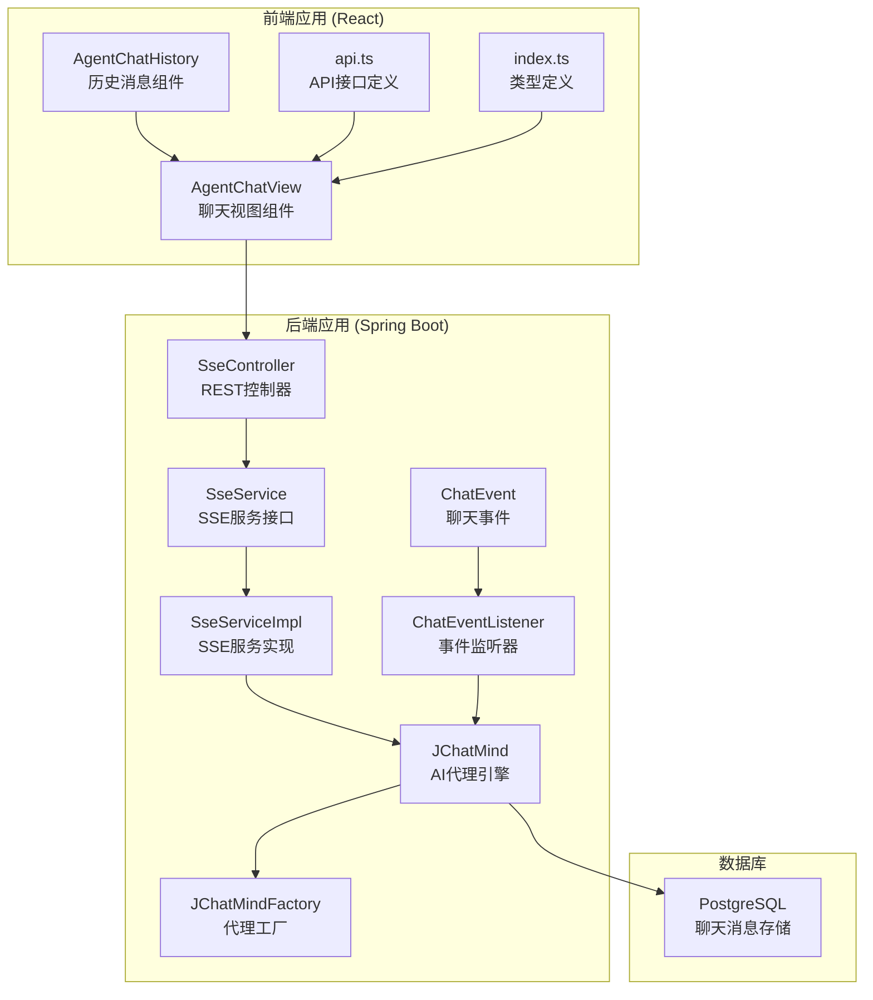
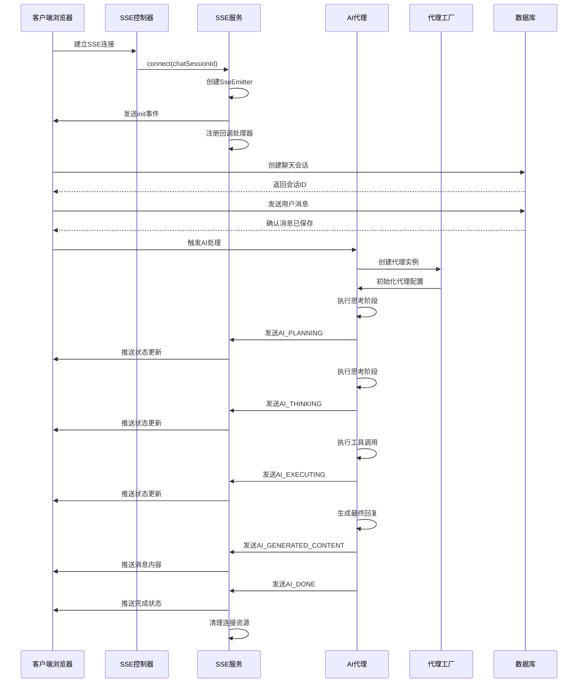
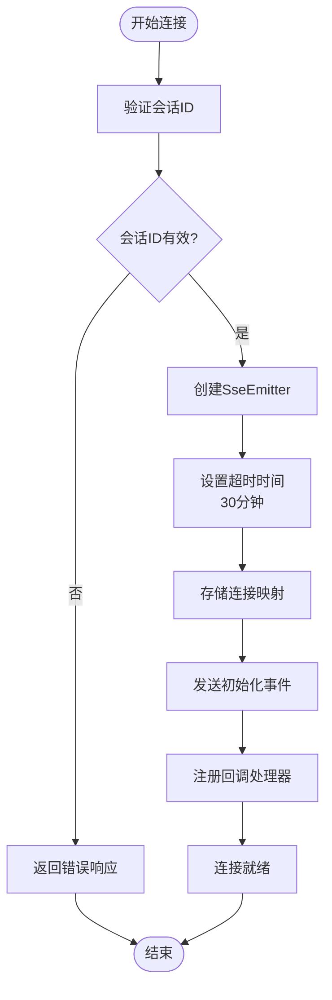
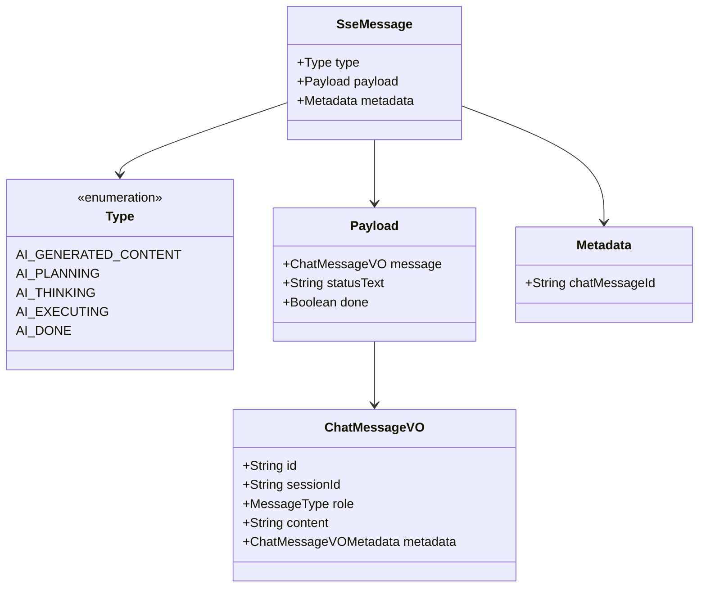
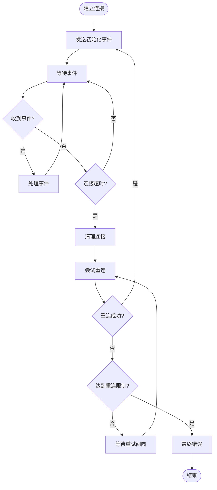
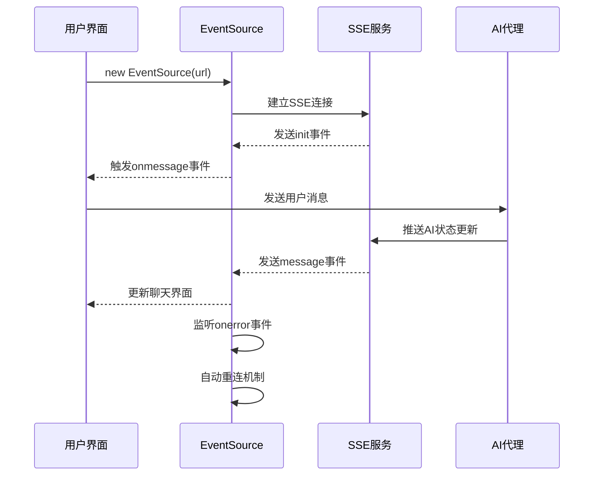
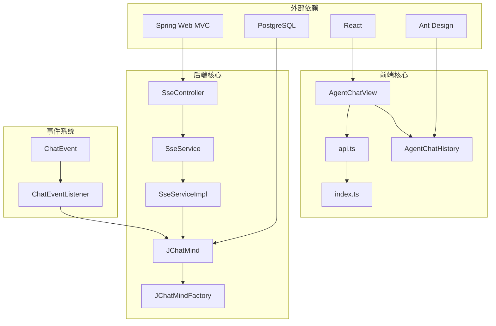

# 实时通信API

<cite>
**本文档引用的文件**
- [SseController.java](file://jchatmind/src/main/java/com/kama/jchatmind/controller/SseController.java)
- [SseServiceImpl.java](file://jchatmind/src/main/java/com/kama/jchatmind/service/impl/SseServiceImpl.java)
- [SseService.java](file://jchatmind/src/main/java/com/kama/jchatmind/service/SseService.java)
- [SseMessage.java](file://jchatmind/src/main/java/com/kama/jchatmind/message/SseMessage.java)
- [ChatEvent.java](file://jchatmind/src/main/java/com/kama/jchatmind/event/ChatEvent.java)
- [ChatEventListener.java](file://jchatmind/src/main/java/com/kama/jchatmind/event/listener/ChatEventListener.java)
- [JChatMind.java](file://jchatmind/src/main/java/com/kama/jchatmind/agent/JChatMind.java)
- [JChatMindFactory.java](file://jchatmind/src/main/java/com/kama/jchatmind/agent/JChatMindFactory.java)
- [AgentChatView.tsx](file://ui/src/components/views/AgentChatView.tsx)
- [api.ts](file://ui/src/api/api.ts)
- [index.ts](file://ui/src/types/index.ts)
- [AgentChatHistory.tsx](file://ui/src/components/views/agentChatView/AgentChatHistory.tsx)
- [application.yaml](file://jchatmind/src/main/resources/application.yaml)
</cite>

## 目录
1. [简介](#简介)
2. [项目结构](#项目结构)
3. [核心组件](#核心组件)
4. [架构概览](#架构概览)
5. [详细组件分析](#详细组件分析)
6. [依赖关系分析](#依赖关系分析)
7. [性能考虑](#性能考虑)
8. [故障排除指南](#故障排除指南)
9. [结论](#结论)

## 简介

JChatMind项目实现了基于Spring Web MVC的服务器推送事件（Server-Sent Events, SSE）实时通信API。该系统为聊天应用提供了高效的双向通信机制，支持AI代理的状态更新、消息流式传输和实时状态同步。系统采用事件驱动架构，通过SSE实现从后端到前端的实时数据推送，同时保持良好的性能和可扩展性。

## 项目结构

JChatMind项目采用分层架构设计，主要分为后端Spring Boot应用和前端React应用两部分：

**图表来源**
- [SseController.java:1-24](file://jchatmind/src/main/java/com/kama/jchatmind/controller/SseController.java#L1-L24)
- [SseServiceImpl.java:1-64](file://jchatmind/src/main/java/com/kama/jchatmind/service/impl/SseServiceImpl.java#L1-L64)
- [AgentChatView.tsx:1-200](file://ui/src/components/views/AgentChatView.tsx#L1-L200)

**章节来源**
- [SseController.java:1-24](file://jchatmind/src/main/java/com/kama/jchatmind/controller/SseController.java#L1-L24)
- [SseServiceImpl.java:1-64](file://jchatmind/src/main/java/com/kama/jchatmind/service/impl/SseServiceImpl.java#L1-L64)
- [AgentChatView.tsx:1-200](file://ui/src/components/views/AgentChatView.tsx#L1-L200)

## 核心组件

### SSE控制器层

SSE控制器负责处理客户端的连接请求，提供统一的SSE连接入口点。

### SSE服务层

SSE服务层管理客户端连接池，处理消息发送和连接生命周期管理。

### AI代理引擎

AI代理引擎负责处理聊天逻辑，包括思考、规划、执行等阶段，并通过SSE向客户端推送状态更新。

### 前端集成层

前端组件负责建立SSE连接，处理消息接收和状态更新，提供用户友好的聊天界面。

**章节来源**
- [SseController.java:18-22](file://jchatmind/src/main/java/com/kama/jchatmind/controller/SseController.java#L18-L22)
- [SseService.java:6-11](file://jchatmind/src/main/java/com/kama/jchatmind/service/SseService.java#L6-L11)
- [SseServiceImpl.java:21-42](file://jchatmind/src/main/java/com/kama/jchatmind/service/impl/SseServiceImpl.java#L21-L42)

## 架构概览

JChatMind的SSE实时通信架构采用事件驱动设计，实现了从用户输入到AI响应的完整实时流程：

**图表来源**
- [SseController.java:19-22](file://jchatmind/src/main/java/com/kama/jchatmind/controller/SseController.java#L19-L22)
- [SseServiceImpl.java:22-42](file://jchatmind/src/main/java/com/kama/jchatmind/service/impl/SseServiceImpl.java#L22-L42)
- [JChatMind.java:316-337](file://jchatmind/src/main/java/com/kama/jchatmind/agent/JChatMind.java#L316-L337)

## 详细组件分析

### SSE连接建立流程

SSE连接建立过程遵循标准的HTTP连接模式，但具有特殊的事件流特性：

**图表来源**
- [SseServiceImpl.java:22-42](file://jchatmind/src/main/java/com/kama/jchatmind/service/impl/SseServiceImpl.java#L22-L42)

### 消息格式规范

SSE消息采用JSON格式，包含三个核心部分：

#### 基本消息结构

| 字段名 | 类型 | 必需 | 描述 |
|--------|------|------|------|
| type | string | 是 | 消息类型枚举 |
| payload | object | 是 | 消息载荷数据 |
| metadata | object | 否 | 元数据信息 |

#### 消息类型定义

系统支持五种预定义的消息类型：

1. **AI_GENERATED_CONTENT**: AI生成的内容消息
2. **AI_PLANNING**: AI规划阶段状态
3. **AI_THINKING**: AI思考阶段状态
4. **AI_EXECUTING**: AI执行阶段状态
5. **AI_DONE**: AI处理完成状态

#### 载荷数据结构

| 字段名 | 类型 | 必需 | 描述 |
|--------|------|------|------|
| message | ChatMessageVO | 否 | 聊天消息对象 |
| statusText | string | 否 | 状态文本描述 |
| done | boolean | 否 | 处理完成标志 |

#### 元数据结构

| 字段名 | 类型 | 必需 | 描述 |
|--------|------|------|------|
| chatMessageId | string | 否 | 聊天消息ID |

**章节来源**
- [SseMessage.java:11-46](file://jchatmind/src/main/java/com/kama/jchatmind/message/SseMessage.java#L11-L46)
- [index.ts:52-56](file://ui/src/types/index.ts#L52-L56)

### 事件类型和处理机制

系统实现了完整的事件驱动架构，支持多种事件类型的处理：

**图表来源**
- [SseMessage.java:11-46](file://jchatmind/src/main/java/com/kama/jchatmind/message/SseMessage.java#L11-L46)
- [index.ts:27-33](file://ui/src/types/index.ts#L27-L33)

### 断线重连机制

系统实现了完善的断线重连策略，确保连接的稳定性和可靠性：

**图表来源**
- [SseServiceImpl.java:35-39](file://jchatmind/src/main/java/com/kama/jchatmind/service/impl/SseServiceImpl.java#L35-L39)

### SSE服务实现

SSE服务实现了连接管理和消息发送的核心逻辑：

#### 连接管理特性

- **并发安全**: 使用ConcurrentHashMap存储连接映射
- **超时控制**: 设置30分钟的连接超时时间
- **资源清理**: 自动清理断开的连接
- **异常处理**: 统一的异常处理和错误传播

#### 消息发送机制

- **异步发送**: 使用SseEmitter的异步发送能力
- **JSON序列化**: 自动将消息对象转换为JSON格式
- **事件命名**: 支持自定义事件名称
- **错误恢复**: 处理发送过程中的网络异常

**章节来源**
- [SseServiceImpl.java:18-62](file://jchatmind/src/main/java/com/kama/jchatmind/service/impl/SseServiceImpl.java#L18-L62)

### 前端JavaScript集成

前端实现了完整的SSE客户端集成，提供了用户友好的聊天界面：

#### 连接建立和管理

前端使用原生EventSource API建立SSE连接，支持自动重连和错误处理：

**图表来源**
- [AgentChatView.tsx:120-170](file://ui/src/components/views/AgentChatView.tsx#L120-L170)

#### 消息处理和状态同步

前端组件实现了复杂的消息处理逻辑，包括：

- **消息类型识别**: 根据消息类型执行不同的处理逻辑
- **状态栏管理**: 动态显示AI处理状态
- **消息聚合**: 将AI生成的内容合并到消息列表
- **界面更新**: 实时更新聊天界面状态

**章节来源**
- [AgentChatView.tsx:135-160](file://ui/src/components/views/AgentChatView.tsx#L135-L160)
- [AgentChatHistory.tsx:166-182](file://ui/src/components/views/agentChatView/AgentChatHistory.tsx#L166-L182)

## 依赖关系分析

JChatMind的SSE系统展现了清晰的依赖层次结构：

**图表来源**
- [SseController.java:1-24](file://jchatmind/src/main/java/com/kama/jchatmind/controller/SseController.java#L1-L24)
- [AgentChatView.tsx:1-200](file://ui/src/components/views/AgentChatView.tsx#L1-L200)

**章节来源**
- [JChatMindFactory.java:34-70](file://jchatmind/src/main/java/com/kama/jchatmind/agent/JChatMindFactory.java#L34-L70)
- [ChatEventListener.java:12-24](file://jchatmind/src/main/java/com/kama/jchatmind/event/listener/ChatEventListener.java#L12-L24)

## 性能考虑

### 连接池管理

系统使用ConcurrentHashMap实现高效的连接池管理，支持高并发场景下的连接处理：

- **内存效率**: 使用轻量级的连接映射结构
- **并发安全**: 线程安全的连接存储和访问
- **资源回收**: 自动清理断开的连接，防止内存泄漏

### 消息流优化

- **异步发送**: 使用SseEmitter的异步发送能力，避免阻塞主线程
- **批量处理**: 将待发送的消息批量处理，减少网络往返
- **压缩传输**: 对消息内容进行适当的压缩，减少带宽占用

### 前端性能优化

前端组件实现了多项性能优化措施：

- **虚拟滚动**: 大消息列表的虚拟化渲染
- **懒加载**: 图片和长内容的懒加载机制
- **防抖处理**: 输入和滚动事件的防抖优化
- **内存管理**: 及时清理不再使用的DOM元素和事件监听器

## 故障排除指南

### 常见连接问题

#### 连接超时

**症状**: 客户端无法建立SSE连接或连接很快断开

**解决方案**:
1. 检查服务器端口和防火墙设置
2. 验证SseEmitter的超时配置
3. 确认网络连接稳定性

#### CORS跨域问题

**症状**: 浏览器出现CORS错误，无法建立连接

**解决方案**:
1. 配置Spring Boot的CORS设置
2. 确认前端域名和端口配置
3. 检查代理服务器设置

#### 连接池溢出

**症状**: 新连接无法建立，出现连接数过多错误

**解决方案**:
1. 调整连接池大小配置
2. 实施连接超时清理机制
3. 监控连接使用情况

### 消息传输问题

#### 消息丢失

**症状**: 客户端接收不到某些消息

**排查步骤**:
1. 检查SseEmitter的发送状态
2. 验证消息序列化过程
3. 确认客户端事件监听器

#### 消息乱序

**症状**: 客户端接收到的消息顺序不正确

**解决方案**:
1. 实现消息序号机制
2. 在客户端进行消息排序
3. 使用队列保证消息顺序

### 前端集成问题

#### 重连机制失效

**症状**: 断线后无法自动重连

**排查方法**:
1. 检查EventSource的onerror事件处理
2. 验证重连间隔和最大重试次数
3. 确认网络状态检测逻辑

#### 内存泄漏

**症状**: 页面长时间运行后内存占用持续增长

**预防措施**:
1. 确保及时清理EventSource实例
2. 移除事件监听器
3. 及时释放DOM引用

**章节来源**
- [SseServiceImpl.java:35-39](file://jchatmind/src/main/java/com/kama/jchatmind/service/impl/SseServiceImpl.java#L35-L39)
- [AgentChatView.tsx:166-169](file://ui/src/components/views/AgentChatView.tsx#L166-L169)

## 结论

JChatMind项目的SSE实时通信API展现了现代Web应用的优秀实践。系统通过事件驱动架构实现了高效、可靠的实时通信，支持复杂的AI代理交互场景。

### 主要优势

1. **架构清晰**: 分层设计使得系统易于维护和扩展
2. **性能优异**: 并发连接管理和异步处理确保高吞吐量
3. **用户体验**: 实时状态更新和流畅的聊天体验
4. **技术栈成熟**: 基于Spring Boot和React的稳定技术组合

### 技术特色

- **事件驱动**: 完整的事件处理机制支持复杂的业务流程
- **实时通信**: 基于SSE的双向通信实现
- **状态管理**: 完善的客户端状态同步机制
- **错误处理**: 全面的异常处理和恢复策略

### 应用场景

该SSE实时通信API特别适用于：
- AI聊天应用
- 实时协作工具
- 在线教育平台
- 实时监控系统
- 即时通讯应用

通过合理的设计和实现，JChatMind的SSE系统为构建高性能的实时Web应用提供了坚实的基础。