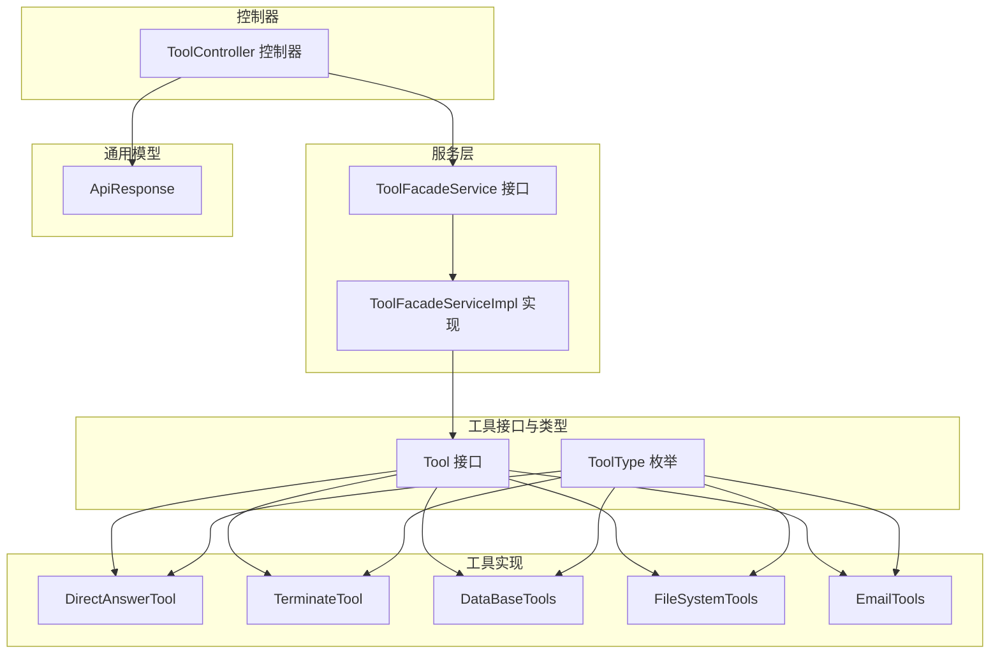
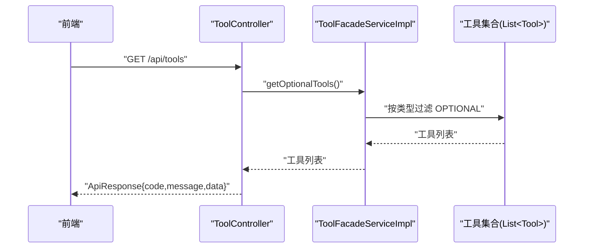
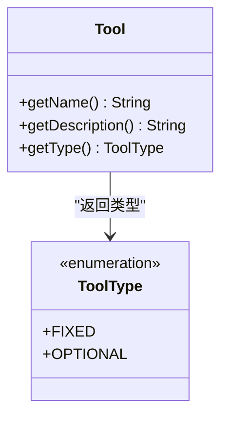
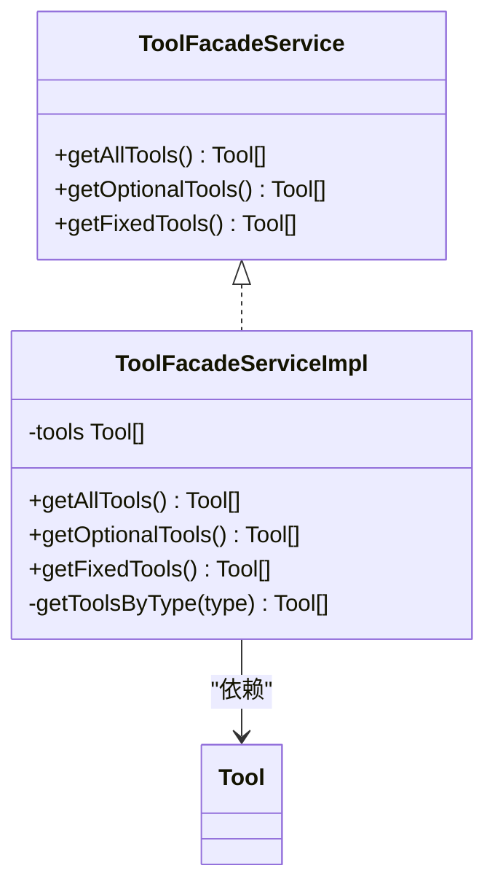
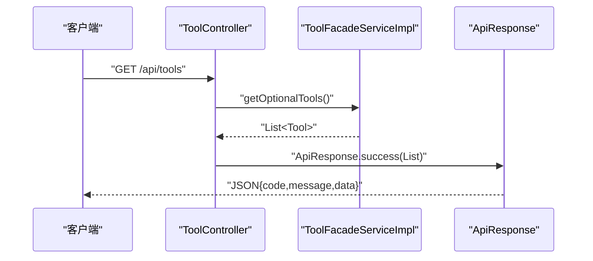
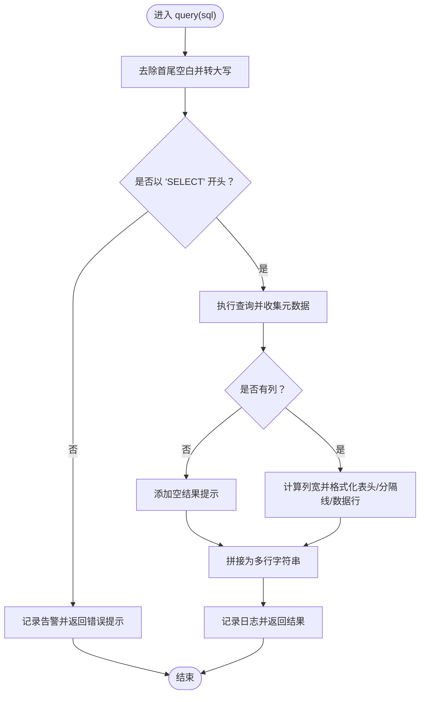
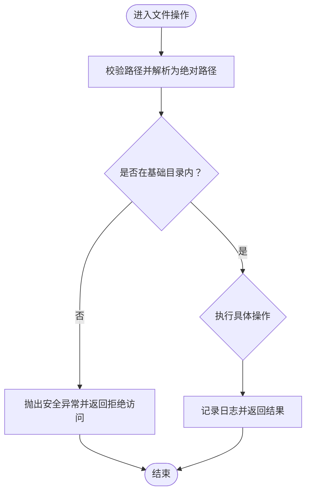
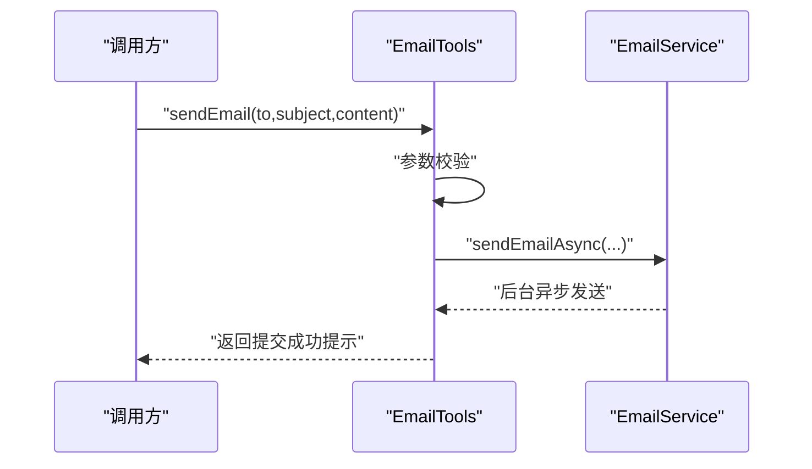
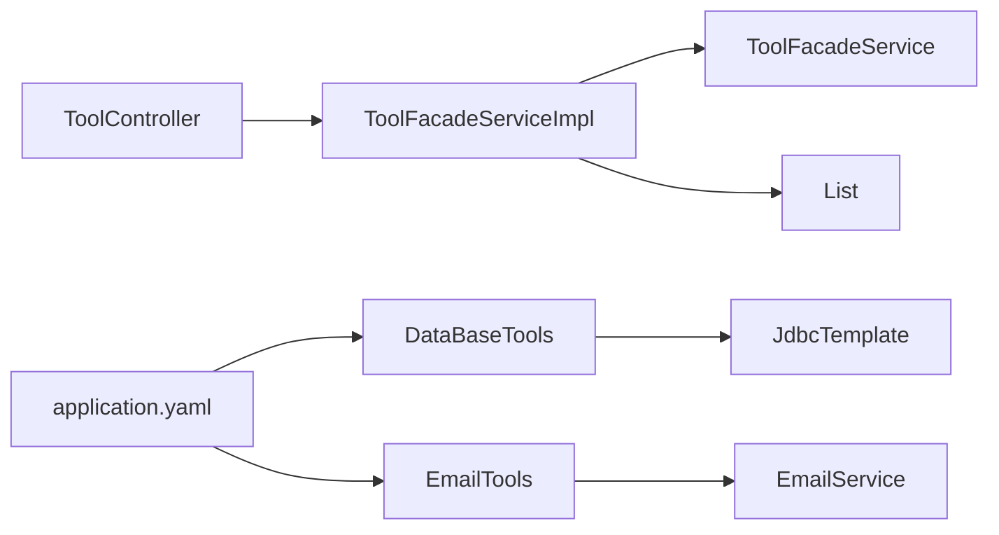

# 工具调用API

<cite>
**本文引用的文件**
- [Tool.java](file://jchatmind/src/main/java/com/kama/jchatmind/agent/tools/Tool.java)
- [ToolType.java](file://jchatmind/src/main/java/com/kama/jchatmind/agent/tools/ToolType.java)
- [ToolController.java](file://jchatmind/src/main/java/com/kama/jchatmind/controller/ToolController.java)
- [ToolFacadeService.java](file://jchatmind/src/main/java/com/kama/jchatmind/service/ToolFacadeService.java)
- [ToolFacadeServiceImpl.java](file://jchatmind/src/main/java/com/kama/jchatmind/service/impl/ToolFacadeServiceImpl.java)
- [DirectAnswerTool.java](file://jchatmind/src/main/java/com/kama/jchatmind/agent/tools/DirectAnswerTool.java)
- [TerminateTool.java](file://jchatmind/src/main/java/com/kama/jchatmind/agent/tools/TerminateTool.java)
- [DataBaseTools.java](file://jchatmind/src/main/java/com/kama/jchatmind/agent/tools/DataBaseTools.java)
- [FileSystemTools.java](file://jchatmind/src/main/java/com/kama/jchatmind/agent/tools/FileSystemTools.java)
- [EmailTools.java](file://jchatmind/src/main/java/com/kama/jchatmind/agent/tools/EmailTools.java)
- [ApiResponse.java](file://jchatmind/src/main/java/com/kama/jchatmind/model/common/ApiResponse.java)
- [application.yaml](file://jchatmind/src/main/resources/application.yaml)
- [JchatmindApplication.java](file://jchatmind/src/main/java/com/kama/jchatmind/JchatmindApplication.java)
</cite>

## 目录
1. [简介](#简介)
2. [项目结构](#项目结构)
3. [核心组件](#核心组件)
4. [架构总览](#架构总览)
5. [详细组件分析](#详细组件分析)
6. [依赖分析](#依赖分析)
7. [性能考虑](#性能考虑)
8. [故障排查指南](#故障排查指南)
9. [结论](#结论)
10. [附录](#附录)

## 简介
本文件为“工具调用API”的完整参考文档，面向后端开发者与集成方，系统性说明工具体系的接口规范、注册机制、类型分类、参数校验、返回格式、异步处理、超时与错误恢复、权限与安全策略，以及工具链组合与条件执行等高级用法。文档同时覆盖内置工具与可扩展自定义工具的统一调用方式，帮助快速接入与稳定运行。

## 项目结构
工具系统位于后端模块 jchatmind 的 agent.tools 包下，通过 Spring 管理的工具集合对外暴露统一能力；控制器 ToolController 提供前端可选工具清单；服务层 ToolFacadeService/Impl 负责工具聚合与筛选；各具体工具实现 Tool 接口并通过注解声明可被模型识别的工具方法。

图表来源
- [Tool.java:1-10](file://jchatmind/src/main/java/com/kama/jchatmind/agent/tools/Tool.java#L1-L10)
- [ToolType.java:1-9](file://jchatmind/src/main/java/com/kama/jchatmind/agent/tools/ToolType.java#L1-L9)
- [ToolFacadeService.java:1-14](file://jchatmind/src/main/java/com/kama/jchatmind/service/ToolFacadeService.java#L1-L14)
- [ToolFacadeServiceImpl.java:1-38](file://jchatmind/src/main/java/com/kama/jchatmind/service/impl/ToolFacadeServiceImpl.java#L1-L38)
- [ToolController.java:1-26](file://jchatmind/src/main/java/com/kama/jchatmind/controller/ToolController.java#L1-L26)
- [DirectAnswerTool.java:1-30](file://jchatmind/src/main/java/com/kama/jchatmind/agent/tools/DirectAnswerTool.java#L1-L30)
- [TerminateTool.java:1-26](file://jchatmind/src/main/java/com/kama/jchatmind/agent/tools/TerminateTool.java#L1-L26)
- [DataBaseTools.java:1-147](file://jchatmind/src/main/java/com/kama/jchatmind/agent/tools/DataBaseTools.java#L1-L147)
- [FileSystemTools.java:1-342](file://jchatmind/src/main/java/com/kama/jchatmind/agent/tools/FileSystemTools.java#L1-L342)
- [EmailTools.java:1-68](file://jchatmind/src/main/java/com/kama/jchatmind/agent/tools/EmailTools.java#L1-L68)
- [ApiResponse.java:1-59](file://jchatmind/src/main/java/com/kama/jchatmind/model/common/ApiResponse.java#L1-L59)

章节来源
- [Tool.java:1-10](file://jchatmind/src/main/java/com/kama/jchatmind/agent/tools/Tool.java#L1-L10)
- [ToolType.java:1-9](file://jchatmind/src/main/java/com/kama/jchatmind/agent/tools/ToolType.java#L1-L9)
- [ToolController.java:1-26](file://jchatmind/src/main/java/com/kama/jchatmind/controller/ToolController.java#L1-L26)
- [ToolFacadeService.java:1-14](file://jchatmind/src/main/java/com/kama/jchatmind/service/ToolFacadeService.java#L1-L14)
- [ToolFacadeServiceImpl.java:1-38](file://jchatmind/src/main/java/com/kama/jchatmind/service/impl/ToolFacadeServiceImpl.java#L1-L38)
- [ApiResponse.java:1-59](file://jchatmind/src/main/java/com/kama/jchatmind/model/common/ApiResponse.java#L1-L59)

## 核心组件
- 工具接口与类型
  - Tool 接口：定义工具名称、描述与类型三要素，作为所有工具的契约。
  - ToolType 枚举：区分 FIXED（固定拥有）与 OPTIONAL（可选工具），用于工具清单筛选与权限控制。
- 服务层
  - ToolFacadeService：提供获取全部工具、可选工具、固定工具的能力。
  - ToolFacadeServiceImpl：基于 Spring 注入的工具列表进行按类型过滤。
- 控制器
  - ToolController：提供 GET /api/tools 接口，返回可选工具清单，使用统一响应体 ApiResponse。
- 统一响应体
  - ApiResponse：封装 code、message、data 字段，提供 success/error 静态工厂方法，便于前后端一致的交互。

章节来源
- [Tool.java:1-10](file://jchatmind/src/main/java/com/kama/jchatmind/agent/tools/Tool.java#L1-L10)
- [ToolType.java:1-9](file://jchatmind/src/main/java/com/kama/jchatmind/agent/tools/ToolType.java#L1-L9)
- [ToolFacadeService.java:1-14](file://jchatmind/src/main/java/com/kama/jchatmind/service/ToolFacadeService.java#L1-L14)
- [ToolFacadeServiceImpl.java:1-38](file://jchatmind/src/main/java/com/kama/jchatmind/service/impl/ToolFacadeServiceImpl.java#L1-L38)
- [ToolController.java:1-26](file://jchatmind/src/main/java/com/kama/jchatmind/controller/ToolController.java#L1-L26)
- [ApiResponse.java:1-59](file://jchatmind/src/main/java/com/kama/jchatmind/model/common/ApiResponse.java#L1-L59)

## 架构总览
工具调用API采用“接口抽象 + Spring 注入 + 控制器暴露 + 统一响应”的分层设计。工具实现遵循 Tool 接口并通过注解声明可被模型识别的方法；服务层负责聚合与筛选；控制器提供只读接口；响应体统一标准化。

图表来源
- [ToolController.java:1-26](file://jchatmind/src/main/java/com/kama/jchatmind/controller/ToolController.java#L1-L26)
- [ToolFacadeServiceImpl.java:1-38](file://jchatmind/src/main/java/com/kama/jchatmind/service/impl/ToolFacadeServiceImpl.java#L1-L38)
- [Tool.java:1-10](file://jchatmind/src/main/java/com/kama/jchatmind/agent/tools/Tool.java#L1-L10)

## 详细组件分析

### 工具接口与类型
- Tool 接口
  - 方法：getName()、getDescription()、getType()。
  - 作用：统一工具元数据，便于注册、筛选与展示。
- ToolType 类型
  - FIXED：所有 Agent 必须具备的工具（如直接回答、终止循环）。
  - OPTIONAL：可按需启用的工具（如数据库查询、文件系统、邮件）。

图表来源
- [Tool.java:1-10](file://jchatmind/src/main/java/com/kama/jchatmind/agent/tools/Tool.java#L1-L10)
- [ToolType.java:1-9](file://jchatmind/src/main/java/com/kama/jchatmind/agent/tools/ToolType.java#L1-L9)

章节来源
- [Tool.java:1-10](file://jchatmind/src/main/java/com/kama/jchatmind/agent/tools/Tool.java#L1-L10)
- [ToolType.java:1-9](file://jchatmind/src/main/java/com/kama/jchatmind/agent/tools/ToolType.java#L1-L9)

### 服务层：工具聚合与筛选
- ToolFacadeService
  - getAllTools()：返回全部工具。
  - getOptionalTools()：返回类型为 OPTIONAL 的工具。
  - getFixedTools()：返回类型为 FIXED 的工具。
- ToolFacadeServiceImpl
  - 通过构造注入 List<Tool>，内部使用流式过滤按类型返回。

图表来源
- [ToolFacadeService.java:1-14](file://jchatmind/src/main/java/com/kama/jchatmind/service/ToolFacadeService.java#L1-L14)
- [ToolFacadeServiceImpl.java:1-38](file://jchatmind/src/main/java/com/kama/jchatmind/service/impl/ToolFacadeServiceImpl.java#L1-L38)

章节来源
- [ToolFacadeService.java:1-14](file://jchatmind/src/main/java/com/kama/jchatmind/service/ToolFacadeService.java#L1-L14)
- [ToolFacadeServiceImpl.java:1-38](file://jchatmind/src/main/java/com/kama/jchatmind/service/impl/ToolFacadeServiceImpl.java#L1-L38)

### 控制器：工具清单接口
- ToolController
  - 路径：/api/tools
  - 方法：GET
  - 返回：ApiResponse<List<Tool>>，其中 data 为可选工具列表。
- 统一响应体
  - 成功：code=200，message="success"，data=工具列表。
  - 失败：使用 error 工厂方法设置错误码与消息。

图表来源
- [ToolController.java:1-26](file://jchatmind/src/main/java/com/kama/jchatmind/controller/ToolController.java#L1-L26)
- [ToolFacadeServiceImpl.java:1-38](file://jchatmind/src/main/java/com/kama/jchatmind/service/impl/ToolFacadeServiceImpl.java#L1-L38)
- [ApiResponse.java:1-59](file://jchatmind/src/main/java/com/kama/jchatmind/model/common/ApiResponse.java#L1-L59)

章节来源
- [ToolController.java:1-26](file://jchatmind/src/main/java/com/kama/jchatmind/controller/ToolController.java#L1-L26)
- [ApiResponse.java:1-59](file://jchatmind/src/main/java/com/kama/jchatmind/model/common/ApiResponse.java#L1-L59)

### 内置工具详解

#### 直接回答工具（DirectAnswerTool）
- 类型：FIXED
- 用途：当无需执行其他操作时，直接返回自然语言回答。
- 关键点：通过注解声明工具方法，便于模型识别与调用。

章节来源
- [DirectAnswerTool.java:1-30](file://jchatmind/src/main/java/com/kama/jchatmind/agent/tools/DirectAnswerTool.java#L1-L30)

#### 终止工具（TerminateTool）
- 类型：FIXED
- 用途：在任务完成后跳出 Agent 循环。
- 关键点：通过注解声明工具方法，便于模型识别与调用。

章节来源
- [TerminateTool.java:1-26](file://jchatmind/src/main/java/com/kama/jchatmind/agent/tools/TerminateTool.java#L1-L26)

#### 数据库查询工具（DataBaseTools）
- 类型：OPTIONAL
- 功能：在 PostgreSQL 中执行只读查询（SELECT），返回格式化表格结果。
- 参数与校验：
  - sql：必填，仅支持 SELECT 开头的查询语句；否则拒绝执行并返回错误提示。
- 安全与健壮性：
  - 严格限制只读查询，捕获异常并返回结构化错误信息。
  - 对空结果、列数为0等边界情况做兼容处理。
- 返回格式：
  - 成功：包含“查询结果”前缀的多行表格字符串。
  - 失败：包含错误信息与原始 SQL 的提示文本。

图表来源
- [DataBaseTools.java:1-147](file://jchatmind/src/main/java/com/kama/jchatmind/agent/tools/DataBaseTools.java#L1-L147)

章节来源
- [DataBaseTools.java:1-147](file://jchatmind/src/main/java/com/kama/jchatmind/agent/tools/DataBaseTools.java#L1-L147)

#### 文件系统工具（FileSystemTools）
- 类型：OPTIONAL
- 功能：读取、写入、追加、列出、删除、创建目录等文件系统操作。
- 安全策略：
  - 限定基础目录为工作目录，禁止路径遍历；对越权路径抛出安全异常。
  - 对不存在的父目录自动创建，避免写入失败。
- 参数与校验：
  - 各方法均对输入路径进行合法性检查与解析。
- 返回格式：
  - 成功：操作结果描述文本。
  - 失败：包含错误原因的提示文本（含 IO/安全/未知异常分支）。

图表来源
- [FileSystemTools.java:1-342](file://jchatmind/src/main/java/com/kama/jchatmind/agent/tools/FileSystemTools.java#L1-L342)

章节来源
- [FileSystemTools.java:1-342](file://jchatmind/src/main/java/com/kama/jchatmind/agent/tools/FileSystemTools.java#L1-L342)

#### 邮件工具（EmailTools）
- 类型：OPTIONAL
- 功能：异步发送邮件（QQ邮箱 SMTP），不阻塞工具调用。
- 参数与校验：
  - to、subject、content 均不可为空；to 必须包含“@”字符。
- 异步处理：
  - 调用 EmailService 的异步发送方法，立即返回提交成功的提示信息。
- 返回格式：
  - 成功：包含收件人与主题的提交提示文本。
  - 失败：包含具体错误原因的提示文本。

图表来源
- [EmailTools.java:1-68](file://jchatmind/src/main/java/com/kama/jchatmind/agent/tools/EmailTools.java#L1-L68)

章节来源
- [EmailTools.java:1-68](file://jchatmind/src/main/java/com/kama/jchatmind/agent/tools/EmailTools.java#L1-L68)

### 自定义工具扩展指南
- 实现步骤
  - 实现 Tool 接口，提供名称、描述与类型。
  - 在类上添加 @Component 注解，纳入 Spring 容器。
  - 使用工具方法注解声明可被模型识别的工具函数。
  - 将工具方法放入工具集合，即可被 ToolController 暴露的 /api/tools 接口返回。
- 注意事项
  - 类型选择：若工具为通用必需能力，建议设为 FIXED；若为特定场景能力，建议设为 OPTIONAL。
  - 安全与健壮性：遵循现有工具的安全策略（如路径校验、只读查询、参数校验）。
  - 返回格式：保持一致的文本化结果，便于模型二次处理或前端展示。

章节来源
- [Tool.java:1-10](file://jchatmind/src/main/java/com/kama/jchatmind/agent/tools/Tool.java#L1-L10)
- [ToolType.java:1-9](file://jchatmind/src/main/java/com/kama/jchatmind/agent/tools/ToolType.java#L1-L9)
- [ToolFacadeServiceImpl.java:1-38](file://jchatmind/src/main/java/com/kama/jchatmind/service/impl/ToolFacadeServiceImpl.java#L1-L38)

## 依赖分析
- 组件耦合
  - ToolController 依赖 ToolFacadeService；ToolFacadeServiceImpl 依赖 List<Tool>。
  - 各工具实现依赖外部服务（如数据库模板、邮件服务），但通过构造注入降低紧耦合。
- 外部依赖
  - 数据库：PostgreSQL，JDBC 模板用于只读查询。
  - 邮件：QQ 邮箱 SMTP，异步发送。
- 配置来源
  - 数据源、邮件、AI 模型等配置集中在 application.yaml。

图表来源
- [ToolController.java:1-26](file://jchatmind/src/main/java/com/kama/jchatmind/controller/ToolController.java#L1-L26)
- [ToolFacadeServiceImpl.java:1-38](file://jchatmind/src/main/java/com/kama/jchatmind/service/impl/ToolFacadeServiceImpl.java#L1-L38)
- [DataBaseTools.java:1-147](file://jchatmind/src/main/java/com/kama/jchatmind/agent/tools/DataBaseTools.java#L1-L147)
- [EmailTools.java:1-68](file://jchatmind/src/main/java/com/kama/jchatmind/agent/tools/EmailTools.java#L1-L68)
- [application.yaml:1-43](file://jchatmind/src/main/resources/application.yaml#L1-L43)

章节来源
- [application.yaml:1-43](file://jchatmind/src/main/resources/application.yaml#L1-L43)
- [JchatmindApplication.java:1-14](file://jchatmind/src/main/java/com/kama/jchatmind/JchatmindApplication.java#L1-L14)

## 性能考虑
- 工具调用
  - 读取类工具（数据库查询、文件读取）应避免大结果集与深层目录扫描，必要时分页或限流。
- 异步处理
  - 邮件发送采用异步，避免阻塞工具调用；建议结合队列或线程池优化吞吐。
- 超时与重试
  - 建议在工具方法内部设置合理超时与重试策略（如数据库连接、网络请求），并在失败时返回明确错误信息。
- 日志与监控
  - 对关键路径增加日志埋点，结合指标监控工具评估延迟与错误率。

## 故障排查指南
- 常见问题
  - 工具未出现在 /api/tools 列表：确认工具类已标注 @Component 并被 Spring 扫描；确认工具实现 Tool 接口且类型正确。
  - 数据库查询失败：检查 SQL 是否为 SELECT 开头；查看日志中的错误堆栈；确认数据库连通性与权限。
  - 文件系统操作失败：检查路径是否越权；确认目标路径是否存在且可访问；查看安全异常日志。
  - 邮件发送未生效：确认 application.yaml 中 SMTP 配置正确；检查异步发送是否触发；查看邮件服务日志。
- 统一错误返回
  - 使用 ApiResponse.error(...) 返回标准化错误信息，便于前端与监控系统统一处理。

章节来源
- [ToolController.java:1-26](file://jchatmind/src/main/java/com/kama/jchatmind/controller/ToolController.java#L1-L26)
- [ApiResponse.java:1-59](file://jchatmind/src/main/java/com/kama/jchatmind/model/common/ApiResponse.java#L1-L59)
- [DataBaseTools.java:1-147](file://jchatmind/src/main/java/com/kama/jchatmind/agent/tools/DataBaseTools.java#L1-L147)
- [FileSystemTools.java:1-342](file://jchatmind/src/main/java/com/kama/jchatmind/agent/tools/FileSystemTools.java#L1-L342)
- [EmailTools.java:1-68](file://jchatmind/src/main/java/com/kama/jchatmind/agent/tools/EmailTools.java#L1-L68)

## 结论
本工具调用API以 Tool 接口为核心，配合 ToolType 分类、ToolFacade 服务与统一响应体，形成清晰、可扩展、安全可控的工具体系。内置工具覆盖直接回答、终止循环、数据库查询、文件系统与邮件发送等典型场景；通过 OPTIONAL/FIXED 类型与 /api/tools 接口，既满足通用需求，又支持按需扩展。建议在生产环境中完善超时、重试、限流与安全策略，并结合日志与监控持续优化。

## 附录

### API 规范摘要
- 工具清单接口
  - 方法：GET
  - 路径：/api/tools
  - 返回：ApiResponse<List<Tool>>，data 为可选工具列表
- 工具类型
  - FIXED：Agent 必备工具
  - OPTIONAL：可选工具
- 参数与返回
  - 统一使用 ApiResponse，包含 code、message、data
  - 工具方法返回文本化结果，便于模型与前端处理

章节来源
- [ToolController.java:1-26](file://jchatmind/src/main/java/com/kama/jchatmind/controller/ToolController.java#L1-L26)
- [ToolType.java:1-9](file://jchatmind/src/main/java/com/kama/jchatmind/agent/tools/ToolType.java#L1-L9)
- [ApiResponse.java:1-59](file://jchatmind/src/main/java/com/kama/jchatmind/model/common/ApiResponse.java#L1-L59)