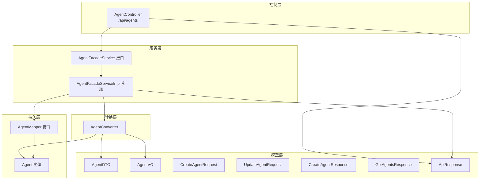
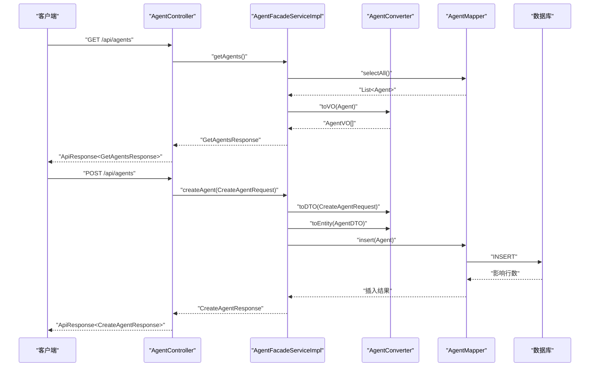
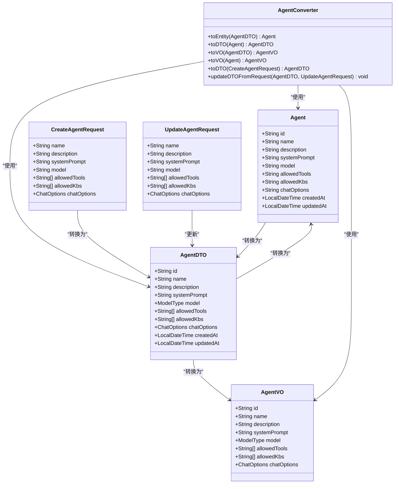
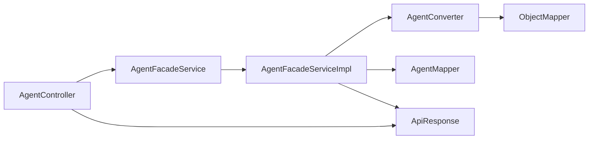

# 智能代理API

<cite>
**本文引用的文件**
- [AgentController.java](file://jchatmind/src/main/java/com/kama/jchatmind/controller/AgentController.java)
- [AgentFacadeService.java](file://jchatmind/src/main/java/com/kama/jchatmind/service/AgentFacadeService.java)
- [AgentFacadeServiceImpl.java](file://jchatmind/src/main/java/com/kama/jchatmind/service/impl/AgentFacadeServiceImpl.java)
- [AgentConverter.java](file://jchatmind/src/main/java/com/kama/jchatmind/converter/AgentConverter.java)
- [AgentMapper.java](file://jchatmind/src/main/java/com/kama/jchatmind/mapper/AgentMapper.java)
- [Agent.java](file://jchatmind/src/main/java/com/kama/jchatmind/model/entity/Agent.java)
- [AgentDTO.java](file://jchatmind/src/main/java/com/kama/jchatmind/model/dto/AgentDTO.java)
- [AgentVO.java](file://jchatmind/src/main/java/com/kama/jchatmind/model/vo/AgentVO.java)
- [CreateAgentRequest.java](file://jchatmind/src/main/java/com/kama/jchatmind/model/request/CreateAgentRequest.java)
- [UpdateAgentRequest.java](file://jchatmind/src/main/java/com/kama/jchatmind/model/request/UpdateAgentRequest.java)
- [CreateAgentResponse.java](file://jchatmind/src/main/java/com/kama/jchatmind/model/response/CreateAgentResponse.java)
- [GetAgentsResponse.java](file://jchatmind/src/main/java/com/kama/jchatmind/model/response/GetAgentsResponse.java)
- [ApiResponse.java](file://jchatmind/src/main/java/com/kama/jchatmind/model/common/ApiResponse.java)
</cite>

## 目录
1. [简介](#简介)
2. [项目结构](#项目结构)
3. [核心组件](#核心组件)
4. [架构总览](#架构总览)
5. [详细组件分析](#详细组件分析)
6. [依赖分析](#依赖分析)
7. [性能考虑](#性能考虑)
8. [故障排查指南](#故障排查指南)
9. [结论](#结论)
10. [附录](#附录)

## 简介
本文件为智能代理管理API的完整参考文档，覆盖代理的创建、查询、更新与删除等RESTful接口，详述HTTP方法、URL路径、请求参数、响应结构、状态码含义、配置参数说明（如模型类型、工具权限、知识库权限、系统提示词、聊天选项）、状态管理、配置校验规则与错误处理机制。文档同时提供调用流程图与类关系图，帮助开发者快速理解与集成。

## 项目结构
后端采用Spring Boot + MyBatis实现，控制器位于controller层，业务逻辑在service层，数据转换在converter层，持久化通过mapper接口对接数据库表。代理实体、DTO、VO分别承载不同阶段的数据形态，统一通过ApiResponse封装返回。

图表来源
- [AgentController.java:12-44](file://jchatmind/src/main/java/com/kama/jchatmind/controller/AgentController.java#L12-L44)
- [AgentFacadeService.java:8-16](file://jchatmind/src/main/java/com/kama/jchatmind/service/AgentFacadeService.java#L8-L16)
- [AgentFacadeServiceImpl.java:23-121](file://jchatmind/src/main/java/com/kama/jchatmind/service/impl/AgentFacadeServiceImpl.java#L23-L121)
- [AgentConverter.java:15-124](file://jchatmind/src/main/java/com/kama/jchatmind/converter/AgentConverter.java#L15-L124)
- [AgentMapper.java:14-25](file://jchatmind/src/main/java/com/kama/jchatmind/mapper/AgentMapper.java#L14-L25)
- [Agent.java:11-35](file://jchatmind/src/main/java/com/kama/jchatmind/model/entity/Agent.java#L11-L35)
- [AgentDTO.java:14-74](file://jchatmind/src/main/java/com/kama/jchatmind/model/dto/AgentDTO.java#L14-L74)
- [AgentVO.java:11-27](file://jchatmind/src/main/java/com/kama/jchatmind/model/vo/AgentVO.java#L11-L27)
- [CreateAgentRequest.java:8-17](file://jchatmind/src/main/java/com/kama/jchatmind/model/request/CreateAgentRequest.java#L8-L17)
- [UpdateAgentRequest.java:8-17](file://jchatmind/src/main/java/com/kama/jchatmind/model/request/UpdateAgentRequest.java#L8-L17)
- [CreateAgentResponse.java:6-10](file://jchatmind/src/main/java/com/kama/jchatmind/model/response/CreateAgentResponse.java#L6-L10)
- [GetAgentsResponse.java:7-11](file://jchatmind/src/main/java/com/kama/jchatmind/model/response/GetAgentsResponse.java#L7-L11)
- [ApiResponse.java:8-58](file://jchatmind/src/main/java/com/kama/jchatmind/model/common/ApiResponse.java#L8-L58)

章节来源
- [AgentController.java:12-44](file://jchatmind/src/main/java/com/kama/jchatmind/controller/AgentController.java#L12-L44)
- [AgentFacadeService.java:8-16](file://jchatmind/src/main/java/com/kama/jchatmind/service/AgentFacadeService.java#L8-L16)
- [AgentFacadeServiceImpl.java:23-121](file://jchatmind/src/main/java/com/kama/jchatmind/service/impl/AgentFacadeServiceImpl.java#L23-L121)
- [AgentConverter.java:15-124](file://jchatmind/src/main/java/com/kama/jchatmind/converter/AgentConverter.java#L15-L124)
- [AgentMapper.java:14-25](file://jchatmind/src/main/java/com/kama/jchatmind/mapper/AgentMapper.java#L14-L25)
- [Agent.java:11-35](file://jchatmind/src/main/java/com/kama/jchatmind/model/entity/Agent.java#L11-L35)
- [AgentDTO.java:14-74](file://jchatmind/src/main/java/com/kama/jchatmind/model/dto/AgentDTO.java#L14-L74)
- [AgentVO.java:11-27](file://jchatmind/src/main/java/com/kama/jchatmind/model/vo/AgentVO.java#L11-L27)
- [CreateAgentRequest.java:8-17](file://jchatmind/src/main/java/com/kama/jchatmind/model/request/CreateAgentRequest.java#L8-L17)
- [UpdateAgentRequest.java:8-17](file://jchatmind/src/main/java/com/kama/jchatmind/model/request/UpdateAgentRequest.java#L8-L17)
- [CreateAgentResponse.java:6-10](file://jchatmind/src/main/java/com/kama/jchatmind/model/response/CreateAgentResponse.java#L6-L10)
- [GetAgentsResponse.java:7-11](file://jchatmind/src/main/java/com/kama/jchatmind/model/response/GetAgentsResponse.java#L7-L11)
- [ApiResponse.java:8-58](file://jchatmind/src/main/java/com/kama/jchatmind/model/common/ApiResponse.java#L8-L58)

## 核心组件
- 控制器：提供RESTful端点，负责接收请求、组装响应。
- 门面服务：定义代理管理的业务契约，屏蔽具体实现细节。
- 服务实现：执行业务逻辑，包含参数校验、DTO/VO转换、持久化操作。
- 转换器：负责请求/实体/DTO/VO之间的相互转换，含JSON序列化/反序列化。
- 映射器：MyBatis Mapper接口，封装数据库操作。
- 模型：请求/响应/实体/值对象，承载代理的元数据与配置。

章节来源
- [AgentController.java:12-44](file://jchatmind/src/main/java/com/kama/jchatmind/controller/AgentController.java#L12-L44)
- [AgentFacadeService.java:8-16](file://jchatmind/src/main/java/com/kama/jchatmind/service/AgentFacadeService.java#L8-L16)
- [AgentFacadeServiceImpl.java:23-121](file://jchatmind/src/main/java/com/kama/jchatmind/service/impl/AgentFacadeServiceImpl.java#L23-L121)
- [AgentConverter.java:15-124](file://jchatmind/src/main/java/com/kama/jchatmind/converter/AgentConverter.java#L15-L124)
- [AgentMapper.java:14-25](file://jchatmind/src/main/java/com/kama/jchatmind/mapper/AgentMapper.java#L14-L25)
- [Agent.java:11-35](file://jchatmind/src/main/java/com/kama/jchatmind/model/entity/Agent.java#L11-L35)
- [AgentDTO.java:14-74](file://jchatmind/src/main/java/com/kama/jchatmind/model/dto/AgentDTO.java#L14-L74)
- [AgentVO.java:11-27](file://jchatmind/src/main/java/com/kama/jchatmind/model/vo/AgentVO.java#L11-L27)
- [CreateAgentRequest.java:8-17](file://jchatmind/src/main/java/com/kama/jchatmind/model/request/CreateAgentRequest.java#L8-L17)
- [UpdateAgentRequest.java:8-17](file://jchatmind/src/main/java/com/kama/jchatmind/model/request/UpdateAgentRequest.java#L8-L17)
- [CreateAgentResponse.java:6-10](file://jchatmind/src/main/java/com/kama/jchatmind/model/response/CreateAgentResponse.java#L6-L10)
- [GetAgentsResponse.java:7-11](file://jchatmind/src/main/java/com/kama/jchatmind/model/response/GetAgentsResponse.java#L7-L11)
- [ApiResponse.java:8-58](file://jchatmind/src/main/java/com/kama/jchatmind/model/common/ApiResponse.java#L8-L58)

## 架构总览
下图展示从客户端到数据库的完整调用链路，以及各组件间的依赖关系。

图表来源
- [AgentController.java:19-43](file://jchatmind/src/main/java/com/kama/jchatmind/controller/AgentController.java#L19-L43)
- [AgentFacadeServiceImpl.java:30-74](file://jchatmind/src/main/java/com/kama/jchatmind/service/impl/AgentFacadeServiceImpl.java#L30-L74)
- [AgentConverter.java:21-40](file://jchatmind/src/main/java/com/kama/jchatmind/converter/AgentConverter.java#L21-L40)
- [AgentMapper.java:16-24](file://jchatmind/src/main/java/com/kama/jchatmind/mapper/AgentMapper.java#L16-L24)

## 详细组件分析

### API端点总览
- 基础路径：/api
- 统一响应包装：ApiResponse<T>，包含code、message、data三部分；成功默认code=200，失败默认code=500

章节来源
- [AgentController.java:12-44](file://jchatmind/src/main/java/com/kama/jchatmind/controller/AgentController.java#L12-L44)
- [ApiResponse.java:8-58](file://jchatmind/src/main/java/com/kama/jchatmind/model/common/ApiResponse.java#L8-L58)

#### 获取代理列表
- 方法与路径：GET /api/agents
- 请求参数：无
- 成功响应：data为GetAgentsResponse，包含AgentVO数组
- 状态码：200 成功；异常时返回500及错误信息
- 示例请求：GET /api/agents
- 示例响应：
  - code: 200
  - message: "success"
  - data: {"agents": [...AgentVO...]}

章节来源
- [AgentController.java:20-23](file://jchatmind/src/main/java/com/kama/jchatmind/controller/AgentController.java#L20-L23)
- [AgentFacadeServiceImpl.java:30-45](file://jchatmind/src/main/java/com/kama/jchatmind/service/impl/AgentFacadeServiceImpl.java#L30-L45)
- [GetAgentsResponse.java:7-11](file://jchatmind/src/main/java/com/kama/jchatmind/model/response/GetAgentsResponse.java#L7-L11)
- [AgentVO.java:11-27](file://jchatmind/src/main/java/com/kama/jchatmind/model/vo/AgentVO.java#L11-L27)

#### 创建代理
- 方法与路径：POST /api/agents
- 请求体：CreateAgentRequest
  - 字段说明：
    - name: 代理名称，字符串
    - description: 代理描述，字符串
    - systemPrompt: 系统提示词，字符串
    - model: 模型标识，字符串，支持枚举值："deepseek-chat" 或 "glm-4.6"
    - allowedTools: 允许使用的工具ID列表，字符串数组
    - allowedKbs: 允许访问的知识库ID列表，字符串数组
    - chatOptions: 聊天选项对象，包含：
      - temperature: 采样温度，数值，默认0.7
      - topP: Nucleus采样阈值，数值，默认1.0
      - messageLength: 聊天消息窗口长度，整数，默认10
- 成功响应：data为CreateAgentResponse，包含生成的agentId
- 状态码：200 成功；异常时返回500及错误信息
- 示例请求体：
  - name: "天气助手"
  - description: "根据城市查询天气"
  - systemPrompt: "你是一个专业的天气查询助手"
  - model: "deepseek-chat"
  - allowedTools: ["weather-tool-id"]
  - allowedKbs: ["kb-1"]
  - chatOptions: {"temperature": 0.7, "topP": 1.0, "messageLength": 10}
- 示例响应：
  - code: 200
  - message: "success"
  - data: {"agentId": "generated-agent-id"}

章节来源
- [AgentController.java:25-29](file://jchatmind/src/main/java/com/kama/jchatmind/controller/AgentController.java#L25-L29)
- [CreateAgentRequest.java:8-17](file://jchatmind/src/main/java/com/kama/jchatmind/model/request/CreateAgentRequest.java#L8-L17)
- [AgentDTO.java:37-52](file://jchatmind/src/main/java/com/kama/jchatmind/model/dto/AgentDTO.java#L37-L52)
- [AgentDTO.java:57-72](file://jchatmind/src/main/java/com/kama/jchatmind/model/dto/AgentDTO.java#L57-L72)
- [AgentFacadeServiceImpl.java:47-74](file://jchatmind/src/main/java/com/kama/jchatmind/service/impl/AgentFacadeServiceImpl.java#L47-L74)
- [CreateAgentResponse.java:6-10](file://jchatmind/src/main/java/com/kama/jchatmind/model/response/CreateAgentResponse.java#L6-L10)

#### 删除代理
- 方法与路径：DELETE /api/agents/{agentId}
- 路径参数：agentId，字符串
- 成功响应：无data，仅返回成功状态
- 状态码：200 成功；异常时返回500及错误信息
- 示例请求：DELETE /api/agents/abc123
- 示例响应：
  - code: 200
  - message: "success"
  - data: null

章节来源
- [AgentController.java:31-36](file://jchatmind/src/main/java/com/kama/jchatmind/controller/AgentController.java#L31-L36)
- [AgentFacadeServiceImpl.java:76-87](file://jchatmind/src/main/java/com/kama/jchatmind/service/impl/AgentFacadeServiceImpl.java#L76-L87)

#### 更新代理
- 方法与路径：PATCH /api/agents/{agentId}
- 路径参数：agentId，字符串
- 请求体：UpdateAgentRequest（可选字段）
  - 支持更新字段：name、description、systemPrompt、model、allowedTools、allowedKbs、chatOptions
- 成功响应：无data，仅返回成功状态
- 状态码：200 成功；异常时返回500及错误信息
- 示例请求：PATCH /api/agents/abc123
  - {"description": "已更新描述", "chatOptions": {"temperature": 0.8}}
- 示例响应：
  - code: 200
  - message: "success"
  - data: null

章节来源
- [AgentController.java:38-43](file://jchatmind/src/main/java/com/kama/jchatmind/controller/AgentController.java#L38-L43)
- [UpdateAgentRequest.java:8-17](file://jchatmind/src/main/java/com/kama/jchatmind/model/request/UpdateAgentRequest.java#L8-L17)
- [AgentFacadeServiceImpl.java:89-120](file://jchatmind/src/main/java/com/kama/jchatmind/service/impl/AgentFacadeServiceImpl.java#L89-L120)

### 数据模型与转换
- 实体Agent：持久化字段，包含id、name、description、systemPrompt、model、allowedTools、allowedKbs、chatOptions、createdAt、updatedAt
- DTO AgentDTO：业务层数据传输对象，包含模型枚举与聊天选项对象
- VO AgentVO：对外展示对象，用于列表返回
- 请求对象：CreateAgentRequest、UpdateAgentRequest
- 响应对象：CreateAgentResponse、GetAgentsResponse
- 转换器AgentConverter：负责JSON序列化/反序列化与对象间映射

图表来源
- [Agent.java:11-35](file://jchatmind/src/main/java/com/kama/jchatmind/model/entity/Agent.java#L11-L35)
- [AgentDTO.java:14-74](file://jchatmind/src/main/java/com/kama/jchatmind/model/dto/AgentDTO.java#L14-L74)
- [AgentVO.java:11-27](file://jchatmind/src/main/java/com/kama/jchatmind/model/vo/AgentVO.java#L11-L27)
- [CreateAgentRequest.java:8-17](file://jchatmind/src/main/java/com/kama/jchatmind/model/request/CreateAgentRequest.java#L8-L17)
- [UpdateAgentRequest.java:8-17](file://jchatmind/src/main/java/com/kama/jchatmind/model/request/UpdateAgentRequest.java#L8-L17)
- [AgentConverter.java:21-40](file://jchatmind/src/main/java/com/kama/jchatmind/converter/AgentConverter.java#L21-L40)
- [AgentConverter.java:42-61](file://jchatmind/src/main/java/com/kama/jchatmind/converter/AgentConverter.java#L42-L61)
- [AgentConverter.java:63-78](file://jchatmind/src/main/java/com/kama/jchatmind/converter/AgentConverter.java#L63-L78)
- [AgentConverter.java:80-96](file://jchatmind/src/main/java/com/kama/jchatmind/converter/AgentConverter.java#L80-L96)
- [AgentConverter.java:98-123](file://jchatmind/src/main/java/com/kama/jchatmind/converter/AgentConverter.java#L98-L123)

### 配置参数说明
- 模型类型（model）：字符串枚举，支持"deepseek-chat"或"glm-4.6"
- 工具权限（allowedTools）：字符串数组，表示允许使用的工具ID集合
- 知识库权限（allowedKbs）：字符串数组，表示允许访问的知识库ID集合
- 系统提示词（systemPrompt）：字符串，用于设定代理行为与角色
- 聊天选项（chatOptions）：
  - temperature：采样温度，建议范围[0, 1]，默认0.7
  - topP：Nucleus采样阈值，建议范围[0, 1]，默认1.0
  - messageLength：历史消息窗口长度，建议正整数，默认10

章节来源
- [AgentDTO.java:37-52](file://jchatmind/src/main/java/com/kama/jchatmind/model/dto/AgentDTO.java#L37-L52)
- [AgentDTO.java:57-72](file://jchatmind/src/main/java/com/kama/jchatmind/model/dto/AgentDTO.java#L57-L72)
- [CreateAgentRequest.java:8-17](file://jchatmind/src/main/java/com/kama/jchatmind/model/request/CreateAgentRequest.java#L8-L17)
- [UpdateAgentRequest.java:8-17](file://jchatmind/src/main/java/com/kama/jchatmind/model/request/UpdateAgentRequest.java#L8-L17)

### 状态管理与生命周期
- 创建：写入createdAt与updatedAt为当前时间
- 更新：保留原有ID与createdAt不变，仅更新updatedAt
- 删除：按agentId删除对应记录
- 列表：查询全部代理并转换为AgentVO数组返回

章节来源
- [AgentFacadeServiceImpl.java:47-74](file://jchatmind/src/main/java/com/kama/jchatmind/service/impl/AgentFacadeServiceImpl.java#L47-L74)
- [AgentFacadeServiceImpl.java:89-120](file://jchatmind/src/main/java/com/kama/jchatmind/service/impl/AgentFacadeServiceImpl.java#L89-L120)
- [AgentFacadeServiceImpl.java:76-87](file://jchatmind/src/main/java/com/kama/jchatmind/service/impl/AgentFacadeServiceImpl.java#L76-L87)
- [AgentFacadeServiceImpl.java:30-45](file://jchatmind/src/main/java/com/kama/jchatmind/service/impl/AgentFacadeServiceImpl.java#L30-L45)

### 配置验证规则
- 必填字段：
  - 创建与转换时，model、allowedTools、allowedKbs、chatOptions均不可为空
  - 更新时，仅传入非空字段生效
- 模型类型校验：
  - model必须为"deepseek-chat"或"glm-4.6"之一，否则抛出非法参数异常
- JSON序列化：
  - allowedTools、allowedKbs、chatOptions以JSON字符串形式存储，转换器负责序列化/反序列化

章节来源
- [AgentConverter.java:21-40](file://jchatmind/src/main/java/com/kama/jchatmind/converter/AgentConverter.java#L21-L40)
- [AgentConverter.java:42-61](file://jchatmind/src/main/java/com/kama/jchatmind/converter/AgentConverter.java#L42-L61)
- [AgentConverter.java:80-96](file://jchatmind/src/main/java/com/kama/jchatmind/converter/AgentConverter.java#L80-L96)
- [AgentDTO.java:44-51](file://jchatmind/src/main/java/com/kama/jchatmind/model/dto/AgentDTO.java#L44-L51)

### 错误处理机制
- 业务异常：BizException，用于封装业务错误（如创建/更新/删除失败、代理不存在等），统一由全局异常处理器转为ApiResponse.error
- 运行时异常：JsonProcessingException等，转换器或服务层捕获后抛出BizException
- 成功响应：ApiResponse.success(code=200)，失败响应：ApiResponse.error(code=500)

章节来源
- [AgentFacadeServiceImpl.java:48-74](file://jchatmind/src/main/java/com/kama/jchatmind/service/impl/AgentFacadeServiceImpl.java#L48-L74)
- [AgentFacadeServiceImpl.java:89-120](file://jchatmind/src/main/java/com/kama/jchatmind/service/impl/AgentFacadeServiceImpl.java#L89-L120)
- [AgentFacadeServiceImpl.java:77-86](file://jchatmind/src/main/java/com/kama/jchatmind/service/impl/AgentFacadeServiceImpl.java#L77-L86)
- [AgentConverter.java:3,21-40:3-40](file://jchatmind/src/main/java/com/kama/jchatmind/converter/AgentConverter.java#L3-L40)
- [ApiResponse.java:42-57](file://jchatmind/src/main/java/com/kama/jchatmind/model/common/ApiResponse.java#L42-L57)

## 依赖分析
- 控制器依赖服务接口，服务实现依赖转换器与映射器
- 转换器依赖ObjectMapper进行JSON处理
- 服务实现依赖映射器进行数据库操作
- 所有响应统一由ApiResponse封装

图表来源
- [AgentController.java:17-17](file://jchatmind/src/main/java/com/kama/jchatmind/controller/AgentController.java#L17-L17)
- [AgentFacadeService.java:8-16](file://jchatmind/src/main/java/com/kama/jchatmind/service/AgentFacadeService.java#L8-L16)
- [AgentFacadeServiceImpl.java:27-28](file://jchatmind/src/main/java/com/kama/jchatmind/service/impl/AgentFacadeServiceImpl.java#L27-L28)
- [AgentConverter.java:19](file://jchatmind/src/main/java/com/kama/jchatmind/converter/AgentConverter.java#L19)
- [AgentMapper.java:14-25](file://jchatmind/src/main/java/com/kama/jchatmind/mapper/AgentMapper.java#L14-L25)
- [ApiResponse.java:8-58](file://jchatmind/src/main/java/com/kama/jchatmind/model/common/ApiResponse.java#L8-L58)

章节来源
- [AgentController.java:17-17](file://jchatmind/src/main/java/com/kama/jchatmind/controller/AgentController.java#L17-L17)
- [AgentFacadeService.java:8-16](file://jchatmind/src/main/java/com/kama/jchatmind/service/AgentFacadeService.java#L8-L16)
- [AgentFacadeServiceImpl.java:27-28](file://jchatmind/src/main/java/com/kama/jchatmind/service/impl/AgentFacadeServiceImpl.java#L27-L28)
- [AgentConverter.java:19](file://jchatmind/src/main/java/com/kama/jchatmind/converter/AgentConverter.java#L19)
- [AgentMapper.java:14-25](file://jchatmind/src/main/java/com/kama/jchatmind/mapper/AgentMapper.java#L14-L25)
- [ApiResponse.java:8-58](file://jchatmind/src/main/java/com/kama/jchatmind/model/common/ApiResponse.java#L8-L58)

## 性能考虑
- 列表查询：一次性加载所有代理，若数据量较大，建议引入分页或缓存策略
- JSON序列化：批量转换时注意避免重复创建ObjectMapper实例，确保其为单例
- 更新操作：仅更新变更字段，减少不必要的写入
- 异常处理：避免在热路径中频繁抛出异常，尽量前置校验

## 故障排查指南
- 400/422错误：请求参数缺失或格式不正确（如model不在枚举范围内、JSON字段为空）
- 500错误：服务内部异常（如数据库写入失败、JSON序列化异常）
- 常见问题定位步骤：
  1) 检查请求体是否符合CreateAgentRequest/UpdateAgentRequest规范
  2) 确认model值是否为受支持的枚举值
  3) 核对allowedTools与allowedKbs是否为非空数组
  4) 查看服务日志中的BizException堆栈信息
  5) 确认数据库连接与Agent表结构一致

章节来源
- [AgentDTO.java:44-51](file://jchatmind/src/main/java/com/kama/jchatmind/model/dto/AgentDTO.java#L44-L51)
- [AgentFacadeServiceImpl.java:48-74](file://jchatmind/src/main/java/com/kama/jchatmind/service/impl/AgentFacadeServiceImpl.java#L48-L74)
- [AgentFacadeServiceImpl.java:89-120](file://jchatmind/src/main/java/com/kama/jchatmind/service/impl/AgentFacadeServiceImpl.java#L89-L120)
- [AgentFacadeServiceImpl.java:77-86](file://jchatmind/src/main/java/com/kama/jchatmind/service/impl/AgentFacadeServiceImpl.java#L77-L86)

## 结论
该智能代理API提供了完整的代理生命周期管理能力，通过清晰的分层设计与统一的响应封装，便于前端集成与扩展。建议在生产环境中结合分页、缓存与参数校验策略进一步提升性能与稳定性。

## 附录

### 请求与响应示例

- 获取代理列表
  - 请求：GET /api/agents
  - 响应：
    - code: 200
    - message: "success"
    - data: {"agents": [{"id":"...","name":"...","description":"...","systemPrompt":"...","model":"deepseek-chat","allowedTools":["..."],"allowedKbs":["..."],"chatOptions":{"temperature":0.7,"topP":1.0,"messageLength":10}}]}

- 创建代理
  - 请求体：
    - name: "天气助手"
    - description: "根据城市查询天气"
    - systemPrompt: "你是一个专业的天气查询助手"
    - model: "deepseek-chat"
    - allowedTools: ["weather-tool-id"]
    - allowedKbs: ["kb-1"]
    - chatOptions: {"temperature": 0.7, "topP": 1.0, "messageLength": 10}
  - 响应：
    - code: 200
    - message: "success"
    - data: {"agentId": "generated-agent-id"}

- 删除代理
  - 请求：DELETE /api/agents/abc123
  - 响应：
    - code: 200
    - message: "success"
    - data: null

- 更新代理
  - 请求体：
    - {"description": "已更新描述", "chatOptions": {"temperature": 0.8}}
  - 响应：
    - code: 200
    - message: "success"
    - data: null

章节来源
- [AgentController.java:20-43](file://jchatmind/src/main/java/com/kama/jchatmind/controller/AgentController.java#L20-L43)
- [GetAgentsResponse.java:7-11](file://jchatmind/src/main/java/com/kama/jchatmind/model/response/GetAgentsResponse.java#L7-L11)
- [CreateAgentResponse.java:6-10](file://jchatmind/src/main/java/com/kama/jchatmind/model/response/CreateAgentResponse.java#L6-L10)
- [CreateAgentRequest.java:8-17](file://jchatmind/src/main/java/com/kama/jchatmind/model/request/CreateAgentRequest.java#L8-L17)
- [UpdateAgentRequest.java:8-17](file://jchatmind/src/main/java/com/kama/jchatmind/model/request/UpdateAgentRequest.java#L8-L17)