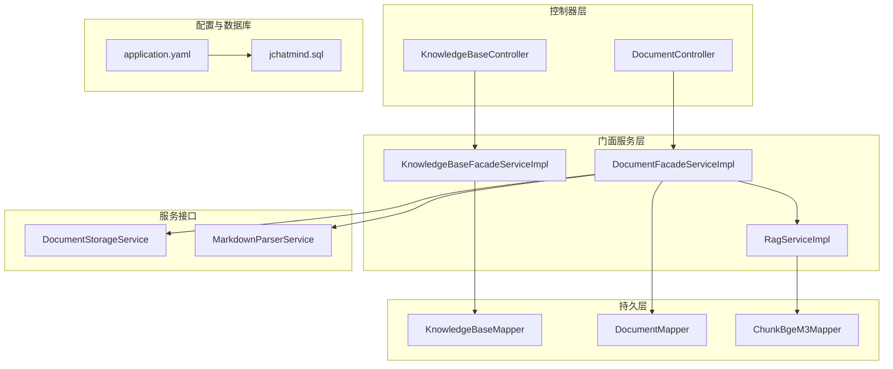
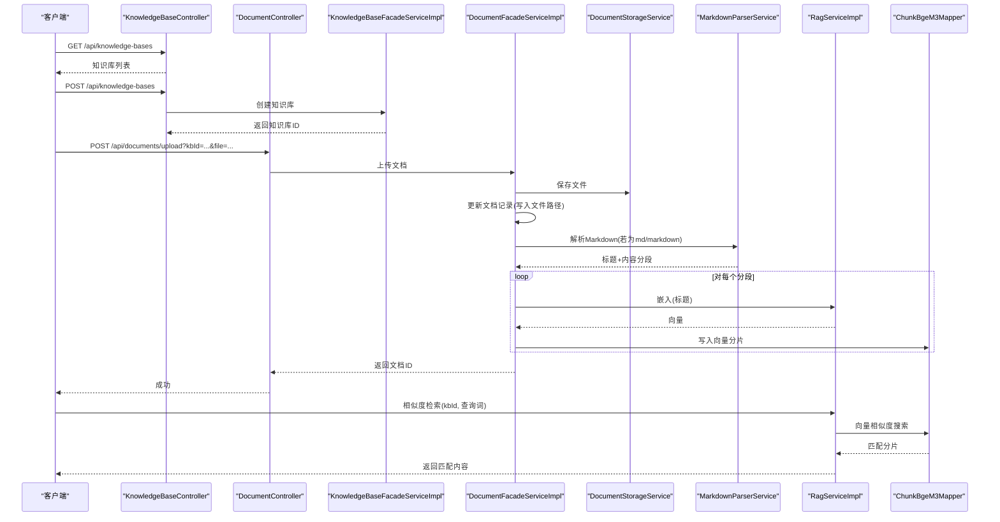
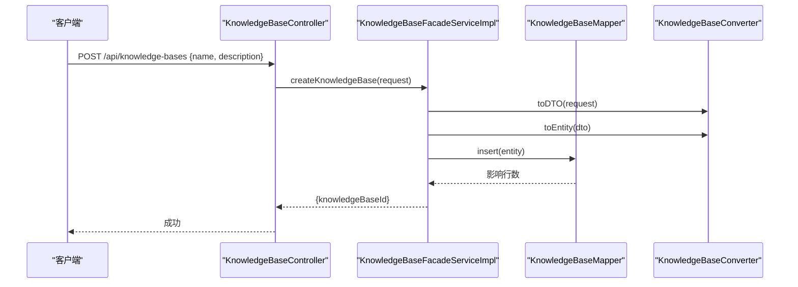
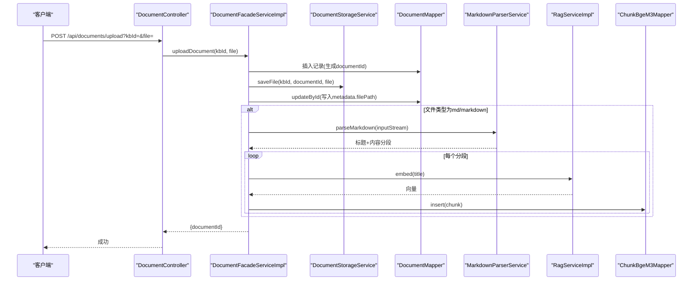
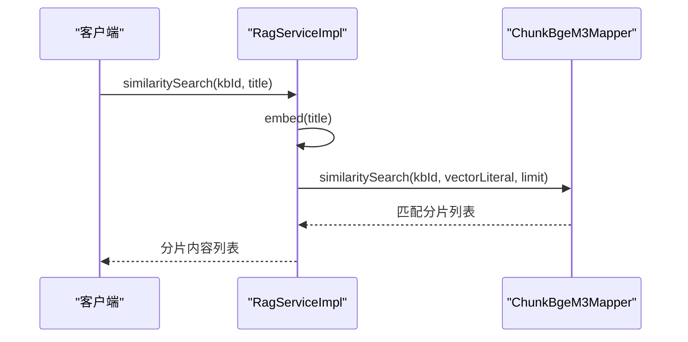
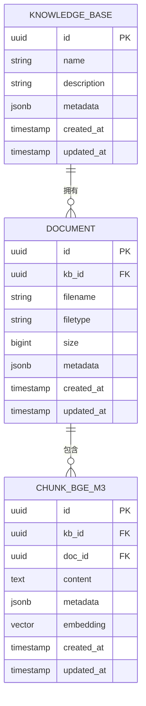
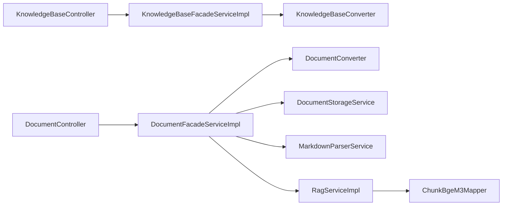

# 知识库API

<cite>
**本文引用的文件**
- [KnowledgeBaseController.java](file://jchatmind/src/main/java/com/kama/jchatmind/controller/KnowledgeBaseController.java)
- [DocumentController.java](file://jchatmind/src/main/java/com/kama/jchatmind/controller/DocumentController.java)
- [KnowledgeBaseFacadeServiceImpl.java](file://jchatmind/src/main/java/com/kama/jchatmind/service/impl/KnowledgeBaseFacadeServiceImpl.java)
- [DocumentFacadeServiceImpl.java](file://jchatmind/src/main/java/com/kama/jchatmind/service/impl/DocumentFacadeServiceImpl.java)
- [RagServiceImpl.java](file://jchatmind/src/main/java/com/kama/jchatmind/service/impl/RagServiceImpl.java)
- [KnowledgeBaseConverter.java](file://jchatmind/src/main/java/com/kama/jchatmind/converter/KnowledgeBaseConverter.java)
- [DocumentConverter.java](file://jchatmind/src/main/java/com/kama/jchatmind/converter/DocumentConverter.java)
- [CreateKnowledgeBaseRequest.java](file://jchatmind/src/main/java/com/kama/jchatmind/model/request/CreateKnowledgeBaseRequest.java)
- [CreateDocumentRequest.java](file://jchatmind/src/main/java/com/kama/jchatmind/model/request/CreateDocumentRequest.java)
- [KnowledgeBase.java](file://jchatmind/src/main/java/com/kama/jchatmind/model/entity/KnowledgeBase.java)
- [Document.java](file://jchatmind/src/main/java/com/kama/jchatmind/model/entity/Document.java)
- [ChunkBgeM3Mapper.java](file://jchatmind/src/main/java/com/kama/jchatmind/mapper/ChunkBgeM3Mapper.java)
- [application.yaml](file://jchatmind/src/main/resources/application.yaml)
- [jchatmind.sql](file://sql/jchatmind.sql)
- [MarkdownParserService.java](file://jchatmind/src/main/java/com/kama/jchatmind/service/MarkdownParserService.java)
- [DocumentStorageService.java](file://jchatmind/src/main/java/com/kama/jchatmind/service/DocumentStorageService.java)
</cite>

## 目录
1. [简介](#简介)
2. [项目结构](#项目结构)
3. [核心组件](#核心组件)
4. [架构总览](#架构总览)
5. [详细组件分析](#详细组件分析)
6. [依赖分析](#依赖分析)
7. [性能考虑](#性能考虑)
8. [故障排查指南](#故障排查指南)
9. [结论](#结论)
10. [附录](#附录)

## 简介
本文件为知识库与文档管理API的详细参考文档，覆盖以下能力：
- 知识库：创建、查询、更新、删除
- 文档：创建、上传、查询、更新、删除
- 文档解析与向量化：Markdown解析、分块、向量嵌入
- RAG检索：相似度搜索、上下文增强
- 数据模型与数据库设计：知识库、文档、向量分片
- 配置与部署要点：数据库、向量扩展、存储路径

本项目采用Spring Boot + MyBatis，使用PostgreSQL + pgvector扩展实现向量相似度检索。

## 项目结构
后端采用分层架构：
- 控制器层：对外暴露REST API
- 门面服务层：编排业务流程
- 转换器层：请求/响应与实体间的数据转换
- 持久层：MyBatis Mapper
- 服务接口：文档存储、Markdown解析、RAG服务等

图表来源
- [KnowledgeBaseController.java:1-45](file://jchatmind/src/main/java/com/kama/jchatmind/controller/KnowledgeBaseController.java#L1-L45)
- [DocumentController.java:1-60](file://jchatmind/src/main/java/com/kama/jchatmind/controller/DocumentController.java#L1-L60)
- [KnowledgeBaseFacadeServiceImpl.java:1-121](file://jchatmind/src/main/java/com/kama/jchatmind/service/impl/KnowledgeBaseFacadeServiceImpl.java#L1-L121)
- [DocumentFacadeServiceImpl.java:1-312](file://jchatmind/src/main/java/com/kama/jchatmind/service/impl/DocumentFacadeServiceImpl.java#L1-L312)
- [RagServiceImpl.java:1-67](file://jchatmind/src/main/java/com/kama/jchatmind/service/impl/RagServiceImpl.java#L1-L67)
- [application.yaml:1-43](file://jchatmind/src/main/resources/application.yaml#L1-L43)
- [jchatmind.sql:1-88](file://sql/jchatmind.sql#L1-L88)

章节来源
- [KnowledgeBaseController.java:1-45](file://jchatmind/src/main/java/com/kama/jchatmind/controller/KnowledgeBaseController.java#L1-L45)
- [DocumentController.java:1-60](file://jchatmind/src/main/java/com/kama/jchatmind/controller/DocumentController.java#L1-L60)
- [application.yaml:1-43](file://jchatmind/src/main/resources/application.yaml#L1-L43)
- [jchatmind.sql:1-88](file://sql/jchatmind.sql#L1-L88)

## 核心组件
- 知识库控制器：提供知识库的查询、创建、更新、删除接口
- 文档控制器：提供文档的查询、创建、上传、更新、删除接口
- 门面服务：
  - 知识库门面：负责知识库的持久化与转换
  - 文档门面：负责文档记录、文件存储、Markdown解析、向量化与RAG检索
- RAG服务：封装本地嵌入服务调用，执行向量嵌入与相似度检索
- 转换器：统一处理请求/响应与实体之间的JSON序列化/反序列化
- 数据模型：知识库、文档、向量分片
- 数据库：PostgreSQL + pgvector，含向量索引

章节来源
- [KnowledgeBaseController.java:19-43](file://jchatmind/src/main/java/com/kama/jchatmind/controller/KnowledgeBaseController.java#L19-L43)
- [DocumentController.java:20-58](file://jchatmind/src/main/java/com/kama/jchatmind/controller/DocumentController.java#L20-L58)
- [KnowledgeBaseFacadeServiceImpl.java:29-119](file://jchatmind/src/main/java/com/kama/jchatmind/service/impl/KnowledgeBaseFacadeServiceImpl.java#L29-L119)
- [DocumentFacadeServiceImpl.java:45-310](file://jchatmind/src/main/java/com/kama/jchatmind/service/impl/DocumentFacadeServiceImpl.java#L45-L310)
- [RagServiceImpl.java:14-66](file://jchatmind/src/main/java/com/kama/jchatmind/service/impl/RagServiceImpl.java#L14-L66)

## 架构总览
下图展示知识库与文档API的整体交互流程，包括文档上传、解析、向量化与RAG检索的关键步骤。

图表来源
- [KnowledgeBaseController.java:19-43](file://jchatmind/src/main/java/com/kama/jchatmind/controller/KnowledgeBaseController.java#L19-L43)
- [DocumentController.java:38-44](file://jchatmind/src/main/java/com/kama/jchatmind/controller/DocumentController.java#L38-L44)
- [DocumentFacadeServiceImpl.java:108-176](file://jchatmind/src/main/java/com/kama/jchatmind/service/impl/DocumentFacadeServiceImpl.java#L108-L176)
- [DocumentFacadeServiceImpl.java:207-266](file://jchatmind/src/main/java/com/kama/jchatmind/service/impl/DocumentFacadeServiceImpl.java#L207-L266)
- [RagServiceImpl.java:50-55](file://jchatmind/src/main/java/com/kama/jchatmind/service/impl/RagServiceImpl.java#L50-L55)
- [ChunkBgeM3Mapper.java:25-29](file://jchatmind/src/main/java/com/kama/jchatmind/mapper/ChunkBgeM3Mapper.java#L25-L29)

## 详细组件分析

### 知识库API
- 接口概览
  - GET /api/knowledge-bases：查询所有知识库
  - POST /api/knowledge-bases：创建知识库
  - PATCH /api/knowledge-bases/{knowledgeBaseId}：更新知识库
  - DELETE /api/knowledge-bases/{knowledgeBaseId}：删除知识库
- 请求/响应对象
  - CreateKnowledgeBaseRequest：name, description
  - 响应：包含生成的knowledgeBaseId
- 处理流程
  - 控制器接收请求，调用门面服务
  - 门面服务通过转换器将请求映射为DTO/实体
  - 持久层插入或更新记录
  - 返回标准响应包装

图表来源
- [KnowledgeBaseController.java:25-29](file://jchatmind/src/main/java/com/kama/jchatmind/controller/KnowledgeBaseController.java#L25-L29)
- [KnowledgeBaseFacadeServiceImpl.java:46-73](file://jchatmind/src/main/java/com/kama/jchatmind/service/impl/KnowledgeBaseFacadeServiceImpl.java#L46-L73)
- [KnowledgeBaseConverter.java:62-69](file://jchatmind/src/main/java/com/kama/jchatmind/converter/KnowledgeBaseConverter.java#L62-L69)

章节来源
- [KnowledgeBaseController.java:19-43](file://jchatmind/src/main/java/com/kama/jchatmind/controller/KnowledgeBaseController.java#L19-L43)
- [KnowledgeBaseFacadeServiceImpl.java:29-119](file://jchatmind/src/main/java/com/kama/jchatmind/service/impl/KnowledgeBaseFacadeServiceImpl.java#L29-L119)
- [CreateKnowledgeBaseRequest.java:1-11](file://jchatmind/src/main/java/com/kama/jchatmind/model/request/CreateKnowledgeBaseRequest.java#L1-L11)
- [KnowledgeBase.java:13-24](file://jchatmind/src/main/java/com/kama/jchatmind/model/entity/KnowledgeBase.java#L13-L24)

### 文档API
- 接口概览
  - GET /api/documents：查询所有文档
  - GET /api/documents/kb/{kbId}：按知识库查询文档
  - POST /api/documents：仅创建文档记录（不上传文件）
  - POST /api/documents/upload：上传文件并创建文档记录
  - PATCH /api/documents/{documentId}：更新文档
  - DELETE /api/documents/{documentId}：删除文档
- 上传流程
  - 创建文档记录，获得documentId
  - 存储文件至配置的存储路径
  - 更新文档记录，写入文件路径metadata
  - 若为Markdown，解析章节并生成向量分片
- 错误处理
  - 文件为空、保存失败、删除失败等场景均有明确异常与日志

图表来源
- [DocumentController.java:38-44](file://jchatmind/src/main/java/com/kama/jchatmind/controller/DocumentController.java#L38-L44)
- [DocumentFacadeServiceImpl.java:108-176](file://jchatmind/src/main/java/com/kama/jchatmind/service/impl/DocumentFacadeServiceImpl.java#L108-L176)
- [DocumentFacadeServiceImpl.java:207-266](file://jchatmind/src/main/java/com/kama/jchatmind/service/impl/DocumentFacadeServiceImpl.java#L207-L266)
- [MarkdownParserService.java:13-32](file://jchatmind/src/main/java/com/kama/jchatmind/service/MarkdownParserService.java#L13-L32)
- [RagServiceImpl.java:45-48](file://jchatmind/src/main/java/com/kama/jchatmind/service/impl/RagServiceImpl.java#L45-L48)
- [ChunkBgeM3Mapper.java:17-29](file://jchatmind/src/main/java/com/kama/jchatmind/mapper/ChunkBgeM3Mapper.java#L17-L29)

章节来源
- [DocumentController.java:20-58](file://jchatmind/src/main/java/com/kama/jchatmind/controller/DocumentController.java#L20-L58)
- [DocumentFacadeServiceImpl.java:45-310](file://jchatmind/src/main/java/com/kama/jchatmind/service/impl/DocumentFacadeServiceImpl.java#L45-L310)
- [CreateDocumentRequest.java:1-13](file://jchatmind/src/main/java/com/kama/jchatmind/model/request/CreateDocumentRequest.java#L1-L13)
- [Document.java:13-29](file://jchatmind/src/main/java/com/kama/jchatmind/model/entity/Document.java#L13-L29)

### RAG检索API
- 相似度检索
  - 输入：知识库ID、查询词
  - 步骤：对查询词做向量嵌入，转为pgvector字符串，调用相似度搜索，返回匹配分片内容
- 嵌入服务
  - 通过WebClient调用本地Ollama服务的bge-m3模型
  - 返回1024维向量
- 结果处理
  - 返回匹配分片的内容列表，可用于上下文增强

图表来源
- [RagServiceImpl.java:50-55](file://jchatmind/src/main/java/com/kama/jchatmind/service/impl/RagServiceImpl.java#L50-L55)
- [ChunkBgeM3Mapper.java:25-29](file://jchatmind/src/main/java/com/kama/jchatmind/mapper/ChunkBgeM3Mapper.java#L25-L29)

章节来源
- [RagServiceImpl.java:14-66](file://jchatmind/src/main/java/com/kama/jchatmind/service/impl/RagServiceImpl.java#L14-L66)

### 数据模型与数据库设计
- 知识库表：包含名称、描述、元数据、创建/更新时间
- 文档表：关联知识库，记录文件名、类型、大小、元数据
- 向量分片表：包含kb_id、doc_id、content、metadata、embedding向量、创建/更新时间
- 向量索引：IVFFLAT索引，支持向量相似度检索

图表来源
- [jchatmind.sql:43-87](file://sql/jchatmind.sql#L43-L87)

章节来源
- [jchatmind.sql:1-88](file://sql/jchatmind.sql#L1-L88)
- [KnowledgeBase.java:13-24](file://jchatmind/src/main/java/com/kama/jchatmind/model/entity/KnowledgeBase.java#L13-L24)
- [Document.java:13-29](file://jchatmind/src/main/java/com/kama/jchatmind/model/entity/Document.java#L13-L29)

## 依赖分析
- 控制器依赖门面服务，门面服务依赖转换器、存储服务、解析服务、RAG服务与Mapper
- RAG服务依赖WebClient与ChunkBgeM3Mapper
- 数据库依赖pgvector扩展，需启用vector扩展并建立IVFFLAT索引

图表来源
- [KnowledgeBaseController.java:17-18](file://jchatmind/src/main/java/com/kama/jchatmind/controller/KnowledgeBaseController.java#L17-L18)
- [DocumentController.java:18-19](file://jchatmind/src/main/java/com/kama/jchatmind/controller/DocumentController.java#L18-L19)
- [KnowledgeBaseFacadeServiceImpl.java:26-27](file://jchatmind/src/main/java/com/kama/jchatmind/service/impl/KnowledgeBaseFacadeServiceImpl.java#L26-L27)
- [DocumentFacadeServiceImpl.java:38-43](file://jchatmind/src/main/java/com/kama/jchatmind/service/impl/DocumentFacadeServiceImpl.java#L38-L43)
- [RagServiceImpl.java:21-24](file://jchatmind/src/main/java/com/kama/jchatmind/service/impl/RagServiceImpl.java#L21-L24)

章节来源
- [KnowledgeBaseFacadeServiceImpl.java:1-121](file://jchatmind/src/main/java/com/kama/jchatmind/service/impl/KnowledgeBaseFacadeServiceImpl.java#L1-L121)
- [DocumentFacadeServiceImpl.java:1-312](file://jchatmind/src/main/java/com/kama/jchatmind/service/impl/DocumentFacadeServiceImpl.java#L1-L312)
- [RagServiceImpl.java:14-66](file://jchatmind/src/main/java/com/kama/jchatmind/service/impl/RagServiceImpl.java#L14-L66)

## 性能考虑
- 向量索引
  - 已建立IVFFLAT索引，lists参数可按数据规模调整
  - 相似度检索使用向量距离，建议合理设置limit
- 嵌入服务
  - 本地Ollama服务调用，网络延迟与模型加载会影响性能
  - 可在高并发场景引入缓存或异步队列
- 文件存储
  - 建议使用高性能存储介质，避免I/O瓶颈
- 分页与批量
  - 当前控制器未实现分页；建议在查询接口中增加分页参数

## 故障排查指南
- 知识库/文档不存在
  - 门面服务会抛出业务异常，检查ID是否正确
- 文件保存失败
  - 检查存储路径权限与磁盘空间；查看日志中的IO异常
- Markdown解析为空
  - 确认文件内容与标题结构；当前实现跳过空标题
- 向量索引未生效
  - 确认已启用vector扩展并创建索引；检查向量维度与模型一致

章节来源
- [KnowledgeBaseFacadeServiceImpl.java:76-85](file://jchatmind/src/main/java/com/kama/jchatmind/service/impl/KnowledgeBaseFacadeServiceImpl.java#L76-L85)
- [DocumentFacadeServiceImpl.java:172-175](file://jchatmind/src/main/java/com/kama/jchatmind/service/impl/DocumentFacadeServiceImpl.java#L172-L175)
- [DocumentFacadeServiceImpl.java:209-222](file://jchatmind/src/main/java/com/kama/jchatmind/service/impl/DocumentFacadeServiceImpl.java#L209-L222)
- [jchatmind.sql:83-87](file://sql/jchatmind.sql#L83-L87)

## 结论
本API提供了完整的知识库与文档管理能力，涵盖从创建、上传、解析、向量化到RAG检索的全链路流程。通过PostgreSQL + pgvector实现了高效的向量相似度检索，适合构建企业级知识问答与智能检索应用。后续可在分页、缓存、批量操作等方面进一步优化。

## 附录

### API规范摘要
- 知识库
  - GET /api/knowledge-bases：返回所有知识库
  - POST /api/knowledge-bases：创建知识库，返回knowledgeBaseId
  - PATCH /api/knowledge-bases/{knowledgeBaseId}：更新知识库
  - DELETE /api/knowledge-bases/{knowledgeBaseId}：删除知识库
- 文档
  - GET /api/documents：返回所有文档
  - GET /api/documents/kb/{kbId}：返回指定知识库下的文档
  - POST /api/documents：创建文档记录
  - POST /api/documents/upload：上传文件并创建文档记录
  - PATCH /api/documents/{documentId}：更新文档
  - DELETE /api/documents/{documentId}：删除文档
- RAG检索
  - similaritySearch(kbId, query)：返回匹配分片内容列表

章节来源
- [KnowledgeBaseController.java:19-43](file://jchatmind/src/main/java/com/kama/jchatmind/controller/KnowledgeBaseController.java#L19-L43)
- [DocumentController.java:20-58](file://jchatmind/src/main/java/com/kama/jchatmind/controller/DocumentController.java#L20-L58)
- [RagServiceImpl.java:50-55](file://jchatmind/src/main/java/com/kama/jchatmind/service/impl/RagServiceImpl.java#L50-L55)

### 配置与环境
- 数据库连接与MyBatis配置
- 文档存储基础路径
- 向量扩展与索引
- Ollama嵌入服务地址

章节来源
- [application.yaml:1-43](file://jchatmind/src/main/resources/application.yaml#L1-L43)
- [jchatmind.sql:1-88](file://sql/jchatmind.sql#L1-L88)