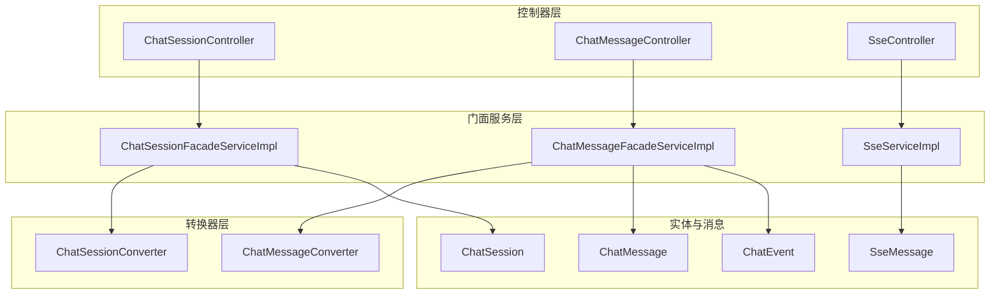
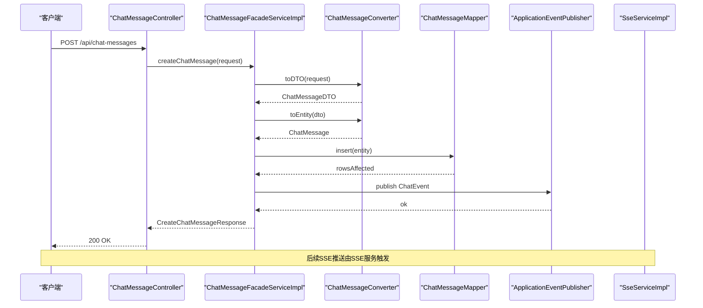
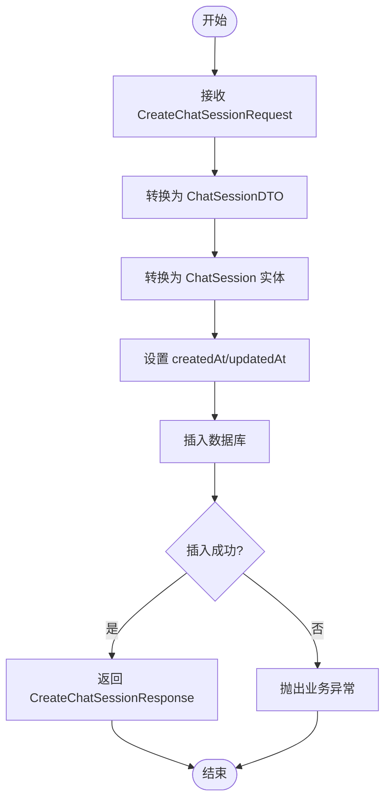
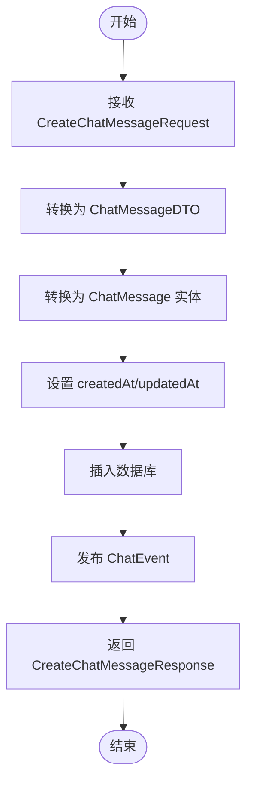
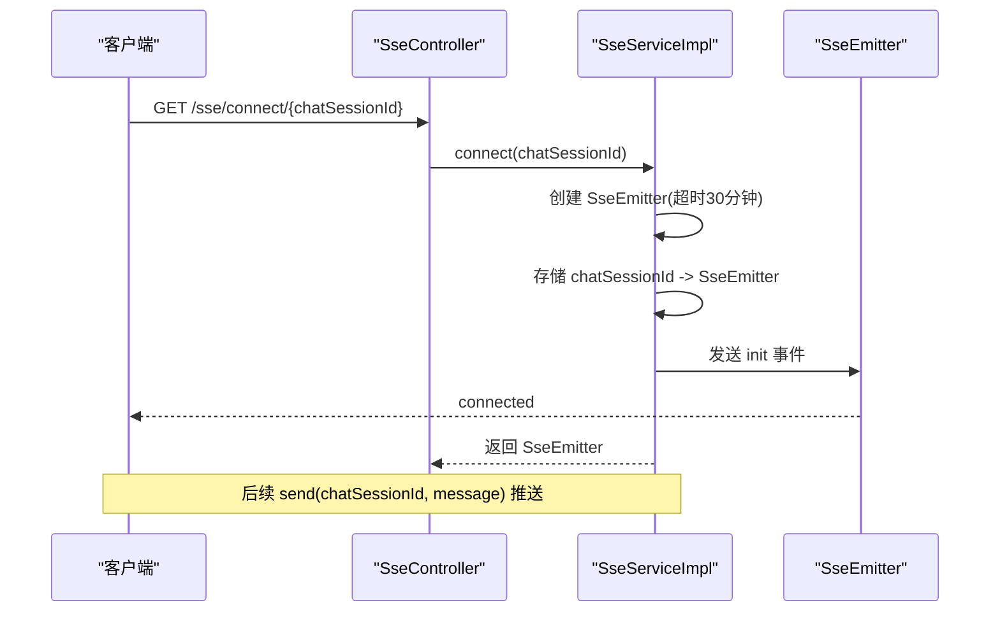
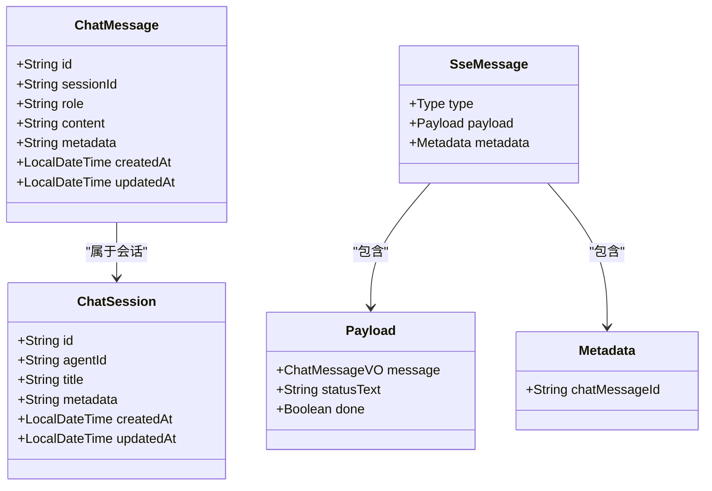
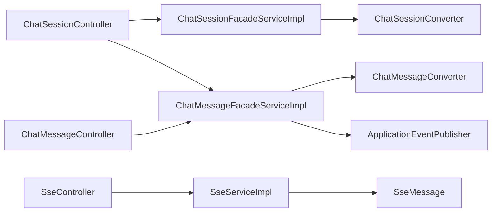

# 聊天会话API

<cite>
**本文档引用的文件**
- [ChatSessionController.java](file://jchatmind/src/main/java/com/kama/jchatmind/controller/ChatSessionController.java)
- [ChatMessageController.java](file://jchatmind/src/main/java/com/kama/jchatmind/controller/ChatMessageController.java)
- [SseController.java](file://jchatmind/src/main/java/com/kama/jchatmind/controller/SseController.java)
- [ChatSessionFacadeServiceImpl.java](file://jchatmind/src/main/java/com/kama/jchatmind/service/impl/ChatSessionFacadeServiceImpl.java)
- [ChatMessageFacadeServiceImpl.java](file://jchatmind/src/main/java/com/kama/jchatmind/service/impl/ChatMessageFacadeServiceImpl.java)
- [SseServiceImpl.java](file://jchatmind/src/main/java/com/kama/jchatmind/service/impl/SseServiceImpl.java)
- [ChatSession.java](file://jchatmind/src/main/java/com/kama/jchatmind/model/entity/ChatSession.java)
- [ChatMessage.java](file://jchatmind/src/main/java/com/kama/jchatmind/model/entity/ChatMessage.java)
- [CreateChatSessionRequest.java](file://jchatmind/src/main/java/com/kama/jchatmind/model/request/CreateChatSessionRequest.java)
- [CreateChatMessageRequest.java](file://jchatmind/src/main/java/com/kama/jchatmind/model/request/CreateChatMessageRequest.java)
- [ChatSessionConverter.java](file://jchatmind/src/main/java/com/kama/jchatmind/converter/ChatSessionConverter.java)
- [ChatMessageConverter.java](file://jchatmind/src/main/java/com/kama/jchatmind/converter/ChatMessageConverter.java)
- [SseMessage.java](file://jchatmind/src/main/java/com/kama/jchatmind/message/SseMessage.java)
- [ChatEvent.java](file://jchatmind/src/main/java/com/kama/jchatmind/event/ChatEvent.java)
- [application.yaml](file://jchatmind/src/main/resources/application.yaml)
</cite>

## 目录
1. [简介](#简介)
2. [项目结构](#项目结构)
3. [核心组件](#核心组件)
4. [架构总览](#架构总览)
5. [详细组件分析](#详细组件分析)
6. [依赖关系分析](#依赖关系分析)
7. [性能考虑](#性能考虑)
8. [故障排除指南](#故障排除指南)
9. [结论](#结论)

## 简介
本文件为聊天会话与消息管理API的完整参考文档，覆盖以下能力：
- 会话管理：创建、查询（全部、单个、按智能体）、更新、删除
- 消息管理：发送、按会话查询、更新、删除、内容追加
- 实时推送：基于Server-Sent Events（SSE）的实时消息推送，含连接建立、消息格式、断线处理
- 上下文与持久化：会话与消息的实体模型、JSON元数据存储、时间戳管理
- 生命周期：会话与消息的创建、更新、删除流程与约束

## 项目结构
后端采用Spring Boot分层架构，主要模块如下：
- 控制器层：对外暴露REST API
- 门面服务层：编排业务逻辑，协调转换器与持久层
- 转换器层：负责请求/响应与实体之间的JSON序列化/反序列化
- 持久层：MyBatis映射数据库表
- 实时服务层：SSE客户端连接与消息推送
- 事件层：应用事件用于触发后续处理

**图表来源**
- [ChatSessionController.java:1-58](file://jchatmind/src/main/java/com/kama/jchatmind/controller/ChatSessionController.java#L1-L58)
- [ChatMessageController.java:1-45](file://jchatmind/src/main/java/com/kama/jchatmind/controller/ChatMessageController.java#L1-L45)
- [SseController.java:1-24](file://jchatmind/src/main/java/com/kama/jchatmind/controller/SseController.java#L1-L24)
- [ChatSessionFacadeServiceImpl.java:1-156](file://jchatmind/src/main/java/com/kama/jchatmind/service/impl/ChatSessionFacadeServiceImpl.java#L1-L156)
- [ChatMessageFacadeServiceImpl.java:1-212](file://jchatmind/src/main/java/com/kama/jchatmind/service/impl/ChatMessageFacadeServiceImpl.java#L1-L212)
- [SseServiceImpl.java:1-64](file://jchatmind/src/main/java/com/kama/jchatmind/service/impl/SseServiceImpl.java#L1-L64)
- [ChatSession.java:1-73](file://jchatmind/src/main/java/com/kama/jchatmind/model/entity/ChatSession.java#L1-L73)
- [ChatMessage.java:1-78](file://jchatmind/src/main/java/com/kama/jchatmind/model/entity/ChatMessage.java#L1-L78)
- [SseMessage.java:1-47](file://jchatmind/src/main/java/com/kama/jchatmind/message/SseMessage.java#L1-L47)
- [ChatEvent.java:1-13](file://jchatmind/src/main/java/com/kama/jchatmind/event/ChatEvent.java#L1-L13)

**章节来源**
- [ChatSessionController.java:1-58](file://jchatmind/src/main/java/com/kama/jchatmind/controller/ChatSessionController.java#L1-L58)
- [ChatMessageController.java:1-45](file://jchatmind/src/main/java/com/kama/jchatmind/controller/ChatMessageController.java#L1-L45)
- [SseController.java:1-24](file://jchatmind/src/main/java/com/kama/jchatmind/controller/SseController.java#L1-L24)

## 核心组件
- 会话控制器：提供会话的查询、创建、更新、删除接口
- 消息控制器：提供消息的查询、创建、更新、删除及内容追加接口
- SSE控制器：提供SSE连接入口
- 会话门面服务：封装会话的CRUD与转换逻辑
- 消息门面服务：封装消息的CRUD、内容追加、事件发布
- SSE服务：维护客户端连接、发送消息
- 转换器：统一进行JSON序列化/反序列化
- 实体模型：会话与消息的数据结构
- 应用配置：数据库、邮件、AI服务等配置

**章节来源**
- [ChatSessionFacadeServiceImpl.java:1-156](file://jchatmind/src/main/java/com/kama/jchatmind/service/impl/ChatSessionFacadeServiceImpl.java#L1-L156)
- [ChatMessageFacadeServiceImpl.java:1-212](file://jchatmind/src/main/java/com/kama/jchatmind/service/impl/ChatMessageFacadeServiceImpl.java#L1-L212)
- [SseServiceImpl.java:1-64](file://jchatmind/src/main/java/com/kama/jchatmind/service/impl/SseServiceImpl.java#L1-L64)
- [ChatSessionConverter.java:1-81](file://jchatmind/src/main/java/com/kama/jchatmind/converter/ChatSessionConverter.java#L1-L81)
- [ChatMessageConverter.java:1-93](file://jchatmind/src/main/java/com/kama/jchatmind/converter/ChatMessageConverter.java#L1-L93)
- [application.yaml:1-43](file://jchatmind/src/main/resources/application.yaml#L1-L43)

## 架构总览
系统通过控制器接收HTTP请求，门面服务执行业务逻辑，转换器负责JSON处理，实体与映射器完成持久化。消息创建时可发布应用事件以触发后续处理；SSE服务负责向指定会话的客户端推送消息。

**图表来源**
- [ChatMessageController.java:25-29](file://jchatmind/src/main/java/com/kama/jchatmind/controller/ChatMessageController.java#L25-L29)
- [ChatMessageFacadeServiceImpl.java:67-80](file://jchatmind/src/main/java/com/kama/jchatmind/service/impl/ChatMessageFacadeServiceImpl.java#L67-L80)
- [ChatMessageConverter.java:68-81](file://jchatmind/src/main/java/com/kama/jchatmind/converter/ChatMessageConverter.java#L68-L81)

## 详细组件分析

### 会话管理API
- 查询所有会话：GET /api/chat-sessions
- 查询单个会话：GET /api/chat-sessions/{chatSessionId}
- 按智能体查询会话：GET /api/chat-sessions/agent/{agentId}
- 创建会话：POST /api/chat-sessions
- 删除会话：DELETE /api/chat-sessions/{chatSessionId}
- 更新会话：PATCH /api/chat-sessions/{chatSessionId}

请求与响应要点：
- 请求体使用 CreateChatSessionRequest，包含 agentId 与 title
- 响应体使用 CreateChatSessionResponse 返回生成的 chatSessionId
- 查询接口返回 VO 对象，包含 id、agentId、title

实现细节：
- 会话创建时设置 createdAt 与 updatedAt 为当前时间
- 更新会话时保留 id、agentId、createdAt，仅更新 title 与 updatedAt
- 删除会话时若不存在则抛出业务异常

**图表来源**
- [ChatSessionFacadeServiceImpl.java:80-107](file://jchatmind/src/main/java/com/kama/jchatmind/service/impl/ChatSessionFacadeServiceImpl.java#L80-L107)
- [CreateChatSessionRequest.java:1-10](file://jchatmind/src/main/java/com/kama/jchatmind/model/request/CreateChatSessionRequest.java#L1-L10)

**章节来源**
- [ChatSessionController.java:20-49](file://jchatmind/src/main/java/com/kama/jchatmind/controller/ChatSessionController.java#L20-L49)
- [ChatSessionFacadeServiceImpl.java:30-154](file://jchatmind/src/main/java/com/kama/jchatmind/service/impl/ChatSessionFacadeServiceImpl.java#L30-L154)
- [CreateChatSessionRequest.java:1-10](file://jchatmind/src/main/java/com/kama/jchatmind/model/request/CreateChatSessionRequest.java#L1-L10)

### 消息管理API
- 按会话查询消息：GET /api/chat-messages/session/{sessionId}
- 创建消息：POST /api/chat-messages
- 删除消息：DELETE /api/chat-messages/{chatMessageId}
- 更新消息：PATCH /api/chat-messages/{chatMessageId}
- 内容追加：内部方法 appendChatMessage（用于流式输出拼接）

请求与响应要点：
- 请求体使用 CreateChatMessageRequest，包含 agentId、sessionId、role、content、metadata
- 响应体使用 CreateChatMessageResponse 返回生成的 chatMessageId
- 查询接口返回 VO 对象，包含 id、sessionId、role、content、metadata

实现细节：
- 消息创建时设置 createdAt 与 updatedAt 为当前时间
- 更新消息时保留 id、sessionId、role、createdAt，仅更新 content/metadata 与 updatedAt
- 删除消息时若不存在则抛出业务异常
- 内容追加支持将新内容拼接到现有 content 后，保持其他字段不变

**图表来源**
- [ChatMessageFacadeServiceImpl.java:67-80](file://jchatmind/src/main/java/com/kama/jchatmind/service/impl/ChatMessageFacadeServiceImpl.java#L67-L80)
- [CreateChatMessageRequest.java:1-16](file://jchatmind/src/main/java/com/kama/jchatmind/model/request/CreateChatMessageRequest.java#L1-L16)

**章节来源**
- [ChatMessageController.java:19-43](file://jchatmind/src/main/java/com/kama/jchatmind/controller/ChatMessageController.java#L19-L43)
- [ChatMessageFacadeServiceImpl.java:32-209](file://jchatmind/src/main/java/com/kama/jchatmind/service/impl/ChatMessageFacadeServiceImpl.java#L32-L209)
- [CreateChatMessageRequest.java:1-16](file://jchatmind/src/main/java/com/kama/jchatmind/model/request/CreateChatMessageRequest.java#L1-L16)

### 实时消息推送（SSE）
- 连接建立：GET /sse/connect/{chatSessionId}
- 消息格式：SseMessage，包含 type、payload（message、statusText、done）、metadata（chatMessageId）
- 断线处理：连接完成、超时、错误时自动清理客户端映射

SSE服务特性：
- 维护 chatSessionId 到 SseEmitter 的并发映射
- 连接初始化发送 "init" 事件，数据为 "connected"
- 发送消息时将 SseMessage 序列化为字符串，使用 "message" 事件名
- 连接生命周期回调中移除失效客户端

**图表来源**
- [SseController.java:18-22](file://jchatmind/src/main/java/com/kama/jchatmind/controller/SseController.java#L18-L22)
- [SseServiceImpl.java:21-42](file://jchatmind/src/main/java/com/kama/jchatmind/service/impl/SseServiceImpl.java#L21-L42)
- [SseMessage.java:11-46](file://jchatmind/src/main/java/com/kama/jchatmind/message/SseMessage.java#L11-L46)

**章节来源**
- [SseController.java:1-24](file://jchatmind/src/main/java/com/kama/jchatmind/controller/SseController.java#L1-L24)
- [SseServiceImpl.java:1-64](file://jchatmind/src/main/java/com/kama/jchatmind/service/impl/SseServiceImpl.java#L1-L64)
- [SseMessage.java:1-47](file://jchatmind/src/main/java/com/kama/jchatmind/message/SseMessage.java#L1-L47)

### 数据模型与类型
- 会话实体 ChatSession：包含 id、agentId、title、metadata（JSON字符串）、createdAt、updatedAt
- 消息实体 ChatMessage：包含 id、sessionId、role、content、metadata（JSON字符串）、createdAt、updatedAt
- 消息类型 RoleType：由请求中的枚举定义，转换器将其映射为字符串存储
- 元数据 MetaData：JSON对象，转换器负责序列化/反序列化

**图表来源**
- [ChatSession.java:11-26](file://jchatmind/src/main/java/com/kama/jchatmind/model/entity/ChatSession.java#L11-L26)
- [ChatMessage.java:11-28](file://jchatmind/src/main/java/com/kama/jchatmind/model/entity/ChatMessage.java#L11-L28)
- [SseMessage.java:11-32](file://jchatmind/src/main/java/com/kama/jchatmind/message/SseMessage.java#L11-L32)

**章节来源**
- [ChatSession.java:1-73](file://jchatmind/src/main/java/com/kama/jchatmind/model/entity/ChatSession.java#L1-L73)
- [ChatMessage.java:1-78](file://jchatmind/src/main/java/com/kama/jchatmind/model/entity/ChatMessage.java#L1-L78)
- [SseMessage.java:1-47](file://jchatmind/src/main/java/com/kama/jchatmind/message/SseMessage.java#L1-L47)

### 聊天上下文管理与事件
- 事件发布：消息创建后发布 ChatEvent（包含 agentId、sessionId、userInput），可用于触发后续处理或通知
- 上下文保留：更新消息时保留 sessionId、role、createdAt，确保消息在会话内的语义连续性
- 元数据持久化：metadata 字段以JSON字符串形式存储，便于扩展复杂属性

**章节来源**
- [ChatEvent.java:1-13](file://jchatmind/src/main/java/com/kama/jchatmind/event/ChatEvent.java#L1-L13)
- [ChatMessageFacadeServiceImpl.java:69-75](file://jchatmind/src/main/java/com/kama/jchatmind/service/impl/ChatMessageFacadeServiceImpl.java#L69-L75)

## 依赖关系分析
- 控制器依赖门面服务，门面服务依赖转换器与持久层
- 消息门面服务通过事件发布器发布应用事件
- SSE服务维护客户端连接映射，与消息门面服务解耦
- 转换器统一处理JSON序列化/反序列化，降低控制器与持久层耦合

**图表来源**
- [ChatSessionController.java:1-58](file://jchatmind/src/main/java/com/kama/jchatmind/controller/ChatSessionController.java#L1-L58)
- [ChatMessageController.java:1-45](file://jchatmind/src/main/java/com/kama/jchatmind/controller/ChatMessageController.java#L1-L45)
- [SseController.java:1-24](file://jchatmind/src/main/java/com/kama/jchatmind/controller/SseController.java#L1-L24)
- [ChatSessionFacadeServiceImpl.java:1-156](file://jchatmind/src/main/java/com/kama/jchatmind/service/impl/ChatSessionFacadeServiceImpl.java#L1-L156)
- [ChatMessageFacadeServiceImpl.java:1-212](file://jchatmind/src/main/java/com/kama/jchatmind/service/impl/ChatMessageFacadeServiceImpl.java#L1-L212)
- [SseServiceImpl.java:1-64](file://jchatmind/src/main/java/com/kama/jchatmind/service/impl/SseServiceImpl.java#L1-L64)
- [ChatSessionConverter.java:1-81](file://jchatmind/src/main/java/com/kama/jchatmind/converter/ChatSessionConverter.java#L1-L81)
- [ChatMessageConverter.java:1-93](file://jchatmind/src/main/java/com/kama/jchatmind/converter/ChatMessageConverter.java#L1-L93)
- [SseMessage.java:1-47](file://jchatmind/src/main/java/com/kama/jchatmind/message/SseMessage.java#L1-L47)

**章节来源**
- [ChatSessionController.java:1-58](file://jchatmind/src/main/java/com/kama/jchatmind/controller/ChatSessionController.java#L1-L58)
- [ChatMessageController.java:1-45](file://jchatmind/src/main/java/com/kama/jchatmind/controller/ChatMessageController.java#L1-L45)
- [SseController.java:1-24](file://jchatmind/src/main/java/com/kama/jchatmind/controller/SseController.java#L1-L24)

## 性能考虑
- 连接超时：SSE连接默认超时时间为30分钟，避免长时间占用资源
- 并发安全：客户端映射使用并发容器，保证多会话场景下的线程安全
- JSON处理：转换器集中处理序列化/反序列化，减少重复逻辑与异常开销
- 批量查询：消息查询支持按会话ID批量获取，建议前端按需加载历史消息
- 事件发布：事件发布为异步处理，不影响消息创建主流程

[本节为通用性能建议，不直接分析具体文件]

## 故障排除指南
常见问题与定位：
- 会话/消息不存在：删除或更新操作前先查询，若不存在将抛出业务异常
- 序列化错误：转换器在JSON处理失败时抛出业务异常，检查请求体格式与元数据结构
- SSE客户端缺失：发送消息时若未找到对应会话的客户端，将抛出运行时异常，确认连接已建立
- 数据库连接：检查 application.yaml 中的数据库配置是否正确

**章节来源**
- [ChatSessionFacadeServiceImpl.java:110-120](file://jchatmind/src/main/java/com/kama/jchatmind/service/impl/ChatSessionFacadeServiceImpl.java#L110-L120)
- [ChatMessageFacadeServiceImpl.java:163-174](file://jchatmind/src/main/java/com/kama/jchatmind/service/impl/ChatMessageFacadeServiceImpl.java#L163-L174)
- [SseServiceImpl.java:59-62](file://jchatmind/src/main/java/com/kama/jchatmind/service/impl/SseServiceImpl.java#L59-L62)
- [application.yaml:4-8](file://jchatmind/src/main/resources/application.yaml#L4-L8)

## 结论
本API提供了完整的聊天会话与消息管理能力，具备清晰的分层架构与良好的扩展性。通过SSE实现实时消息推送，结合事件发布机制，能够满足多智能体协作与流式输出场景的需求。建议在生产环境中关注连接超时、并发控制与日志监控，确保系统稳定性与可观测性。