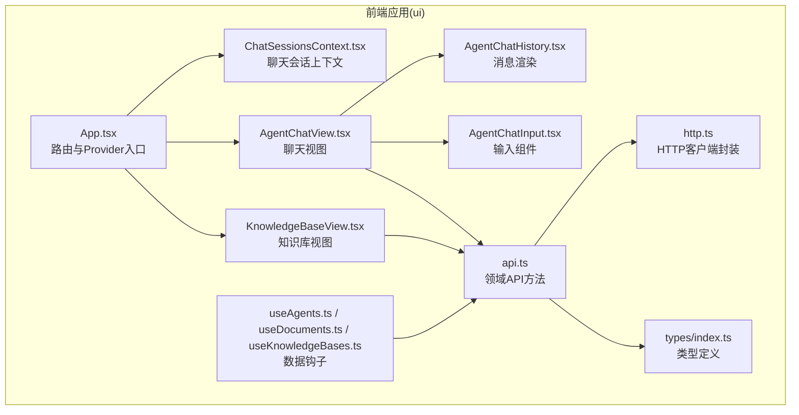
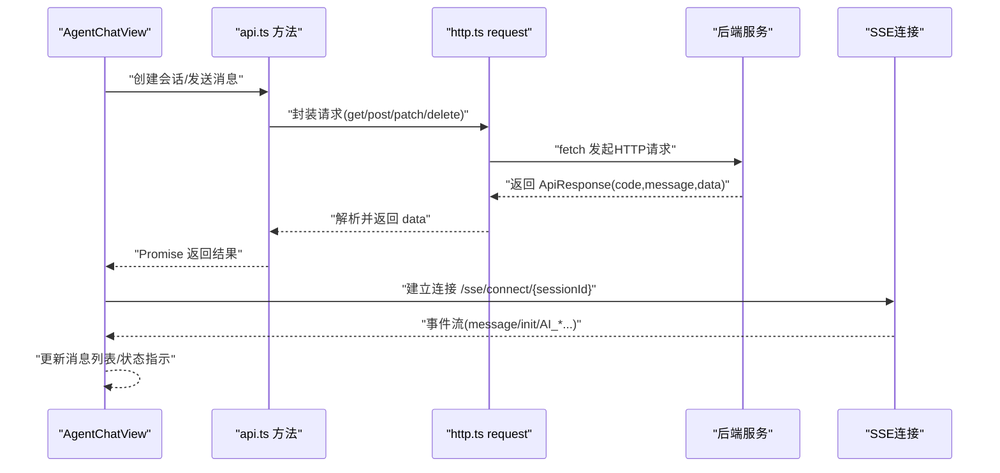
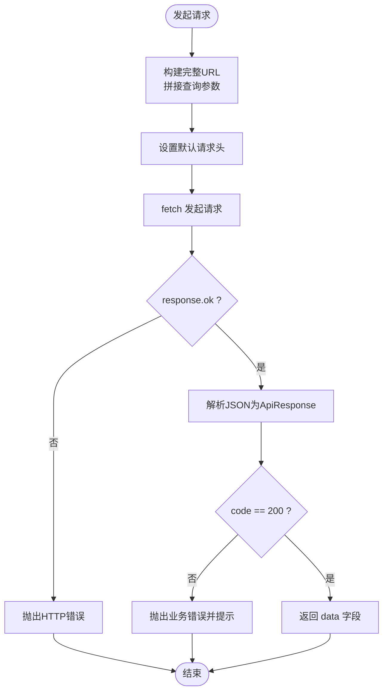
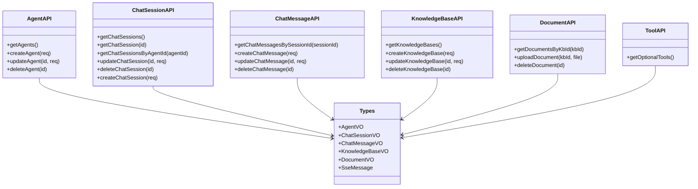
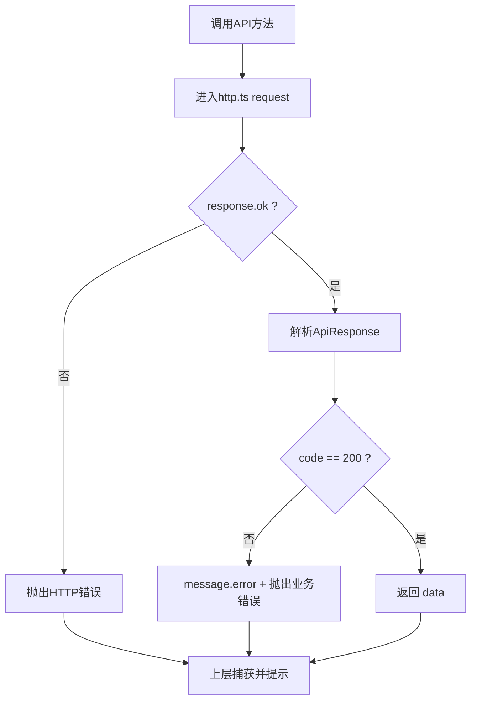
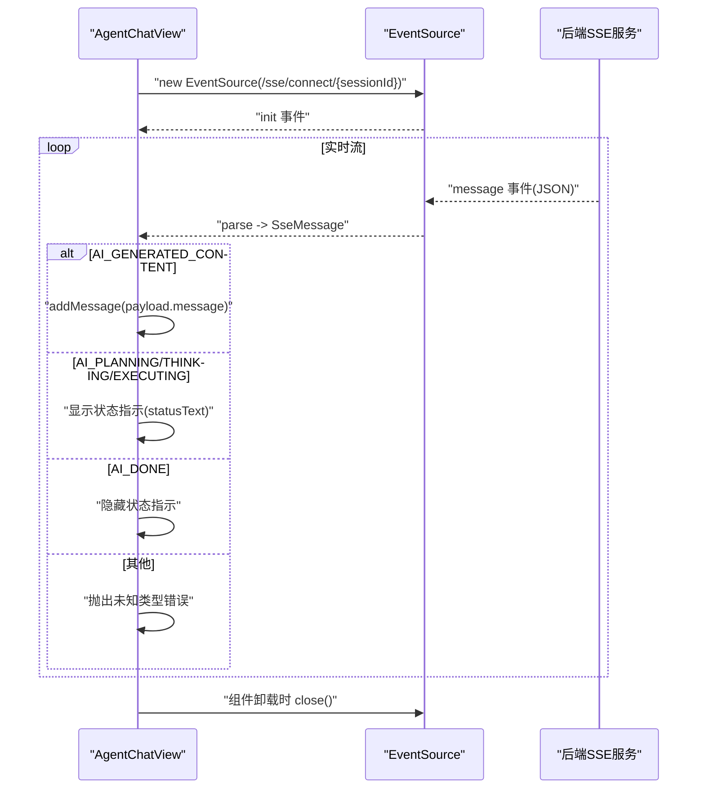
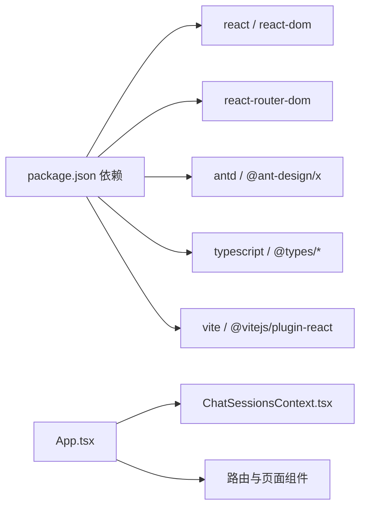

# API集成

<cite>
**本文引用的文件**
- [ui/src/api/http.ts](file://ui/src/api/http.ts)
- [ui/src/api/api.ts](file://ui/src/api/api.ts)
- [ui/src/types/index.ts](file://ui/src/types/index.ts)
- [ui/src/utils/index.ts](file://ui/src/utils/index.ts)
- [ui/src/hooks/useAgents.ts](file://ui/src/hooks/useAgents.ts)
- [ui/src/hooks/useChatSessions.ts](file://ui/src/hooks/useChatSessions.ts)
- [ui/src/hooks/useDocuments.ts](file://ui/src/hooks/useDocuments.ts)
- [ui/src/hooks/useKnowledgeBases.ts](file://ui/src/hooks/useKnowledgeBases.ts)
- [ui/src/components/views/AgentChatView.tsx](file://ui/src/components/views/AgentChatView.tsx)
- [ui/src/components/views/KnowledgeBaseView.tsx](file://ui/src/components/views/KnowledgeBaseView.tsx)
- [ui/src/components/views/agentChatView/AgentChatHistory.tsx](file://ui/src/components/views/agentChatView/AgentChatHistory.tsx)
- [ui/src/components/views/agentChatView/AgentChatInput.tsx](file://ui/src/components/views/agentChatView/AgentChatInput.tsx)
- [ui/src/contexts/ChatSessionsContext.tsx](file://ui/src/contexts/ChatSessionsContext.tsx)
- [ui/src/App.tsx](file://ui/src/App.tsx)
- [ui/package.json](file://ui/package.json)
- [ui/vite.config.ts](file://ui/vite.config.ts)
- [README.md](file://README.md)
</cite>

## 目录
1. [简介](#简介)
2. [项目结构](#项目结构)
3. [核心组件](#核心组件)
4. [架构总览](#架构总览)
5. [详细组件分析](#详细组件分析)
6. [依赖分析](#依赖分析)
7. [性能考虑](#性能考虑)
8. [故障排查指南](#故障排查指南)
9. [结论](#结论)
10. [附录](#附录)

## 简介
本文件面向JChatMind前端的API集成，围绕HTTP客户端封装、请求与响应类型安全、错误处理、并发与缓存策略、WebSocket（SSE）实时推送、版本管理与Mock、测试策略以及完整集成流程与调试技巧进行系统化说明。目标是帮助开发者快速理解并高效、稳定地集成后端API。

## 项目结构
前端位于ui目录，采用React + TypeScript + Vite技术栈，API层由http.ts统一封装fetch请求，api.ts按领域划分接口方法，配合hooks与上下文实现数据拉取与状态管理；SSE在聊天视图中用于实时接收AI状态与内容流。

图表来源
- [ui/src/App.tsx:1-16](file://ui/src/App.tsx#L1-L16)
- [ui/src/contexts/ChatSessionsContext.tsx:1-66](file://ui/src/contexts/ChatSessionsContext.tsx#L1-L66)
- [ui/src/components/views/AgentChatView.tsx:1-200](file://ui/src/components/views/AgentChatView.tsx#L1-L200)
- [ui/src/components/views/KnowledgeBaseView.tsx:1-247](file://ui/src/components/views/KnowledgeBaseView.tsx#L1-L247)
- [ui/src/components/views/agentChatView/AgentChatHistory.tsx:1-300](file://ui/src/components/views/agentChatView/AgentChatHistory.tsx#L1-L300)
- [ui/src/components/views/agentChatView/AgentChatInput.tsx:1-25](file://ui/src/components/views/agentChatView/AgentChatInput.tsx#L1-L25)
- [ui/src/hooks/useAgents.ts:1-55](file://ui/src/hooks/useAgents.ts#L1-L55)
- [ui/src/hooks/useDocuments.ts:1-44](file://ui/src/hooks/useDocuments.ts#L1-L44)
- [ui/src/hooks/useKnowledgeBases.ts:1-47](file://ui/src/hooks/useKnowledgeBases.ts#L1-L47)
- [ui/src/api/api.ts:1-378](file://ui/src/api/api.ts#L1-L378)
- [ui/src/api/http.ts:1-177](file://ui/src/api/http.ts#L1-L177)
- [ui/src/types/index.ts:1-57](file://ui/src/types/index.ts#L1-L57)

章节来源
- [ui/src/App.tsx:1-16](file://ui/src/App.tsx#L1-L16)
- [ui/src/contexts/ChatSessionsContext.tsx:1-66](file://ui/src/contexts/ChatSessionsContext.tsx#L1-L66)
- [ui/src/components/views/AgentChatView.tsx:1-200](file://ui/src/components/views/AgentChatView.tsx#L1-L200)
- [ui/src/components/views/KnowledgeBaseView.tsx:1-247](file://ui/src/components/views/KnowledgeBaseView.tsx#L1-L247)
- [ui/src/api/api.ts:1-378](file://ui/src/api/api.ts#L1-L378)
- [ui/src/api/http.ts:1-177](file://ui/src/api/http.ts#L1-L177)
- [ui/src/types/index.ts:1-57](file://ui/src/types/index.ts#L1-L57)

## 核心组件
- HTTP客户端封装：统一构建URL、设置默认头、处理响应与业务状态码、集中错误处理。
- 领域API方法：按资源域（Agent/ChatSession/ChatMessage/KnowledgeBase/Document/Tool）定义请求与响应类型，提供高内聚的调用入口。
- 类型系统：通过TS接口定义请求/响应/VO/事件类型，保证前后端契约一致与编译期校验。
- 实时推送：基于SSE连接，接收AI状态与增量内容，驱动UI即时更新。
- 数据钩子与上下文：封装数据获取、刷新与删除逻辑，提供可复用的数据访问层。

章节来源
- [ui/src/api/http.ts:1-177](file://ui/src/api/http.ts#L1-L177)
- [ui/src/api/api.ts:1-378](file://ui/src/api/api.ts#L1-L378)
- [ui/src/types/index.ts:1-57](file://ui/src/types/index.ts#L1-L57)
- [ui/src/components/views/AgentChatView.tsx:120-170](file://ui/src/components/views/AgentChatView.tsx#L120-L170)

## 架构总览
下图展示了从前端组件到HTTP客户端再到后端服务的整体调用链路，以及SSE实时推送的交互。

图表来源
- [ui/src/components/views/AgentChatView.tsx:55-112](file://ui/src/components/views/AgentChatView.tsx#L55-L112)
- [ui/src/api/api.ts:99-103](file://ui/src/api/api.ts#L99-L103)
- [ui/src/api/api.ts:208-212](file://ui/src/api/api.ts#L208-L212)
- [ui/src/api/http.ts:62-92](file://ui/src/api/http.ts#L62-L92)

## 详细组件分析

### HTTP客户端与请求拦截
- URL构建：支持查询参数拼接到BASE_URL之后，自动过滤空值。
- 默认头：统一设置Content-Type为application/json，便于后端接收JSON。
- 响应处理：校验HTTP状态与业务code，非200时抛出错误并弹出友好提示。
- 错误处理：捕获异常并统一转为Error，便于上层统一处理。
- 请求方法：提供get/post/put/patch/del，均基于同一request封装。

图表来源
- [ui/src/api/http.ts:21-37](file://ui/src/api/http.ts#L21-L37)
- [ui/src/api/http.ts:77-92](file://ui/src/api/http.ts#L77-L92)
- [ui/src/api/http.ts:42-57](file://ui/src/api/http.ts#L42-L57)

章节来源
- [ui/src/api/http.ts:15-177](file://ui/src/api/http.ts#L15-L177)

### API接口定义与类型安全
- 领域方法：每个资源域提供对应的请求/响应类型与方法，如Agent、ChatSession、ChatMessage、KnowledgeBase、Document、Tool。
- VO与DTO：后端返回的VO在前端以对应TS接口描述，确保字段与类型一致。
- SSE消息：定义SseMessage及其payload/metadata，约束实时事件类型与内容结构。
- 文件上传：独立处理multipart/form-data上传，返回后端统一响应结构。

图表来源
- [ui/src/api/api.ts:57-85](file://ui/src/api/api.ts#L57-L85)
- [ui/src/api/api.ts:129-166](file://ui/src/api/api.ts#L129-L166)
- [ui/src/api/api.ts:199-229](file://ui/src/api/api.ts#L199-L229)
- [ui/src/api/api.ts:261-291](file://ui/src/api/api.ts#L261-L291)
- [ui/src/api/api.ts:315-354](file://ui/src/api/api.ts#L315-L354)
- [ui/src/api/api.ts:374-377](file://ui/src/api/api.ts#L374-L377)
- [ui/src/types/index.ts:27-56](file://ui/src/types/index.ts#L27-L56)

章节来源
- [ui/src/api/api.ts:1-378](file://ui/src/api/api.ts#L1-L378)
- [ui/src/types/index.ts:1-57](file://ui/src/types/index.ts#L1-L57)

### 错误处理机制
- 网络错误：HTTP状态码非2xx时抛出错误，便于上层统一捕获。
- 业务错误：当后端返回的code非200时，弹出message提示并抛出错误。
- 用户友好提示：使用Ant Design的消息组件在UI层给出明确反馈。
- 上层处理：聊天视图与知识库视图在try/catch中处理错误并提示。

图表来源
- [ui/src/api/http.ts:42-57](file://ui/src/api/http.ts#L42-L57)
- [ui/src/api/http.ts:85-92](file://ui/src/api/http.ts#L85-L92)
- [ui/src/components/views/AgentChatView.tsx:86-91](file://ui/src/components/views/AgentChatView.tsx#L86-L91)
- [ui/src/components/views/KnowledgeBaseView.tsx:55-66](file://ui/src/components/views/KnowledgeBaseView.tsx#L55-L66)

章节来源
- [ui/src/api/http.ts:42-92](file://ui/src/api/http.ts#L42-L92)
- [ui/src/components/views/AgentChatView.tsx:86-91](file://ui/src/components/views/AgentChatView.tsx#L86-L91)
- [ui/src/components/views/KnowledgeBaseView.tsx:55-66](file://ui/src/components/views/KnowledgeBaseView.tsx#L55-L66)

### 并发请求、缓存与预加载
- 并发请求：当前实现未显式引入并发限制或去重策略，建议在需要时引入信号量或缓存键去重。
- 缓存策略：未实现持久化缓存，可在业务层以内存Map或LRU缓存记录最近请求结果，避免重复拉取。
- 预加载：聊天视图在进入会话时预拉取消息列表与会话信息，减少空白等待。
- 会话刷新：通过上下文提供的refreshChatSessions统一刷新列表，保持UI一致性。

章节来源
- [ui/src/components/views/AgentChatView.tsx:33-53](file://ui/src/components/views/AgentChatView.tsx#L33-L53)
- [ui/src/contexts/ChatSessionsContext.tsx:23-40](file://ui/src/contexts/ChatSessionsContext.tsx#L23-L40)

### WebSocket（SSE）集成与实时更新
- 连接建立：在聊天视图中根据sessionId建立SSE连接，监听message与init事件。
- 事件类型：支持AI_PLANNING、AI_THINKING、AI_EXECUTING、AI_GENERATED_CONTENT、AI_DONE等类型，分别用于状态提示与内容追加。
- 内容更新：收到AI_GENERATED_CONTENT时将消息加入列表；AI_DONE时关闭状态指示。
- 清理释放：组件卸载时主动关闭SSE连接，避免内存泄漏。

图表来源
- [ui/src/components/views/AgentChatView.tsx:120-170](file://ui/src/components/views/AgentChatView.tsx#L120-L170)
- [ui/src/types/index.ts:52-56](file://ui/src/types/index.ts#L52-L56)

章节来源
- [ui/src/components/views/AgentChatView.tsx:120-170](file://ui/src/components/views/AgentChatView.tsx#L120-L170)
- [ui/src/types/index.ts:35-56](file://ui/src/types/index.ts#L35-L56)

### API版本管理、Mock与测试策略
- 版本管理：当前未见显式的API版本号管理策略，建议在BASE_URL中加入/version前缀或在请求头中携带版本标识，便于灰度与兼容。
- Mock数据：当前未发现专门的Mock层，可在开发阶段通过本地代理或拦截器注入模拟数据，便于离线调试。
- 测试策略：建议为每个API方法编写单元测试，覆盖成功/失败分支；对SSE流可通过事件模拟与回调断言验证UI行为。

章节来源
- [ui/src/api/http.ts:15-16](file://ui/src/api/http.ts#L15-L16)
- [ui/src/components/views/AgentChatView.tsx:120-170](file://ui/src/components/views/AgentChatView.tsx#L120-L170)

### 最佳实践
- 认证处理：当前HTTP封装未内置Token注入逻辑，建议在headers中统一注入Authorization，或在request内部增加拦截器。
- 错误重试：可在外层封装重试机制（指数退避），针对网络瞬时错误提升成功率。
- 超时控制：为fetch设置AbortController，避免请求悬挂；在UI层提供“取消”按钮。
- 并发控制：对高频请求（如搜索/刷新）引入节流/防抖与去重。
- 缓存策略：对只读数据（如Agent列表、知识库列表）实施短时缓存，提升体验。
- 数据预加载：在路由进入前触发关键数据拉取，减少首屏白屏。
- SSE健壮性：对未知事件类型进行降级处理，避免阻塞后续消息；增加心跳与重连逻辑。

章节来源
- [ui/src/api/http.ts:77-92](file://ui/src/api/http.ts#L77-L92)
- [ui/src/components/views/AgentChatView.tsx:120-170](file://ui/src/components/views/AgentChatView.tsx#L120-L170)

## 依赖分析
- 框架与工具：React、React Router、Ant Design、@ant-design/x、Tailwind CSS、Vite。
- 类型与运行时：TypeScript、浏览器原生fetch与EventSource。
- 项目入口：App.tsx挂载路由与Provider，ChatSessionsContext提供会话数据。

图表来源
- [ui/package.json:12-43](file://ui/package.json#L12-L43)
- [ui/src/App.tsx:1-16](file://ui/src/App.tsx#L1-L16)
- [ui/vite.config.ts:1-9](file://ui/vite.config.ts#L1-L9)

章节来源
- [ui/package.json:12-43](file://ui/package.json#L12-L43)
- [ui/src/App.tsx:1-16](file://ui/src/App.tsx#L1-L16)
- [ui/vite.config.ts:1-9](file://ui/vite.config.ts#L1-L9)

## 性能考虑
- 减少不必要的重渲染：使用useMemo/useCallback缓存计算结果与回调。
- 懒加载与分页：对长列表（文档/会话）启用分页与虚拟滚动。
- 图片与大文本：对Markdown内容进行流式渲染与懒加载，避免阻塞主线程。
- SSE连接：仅在需要时建立连接，离开页面及时关闭，降低资源占用。
- 缓存与去重：对相同查询参数的请求进行去重，避免重复网络开销。

## 故障排查指南
- 无法连接后端：检查BASE_URL与跨域配置；确认后端已启动并暴露/api与/sse端点。
- 业务错误提示：查看后端返回的message字段，结合UI提示定位问题。
- SSE连接失败：检查sessionId是否有效；确认后端SSE服务正常；查看浏览器Network面板中的EventSource状态。
- 文件上传失败：确认FormData字段命名与后端一致；检查文件类型与大小限制。
- 类型不匹配：核对后端VO与前端类型定义，确保字段名与类型一致。

章节来源
- [ui/src/api/http.ts:15-16](file://ui/src/api/http.ts#L15-L16)
- [ui/src/components/views/AgentChatView.tsx:120-170](file://ui/src/components/views/AgentChatView.tsx#L120-L170)
- [ui/src/api/api.ts:324-347](file://ui/src/api/api.ts#L324-L347)

## 结论
JChatMind前端API集成以简洁的HTTP封装为核心，结合领域化的API方法与严格的类型定义，提供了清晰的调用边界与良好的扩展性。通过SSE实现实时状态与内容流，显著提升了用户体验。建议在后续迭代中补充认证拦截、错误重试、超时控制、缓存与Mock策略，以进一步增强稳定性与可维护性。

## 附录
- 快速开始：参考根目录README中的后端与前端启动说明。
- 技术栈：前端采用React 19 + TypeScript + Vite + Ant Design，后端采用Spring Boot 3.x + Spring AI。

章节来源
- [README.md:46-66](file://README.md#L46-L66)