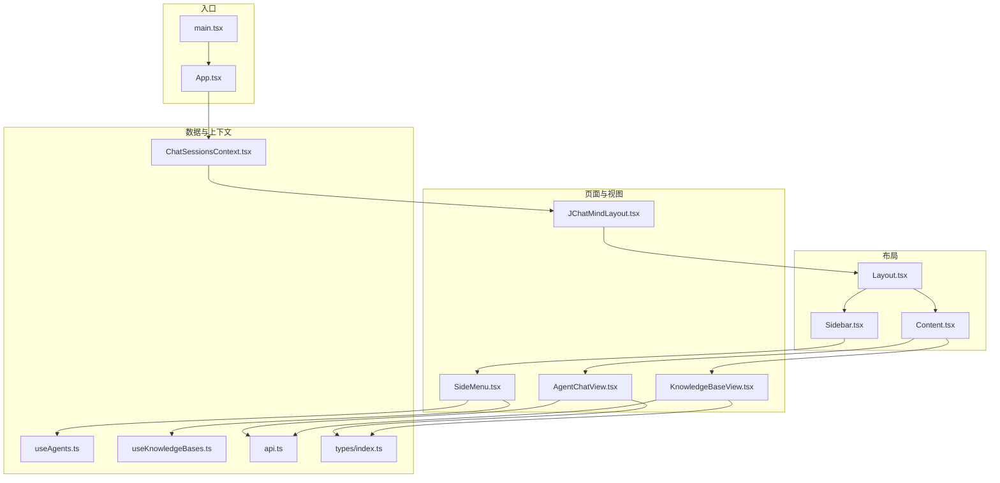
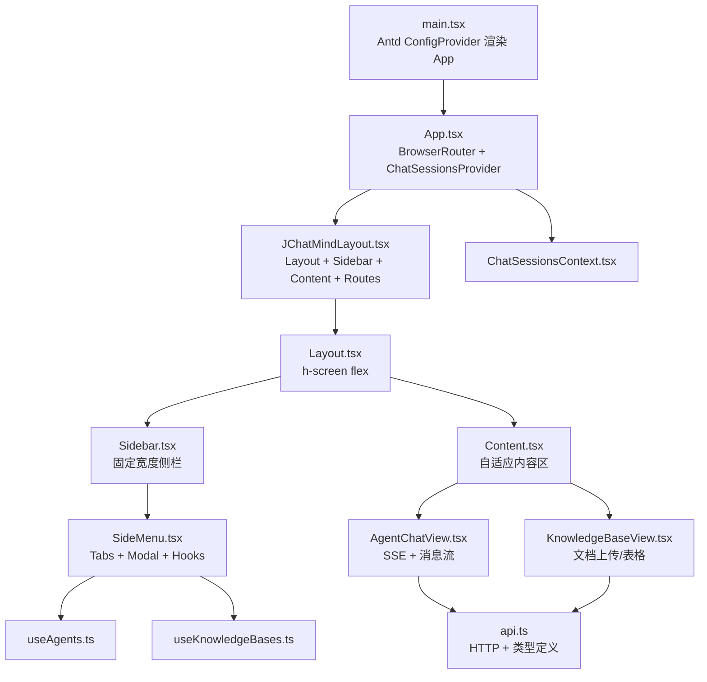
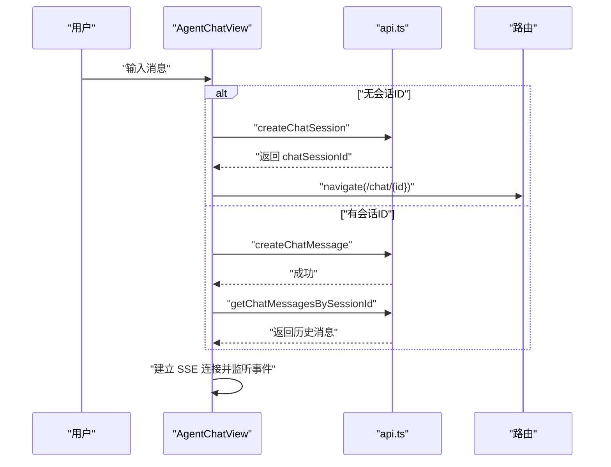
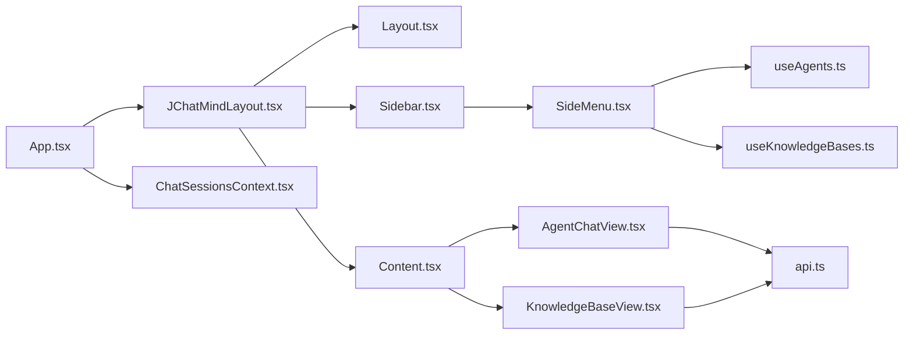

# React应用架构

<cite>
**本文引用的文件**
- [ui/src/App.tsx](file://ui/src/App.tsx)
- [ui/src/main.tsx](file://ui/src/main.tsx)
- [ui/src/layout/Layout.tsx](file://ui/src/layout/Layout.tsx)
- [ui/src/layout/Sidebar.tsx](file://ui/src/layout/Sidebar.tsx)
- [ui/src/layout/Content.tsx](file://ui/src/layout/Content.tsx)
- [ui/src/components/JChatMindLayout.tsx](file://ui/src/components/JChatMindLayout.tsx)
- [ui/src/components/Views/AgentChatView.tsx](file://ui/src/components/views/AgentChatView.tsx)
- [ui/src/components/Views/KnowledgeBaseView.tsx](file://ui/src/components/views/KnowledgeBaseView.tsx)
- [ui/src/components/SideMenu.tsx](file://ui/src/components/SideMenu.tsx)
- [ui/src/contexts/ChatSessionsContext.tsx](file://ui/src/contexts/ChatSessionsContext.tsx)
- [ui/src/hooks/useAgents.ts](file://ui/src/hooks/useAgents.ts)
- [ui/src/hooks/useKnowledgeBases.ts](file://ui/src/hooks/useKnowledgeBases.ts)
- [ui/src/api/api.ts](file://ui/src/api/api.ts)
- [ui/src/types/index.ts](file://ui/src/types/index.ts)
- [ui/package.json](file://ui/package.json)
</cite>

## 目录
1. [简介](#简介)
2. [项目结构](#项目结构)
3. [核心组件](#核心组件)
4. [架构总览](#架构总览)
5. [组件详细分析](#组件详细分析)
6. [依赖关系分析](#依赖关系分析)
7. [性能考量](#性能考量)
8. [故障排查指南](#故障排查指南)
9. [结论](#结论)
10. [附录：开发规范与最佳实践](#附录开发规范与最佳实践)

## 简介
本文件系统性梳理 JChatMind 前端（React）应用的架构设计与实现细节，覆盖路由配置、布局系统、页面组织、数据流与上下文、组件通信模式、类型体系、性能优化策略以及开发规范。目标是帮助开发者快速理解并高效维护该应用。

## 项目结构
前端位于 ui 目录，采用按功能域划分的目录组织方式：
- 入口与根组件：main.tsx、App.tsx
- 布局层：layout 下的 Layout、Sidebar、Content
- 页面与视图：components 下的 JChatMindLayout、SideMenu、views 子目录
- 数据与上下文：contexts、hooks、api
- 类型与工具：types、utils
- 构建与依赖：package.json、vite.config.ts、tsconfig 等

图表来源
- [ui/src/main.tsx:1-11](file://ui/src/main.tsx#L1-L11)
- [ui/src/App.tsx:1-16](file://ui/src/App.tsx#L1-L16)
- [ui/src/layout/Layout.tsx:1-12](file://ui/src/layout/Layout.tsx#L1-L12)
- [ui/src/layout/Sidebar.tsx:1-21](file://ui/src/layout/Sidebar.tsx#L1-L21)
- [ui/src/layout/Content.tsx:1-12](file://ui/src/layout/Content.tsx#L1-L12)
- [ui/src/components/JChatMindLayout.tsx:1-31](file://ui/src/components/JChatMindLayout.tsx#L1-L31)
- [ui/src/components/SideMenu.tsx:1-127](file://ui/src/components/SideMenu.tsx#L1-L127)
- [ui/src/components/views/AgentChatView.tsx:1-200](file://ui/src/components/views/AgentChatView.tsx#L1-L200)
- [ui/src/components/views/KnowledgeBaseView.tsx:1-247](file://ui/src/components/views/KnowledgeBaseView.tsx#L1-L247)
- [ui/src/contexts/ChatSessionsContext.tsx:1-66](file://ui/src/contexts/ChatSessionsContext.tsx#L1-L66)
- [ui/src/hooks/useAgents.ts:1-55](file://ui/src/hooks/useAgents.ts#L1-L55)
- [ui/src/hooks/useKnowledgeBases.ts:1-47](file://ui/src/hooks/useKnowledgeBases.ts#L1-L47)
- [ui/src/api/api.ts:1-378](file://ui/src/api/api.ts#L1-L378)
- [ui/src/types/index.ts:1-57](file://ui/src/types/index.ts#L1-L57)

章节来源
- [ui/src/main.tsx:1-11](file://ui/src/main.tsx#L1-L11)
- [ui/src/App.tsx:1-16](file://ui/src/App.tsx#L1-L16)
- [ui/src/package.json:1-44](file://ui/src/package.json#L1-L44)

## 核心组件
- 应用根组件 App.tsx：负责注入路由与全局上下文，作为应用的最小包裹层。
- 布局组件：Layout 提供全屏容器；Sidebar 固定宽度侧栏；Content 自适应填充剩余空间。
- 页面布局容器 JChatMindLayout：组合 Sidebar、Content 与路由规则，承载多页面导航。
- 视图组件：AgentChatView 实现聊天交互与 SSE 推送；KnowledgeBaseView 实现知识库详情与文档管理。
- 上下文与 Hooks：ChatSessionsContext 提供会话列表状态；useAgents/useKnowledgeBases 提供业务数据访问与刷新能力。
- 类型系统：集中定义消息、SSE、知识库等核心类型，确保前后端契约一致。

章节来源
- [ui/src/App.tsx:1-16](file://ui/src/App.tsx#L1-L16)
- [ui/src/layout/Layout.tsx:1-12](file://ui/src/layout/Layout.tsx#L1-L12)
- [ui/src/layout/Sidebar.tsx:1-21](file://ui/src/layout/Sidebar.tsx#L1-L21)
- [ui/src/layout/Content.tsx:1-12](file://ui/src/layout/Content.tsx#L1-L12)
- [ui/src/components/JChatMindLayout.tsx:1-31](file://ui/src/components/JChatMindLayout.tsx#L1-L31)
- [ui/src/components/views/AgentChatView.tsx:1-200](file://ui/src/components/views/AgentChatView.tsx#L1-L200)
- [ui/src/components/views/KnowledgeBaseView.tsx:1-247](file://ui/src/components/views/KnowledgeBaseView.tsx#L1-L247)
- [ui/src/contexts/ChatSessionsContext.tsx:1-66](file://ui/src/contexts/ChatSessionsContext.tsx#L1-L66)
- [ui/src/hooks/useAgents.ts:1-55](file://ui/src/hooks/useAgents.ts#L1-L55)
- [ui/src/hooks/useKnowledgeBases.ts:1-47](file://ui/src/hooks/useKnowledgeBases.ts#L1-L47)
- [ui/src/types/index.ts:1-57](file://ui/src/types/index.ts#L1-L57)

## 架构总览
应用采用“布局容器 + 路由 + 视图”的分层架构：
- 入口层：main.tsx 注入 Ant Design 国际化配置，渲染 App。
- 应用层：App 注入 BrowserRouter 与 ChatSessionsProvider。
- 布局层：JChatMindLayout 组合 Layout/Sidebar/Content，并声明路由表。
- 视图层：AgentChatView、KnowledgeBaseView 分别承载聊天与知识库功能。
- 数据层：api.ts 定义统一的 HTTP 访问方法与类型；hooks 与 contexts 提供状态与副作用封装。

图表来源
- [ui/src/main.tsx:1-11](file://ui/src/main.tsx#L1-L11)
- [ui/src/App.tsx:1-16](file://ui/src/App.tsx#L1-L16)
- [ui/src/components/JChatMindLayout.tsx:1-31](file://ui/src/components/JChatMindLayout.tsx#L1-L31)
- [ui/src/layout/Layout.tsx:1-12](file://ui/src/layout/Layout.tsx#L1-L12)
- [ui/src/layout/Sidebar.tsx:1-21](file://ui/src/layout/Sidebar.tsx#L1-L21)
- [ui/src/layout/Content.tsx:1-12](file://ui/src/layout/Content.tsx#L1-L12)
- [ui/src/components/SideMenu.tsx:1-127](file://ui/src/components/SideMenu.tsx#L1-L127)
- [ui/src/components/views/AgentChatView.tsx:1-200](file://ui/src/components/views/AgentChatView.tsx#L1-L200)
- [ui/src/components/views/KnowledgeBaseView.tsx:1-247](file://ui/src/components/views/KnowledgeBaseView.tsx#L1-L247)
- [ui/src/contexts/ChatSessionsContext.tsx:1-66](file://ui/src/contexts/ChatSessionsContext.tsx#L1-L66)
- [ui/src/hooks/useAgents.ts:1-55](file://ui/src/hooks/useAgents.ts#L1-L55)
- [ui/src/hooks/useKnowledgeBases.ts:1-47](file://ui/src/hooks/useKnowledgeBases.ts#L1-L47)
- [ui/src/api/api.ts:1-378](file://ui/src/api/api.ts#L1-L378)

## 组件详细分析

### 主应用组件 App.tsx
- 职责与生命周期
  - 在挂载阶段注入 BrowserRouter，使所有子组件具备路由能力。
  - 包裹 ChatSessionsProvider，向子树提供会话列表状态与刷新能力。
  - 返回根节点，不直接渲染业务逻辑，保持最小职责。
- 生命周期管理
  - Provider 的初始化在挂载阶段完成，内部通过 useEffect 触发数据拉取。
- 与其他组件的关系
  - 作为根容器，被 main.tsx 渲染；其子组件通过路由与上下文协作。

章节来源
- [ui/src/App.tsx:1-16](file://ui/src/App.tsx#L1-L16)
- [ui/src/contexts/ChatSessionsContext.tsx:1-66](file://ui/src/contexts/ChatSessionsContext.tsx#L1-L66)

### 布局系统：Layout、Sidebar、Content
- 设计理念
  - Layout 使用 flex 布局撑满屏幕高度，作为根容器。
  - Sidebar 固定宽度，用于放置侧边菜单与功能入口。
  - Content 自适应剩余空间，承载路由视图。
- 协作机制
  - JChatMindLayout 组合三者，形成“侧栏 + 内容区”的双栏布局。
  - 通过路由控制 Content 区域的视图切换。

章节来源
- [ui/src/layout/Layout.tsx:1-12](file://ui/src/layout/Layout.tsx#L1-L12)
- [ui/src/layout/Sidebar.tsx:1-21](file://ui/src/layout/Sidebar.tsx#L1-L21)
- [ui/src/layout/Content.tsx:1-12](file://ui/src/layout/Content.tsx#L1-L12)
- [ui/src/components/JChatMindLayout.tsx:1-31](file://ui/src/components/JChatMindLayout.tsx#L1-L31)

### 页面布局容器 JChatMindLayout
- 路由配置
  - 根路径与 /agent、/chat 重定向至 AgentChatView。
  - /chat/:chatSessionId 支持会话级聊天。
  - /knowledge-base 与 /knowledge-base/:knowledgeBaseId 支持知识库详情。
- 组件协作
  - 与 Layout/Sidebar/Content 形成稳定组合。
  - 与 SideMenu 配合，实现侧栏标签页与导航联动。

章节来源
- [ui/src/components/JChatMindLayout.tsx:1-31](file://ui/src/components/JChatMindLayout.tsx#L1-L31)

### 侧边栏菜单 SideMenu
- 功能模块
  - 智能体助手、聊天记录、知识库三大标签页。
  - 支持添加/编辑智能体、添加知识库、选择知识库跳转详情。
- 状态与交互
  - 使用 useState 管理模态框开关与编辑对象。
  - 使用 useNavigate 实现路由跳转。
  - 通过 useAgents/useKnowledgeBases 获取与更新数据。
- 与视图联动
  - 点击知识库项触发路由跳转至对应详情页。

章节来源
- [ui/src/components/SideMenu.tsx:1-127](file://ui/src/components/SideMenu.tsx#L1-L127)
- [ui/src/hooks/useAgents.ts:1-55](file://ui/src/hooks/useAgents.ts#L1-L55)
- [ui/src/hooks/useKnowledgeBases.ts:1-47](file://ui/src/hooks/useKnowledgeBases.ts#L1-L47)

### AgentChatView 聊天视图
- 核心流程
  - 参数解析：根据 chatSessionId 决定是否进入会话。
  - 初始化：若无会话则展示 EmptyAgentChatView；有会话则渲染聊天历史与输入。
  - 会话创建：当首次发送消息且无会话时，调用 createChatSession 并导航到新会话。
  - 消息获取：getChatMessagesBySessionId 加载历史消息。
  - SSE 推送：建立 EventSource 连接，监听 AI 状态与生成内容。
- 状态管理
  - 本地状态：messages、agentId、agent 状态显示开关与文本。
  - 上下文状态：通过 useChatSessions.refreshChatSessions 刷新会话列表。
- 错误处理
  - 对会话创建失败进行提示与日志输出。
  - SSE 连接错误统一记录。

图表来源
- [ui/src/components/views/AgentChatView.tsx:1-200](file://ui/src/components/views/AgentChatView.tsx#L1-L200)
- [ui/src/api/api.ts:1-378](file://ui/src/api/api.ts#L1-L378)

章节来源
- [ui/src/components/views/AgentChatView.tsx:1-200](file://ui/src/components/views/AgentChatView.tsx#L1-L200)
- [ui/src/api/api.ts:1-378](file://ui/src/api/api.ts#L1-L378)

### KnowledgeBaseView 知识库视图
- 功能要点
  - 当无知识库 ID 时，提示选择知识库。
  - 当知识库不存在时，提示检查 ID。
  - 展示知识库详情卡片与文档上传区域。
  - 文档列表以表格形式展示，支持删除确认。
- 交互与状态
  - 使用 useDocuments 获取文档列表与刷新能力。
  - 上传使用自定义 customRequest，统一错误提示与刷新。
- 性能与体验
  - 分页展示（每页 10 条），空状态友好提示。

章节来源
- [ui/src/components/views/KnowledgeBaseView.tsx:1-247](file://ui/src/components/views/KnowledgeBaseView.tsx#L1-L247)
- [ui/src/hooks/useKnowledgeBases.ts:1-47](file://ui/src/hooks/useKnowledgeBases.ts#L1-L47)

### ChatSessionsContext 会话上下文
- 职责
  - 维护 chatSessions 列表与 loading 状态。
  - 提供 refreshChatSessions 与 deleteChatSession 方法。
- 生命周期
  - 在挂载时自动拉取一次会话列表。
  - 删除会话后重新拉取，保证 UI 一致性。
- 使用建议
  - 仅在需要共享会话状态的组件中使用，避免过度消费。

章节来源
- [ui/src/contexts/ChatSessionsContext.tsx:1-66](file://ui/src/contexts/ChatSessionsContext.tsx#L1-L66)

### 类型系统与 API 抽象
- 类型定义
  - 消息类型、SSE 消息类型与负载、知识库与文档结构等集中在 types/index.ts。
- API 抽象
  - api.ts 统一封装 GET/POST/PATCH/DELETE，提供强类型接口与响应模型。
  - 与 hooks 结合，形成“数据获取 + 状态刷新”的标准模式。

章节来源
- [ui/src/types/index.ts:1-57](file://ui/src/types/index.ts#L1-L57)
- [ui/src/api/api.ts:1-378](file://ui/src/api/api.ts#L1-L378)

## 依赖关系分析
- 组件耦合
  - App.tsx 与 JChatMindLayout 低耦合，通过路由解耦。
  - SideMenu 依赖 useAgents/useKnowledgeBases，形成业务层依赖。
  - AgentChatView 与 KnowledgeBaseView 分别依赖各自的数据层与路由。
- 外部依赖
  - react-router-dom：路由与导航。
  - antd：UI 组件与国际化。
  - @ant-design/icons：图标资源。
- 可能的循环依赖
  - 当前结构未见显式循环依赖；注意避免在 hooks 中反向依赖组件。

图表来源
- [ui/src/App.tsx:1-16](file://ui/src/App.tsx#L1-L16)
- [ui/src/components/JChatMindLayout.tsx:1-31](file://ui/src/components/JChatMindLayout.tsx#L1-L31)
- [ui/src/layout/Layout.tsx:1-12](file://ui/src/layout/Layout.tsx#L1-L12)
- [ui/src/layout/Sidebar.tsx:1-21](file://ui/src/layout/Sidebar.tsx#L1-L21)
- [ui/src/layout/Content.tsx:1-12](file://ui/src/layout/Content.tsx#L1-L12)
- [ui/src/components/SideMenu.tsx:1-127](file://ui/src/components/SideMenu.tsx#L1-L127)
- [ui/src/components/views/AgentChatView.tsx:1-200](file://ui/src/components/views/AgentChatView.tsx#L1-L200)
- [ui/src/components/views/KnowledgeBaseView.tsx:1-247](file://ui/src/components/views/KnowledgeBaseView.tsx#L1-L247)
- [ui/src/hooks/useAgents.ts:1-55](file://ui/src/hooks/useAgents.ts#L1-L55)
- [ui/src/hooks/useKnowledgeBases.ts:1-47](file://ui/src/hooks/useKnowledgeBases.ts#L1-L47)
- [ui/src/contexts/ChatSessionsContext.tsx:1-66](file://ui/src/contexts/ChatSessionsContext.tsx#L1-L66)
- [ui/src/api/api.ts:1-378](file://ui/src/api/api.ts#L1-L378)

## 性能考量
- 渲染优化
  - 使用 React.FC 与不可变更新策略，减少不必要的重渲染。
  - 在 AgentChatView 中对消息数组使用不可变拼接，避免深层比较开销。
- 异步与并发
  - ChatSessionsContext 使用 useCallback 包装异步函数，避免重复创建导致的无效渲染。
  - KnowledgeBaseView 使用分页表格，限制一次性渲染的数据量。
- 网络与 SSE
  - AgentChatView 在组件卸载时关闭 SSE 连接，防止内存泄漏。
  - API 层统一错误处理，避免异常冒泡影响 UI。
- 构建与打包
  - 使用 Vite 与 Rolldown，提升开发与构建效率。

[本节为通用性能指导，无需特定文件引用]

## 故障排查指南
- 路由跳转无效
  - 检查 JChatMindLayout 的路由配置与路径参数是否匹配。
  - 确认 SideMenu 的 useNavigate 调用与目标路径一致。
- 会话列表不刷新
  - 确认 ChatSessionsContext 的 refreshChatSessions 是否被调用。
  - 检查删除操作后是否再次触发 fetchChatSessions。
- SSE 无法接收消息
  - 检查服务端 SSE 地址与会话 ID 是否正确。
  - 关注浏览器控制台的网络与事件监听状态。
- 文件上传失败
  - 检查知识库 ID 是否存在，确认后端上传接口返回码与消息。

章节来源
- [ui/src/components/JChatMindLayout.tsx:1-31](file://ui/src/components/JChatMindLayout.tsx#L1-L31)
- [ui/src/components/SideMenu.tsx:1-127](file://ui/src/components/SideMenu.tsx#L1-L127)
- [ui/src/contexts/ChatSessionsContext.tsx:1-66](file://ui/src/contexts/ChatSessionsContext.tsx#L1-L66)
- [ui/src/components/views/AgentChatView.tsx:1-200](file://ui/src/components/views/AgentChatView.tsx#L1-L200)
- [ui/src/components/views/KnowledgeBaseView.tsx:1-247](file://ui/src/components/views/KnowledgeBaseView.tsx#L1-L247)

## 结论
JChatMind 前端采用清晰的分层架构：入口层负责环境配置，布局层提供稳定的容器与导航，视图层聚焦业务场景，数据层通过 API 与上下文统一抽象。该架构具备良好的可扩展性与可维护性，适合持续迭代与团队协作。

[本节为总结性内容，无需特定文件引用]

## 附录：开发规范与最佳实践
- 目录与命名
  - 按功能域组织文件，组件以大驼峰命名，页面视图以 View 结尾。
- 组件设计
  - 优先使用函数组件与 Hooks，避免复杂类组件。
  - 将可复用 UI 逻辑下沉为独立组件或自定义 Hooks。
- 类型安全
  - 所有 API 请求与响应均在 types/index.ts 中定义，确保前后端契约一致。
- 状态管理
  - 全局状态放入 Context，局部状态保留在组件内。
  - 使用 useCallback 与 useMemo 降低渲染成本。
- 错误处理
  - 统一在视图层进行用户可见的错误提示，同时保留日志输出便于调试。
- 路由与导航
  - 路由配置集中于 JChatMindLayout，避免散落各处。
- 开发工具
  - 使用 ESLint、Prettier、TailwindCSS 保证代码风格与样式一致性。

章节来源
- [ui/src/package.json:1-44](file://ui/src/package.json#L1-L44)
- [ui/src/types/index.ts:1-57](file://ui/src/types/index.ts#L1-L57)
- [ui/src/api/api.ts:1-378](file://ui/src/api/api.ts#L1-L378)