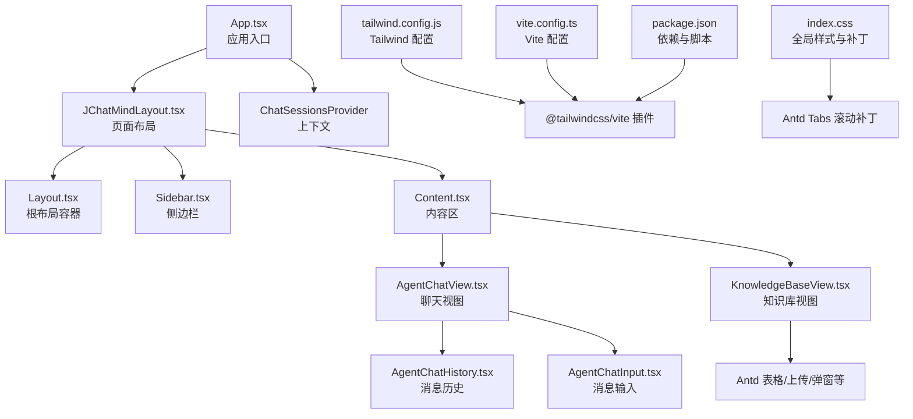
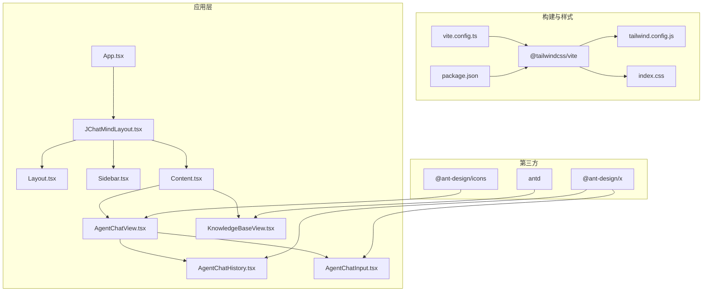
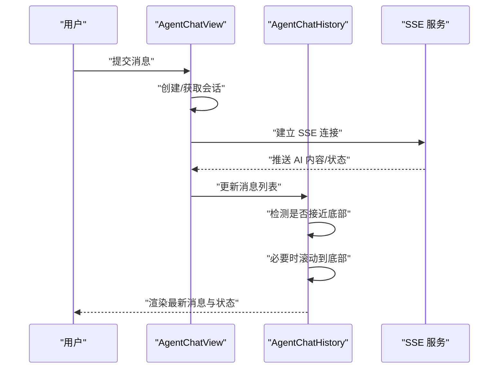
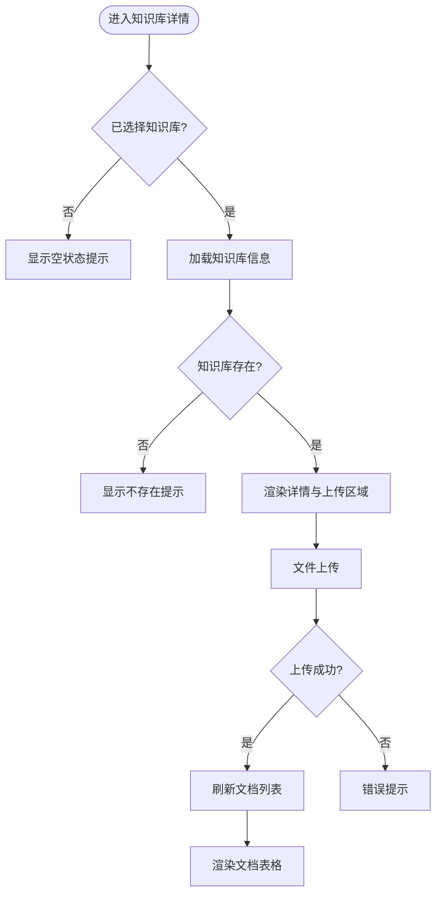
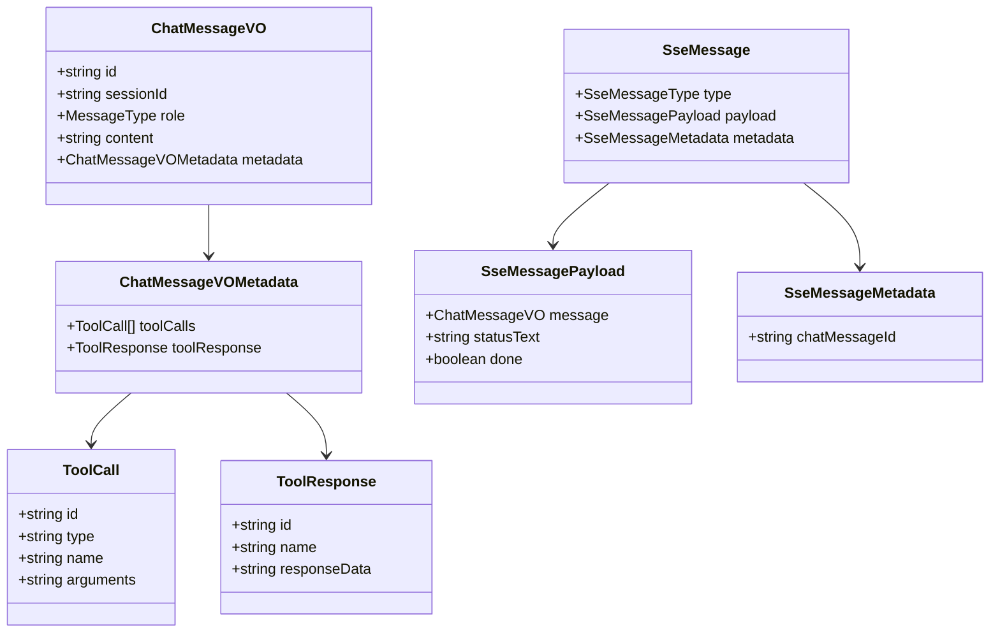
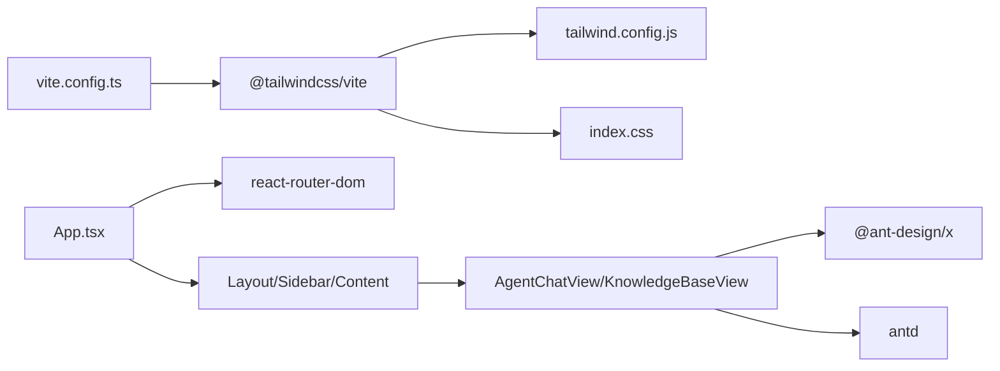

# UI设计系统

<cite>
**本文引用的文件**
- [tailwind.config.js](file://ui/tailwind.config.js)
- [index.css](file://ui/src/index.css)
- [package.json](file://ui/package.json)
- [vite.config.ts](file://ui/vite.config.ts)
- [App.tsx](file://ui/src/App.tsx)
- [JChatMindLayout.tsx](file://ui/src/components/JChatMindLayout.tsx)
- [Layout.tsx](file://ui/src/layout/Layout.tsx)
- [Sidebar.tsx](file://ui/src/layout/Sidebar.tsx)
- [Content.tsx](file://ui/src/layout/Content.tsx)
- [AgentChatView.tsx](file://ui/src/components/views/AgentChatView.tsx)
- [AgentChatHistory.tsx](file://ui/src/components/views/agentChatView/AgentChatHistory.tsx)
- [AgentChatInput.tsx](file://ui/src/components/views/agentChatView/AgentChatInput.tsx)
- [EmptyAgentChatView.tsx](file://ui/src/components/views/agentChatView/EmptyAgentChatView.tsx)
- [KnowledgeBaseView.tsx](file://ui/src/components/views/KnowledgeBaseView.tsx)
- [index.ts](file://ui/src/types/index.ts)
</cite>

## 目录
1. [简介](#简介)
2. [项目结构](#项目结构)
3. [核心组件](#核心组件)
4. [架构总览](#架构总览)
5. [详细组件分析](#详细组件分析)
6. [依赖分析](#依赖分析)
7. [性能考量](#性能考量)
8. [故障排查指南](#故障排查指南)
9. [结论](#结论)
10. [附录](#附录)

## 简介
本设计文档面向 JChatMind 的前端 UI 设计系统，聚焦 Tailwind CSS 的配置与定制化方案，涵盖颜色系统、字体规范、间距标准；深入解析聊天界面的消息气泡样式、输入区域设计与滚动行为；阐述知识库界面的布局与交互；给出组件样式的统一规范（按钮、表单控件、卡片等）；总结响应式与移动端适配策略；说明主题切换与暗色模式支持现状与扩展建议；并提供样式复用、CSS 变量使用与动画效果的最佳实践，以及可访问性与浏览器兼容性要点。

## 项目结构
UI 层采用 React + Vite 构建，Tailwind CSS v4 通过 @tailwindcss/vite 插件集成。项目采用按功能域分层组织：布局组件、视图组件、上下文与钩子、API 与类型定义。路由通过 React Router v7 管理，Ant Design 作为基础 UI 组件库，Ant Design X 提供高级组件如 Bubble、Sender、XMarkdown。

图表来源
- [App.tsx:1-16](file://ui/src/App.tsx#L1-L16)
- [JChatMindLayout.tsx:1-31](file://ui/src/components/JChatMindLayout.tsx#L1-L31)
- [Layout.tsx:1-12](file://ui/src/layout/Layout.tsx#L1-L12)
- [Sidebar.tsx:1-21](file://ui/src/layout/Sidebar.tsx#L1-L21)
- [Content.tsx:1-12](file://ui/src/layout/Content.tsx#L1-L12)
- [AgentChatView.tsx:1-200](file://ui/src/components/views/AgentChatView.tsx#L1-L200)
- [AgentChatHistory.tsx:1-300](file://ui/src/components/views/agentChatView/AgentChatHistory.tsx#L1-L300)
- [AgentChatInput.tsx:1-25](file://ui/src/components/views/agentChatView/AgentChatInput.tsx#L1-L25)
- [KnowledgeBaseView.tsx:1-247](file://ui/src/components/views/KnowledgeBaseView.tsx#L1-L247)
- [tailwind.config.js:1-59](file://ui/tailwind.config.js#L1-L59)
- [vite.config.ts:1-9](file://ui/vite.config.ts#L1-L9)
- [index.css:1-34](file://ui/src/index.css#L1-L34)
- [package.json:1-44](file://ui/package.json#L1-L44)

章节来源
- [App.tsx:1-16](file://ui/src/App.tsx#L1-L16)
- [JChatMindLayout.tsx:1-31](file://ui/src/components/JChatMindLayout.tsx#L1-L31)
- [Layout.tsx:1-12](file://ui/src/layout/Layout.tsx#L1-L12)
- [Sidebar.tsx:1-21](file://ui/src/layout/Sidebar.tsx#L1-L21)
- [Content.tsx:1-12](file://ui/src/layout/Content.tsx#L1-L12)
- [AgentChatView.tsx:1-200](file://ui/src/components/views/AgentChatView.tsx#L1-L200)
- [AgentChatHistory.tsx:1-300](file://ui/src/components/views/agentChatView/AgentChatHistory.tsx#L1-L300)
- [AgentChatInput.tsx:1-25](file://ui/src/components/views/agentChatView/AgentChatInput.tsx#L1-L25)
- [KnowledgeBaseView.tsx:1-247](file://ui/src/components/views/KnowledgeBaseView.tsx#L1-L247)
- [tailwind.config.js:1-59](file://ui/tailwind.config.js#L1-L59)
- [vite.config.ts:1-9](file://ui/vite.config.ts#L1-L9)
- [index.css:1-34](file://ui/src/index.css#L1-L34)
- [package.json:1-44](file://ui/package.json#L1-L44)

## 核心组件
- 应用入口与路由：BrowserRouter 包裹应用，路由集中于 JChatMindLayout，负责导航到 AgentChatView 与 KnowledgeBaseView。
- 布局容器：Layout 提供全屏 flex 布局；Sidebar 固定宽度并浅色背景；Content 占满剩余空间。
- 聊天视图：AgentChatView 负责会话管理、消息拉取、SSE 推送、输入处理；AgentChatHistory 负责渲染消息与工具调用、滚动控制；AgentChatInput 使用 Ant Design X Sender。
- 知识库视图：KnowledgeBaseView 负责知识库详情、文档上传、表格展示与删除确认。
- 全局样式：index.css 对 Antd Tabs 在 flex 布局下的滚动问题进行补丁，并提供隐藏滚动条的通用类。

章节来源
- [App.tsx:1-16](file://ui/src/App.tsx#L1-L16)
- [JChatMindLayout.tsx:1-31](file://ui/src/components/JChatMindLayout.tsx#L1-L31)
- [Layout.tsx:1-12](file://ui/src/layout/Layout.tsx#L1-L12)
- [Sidebar.tsx:1-21](file://ui/src/layout/Sidebar.tsx#L1-L21)
- [Content.tsx:1-12](file://ui/src/layout/Content.tsx#L1-L12)
- [AgentChatView.tsx:1-200](file://ui/src/components/views/AgentChatView.tsx#L1-L200)
- [AgentChatHistory.tsx:1-300](file://ui/src/components/views/agentChatView/AgentChatHistory.tsx#L1-L300)
- [AgentChatInput.tsx:1-25](file://ui/src/components/views/agentChatView/AgentChatInput.tsx#L1-L25)
- [KnowledgeBaseView.tsx:1-247](file://ui/src/components/views/KnowledgeBaseView.tsx#L1-L247)
- [index.css:1-34](file://ui/src/index.css#L1-L34)

## 架构总览
下图展示 UI 层与 Tailwind、插件及第三方组件的关系：

图表来源
- [vite.config.ts:1-9](file://ui/vite.config.ts#L1-L9)
- [package.json:1-44](file://ui/package.json#L1-L44)
- [tailwind.config.js:1-59](file://ui/tailwind.config.js#L1-L59)
- [index.css:1-34](file://ui/src/index.css#L1-L34)
- [App.tsx:1-16](file://ui/src/App.tsx#L1-L16)
- [JChatMindLayout.tsx:1-31](file://ui/src/components/JChatMindLayout.tsx#L1-L31)
- [Layout.tsx:1-12](file://ui/src/layout/Layout.tsx#L1-L12)
- [Sidebar.tsx:1-21](file://ui/src/layout/Sidebar.tsx#L1-L21)
- [Content.tsx:1-12](file://ui/src/layout/Content.tsx#L1-L12)
- [AgentChatView.tsx:1-200](file://ui/src/components/views/AgentChatView.tsx#L1-L200)
- [AgentChatHistory.tsx:1-300](file://ui/src/components/views/agentChatView/AgentChatHistory.tsx#L1-L300)
- [AgentChatInput.tsx:1-25](file://ui/src/components/views/agentChatView/AgentChatInput.tsx#L1-L25)
- [KnowledgeBaseView.tsx:1-247](file://ui/src/components/views/KnowledgeBaseView.tsx#L1-L247)

## 详细组件分析

### Tailwind CSS 配置与定制化
- 内容扫描：content 指向 index.html 与 src 下所有 TS/JS 文件，确保按需生成样式。
- 主题扩展：
  - keyframes：fade-in、fadeIn、slideIn、spin-slow、bling、shimmer。
  - animation：将 keyframes 绑定为命名动画，便于在组件中直接使用。
- 插件：当前为空，预留扩展点（如自定义工具函数、组件变体）。
- 与 Vite 集成：通过 @tailwindcss/vite 插件在构建阶段注入 Tailwind 指令与实用类。

最佳实践
- 使用命名动画类而非内联样式，提升复用性与一致性。
- 通过 keyframes 扩展动效，避免重复定义相同动画序列。
- 保持 content 路径覆盖所有模板文件，避免样式被意外移除。

章节来源
- [tailwind.config.js:1-59](file://ui/tailwind.config.js#L1-L59)
- [vite.config.ts:1-9](file://ui/vite.config.ts#L1-L9)
- [package.json:1-44](file://ui/package.json#L1-L44)

### 全局样式与第三方补丁
- Antd Tabs 在 flex 布局下的滚动问题：通过设置 .ant-tabs 的 flex 方向与高度、内容区最小高度与溢出控制，保证 TabPane 可滚动。
- 隐藏滚动条：提供 .scrollbar-hide 类，兼容 Webkit、Firefox、IE/Edge。
- 通用样式：引入 Tailwind 指令，确保构建产物包含所需样式。

章节来源
- [index.css:1-34](file://ui/src/index.css#L1-L34)

### 聊天界面设计规范
- 布局结构：AgentChatView 采用纵向 flex，上方为消息历史，下方为输入区域。
- 消息气泡样式：
  - Assistant：使用 Ant Design X Bubble，起始对齐；支持工具调用预览与 Markdown 渲染。
  - User：使用 Bubble，末端对齐。
  - Tool：非气泡简洁展示，支持折叠查看响应数据。
  - System：居中圆角标签，轻提示风格。
- 输入区域：使用 Ant Design X Sender，支持占位符、提交回调与值绑定。
- 滚动行为：
  - 自动滚动：当消息新增且用户接近底部时滚动到底部；状态消息出现时同样触发。
  - 用户控制：监听滚动事件，维护“接近底部”状态，避免打断用户阅读。
  - 性能优化：使用 requestAnimationFrame 确保 DOM 更新后再滚动；passive 事件监听减少主线程阻塞。
- 状态指示：根据 SSE 类型显示“规划/思考/执行/完成”状态文本与脉冲动画。

图表来源
- [AgentChatView.tsx:55-170](file://ui/src/components/views/AgentChatView.tsx#L55-L170)
- [AgentChatHistory.tsx:119-182](file://ui/src/components/views/agentChatView/AgentChatHistory.tsx#L119-L182)

章节来源
- [AgentChatView.tsx:1-200](file://ui/src/components/views/AgentChatView.tsx#L1-L200)
- [AgentChatHistory.tsx:1-300](file://ui/src/components/views/agentChatView/AgentChatHistory.tsx#L1-L300)
- [AgentChatInput.tsx:1-25](file://ui/src/components/views/agentChatView/AgentChatInput.tsx#L1-L25)

### 知识库界面设计规范
- 布局：纵向卡片 + 表格组合，顶部知识库信息卡片，中部上传区域，底部文档列表。
- 上传流程：选择文件后调用 uploadDocument，成功后刷新列表并提示成功；失败时错误提示。
- 表格列：文件名（含图标）、类型、大小（格式化显示）、操作（删除确认）。
- 状态提示：未选择知识库时显示空状态；知识库不存在时提示检查 ID。

图表来源
- [KnowledgeBaseView.tsx:27-247](file://ui/src/components/views/KnowledgeBaseView.tsx#L27-L247)

章节来源
- [KnowledgeBaseView.tsx:1-247](file://ui/src/components/views/KnowledgeBaseView.tsx#L1-L247)

### 组件样式统一规范
- 按钮：优先使用 Antd Button，配合语义化尺寸与图标；主操作使用 primary，危险操作使用 danger。
- 表单控件：Antd Select、Upload、Table 等组件统一使用 Antd 样式体系；自定义选项渲染保持一致的图标与文字排版。
- 卡片：Antd Card 提供阴影与悬停效果；内容区使用等间距与对齐规则，确保视觉层级清晰。
- 间距与留白：使用 Tailwind 的 margin/padding 实用类，结合语义化命名（如 mb-4、p-6）统一间距。
- 颜色：基于 Antd 默认色板与 Tailwind 默认色板；强调色使用蓝色系，辅助信息使用灰色系。

章节来源
- [EmptyAgentChatView.tsx:93-149](file://ui/src/components/views/agentChatView/EmptyAgentChatView.tsx#L93-L149)
- [KnowledgeBaseView.tsx:194-240](file://ui/src/components/views/KnowledgeBaseView.tsx#L194-L240)

### 响应式设计与移动端适配
- 布局：Layout 采用 h-screen flex，Sidebar 固定宽度，Content 使用 flex-1 自适应；整体在桌面端表现稳定。
- 移动端建议：
  - 将 Sidebar 抽离为可折叠抽屉，或在小屏时隐藏侧边菜单，使用顶部导航。
  - 聊天输入区域固定底部，内容区使用相对定位与安全区适配。
  - 表格列在窄屏时采用紧凑模式或转为列表卡片展示。
  - 字体与触摸目标尺寸按最小 44px 触控密度调整。

[本节为通用策略说明，不直接分析具体文件，故无章节来源]

### 主题切换与暗色模式支持
- 现状：Tailwind 配置未启用暗色模式；全局样式未包含深色变量映射。
- 建议：
  - 在 tailwind.config.js 中启用 darkMode 选项（class 或 media），并为关键组件补充暗色变体。
  - 通过 CSS 变量统一管理前景/背景色，结合媒体查询或用户偏好自动切换。
  - 为 Antd 组件提供暗色主题包或覆盖其内部颜色变量，确保图标与边框在深色下可见。

章节来源
- [tailwind.config.js:1-59](file://ui/tailwind.config.js#L1-L59)

### 动画与交互细节
- 动画：通过 Tailwind keyframes 定义淡入、滑入、旋转、闪烁、辉光等动画；在组件中以类名方式复用。
- 交互：AgentChatHistory 使用 requestAnimationFrame 与被动事件监听优化滚动体验；工具调用与响应支持折叠展开。
- 状态反馈：SSE 推送不同类型消息时更新 UI 状态；上传过程显示 loading 状态。

章节来源
- [tailwind.config.js:6-55](file://ui/tailwind.config.js#L6-L55)
- [AgentChatHistory.tsx:119-182](file://ui/src/components/views/agentChatView/AgentChatHistory.tsx#L119-L182)
- [AgentChatView.tsx:120-170](file://ui/src/components/views/AgentChatView.tsx#L120-L170)

### 数据模型与类型约束
- 消息类型：用户、助手、系统、工具。
- 工具调用与响应：包含名称、参数/结果的 JSON 字符串与唯一标识。
- SSE 消息：包含类型、载荷（消息与状态文本）、元数据（消息 ID）。

图表来源
- [index.ts:1-57](file://ui/src/types/index.ts#L1-L57)

章节来源
- [index.ts:1-57](file://ui/src/types/index.ts#L1-L57)

## 依赖分析
- 构建链路：Vite 通过 @tailwindcss/vite 插件集成 Tailwind；Tailwind 读取 tailwind.config.js 并扫描源码生成样式；index.css 提供全局补丁。
- 组件生态：Antd 提供基础 UI；Ant Design X 提供高级组件（Bubble、Sender、XMarkdown）；React Router v7 管理路由。
- 版本关系：Tailwind v4、@tailwindcss/vite、React 19、Antd 6、Ant Design X 2。

图表来源
- [vite.config.ts:1-9](file://ui/vite.config.ts#L1-L9)
- [tailwind.config.js:1-59](file://ui/tailwind.config.js#L1-L59)
- [index.css:1-34](file://ui/src/index.css#L1-L34)
- [App.tsx:1-16](file://ui/src/App.tsx#L1-L16)
- [AgentChatView.tsx:1-200](file://ui/src/components/views/AgentChatView.tsx#L1-L200)
- [KnowledgeBaseView.tsx:1-247](file://ui/src/components/views/KnowledgeBaseView.tsx#L1-L247)

章节来源
- [package.json:1-44](file://ui/package.json#L1-L44)
- [vite.config.ts:1-9](file://ui/vite.config.ts#L1-L9)
- [tailwind.config.js:1-59](file://ui/tailwind.config.js#L1-L59)
- [index.css:1-34](file://ui/src/index.css#L1-L34)
- [App.tsx:1-16](file://ui/src/App.tsx#L1-L16)

## 性能考量
- 滚动优化：使用被动事件监听与 requestAnimationFrame，降低滚动抖动与重绘成本。
- 按需样式：Tailwind content 覆盖完整源码路径，避免未使用样式被移除。
- 组件懒加载：路由级组件已按路径拆分，可进一步对重型视图做动态导入。
- 图标与媒体：Ant Design Icons 仅按需引入，避免打包冗余。

[本节为通用指导，不直接分析具体文件，故无章节来源]

## 故障排查指南
- Antd Tabs 滚动异常：确认 .ant-tabs、.ant-tabs-content-holder、.ant-tabs-tabpane 的样式规则生效；检查父容器是否具备高度与 flex。
- 滚动条不可见但可滚动：使用 .scrollbar-hide 类；若仍不可见，检查浏览器兼容性与样式优先级。
- 聊天消息不自动滚动：检查 AgentChatHistory 的“接近底部”判断逻辑与滚动触发条件；确认消息长度变化检测与 DOM 更新时机。
- SSE 连接失败：检查路由参数 chatSessionId 是否有效；确认后端 SSE 地址与跨域配置。

章节来源
- [index.css:3-33](file://ui/src/index.css#L3-L33)
- [AgentChatHistory.tsx:119-182](file://ui/src/components/views/agentChatView/AgentChatHistory.tsx#L119-L182)
- [AgentChatView.tsx:120-170](file://ui/src/components/views/AgentChatView.tsx#L120-L170)

## 结论
本设计系统以 Tailwind CSS v4 为核心样式引擎，结合 Ant Design 与 Ant Design X 实现高质量 UI 交付。聊天界面通过消息气泡、工具调用展示与智能滚动获得良好交互体验；知识库界面以卡片与表格清晰呈现内容；全局样式补丁解决第三方组件在 flex 布局下的常见问题。建议后续完善暗色模式、移动端抽屉式导航与更细粒度的 CSS 变量体系，持续提升可访问性与可维护性。

[本节为总结性内容，不直接分析具体文件，故无章节来源]

## 附录
- 可访问性建议：为交互元素提供键盘可达性；为图片与图标提供替代文本；确保对比度满足 WCAG；为加载状态提供 ARIA 状态描述。
- 浏览器兼容性：Tailwind v4 与现代浏览器兼容；Antd 6 需关注旧版 IE 支持；移动端优先使用 Flexbox 与相对单位，避免绝对像素硬编码。

[本节为通用指导，不直接分析具体文件，故无章节来源]