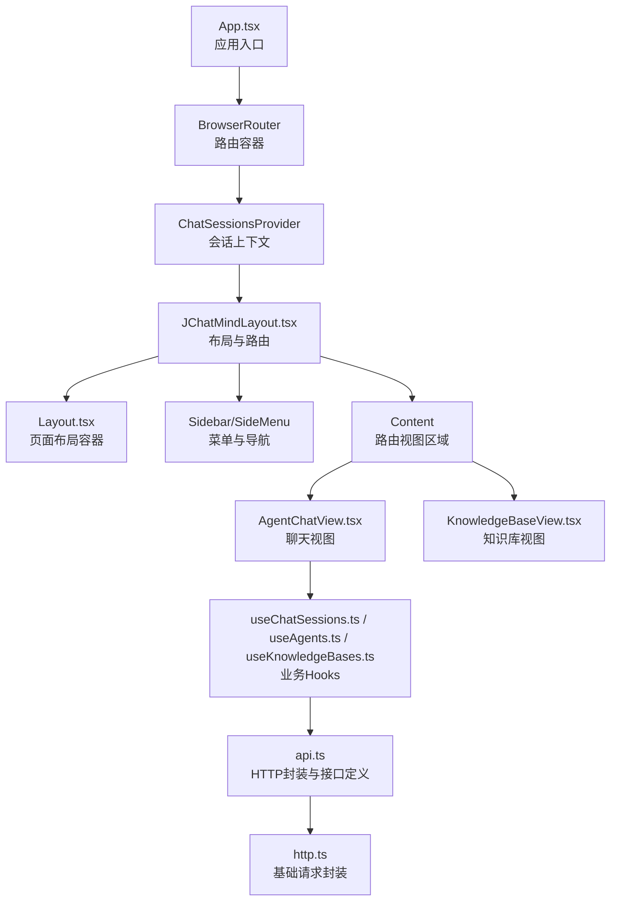
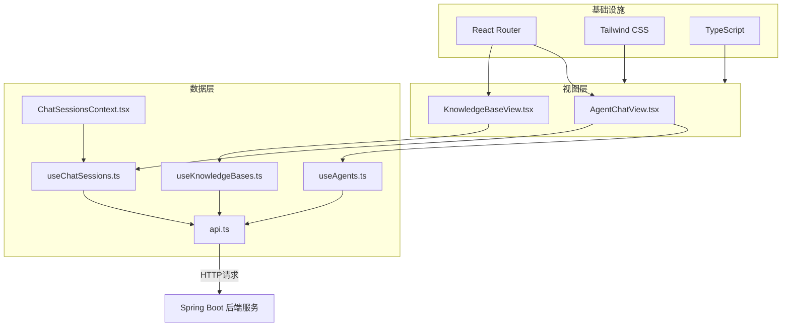
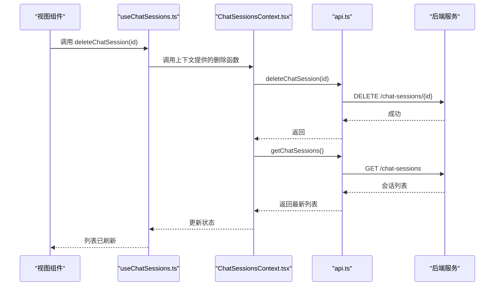
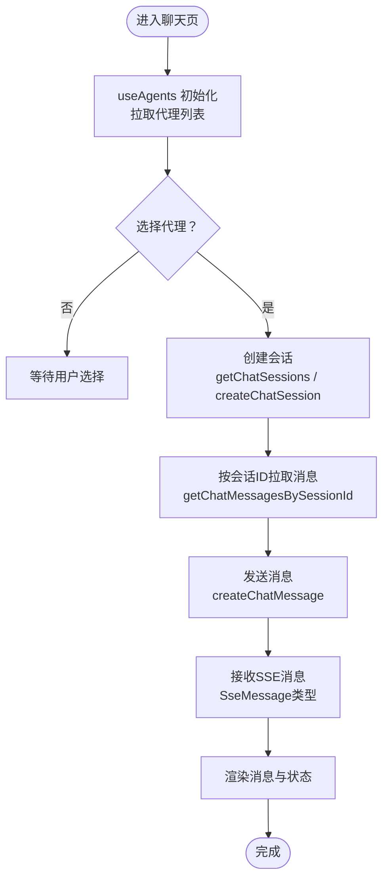
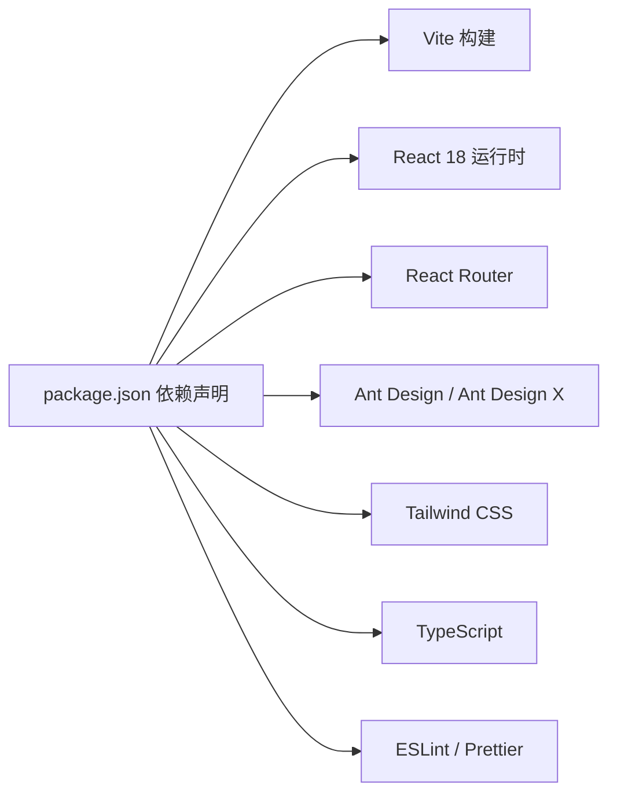

# 前端开发指南

<cite>
**本文引用的文件**
- [ui/package.json](file://ui/package.json)
- [ui/vite.config.ts](file://ui/vite.config.ts)
- [ui/tailwind.config.js](file://ui/tailwind.config.js)
- [ui/tsconfig.json](file://ui/tsconfig.json)
- [ui/src/App.tsx](file://ui/src/App.tsx)
- [ui/src/components/JChatMindLayout.tsx](file://ui/src/components/JChatMindLayout.tsx)
- [ui/src/contexts/ChatSessionsContext.tsx](file://ui/src/contexts/ChatSessionsContext.tsx)
- [ui/src/hooks/useChatSessions.ts](file://ui/src/hooks/useChatSessions.ts)
- [ui/src/hooks/useAgents.ts](file://ui/src/hooks/useAgents.ts)
- [ui/src/hooks/useKnowledgeBases.ts](file://ui/src/hooks/useKnowledgeBases.ts)
- [ui/src/api/api.ts](file://ui/src/api/api.ts)
- [ui/src/types/index.ts](file://ui/src/types/index.ts)
- [ui/src/layout/Layout.tsx](file://ui/src/layout/Layout.tsx)
</cite>

## 目录
1. [引言](#引言)
2. [项目结构](#项目结构)
3. [核心组件](#核心组件)
4. [架构总览](#架构总览)
5. [详细组件分析](#详细组件分析)
6. [依赖关系分析](#依赖关系分析)
7. [性能考虑](#性能考虑)
8. [故障排查指南](#故障排查指南)
9. [结论](#结论)
10. [附录](#附录)

## 引言
本指南面向JChatMind前端团队，系统阐述基于React 18 + TypeScript + Tailwind CSS的开发体系与最佳实践。内容覆盖技术栈选择、组件化设计、Hooks与Context状态管理、聊天界面、代理管理与知识库管理三大功能模块的实现要点、API集成与错误处理、用户体验优化、组件复用与样式定制、响应式设计以及开发环境配置与调试技巧。

## 项目结构
前端位于ui目录，采用Vite构建，Tailwind CSS作为原子化样式框架，TypeScript提供强类型保障。应用通过React Router进行路由分发，布局由自定义Layout与侧边栏组合，核心业务通过Context与自定义Hooks封装数据流。

图表来源
- [ui/src/App.tsx:1-16](file://ui/src/App.tsx#L1-L16)
- [ui/src/components/JChatMindLayout.tsx:1-31](file://ui/src/components/JChatMindLayout.tsx#L1-L31)
- [ui/src/contexts/ChatSessionsContext.tsx:1-66](file://ui/src/contexts/ChatSessionsContext.tsx#L1-L66)
- [ui/src/hooks/useChatSessions.ts:1-6](file://ui/src/hooks/useChatSessions.ts#L1-L6)
- [ui/src/hooks/useAgents.ts:1-55](file://ui/src/hooks/useAgents.ts#L1-L55)
- [ui/src/hooks/useKnowledgeBases.ts:1-47](file://ui/src/hooks/useKnowledgeBases.ts#L1-L47)
- [ui/src/api/api.ts:1-378](file://ui/src/api/api.ts#L1-L378)

章节来源
- [ui/package.json:1-44](file://ui/package.json#L1-L44)
- [ui/vite.config.ts:1-9](file://ui/vite.config.ts#L1-L9)
- [ui/tailwind.config.js:1-59](file://ui/tailwind.config.js#L1-L59)
- [ui/tsconfig.json:1-8](file://ui/tsconfig.json#L1-L8)

## 核心组件
- 应用入口与路由：在App中装配BrowserRouter与ChatSessionsProvider，并挂载JChatMindLayout；JChatMindLayout负责侧边栏、内容区与多路由视图的组织。
- 布局容器：Layout提供基础页面骨架，确保全屏布局与子组件占位。
- 上下文与Hooks：ChatSessionsContext集中管理聊天会话列表与删除操作；useAgents与useKnowledgeBases分别封装代理与知识库的增删改查与刷新逻辑；useChatSessions是对ChatSessionsContext的轻量导出。

章节来源
- [ui/src/App.tsx:1-16](file://ui/src/App.tsx#L1-L16)
- [ui/src/components/JChatMindLayout.tsx:1-31](file://ui/src/components/JChatMindLayout.tsx#L1-L31)
- [ui/src/layout/Layout.tsx:1-12](file://ui/src/layout/Layout.tsx#L1-L12)
- [ui/src/contexts/ChatSessionsContext.tsx:1-66](file://ui/src/contexts/ChatSessionsContext.tsx#L1-L66)
- [ui/src/hooks/useChatSessions.ts:1-6](file://ui/src/hooks/useChatSessions.ts#L1-L6)
- [ui/src/hooks/useAgents.ts:1-55](file://ui/src/hooks/useAgents.ts#L1-L55)
- [ui/src/hooks/useKnowledgeBases.ts:1-47](file://ui/src/hooks/useKnowledgeBases.ts#L1-L47)

## 架构总览
前端采用“布局层-路由层-视图层-数据层”的分层架构。布局层负责页面骨架；路由层负责视图切换；视图层通过自定义Hooks与Context消费数据；数据层通过统一的API模块对接后端服务。

图表来源
- [ui/src/components/JChatMindLayout.tsx:1-31](file://ui/src/components/JChatMindLayout.tsx#L1-L31)
- [ui/src/hooks/useAgents.ts:1-55](file://ui/src/hooks/useAgents.ts#L1-L55)
- [ui/src/hooks/useKnowledgeBases.ts:1-47](file://ui/src/hooks/useKnowledgeBases.ts#L1-L47)
- [ui/src/hooks/useChatSessions.ts:1-6](file://ui/src/hooks/useChatSessions.ts#L1-L6)
- [ui/src/contexts/ChatSessionsContext.tsx:1-66](file://ui/src/contexts/ChatSessionsContext.tsx#L1-L66)
- [ui/src/api/api.ts:1-378](file://ui/src/api/api.ts#L1-L378)

## 详细组件分析

### 组件化设计理念
- 单一职责：每个Hook仅负责单一领域（代理、知识库、会话）的数据获取与更新。
- 可组合性：通过Context提供共享状态，视图组件按需消费，避免深层属性传递。
- 可测试性：API调用集中在api.ts，便于Mock与单元测试。
- 可扩展性：类型定义集中在types/index.ts，统一约束前后端数据契约。

章节来源
- [ui/src/hooks/useAgents.ts:1-55](file://ui/src/hooks/useAgents.ts#L1-L55)
- [ui/src/hooks/useKnowledgeBases.ts:1-47](file://ui/src/hooks/useKnowledgeBases.ts#L1-L47)
- [ui/src/contexts/ChatSessionsContext.tsx:1-66](file://ui/src/contexts/ChatSessionsContext.tsx#L1-L66)
- [ui/src/api/api.ts:1-378](file://ui/src/api/api.ts#L1-L378)
- [ui/src/types/index.ts:1-57](file://ui/src/types/index.ts#L1-L57)

### Hooks使用模式
- useAgents：初始化时拉取代理列表；提供创建、删除、更新与刷新方法，内部统一调用API并刷新本地状态。
- useKnowledgeBases：初始化时拉取知识库列表；提供创建方法，内部统一调用API并转换为前端类型后更新状态。
- useChatSessions：对ChatSessionsContext的薄封装，便于在任意组件内直接使用。

章节来源
- [ui/src/hooks/useAgents.ts:1-55](file://ui/src/hooks/useAgents.ts#L1-L55)
- [ui/src/hooks/useKnowledgeBases.ts:1-47](file://ui/src/hooks/useKnowledgeBases.ts#L1-L47)
- [ui/src/hooks/useChatSessions.ts:1-6](file://ui/src/hooks/useChatSessions.ts#L1-L6)

### Context状态管理策略
- ChatSessionsContext：集中管理聊天会话列表与加载状态；提供刷新与删除方法；删除后自动重新拉取最新列表，保证UI一致性。
- 使用规范：必须在ChatSessionsProvider包裹下使用useChatSessionsContext；未正确使用时抛出明确错误提示。

图表来源
- [ui/src/hooks/useChatSessions.ts:1-6](file://ui/src/hooks/useChatSessions.ts#L1-L6)
- [ui/src/contexts/ChatSessionsContext.tsx:1-66](file://ui/src/contexts/ChatSessionsContext.tsx#L1-L66)
- [ui/src/api/api.ts:1-378](file://ui/src/api/api.ts#L1-L378)

章节来源
- [ui/src/contexts/ChatSessionsContext.tsx:1-66](file://ui/src/contexts/ChatSessionsContext.tsx#L1-L66)

### 聊天界面组件
- 路由与布局：JChatMindLayout在Content区域渲染多个路由，支持无会话、代理页、聊天页及带参数的会话详情页。
- 数据流：聊天视图通过useAgents与useChatSessions获取代理与会话数据；消息列表通过会话ID查询；消息发送通过API创建消息。
- SSE与流式输出：类型定义中包含SSE消息类型与负载结构，可用于实现流式渲染与状态指示。

图表来源
- [ui/src/components/JChatMindLayout.tsx:1-31](file://ui/src/components/JChatMindLayout.tsx#L1-L31)
- [ui/src/hooks/useAgents.ts:1-55](file://ui/src/hooks/useAgents.ts#L1-L55)
- [ui/src/contexts/ChatSessionsContext.tsx:1-66](file://ui/src/contexts/ChatSessionsContext.tsx#L1-L66)
- [ui/src/api/api.ts:1-378](file://ui/src/api/api.ts#L1-L378)
- [ui/src/types/index.ts:1-57](file://ui/src/types/index.ts#L1-L57)

章节来源
- [ui/src/components/JChatMindLayout.tsx:1-31](file://ui/src/components/JChatMindLayout.tsx#L1-L31)
- [ui/src/hooks/useAgents.ts:1-55](file://ui/src/hooks/useAgents.ts#L1-L55)
- [ui/src/contexts/ChatSessionsContext.tsx:1-66](file://ui/src/contexts/ChatSessionsContext.tsx#L1-L66)
- [ui/src/api/api.ts:1-378](file://ui/src/api/api.ts#L1-L378)
- [ui/src/types/index.ts:1-57](file://ui/src/types/index.ts#L1-L57)

### 代理管理组件
- 功能点：展示代理列表、创建新代理、更新代理信息、删除代理。
- 数据来源：useAgents封装了代理的CRUD与刷新逻辑，内部统一调用api.ts中的对应接口。
- 交互建议：新增/编辑弹窗、批量操作、排序筛选等可在现有Hook基础上扩展。

章节来源
- [ui/src/hooks/useAgents.ts:1-55](file://ui/src/hooks/useAgents.ts#L1-L55)
- [ui/src/api/api.ts:1-378](file://ui/src/api/api.ts#L1-L378)

### 知识库管理组件
- 功能点：展示知识库列表、创建知识库、上传文档、删除文档与知识库。
- 数据来源：useKnowledgeBases封装知识库列表与创建逻辑；文档上传通过独立uploadDocument接口实现。
- 类型转换：返回的KnowledgeBaseVO转换为前端KnowledgeBase类型，便于统一消费。

章节来源
- [ui/src/hooks/useKnowledgeBases.ts:1-47](file://ui/src/hooks/useKnowledgeBases.ts#L1-L47)
- [ui/src/api/api.ts:1-378](file://ui/src/api/api.ts#L1-L378)
- [ui/src/types/index.ts:1-57](file://ui/src/types/index.ts#L1-L57)

## 依赖关系分析
- 构建与工具链：Vite提供快速开发与打包；Tailwind CSS提供原子化样式；TypeScript提供类型安全；ESLint与Prettier保障代码风格。
- 运行时依赖：React 18、React Router、Ant Design与Ant Design X用于UI组件与图标；react-contexify用于上下文菜单；emoji-picker-element用于表情选择。
- 开发依赖：@tailwindcss/vite、@vitejs/plugin-react、typescript、eslint等。

图表来源
- [ui/package.json:1-44](file://ui/package.json#L1-L44)

章节来源
- [ui/package.json:1-44](file://ui/package.json#L1-L44)

## 性能考虑
- 懒加载与代码分割：利用React.lazy与Suspense对非关键视图进行懒加载。
- 请求去重与缓存：在useAgents与useKnowledgeBases中，对相同请求进行去重与本地缓存，减少重复网络请求。
- 渲染优化：合理拆分组件，避免不必要的重渲染；对长列表使用虚拟滚动。
- 样式优化：Tailwind按需引入动画与类名，避免全局污染；使用dark:前缀实现暗色主题切换。
- 打包优化：生产构建开启压缩与Tree Shaking；合理配置Vite别名与外部依赖。

## 故障排查指南
- 上下文使用错误：当在ChatSessionsProvider之外使用useChatSessionsContext时会抛出异常，需检查组件树包裹关系。
- API请求失败：检查BASE_URL与后端连通性；确认CORS配置；查看网络面板与后端日志。
- 类型不匹配：核对types/index.ts与后端返回结构是否一致；必要时在Hook中做字段兼容处理。
- 样式冲突：避免在组件内硬编码样式；优先使用Tailwind原子类；检查content路径是否包含当前文件。
- 路由跳转异常：确认路由路径与JChatMindLayout中的Route配置一致；检查动态参数是否正确传入。

章节来源
- [ui/src/contexts/ChatSessionsContext.tsx:1-66](file://ui/src/contexts/ChatSessionsContext.tsx#L1-L66)
- [ui/src/api/api.ts:1-378](file://ui/src/api/api.ts#L1-L378)
- [ui/src/types/index.ts:1-57](file://ui/src/types/index.ts#L1-L57)
- [ui/tailwind.config.js:1-59](file://ui/tailwind.config.js#L1-L59)
- [ui/src/components/JChatMindLayout.tsx:1-31](file://ui/src/components/JChatMindLayout.tsx#L1-L31)

## 结论
本指南从架构到实现，系统梳理了JChatMind前端的技术栈与工程实践。通过清晰的分层、合理的Hooks与Context设计、完善的API与类型体系，以及Tailwind CSS的样式策略，前端具备良好的可维护性与扩展性。建议在后续迭代中持续完善错误处理、性能监控与自动化测试，以进一步提升质量与效率。

## 附录

### 开发环境配置
- 安装依赖：使用包管理器安装项目依赖。
- 启动开发服务器：运行开发脚本，自动打开浏览器预览。
- 生产构建：编译TypeScript并打包前端资源。
- 预览构建产物：启动本地静态服务器预览打包结果。
- 代码格式化与检查：运行ESLint与Prettier，确保风格一致。

章节来源
- [ui/package.json:1-44](file://ui/package.json#L1-L44)

### 调试技巧
- 浏览器开发者工具：断点调试、网络面板观察请求与响应、Elements检查Tailwind类名。
- React DevTools：查看组件树、Props与State变化、Hooks调用顺序。
- 日志与断点：在关键流程（API调用前后、状态更新）添加日志；必要时使用条件断点。
- 网络拦截：在开发阶段可临时拦截或Mock部分API，隔离问题范围。
- Tailwind调试：使用print与dark:前缀验证样式；通过content路径确保新类名被扫描。