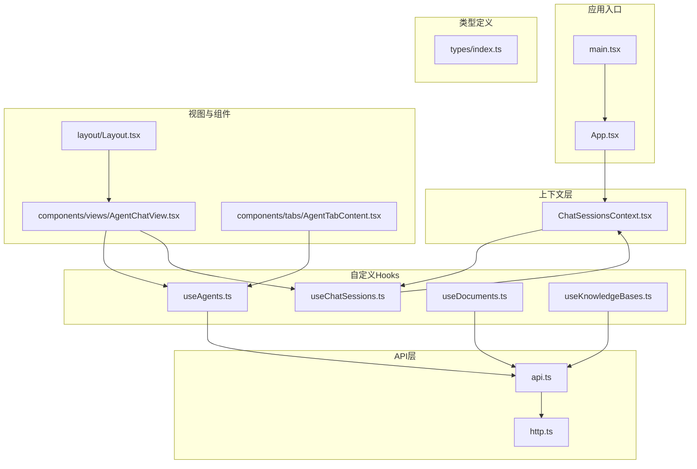
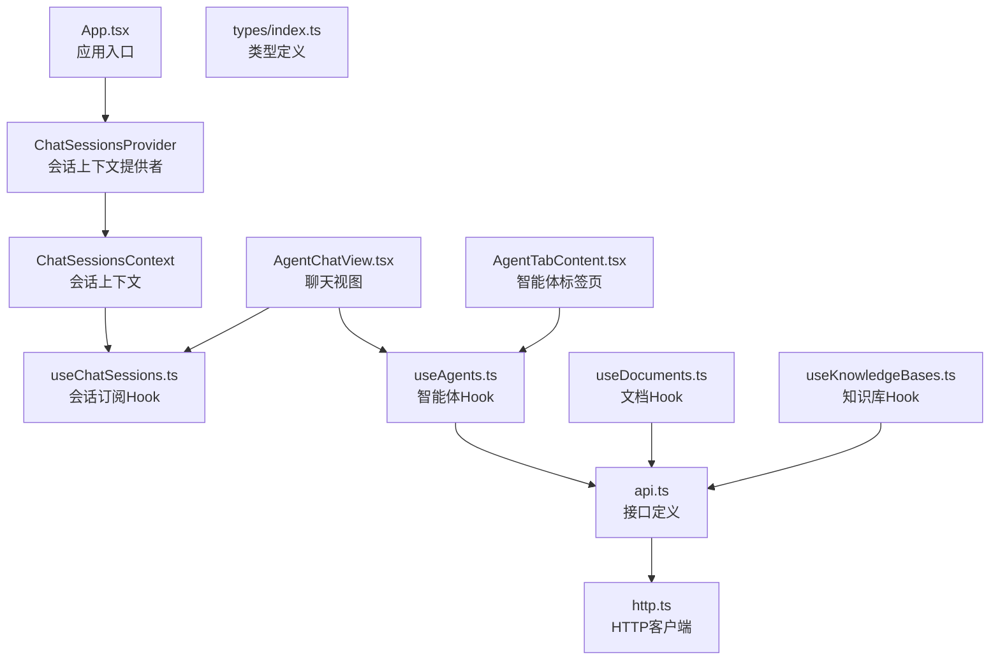
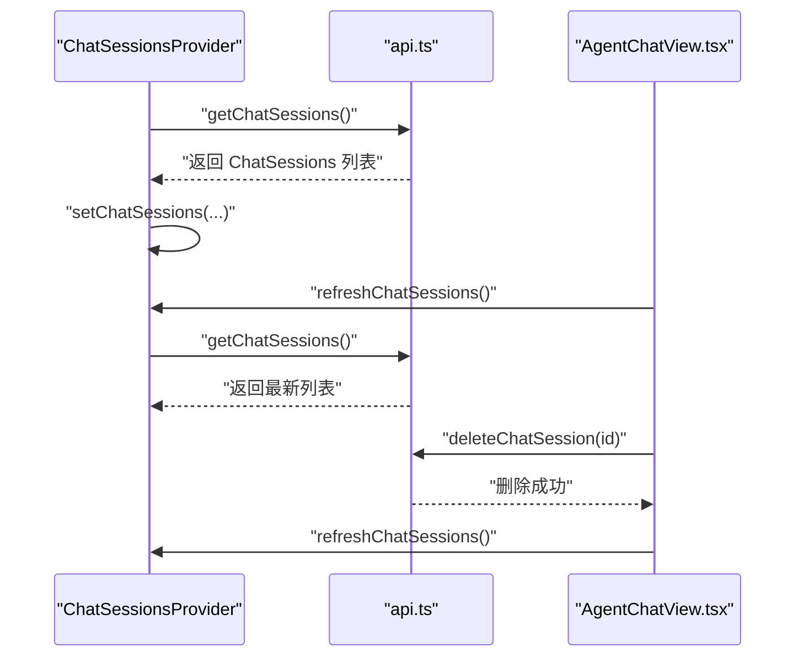
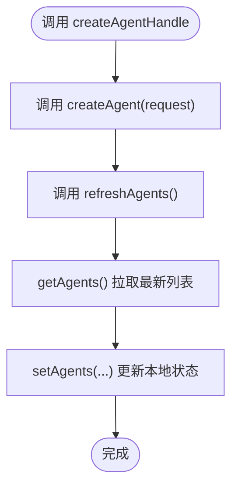
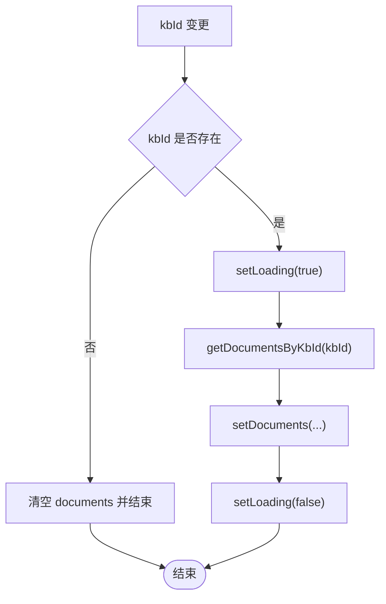
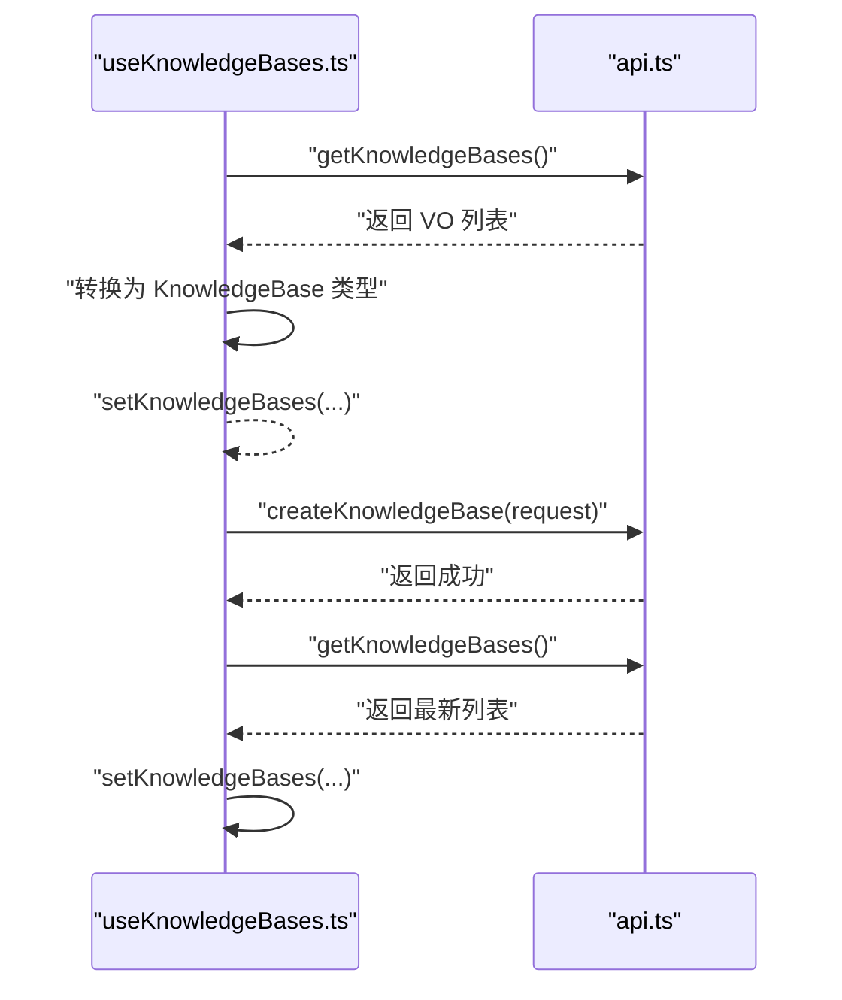
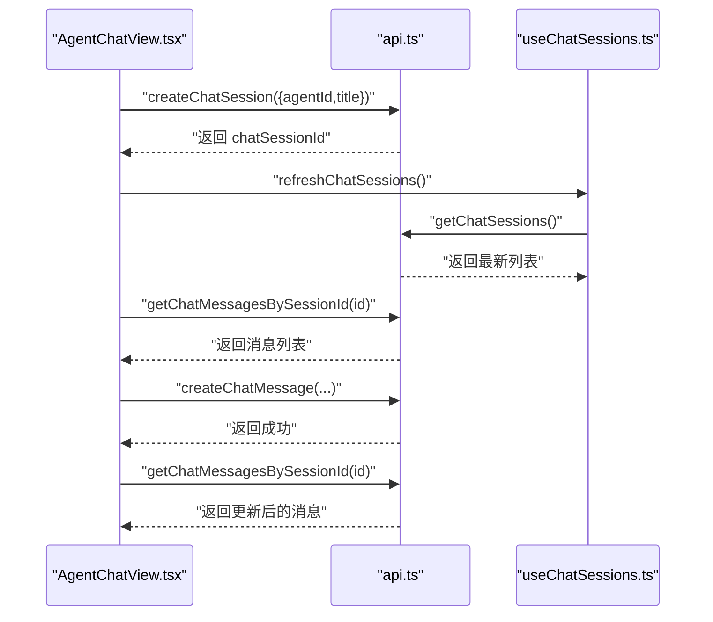
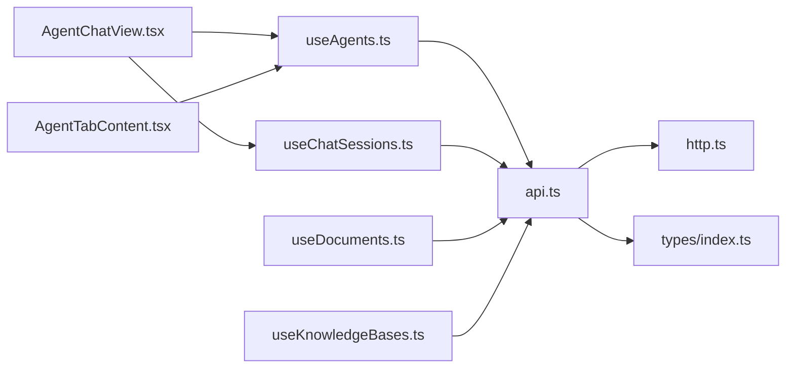

# 状态管理

<cite>
**本文引用的文件**
- [ChatSessionsContext.tsx](file://ui/src/contexts/ChatSessionsContext.tsx)
- [useAgents.ts](file://ui/src/hooks/useAgents.ts)
- [useChatSessions.ts](file://ui/src/hooks/useChatSessions.ts)
- [useDocuments.ts](file://ui/src/hooks/useDocuments.ts)
- [useKnowledgeBases.ts](file://ui/src/hooks/useKnowledgeBases.ts)
- [api.ts](file://ui/src/api/api.ts)
- [http.ts](file://ui/src/api/http.ts)
- [index.ts](file://ui/src/types/index.ts)
- [App.tsx](file://ui/src/App.tsx)
- [main.tsx](file://ui/src/main.tsx)
- [AgentChatView.tsx](file://ui/src/components/views/AgentChatView.tsx)
- [AgentTabContent.tsx](file://ui/src/components/tabs/AgentTabContent.tsx)
- [Layout.tsx](file://ui/src/layout/Layout.tsx)
- [utils/index.ts](file://ui/src/utils/index.ts)
</cite>

## 目录
1. [简介](#简介)
2. [项目结构](#项目结构)
3. [核心组件](#核心组件)
4. [架构总览](#架构总览)
5. [详细组件分析](#详细组件分析)
6. [依赖分析](#依赖分析)
7. [性能考虑](#性能考虑)
8. [故障排查指南](#故障排查指南)
9. [结论](#结论)
10. [附录](#附录)

## 简介
本指南聚焦于 JChatMind 前端的状态管理设计与实践，系统讲解基于 React Context 与自定义 Hooks 的组合模式，覆盖以下主题：
- Context API 与自定义 Hooks 的使用范式
- ChatSessionsContext 聊天会话上下文的设计与实现
- 各自定义 Hook 的职责边界、功能与使用方式：useAgents、useChatSessions、useDocuments、useKnowledgeBases
- 状态提升、状态共享与状态更新策略
- 数据流管理、状态持久化与并发更新处理最佳实践
- 错误状态处理、加载状态管理与空状态显示
- 状态订阅模式与组件解耦策略
- 完整状态管理模式与性能优化建议

## 项目结构
前端位于 ui/src 目录，采用按功能域划分的组织方式：
- contexts：集中存放 Context 提供者与消费者
- hooks：封装业务状态与副作用逻辑
- api：统一的 HTTP 客户端与后端接口定义
- types：前后端交互的数据模型与枚举
- components：页面级视图与业务组件
- layout：布局容器
- utils：通用工具函数
- main.tsx/App.tsx：应用入口与根组件

图表来源
- [main.tsx:1-11](file://ui/src/main.tsx#L1-L11)
- [App.tsx:1-16](file://ui/src/App.tsx#L1-L16)
- [ChatSessionsContext.tsx:1-66](file://ui/src/contexts/ChatSessionsContext.tsx#L1-L66)
- [useAgents.ts:1-55](file://ui/src/hooks/useAgents.ts#L1-L55)
- [useChatSessions.ts:1-6](file://ui/src/hooks/useChatSessions.ts#L1-L6)
- [useDocuments.ts:1-44](file://ui/src/hooks/useDocuments.ts#L1-L44)
- [useKnowledgeBases.ts:1-47](file://ui/src/hooks/useKnowledgeBases.ts#L1-L47)
- [api.ts:1-378](file://ui/src/api/api.ts#L1-L378)
- [http.ts:1-177](file://ui/src/api/http.ts#L1-L177)
- [types/index.ts:1-57](file://ui/src/types/index.ts#L1-L57)
- [AgentChatView.tsx:1-200](file://ui/src/components/views/AgentChatView.tsx#L1-L200)
- [AgentTabContent.tsx:1-158](file://ui/src/components/tabs/AgentTabContent.tsx#L1-L158)
- [Layout.tsx:1-12](file://ui/src/layout/Layout.tsx#L1-L12)

章节来源
- [main.tsx:1-11](file://ui/src/main.tsx#L1-L11)
- [App.tsx:1-16](file://ui/src/App.tsx#L1-L16)
- [ChatSessionsContext.tsx:1-66](file://ui/src/contexts/ChatSessionsContext.tsx#L1-L66)

## 核心组件
本节聚焦 Context 与自定义 Hooks 的核心实现与职责。

- ChatSessionsContext
  - 负责聊天会话列表的拉取、刷新与删除操作
  - 对外暴露 loading 状态与 refreshChatSessions、deleteChatSession 方法
  - 通过 Provider 包裹子树，使 useChatSessions 可直接消费

- useAgents
  - 负责智能体列表的获取、新增、删除、更新与刷新
  - 返回 agents 数组与对应的 CRUD 方法，便于上层组件直接调用

- useDocuments
  - 以 kbId 为依赖，按知识库维度拉取文档列表
  - 提供 loading、refreshDocuments、deleteDocument 等能力

- useKnowledgeBases
  - 负责知识库列表的获取与创建
  - 返回 knowledgeBases 数组与 createKnowledgeBaseHandle 方法

- useChatSessions（别名 Hook）
  - 仅作为 useChatSessionsContext 的轻量封装，便于在组件中直接使用

章节来源
- [ChatSessionsContext.tsx:8-66](file://ui/src/contexts/ChatSessionsContext.tsx#L8-L66)
- [useAgents.ts:12-55](file://ui/src/hooks/useAgents.ts#L12-L55)
- [useDocuments.ts:8-44](file://ui/src/hooks/useDocuments.ts#L8-L44)
- [useKnowledgeBases.ts:9-47](file://ui/src/hooks/useKnowledgeBases.ts#L9-L47)
- [useChatSessions.ts:1-6](file://ui/src/hooks/useChatSessions.ts#L1-L6)

## 架构总览
下图展示了前端状态管理的整体架构：应用入口通过 ChatSessionsProvider 提供全局会话上下文；各自定义 Hook 通过 api.ts 封装的 HTTP 方法访问后端；组件通过 Hooks 订阅状态并触发更新。

图表来源
- [App.tsx:1-16](file://ui/src/App.tsx#L1-L16)
- [ChatSessionsContext.tsx:19-54](file://ui/src/contexts/ChatSessionsContext.tsx#L19-L54)
- [useChatSessions.ts:1-6](file://ui/src/hooks/useChatSessions.ts#L1-L6)
- [useAgents.ts:1-55](file://ui/src/hooks/useAgents.ts#L1-L55)
- [useDocuments.ts:1-44](file://ui/src/hooks/useDocuments.ts#L1-L44)
- [useKnowledgeBases.ts:1-47](file://ui/src/hooks/useKnowledgeBases.ts#L1-L47)
- [api.ts:1-378](file://ui/src/api/api.ts#L1-L378)
- [http.ts:1-177](file://ui/src/api/http.ts#L1-L177)
- [types/index.ts:1-57](file://ui/src/types/index.ts#L1-L57)
- [AgentChatView.tsx:1-200](file://ui/src/components/views/AgentChatView.tsx#L1-L200)
- [AgentTabContent.tsx:1-158](file://ui/src/components/tabs/AgentTabContent.tsx#L1-L158)

## 详细组件分析

### ChatSessionsContext 设计与实现
- 上下文类型定义
  - 暴露 chatSessions、loading、refreshChatSessions、deleteChatSession 四项能力
- 初始化与数据拉取
  - 首次渲染时自动拉取会话列表，并设置 loading 状态
- 删除流程
  - 先调用后端删除接口，再重新拉取最新列表，保证 UI 与服务端一致
- 错误处理
  - 在 try/finally 中控制 loading 状态，避免阻塞 UI
- 使用约束
  - 自定义 Hook useChatSessionsContext 负责校验上下文存在性，防止误用

图表来源
- [ChatSessionsContext.tsx:23-40](file://ui/src/contexts/ChatSessionsContext.tsx#L23-L40)
- [api.ts:129-166](file://ui/src/api/api.ts#L129-L166)
- [AgentChatView.tsx:76-85](file://ui/src/components/views/AgentChatView.tsx#L76-L85)

章节来源
- [ChatSessionsContext.tsx:8-66](file://ui/src/contexts/ChatSessionsContext.tsx#L8-L66)
- [useChatSessions.ts:1-6](file://ui/src/hooks/useChatSessions.ts#L1-L6)

### useAgents：智能体状态管理
- 职责边界
  - 获取智能体列表、创建、删除、更新、刷新
- 数据流
  - 通过 api.ts 的 getAgents/createAgent/deleteAgent/updateAgent 实现
  - 每次变更后调用 refreshAgents 重新拉取，保持本地状态与服务端一致
- 使用方式
  - 组件通过 useAgents 获取 agents 与对应方法，直接调用完成业务操作

图表来源
- [useAgents.ts:24-32](file://ui/src/hooks/useAgents.ts#L24-L32)
- [api.ts:64-85](file://ui/src/api/api.ts#L64-L85)

章节来源
- [useAgents.ts:12-55](file://ui/src/hooks/useAgents.ts#L12-L55)
- [api.ts:57-85](file://ui/src/api/api.ts#L57-L85)

### useDocuments：知识库文档状态管理
- 依赖驱动
  - 以 kbId 为依赖，当 kbId 为空时清空文档列表，避免无效请求
- 加载状态
  - 通过 loading 状态反馈请求进行中
- 刷新与删除
  - refreshDocuments 用于手动刷新；deleteDocument 调用后自动重新拉取
- 使用场景
  - 在知识库详情页或文档列表组件中传入 kbId 即可启用

图表来源
- [useDocuments.ts:12-25](file://ui/src/hooks/useDocuments.ts#L12-L25)
- [api.ts:315-319](file://ui/src/api/api.ts#L315-L319)

章节来源
- [useDocuments.ts:8-44](file://ui/src/hooks/useDocuments.ts#L8-L44)
- [api.ts:315-354](file://ui/src/api/api.ts#L315-L354)

### useKnowledgeBases：知识库状态管理
- 职责边界
  - 获取知识库列表、创建知识库
- 数据转换
  - 将后端返回的 KnowledgeBaseVO 转换为前端使用的 KnowledgeBase 类型，便于组件消费
- 使用方式
  - 组件通过 useKnowledgeBases 获取 knowledgeBases 与 create 方法

图表来源
- [useKnowledgeBases.ts:12-39](file://ui/src/hooks/useKnowledgeBases.ts#L12-L39)
- [api.ts:261-291](file://ui/src/api/api.ts#L261-L291)
- [types/index.ts:3-7](file://ui/src/types/index.ts#L3-L7)

章节来源
- [useKnowledgeBases.ts:9-47](file://ui/src/hooks/useKnowledgeBases.ts#L9-L47)
- [api.ts:261-291](file://ui/src/api/api.ts#L261-L291)
- [types/index.ts:3-7](file://ui/src/types/index.ts#L3-L7)

### useChatSessions：会话订阅 Hook
- 角色定位
  - 仅对 ChatSessionsContext 的轻量封装，便于组件直接消费
- 使用建议
  - 在需要读取会话列表、触发刷新或删除时使用

章节来源
- [useChatSessions.ts:1-6](file://ui/src/hooks/useChatSessions.ts#L1-L6)
- [ChatSessionsContext.tsx:56-66](file://ui/src/contexts/ChatSessionsContext.tsx#L56-L66)

### 组件使用示例：AgentChatView
- 会话创建与消息发送
  - 当无 chatSessionId 时，根据所选 agentId 创建新会话，并导航至新会话路由
  - 发送消息时，若处于初始化状态则携带初始消息
- 会话消息拉取
  - 通过 getChatMessagesBySessionId 拉取历史消息
- SSE 流式状态展示
  - 建立 SSE 连接，监听不同阶段的消息类型，动态更新 UI 状态
- 与 Hooks 的协作
  - 使用 useAgents 获取可用 agent 列表
  - 使用 useChatSessions.refreshChatSessions 刷新会话列表

图表来源
- [AgentChatView.tsx:55-112](file://ui/src/components/views/AgentChatView.tsx#L55-L112)
- [AgentChatView.tsx:120-170](file://ui/src/components/views/AgentChatView.tsx#L120-L170)
- [api.ts:99-166](file://ui/src/api/api.ts#L99-L166)
- [useChatSessions.ts:1-6](file://ui/src/hooks/useChatSessions.ts#L1-L6)

章节来源
- [AgentChatView.tsx:17-200](file://ui/src/components/views/AgentChatView.tsx#L17-L200)
- [api.ts:99-229](file://ui/src/api/api.ts#L99-L229)

## 依赖分析
- 组件耦合关系
  - AgentChatView 依赖 useAgents 与 useChatSessions，体现“视图层”对“业务状态”的订阅
  - AgentTabContent 依赖 useAgents，体现“列表展示”对“数据源”的依赖
- 外部依赖
  - api.ts 作为统一接口层，向上提供类型安全的请求方法
  - http.ts 封装 fetch，统一处理 URL 构造、响应解析与错误提示
- 类型一致性
  - types/index.ts 定义了前后端交互的核心类型，确保数据模型稳定

图表来源
- [AgentChatView.tsx:1-200](file://ui/src/components/views/AgentChatView.tsx#L1-L200)
- [AgentTabContent.tsx:1-158](file://ui/src/components/tabs/AgentTabContent.tsx#L1-L158)
- [useAgents.ts:1-55](file://ui/src/hooks/useAgents.ts#L1-L55)
- [useChatSessions.ts:1-6](file://ui/src/hooks/useChatSessions.ts#L1-L6)
- [useDocuments.ts:1-44](file://ui/src/hooks/useDocuments.ts#L1-L44)
- [useKnowledgeBases.ts:1-47](file://ui/src/hooks/useKnowledgeBases.ts#L1-L47)
- [api.ts:1-378](file://ui/src/api/api.ts#L1-L378)
- [http.ts:1-177](file://ui/src/api/http.ts#L1-L177)
- [types/index.ts:1-57](file://ui/src/types/index.ts#L1-L57)

章节来源
- [AgentChatView.tsx:1-200](file://ui/src/components/views/AgentChatView.tsx#L1-L200)
- [AgentTabContent.tsx:1-158](file://ui/src/components/tabs/AgentTabContent.tsx#L1-L158)
- [api.ts:1-378](file://ui/src/api/api.ts#L1-L378)
- [http.ts:1-177](file://ui/src/api/http.ts#L1-L177)
- [types/index.ts:1-57](file://ui/src/types/index.ts#L1-L57)

## 性能考虑
- 状态粒度与订阅范围
  - 将“会话列表”置于 Context，其他资源（如智能体、文档、知识库）通过独立 Hook 管理，降低无关重渲染
- 依赖数组与回调缓存
  - ChatSessionsContext 使用 useCallback 缓存异步回调，减少重复渲染
  - useDocuments 以 kbId 为依赖，避免无效请求与状态抖动
- 加载状态与空状态
  - 通过 loading 字段与条件渲染，避免空列表时的闪烁与异常
- 并发更新与幂等
  - 删除后统一走 refresh 流程，确保 UI 与服务端一致
- SSE 与事件清理
  - 在组件卸载时关闭 SSE 连接，避免内存泄漏与重复订阅

章节来源
- [ChatSessionsContext.tsx:23-40](file://ui/src/contexts/ChatSessionsContext.tsx#L23-L40)
- [useDocuments.ts:12-25](file://ui/src/hooks/useDocuments.ts#L12-L25)
- [AgentChatView.tsx:166-170](file://ui/src/components/views/AgentChatView.tsx#L166-L170)

## 故障排查指南
- 上下文未包裹
  - 若调用 useChatSessionsContext 抛出错误，检查是否在 ChatSessionsProvider 内部使用
- 空依赖导致的无限请求
  - useDocuments 需确保 kbId 存在再发起请求；否则会清空列表并提前结束
- 错误提示与用户反馈
  - http.ts 统一处理业务错误码并弹出提示；组件层可结合 antd 的 message 或 Modal 做二次反馈
- SSE 连接问题
  - 检查后端 SSE 地址与跨域配置；在组件卸载时务必关闭连接

章节来源
- [ChatSessionsContext.tsx:56-66](file://ui/src/contexts/ChatSessionsContext.tsx#L56-L66)
- [useDocuments.ts:12-16](file://ui/src/hooks/useDocuments.ts#L12-L16)
- [http.ts:42-57](file://ui/src/api/http.ts#L42-L57)
- [AgentChatView.tsx:125-134](file://ui/src/components/views/AgentChatView.tsx#L125-L134)

## 结论
JChatMind 前端采用“Context + 自定义 Hooks”的组合模式，实现了清晰的状态边界与良好的组件解耦：
- ChatSessionsContext 负责会话级全局状态，useChatSessions 作为订阅入口
- useAgents/useDocuments/useKnowledgeBases 分别负责各自领域的 CRUD 与刷新
- 通过统一的 api.ts 与 http.ts，确保数据流与错误处理的一致性
- 在组件层面，AgentChatView 展示了如何将状态订阅与业务流程结合，形成可维护的状态管理模式

## 附录
- 状态持久化建议
  - 对于用户偏好与临时输入，可在 localStorage 中做轻量持久化；对于核心业务状态，优先依赖后端同步
- 并发更新处理
  - 使用乐观更新与回滚策略，配合刷新机制保证最终一致性
- 空状态与加载状态
  - 为列表组件提供骨架屏与占位文案，提升感知性能
- 状态订阅与解耦
  - 通过 Hooks 将状态与副作用抽象，组件只关心消费与触发，不直接操作外部上下文