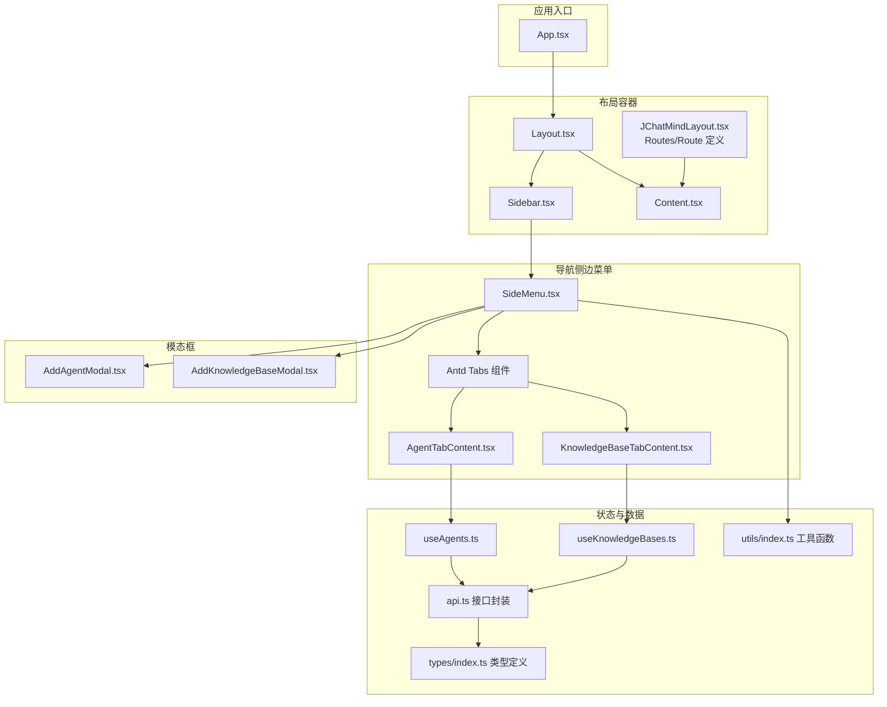
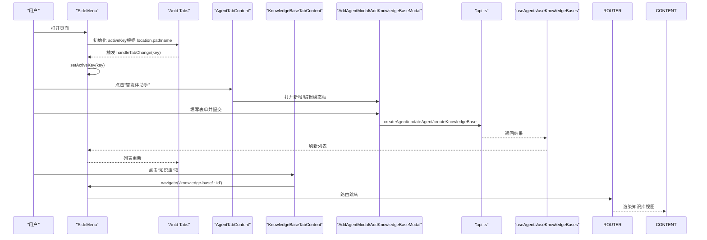
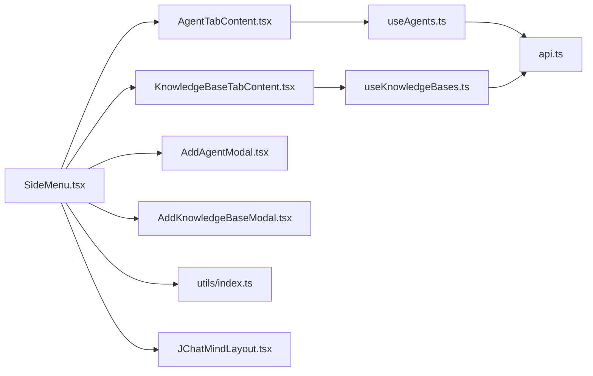

# 导航组件

<cite>
**本文引用的文件**
- [SideMenu.tsx](file://ui/src/components/SideMenu.tsx)
- [JChatMindLayout.tsx](file://ui/src/components/JChatMindLayout.tsx)
- [Layout.tsx](file://ui/src/layout/Layout.tsx)
- [Sidebar.tsx](file://ui/src/layout/Sidebar.tsx)
- [Content.tsx](file://ui/src/layout/Content.tsx)
- [AgentTabContent.tsx](file://ui/src/components/tabs/AgentTabContent.tsx)
- [KnowledgeBaseTabContent.tsx](file://ui/src/components/tabs/KnowledgeBaseTabContent.tsx)
- [AddAgentModal.tsx](file://ui/src/components/modals/AddAgentModal.tsx)
- [AddKnowledgeBaseModal.tsx](file://ui/src/components/modals/AddKnowledgeBaseModal.tsx)
- [useAgents.ts](file://ui/src/hooks/useAgents.ts)
- [useKnowledgeBases.ts](file://ui/src/hooks/useKnowledgeBases.ts)
- [api.ts](file://ui/src/api/api.ts)
- [index.ts](file://ui/src/types/index.ts)
- [utils/index.ts](file://ui/src/utils/index.ts)
- [App.tsx](file://ui/src/App.tsx)
</cite>

## 目录
1. [简介](#简介)
2. [项目结构](#项目结构)
3. [核心组件](#核心组件)
4. [架构总览](#架构总览)
5. [组件详解](#组件详解)
6. [依赖关系分析](#依赖关系分析)
7. [性能考量](#性能考量)
8. [故障排查指南](#故障排查指南)
9. [结论](#结论)
10. [附录](#附录)

## 简介
本指南围绕 JChatMind 的导航侧边菜单组件 SideMenu 进行系统性开发说明，覆盖菜单项配置、路由集成、状态管理、数据结构设计、交互与动画、权限控制、扩展方法与最佳实践等内容。目标是帮助开发者快速理解并高效扩展该导航体系。

## 项目结构
导航相关代码位于前端 UI 子模块中，采用按功能分层组织：布局层（Layout/Sidebar/Content）、页面布局容器（JChatMindLayout）、导航侧边菜单（SideMenu）以及配套的标签页内容与模态框组件。路由由 React Router 驱动，状态通过自定义 Hooks 管理。

图表来源
- [App.tsx:1-16](file://ui/src/App.tsx#L1-L16)
- [Layout.tsx:1-12](file://ui/src/layout/Layout.tsx#L1-L12)
- [Sidebar.tsx:1-21](file://ui/src/layout/Sidebar.tsx#L1-L21)
- [Content.tsx:1-12](file://ui/src/layout/Content.tsx#L1-L12)
- [JChatMindLayout.tsx:1-31](file://ui/src/components/JChatMindLayout.tsx#L1-L31)
- [SideMenu.tsx:1-127](file://ui/src/components/SideMenu.tsx#L1-L127)
- [AgentTabContent.tsx:1-158](file://ui/src/components/tabs/AgentTabContent.tsx#L1-L158)
- [KnowledgeBaseTabContent.tsx:1-78](file://ui/src/components/tabs/KnowledgeBaseTabContent.tsx#L1-L78)
- [AddAgentModal.tsx:1-523](file://ui/src/components/modals/AddAgentModal.tsx#L1-L523)
- [AddKnowledgeBaseModal.tsx:1-109](file://ui/src/components/modals/AddKnowledgeBaseModal.tsx#L1-L109)
- [useAgents.ts:1-55](file://ui/src/hooks/useAgents.ts#L1-L55)
- [useKnowledgeBases.ts:1-47](file://ui/src/hooks/useKnowledgeBases.ts#L1-L47)
- [api.ts:1-378](file://ui/src/api/api.ts#L1-L378)
- [index.ts:1-57](file://ui/src/types/index.ts#L1-L57)
- [utils/index.ts:1-73](file://ui/src/utils/index.ts#L1-L73)

章节来源
- [App.tsx:1-16](file://ui/src/App.tsx#L1-L16)
- [JChatMindLayout.tsx:1-31](file://ui/src/components/JChatMindLayout.tsx#L1-L31)
- [Layout.tsx:1-12](file://ui/src/layout/Layout.tsx#L1-L12)
- [Sidebar.tsx:1-21](file://ui/src/layout/Sidebar.tsx#L1-L21)
- [Content.tsx:1-12](file://ui/src/layout/Content.tsx#L1-L12)

## 核心组件
- SideMenu：侧边菜单容器，负责标签页切换、路由联动、模态框状态管理、与子组件协作展示智能体与知识库列表。
- AgentTabContent：智能体列表页签内容，提供新增、编辑、删除等操作入口。
- KnowledgeBaseTabContent：知识库列表页签内容，提供新增与跳转到知识库详情的能力。
- AddAgentModal / AddKnowledgeBaseModal：新增/编辑智能体与知识库的弹窗表单。
- useAgents / useKnowledgeBases：封装智能体与知识库的增删改查与本地状态刷新。
- api.ts：统一的 HTTP 请求封装与数据模型类型定义。
- utils/index.ts：基于 ID 的稳定 Emoji 映射与时间格式化工具。
- JChatMindLayout：路由与布局组合，承载菜单与内容区域。

章节来源
- [SideMenu.tsx:1-127](file://ui/src/components/SideMenu.tsx#L1-L127)
- [AgentTabContent.tsx:1-158](file://ui/src/components/tabs/AgentTabContent.tsx#L1-L158)
- [KnowledgeBaseTabContent.tsx:1-78](file://ui/src/components/tabs/KnowledgeBaseTabContent.tsx#L1-L78)
- [AddAgentModal.tsx:1-523](file://ui/src/components/modals/AddAgentModal.tsx#L1-L523)
- [AddKnowledgeBaseModal.tsx:1-109](file://ui/src/components/modals/AddKnowledgeBaseModal.tsx#L1-L109)
- [useAgents.ts:1-55](file://ui/src/hooks/useAgents.ts#L1-L55)
- [useKnowledgeBases.ts:1-47](file://ui/src/hooks/useKnowledgeBases.ts#L1-L47)
- [api.ts:1-378](file://ui/src/api/api.ts#L1-L378)
- [utils/index.ts:1-73](file://ui/src/utils/index.ts#L1-L73)
- [JChatMindLayout.tsx:1-31](file://ui/src/components/JChatMindLayout.tsx#L1-L31)

## 架构总览
SideMenu 作为导航容器，内部使用 Ant Design 的 Tabs 组件承载三个标签页：智能体、聊天记录、知识库。每个标签页对应一个专用内容组件，负责具体业务渲染与交互。路由由 JChatMindLayout 中的 Routes/Route 定义，根据路径决定内容区渲染哪个视图。状态管理通过自定义 Hooks 与本地 useState 协作完成，API 层统一处理网络请求与数据转换。

图表来源
- [SideMenu.tsx:41-53](file://ui/src/components/SideMenu.tsx#L41-L53)
- [AgentTabContent.tsx:77-154](file://ui/src/components/tabs/AgentTabContent.tsx#L77-L154)
- [KnowledgeBaseTabContent.tsx:26-74](file://ui/src/components/tabs/KnowledgeBaseTabContent.tsx#L26-L74)
- [AddAgentModal.tsx:118-520](file://ui/src/components/modals/AddAgentModal.tsx#L118-L520)
- [AddKnowledgeBaseModal.tsx:15-108](file://ui/src/components/modals/AddKnowledgeBaseModal.tsx#L15-L108)
- [api.ts:57-85](file://ui/src/api/api.ts#L57-L85)
- [api.ts:261-291](file://ui/src/api/api.ts#L261-L291)
- [useAgents.ts:29-45](file://ui/src/hooks/useAgents.ts#L29-L45)
- [useKnowledgeBases.ts:27-39](file://ui/src/hooks/useKnowledgeBases.ts#L27-L39)
- [JChatMindLayout.tsx:16-26](file://ui/src/components/JChatMindLayout.tsx#L16-L26)

## 组件详解

### SideMenu 侧边菜单
- 功能职责
  - 标签页初始化与切换：根据当前 URL 自动定位 activeKey，并在用户切换时更新状态。
  - 内容渲染：通过 Antd Tabs 渲染三个标签页的内容组件。
  - 模态框状态：维护新增/编辑智能体与新增知识库的弹窗开关。
  - 路由联动：在知识库标签页中触发导航至知识库详情页。
- 关键实现点
  - activeKey 计算：依据 location.pathname 前缀匹配，自动定位当前激活页签。
  - 事件处理：handleTabChange 设置 activeKey；标签页 children 中回调用于打开模态框或导航。
  - 数据来源：useAgents/useKnowledgeBases 提供智能体与知识库列表，以及增删改操作。
- 交互与动画
  - Tabs 组件自带切换动画与滚动条，无需额外动画配置。
  - 模态框通过 Antd Modal 控制显隐，具备遮罩与居中展示。
- 状态管理
  - 本地状态：isAddAgentModalOpen、isAddKnowledgeBaseModalOpen、editingAgent、activeKey。
  - 全局状态：useAgents/useKnowledgeBases 管理远程数据与刷新。
- 路由集成
  - 与 JChatMindLayout 的 Routes/Route 对应，通过 useNavigate 实现知识库详情跳转。
- 权限控制
  - 代码未体现细粒度权限校验，建议在业务层通过后端返回字段或上下文注入进行控制。

章节来源
- [SideMenu.tsx:17-124](file://ui/src/components/SideMenu.tsx#L17-L124)
- [JChatMindLayout.tsx:16-26](file://ui/src/components/JChatMindLayout.tsx#L16-L26)

### AgentTabContent 智能体标签页
- 功能职责
  - 展示智能体列表，支持新增、编辑、删除。
  - 为每个智能体生成稳定 Emoji，增强识别度。
  - 右键菜单提供编辑与删除操作，删除前确认。
- 关键实现点
  - 使用 useMemo 为每个智能体计算 emoji，避免重复计算。
  - 右键菜单通过 Antd Dropdown 实现，支持更多操作扩展。
  - 删除操作使用 Modal.confirm 弹窗确认，防止误删。
- 与 SideMenu 的协作
  - 通过 props 回调与 SideMenu 协作，打开模态框或执行删除。

章节来源
- [AgentTabContent.tsx:21-154](file://ui/src/components/tabs/AgentTabContent.tsx#L21-L154)
- [utils/index.ts:1-22](file://ui/src/utils/index.ts#L1-L22)

### KnowledgeBaseTabContent 知识库标签页
- 功能职责
  - 展示知识库列表，支持新增与点击跳转详情。
  - 为每个知识库生成稳定 Emoji，提升辨识度。
- 关键实现点
  - 点击项触发 onSelectKnowledgeBase 回调，SideMenu 中使用 useNavigate 跳转至知识库详情。
  - 无权限控制逻辑，建议在业务层补充。

章节来源
- [KnowledgeBaseTabContent.tsx:13-74](file://ui/src/components/tabs/KnowledgeBaseTabContent.tsx#L13-L74)
- [utils/index.ts:24-46](file://ui/src/utils/index.ts#L24-L46)

### 模态框组件
- AddAgentModal
  - 分类菜单：基础设置、模型设置、知识库设置、工具调用。
  - 表单数据：name/description/systemPrompt/model/chatOptions/allowedTools/allowedKbs。
  - 工具与知识库选择：支持多选，限制数量与交互反馈。
  - 提交流程：区分新增与编辑模式，调用 api.ts 的 createAgent/updateAgent。
- AddKnowledgeBaseModal
  - 简洁表单：name/description，提交后清空并关闭。
  - 提交流程：调用 api.ts 的 createKnowledgeBase。

章节来源
- [AddAgentModal.tsx:35-520](file://ui/src/components/modals/AddAgentModal.tsx#L35-L520)
- [AddKnowledgeBaseModal.tsx:15-108](file://ui/src/components/modals/AddKnowledgeBaseModal.tsx#L15-L108)
- [api.ts:13-48](file://ui/src/api/api.ts#L13-L48)
- [api.ts:240-291](file://ui/src/api/api.ts#L240-L291)

### Hooks 与 API
- useAgents
  - 初始化加载：组件挂载时拉取智能体列表。
  - 操作封装：createAgentHandle/deleteAgentHandle/updateAgentHandle。
  - 刷新机制：每次操作后重新拉取列表，保证 UI 与服务端一致。
- useKnowledgeBases
  - 初始化加载：组件挂载时拉取知识库列表。
  - 数据转换：将 VO 转换为前端类型，便于渲染。
  - 操作封装：createKnowledgeBaseHandle。
- api.ts
  - 类型定义：AgentVO、KnowledgeBaseVO、ChatMessageVO 等。
  - 接口封装：get/post/patch/del 等通用方法与具体业务接口。
  - 工具方法：getOptionalTools 等。

章节来源
- [useAgents.ts:12-54](file://ui/src/hooks/useAgents.ts#L12-L54)
- [useKnowledgeBases.ts:9-44](file://ui/src/hooks/useKnowledgeBases.ts#L9-L44)
- [api.ts:1-378](file://ui/src/api/api.ts#L1-L378)
- [index.ts:1-57](file://ui/src/types/index.ts#L1-L57)

### 路由与布局
- App.tsx
  - 包裹 BrowserRouter，提供路由能力。
  - 提供 ChatSessionsProvider 上下文。
- JChatMindLayout
  - 布局：Layout/Sidebar/Content 组合。
  - 路由：定义 /、/agent、/chat、/knowledge-base、/knowledge-base/:id 等路径。
- Sidebar
  - 固定宽度与背景色，承载 SideMenu。
- Content
  - 占位内容区，承载路由渲染的视图。

章节来源
- [App.tsx:5-13](file://ui/src/App.tsx#L5-L13)
- [JChatMindLayout.tsx:9-30](file://ui/src/components/JChatMindLayout.tsx#L9-L30)
- [Sidebar.tsx:7-18](file://ui/src/layout/Sidebar.tsx#L7-L18)
- [Content.tsx:7-9](file://ui/src/layout/Content.tsx#L7-L9)

### 数据结构与类型
- AgentVO：智能体实体，包含 id、name、description、systemPrompt、model、allowedTools、allowedKbs、chatOptions 等。
- KnowledgeBaseVO：知识库实体，包含 id、name、description。
- ChatMessageVO：聊天消息实体，包含 id、sessionId、role、content、metadata。
- 工具与模型枚举：ModelType、ToolType 等。
- 类型转换：useKnowledgeBases 将 VO 转为前端类型，便于统一渲染。

章节来源
- [api.ts:37-48](file://ui/src/api/api.ts#L37-L48)
- [api.ts:234-238](file://ui/src/api/api.ts#L234-L238)
- [api.ts:27-33](file://ui/src/api/api.ts#L27-L33)
- [index.ts:27-33](file://ui/src/types/index.ts#L27-L33)
- [useKnowledgeBases.ts:16-21](file://ui/src/hooks/useKnowledgeBases.ts#L16-L21)

### 图标与样式
- 图标：Ant Design 图标库，如 RobotOutlined、PlusOutlined、EditOutlined、DeleteOutlined、MoreOutlined、BookOutlined 等。
- 样式：Tailwind CSS 类名控制布局与主题色，Sidebar 固定宽度，Content 自适应填充。

章节来源
- [SideMenu.tsx:2-11](file://ui/src/components/SideMenu.tsx#L2-L11)
- [AgentTabContent.tsx:5-9](file://ui/src/components/tabs/AgentTabContent.tsx#L5-L9)
- [KnowledgeBaseTabContent.tsx:3](file://ui/src/components/tabs/KnowledgeBaseTabContent.tsx#L3)
- [Sidebar.tsx:11-13](file://ui/src/layout/Sidebar.tsx#L11-L13)

### 权限控制
- 当前实现未体现权限校验逻辑。建议在以下位置引入：
  - 后端返回字段：如角色/资源权限标识。
  - 前端上下文：通过 Provider 注入当前用户权限集合。
  - 组件层面：根据权限动态渲染菜单项或禁用操作。

章节来源
- [SideMenu.tsx:55-90](file://ui/src/components/SideMenu.tsx#L55-L90)
- [AgentTabContent.tsx:37-75](file://ui/src/components/tabs/AgentTabContent.tsx#L37-L75)

### 扩展方法
- 添加新菜单项
  - 在 SideMenu 的 items 数组中新增一项，指定 key、label 与 children。
  - 在 JChatMindLayout 的 Routes/Route 中增加对应的路由。
  - 如需模态框或复杂交互，新增对应组件并通过 props 传入。
- 自定义样式
  - 通过 Tailwind 类名调整布局与主题色。
  - Antd 组件可通过 className 或 ConfigProvider 全局定制。
- 响应式适配
  - Sidebar 固定宽度，建议在移动端使用抽屉或折叠菜单策略。
  - Content 区域使用 flex-1 自适应，配合媒体查询优化小屏体验。

章节来源
- [SideMenu.tsx:55-90](file://ui/src/components/SideMenu.tsx#L55-L90)
- [JChatMindLayout.tsx:16-26](file://ui/src/components/JChatMindLayout.tsx#L16-L26)
- [Sidebar.tsx:11-13](file://ui/src/layout/Sidebar.tsx#L11-L13)

## 依赖关系分析
- 组件耦合
  - SideMenu 与 AgentTabContent/KnowledgeBaseTabContent 通过 props 通信。
  - 模态框与 API 层直接交互，通过 Hooks 间接影响列表刷新。
- 外部依赖
  - Ant Design：Tabs、Modal、Dropdown、Button、Input、Select、Slider 等。
  - React Router：useNavigate、Routes/Route。
  - 自定义工具：Emoji 生成与时间格式化。
- 循环依赖
  - 未发现循环依赖，各模块职责清晰。

图表来源
- [SideMenu.tsx:1-12](file://ui/src/components/SideMenu.tsx#L1-L12)
- [AgentTabContent.tsx:1-11](file://ui/src/components/tabs/AgentTabContent.tsx#L1-L11)
- [KnowledgeBaseTabContent.tsx:1-5](file://ui/src/components/tabs/KnowledgeBaseTabContent.tsx#L1-L5)
- [AddAgentModal.tsx:1-14](file://ui/src/components/modals/AddAgentModal.tsx#L1-L14)
- [AddKnowledgeBaseModal.tsx:1-5](file://ui/src/components/modals/AddKnowledgeBaseModal.tsx#L1-L5)
- [useAgents.ts:1-10](file://ui/src/hooks/useAgents.ts#L1-L10)
- [useKnowledgeBases.ts:1-7](file://ui/src/hooks/useKnowledgeBases.ts#L1-L7)
- [api.ts:1-2](file://ui/src/api/api.ts#L1-L2)
- [utils/index.ts:1-73](file://ui/src/utils/index.ts#L1-L73)
- [JChatMindLayout.tsx:1-8](file://ui/src/components/JChatMindLayout.tsx#L1-L8)

章节来源
- [SideMenu.tsx:1-12](file://ui/src/components/SideMenu.tsx#L1-L12)
- [AgentTabContent.tsx:1-11](file://ui/src/components/tabs/AgentTabContent.tsx#L1-L11)
- [KnowledgeBaseTabContent.tsx:1-5](file://ui/src/components/tabs/KnowledgeBaseTabContent.tsx#L1-L5)
- [AddAgentModal.tsx:1-14](file://ui/src/components/modals/AddAgentModal.tsx#L1-L14)
- [AddKnowledgeBaseModal.tsx:1-5](file://ui/src/components/modals/AddKnowledgeBaseModal.tsx#L1-L5)
- [useAgents.ts:1-10](file://ui/src/hooks/useAgents.ts#L1-L10)
- [useKnowledgeBases.ts:1-7](file://ui/src/hooks/useKnowledgeBases.ts#L1-L7)
- [api.ts:1-2](file://ui/src/api/api.ts#L1-L2)
- [utils/index.ts:1-73](file://ui/src/utils/index.ts#L1-L73)
- [JChatMindLayout.tsx:1-8](file://ui/src/components/JChatMindLayout.tsx#L1-L8)

## 性能考量
- 渲染优化
  - 使用 useMemo 为列表项计算 emoji，避免重复计算。
  - 列表滚动区域使用 overflow-y-auto，减少重排。
- 状态刷新
  - 每次增删改后重新拉取列表，保证一致性但可能带来多次网络请求，可在批量操作时合并刷新。
- 路由跳转
  - 使用 useNavigate 进行程序化导航，避免不必要的重渲染。
- 样式与动画
  - Tabs 动画与滚动条由 Antd 提供，保持默认即可满足大多数场景。

章节来源
- [AgentTabContent.tsx:29-34](file://ui/src/components/tabs/AgentTabContent.tsx#L29-L34)
- [KnowledgeBaseTabContent.tsx:19-24](file://ui/src/components/tabs/KnowledgeBaseTabContent.tsx#L19-L24)
- [useAgents.ts:24-27](file://ui/src/hooks/useAgents.ts#L24-L27)
- [useKnowledgeBases.ts:12-22](file://ui/src/hooks/useKnowledgeBases.ts#L12-L22)

## 故障排查指南
- 页签未正确高亮
  - 检查 activeKey 初始化逻辑是否与当前路径匹配。
  - 确认 handleTabChange 是否被正确调用。
- 知识库项点击无反应
  - 检查 onSelectKnowledgeBase 回调是否传递给 KnowledgeBaseTabContent。
  - 确认 SideMenu 中 navigate 调用是否正确。
- 智能体/知识库列表不更新
  - 确认 useAgents/useKnowledgeBases 的刷新逻辑是否执行。
  - 检查 API 返回结构与类型转换是否一致。
- 模态框无法关闭或表单异常
  - 检查模态框的 open/onClose 与表单数据双向绑定。
  - 确认提交流程中的错误处理与加载状态。
- Emoji 不稳定
  - 检查 utils 中的哈希算法与列表长度，确保映射稳定。

章节来源
- [SideMenu.tsx:41-53](file://ui/src/components/SideMenu.tsx#L41-L53)
- [AgentTabContent.tsx:103-104](file://ui/src/components/tabs/AgentTabContent.tsx#L103-L104)
- [KnowledgeBaseTabContent.tsx:50](file://ui/src/components/tabs/KnowledgeBaseTabContent.tsx#L50)
- [useAgents.ts:24-27](file://ui/src/hooks/useAgents.ts#L24-L27)
- [useKnowledgeBases.ts:12-22](file://ui/src/hooks/useKnowledgeBases.ts#L12-L22)
- [utils/index.ts:1-46](file://ui/src/utils/index.ts#L1-L46)

## 结论
SideMenu 导航组件以 Antd Tabs 为核心，结合自定义 Hooks 与 API 层，实现了从菜单项配置、路由集成到状态管理的完整闭环。其结构清晰、职责明确，易于扩展新的菜单项与功能模块。建议在后续迭代中完善权限控制、优化批量操作的刷新策略，并加强移动端适配与无障碍支持。

## 附录
- 最佳实践
  - 保持菜单项 key 唯一且语义化，便于路由与状态管理。
  - 在新增/编辑弹窗中提供必填校验与加载状态，改善用户体验。
  - 对高频渲染的列表项使用 useMemo/memo，降低重渲染成本。
  - 将样式变量集中管理，便于主题切换与品牌统一。
- 常见问题
  - 路由与菜单不同步：检查 activeKey 初始化与 handleTabChange 的联动。
  - 数据类型不一致导致渲染异常：统一使用 VO 转前端类型。
  - 权限不足导致操作不可见：在业务层补充权限判断与降级提示。