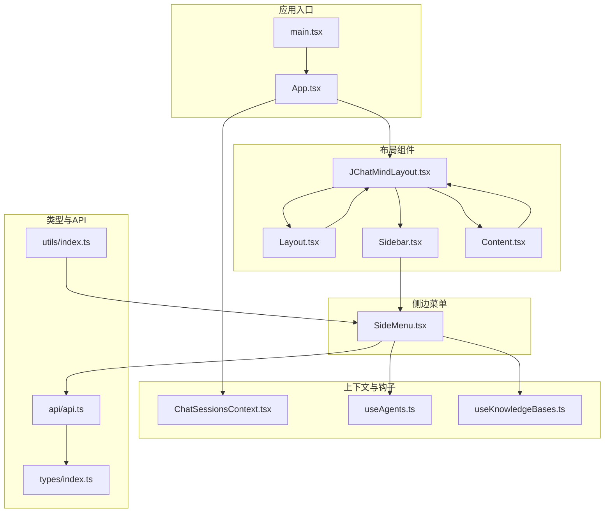
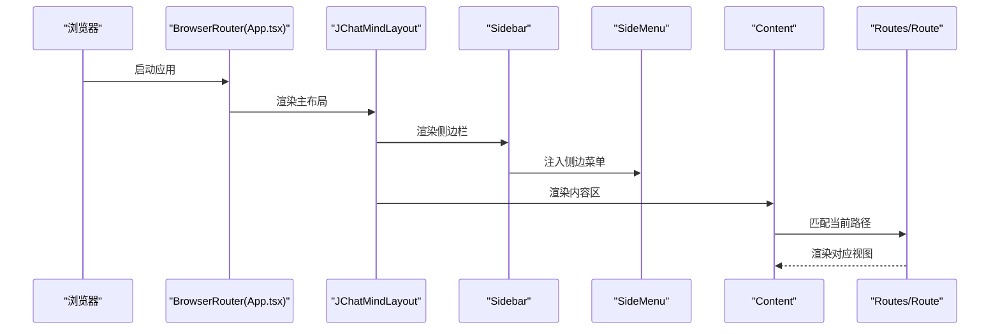
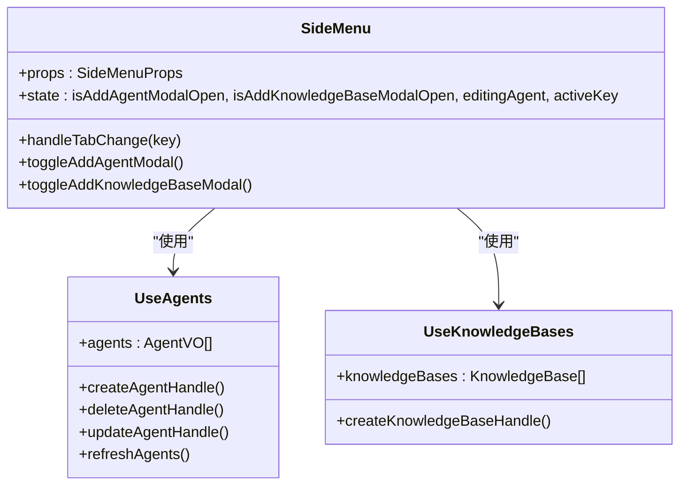
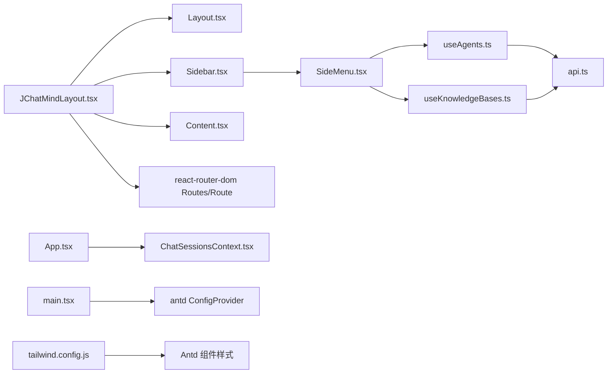

# 布局组件

<cite>
**本文引用的文件**
- [ui/src/components/JChatMindLayout.tsx](file://ui/src/components/JChatMindLayout.tsx)
- [ui/src/layout/Layout.tsx](file://ui/src/layout/Layout.tsx)
- [ui/src/layout/Content.tsx](file://ui/src/layout/Content.tsx)
- [ui/src/layout/Sidebar.tsx](file://ui/src/layout/Sidebar.tsx)
- [ui/src/components/SideMenu.tsx](file://ui/src/components/SideMenu.tsx)
- [ui/src/App.tsx](file://ui/src/App.tsx)
- [ui/src/main.tsx](file://ui/src/main.tsx)
- [ui/src/contexts/ChatSessionsContext.tsx](file://ui/src/contexts/ChatSessionsContext.tsx)
- [ui/src/hooks/useAgents.ts](file://ui/src/hooks/useAgents.ts)
- [ui/src/hooks/useKnowledgeBases.ts](file://ui/src/hooks/useKnowledgeBases.ts)
- [ui/src/types/index.ts](file://ui/src/types/index.ts)
- [ui/src/api/api.ts](file://ui/src/api/api.ts)
- [ui/src/utils/index.ts](file://ui/src/utils/index.ts)
- [ui/tailwind.config.js](file://ui/tailwind.config.js)
- [ui/package.json](file://ui/package.json)
</cite>

## 目录
1. [简介](#简介)
2. [项目结构](#项目结构)
3. [核心组件](#核心组件)
4. [架构总览](#架构总览)
5. [详细组件分析](#详细组件分析)
6. [依赖分析](#依赖分析)
7. [性能考虑](#性能考虑)
8. [故障排查指南](#故障排查指南)
9. [结论](#结论)
10. [附录](#附录)

## 简介
本文件面向 JChatMind 前端布局组件，聚焦于 JChatMindLayout 主布局组件的实现架构与使用方式，涵盖以下方面：
- 路由配置与页面导航
- 组件嵌套结构与职责划分
- 响应式与主题系统
- Content 内容区域的滚动与尺寸适配
- Sidebar 侧边栏的宽度控制、折叠策略与移动端适配
- 组件间通信机制、Props 传递模式与状态管理策略
- 扩展方法与自定义配置建议

## 项目结构
UI 层采用按功能分层组织：布局组件位于 layout 目录，业务布局在 components 目录，应用入口与上下文在根目录，样式与动画通过 TailwindCSS 配置。



图表来源
- [ui/src/main.tsx:1-11](file://ui/src/main.tsx#L1-L11)
- [ui/src/App.tsx:1-16](file://ui/src/App.tsx#L1-L16)
- [ui/src/components/JChatMindLayout.tsx:1-31](file://ui/src/components/JChatMindLayout.tsx#L1-L31)
- [ui/src/layout/Layout.tsx:1-12](file://ui/src/layout/Layout.tsx#L1-L12)
- [ui/src/layout/Sidebar.tsx:1-21](file://ui/src/layout/Sidebar.tsx#L1-L21)
- [ui/src/layout/Content.tsx:1-12](file://ui/src/layout/Content.tsx#L1-L12)
- [ui/src/components/SideMenu.tsx:1-127](file://ui/src/components/SideMenu.tsx#L1-L127)
- [ui/src/contexts/ChatSessionsContext.tsx:1-66](file://ui/src/contexts/ChatSessionsContext.tsx#L1-L66)
- [ui/src/hooks/useAgents.ts:1-55](file://ui/src/hooks/useAgents.ts#L1-L55)
- [ui/src/hooks/useKnowledgeBases.ts:1-47](file://ui/src/hooks/useKnowledgeBases.ts#L1-L47)
- [ui/src/types/index.ts:1-57](file://ui/src/types/index.ts#L1-L57)
- [ui/src/api/api.ts:1-378](file://ui/src/api/api.ts#L1-L378)
- [ui/src/utils/index.ts:1-73](file://ui/src/utils/index.ts#L1-L73)

章节来源
- [ui/src/main.tsx:1-11](file://ui/src/main.tsx#L1-L11)
- [ui/src/App.tsx:1-16](file://ui/src/App.tsx#L1-L16)
- [ui/src/components/JChatMindLayout.tsx:1-31](file://ui/src/components/JChatMindLayout.tsx#L1-L31)
- [ui/src/layout/Layout.tsx:1-12](file://ui/src/layout/Layout.tsx#L1-L12)
- [ui/src/layout/Sidebar.tsx:1-21](file://ui/src/layout/Sidebar.tsx#L1-L21)
- [ui/src/layout/Content.tsx:1-12](file://ui/src/layout/Content.tsx#L1-L12)
- [ui/src/components/SideMenu.tsx:1-127](file://ui/src/components/SideMenu.tsx#L1-L127)
- [ui/src/contexts/ChatSessionsContext.tsx:1-66](file://ui/src/contexts/ChatSessionsContext.tsx#L1-L66)
- [ui/src/hooks/useAgents.ts:1-55](file://ui/src/hooks/useAgents.ts#L1-L55)
- [ui/src/hooks/useKnowledgeBases.ts:1-47](file://ui/src/hooks/useKnowledgeBases.ts#L1-L47)
- [ui/src/types/index.ts:1-57](file://ui/src/types/index.ts#L1-L57)
- [ui/src/api/api.ts:1-378](file://ui/src/api/api.ts#L1-L378)
- [ui/src/utils/index.ts:1-73](file://ui/src/utils/index.ts#L1-L73)

## 核心组件
- Layout 基础布局容器：提供全屏高度与横向布局骨架，作为页面根容器承载侧边栏与内容区。
- Sidebar 侧边栏：固定宽度容器，承载侧边菜单与交互项。
- Content 内容区：自适应剩余空间，用于渲染路由视图。
- JChatMindLayout 主布局：组合 Layout、Sidebar、Content 与路由配置，形成完整页面骨架。
- SideMenu 侧边菜单：基于 Ant Design Tabs 的多标签页侧边菜单，内含智能体、聊天记录、知识库等面板。
- 上下文与钩子：ChatSessionsContext 提供聊天会话数据；useAgents/useKnowledgeBases 提供 CRUD 数据流。

章节来源
- [ui/src/layout/Layout.tsx:1-12](file://ui/src/layout/Layout.tsx#L1-L12)
- [ui/src/layout/Sidebar.tsx:1-21](file://ui/src/layout/Sidebar.tsx#L1-L21)
- [ui/src/layout/Content.tsx:1-12](file://ui/src/layout/Content.tsx#L1-L12)
- [ui/src/components/JChatMindLayout.tsx:1-31](file://ui/src/components/JChatMindLayout.tsx#L1-L31)
- [ui/src/components/SideMenu.tsx:1-127](file://ui/src/components/SideMenu.tsx#L1-L127)
- [ui/src/contexts/ChatSessionsContext.tsx:1-66](file://ui/src/contexts/ChatSessionsContext.tsx#L1-L66)
- [ui/src/hooks/useAgents.ts:1-55](file://ui/src/hooks/useAgents.ts#L1-L55)
- [ui/src/hooks/useKnowledgeBases.ts:1-47](file://ui/src/hooks/useKnowledgeBases.ts#L1-L47)

## 架构总览
JChatMindLayout 作为页面主骨架，负责：
- 在 Layout 容器中组织 Sidebar 与 Content
- 通过 react-router-dom 的 Routes/Route 实现路径到视图的映射
- 在 Sidebar 中注入 SideMenu，提供多标签页导航与操作入口
- 在 Content 中渲染路由视图（AgentChatView、KnowledgeBaseView）



图表来源
- [ui/src/App.tsx:1-16](file://ui/src/App.tsx#L1-L16)
- [ui/src/components/JChatMindLayout.tsx:1-31](file://ui/src/components/JChatMindLayout.tsx#L1-L31)
- [ui/src/layout/Layout.tsx:1-12](file://ui/src/layout/Layout.tsx#L1-L12)
- [ui/src/layout/Sidebar.tsx:1-21](file://ui/src/layout/Sidebar.tsx#L1-L21)
- [ui/src/layout/Content.tsx:1-12](file://ui/src/layout/Content.tsx#L1-L12)
- [ui/src/components/SideMenu.tsx:1-127](file://ui/src/components/SideMenu.tsx#L1-L127)

## 详细组件分析

### JChatMindLayout 主布局组件
- 组合关系：Layout → Sidebar → SideMenu；Layout → Content → Routes/Route
- 路由配置：支持 /、/agent、/chat、/chat/:chatSessionId、/knowledge-base、/knowledge-base/:knowledgeBaseId
- 视图映射：AgentChatView 对应聊天与智能体相关视图；KnowledgeBaseView 对应知识库视图

```mermaid
flowchart TD
Start(["进入 JChatMindLayout"]) --> BuildLayout["构建 Layout 容器"]
BuildLayout --> PlaceSidebar["放置 Sidebar 并注入 SideMenu"]
BuildLayout --> PlaceContent["放置 Content 容器"]
PlaceContent --> MountRoutes["挂载 Routes/Route 映射"]
MountRoutes --> RenderView{"匹配当前路径"}
RenderView --> |"/","/agent","/chat"| AgentView["渲染 AgentChatView"]
RenderView --> |"/knowledge-base" 或 "/knowledge-base/:id"| KBView["渲染 KnowledgeBaseView"]
AgentView --> End(["完成"])
KBView --> End
```

图表来源
- [ui/src/components/JChatMindLayout.tsx:1-31](file://ui/src/components/JChatMindLayout.tsx#L1-L31)

章节来源
- [ui/src/components/JChatMindLayout.tsx:1-31](file://ui/src/components/JChatMindLayout.tsx#L1-L31)

### Layout 基础布局容器
- 设计模式：无状态函数组件，接收 children 并以纵向布局包裹，设置全高
- 主题与样式：通过 TailwindCSS 类名统一管理，未引入主题变量或动态主题切换逻辑
- 全局样式：在 main.tsx 中通过 ConfigProvider 设置 antd 语言包，间接影响组件样式

章节来源
- [ui/src/layout/Layout.tsx:1-12](file://ui/src/layout/Layout.tsx#L1-L12)
- [ui/src/main.tsx:1-11](file://ui/src/main.tsx#L1-L11)

### Sidebar 侧边栏组件
- 容器结构：固定宽度容器，背景色浅灰，高度占满
- 宽度控制：硬编码宽度 320px，适合桌面端场景
- 折叠策略：当前未实现折叠逻辑，如需折叠可在不破坏现有结构的前提下新增状态与样式类
- 移动端适配：未见媒体查询或响应式断点，建议在保持 Sidebar 不折叠的前提下，通过 Content 的自适应能力提升移动端体验

章节来源
- [ui/src/layout/Sidebar.tsx:1-21](file://ui/src/layout/Sidebar.tsx#L1-L21)

### Content 内容区域组件
- 结构职责：作为 Flex 子元素占据剩余空间，内部渲染路由视图
- 滚动管理：未显式设置滚动属性，滚动行为由子视图自行处理
- 尺寸适配：通过 flex-1 自适应父容器高度，保证在不同窗口尺寸下保持一致布局

章节来源
- [ui/src/layout/Content.tsx:1-12](file://ui/src/layout/Content.tsx#L1-L12)

### SideMenu 侧边菜单
- 导航结构：Ant Design Tabs，包含“智能体助手”“聊天记录”“知识库”三个标签页
- 状态管理：本地状态维护模态框开关与编辑对象；通过 useAgents/useKnowledgeBases 钩子管理数据
- 路由联动：点击知识库条目时通过 useNavigate 进行路由跳转
- 动画与主题：TailwindCSS 提供 keyframes 与 animation，配合 antd 组件使用



图表来源
- [ui/src/components/SideMenu.tsx:1-127](file://ui/src/components/SideMenu.tsx#L1-L127)
- [ui/src/hooks/useAgents.ts:1-55](file://ui/src/hooks/useAgents.ts#L1-L55)
- [ui/src/hooks/useKnowledgeBases.ts:1-47](file://ui/src/hooks/useKnowledgeBases.ts#L1-L47)

章节来源
- [ui/src/components/SideMenu.tsx:1-127](file://ui/src/components/SideMenu.tsx#L1-L127)
- [ui/src/hooks/useAgents.ts:1-55](file://ui/src/hooks/useAgents.ts#L1-L55)
- [ui/src/hooks/useKnowledgeBases.ts:1-47](file://ui/src/hooks/useKnowledgeBases.ts#L1-L47)

### 应用入口与上下文
- 应用入口：BrowserRouter 包裹整个应用，JChatMindLayout 作为根组件
- 上下文：ChatSessionsProvider 提供聊天会话数据与刷新、删除能力，供子树消费
- 国际化：ConfigProvider 设置 antd 语言为 zhCN

章节来源
- [ui/src/App.tsx:1-16](file://ui/src/App.tsx#L1-L16)
- [ui/src/contexts/ChatSessionsContext.tsx:1-66](file://ui/src/contexts/ChatSessionsContext.tsx#L1-L66)
- [ui/src/main.tsx:1-11](file://ui/src/main.tsx#L1-L11)

### 类型与 API
- 类型定义：统一导出消息类型、知识库结构、SSE 消息格式等
- API 接口：封装 agents、chat-sessions、chat-messages、knowledge-bases、documents、tools 等资源的增删改查
- 工具函数：提供表情符号选择、时间格式化等通用能力

章节来源
- [ui/src/types/index.ts:1-57](file://ui/src/types/index.ts#L1-L57)
- [ui/src/api/api.ts:1-378](file://ui/src/api/api.ts#L1-L378)
- [ui/src/utils/index.ts:1-73](file://ui/src/utils/index.ts#L1-L73)

## 依赖分析
- 组件耦合：JChatMindLayout 低耦合地组合 Layout、Sidebar、Content 与路由；SideMenu 通过钩子与上下文与数据层解耦
- 外部依赖：react-router-dom、antd、@ant-design/icons、TailwindCSS
- 样式系统：TailwindCSS 提供原子化样式与动画，ConfigProvider 控制组件语言



图表来源
- [ui/src/components/JChatMindLayout.tsx:1-31](file://ui/src/components/JChatMindLayout.tsx#L1-L31)
- [ui/src/layout/Layout.tsx:1-12](file://ui/src/layout/Layout.tsx#L1-L12)
- [ui/src/layout/Sidebar.tsx:1-21](file://ui/src/layout/Sidebar.tsx#L1-L21)
- [ui/src/layout/Content.tsx:1-12](file://ui/src/layout/Content.tsx#L1-L12)
- [ui/src/components/SideMenu.tsx:1-127](file://ui/src/components/SideMenu.tsx#L1-L127)
- [ui/src/hooks/useAgents.ts:1-55](file://ui/src/hooks/useAgents.ts#L1-L55)
- [ui/src/hooks/useKnowledgeBases.ts:1-47](file://ui/src/hooks/useKnowledgeBases.ts#L1-L47)
- [ui/src/App.tsx:1-16](file://ui/src/App.tsx#L1-L16)
- [ui/src/contexts/ChatSessionsContext.tsx:1-66](file://ui/src/contexts/ChatSessionsContext.tsx#L1-L66)
- [ui/src/main.tsx:1-11](file://ui/src/main.tsx#L1-L11)
- [ui/src/api/api.ts:1-378](file://ui/src/api/api.ts#L1-L378)
- [ui/tailwind.config.js:1-59](file://ui/tailwind.config.js#L1-L59)

章节来源
- [ui/src/package.json:1-44](file://ui/src/package.json#L1-L44)
- [ui/src/tailwind.config.js:1-59](file://ui/src/tailwind.config.js#L1-L59)

## 性能考虑
- 组件渲染：Layout/Sidebar/Content 为轻量容器，避免不必要的重渲染
- 路由视图：通过 Routes/Route 按需渲染，减少无关组件加载
- 数据获取：useAgents/useKnowledgeBases 在组件挂载时一次性拉取，后续通过刷新函数更新
- 样式体积：TailwindCSS 按需引入，建议在生产环境启用摇树优化与压缩

## 故障排查指南
- 路由不生效：检查 App.tsx 是否包裹在 BrowserRouter，以及 JChatMindLayout 是否正确挂载
- 侧边菜单不显示：确认 Sidebar 注入了 SideMenu，且 SideMenu 的 Tabs items 正确渲染
- 数据未更新：检查 useAgents/useKnowledgeBases 的刷新函数是否被调用，API 返回是否成功
- 样式异常：确认 main.tsx 中 ConfigProvider 的 locale 设置，TailwindCSS 配置是否正确扫描源文件

章节来源
- [ui/src/App.tsx:1-16](file://ui/src/App.tsx#L1-L16)
- [ui/src/components/JChatMindLayout.tsx:1-31](file://ui/src/components/JChatMindLayout.tsx#L1-L31)
- [ui/src/components/SideMenu.tsx:1-127](file://ui/src/components/SideMenu.tsx#L1-L127)
- [ui/src/hooks/useAgents.ts:1-55](file://ui/src/hooks/useAgents.ts#L1-L55)
- [ui/src/hooks/useKnowledgeBases.ts:1-47](file://ui/src/hooks/useKnowledgeBases.ts#L1-L47)
- [ui/src/main.tsx:1-11](file://ui/src/main.tsx#L1-L11)
- [ui/src/tailwind.config.js:1-59](file://ui/src/tailwind.config.js#L1-L59)

## 结论
JChatMind 布局组件以简洁清晰的组合模式实现了页面骨架：Layout 提供容器，Sidebar/Content 负责区域划分，JChatMindLayout 统一装配路由与菜单。整体结构低耦合、易扩展，适合在保持现有结构的基础上进行响应式改造与主题定制。

## 附录

### 响应式与主题系统建议
- 响应式：为 Sidebar 新增折叠状态与断点样式，Content 在窄屏下隐藏侧边栏或改为抽屉式
- 主题：在 ConfigProvider 中增加主题配置项，结合 TailwindCSS 的 dark mode 与变量扩展实现深浅主题切换

### 扩展与自定义配置
- 容器扩展：为 Layout/Sidebar/Content 增加可选 props（如 className、style）以支持外部样式覆盖
- 菜单扩展：SideMenu 可拆分为更细粒度的 TabPanel 组件，便于独立测试与复用
- 状态管理：对于跨页面共享的状态，建议引入集中式状态管理方案（如 Zustand/Redux Toolkit）