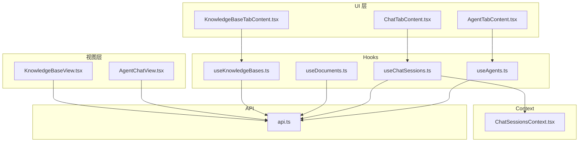
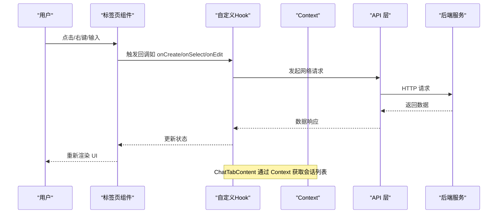
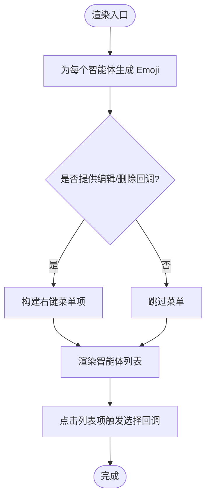
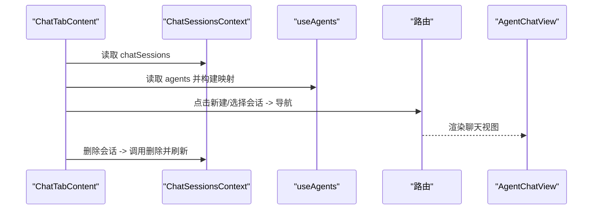
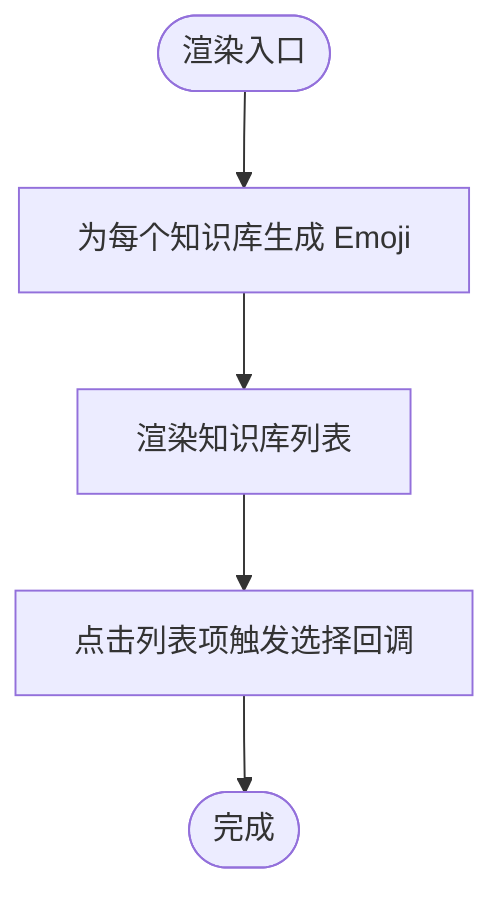
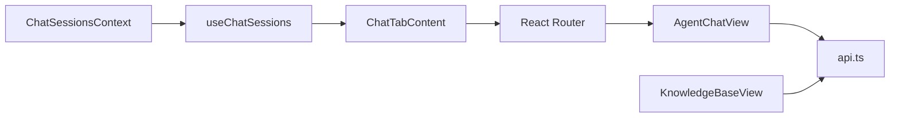
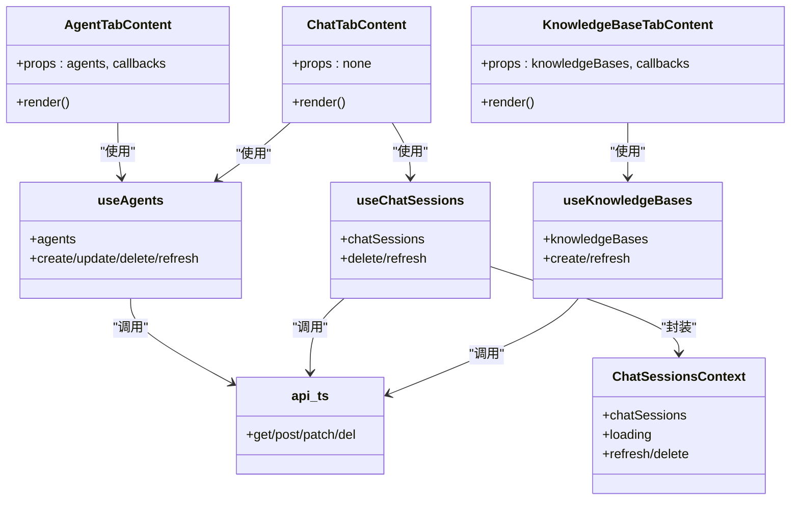

# 标签页组件

<cite>
**本文引用的文件**
- [AgentTabContent.tsx](file://ui/src/components/tabs/AgentTabContent.tsx)
- [ChatTabContent.tsx](file://ui/src/components/tabs/ChatTabContent.tsx)
- [KnowledgeBaseTabContent.tsx](file://ui/src/components/tabs/KnowledgeBaseTabContent.tsx)
- [useAgents.ts](file://ui/src/hooks/useAgents.ts)
- [useChatSessions.ts](file://ui/src/hooks/useChatSessions.ts)
- [useDocuments.ts](file://ui/src/hooks/useDocuments.ts)
- [useKnowledgeBases.ts](file://ui/src/hooks/useKnowledgeBases.ts)
- [ChatSessionsContext.tsx](file://ui/src/contexts/ChatSessionsContext.tsx)
- [api.ts](file://ui/src/api/api.ts)
- [index.ts（类型）](file://ui/src/types/index.ts)
- [index.ts（工具）](file://ui/src/utils/index.ts)
- [AgentChatView.tsx](file://ui/src/components/views/AgentChatView.tsx)
- [KnowledgeBaseView.tsx](file://ui/src/components/views/KnowledgeBaseView.tsx)
- [App.tsx](file://ui/src/App.tsx)
- [JChatMindLayout.tsx](file://ui/src/components/JChatMindLayout.tsx)
</cite>

## 目录
1. [简介](#简介)
2. [项目结构](#项目结构)
3. [核心组件](#核心组件)
4. [架构总览](#架构总览)
5. [组件详解](#组件详解)
6. [依赖关系分析](#依赖关系分析)
7. [性能考量](#性能考量)
8. [故障排查指南](#故障排查指南)
9. [结论](#结论)
10. [附录](#附录)

## 简介
本指南围绕 JChatMind 的标签页组件展开，系统性解析以下三类标签页组件的实现架构与交互设计：
- 代理标签页：AgentTabContent，负责智能体列表展示、右键菜单与操作按钮。
- 聊天标签页：ChatTabContent，负责聊天会话列表展示、标题生成与删除确认。
- 知识库标签页：KnowledgeBaseTabContent，负责知识库列表展示与选择。

同时，文档将深入说明：
- 动态加载机制：按需渲染、状态保持与内存管理。
- 组件间数据共享与事件通信策略。
- 性能优化建议与用户体验改进建议。

## 项目结构
前端采用 React + TypeScript 架构，标签页组件位于 ui/src/components/tabs，配套的业务逻辑通过自定义 Hook 与 Context 提供，API 层统一在 ui/src/api/api.ts 中定义。

图表来源
- [AgentTabContent.tsx:1-158](file://ui/src/components/tabs/AgentTabContent.tsx#L1-L158)
- [ChatTabContent.tsx:1-116](file://ui/src/components/tabs/ChatTabContent.tsx#L1-L116)
- [KnowledgeBaseTabContent.tsx:1-78](file://ui/src/components/tabs/KnowledgeBaseTabContent.tsx#L1-L78)
- [useAgents.ts:1-55](file://ui/src/hooks/useAgents.ts#L1-L55)
- [useChatSessions.ts:1-6](file://ui/src/hooks/useChatSessions.ts#L1-L6)
- [useDocuments.ts:1-44](file://ui/src/hooks/useDocuments.ts#L1-L44)
- [useKnowledgeBases.ts:1-47](file://ui/src/hooks/useKnowledgeBases.ts#L1-L47)
- [ChatSessionsContext.tsx:1-66](file://ui/src/contexts/ChatSessionsContext.tsx#L1-L66)
- [api.ts:1-378](file://ui/src/api/api.ts#L1-L378)
- [AgentChatView.tsx:1-200](file://ui/src/components/views/AgentChatView.tsx#L1-L200)
- [KnowledgeBaseView.tsx:1-247](file://ui/src/components/views/KnowledgeBaseView.tsx#L1-L247)

章节来源
- [App.tsx:1-16](file://ui/src/App.tsx#L1-L16)
- [JChatMindLayout.tsx:1-31](file://ui/src/components/JChatMindLayout.tsx#L1-L31)

## 核心组件
- AgentTabContent：渲染智能体列表，支持创建、编辑、删除等操作；通过右键菜单提供上下文操作。
- ChatTabContent：渲染聊天会话列表，支持新建会话、选择会话、删除会话；标题根据会话标题或关联智能体名称生成。
- KnowledgeBaseTabContent：渲染知识库列表，支持创建与选择知识库。

章节来源
- [AgentTabContent.tsx:13-158](file://ui/src/components/tabs/AgentTabContent.tsx#L13-L158)
- [ChatTabContent.tsx:12-116](file://ui/src/components/tabs/ChatTabContent.tsx#L12-L116)
- [KnowledgeBaseTabContent.tsx:7-78](file://ui/src/components/tabs/KnowledgeBaseTabContent.tsx#L7-L78)

## 架构总览
标签页组件通过自定义 Hook 与 Context 获取数据，API 层封装了对后端服务的调用。路由层负责页面级视图切换，标签页组件作为侧边栏内容，承载具体的数据展示与用户交互。

图表来源
- [AgentTabContent.tsx:37-75](file://ui/src/components/tabs/AgentTabContent.tsx#L37-L75)
- [ChatTabContent.tsx:18-45](file://ui/src/components/tabs/ChatTabContent.tsx#L18-L45)
- [useAgents.ts:24-45](file://ui/src/hooks/useAgents.ts#L24-L45)
- [useChatSessions.ts:1-6](file://ui/src/hooks/useChatSessions.ts#L1-L6)
- [ChatSessionsContext.tsx:23-40](file://ui/src/contexts/ChatSessionsContext.tsx#L23-L40)
- [api.ts:57-85](file://ui/src/api/api.ts#L57-L85)

## 组件详解

### AgentTabContent 代理标签页
- 数据来源：接收外部传入的智能体数组，并通过工具函数为每个智能体生成稳定的 Emoji。
- 交互能力：
  - 创建按钮：触发外部回调以创建新智能体。
  - 右键菜单：根据是否提供编辑/删除回调生成菜单项；删除操作使用确认模态框。
  - 列表项点击：触发选择回调，用于导航至对应智能体的聊天视图。
- 渲染细节：空态提示、描述截断、时间格式化等 UI 增强。

图表来源
- [AgentTabContent.tsx:29-150](file://ui/src/components/tabs/AgentTabContent.tsx#L29-L150)
- [index.ts（工具）:1-22](file://ui/src/utils/index.ts#L1-L22)

章节来源
- [AgentTabContent.tsx:1-158](file://ui/src/components/tabs/AgentTabContent.tsx#L1-L158)
- [index.ts（工具）:1-22](file://ui/src/utils/index.ts#L1-L22)

### ChatTabContent 聊天标签页
- 数据来源：通过 Context 获取聊天会话列表；通过 Hook 获取智能体列表，构建 agentId -> name 的映射。
- 标题生成：优先使用会话标题，否则回退到“与 {agentName} 的对话”。
- 交互能力：
  - 新建会话按钮：导航到聊天视图。
  - 会话项点击：导航到指定会话详情。
  - 删除确认：使用气泡确认框执行删除。
- 加载状态：统一显示加载中与空态提示。

图表来源
- [ChatTabContent.tsx:18-45](file://ui/src/components/tabs/ChatTabContent.tsx#L18-L45)
- [ChatSessionsContext.tsx:23-40](file://ui/src/contexts/ChatSessionsContext.tsx#L23-L40)
- [useAgents.ts:12-27](file://ui/src/hooks/useAgents.ts#L12-L27)
- [AgentChatView.tsx:17-53](file://ui/src/components/views/AgentChatView.tsx#L17-L53)

章节来源
- [ChatTabContent.tsx:1-116](file://ui/src/components/tabs/ChatTabContent.tsx#L1-L116)
- [ChatSessionsContext.tsx:1-66](file://ui/src/contexts/ChatSessionsContext.tsx#L1-L66)
- [useAgents.ts:1-55](file://ui/src/hooks/useAgents.ts#L1-L55)

### KnowledgeBaseTabContent 知识库标签页
- 数据来源：接收外部传入的知识库数组，并为每个知识库生成稳定 Emoji。
- 交互能力：
  - 创建按钮：触发外部回调以创建新知识库。
  - 列表项点击：触发选择回调，用于导航至知识库详情视图。
- 渲染细节：空态提示、描述截断等 UI 增强。

图表来源
- [KnowledgeBaseTabContent.tsx:19-70](file://ui/src/components/tabs/KnowledgeBaseTabContent.tsx#L19-L70)
- [index.ts（工具）:24-46](file://ui/src/utils/index.ts#L24-L46)

章节来源
- [KnowledgeBaseTabContent.tsx:1-78](file://ui/src/components/tabs/KnowledgeBaseTabContent.tsx#L1-L78)
- [index.ts（工具）:24-46](file://ui/src/utils/index.ts#L24-L46)

### 动态加载机制与状态保持
- 按需渲染：
  - ChatTabContent 在会话列表为空时显示空态提示，避免不必要的复杂渲染。
  - KnowledgeBaseTabContent 在知识库列表为空时显示空态提示。
- 状态保持：
  - ChatTabContent 通过 Context 统一管理会话列表与加载状态，删除会话后自动刷新。
  - AgentTabContent 与 KnowledgeBaseTabContent 通过 props 接收最新数据，由上层组件负责数据刷新。
- 内存管理：
  - 合理使用 useMemo 缓存计算结果（如智能体/知识库 Emoji、agentMap），减少重复计算。
  - ChatTabContent 在删除会话后及时刷新，避免内存泄漏。

章节来源
- [ChatTabContent.tsx:60-70](file://ui/src/components/tabs/ChatTabContent.tsx#L60-L70)
- [KnowledgeBaseTabContent.tsx:39-45](file://ui/src/components/tabs/KnowledgeBaseTabContent.tsx#L39-L45)
- [AgentTabContent.tsx:29-34](file://ui/src/components/tabs/AgentTabContent.tsx#L29-L34)
- [ChatSessionsContext.tsx:23-40](file://ui/src/contexts/ChatSessionsContext.tsx#L23-L40)

### 组件间数据共享与事件通信
- 上下文共享：
  - ChatSessionsContext 提供聊天会话列表、加载状态与删除方法，ChatTabContent 通过 useChatSessions 直接消费。
- 路由驱动的事件：
  - 标签页组件通过路由导航触发视图切换，AgentChatView 与 KnowledgeBaseView 分别处理会话与知识库详情。
- 回调驱动的事件：
  - 标签页组件通过回调（onCreate/onSelect/onEdit/onDelete）与上层组件通信，实现跨组件协作。

图表来源
- [ChatSessionsContext.tsx:1-66](file://ui/src/contexts/ChatSessionsContext.tsx#L1-L66)
- [useChatSessions.ts:1-6](file://ui/src/hooks/useChatSessions.ts#L1-L6)
- [ChatTabContent.tsx:1-116](file://ui/src/components/tabs/ChatTabContent.tsx#L1-L116)
- [AgentChatView.tsx:1-200](file://ui/src/components/views/AgentChatView.tsx#L1-L200)
- [KnowledgeBaseView.tsx:1-247](file://ui/src/components/views/KnowledgeBaseView.tsx#L1-L247)
- [api.ts:1-378](file://ui/src/api/api.ts#L1-L378)

## 依赖关系分析
- 组件依赖：
  - AgentTabContent 依赖工具函数生成 Emoji，依赖外部回调处理编辑/删除。
  - ChatTabContent 依赖 Context 获取会话列表，依赖 Hook 获取智能体映射。
  - KnowledgeBaseTabContent 依赖工具函数生成 Emoji。
- Hook 与 Context：
  - useAgents/useKnowledgeBases 封装智能体/知识库 CRUD，并提供刷新方法。
  - ChatSessionsContext 封装会话列表获取与删除，并提供刷新方法。
- API 层：
  - 所有组件通过 api.ts 统一发起网络请求，保证一致的错误处理与数据格式。

图表来源
- [AgentTabContent.tsx:1-158](file://ui/src/components/tabs/AgentTabContent.tsx#L1-L158)
- [ChatTabContent.tsx:1-116](file://ui/src/components/tabs/ChatTabContent.tsx#L1-L116)
- [KnowledgeBaseTabContent.tsx:1-78](file://ui/src/components/tabs/KnowledgeBaseTabContent.tsx#L1-L78)
- [useAgents.ts:1-55](file://ui/src/hooks/useAgents.ts#L1-L55)
- [useChatSessions.ts:1-6](file://ui/src/hooks/useChatSessions.ts#L1-L6)
- [useKnowledgeBases.ts:1-47](file://ui/src/hooks/useKnowledgeBases.ts#L1-L47)
- [ChatSessionsContext.tsx:1-66](file://ui/src/contexts/ChatSessionsContext.tsx#L1-L66)
- [api.ts:1-378](file://ui/src/api/api.ts#L1-L378)

## 性能考量
- 渲染优化
  - 使用 useMemo 缓存计算结果（如 Emoji、agentMap），降低重复计算成本。
  - 列表渲染时使用 key（如 agent.id、kb.knowledgeBaseId）提升 React diff 效率。
- 网络与状态
  - ChatTabContent 在删除会话后立即刷新，避免陈旧数据导致的二次请求。
  - useDocuments 在 kbId 为空时清空列表，防止无效请求。
- 内存管理
  - 避免在组件内缓存大量历史数据；必要时在路由离开时清理状态。
- 用户体验
  - 加载态与空态提示明确，减少用户等待焦虑。
  - 对重要操作（删除）使用确认弹窗，避免误操作。

章节来源
- [AgentTabContent.tsx:29-34](file://ui/src/components/tabs/AgentTabContent.tsx#L29-L34)
- [ChatTabContent.tsx:18-24](file://ui/src/components/tabs/ChatTabContent.tsx#L18-L24)
- [useDocuments.ts:12-29](file://ui/src/hooks/useDocuments.ts#L12-L29)
- [ChatSessionsContext.tsx:23-40](file://ui/src/contexts/ChatSessionsContext.tsx#L23-L40)

## 故障排查指南
- 无法删除智能体/知识库
  - 检查回调是否正确传入（onEditAgent/onDeleteAgent、onCreateKnowledgeBaseClick、onSelectKnowledgeBase）。
  - 确认删除确认弹窗是否被阻止冒泡（已通过 stopPropagation 处理）。
- 会话列表不刷新
  - 确认 ChatSessionsContext 的刷新方法是否被调用；检查删除流程是否在删除成功后调用刷新。
- 空态显示异常
  - 检查数据源是否为空；确认条件渲染分支（如 agents.length === 0）。
- Emoji 不稳定
  - 确认 id 参数一致且未被修改；Emoji 生成基于 id 的哈希，需保证 id 稳定。

章节来源
- [AgentTabContent.tsx:58-71](file://ui/src/components/tabs/AgentTabContent.tsx#L58-L71)
- [ChatSessionsContext.tsx:37-40](file://ui/src/contexts/ChatSessionsContext.tsx#L37-L40)
- [ChatTabContent.tsx:60-70](file://ui/src/components/tabs/ChatTabContent.tsx#L60-L70)
- [index.ts（工具）:1-46](file://ui/src/utils/index.ts#L1-L46)

## 结论
JChatMind 的标签页组件通过清晰的职责划分与统一的 API 抽象，实现了良好的可维护性与扩展性。结合 Context 与自定义 Hook，组件间的数据共享与事件通信得以简化；配合按需渲染与状态保持策略，兼顾了性能与用户体验。后续可在虚拟列表、懒加载与缓存策略方面进一步优化。

## 附录
- 路由与视图映射
  - / 与 /agent 与 /chat 均指向 AgentChatView。
  - /chat/:chatSessionId 指向 AgentChatView 的会话详情。
  - /knowledge-base 与 /knowledge-base/:knowledgeBaseId 指向 KnowledgeBaseView。

章节来源
- [JChatMindLayout.tsx:16-26](file://ui/src/components/JChatMindLayout.tsx#L16-L26)
- [App.tsx:5-12](file://ui/src/App.tsx#L5-L12)