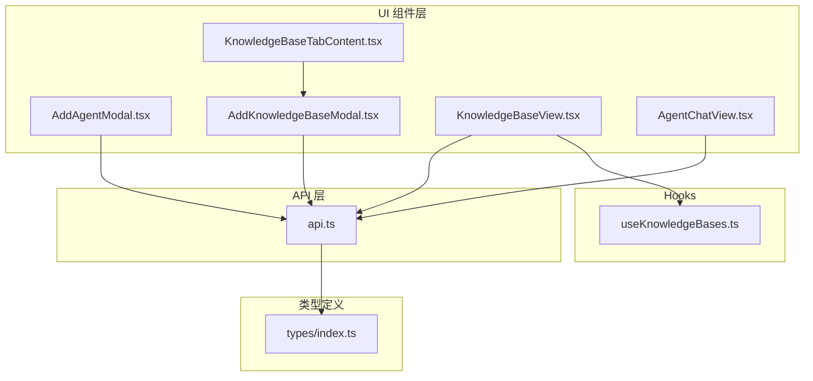
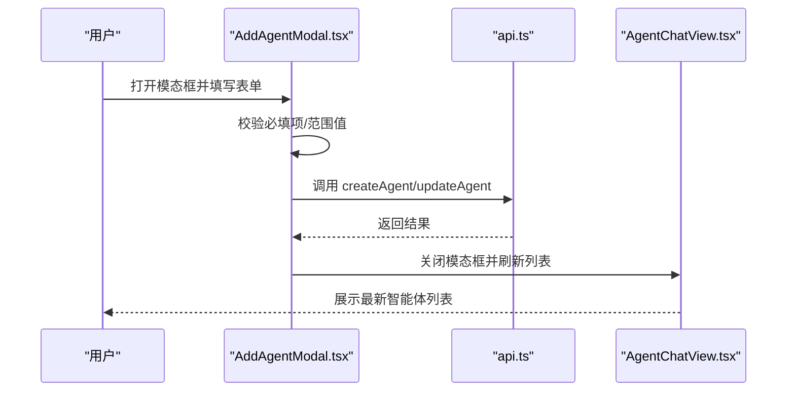
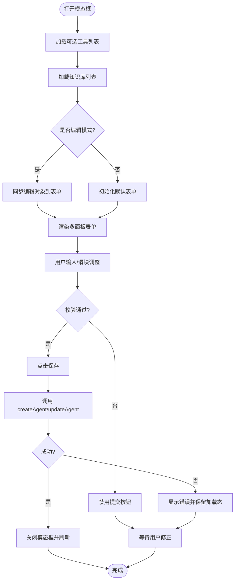
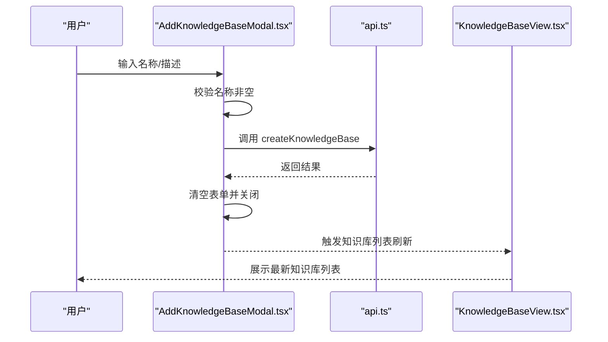
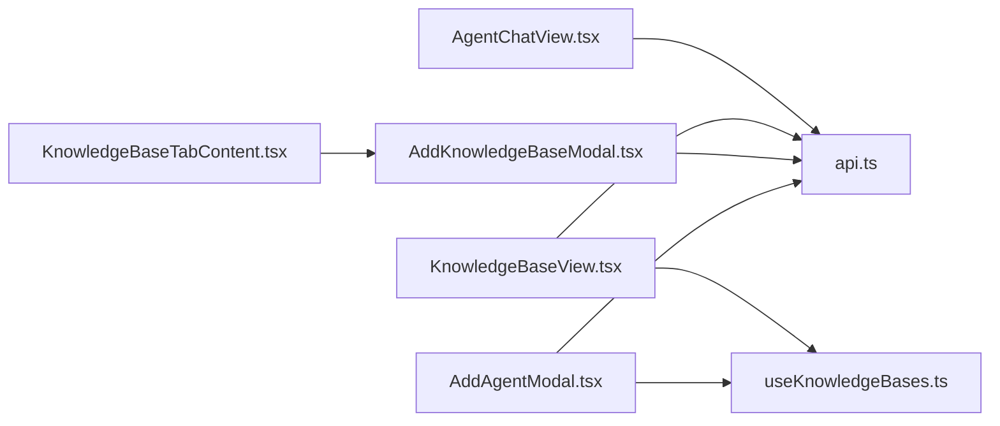

# 模态框组件

<cite>
**本文引用的文件**
- [AddAgentModal.tsx](file://ui/src/components/modals/AddAgentModal.tsx)
- [AddKnowledgeBaseModal.tsx](file://ui/src/components/modals/AddKnowledgeBaseModal.tsx)
- [api.ts](file://ui/src/api/api.ts)
- [useKnowledgeBases.ts](file://ui/src/hooks/useKnowledgeBases.ts)
- [KnowledgeBaseView.tsx](file://ui/src/components/views/KnowledgeBaseView.tsx)
- [KnowledgeBaseTabContent.tsx](file://ui/src/components/tabs/KnowledgeBaseTabContent.tsx)
- [AgentChatView.tsx](file://ui/src/components/views/AgentChatView.tsx)
- [index.ts](file://ui/src/types/index.ts)
</cite>

## 目录
1. [简介](#简介)
2. [项目结构](#项目结构)
3. [核心组件](#核心组件)
4. [架构总览](#架构总览)
5. [详细组件分析](#详细组件分析)
6. [依赖关系分析](#依赖关系分析)
7. [性能考虑](#性能考虑)
8. [故障排查指南](#故障排查指南)
9. [结论](#结论)
10. [附录](#附录)

## 简介
本文件聚焦于 JChatMind 前端 UI 中的模态框组件，系统性解析以下内容：
- AddAgentModal 代理添加模态框：表单验证、数据提交与错误处理策略
- AddKnowledgeBaseModal 知识库添加模态框：文件上传、进度与预览能力
- 通用模态框设计模式：遮罩层管理、焦点控制与键盘事件处理
- 模态框与表单组件的集成：数据绑定、验证规则与提交流程
- 扩展方法：自定义表单字段、验证规则与提交逻辑
- 无障碍访问与用户体验优化建议

## 项目结构
模态框组件位于前端 UI 的组件目录中，与 API 层、Hooks、视图组件协同工作，形成清晰的分层架构。

图表来源
- [AddAgentModal.tsx](file://ui/src/components/modals/AddAgentModal.tsx)
- [AddKnowledgeBaseModal.tsx](file://ui/src/components/modals/AddKnowledgeBaseModal.tsx)
- [api.ts](file://ui/src/api/api.ts)
- [useKnowledgeBases.ts](file://ui/src/hooks/useKnowledgeBases.ts)
- [KnowledgeBaseView.tsx](file://ui/src/components/views/KnowledgeBaseView.tsx)
- [KnowledgeBaseTabContent.tsx](file://ui/src/components/tabs/KnowledgeBaseTabContent.tsx)
- [AgentChatView.tsx](file://ui/src/components/views/AgentChatView.tsx)
- [index.ts](file://ui/src/types/index.ts)

章节来源
- [AddAgentModal.tsx](file://ui/src/components/modals/AddAgentModal.tsx)
- [AddKnowledgeBaseModal.tsx](file://ui/src/components/modals/AddKnowledgeBaseModal.tsx)
- [api.ts](file://ui/src/api/api.ts)
- [useKnowledgeBases.ts](file://ui/src/hooks/useKnowledgeBases.ts)
- [KnowledgeBaseView.tsx](file://ui/src/components/views/KnowledgeBaseView.tsx)
- [KnowledgeBaseTabContent.tsx](file://ui/src/components/tabs/KnowledgeBaseTabContent.tsx)
- [AgentChatView.tsx](file://ui/src/components/views/AgentChatView.tsx)
- [index.ts](file://ui/src/types/index.ts)

## 核心组件
- AddAgentModal：用于创建或编辑智能体的复杂表单模态框，包含基础设置、模型配置、知识库选择与工具调用等多面板。
- AddKnowledgeBaseModal：用于创建知识库的简洁表单模态框，包含名称与描述输入，并提供禁用/启用状态控制。

章节来源
- [AddAgentModal.tsx](file://ui/src/components/modals/AddAgentModal.tsx)
- [AddKnowledgeBaseModal.tsx](file://ui/src/components/modals/AddKnowledgeBaseModal.tsx)

## 架构总览
模态框组件通过 props 接收外部回调函数，负责收集用户输入并调用 API 完成数据提交；同时，模态框内部维护本地状态以驱动 UI 交互与校验。

图表来源
- [AddAgentModal.tsx](file://ui/src/components/modals/AddAgentModal.tsx)
- [api.ts](file://ui/src/api/api.ts)
- [AgentChatView.tsx](file://ui/src/components/views/AgentChatView.tsx)

## 详细组件分析

### AddAgentModal 代理添加模态框
- 设计模式
  - 多面板导航：左侧菜单切换“基础设置/模型设置/知识库设置/工具调用”四个面板，提升复杂表单的可读性与可维护性。
  - 受控表单：使用 useState 维护表单数据，通过 Ant Design 组件进行双向绑定，确保输入变更即时反映到状态。
  - 编辑模式：根据是否存在 editingAgent 决定标题与提交路径（创建/更新），并在打开时同步初始值。
  - 异步加载：在挂载时异步获取可选工具列表与知识库列表，避免阻塞首屏渲染。
- 表单验证与提交
  - 必填校验：名称字段为空时禁止提交（由外部按钮禁用状态体现）。
  - 范围校验：模型参数（Temperature、Top P、消息窗口长度）通过滑块限制合法区间，实时展示数值。
  - 多选上限：知识库选择最多 10 个，防止过度关联导致检索开销过大。
  - 提交流程：点击保存按钮后进入加载态，调用 createAgent 或 updateAgent，成功后关闭模态框。
- 错误处理
  - 工具列表获取失败时记录日志，不影响其他功能。
  - 提交阶段统一捕获异常并保持加载态，finally 中恢复状态，避免 UI 卡死。
- 与表单组件的集成
  - 输入组件：Input、TextArea、Select、Slider、Checkbox 等均采用受控模式，onChange 同步更新 formData。
  - 数据绑定：formData 结构与 CreateAgentRequest/UpdateAgentRequest 对齐，减少转换成本。
  - 验证规则：基于 UI 控件的范围与必填约束，必要时可在外部增加更严格的校验器。
- 扩展建议
  - 自定义字段：新增面板或字段时，遵循现有结构拆分状态与渲染逻辑，避免单文件膨胀。
  - 自定义校验：引入统一的校验器函数，集中处理必填、长度、格式等规则。
  - 自定义提交：封装 createAgentHandle/updateAgentHandle，支持重试、幂等与事务回滚。

图表来源
- [AddAgentModal.tsx](file://ui/src/components/modals/AddAgentModal.tsx)
- [api.ts](file://ui/src/api/api.ts)

章节来源
- [AddAgentModal.tsx](file://ui/src/components/modals/AddAgentModal.tsx)
- [api.ts](file://ui/src/api/api.ts)

### AddKnowledgeBaseModal 知识库添加模态框
- 设计模式
  - 简洁表单：仅包含名称与描述两个字段，降低认知负担。
  - 禁用/启用：当名称为空时禁用提交按钮，避免无效请求。
  - 清空重置：提交成功后清空表单并关闭模态框，保证下一次输入干净。
- 文件上传、进度与预览
  - 当前实现：模态框本身不直接处理文件上传，而是通过上层视图组件（如 KnowledgeBaseView）提供上传能力。
  - 进度与预览：在知识库详情页中使用 Ant Design Upload 组件，结合自定义 customRequest 实现上传进度反馈与成功/失败提示。
- 与表单组件的集成
  - 输入组件：Input、TextArea 采用受控模式，onChange 同步更新 formData。
  - 提交流程：handleSubmit 在名称非空时触发 createKnowledgeBaseHandle，成功后清空表单并关闭。
- 扩展建议
  - 文件上传内嵌：若需在模态框内直接上传，可引入 Upload 组件并复用 KnowledgeBaseView 的 customRequest 逻辑。
  - 进度条：在模态框底部增加上传进度指示器，提升反馈体验。
  - 预览：对选中的文件进行简单预览（如图标+文件名），便于确认。

图表来源
- [AddKnowledgeBaseModal.tsx](file://ui/src/components/modals/AddKnowledgeBaseModal.tsx)
- [api.ts](file://ui/src/api/api.ts)
- [KnowledgeBaseView.tsx](file://ui/src/components/views/KnowledgeBaseView.tsx)

章节来源
- [AddKnowledgeBaseModal.tsx](file://ui/src/components/modals/AddKnowledgeBaseModal.tsx)
- [api.ts](file://ui/src/api/api.ts)
- [KnowledgeBaseView.tsx](file://ui/src/components/views/KnowledgeBaseView.tsx)

### 通用设计模式：遮罩层管理、焦点控制与键盘事件
- 遮罩层管理
  - 使用 Ant Design Modal 的 open/onCancel/title/footer/width/centered 等属性统一管理可见性与布局。
- 焦点控制
  - 打开模态框时，自动聚焦到首个可交互元素（如第一个 Input），便于快速输入。
  - 关闭时恢复原焦点，避免页面跳转。
- 键盘事件
  - 支持 Enter 触发提交（如 AddKnowledgeBaseModal 的 Input.onPressEnter）。
  - ESC 关闭模态框（由 Modal 默认行为提供）。
- 无障碍访问
  - 为每个输入框提供清晰的标签与描述文本。
  - 为按钮提供明确的文案与图标组合，确保语义化。
  - 对禁用状态的按钮提供提示信息，避免用户困惑。

章节来源
- [AddAgentModal.tsx](file://ui/src/components/modals/AddAgentModal.tsx)
- [AddKnowledgeBaseModal.tsx](file://ui/src/components/modals/AddKnowledgeBaseModal.tsx)

### 模态框与表单组件的集成
- 数据绑定
  - 通过 useState 维护表单数据，Ant Design 组件的 onChange 回调同步更新状态。
  - 表单结构与 API 请求体对齐，减少转换步骤。
- 验证规则
  - 基于 UI 控件的范围与必填约束（如 Slider 的 min/max、Input 的 trim 校验）。
  - 可在外部引入统一校验器，集中处理复杂规则。
- 提交流程
  - 统一的 loading 状态管理，避免重复提交。
  - 成功后关闭模态框并触发父级刷新，失败时保留加载态并提示错误。

章节来源
- [AddAgentModal.tsx](file://ui/src/components/modals/AddAgentModal.tsx)
- [AddKnowledgeBaseModal.tsx](file://ui/src/components/modals/AddKnowledgeBaseModal.tsx)
- [api.ts](file://ui/src/api/api.ts)

### 扩展方法
- 自定义表单字段
  - 新增面板：在菜单与渲染逻辑中添加新键值，对应新的表单域与状态。
  - 新增字段：在状态结构中添加对应键，并在渲染中使用受控组件绑定。
- 自定义验证规则
  - 引入校验器函数，集中处理必填、长度、正则、范围等规则。
  - 将校验结果映射为 UI 提示，提升用户反馈质量。
- 自定义提交逻辑
  - 包装 createAgentHandle/updateAgentHandle，支持重试、幂等与事务回滚。
  - 在提交前后增加拦截器，统一处理 loading、错误与成功提示。

章节来源
- [AddAgentModal.tsx](file://ui/src/components/modals/AddAgentModal.tsx)
- [AddKnowledgeBaseModal.tsx](file://ui/src/components/modals/AddKnowledgeBaseModal.tsx)

## 依赖关系分析
- 组件间耦合
  - AddAgentModal 依赖 useKnowledgeBases 获取知识库列表，依赖 API 层的工具与智能体接口。
  - AddKnowledgeBaseModal 依赖 API 层的知识库接口与 Hooks。
  - 上层视图组件（如 KnowledgeBaseView）负责文件上传与列表刷新，与模态框形成协作关系。
- 外部依赖
  - Ant Design 组件库提供 Modal、Input、Select、Slider、Button 等 UI 原子能力。
  - React Hooks 提供状态与副作用管理。
- 潜在循环依赖
  - 模态框组件之间无直接导入关系，通过 API 层与 Hooks 解耦，避免循环依赖。

图表来源
- [AddAgentModal.tsx](file://ui/src/components/modals/AddAgentModal.tsx)
- [AddKnowledgeBaseModal.tsx](file://ui/src/components/modals/AddKnowledgeBaseModal.tsx)
- [api.ts](file://ui/src/api/api.ts)
- [useKnowledgeBases.ts](file://ui/src/hooks/useKnowledgeBases.ts)
- [KnowledgeBaseView.tsx](file://ui/src/components/views/KnowledgeBaseView.tsx)
- [KnowledgeBaseTabContent.tsx](file://ui/src/components/tabs/KnowledgeBaseTabContent.tsx)
- [AgentChatView.tsx](file://ui/src/components/views/AgentChatView.tsx)

章节来源
- [AddAgentModal.tsx](file://ui/src/components/modals/AddAgentModal.tsx)
- [AddKnowledgeBaseModal.tsx](file://ui/src/components/modals/AddKnowledgeBaseModal.tsx)
- [api.ts](file://ui/src/api/api.ts)
- [useKnowledgeBases.ts](file://ui/src/hooks/useKnowledgeBases.ts)
- [KnowledgeBaseView.tsx](file://ui/src/components/views/KnowledgeBaseView.tsx)
- [KnowledgeBaseTabContent.tsx](file://ui/src/components/tabs/KnowledgeBaseTabContent.tsx)
- [AgentChatView.tsx](file://ui/src/components/views/AgentChatView.tsx)

## 性能考虑
- 渲染优化
  - 多面板切换使用条件渲染，避免不必要的子树重绘。
  - 知识库与工具列表使用 useMemo 缓存计算结果，减少重复渲染。
- 网络优化
  - 异步加载工具与知识库列表，避免阻塞首屏。
  - 上传文件时使用自定义请求，结合消息提示与加载状态，避免多次重复上传。
- 状态管理
  - 将表单状态与 API 请求体对齐，减少中间转换步骤，降低内存占用。

## 故障排查指南
- 提交失败
  - 检查网络请求返回码与消息，确认服务端响应结构与客户端解析一致。
  - 在 finally 中恢复加载态，避免 UI 卡死。
- 工具/知识库列表为空
  - 确认 API 接口返回结构与 Hooks 转换逻辑一致。
  - 检查权限与鉴权配置，确保能够正常访问资源。
- 上传失败
  - 检查文件类型与大小限制，确认服务端上传接口可用。
  - 在知识库详情页中查看错误提示与消息组件反馈。

章节来源
- [AddAgentModal.tsx](file://ui/src/components/modals/AddAgentModal.tsx)
- [AddKnowledgeBaseModal.tsx](file://ui/src/components/modals/AddKnowledgeBaseModal.tsx)
- [api.ts](file://ui/src/api/api.ts)
- [KnowledgeBaseView.tsx](file://ui/src/components/views/KnowledgeBaseView.tsx)

## 结论
JChatMind 的模态框组件通过清晰的职责划分与受控表单模式，实现了高可维护性的表单交互体验。AddAgentModal 与 AddKnowledgeBaseModal 分别覆盖了复杂配置与轻量创建两类场景，配合 API 层与 Hooks，形成了稳定可靠的前端交互闭环。未来可在校验器抽象、上传内嵌与无障碍增强等方面进一步完善，以提升扩展性与用户体验。

## 附录
- 类型定义参考
  - 智能体相关：CreateAgentRequest、UpdateAgentRequest、AgentVO、ModelType、ChatOptions
  - 知识库相关：CreateKnowledgeBaseRequest、UpdateKnowledgeBaseRequest、KnowledgeBaseVO
  - 工具相关：ToolVO、ToolType
- 常用接口参考
  - 智能体：createAgent、updateAgent、getAgents
  - 知识库：createKnowledgeBase、updateKnowledgeBase、getKnowledgeBases
  - 文档：uploadDocument、getDocumentsByKbId、deleteDocument
  - 工具：getOptionalTools

章节来源
- [api.ts](file://ui/src/api/api.ts)
- [index.ts](file://ui/src/types/index.ts)