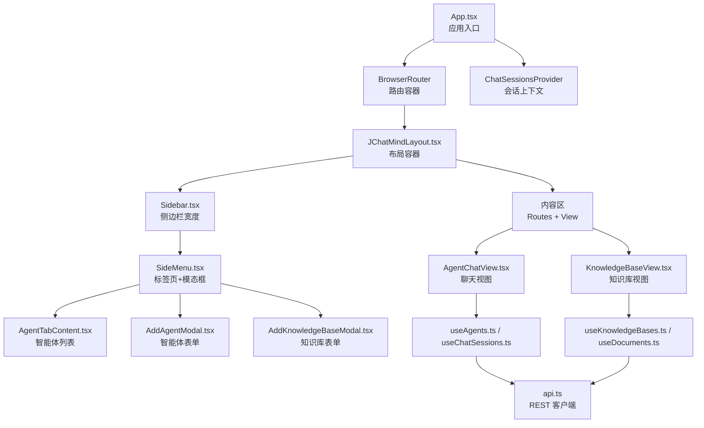
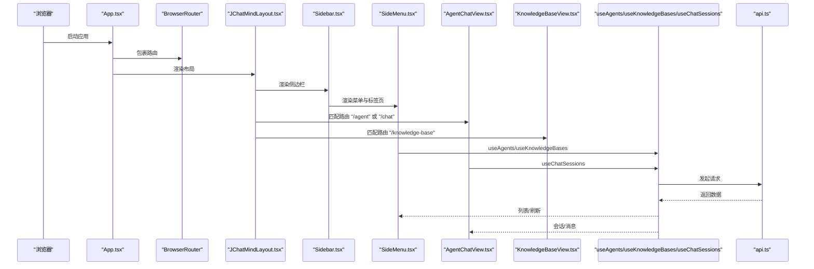
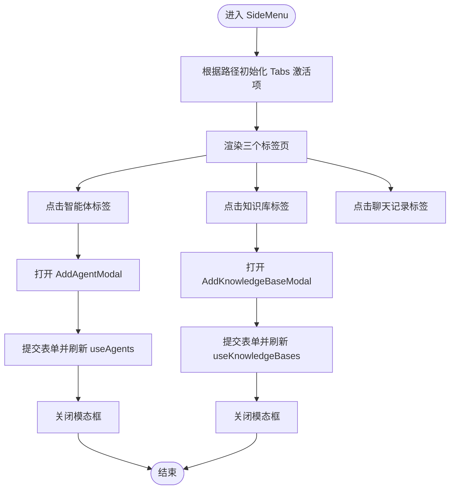
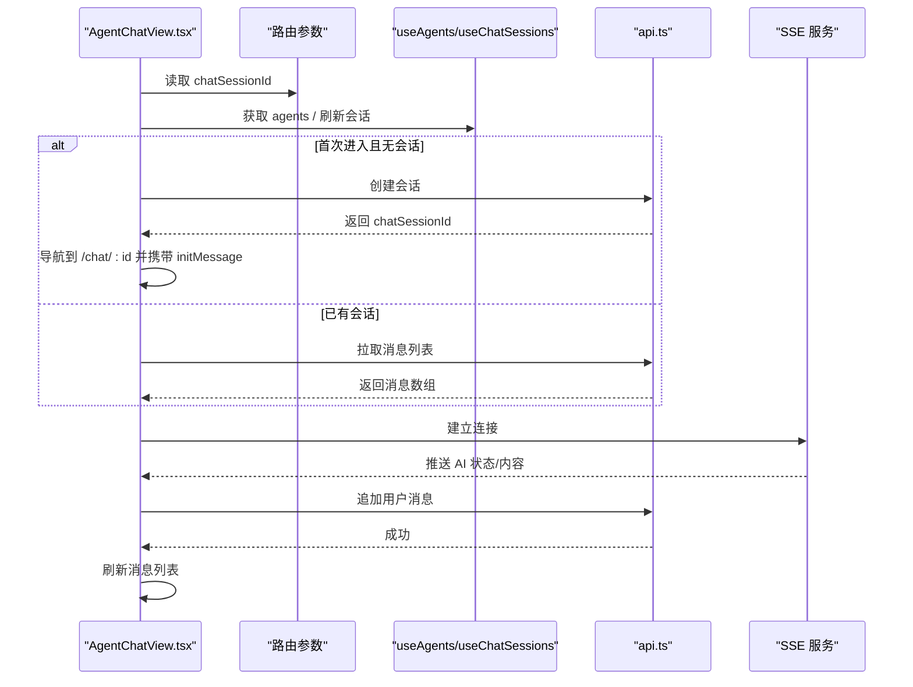
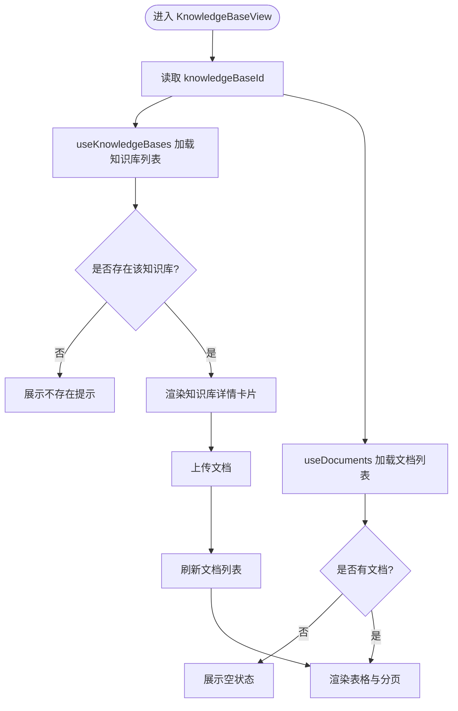
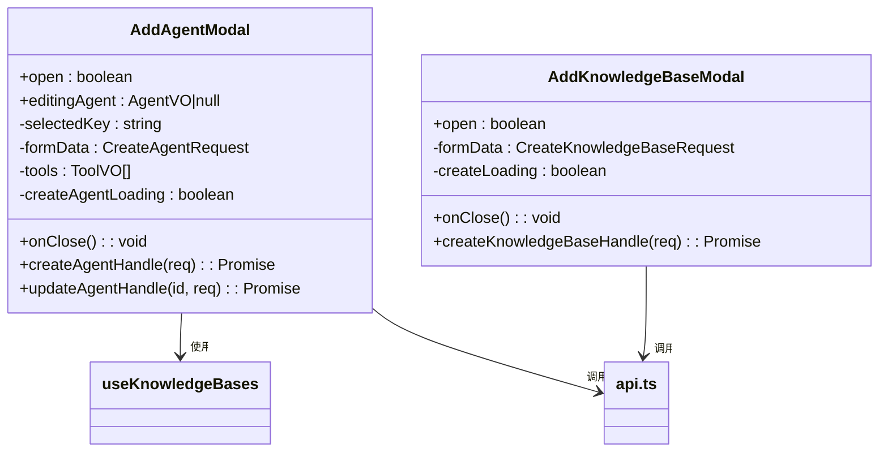
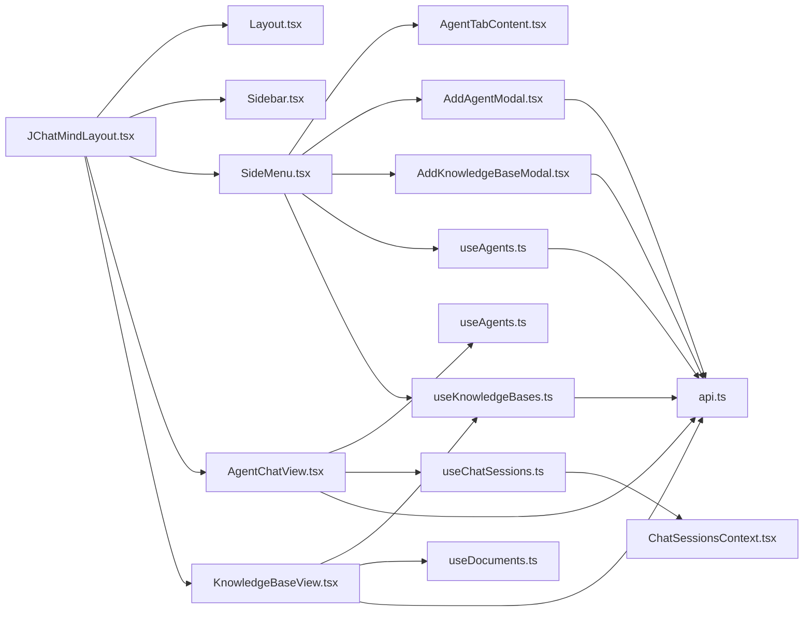

# 组件系统

<cite>
**本文引用的文件**
- [JChatMindLayout.tsx](file://ui/src/components/JChatMindLayout.tsx)
- [SideMenu.tsx](file://ui/src/components/SideMenu.tsx)
- [AgentChatView.tsx](file://ui/src/components/views/AgentChatView.tsx)
- [KnowledgeBaseView.tsx](file://ui/src/components/views/KnowledgeBaseView.tsx)
- [AgentTabContent.tsx](file://ui/src/components/tabs/AgentTabContent.tsx)
- [AddAgentModal.tsx](file://ui/src/components/modals/AddAgentModal.tsx)
- [AddKnowledgeBaseModal.tsx](file://ui/src/components/modals/AddKnowledgeBaseModal.tsx)
- [Layout.tsx](file://ui/src/layout/Layout.tsx)
- [Sidebar.tsx](file://ui/src/layout/Sidebar.tsx)
- [useAgents.ts](file://ui/src/hooks/useAgents.ts)
- [useKnowledgeBases.ts](file://ui/src/hooks/useKnowledgeBases.ts)
- [useChatSessions.ts](file://ui/src/hooks/useChatSessions.ts)
- [ChatSessionsContext.tsx](file://ui/src/contexts/ChatSessionsContext.tsx)
- [api.ts](file://ui/src/api/api.ts)
- [App.tsx](file://ui/src/App.tsx)
</cite>

## 目录
1. [简介](#简介)
2. [项目结构](#项目结构)
3. [核心组件](#核心组件)
4. [架构总览](#架构总览)
5. [组件详解](#组件详解)
6. [依赖关系分析](#依赖关系分析)
7. [性能与可维护性建议](#性能与可维护性建议)
8. [故障排查指南](#故障排查指南)
9. [结论](#结论)
10. [附录：Props 与事件规范](#附录props-与事件规范)

## 简介
本指南面向 JChatMind 的前端组件系统，聚焦组件化设计与实现模式，覆盖布局组件、视图组件、标签页组件与模态框组件的设计原则与最佳实践。重点解析以下内容：
- JChatMindLayout 布局组件：路由挂载、侧边栏与内容区组织、响应式与主题扩展思路
- SideMenu 侧边菜单：标签页状态管理、路由联动、模态框驱动的 CRUD 流程
- 视图组件：AgentChatView 与 KnowledgeBaseView 的数据流、状态同步与交互模式
- 标签页组件：动态加载、上下文数据传递与事件回调
- 模态框组件：通用表单设计、分步配置与提交流程
- 组件复用策略、Props 传递规范与事件处理最佳实践

## 项目结构
UI 层采用按功能域划分的目录结构，核心文件分布如下：
- 布局层：Layout、Sidebar
- 导航与路由：JChatMindLayout、SideMenu
- 视图层：AgentChatView、KnowledgeBaseView
- 标签页与模态框：AgentTabContent、AddAgentModal、AddKnowledgeBaseModal
- 数据与状态：useAgents、useKnowledgeBases、useChatSessions、ChatSessionsContext
- API 客户端：api.ts
- 应用入口：App.tsx

图表来源
- [App.tsx:1-16](file://ui/src/App.tsx#L1-L16)
- [JChatMindLayout.tsx:1-31](file://ui/src/components/JChatMindLayout.tsx#L1-L31)
- [Layout.tsx:1-12](file://ui/src/layout/Layout.tsx#L1-L12)
- [Sidebar.tsx:1-21](file://ui/src/layout/Sidebar.tsx#L1-L21)
- [SideMenu.tsx:1-127](file://ui/src/components/SideMenu.tsx#L1-L127)
- [AgentChatView.tsx:1-200](file://ui/src/components/views/AgentChatView.tsx#L1-L200)
- [KnowledgeBaseView.tsx:1-247](file://ui/src/components/views/KnowledgeBaseView.tsx#L1-L247)
- [AgentTabContent.tsx:1-158](file://ui/src/components/tabs/AgentTabContent.tsx#L1-L158)
- [AddAgentModal.tsx:1-523](file://ui/src/components/modals/AddAgentModal.tsx#L1-L523)
- [AddKnowledgeBaseModal.tsx:1-109](file://ui/src/components/modals/AddKnowledgeBaseModal.tsx#L1-L109)
- [useAgents.ts:1-55](file://ui/src/hooks/useAgents.ts#L1-L55)
- [useKnowledgeBases.ts:1-47](file://ui/src/hooks/useKnowledgeBases.ts#L1-L47)
- [useChatSessions.ts:1-6](file://ui/src/hooks/useChatSessions.ts#L1-L6)
- [ChatSessionsContext.tsx:1-66](file://ui/src/contexts/ChatSessionsContext.tsx#L1-L66)
- [api.ts:1-378](file://ui/src/api/api.ts#L1-L378)

章节来源
- [App.tsx:1-16](file://ui/src/App.tsx#L1-L16)
- [JChatMindLayout.tsx:1-31](file://ui/src/components/JChatMindLayout.tsx#L1-L31)

## 核心组件
- 布局容器：Layout、Sidebar 提供统一的页面骨架与侧边栏宽度约束
- 导航与路由：JChatMindLayout 使用 React Router 在内容区渲染不同视图，并与 SideMenu 协同完成标签页与路由联动
- 视图组件：AgentChatView 负责聊天会话的数据拉取、消息展示与 SSE 推送；KnowledgeBaseView 负责知识库详情与文档列表
- 标签页与模态框：SideMenu 内部以 Tabs 管理“智能体”“聊天记录”“知识库”，并通过模态框完成新增/编辑
- 状态与数据：useAgents/useKnowledgeBases/useChatSessions 抽象数据访问与刷新逻辑；ChatSessionsContext 提供会话级上下文

章节来源
- [Layout.tsx:1-12](file://ui/src/layout/Layout.tsx#L1-L12)
- [Sidebar.tsx:1-21](file://ui/src/layout/Sidebar.tsx#L1-L21)
- [JChatMindLayout.tsx:1-31](file://ui/src/components/JChatMindLayout.tsx#L1-L31)
- [SideMenu.tsx:1-127](file://ui/src/components/SideMenu.tsx#L1-L127)
- [AgentChatView.tsx:1-200](file://ui/src/components/views/AgentChatView.tsx#L1-L200)
- [KnowledgeBaseView.tsx:1-247](file://ui/src/components/views/KnowledgeBaseView.tsx#L1-L247)
- [useAgents.ts:1-55](file://ui/src/hooks/useAgents.ts#L1-L55)
- [useKnowledgeBases.ts:1-47](file://ui/src/hooks/useKnowledgeBases.ts#L1-L47)
- [useChatSessions.ts:1-6](file://ui/src/hooks/useChatSessions.ts#L1-L6)
- [ChatSessionsContext.tsx:1-66](file://ui/src/contexts/ChatSessionsContext.tsx#L1-L66)

## 架构总览
下图展示了应用启动、路由挂载、布局组织与数据流的整体关系。

图表来源
- [App.tsx:1-16](file://ui/src/App.tsx#L1-L16)
- [JChatMindLayout.tsx:1-31](file://ui/src/components/JChatMindLayout.tsx#L1-L31)
- [SideMenu.tsx:1-127](file://ui/src/components/SideMenu.tsx#L1-L127)
- [AgentChatView.tsx:1-200](file://ui/src/components/views/AgentChatView.tsx#L1-L200)
- [KnowledgeBaseView.tsx:1-247](file://ui/src/components/views/KnowledgeBaseView.tsx#L1-L247)
- [useAgents.ts:1-55](file://ui/src/hooks/useAgents.ts#L1-L55)
- [useKnowledgeBases.ts:1-47](file://ui/src/hooks/useKnowledgeBases.ts#L1-L47)
- [useChatSessions.ts:1-6](file://ui/src/hooks/useChatSessions.ts#L1-L6)
- [api.ts:1-378](file://ui/src/api/api.ts#L1-L378)

## 组件详解

### 布局组件：JChatMindLayout
- 设计理念
  - 通过 Layout/Sidebar/Content 组合形成三段式布局，Sidebar 固定宽度，Content 自适应
  - 使用 React Router 的 Routes/Route 在内容区按路径渲染 AgentChatView 与 KnowledgeBaseView
- 响应式与主题
  - 布局使用固定宽度与 flex 布局，适合在桌面端稳定展示
  - 主题切换可通过 Tailwind 类或主题变量扩展，建议在 Layout/Sidebar 上层抽象统一注入
- 导航管理
  - 路由与标签页联动：SideMenu 根据当前路径设置 Tabs 的 activeKey，实现导航一致性
  - 路由参数：支持 /chat/:chatSessionId 与 /knowledge-base/:knowledgeBaseId，便于深度链接与分享

章节来源
- [JChatMindLayout.tsx:1-31](file://ui/src/components/JChatMindLayout.tsx#L1-L31)
- [Layout.tsx:1-12](file://ui/src/layout/Layout.tsx#L1-L12)
- [Sidebar.tsx:1-21](file://ui/src/layout/Sidebar.tsx#L1-L21)

### 侧边菜单组件：SideMenu
- 状态管理
  - 本地状态：模态框开关、编辑中的 Agent、Tabs 激活项
  - 全局状态：useAgents/useKnowledgeBases 提供列表与 CRUD 能力
- 路由集成
  - 根据当前路径自动定位 Tabs 激活项
  - 点击知识库条目触发导航至对应知识库详情页
- 模态框驱动的 CRUD
  - 新增/编辑智能体：AddAgentModal
  - 新建知识库：AddKnowledgeBaseModal
  - 编辑态与新建态通过 editingAgent 与 isEditMode 切换

图表来源
- [SideMenu.tsx:1-127](file://ui/src/components/SideMenu.tsx#L1-L127)
- [AddAgentModal.tsx:1-523](file://ui/src/components/modals/AddAgentModal.tsx#L1-L523)
- [AddKnowledgeBaseModal.tsx:1-109](file://ui/src/components/modals/AddKnowledgeBaseModal.tsx#L1-L109)
- [useAgents.ts:1-55](file://ui/src/hooks/useAgents.ts#L1-L55)
- [useKnowledgeBases.ts:1-47](file://ui/src/hooks/useKnowledgeBases.ts#L1-L47)

章节来源
- [SideMenu.tsx:1-127](file://ui/src/components/SideMenu.tsx#L1-L127)

### 视图组件：AgentChatView
- 数据流与状态
  - 参数：从路由 params 获取 chatSessionId
  - 列表：useAgents 获取可用智能体，useChatSessions 提供会话刷新能力
  - 会话与消息：首次进入无会话时创建；已存在会话则拉取消息列表
  - 实时：通过 SSE 连接接收 AI 状态与生成内容，动态更新消息列表与状态提示
- 交互模式
  - 输入组件 onSend 回调统一处理发送逻辑，区分“新建会话”与“追加消息”
  - 初始化消息通过 location.state 透传，确保首次消息正确落库
- 错误处理
  - 创建会话失败弹出错误提示
  - SSE 连接异常打印日志并清理资源

图表来源
- [AgentChatView.tsx:1-200](file://ui/src/components/views/AgentChatView.tsx#L1-L200)
- [useAgents.ts:1-55](file://ui/src/hooks/useAgents.ts#L1-L55)
- [useChatSessions.ts:1-6](file://ui/src/hooks/useChatSessions.ts#L1-L6)
- [api.ts:1-378](file://ui/src/api/api.ts#L1-L378)

章节来源
- [AgentChatView.tsx:1-200](file://ui/src/components/views/AgentChatView.tsx#L1-L200)

### 视图组件：KnowledgeBaseView
- 数据流与状态
  - 参数：从路由 params 获取 knowledgeBaseId
  - 列表：useKnowledgeBases 获取知识库列表；useDocuments 获取文档列表
  - 上传：自定义 Upload.customRequest，封装上传与错误提示
- 交互模式
  - 未选择知识库：展示 Empty 提示
  - 知识库不存在：友好提示并引导检查 ID
  - 文档列表：分页展示，支持删除确认
- 文件处理
  - 格式化文件大小
  - 上传成功后刷新文档列表

图表来源
- [KnowledgeBaseView.tsx:1-247](file://ui/src/components/views/KnowledgeBaseView.tsx#L1-L247)
- [useKnowledgeBases.ts:1-47](file://ui/src/hooks/useKnowledgeBases.ts#L1-L47)
- [api.ts:1-378](file://ui/src/api/api.ts#L1-L378)

章节来源
- [KnowledgeBaseView.tsx:1-247](file://ui/src/components/views/KnowledgeBaseView.tsx#L1-L247)

### 标签页组件：AgentTabContent
- 动态加载与渲染
  - 基于 useAgents 的 agents 列表渲染智能体卡片
  - 为每个智能体计算表情符号，提升可识别性
- 事件与交互
  - 选择智能体：onSelectAgent 回调
  - 编辑/删除：通过右键菜单触发，删除前二次确认
- 复用与扩展
  - 通过 Props 注入 onCreateAgentClick/onEditAgent/onDeleteAgent，便于上层控制行为

章节来源
- [AgentTabContent.tsx:1-158](file://ui/src/components/tabs/AgentTabContent.tsx#L1-L158)

### 模态框组件：通用设计与表单处理
- AddAgentModal
  - 分步配置：基础设置、模型设置、知识库设置、工具调用
  - 表单状态：受控组件，支持编辑态回填与新建态重置
  - 提交流程：区分新建与更新，提交后关闭并刷新列表
- AddKnowledgeBaseModal
  - 简洁表单：名称必填，描述可选
  - 提交流程：校验名称，提交后清空表单并关闭

图表来源
- [AddAgentModal.tsx:1-523](file://ui/src/components/modals/AddAgentModal.tsx#L1-L523)
- [AddKnowledgeBaseModal.tsx:1-109](file://ui/src/components/modals/AddKnowledgeBaseModal.tsx#L1-L109)
- [useKnowledgeBases.ts:1-47](file://ui/src/hooks/useKnowledgeBases.ts#L1-L47)
- [api.ts:1-378](file://ui/src/api/api.ts#L1-L378)

章节来源
- [AddAgentModal.tsx:1-523](file://ui/src/components/modals/AddAgentModal.tsx#L1-L523)
- [AddKnowledgeBaseModal.tsx:1-109](file://ui/src/components/modals/AddKnowledgeBaseModal.tsx#L1-L109)

### 组件复用策略、Props 传递规范与事件处理最佳实践
- 复用策略
  - 将“列表 + 操作”的通用模式抽象为 TabContent 组件（如 AgentTabContent），通过 Props 注入回调，降低耦合
  - 将“弹窗 + 表单 + 提交”的通用模式抽象为 Modal 组件（如 AddAgentModal、AddKnowledgeBaseModal），通过 editingAgent/isEditMode 控制行为
- Props 传递规范
  - 所有回调函数以 onXxx 命名，返回值遵循 Promise<void> 以便统一处理 loading
  - 列表类组件以 agents/knowledgeBases/documents 等只读数据作为 Props，避免直接访问全局状态
- 事件处理最佳实践
  - 在父组件集中处理副作用（如刷新列表、路由跳转），子组件仅负责 UI 与输入
  - 对外暴露最小化的事件接口，内部自行管理内部状态（如模态框开关）

## 依赖关系分析
- 组件间依赖
  - JChatMindLayout 依赖 Layout/Sidebar/SideMenu/Content 与两个视图组件
  - SideMenu 依赖 AgentTabContent、AddAgentModal、AddKnowledgeBaseModal、useAgents/useKnowledgeBases
  - AgentChatView 依赖 useAgents/useChatSessions，间接依赖 ChatSessionsContext
  - KnowledgeBaseView 依赖 useKnowledgeBases/useDocuments
- 外部依赖
  - React Router：路由匹配与导航
  - Ant Design：Tabs、Modal、Upload、Button、Table 等 UI 组件
  - 自定义 Hooks：useAgents/useKnowledgeBases/useChatSessions
  - API 客户端：api.ts

图表来源
- [JChatMindLayout.tsx:1-31](file://ui/src/components/JChatMindLayout.tsx#L1-L31)
- [Layout.tsx:1-12](file://ui/src/layout/Layout.tsx#L1-L12)
- [Sidebar.tsx:1-21](file://ui/src/layout/Sidebar.tsx#L1-L21)
- [SideMenu.tsx:1-127](file://ui/src/components/SideMenu.tsx#L1-L127)
- [AgentChatView.tsx:1-200](file://ui/src/components/views/AgentChatView.tsx#L1-L200)
- [KnowledgeBaseView.tsx:1-247](file://ui/src/components/views/KnowledgeBaseView.tsx#L1-L247)
- [AgentTabContent.tsx:1-158](file://ui/src/components/tabs/AgentTabContent.tsx#L1-L158)
- [AddAgentModal.tsx:1-523](file://ui/src/components/modals/AddAgentModal.tsx#L1-L523)
- [AddKnowledgeBaseModal.tsx:1-109](file://ui/src/components/modals/AddKnowledgeBaseModal.tsx#L1-L109)
- [useAgents.ts:1-55](file://ui/src/hooks/useAgents.ts#L1-L55)
- [useKnowledgeBases.ts:1-47](file://ui/src/hooks/useKnowledgeBases.ts#L1-L47)
- [useChatSessions.ts:1-6](file://ui/src/hooks/useChatSessions.ts#L1-L6)
- [ChatSessionsContext.tsx:1-66](file://ui/src/contexts/ChatSessionsContext.tsx#L1-L66)
- [api.ts:1-378](file://ui/src/api/api.ts#L1-L378)

章节来源
- [api.ts:1-378](file://ui/src/api/api.ts#L1-L378)

## 性能与可维护性建议
- 列表渲染优化
  - 使用 useMemo 缓存派生数据（如智能体表情），减少不必要的重渲染
  - 表格分页与懒加载，避免一次性渲染大量文档
- 状态管理
  - 将高频刷新的列表状态下沉至独立 Hook，避免跨组件共享导致的全局抖动
  - 对 SSE 连接进行幂等管理，组件卸载时务必关闭连接
- 路由与导航
  - 保持路由层级清晰，避免深层嵌套；必要时拆分子路由模块
- 主题与样式
  - 通过 Tailwind 变量或主题 Provider 统一切换主题，避免硬编码颜色
- 错误处理
  - 统一错误提示与重试机制，避免静默失败

## 故障排查指南
- 无法创建聊天会话
  - 检查是否选择了智能体；若未选择，前端会提示并阻止创建
  - 查看网络面板与后端日志，确认 /chat-sessions 创建接口返回
- SSE 无消息
  - 确认 chatSessionId 正确；检查后端 SSE 连接是否建立
  - 查看浏览器控制台的 SSE 错误日志
- 知识库上传失败
  - 确认已选择知识库；检查文件类型与大小限制
  - 查看上传接口返回的错误码与消息
- 智能体/知识库列表不刷新
  - 确认提交成功后调用了刷新方法；检查 useAgents/useKnowledgeBases 的 refresh 函数是否被调用

章节来源
- [AgentChatView.tsx:1-200](file://ui/src/components/views/AgentChatView.tsx#L1-L200)
- [KnowledgeBaseView.tsx:1-247](file://ui/src/components/views/KnowledgeBaseView.tsx#L1-L247)
- [AddAgentModal.tsx:1-523](file://ui/src/components/modals/AddAgentModal.tsx#L1-L523)
- [AddKnowledgeBaseModal.tsx:1-109](file://ui/src/components/modals/AddKnowledgeBaseModal.tsx#L1-L109)
- [useAgents.ts:1-55](file://ui/src/hooks/useAgents.ts#L1-L55)
- [useKnowledgeBases.ts:1-47](file://ui/src/hooks/useKnowledgeBases.ts#L1-L47)

## 结论
JChatMind 的组件系统以布局容器为核心，结合路由与上下文，实现了清晰的职责分离与良好的可复用性。通过统一的 Hook 抽象与模态框表单模式，开发者可以快速扩展新的功能模块。建议在后续迭代中进一步完善主题切换、国际化与无障碍支持，持续优化性能与用户体验。

## 附录：Props 与事件规范
- 通用规范
  - 回调命名：onXxx，返回 Promise<void>
  - 列表类组件：以只读数据作为 Props，避免直接访问全局状态
  - 表单类组件：以受控方式管理状态，支持编辑态与新建态切换
- 示例参考
  - AgentTabContent：agents、onCreateAgentClick、onSelectAgent、onEditAgent、onDeleteAgent
  - AddAgentModal：open、onClose、createAgentHandle、updateAgentHandle、editingAgent
  - AddKnowledgeBaseModal：open、onClose、createKnowledgeBaseHandle
  - AgentChatView：agents、chatSessionId、handleSendMessage、refreshChatSessions
  - KnowledgeBaseView：knowledgeBaseId、documents、uploadDocument、deleteDocument

章节来源
- [AgentTabContent.tsx:1-158](file://ui/src/components/tabs/AgentTabContent.tsx#L1-L158)
- [AddAgentModal.tsx:1-523](file://ui/src/components/modals/AddAgentModal.tsx#L1-L523)
- [AddKnowledgeBaseModal.tsx:1-109](file://ui/src/components/modals/AddKnowledgeBaseModal.tsx#L1-L109)
- [AgentChatView.tsx:1-200](file://ui/src/components/views/AgentChatView.tsx#L1-L200)
- [KnowledgeBaseView.tsx:1-247](file://ui/src/components/views/KnowledgeBaseView.tsx#L1-L247)