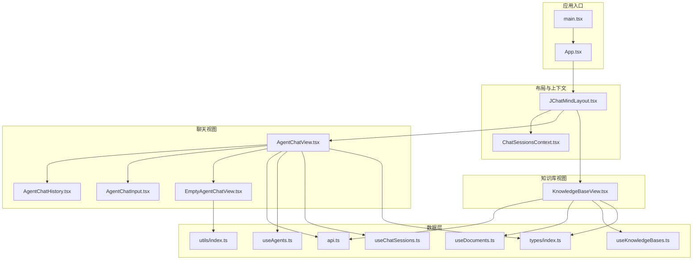
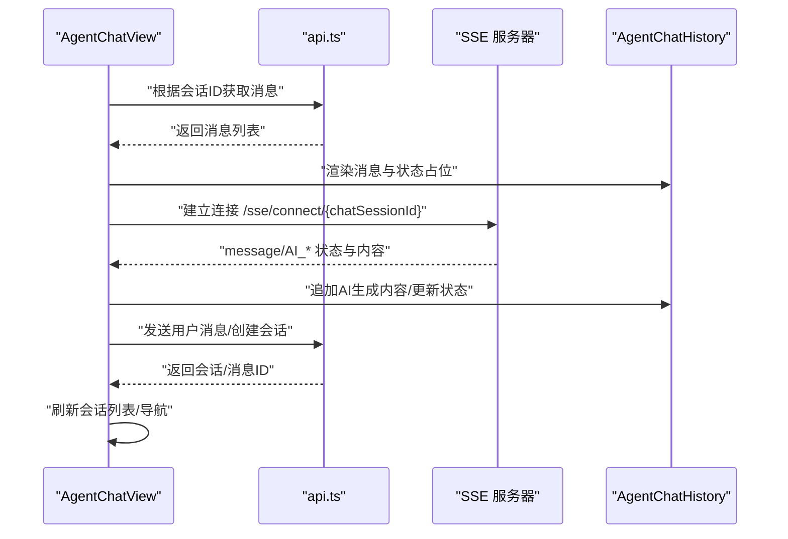
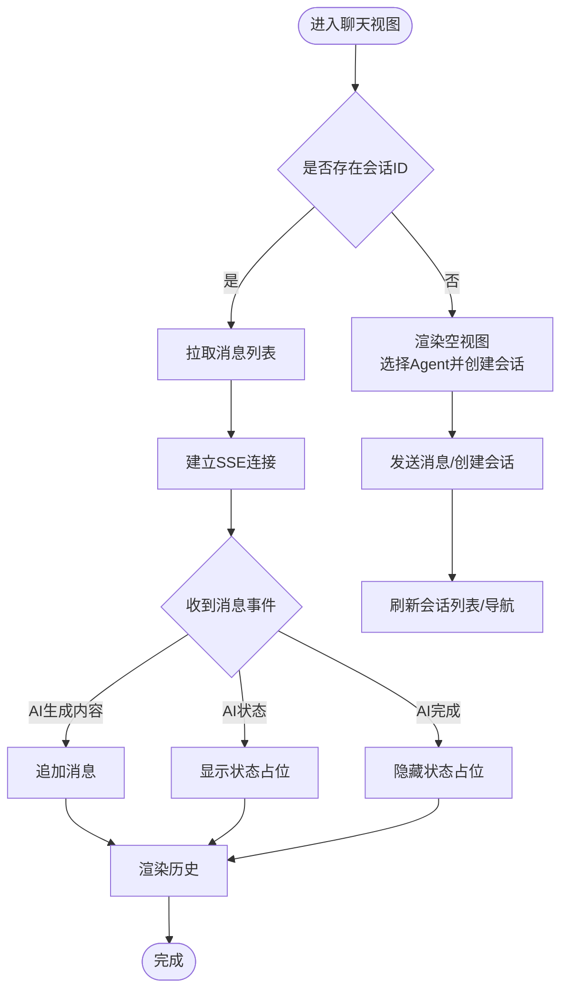
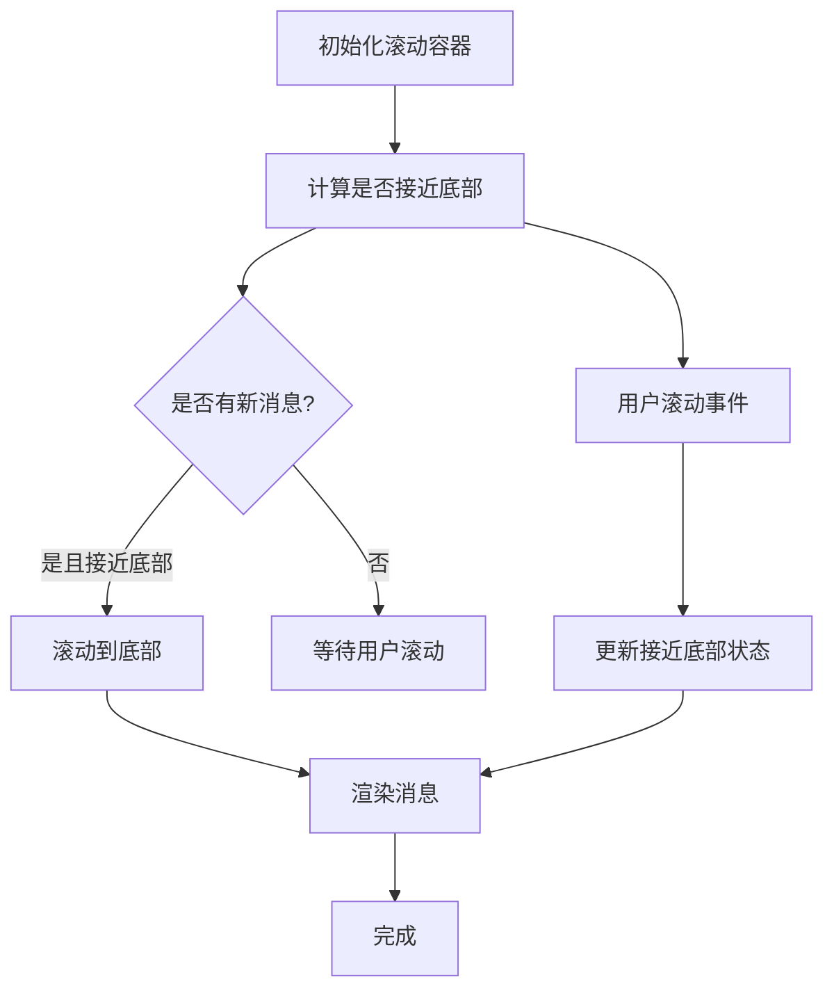
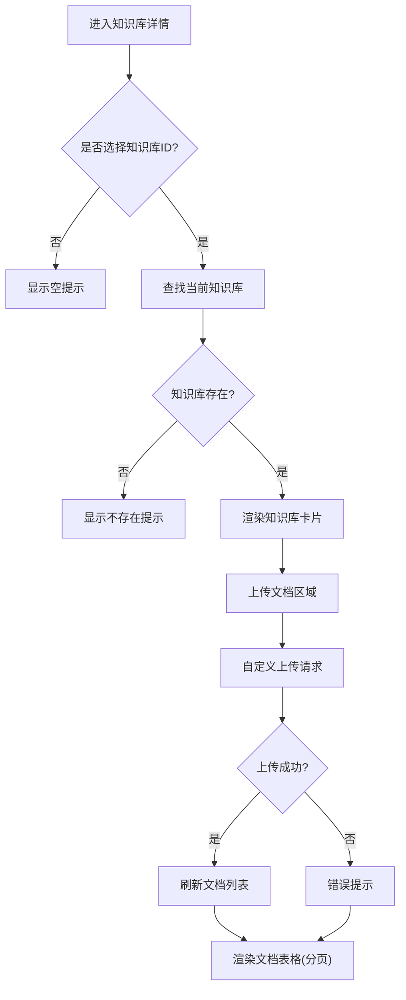
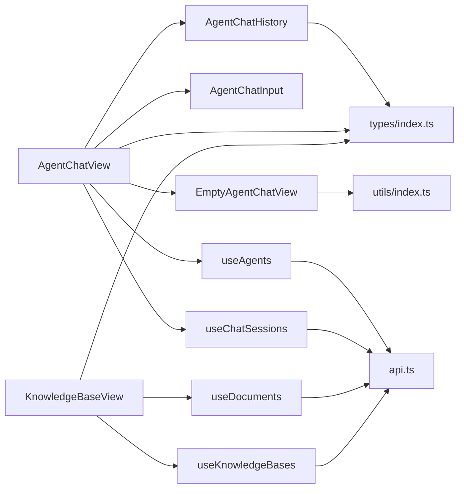

# 视图组件

<cite>
**本文引用的文件**
- [AgentChatView.tsx](file://ui/src/components/views/AgentChatView.tsx)
- [KnowledgeBaseView.tsx](file://ui/src/components/views/KnowledgeBaseView.tsx)
- [AgentChatHistory.tsx](file://ui/src/components/views/agentChatView/AgentChatHistory.tsx)
- [AgentChatInput.tsx](file://ui/src/components/views/agentChatView/AgentChatInput.tsx)
- [EmptyAgentChatView.tsx](file://ui/src/components/views/agentChatView/EmptyAgentChatView.tsx)
- [api.ts](file://ui/src/api/api.ts)
- [useAgents.ts](file://ui/src/hooks/useAgents.ts)
- [useChatSessions.ts](file://ui/src/hooks/useChatSessions.ts)
- [useDocuments.ts](file://ui/src/hooks/useDocuments.ts)
- [useKnowledgeBases.ts](file://ui/src/hooks/useKnowledgeBases.ts)
- [ChatSessionsContext.tsx](file://ui/src/contexts/ChatSessionsContext.tsx)
- [index.ts](file://ui/src/types/index.ts)
- [index.ts](file://ui/src/utils/index.ts)
- [App.tsx](file://ui/src/App.tsx)
- [main.tsx](file://ui/src/main.tsx)
- [package.json](file://ui/package.json)
</cite>

## 目录
1. [简介](#简介)
2. [项目结构](#项目结构)
3. [核心组件](#核心组件)
4. [架构总览](#架构总览)
5. [详细组件分析](#详细组件分析)
6. [依赖关系分析](#依赖关系分析)
7. [性能考虑](#性能考虑)
8. [故障排查指南](#故障排查指南)
9. [结论](#结论)
10. [附录](#附录)

## 简介
本文件聚焦 JChatMind 前端 UI 中的视图组件，系统性解析以下内容：
- AgentChatView 聊天视图：聊天界面布局、消息渲染、输入处理与 SSE 实时状态流集成
- KnowledgeBaseView 知识库视图：文档列表展示、搜索能力现状、上传管理与分页
- 状态管理模式：数据获取、缓存策略与错误处理
- 视图组件与 API 服务的集成：请求参数、响应处理与加载状态管理
- 性能优化建议：虚拟滚动、懒加载、防抖与长列表优化
- 扩展开发指南与自定义配置选项

## 项目结构
前端采用 React + TypeScript + Ant Design 生态，视图组件位于 ui/src/components/views 下，配套 API、Hooks、Context、Types 与工具函数分别组织在对应目录。

图表来源
- [App.tsx:1-16](file://ui/src/App.tsx#L1-L16)
- [main.tsx:1-11](file://ui/src/main.tsx#L1-L11)
- [AgentChatView.tsx:1-200](file://ui/src/components/views/AgentChatView.tsx#L1-L200)
- [KnowledgeBaseView.tsx:1-247](file://ui/src/components/views/KnowledgeBaseView.tsx#L1-L247)
- [AgentChatHistory.tsx:1-300](file://ui/src/components/views/agentChatView/AgentChatHistory.tsx#L1-L300)
- [AgentChatInput.tsx:1-25](file://ui/src/components/views/agentChatView/AgentChatInput.tsx#L1-L25)
- [EmptyAgentChatView.tsx:1-190](file://ui/src/components/views/agentChatView/EmptyAgentChatView.tsx#L1-L190)
- [api.ts:1-378](file://ui/src/api/api.ts#L1-L378)
- [useAgents.ts:1-55](file://ui/src/hooks/useAgents.ts#L1-L55)
- [useChatSessions.ts:1-6](file://ui/src/hooks/useChatSessions.ts#L1-L6)
- [useDocuments.ts:1-44](file://ui/src/hooks/useDocuments.ts#L1-L44)
- [useKnowledgeBases.ts:1-47](file://ui/src/hooks/useKnowledgeBases.ts#L1-L47)
- [ChatSessionsContext.tsx:1-66](file://ui/src/contexts/ChatSessionsContext.tsx#L1-L66)
- [index.ts:1-57](file://ui/src/types/index.ts#L1-L57)
- [index.ts:1-73](file://ui/src/utils/index.ts#L1-L73)

章节来源
- [App.tsx:1-16](file://ui/src/App.tsx#L1-L16)
- [main.tsx:1-11](file://ui/src/main.tsx#L1-L11)
- [package.json:1-44](file://ui/package.json#L1-L44)

## 核心组件
- AgentChatView：聊天主视图，负责路由参数解析、消息拉取、SSE 连接、消息发送与会话创建；组合 AgentChatHistory 与 AgentChatInput，并在无会话时渲染 EmptyAgentChatView
- KnowledgeBaseView：知识库详情视图，展示知识库信息、上传区域与文档列表表格，支持分页与删除确认
- AgentChatHistory：消息历史渲染，支持工具调用/响应的折叠展示、滚动行为控制与智能自动滚动
- AgentChatInput：输入组件封装，触发 onSend 回调并清空输入
- EmptyAgentChatView：空状态视图，提供 Agent 选择与快速发起会话的能力

章节来源
- [AgentChatView.tsx:17-199](file://ui/src/components/views/AgentChatView.tsx#L17-L199)
- [KnowledgeBaseView.tsx:27-246](file://ui/src/components/views/KnowledgeBaseView.tsx#L27-L246)
- [AgentChatHistory.tsx:104-299](file://ui/src/components/views/agentChatView/AgentChatHistory.tsx#L104-L299)
- [AgentChatInput.tsx:8-22](file://ui/src/components/views/agentChatView/AgentChatInput.tsx#L8-L22)
- [EmptyAgentChatView.tsx:27-189](file://ui/src/components/views/agentChatView/EmptyAgentChatView.tsx#L27-L189)

## 架构总览
视图组件通过 Hooks 与 Context 管理状态，通过 api.ts 统一访问后端接口；聊天视图通过 SSE 接收实时状态与消息片段，知识库视图通过表格与分页展示文档列表。

图表来源
- [AgentChatView.tsx:33-170](file://ui/src/components/views/AgentChatView.tsx#L33-L170)
- [AgentChatHistory.tsx:104-182](file://ui/src/components/views/agentChatView/AgentChatHistory.tsx#L104-L182)
- [api.ts:199-229](file://ui/src/api/api.ts#L199-L229)

## 详细组件分析

### AgentChatView 聊天视图
- 路由与状态
  - 读取路由参数 chatSessionId，若为空则渲染 EmptyAgentChatView
  - 通过 useAgents 与 useChatSessions 提供 Agent 列表与会话刷新能力
- 数据获取
  - 首次进入会话时，调用 getChatMessagesBySessionId 获取消息列表
  - 同步获取会话信息以确定 agentId
- 发送消息
  - 若无 chatSessionId：校验 agentId，创建会话并携带初始消息，随后导航至新会话
  - 若已有会话：根据是否为初始化消息，调用 createChatMessage 并重新拉取消息
- SSE 实时流
  - 建立 EventSource 连接，监听 message/init 事件
  - 根据消息类型更新消息列表或显示 Agent 状态占位
- 渲染
  - 有会话时渲染 AgentChatHistory 与 AgentChatInput
  - 无会话时渲染 EmptyAgentChatView

图表来源
- [AgentChatView.tsx:17-199](file://ui/src/components/views/AgentChatView.tsx#L17-L199)
- [AgentChatHistory.tsx:104-182](file://ui/src/components/views/agentChatView/AgentChatHistory.tsx#L104-L182)

章节来源
- [AgentChatView.tsx:17-199](file://ui/src/components/views/AgentChatView.tsx#L17-L199)

### AgentChatHistory 消息历史
- 消息类型渲染
  - assistant：支持工具调用列表与 Markdown 内容渲染
  - tool：工具响应，支持折叠查看原始数据
  - user/system：分别使用气泡与状态标签展示
- 滚动行为
  - 自动滚动：当新消息到达且用户接近底部时自动滚动到底部
  - 用户交互：监听滚动事件，动态判断“接近底部”状态
  - 初始化：首次渲染后延迟检查滚动位置，避免同步 setState 导致的闪烁
- 状态占位
  - 根据 SSE 类型显示“规划/思考/执行/完成”等状态标签

图表来源
- [AgentChatHistory.tsx:104-182](file://ui/src/components/views/agentChatView/AgentChatHistory.tsx#L104-L182)

章节来源
- [AgentChatHistory.tsx:104-299](file://ui/src/components/views/agentChatView/AgentChatHistory.tsx#L104-L299)

### AgentChatInput 输入组件
- 封装 @ant-design/x 的 Sender 组件
- 提交时清理输入框并回调父组件 onSend

章节来源
- [AgentChatInput.tsx:8-22](file://ui/src/components/views/agentChatView/AgentChatInput.tsx#L8-L22)

### EmptyAgentChatView 空状态视图
- Agent 选择器：基于 useAgents 提供的 Agent 列表，使用哈希映射生成固定 Emoji
- 快速创建：在输入框提交时创建会话并跳转
- 会话刷新：创建后调用 refreshChatSessions

章节来源
- [EmptyAgentChatView.tsx:27-189](file://ui/src/components/views/agentChatView/EmptyAgentChatView.tsx#L27-L189)
- [index.ts:1-73](file://ui/src/utils/index.ts#L1-L22)

### KnowledgeBaseView 知识库视图
- 知识库选择
  - 通过 useParams 获取 knowledgeBaseId，结合 useKnowledgeBases 获取知识库列表
- 文档列表
  - 使用 useDocuments 拉取文档列表，支持分页（每页 10 条）、加载状态与空态
  - 表格列包含：文件名（含图标）、类型、大小（格式化）、操作（删除确认）
- 上传管理
  - 自定义上传：校验知识库 ID，构造 FormData，调用 uploadDocument，成功后刷新列表
  - 错误处理：统一弹窗提示
- 未选择/不存在知识库
  - 提示用户从左侧列表选择或检查 ID 正确性

图表来源
- [KnowledgeBaseView.tsx:27-246](file://ui/src/components/views/KnowledgeBaseView.tsx#L27-L246)
- [useDocuments.ts:1-44](file://ui/src/hooks/useDocuments.ts#L1-L44)
- [api.ts:324-347](file://ui/src/api/api.ts#L324-L347)

章节来源
- [KnowledgeBaseView.tsx:27-246](file://ui/src/components/views/KnowledgeBaseView.tsx#L27-L246)

## 依赖关系分析
- 组件间依赖
  - AgentChatView 依赖 AgentChatHistory、AgentChatInput、EmptyAgentChatView
  - KnowledgeBaseView 依赖 useDocuments、useKnowledgeBases、api.ts
- 数据层依赖
  - useAgents/useChatSessions/useDocuments/useKnowledgeBases 封装 api.ts
  - ChatSessionsContext 提供会话列表与刷新能力
- 类型与工具
  - types/index.ts 定义消息、工具调用/响应、SSE 消息类型
  - utils/index.ts 提供 Agent/知识库 Emoji 与时间格式化

图表来源
- [AgentChatView.tsx:1-200](file://ui/src/components/views/AgentChatView.tsx#L1-L200)
- [KnowledgeBaseView.tsx:1-247](file://ui/src/components/views/KnowledgeBaseView.tsx#L1-L247)
- [AgentChatHistory.tsx:1-300](file://ui/src/components/views/agentChatView/AgentChatHistory.tsx#L1-L300)
- [AgentChatInput.tsx:1-25](file://ui/src/components/views/agentChatView/AgentChatInput.tsx#L1-L25)
- [EmptyAgentChatView.tsx:1-190](file://ui/src/components/views/agentChatView/EmptyAgentChatView.tsx#L1-L190)
- [useAgents.ts:1-55](file://ui/src/hooks/useAgents.ts#L1-L55)
- [useChatSessions.ts:1-6](file://ui/src/hooks/useChatSessions.ts#L1-L6)
- [useDocuments.ts:1-44](file://ui/src/hooks/useDocuments.ts#L1-L44)
- [useKnowledgeBases.ts:1-47](file://ui/src/hooks/useKnowledgeBases.ts#L1-L47)
- [api.ts:1-378](file://ui/src/api/api.ts#L1-L378)
- [index.ts:1-57](file://ui/src/types/index.ts#L1-L57)
- [index.ts:1-73](file://ui/src/utils/index.ts#L1-L73)

章节来源
- [AgentChatView.tsx:1-200](file://ui/src/components/views/AgentChatView.tsx#L1-L200)
- [KnowledgeBaseView.tsx:1-247](file://ui/src/components/views/KnowledgeBaseView.tsx#L1-L247)
- [api.ts:1-378](file://ui/src/api/api.ts#L1-L378)

## 性能考虑
- 虚拟滚动
  - 建议对 AgentChatHistory 的消息列表启用虚拟滚动，仅渲染可视区域内的消息项，减少 DOM 节点数量与重排开销
- 懒加载
  - 对工具响应内容的展开区域采用懒加载渲染，仅在用户点击展开时解析并渲染完整 JSON
- 防抖与节流
  - 输入框提交建议增加防抖，避免高频提交；滚动事件监听建议使用节流，降低回调频率
- 列表分页
  - 文档列表已使用分页（每页 10 条），可进一步结合虚拟滚动提升长列表体验
- 状态更新
  - 使用不可变更新策略，避免不必要的重渲染；对消息数组使用稳定 key（如消息 id）

## 故障排查指南
- SSE 连接失败
  - 检查后端 SSE 地址与会话 ID 是否正确；确认浏览器网络面板中 EventSource 请求状态
  - 在组件卸载时确保关闭连接，避免内存泄漏
- 上传失败
  - 检查知识库 ID 是否传入；确认后端上传接口返回码与消息；查看前端错误提示
- 会话创建失败
  - 确认已选择 Agent；查看后端返回的错误信息并提示用户
- 消息不显示
  - 检查 getChatMessagesBySessionId 返回的数据结构；确认 SSE 事件类型与 payload 字段

章节来源
- [AgentChatView.tsx:120-170](file://ui/src/components/views/AgentChatView.tsx#L120-L170)
- [KnowledgeBaseView.tsx:44-66](file://ui/src/components/views/KnowledgeBaseView.tsx#L44-L66)
- [api.ts:324-347](file://ui/src/api/api.ts#L324-L347)

## 结论
- AgentChatView 通过清晰的职责划分与 SSE 集成，实现了流畅的聊天体验与实时状态反馈
- KnowledgeBaseView 提供了完整的知识库管理入口，具备上传与列表展示能力
- 状态管理通过 Hooks 与 Context 解耦，API 层统一抽象，便于扩展与维护
- 建议在长列表场景引入虚拟滚动与懒加载，持续优化用户体验

## 附录
- 扩展开发指南
  - 新增聊天消息类型：在 types/index.ts 中扩展 MessageType 与 SSE 消息类型，并在 AgentChatHistory 中新增渲染逻辑
  - 自定义上传格式：在 KnowledgeBaseView 的 UploadProps.customRequest 中扩展支持的文件类型与校验规则
  - 会话列表刷新：通过 ChatSessionsContext 的 refreshChatSessions 在关键操作后统一刷新
- 自定义配置选项
  - 主题与语言：在 main.tsx 的 ConfigProvider 中设置 locale 与主题
  - 路由与导航：在 App.tsx 中配置 BrowserRouter 与布局组件

章节来源
- [index.ts:1-57](file://ui/src/types/index.ts#L1-L57)
- [main.tsx:7-11](file://ui/src/main.tsx#L7-L11)
- [App.tsx:5-13](file://ui/src/App.tsx#L5-L13)
- [ChatSessionsContext.tsx:23-53](file://ui/src/contexts/ChatSessionsContext.tsx#L23-L53)