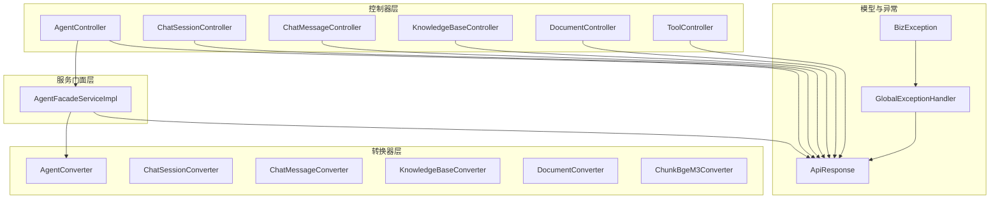
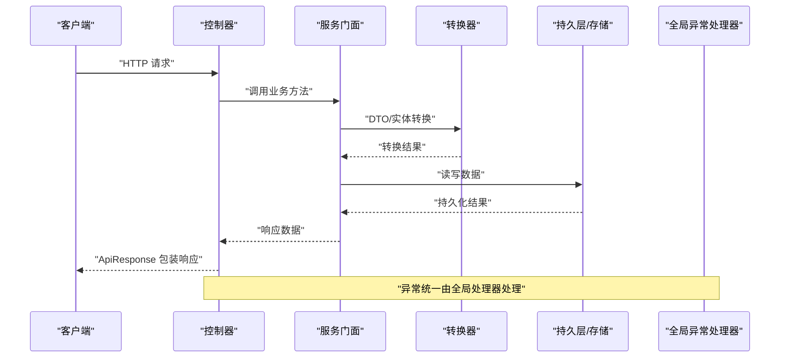
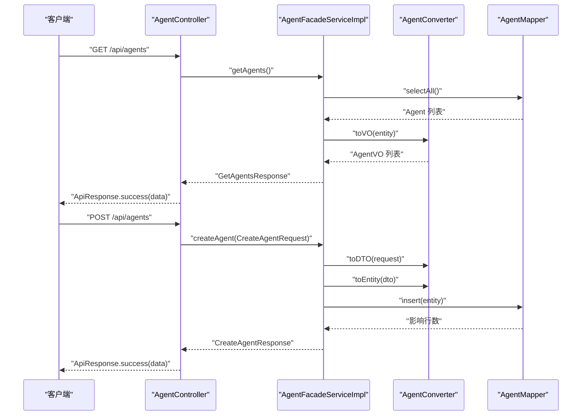
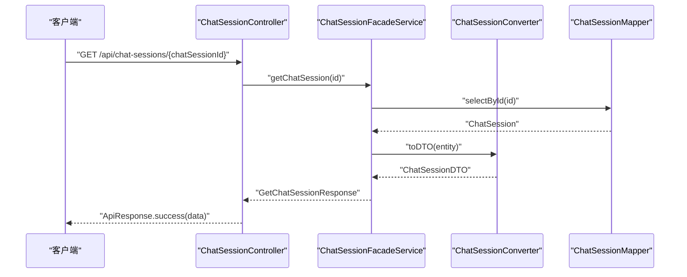
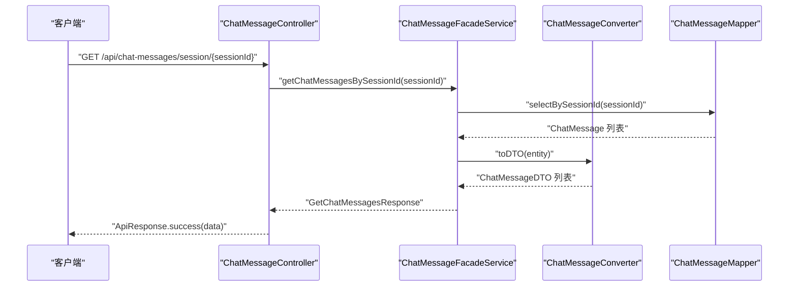
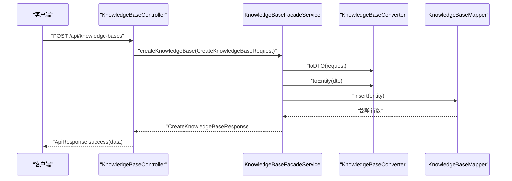
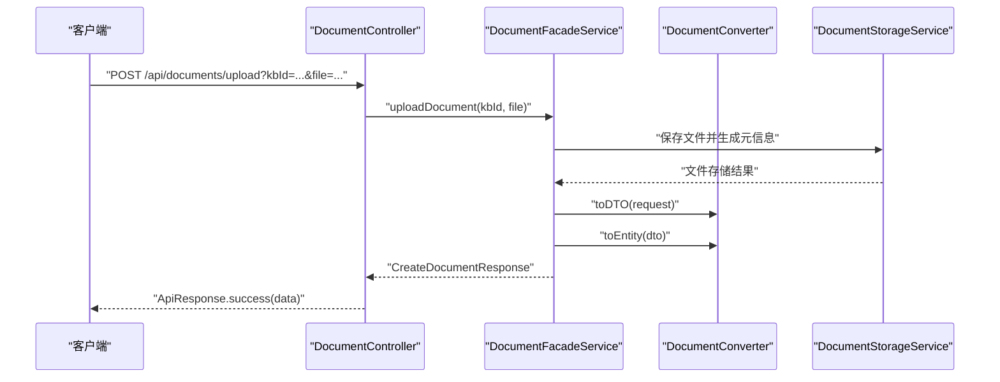
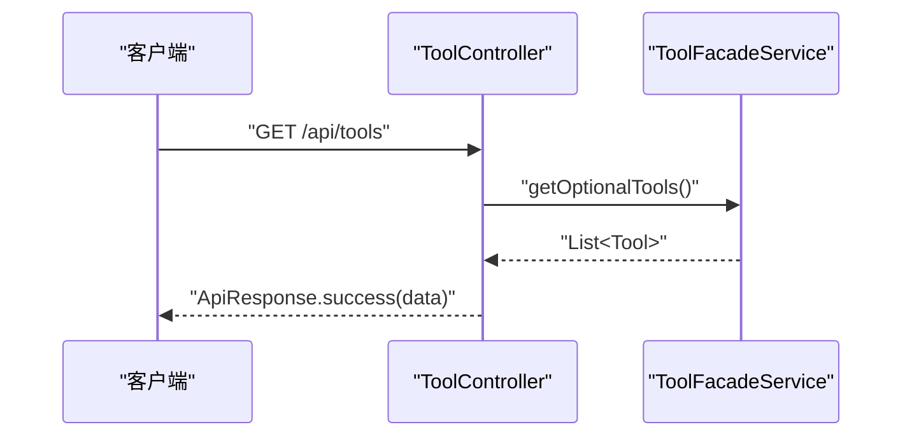
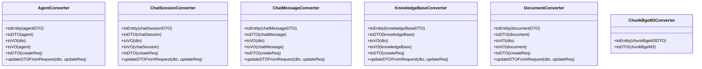
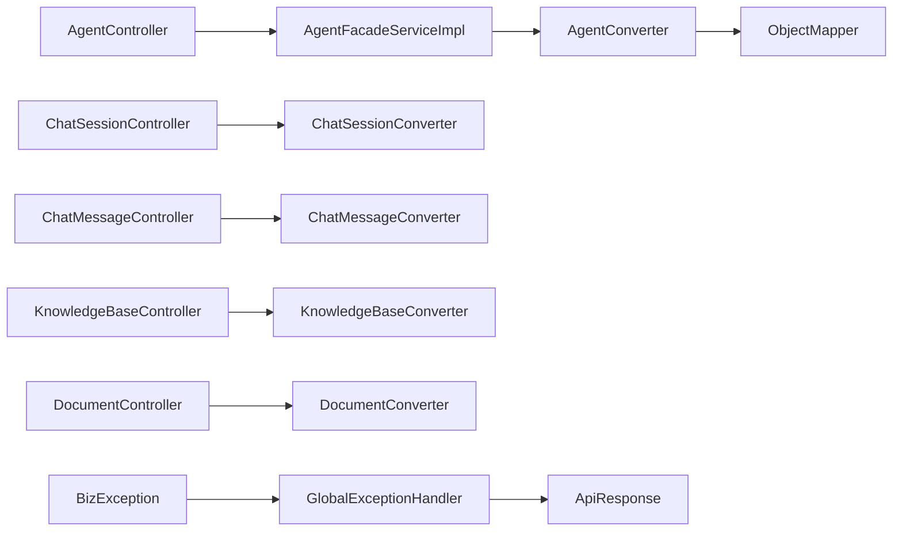

# API控制器层

<cite>
**本文引用的文件**
- [AgentController.java](file://jchatmind/src/main/java/com/kama/jchatmind/controller/AgentController.java)
- [ChatSessionController.java](file://jchatmind/src/main/java/com/kama/jchatmind/controller/ChatSessionController.java)
- [ChatMessageController.java](file://jchatmind/src/main/java/com/kama/jchatmind/controller/ChatMessageController.java)
- [KnowledgeBaseController.java](file://jchatmind/src/main/java/com/kama/jchatmind/controller/KnowledgeBaseController.java)
- [DocumentController.java](file://jchatmind/src/main/java/com/kama/jchatmind/controller/DocumentController.java)
- [ToolController.java](file://jchatmind/src/main/java/com/kama/jchatmind/controller/ToolController.java)
- [AgentConverter.java](file://jchatmind/src/main/java/com/kama/jchatmind/converter/AgentConverter.java)
- [ChatSessionConverter.java](file://jchatmind/src/main/java/com/kama/jchatmind/converter/ChatSessionConverter.java)
- [ChatMessageConverter.java](file://jchatmind/src/main/java/com/kama/jchatmind/converter/ChatMessageConverter.java)
- [KnowledgeBaseConverter.java](file://jchatmind/src/main/java/com/kama/jchatmind/converter/KnowledgeBaseConverter.java)
- [DocumentConverter.java](file://jchatmind/src/main/java/com/kama/jchatmind/converter/DocumentConverter.java)
- [ChunkBgeM3Converter.java](file://jchatmind/src/main/java/com/kama/jchatmind/converter/ChunkBgeM3Converter.java)
- [ApiResponse.java](file://jchatmind/src/main/java/com/kama/jchatmind/model/common/ApiResponse.java)
- [GlobalExceptionHandler.java](file://jchatmind/src/main/java/com/kama/jchatmind/exception/GlobalExceptionHandler.java)
- [BizException.java](file://jchatmind/src/main/java/com/kama/jchatmind/exception/BizException.java)
- [AgentFacadeServiceImpl.java](file://jchatmind/src/main/java/com/kama/jchatmind/service/impl/AgentFacadeServiceImpl.java)
</cite>

## 目录
1. [简介](#简介)
2. [项目结构](#项目结构)
3. [核心组件](#核心组件)
4. [架构总览](#架构总览)
5. [详细组件分析](#详细组件分析)
6. [依赖分析](#依赖分析)
7. [性能考虑](#性能考虑)
8. [故障排查指南](#故障排查指南)
9. [结论](#结论)
10. [附录：API端点规范与使用示例](#附录api端点规范与使用示例)

## 简介
本文件聚焦于JChatMind后端的API控制器层，系统性梳理RESTful接口设计、DTO转换器模式、参数校验、错误处理与安全控制，并提供完整端点规范与集成指南。控制器层通过统一的响应包装与全局异常处理，确保前后端交互的一致性与健壮性。

## 项目结构
控制器层位于controller包，围绕Agent、ChatSession、ChatMessage、KnowledgeBase、Document与Tool六大资源域提供REST接口；转换器层位于converter包，承担请求/响应与实体间的数据转换；统一响应封装在model.common.ApiResponse中，全局异常处理在exception包中实现。

图表来源
- [AgentController.java:1-45](file://jchatmind/src/main/java/com/kama/jchatmind/controller/AgentController.java#L1-L45)
- [ChatSessionController.java:1-58](file://jchatmind/src/main/java/com/kama/jchatmind/controller/ChatSessionController.java#L1-L58)
- [ChatMessageController.java:1-45](file://jchatmind/src/main/java/com/kama/jchatmind/controller/ChatMessageController.java#L1-L45)
- [KnowledgeBaseController.java:1-45](file://jchatmind/src/main/java/com/kama/jchatmind/controller/KnowledgeBaseController.java#L1-L45)
- [DocumentController.java:1-60](file://jchatmind/src/main/java/com/kama/jchatmind/controller/DocumentController.java#L1-L60)
- [ToolController.java:1-26](file://jchatmind/src/main/java/com/kama/jchatmind/controller/ToolController.java#L1-L26)
- [AgentFacadeServiceImpl.java:1-122](file://jchatmind/src/main/java/com/kama/jchatmind/service/impl/AgentFacadeServiceImpl.java#L1-L122)
- [AgentConverter.java:1-125](file://jchatmind/src/main/java/com/kama/jchatmind/converter/AgentConverter.java#L1-L125)
- [ApiResponse.java:1-59](file://jchatmind/src/main/java/com/kama/jchatmind/model/common/ApiResponse.java#L1-L59)
- [GlobalExceptionHandler.java:1-38](file://jchatmind/src/main/java/com/kama/jchatmind/exception/GlobalExceptionHandler.java#L1-L38)
- [BizException.java:1-15](file://jchatmind/src/main/java/com/kama/jchatmind/exception/BizException.java#L1-L15)

章节来源
- [AgentController.java:1-45](file://jchatmind/src/main/java/com/kama/jchatmind/controller/AgentController.java#L1-L45)
- [ChatSessionController.java:1-58](file://jchatmind/src/main/java/com/kama/jchatmind/controller/ChatSessionController.java#L1-L58)
- [ChatMessageController.java:1-45](file://jchatmind/src/main/java/com/kama/jchatmind/controller/ChatMessageController.java#L1-L45)
- [KnowledgeBaseController.java:1-45](file://jchatmind/src/main/java/com/kama/jchatmind/controller/KnowledgeBaseController.java#L1-L45)
- [DocumentController.java:1-60](file://jchatmind/src/main/java/com/kama/jchatmind/controller/DocumentController.java#L1-L60)
- [ToolController.java:1-26](file://jchatmind/src/main/java/com/kama/jchatmind/controller/ToolController.java#L1-L26)

## 核心组件
- 控制器层：提供REST接口，统一路径前缀/api，返回统一响应包装。
- 转换器层：负责请求/响应对象与领域对象之间的双向转换，含JSON序列化/反序列化。
- 服务门面层：聚合业务逻辑，协调转换器与持久层，抛出业务异常。
- 异常处理：全局捕获业务异常与未处理异常，标准化错误响应。

章节来源
- [AgentController.java:12-44](file://jchatmind/src/main/java/com/kama/jchatmind/controller/AgentController.java#L12-L44)
- [ChatSessionController.java:13-57](file://jchatmind/src/main/java/com/kama/jchatmind/controller/ChatSessionController.java#L13-L57)
- [ChatMessageController.java:12-44](file://jchatmind/src/main/java/com/kama/jchatmind/controller/ChatMessageController.java#L12-L44)
- [KnowledgeBaseController.java:12-44](file://jchatmind/src/main/java/com/kama/jchatmind/controller/KnowledgeBaseController.java#L12-L44)
- [DocumentController.java:13-59](file://jchatmind/src/main/java/com/kama/jchatmind/controller/DocumentController.java#L13-L59)
- [ToolController.java:13-25](file://jchatmind/src/main/java/com/kama/jchatmind/controller/ToolController.java#L13-L25)
- [AgentConverter.java:15-125](file://jchatmind/src/main/java/com/kama/jchatmind/converter/AgentConverter.java#L15-L125)
- [ChatSessionConverter.java:14-81](file://jchatmind/src/main/java/com/kama/jchatmind/converter/ChatSessionConverter.java#L14-L81)
- [ChatMessageConverter.java:14-93](file://jchatmind/src/main/java/com/kama/jchatmind/converter/ChatMessageConverter.java#L14-L93)
- [KnowledgeBaseConverter.java:14-83](file://jchatmind/src/main/java/com/kama/jchatmind/converter/KnowledgeBaseConverter.java#L14-L83)
- [DocumentConverter.java:14-95](file://jchatmind/src/main/java/com/kama/jchatmind/converter/DocumentConverter.java#L14-L95)
- [ApiResponse.java:7-59](file://jchatmind/src/main/java/com/kama/jchatmind/model/common/ApiResponse.java#L7-L59)
- [GlobalExceptionHandler.java:10-38](file://jchatmind/src/main/java/com/kama/jchatmind/exception/GlobalExceptionHandler.java#L10-L38)
- [BizException.java:5-15](file://jchatmind/src/main/java/com/kama/jchatmind/exception/BizException.java#L5-L15)

## 架构总览
控制器层通过服务门面调用转换器完成数据转换，最终访问持久层或外部能力；异常在全局处理器统一拦截，返回标准错误响应。

图表来源
- [AgentController.java:19-43](file://jchatmind/src/main/java/com/kama/jchatmind/controller/AgentController.java#L19-L43)
- [AgentFacadeServiceImpl.java:30-120](file://jchatmind/src/main/java/com/kama/jchatmind/service/impl/AgentFacadeServiceImpl.java#L30-L120)
- [AgentConverter.java:21-78](file://jchatmind/src/main/java/com/kama/jchatmind/converter/AgentConverter.java#L21-L78)
- [GlobalExceptionHandler.java:16-36](file://jchatmind/src/main/java/com/kama/jchatmind/exception/GlobalExceptionHandler.java#L16-L36)

## 详细组件分析

### AgentController 分析
- 功能职责：提供Agent的查询、创建、删除、更新接口，统一返回ApiResponse。
- 设计要点：基于路径变量与请求体的REST风格，调用AgentFacadeService执行业务逻辑。
- 参数与校验：请求体参数由Spring MVC自动校验，业务层通过断言与异常抛出进行约束。
- 错误处理：业务异常BizException交由全局异常处理器统一返回。

图表来源
- [AgentController.java:19-43](file://jchatmind/src/main/java/com/kama/jchatmind/controller/AgentController.java#L19-L43)
- [AgentFacadeServiceImpl.java:30-120](file://jchatmind/src/main/java/com/kama/jchatmind/service/impl/AgentFacadeServiceImpl.java#L30-L120)
- [AgentConverter.java:21-96](file://jchatmind/src/main/java/com/kama/jchatmind/converter/AgentConverter.java#L21-L96)

章节来源
- [AgentController.java:12-44](file://jchatmind/src/main/java/com/kama/jchatmind/controller/AgentController.java#L12-L44)
- [AgentFacadeServiceImpl.java:30-120](file://jchatmind/src/main/java/com/kama/jchatmind/service/impl/AgentFacadeServiceImpl.java#L30-L120)
- [AgentConverter.java:15-125](file://jchatmind/src/main/java/com/kama/jchatmind/converter/AgentConverter.java#L15-L125)

### ChatSessionController 分析
- 功能职责：提供会话的分页查询、详情查询、按Agent过滤查询、创建、删除、更新。
- 设计要点：多路径参数组合，支持按agentId筛选；统一返回ApiResponse。
- 参数与校验：路径参数与请求体参数分别约束；业务层进行存在性与有效性检查。

图表来源
- [ChatSessionController.java:20-30](file://jchatmind/src/main/java/com/kama/jchatmind/controller/ChatSessionController.java#L20-L30)
- [ChatSessionConverter.java:20-48](file://jchatmind/src/main/java/com/kama/jchatmind/converter/ChatSessionConverter.java#L20-L48)

章节来源
- [ChatSessionController.java:13-57](file://jchatmind/src/main/java/com/kama/jchatmind/controller/ChatSessionController.java#L13-L57)
- [ChatSessionConverter.java:14-81](file://jchatmind/src/main/java/com/kama/jchatmind/converter/ChatSessionConverter.java#L14-L81)

### ChatMessageController 分析
- 功能职责：按会话查询消息列表、创建消息、删除消息、更新消息内容与元数据。
- 设计要点：以sessionId作为关联键，支持消息角色与元数据的灵活扩展。

图表来源
- [ChatMessageController.java:19-23](file://jchatmind/src/main/java/com/kama/jchatmind/controller/ChatMessageController.java#L19-L23)
- [ChatMessageConverter.java:20-52](file://jchatmind/src/main/java/com/kama/jchatmind/converter/ChatMessageConverter.java#L20-L52)

章节来源
- [ChatMessageController.java:12-44](file://jchatmind/src/main/java/com/kama/jchatmind/controller/ChatMessageController.java#L12-L44)
- [ChatMessageConverter.java:14-93](file://jchatmind/src/main/java/com/kama/jchatmind/converter/ChatMessageConverter.java#L14-L93)

### KnowledgeBaseController 分析
- 功能职责：知识库的查询、创建、删除、更新，支持名称与描述的变更。
- 设计要点：轻量结构，便于与文档管理解耦。

图表来源
- [KnowledgeBaseController.java:25-29](file://jchatmind/src/main/java/com/kama/jchatmind/controller/KnowledgeBaseController.java#L25-L29)
- [KnowledgeBaseConverter.java:20-48](file://jchatmind/src/main/java/com/kama/jchatmind/converter/KnowledgeBaseConverter.java#L20-L48)

章节来源
- [KnowledgeBaseController.java:12-44](file://jchatmind/src/main/java/com/kama/jchatmind/controller/KnowledgeBaseController.java#L12-L44)
- [KnowledgeBaseConverter.java:14-83](file://jchatmind/src/main/java/com/kama/jchatmind/converter/KnowledgeBaseConverter.java#L14-L83)

### DocumentController 分析
- 功能职责：文档列表查询、按知识库查询、创建文档记录、上传文件并入库、删除、更新。
- 设计要点：区分“仅创建记录”与“上传文件并创建记录”，满足不同场景需求；支持multipart上传。

图表来源
- [DocumentController.java:38-44](file://jchatmind/src/main/java/com/kama/jchatmind/controller/DocumentController.java#L38-L44)
- [DocumentConverter.java:20-52](file://jchatmind/src/main/java/com/kama/jchatmind/converter/DocumentConverter.java#L20-L52)

章节来源
- [DocumentController.java:13-59](file://jchatmind/src/main/java/com/kama/jchatmind/controller/DocumentController.java#L13-L59)
- [DocumentConverter.java:14-95](file://jchatmind/src/main/java/com/kama/jchatmind/converter/DocumentConverter.java#L14-L95)

### ToolController 分析
- 功能职责：提供前端可用的工具列表，便于前端动态展示与选择。
- 设计要点：只读接口，直接返回工具枚举集合。

图表来源
- [ToolController.java:20-24](file://jchatmind/src/main/java/com/kama/jchatmind/controller/ToolController.java#L20-L24)

章节来源
- [ToolController.java:13-25](file://jchatmind/src/main/java/com/kama/jchatmind/controller/ToolController.java#L13-L25)

### DTO转换器设计模式
- 设计原则：每个转换器负责一个领域对象的双向转换，统一使用Jackson进行复杂字段的JSON序列化/反序列化。
- 典型流程：请求对象 -> DTO -> 实体；实体 -> DTO -> VO；支持从请求对象直接构造DTO，以及从请求对象增量更新DTO。
- 断言与异常：转换器对关键字段进行非空断言，避免脏数据进入持久层；异常在上层被捕获并转化为业务错误。

图表来源
- [AgentConverter.java:15-125](file://jchatmind/src/main/java/com/kama/jchatmind/converter/AgentConverter.java#L15-L125)
- [ChatSessionConverter.java:14-81](file://jchatmind/src/main/java/com/kama/jchatmind/converter/ChatSessionConverter.java#L14-L81)
- [ChatMessageConverter.java:14-93](file://jchatmind/src/main/java/com/kama/jchatmind/converter/ChatMessageConverter.java#L14-L93)
- [KnowledgeBaseConverter.java:14-83](file://jchatmind/src/main/java/com/kama/jchatmind/converter/KnowledgeBaseConverter.java#L14-L83)
- [DocumentConverter.java:14-95](file://jchatmind/src/main/java/com/kama/jchatmind/converter/DocumentConverter.java#L14-L95)
- [ChunkBgeM3Converter.java:11-51](file://jchatmind/src/main/java/com/kama/jchatmind/converter/ChunkBgeM3Converter.java#L11-L51)

章节来源
- [AgentConverter.java:15-125](file://jchatmind/src/main/java/com/kama/jchatmind/converter/AgentConverter.java#L15-L125)
- [ChatSessionConverter.java:14-81](file://jchatmind/src/main/java/com/kama/jchatmind/converter/ChatSessionConverter.java#L14-L81)
- [ChatMessageConverter.java:14-93](file://jchatmind/src/main/java/com/kama/jchatmind/converter/ChatMessageConverter.java#L14-L93)
- [KnowledgeBaseConverter.java:14-83](file://jchatmind/src/main/java/com/kama/jchatmind/converter/KnowledgeBaseConverter.java#L14-L83)
- [DocumentConverter.java:14-95](file://jchatmind/src/main/java/com/kama/jchatmind/converter/DocumentConverter.java#L14-L95)
- [ChunkBgeM3Converter.java:11-51](file://jchatmind/src/main/java/com/kama/jchatmind/converter/ChunkBgeM3Converter.java#L11-L51)

## 依赖分析
- 控制器依赖服务门面，服务门面依赖转换器与持久层。
- 转换器依赖Jackson ObjectMapper进行复杂字段序列化。
- 全局异常处理器统一拦截业务异常与未处理异常，保证响应一致性。

图表来源
- [AgentController.java:17-43](file://jchatmind/src/main/java/com/kama/jchatmind/controller/AgentController.java#L17-L43)
- [AgentFacadeServiceImpl.java:27-28](file://jchatmind/src/main/java/com/kama/jchatmind/service/impl/AgentFacadeServiceImpl.java#L27-L28)
- [AgentConverter.java:19](file://jchatmind/src/main/java/com/kama/jchatmind/converter/AgentConverter.java#L19)
- [GlobalExceptionHandler.java:16-36](file://jchatmind/src/main/java/com/kama/jchatmind/exception/GlobalExceptionHandler.java#L16-L36)
- [BizException.java:10-13](file://jchatmind/src/main/java/com/kama/jchatmind/exception/BizException.java#L10-L13)

章节来源
- [AgentController.java:17-43](file://jchatmind/src/main/java/com/kama/jchatmind/controller/AgentController.java#L17-L43)
- [AgentFacadeServiceImpl.java:27-28](file://jchatmind/src/main/java/com/kama/jchatmind/service/impl/AgentFacadeServiceImpl.java#L27-L28)
- [AgentConverter.java:19](file://jchatmind/src/main/java/com/kama/jchatmind/converter/AgentConverter.java#L19)
- [GlobalExceptionHandler.java:16-36](file://jchatmind/src/main/java/com/kama/jchatmind/exception/GlobalExceptionHandler.java#L16-L36)
- [BizException.java:10-13](file://jchatmind/src/main/java/com/kama/jchatmind/exception/BizException.java#L10-L13)

## 性能考虑
- 转换器中的JSON序列化/反序列化应避免在高频路径重复创建ObjectMapper实例，当前通过依赖注入复用实例，建议保持。
- 批量查询时优先使用分页与索引优化，减少一次性加载大量数据。
- 文件上传建议限制大小与类型，结合异步处理与进度上报，提升用户体验。

## 故障排查指南
- 常见错误
  - 400错误：请求参数缺失或非法，如必填字段为空、JSON格式错误等。
  - 404错误：资源不存在，如删除或更新不存在的ID。
  - 500错误：服务器内部错误，通常由未捕获异常导致。
- 定位步骤
  - 查看控制器是否正确接收参数并调用服务门面。
  - 检查转换器断言是否触发，确认JSON字段是否符合预期。
  - 关注全局异常处理器日志，定位具体异常类型与堆栈。
- 建议
  - 在服务门面层增加必要的边界检查与日志输出。
  - 对外暴露的异常信息尽量简洁，避免泄露敏感细节。

章节来源
- [GlobalExceptionHandler.java:16-36](file://jchatmind/src/main/java/com/kama/jchatmind/exception/GlobalExceptionHandler.java#L16-L36)
- [BizException.java:10-13](file://jchatmind/src/main/java/com/kama/jchatmind/exception/BizException.java#L10-L13)

## 结论
本控制器层采用清晰的分层架构与统一的响应包装，配合完善的转换器与异常处理机制，实现了高内聚、低耦合的REST API体系。通过一致的端点设计与严格的参数校验，提升了系统的可维护性与可扩展性。

## 附录：API端点规范与使用示例

### 统一响应格式
- 成功响应：包含状态码、消息与数据体。
- 错误响应：包含状态码与错误消息，业务异常与未知异常分别处理。

章节来源
- [ApiResponse.java:20-38](file://jchatmind/src/main/java/com/kama/jchatmind/model/common/ApiResponse.java#L20-L38)

### AgentController 端点
- GET /api/agents
  - 功能：查询所有Agent
  - 响应：GetAgentsResponse
- POST /api/agents
  - 功能：创建Agent
  - 请求体：CreateAgentRequest
  - 响应：CreateAgentResponse
- DELETE /api/agents/{agentId}
  - 功能：删除Agent
  - 路径参数：agentId
  - 响应：空数据
- PATCH /api/agents/{agentId}
  - 功能：更新Agent
  - 路径参数：agentId
  - 请求体：UpdateAgentRequest
  - 响应：空数据

章节来源
- [AgentController.java:19-43](file://jchatmind/src/main/java/com/kama/jchatmind/controller/AgentController.java#L19-L43)

### ChatSessionController 端点
- GET /api/chat-sessions
  - 功能：查询所有聊天会话
  - 响应：GetChatSessionsResponse
- GET /api/chat-sessions/{chatSessionId}
  - 功能：查询单个聊天会话
  - 路径参数：chatSessionId
  - 响应：GetChatSessionResponse
- GET /api/chat-sessions/agent/{agentId}
  - 功能：根据agentId查询会话
  - 路径参数：agentId
  - 响应：GetChatSessionsResponse
- POST /api/chat-sessions
  - 功能：创建聊天会话
  - 请求体：CreateChatSessionRequest
  - 响应：CreateChatSessionResponse
- DELETE /api/chat-sessions/{chatSessionId}
  - 功能：删除聊天会话
  - 路径参数：chatSessionId
  - 响应：空数据
- PATCH /api/chat-sessions/{chatSessionId}
  - 功能：更新聊天会话
  - 路径参数：chatSessionId
  - 请求体：UpdateChatSessionRequest
  - 响应：空数据

章节来源
- [ChatSessionController.java:20-56](file://jchatmind/src/main/java/com/kama/jchatmind/controller/ChatSessionController.java#L20-L56)

### ChatMessageController 端点
- GET /api/chat-messages/session/{sessionId}
  - 功能：根据sessionId查询消息
  - 路径参数：sessionId
  - 响应：GetChatMessagesResponse
- POST /api/chat-messages
  - 功能：创建聊天消息
  - 请求体：CreateChatMessageRequest
  - 响应：CreateChatMessageResponse
- DELETE /api/chat-messages/{chatMessageId}
  - 功能：删除聊天消息
  - 路径参数：chatMessageId
  - 响应：空数据
- PATCH /api/chat-messages/{chatMessageId}
  - 功能：更新聊天消息
  - 路径参数：chatMessageId
  - 请求体：UpdateChatMessageRequest
  - 响应：空数据

章节来源
- [ChatMessageController.java:19-43](file://jchatmind/src/main/java/com/kama/jchatmind/controller/ChatMessageController.java#L19-L43)

### KnowledgeBaseController 端点
- GET /api/knowledge-bases
  - 功能：查询所有知识库
  - 响应：GetKnowledgeBasesResponse
- POST /api/knowledge-bases
  - 功能：创建知识库
  - 请求体：CreateKnowledgeBaseRequest
  - 响应：CreateKnowledgeBaseResponse
- DELETE /api/knowledge-bases/{knowledgeBaseId}
  - 功能：删除知识库
  - 路径参数：knowledgeBaseId
  - 响应：空数据
- PATCH /api/knowledge-bases/{knowledgeBaseId}
  - 功能：更新知识库
  - 路径参数：knowledgeBaseId
  - 请求体：UpdateKnowledgeBaseRequest
  - 响应：空数据

章节来源
- [KnowledgeBaseController.java:19-43](file://jchatmind/src/main/java/com/kama/jchatmind/controller/KnowledgeBaseController.java#L19-L43)

### DocumentController 端点
- GET /api/documents
  - 功能：查询所有文档
  - 响应：GetDocumentsResponse
- GET /api/documents/kb/{kbId}
  - 功能：根据kbId查询文档
  - 路径参数：kbId
  - 响应：GetDocumentsResponse
- POST /api/documents
  - 功能：创建文档记录（不上传文件）
  - 请求体：CreateDocumentRequest
  - 响应：CreateDocumentResponse
- POST /api/documents/upload
  - 功能：上传文件并创建文档记录
  - 表单参数：kbId, file
  - 响应：CreateDocumentResponse
- DELETE /api/documents/{documentId}
  - 功能：删除文档
  - 路径参数：documentId
  - 响应：空数据
- PATCH /api/documents/{documentId}
  - 功能：更新文档
  - 路径参数：documentId
  - 请求体：UpdateDocumentRequest
  - 响应：空数据

章节来源
- [DocumentController.java:20-58](file://jchatmind/src/main/java/com/kama/jchatmind/controller/DocumentController.java#L20-L58)

### ToolController 端点
- GET /api/tools
  - 功能：获取可选工具列表
  - 响应：List<Tool>

章节来源
- [ToolController.java:20-24](file://jchatmind/src/main/java/com/kama/jchatmind/controller/ToolController.java#L20-L24)

### 参数验证与安全控制
- 参数验证
  - 控制器层：路径参数与请求体参数由Spring MVC校验；业务层通过断言与异常抛出进行二次校验。
  - 转换器层：对关键字段进行非空断言，防止脏数据进入持久层。
- 错误处理
  - 全局异常处理器捕获业务异常与未处理异常，统一返回标准错误响应。
- 安全控制
  - 当前控制器未显式声明鉴权注解，建议在网关或控制器层增加鉴权与权限校验，防止未授权访问。

章节来源
- [AgentConverter.java:21-47](file://jchatmind/src/main/java/com/kama/jchatmind/converter/AgentConverter.java#L21-L47)
- [ChatSessionConverter.java:20-36](file://jchatmind/src/main/java/com/kama/jchatmind/converter/ChatSessionConverter.java#L20-L36)
- [ChatMessageConverter.java:20-39](file://jchatmind/src/main/java/com/kama/jchatmind/converter/ChatMessageConverter.java#L20-L39)
- [KnowledgeBaseConverter.java:20-36](file://jchatmind/src/main/java/com/kama/jchatmind/converter/KnowledgeBaseConverter.java#L20-L36)
- [DocumentConverter.java:20-38](file://jchatmind/src/main/java/com/kama/jchatmind/converter/DocumentConverter.java#L20-L38)
- [GlobalExceptionHandler.java:16-36](file://jchatmind/src/main/java/com/kama/jchatmind/exception/GlobalExceptionHandler.java#L16-L36)

### 集成指南
- 前端对接
  - 统一通过/api前缀访问各控制器端点；成功响应包含data字段，错误响应包含code与message。
- 后端扩展
  - 新增控制器时，遵循统一响应包装与异常处理约定；新增转换器时，确保复杂字段的JSON序列化/反序列化正确。
- 最佳实践
  - 在服务门面层集中处理业务规则与事务；在转换器层严格校验数据完整性；在全局异常处理器中记录日志并屏蔽敏感信息。