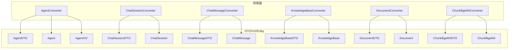
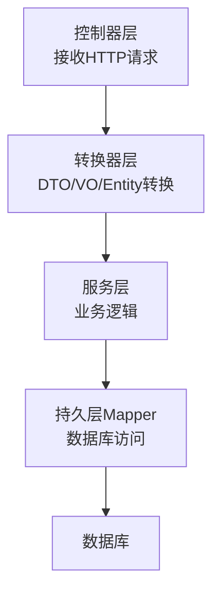
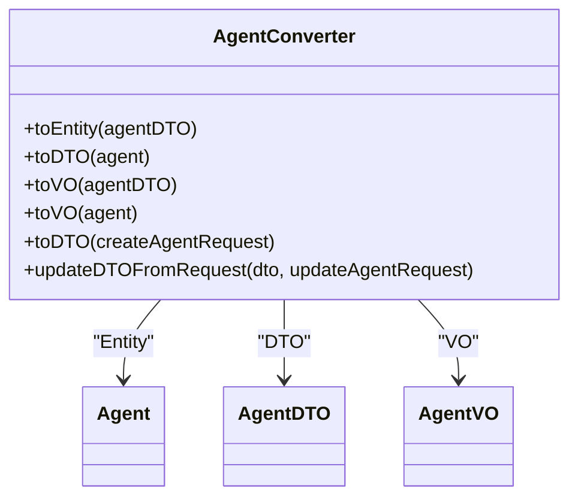
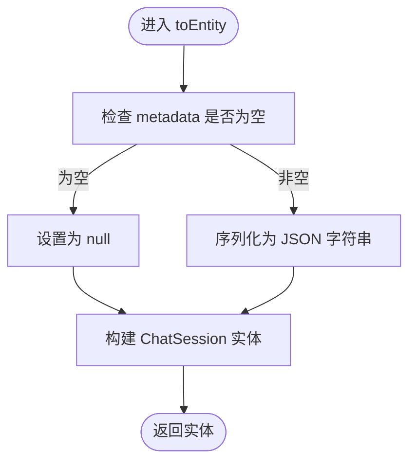
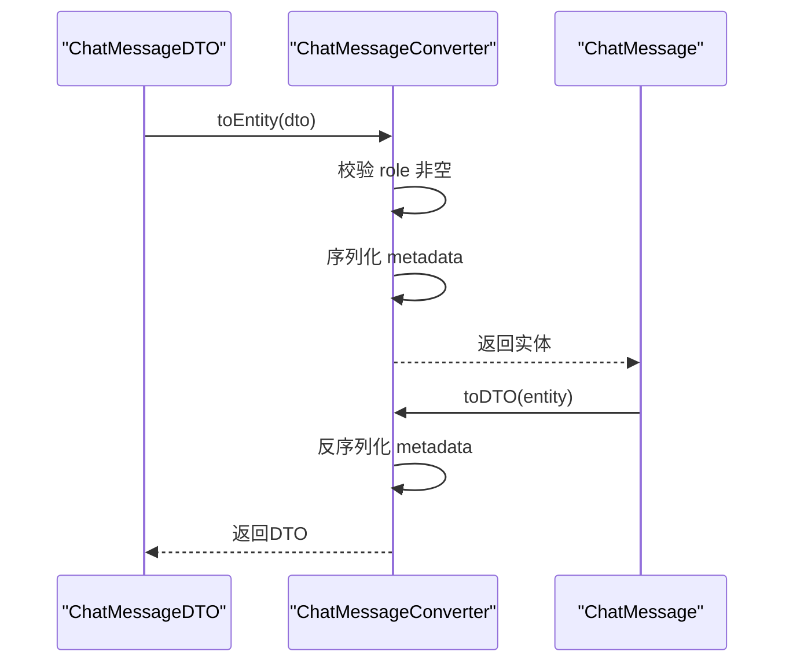
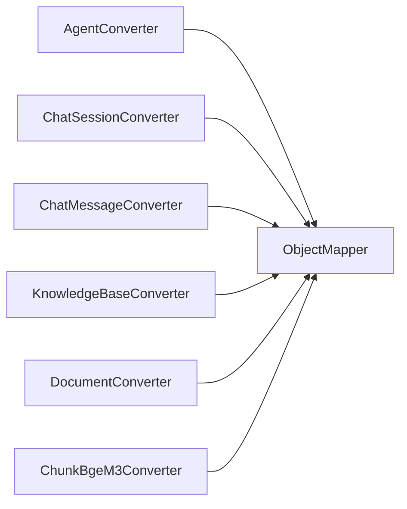

# DTO转换器模式

<cite>
**本文引用的文件**
- [AgentConverter.java](file://jchatmind/src/main/java/com/kama/jchatmind/converter/AgentConverter.java)
- [ChatSessionConverter.java](file://jchatmind/src/main/java/com/kama/jchatmind/converter/ChatSessionConverter.java)
- [ChatMessageConverter.java](file://jchatmind/src/main/java/com/kama/jchatmind/converter/ChatMessageConverter.java)
- [KnowledgeBaseConverter.java](file://jchatmind/src/main/java/com/kama/jchatmind/converter/KnowledgeBaseConverter.java)
- [DocumentConverter.java](file://jchatmind/src/main/java/com/kama/jchatmind/converter/DocumentConverter.java)
- [ChunkBgeM3Converter.java](file://jchatmind/src/main/java/com/kama/jchatmind/converter/ChunkBgeM3Converter.java)
- [AgentDTO.java](file://jchatmind/src/main/java/com/kama/jchatmind/model/dto/AgentDTO.java)
- [Agent.java](file://jchatmind/src/main/java/com/kama/jchatmind/model/entity/Agent.java)
- [CreateAgentRequest.java](file://jchatmind/src/main/java/com/kama/jchatmind/model/request/CreateAgentRequest.java)
- [AgentVO.java](file://jchatmind/src/main/java/com/kama/jchatmind/model/vo/AgentVO.java)
- [ChatSessionDTO.java](file://jchatmind/src/main/java/com/kama/jchatmind/model/dto/ChatSessionDTO.java)
- [ChatSession.java](file://jchatmind/src/main/java/com/kama/jchatmind/model/entity/ChatSession.java)
- [ChatMessageDTO.java](file://jchatmind/src/main/java/com/kama/jchatmind/model/dto/ChatMessageDTO.java)
- [ChatMessage.java](file://jchatmind/src/main/java/com/kama/jchatmind/model/entity/ChatMessage.java)
- [KnowledgeBaseDTO.java](file://jchatmind/src/main/java/com/kama/jchatmind/model/dto/KnowledgeBaseDTO.java)
- [KnowledgeBase.java](file://jchatmind/src/main/java/com/kama/jchatmind/model/entity/KnowledgeBase.java)
- [DocumentDTO.java](file://jchatmind/src/main/java/com/kama/jchatmind/model/dto/DocumentDTO.java)
- [Document.java](file://jchatmind/src/main/java/com/kama/jchatmind/model/entity/Document.java)
- [ChunkBgeM3DTO.java](file://jchatmind/src/main/java/com/kama/jchatmind/model/dto/ChunkBgeM3DTO.java)
- [ChunkBgeM3.java](file://jchatmind/src/main/java/com/kama/jchatmind/model/entity/ChunkBgeM3.java)
</cite>

## 目录
1. [引言](#引言)
2. [项目结构](#项目结构)
3. [核心组件](#核心组件)
4. [架构总览](#架构总览)
5. [详细组件分析](#详细组件分析)
6. [依赖分析](#依赖分析)
7. [性能考虑](#性能考虑)
8. [故障排查指南](#故障排查指南)
9. [结论](#结论)
10. [附录](#附录)

## 引言
本文件系统性阐述JChatMind中基于Spring组件与Jackson的DTO转换器模式，覆盖Entity到DTO、DTO到Entity的双向映射策略，以及面向不同业务实体（智能代理、会话、消息、知识库、文档、向量切片）的转换器实现。文档同时总结Lombok注解使用、Jackson序列化/反序列化在转换中的角色、自定义转换器的扩展方式、性能优化与批量处理建议、错误处理与调试技巧。

## 项目结构
转换器位于converter包，每个领域实体均配套一个转换器；DTO、Entity、VO与请求/响应类型分别位于dto、entity、vo与request子包中，便于按职责分层与职责内聚合。

图表来源
- [AgentConverter.java:1-125](file://jchatmind/src/main/java/com/kama/jchatmind/converter/AgentConverter.java#L1-L125)
- [ChatSessionConverter.java:1-81](file://jchatmind/src/main/java/com/kama/jchatmind/converter/ChatSessionConverter.java#L1-L81)
- [ChatMessageConverter.java:1-93](file://jchatmind/src/main/java/com/kama/jchatmind/converter/ChatMessageConverter.java#L1-L93)
- [KnowledgeBaseConverter.java:1-83](file://jchatmind/src/main/java/com/kama/jchatmind/converter/KnowledgeBaseConverter.java#L1-L83)
- [DocumentConverter.java:1-95](file://jchatmind/src/main/java/com/kama/jchatmind/converter/DocumentConverter.java#L1-L95)
- [ChunkBgeM3Converter.java:1-51](file://jchatmind/src/main/java/com/kama/jchatmind/converter/ChunkBgeM3Converter.java#L1-L51)
- [AgentDTO.java:1-75](file://jchatmind/src/main/java/com/kama/jchatmind/model/dto/AgentDTO.java#L1-L75)
- [Agent.java:1-95](file://jchatmind/src/main/java/com/kama/jchatmind/model/entity/Agent.java#L1-L95)
- [ChatSessionDTO.java:1-27](file://jchatmind/src/main/java/com/kama/jchatmind/model/dto/ChatSessionDTO.java#L1-L27)
- [ChatSession.java:1-73](file://jchatmind/src/main/java/com/kama/jchatmind/model/entity/ChatSession.java#L1-L73)
- [ChatMessageDTO.java:1-59](file://jchatmind/src/main/java/com/kama/jchatmind/model/dto/ChatMessageDTO.java#L1-L59)
- [ChatMessage.java:1-78](file://jchatmind/src/main/java/com/kama/jchatmind/model/entity/ChatMessage.java#L1-L78)
- [KnowledgeBaseDTO.java:1-37](file://jchatmind/src/main/java/com/kama/jchatmind/model/dto/KnowledgeBaseDTO.java#L1-L37)
- [KnowledgeBase.java:1-72](file://jchatmind/src/main/java/com/kama/jchatmind/model/entity/KnowledgeBase.java#L1-L72)
- [DocumentDTO.java:1-32](file://jchatmind/src/main/java/com/kama/jchatmind/model/dto/DocumentDTO.java#L1-L32)
- [Document.java:1-83](file://jchatmind/src/main/java/com/kama/jchatmind/model/entity/Document.java#L1-L83)
- [ChunkBgeM3DTO.java](file://jchatmind/src/main/java/com/kama/jchatmind/model/dto/ChunkBgeM3DTO.java)
- [ChunkBgeM3.java](file://jchatmind/src/main/java/com/kama/jchatmind/model/entity/ChunkBgeM3.java)

章节来源
- [AgentConverter.java:1-125](file://jchatmind/src/main/java/com/kama/jchatmind/converter/AgentConverter.java#L1-L125)
- [ChatSessionConverter.java:1-81](file://jchatmind/src/main/java/com/kama/jchatmind/converter/ChatSessionConverter.java#L1-L81)
- [ChatMessageConverter.java:1-93](file://jchatmind/src/main/java/com/kama/jchatmind/converter/ChatMessageConverter.java#L1-L93)
- [KnowledgeBaseConverter.java:1-83](file://jchatmind/src/main/java/com/kama/jchatmind/converter/KnowledgeBaseConverter.java#L1-L83)
- [DocumentConverter.java:1-95](file://jchatmind/src/main/java/com/kama/jchatmind/converter/DocumentConverter.java#L1-L95)
- [ChunkBgeM3Converter.java:1-51](file://jchatmind/src/main/java/com/kama/jchatmind/converter/ChunkBgeM3Converter.java#L1-L51)

## 核心组件
- 转换器均为Spring组件，通过构造注入ObjectMapper进行JSON序列化/反序列化，确保复杂字段（如工具列表、聊天选项、元数据等）的稳定转换。
- 每个转换器提供：
  - Entity → DTO：校验非空后构建DTO
  - DTO → Entity：校验非空后序列化复杂字段为JSON字符串
  - VO映射：提供DTO/Entity到VO的轻量视图映射
  - 请求/更新映射：从Create/Update请求构建或更新DTO
- Lombok注解广泛用于简化样板代码（Builder、Data、AllArgsConstructor），提升可读性与开发效率。

章节来源
- [AgentConverter.java:15-125](file://jchatmind/src/main/java/com/kama/jchatmind/converter/AgentConverter.java#L15-L125)
- [ChatSessionConverter.java:14-81](file://jchatmind/src/main/java/com/kama/jchatmind/converter/ChatSessionConverter.java#L14-L81)
- [ChatMessageConverter.java:14-93](file://jchatmind/src/main/java/com/kama/jchatmind/converter/ChatMessageConverter.java#L14-L93)
- [KnowledgeBaseConverter.java:14-83](file://jchatmind/src/main/java/com/kama/jchatmind/converter/KnowledgeBaseConverter.java#L14-L83)
- [DocumentConverter.java:14-95](file://jchatmind/src/main/java/com/kama/jchatmind/converter/DocumentConverter.java#L14-L95)
- [ChunkBgeM3Converter.java:11-51](file://jchatmind/src/main/java/com/kama/jchatmind/converter/ChunkBgeM3Converter.java#L11-L51)

## 架构总览
下图展示转换器在系统中的位置与交互关系：控制器接收请求，调用转换器完成DTO/VO构建，再交由服务层处理；持久层通过MyBatis Mapper访问数据库，实体与DTO之间通过转换器完成映射。

图表来源
- [AgentConverter.java:1-125](file://jchatmind/src/main/java/com/kama/jchatmind/converter/AgentConverter.java#L1-L125)
- [ChatSessionConverter.java:1-81](file://jchatmind/src/main/java/com/kama/jchatmind/converter/ChatSessionConverter.java#L1-L81)
- [ChatMessageConverter.java:1-93](file://jchatmind/src/main/java/com/kama/jchatmind/converter/ChatMessageConverter.java#L1-L93)
- [KnowledgeBaseConverter.java:1-83](file://jchatmind/src/main/java/com/kama/jchatmind/converter/KnowledgeBaseConverter.java#L1-L83)
- [DocumentConverter.java:1-95](file://jchatmind/src/main/java/com/kama/jchatmind/converter/DocumentConverter.java#L1-L95)
- [ChunkBgeM3Converter.java:1-51](file://jchatmind/src/main/java/com/kama/jchatmind/converter/ChunkBgeM3Converter.java#L1-L51)

## 详细组件分析

### AgentConverter 分析
- 双向转换要点
  - Entity → DTO：将JSON字符串字段反序列化为复杂对象，同时将模型名映射为枚举类型
  - DTO → Entity：将复杂对象序列化为JSON字符串，模型名从枚举映射回字符串
  - VO映射：直接复制必要字段，不进行JSON转换
  - 请求映射：从CreateAgentRequest构建DTO，模型名通过枚举工厂方法转换
  - 更新映射：按需更新DTO字段，避免覆盖未变更内容
- 关键实现点
  - 使用Assert进行前置校验，防止空值进入转换流程
  - 使用ObjectMapper处理allowedTools、allowedKbs、chatOptions等复杂字段
  - 提供toVO(Agent)便捷方法，复用DTO作为中间态

图表来源
- [AgentConverter.java:1-125](file://jchatmind/src/main/java/com/kama/jchatmind/converter/AgentConverter.java#L1-L125)
- [Agent.java:1-95](file://jchatmind/src/main/java/com/kama/jchatmind/model/entity/Agent.java#L1-L95)
- [AgentDTO.java:1-75](file://jchatmind/src/main/java/com/kama/jchatmind/model/dto/AgentDTO.java#L1-L75)
- [AgentVO.java:1-28](file://jchatmind/src/main/java/com/kama/jchatmind/model/vo/AgentVO.java#L1-L28)

章节来源
- [AgentConverter.java:21-123](file://jchatmind/src/main/java/com/kama/jchatmind/converter/AgentConverter.java#L21-L123)
- [AgentDTO.java:37-73](file://jchatmind/src/main/java/com/kama/jchatmind/model/dto/AgentDTO.java#L37-L73)
- [Agent.java:24-31](file://jchatmind/src/main/java/com/kama/jchatmind/model/entity/Agent.java#L24-L31)

### ChatSessionConverter 分析
- 转换策略
  - Entity → DTO：metadata为空时返回null，否则反序列化为MetaData
  - DTO → Entity：metadata为空时写入null，否则序列化为JSON字符串
  - VO映射：仅保留关键字段，便于前端展示
  - 请求映射：从CreateChatSessionRequest构建DTO，强制agentId非空
  - 更新映射：仅更新title字段

图表来源
- [ChatSessionConverter.java:20-33](file://jchatmind/src/main/java/com/kama/jchatmind/converter/ChatSessionConverter.java#L20-L33)
- [ChatSessionDTO.java:23-25](file://jchatmind/src/main/java/com/kama/jchatmind/model/dto/ChatSessionDTO.java#L23-L25)
- [ChatSession.java:20-21](file://jchatmind/src/main/java/com/kama/jchatmind/model/entity/ChatSession.java#L20-L21)

章节来源
- [ChatSessionConverter.java:20-79](file://jchatmind/src/main/java/com/kama/jchatmind/converter/ChatSessionConverter.java#L20-L79)
- [ChatSessionDTO.java:10-27](file://jchatmind/src/main/java/com/kama/jchatmind/model/dto/ChatSessionDTO.java#L10-L27)
- [ChatSession.java:13-25](file://jchatmind/src/main/java/com/kama/jchatmind/model/entity/ChatSession.java#L13-L25)

### ChatMessageConverter 分析
- 角色映射
  - RoleType枚举提供fromRole工厂方法，支持从数据库字符串恢复枚举
  - 转换器在DTO与Entity之间保持role字符串与枚举的互转
- 元数据处理
  - metadata为复杂对象，采用JSON序列化/反序列化
- 请求/更新映射
  - Create请求强制session、role非空
  - Update请求按需更新content与metadata

图表来源
- [ChatMessageConverter.java:20-52](file://jchatmind/src/main/java/com/kama/jchatmind/converter/ChatMessageConverter.java#L20-L52)
- [ChatMessageDTO.java:40-57](file://jchatmind/src/main/java/com/kama/jchatmind/model/dto/ChatMessageDTO.java#L40-L57)
- [ChatMessage.java:18-23](file://jchatmind/src/main/java/com/kama/jchatmind/model/entity/ChatMessage.java#L18-L23)

章节来源
- [ChatMessageConverter.java:20-91](file://jchatmind/src/main/java/com/kama/jchatmind/converter/ChatMessageConverter.java#L20-L91)
- [ChatMessageDTO.java:16-59](file://jchatmind/src/main/java/com/kama/jchatmind/model/dto/ChatMessageDTO.java#L16-L59)
- [ChatMessage.java:13-27](file://jchatmind/src/main/java/com/kama/jchatmind/model/entity/ChatMessage.java#L13-L27)

### KnowledgeBaseConverter 分析
- 处理逻辑
  - metadata为MetaData对象，支持版本信息等扩展字段
  - 转换器对metadata进行序列化/反序列化
  - VO映射仅传递必要字段

章节来源
- [KnowledgeBaseConverter.java:20-81](file://jchatmind/src/main/java/com/kama/jchatmind/converter/KnowledgeBaseConverter.java#L20-L81)
- [KnowledgeBaseDTO.java:10-37](file://jchatmind/src/main/java/com/kama/jchatmind/model/dto/KnowledgeBaseDTO.java#L10-L37)
- [KnowledgeBase.java:13-24](file://jchatmind/src/main/java/com/kama/jchatmind/model/entity/KnowledgeBase.java#L13-L24)

### DocumentConverter 分析
- 文档元数据
  - metadata包含文件存储路径等信息，转换器进行JSON序列化/反序列化
- 请求映射
  - Create请求强制kbId非空，便于绑定知识库

章节来源
- [DocumentConverter.java:20-93](file://jchatmind/src/main/java/com/kama/jchatmind/converter/DocumentConverter.java#L20-L93)
- [DocumentDTO.java:10-32](file://jchatmind/src/main/java/com/kama/jchatmind/model/dto/DocumentDTO.java#L10-L32)
- [Document.java:13-29](file://jchatmind/src/main/java/com/kama/jchatmind/model/entity/Document.java#L13-L29)

### ChunkBgeM3Converter 分析
- 向量切片转换
  - embedding为向量数组，直接透传；metadata进行JSON序列化/反序列化
  - 适用于RAG场景下的向量化文档片段

章节来源
- [ChunkBgeM3Converter.java:17-49](file://jchatmind/src/main/java/com/kama/jchatmind/converter/ChunkBgeM3Converter.java#L17-L49)
- [ChunkBgeM3DTO.java](file://jchatmind/src/main/java/com/kama/jchatmind/model/dto/ChunkBgeM3DTO.java)
- [ChunkBgeM3.java](file://jchatmind/src/main/java/com/kama/jchatmind/model/entity/ChunkBgeM3.java)

## 依赖分析
- 组件耦合
  - 所有转换器均依赖ObjectMapper，用于复杂字段的JSON编解码
  - 转换器之间无直接耦合，遵循单一职责原则
- 外部依赖
  - Jackson：负责复杂对象与JSON字符串之间的转换
  - Lombok：减少样板代码，提升可读性
  - Spring：通过@Component与构造注入实现依赖注入

图表来源
- [AgentConverter.java:19-19](file://jchatmind/src/main/java/com/kama/jchatmind/converter/AgentConverter.java#L19-L19)
- [ChatSessionConverter.java:18-18](file://jchatmind/src/main/java/com/kama/jchatmind/converter/ChatSessionConverter.java#L18-L18)
- [ChatMessageConverter.java:18-18](file://jchatmind/src/main/java/com/kama/jchatmind/converter/ChatMessageConverter.java#L18-L18)
- [KnowledgeBaseConverter.java:18-18](file://jchatmind/src/main/java/com/kama/jchatmind/converter/KnowledgeBaseConverter.java#L18-L18)
- [DocumentConverter.java:18-18](file://jchatmind/src/main/java/com/kama/jchatmind/converter/DocumentConverter.java#L18-L18)
- [ChunkBgeM3Converter.java:15-15](file://jchatmind/src/main/java/com/kama/jchatmind/converter/ChunkBgeM3Converter.java#L15-L15)

章节来源
- [AgentConverter.java:1-125](file://jchatmind/src/main/java/com/kama/jchatmind/converter/AgentConverter.java#L1-L125)
- [ChatSessionConverter.java:1-81](file://jchatmind/src/main/java/com/kama/jchatmind/converter/ChatSessionConverter.java#L1-L81)
- [ChatMessageConverter.java:1-93](file://jchatmind/src/main/java/com/kama/jchatmind/converter/ChatMessageConverter.java#L1-L93)
- [KnowledgeBaseConverter.java:1-83](file://jchatmind/src/main/java/com/kama/jchatmind/converter/KnowledgeBaseConverter.java#L1-L83)
- [DocumentConverter.java:1-95](file://jchatmind/src/main/java/com/kama/jchatmind/converter/DocumentConverter.java#L1-L95)
- [ChunkBgeM3Converter.java:1-51](file://jchatmind/src/main/java/com/kama/jchatmind/converter/ChunkBgeM3Converter.java#L1-L51)

## 性能考虑
- JSON编解码成本控制
  - 将复杂字段统一通过ObjectMapper处理，避免在业务层重复编解码
  - 对于高频转换场景，可考虑在转换器层引入线程安全的ObjectMapper实例（默认单例）
- 批量转换优化
  - 在服务层对集合进行批量化处理，减少多次转换开销
  - 对于大量元数据字段，优先使用流式或延迟加载策略
- 缓存策略
  - 对于只读DTO/VO，可在上层缓存热点数据，降低重复转换次数
  - 对于枚举映射（如模型名、角色），可建立本地映射表以减少查找成本
- 内存与GC
  - 避免在转换过程中产生过多临时对象，尽量复用DTO/VO
  - 控制元数据大小，避免过大的JSON字符串导致内存压力

## 故障排查指南
- 常见异常与定位
  - JsonProcessingException：通常由元数据或复杂字段JSON格式异常引起，检查DTO与Entity中对应字段的序列化/反序列化一致性
  - IllegalArgumentException：枚举映射失败（如未知模型名、无效角色），检查输入字符串是否符合枚举定义
  - NullPointerException：转换前未进行非空校验，确认转换器前置断言是否生效
- 调试技巧
  - 在转换器入口添加日志，记录输入DTO/Entity的关键字段摘要
  - 对比DTO与Entity的toString输出，快速定位字段差异
  - 单元测试覆盖边界条件（空metadata、空列表、枚举映射等）

章节来源
- [AgentConverter.java:21-61](file://jchatmind/src/main/java/com/kama/jchatmind/converter/AgentConverter.java#L21-L61)
- [ChatMessageConverter.java:20-52](file://jchatmind/src/main/java/com/kama/jchatmind/converter/ChatMessageConverter.java#L20-L52)
- [ChatSessionConverter.java:20-48](file://jchatmind/src/main/java/com/kama/jchatmind/converter/ChatSessionConverter.java#L20-L48)

## 结论
该转换器模式通过统一的JSON编解码与严格的校验机制，实现了Entity与DTO/VO之间的高可靠映射。借助Lombok与Spring组件化设计，代码简洁且易于维护。结合本文的性能与故障排查建议，可在生产环境中获得稳定的转换表现。

## 附录
- 转换器一览
  - AgentConverter：智能代理实体转换
  - ChatSessionConverter：会话数据转换
  - ChatMessageConverter：消息实体映射
  - KnowledgeBaseConverter：知识库转换
  - DocumentConverter：文档对象转换
  - ChunkBgeM3Converter：向量切片转换
- 关键实现参考路径
  - [AgentConverter.toEntity:21-40](file://jchatmind/src/main/java/com/kama/jchatmind/converter/AgentConverter.java#L21-L40)
  - [AgentConverter.toDTO:42-61](file://jchatmind/src/main/java/com/kama/jchatmind/converter/AgentConverter.java#L42-L61)
  - [ChatSessionConverter.toEntity:20-33](file://jchatmind/src/main/java/com/kama/jchatmind/converter/ChatSessionConverter.java#L20-L33)
  - [ChatMessageConverter.toDTO:37-52](file://jchatmind/src/main/java/com/kama/jchatmind/converter/ChatMessageConverter.java#L37-L52)
  - [KnowledgeBaseConverter.toEntity:20-33](file://jchatmind/src/main/java/com/kama/jchatmind/converter/KnowledgeBaseConverter.java#L20-L33)
  - [DocumentConverter.toEntity:20-35](file://jchatmind/src/main/java/com/kama/jchatmind/converter/DocumentConverter.java#L20-L35)
  - [ChunkBgeM3Converter.toEntity:17-32](file://jchatmind/src/main/java/com/kama/jchatmind/converter/ChunkBgeM3Converter.java#L17-L32)