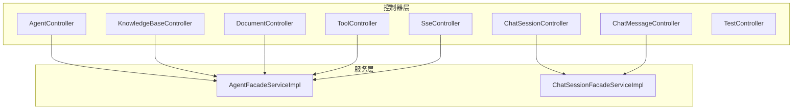
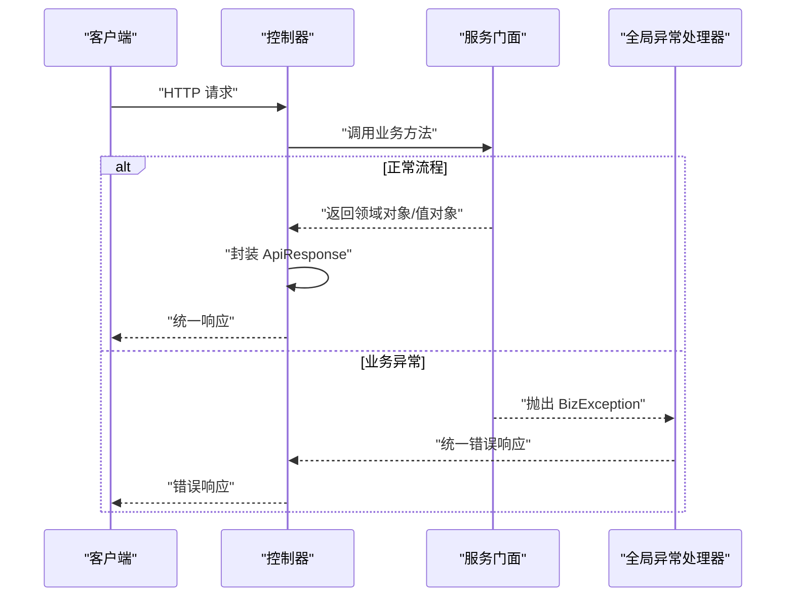
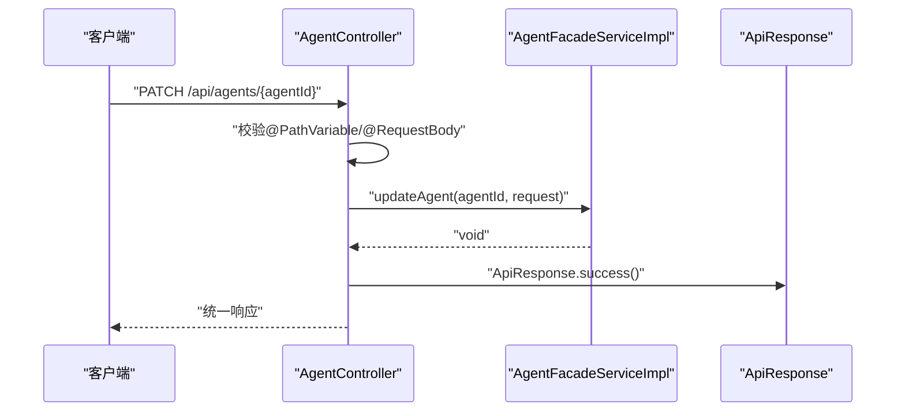
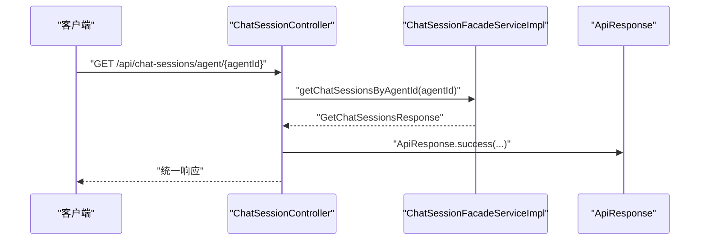
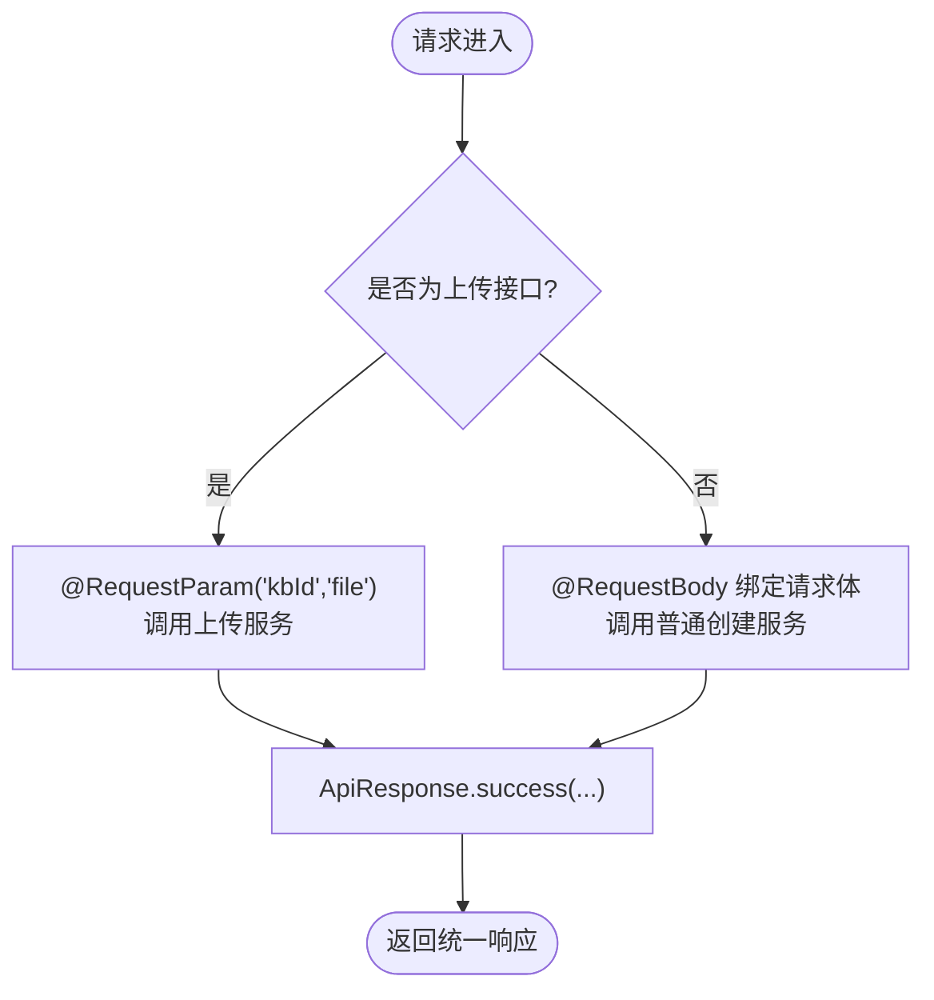

# 控制器设计模式

<cite>
**本文档引用的文件**
- [AgentController.java](file://jchatmind/src/main/java/com/kama/jchatmind/controller/AgentController.java)
- [ChatSessionController.java](file://jchatmind/src/main/java/com/kama/jchatmind/controller/ChatSessionController.java)
- [ChatMessageController.java](file://jchatmind/src/main/java/com/kama/jchatmind/controller/ChatMessageController.java)
- [KnowledgeBaseController.java](file://jchatmind/src/main/java/com/kama/jchatmind/controller/KnowledgeBaseController.java)
- [DocumentController.java](file://jchatmind/src/main/java/com/kama/jchatmind/controller/DocumentController.java)
- [ToolController.java](file://jchatmind/src/main/java/com/kama/jchatmind/controller/ToolController.java)
- [SseController.java](file://jchatmind/src/main/java/com/kama/jchatmind/controller/SseController.java)
- [TestController.java](file://jchatmind/src/main/java/com/kama/jchatmind/controller/TestController.java)
- [ApiResponse.java](file://jchatmind/src/main/java/com/kama/jchatmind/model/common/ApiResponse.java)
- [GlobalExceptionHandler.java](file://jchatmind/src/main/java/com/kama/jchatmind/exception/GlobalExceptionHandler.java)
- [BizException.java](file://jchatmind/src/main/java/com/kama/jchatmind/exception/BizException.java)
- [AgentFacadeServiceImpl.java](file://jchatmind/src/main/java/com/kama/jchatmind/service/impl/AgentFacadeServiceImpl.java)
- [ChatSessionFacadeServiceImpl.java](file://jchatmind/src/main/java/com/kama/jchatmind/service/impl/ChatSessionFacadeServiceImpl.java)
- [CreateAgentRequest.java](file://jchatmind/src/main/java/com/kama/jchatmind/model/request/CreateAgentRequest.java)
- [CreateAgentResponse.java](file://jchatmind/src/main/java/com/kama/jchatmind/model/response/CreateAgentResponse.java)
- [AgentDTO.java](file://jchatmind/src/main/java/com/kama/jchatmind/model/dto/AgentDTO.java)
- [AgentConverter.java](file://jchatmind/src/main/java/com/kama/jchatmind/converter/AgentConverter.java)
</cite>

## 目录
1. [简介](#简介)
2. [项目结构](#项目结构)
3. [核心组件](#核心组件)
4. [架构总览](#架构总览)
5. [详细组件分析](#详细组件分析)
6. [依赖关系分析](#依赖关系分析)
7. [性能考虑](#性能考虑)
8. [故障排除指南](#故障排除指南)
9. [结论](#结论)
10. [附录](#附录)

## 简介
本文件系统性阐述 JChatMind 项目中基于 Spring MVC 的控制器设计模式，重点解析 RESTful 控制器的架构与实现细节，包括：
- 控制器注解与路径映射策略（@RestController、@RequestMapping）
- HTTP 方法映射（@GetMapping、@PostMapping、@DeleteMapping、@PatchMapping）
- 路径变量处理（@PathVariable）与请求体绑定（@RequestBody）
- 文件上传场景下的参数绑定（@RequestParam、MultipartFile）
- 统一响应封装（ApiResponse）与全局异常处理（GlobalExceptionHandler）
- 各控制器的职责边界与协作关系：AgentController、ChatSessionController、ChatMessageController、KnowledgeBaseController、DocumentController、ToolController

## 项目结构
控制器层位于应用的表示层，采用按功能域分层的组织方式，每个控制器对应一个资源域并遵循 RESTful 设计原则：
- 基础路径前缀统一为 /api，便于前端统一路由与跨域配置
- SSE 专用控制器位于 /sse 路径，避免与 RESTful 资源混淆
- 控制器通过服务门面（Facade Service）与业务逻辑解耦，保持职责单一

**图表来源**
- [AgentController.java:12-44](file://jchatmind/src/main/java/com/kama/jchatmind/controller/AgentController.java#L12-L44)
- [ChatSessionController.java:13-57](file://jchatmind/src/main/java/com/kama/jchatmind/controller/ChatSessionController.java#L13-L57)
- [ChatMessageController.java:12-44](file://jchatmind/src/main/java/com/kama/jchatmind/controller/ChatMessageController.java#L12-L44)
- [KnowledgeBaseController.java:12-44](file://jchatmind/src/main/java/com/kama/jchatmind/controller/KnowledgeBaseController.java#L12-L44)
- [DocumentController.java:13-59](file://jchatmind/src/main/java/com/kama/jchatmind/controller/DocumentController.java#L13-L59)
- [ToolController.java:13-25](file://jchatmind/src/main/java/com/kama/jchatmind/controller/ToolController.java#L13-L25)
- [SseController.java:11-23](file://jchatmind/src/main/java/com/kama/jchatmind/controller/SseController.java#L11-L23)
- [AgentFacadeServiceImpl.java:23-121](file://jchatmind/src/main/java/com/kama/jchatmind/service/impl/AgentFacadeServiceImpl.java#L23-L121)
- [ChatSessionFacadeServiceImpl.java:23-155](file://jchatmind/src/main/java/com/kama/jchatmind/service/impl/ChatSessionFacadeServiceImpl.java#L23-L155)

**章节来源**
- [AgentController.java:12-44](file://jchatmind/src/main/java/com/kama/jchatmind/controller/AgentController.java#L12-L44)
- [ChatSessionController.java:13-57](file://jchatmind/src/main/java/com/kama/jchatmind/controller/ChatSessionController.java#L13-L57)
- [ChatMessageController.java:12-44](file://jchatmind/src/main/java/com/kama/jchatmind/controller/ChatMessageController.java#L12-L44)
- [KnowledgeBaseController.java:12-44](file://jchatmind/src/main/java/com/kama/jchatmind/controller/KnowledgeBaseController.java#L12-L44)
- [DocumentController.java:13-59](file://jchatmind/src/main/java/com/kama/jchatmind/controller/DocumentController.java#L13-L59)
- [ToolController.java:13-25](file://jchatmind/src/main/java/com/kama/jchatmind/controller/ToolController.java#L13-L25)
- [SseController.java:11-23](file://jchatmind/src/main/java/com/kama/jchatmind/controller/SseController.java#L11-L23)

## 核心组件
- 统一响应封装：ApiResponse 提供统一的响应结构（状态码、消息、数据），并内置成功/错误工厂方法，确保前后端契约一致。
- 全局异常处理：GlobalExceptionHandler 捕获业务异常（BizException）与 404 资源未找到异常，统一返回 ApiResponse 或标准 HTTP 状态。
- 控制器门面：各控制器仅负责参数接收、校验与响应封装，具体业务逻辑委托给对应的 Facade Service。

关键实现要点：
- 控制器均使用 @RestController 与 @RequestMapping("/api") 统一前缀，保证 RESTful 风格一致性。
- GET/POST/DELETE/PATCH 映射覆盖资源的完整 CRUD 场景；路径变量用于定位资源，请求体用于创建/更新。
- 文件上传采用 @RequestParam 与 MultipartFile，分离“创建记录”和“文件上传”的职责。

**章节来源**
- [ApiResponse.java:8-58](file://jchatmind/src/main/java/com/kama/jchatmind/model/common/ApiResponse.java#L8-L58)
- [GlobalExceptionHandler.java:10-37](file://jchatmind/src/main/java/com/kama/jchatmind/exception/GlobalExceptionHandler.java#L10-L37)
- [BizException.java:6-14](file://jchatmind/src/main/java/com/kama/jchatmind/exception/BizException.java#L6-L14)
- [AgentController.java:12-44](file://jchatmind/src/main/java/com/kama/jchatmind/controller/AgentController.java#L12-L44)
- [DocumentController.java:13-59](file://jchatmind/src/main/java/com/kama/jchatmind/controller/DocumentController.java#L13-L59)

## 架构总览
下图展示了控制器层与服务层、异常处理的整体交互关系：

**图表来源**
- [AgentController.java:19-43](file://jchatmind/src/main/java/com/kama/jchatmind/controller/AgentController.java#L19-L43)
- [ChatSessionController.java:20-56](file://jchatmind/src/main/java/com/kama/jchatmind/controller/ChatSessionController.java#L20-L56)
- [ChatMessageController.java:19-43](file://jchatmind/src/main/java/com/kama/jchatmind/controller/ChatMessageController.java#L19-L43)
- [KnowledgeBaseController.java:19-43](file://jchatmind/src/main/java/com/kama/jchatmind/controller/KnowledgeBaseController.java#L19-L43)
- [DocumentController.java:20-58](file://jchatmind/src/main/java/com/kama/jchatmind/controller/DocumentController.java#L20-L58)
- [ToolController.java:20-24](file://jchatmind/src/main/java/com/kama/jchatmind/controller/ToolController.java#L20-L24)
- [GlobalExceptionHandler.java:16-36](file://jchatmind/src/main/java/com/kama/jchatmind/exception/GlobalExceptionHandler.java#L16-L36)

## 详细组件分析

### AgentController 分析
职责：管理智能代理资源，支持查询、创建、删除、更新操作。
- 路径映射策略：
  - GET /api/agents：查询所有代理
  - POST /api/agents：创建代理
  - DELETE /api/agents/{agentId}：按 ID 删除代理
  - PATCH /api/agents/{agentId}：按 ID 更新代理
- 参数绑定：
  - @PathVariable 用于提取 agentId
  - @RequestBody 用于接收 CreateAgentRequest/UpdateAgentRequest
- 响应封装：统一使用 ApiResponse.success(...) 包裹 GetAgentsResponse/ CreateAgentResponse/Void

**图表来源**
- [AgentController.java:32-43](file://jchatmind/src/main/java/com/kama/jchatmind/controller/AgentController.java#L32-L43)
- [AgentFacadeServiceImpl.java:89-120](file://jchatmind/src/main/java/com/kama/jchatmind/service/impl/AgentFacadeServiceImpl.java#L89-L120)
- [ApiResponse.java:20-30](file://jchatmind/src/main/java/com/kama/jchatmind/model/common/ApiResponse.java#L20-L30)

**章节来源**
- [AgentController.java:19-43](file://jchatmind/src/main/java/com/kama/jchatmind/controller/AgentController.java#L19-L43)
- [AgentFacadeServiceImpl.java:30-120](file://jchatmind/src/main/java/com/kama/jchatmind/service/impl/AgentFacadeServiceImpl.java#L30-L120)
- [CreateAgentRequest.java:9-17](file://jchatmind/src/main/java/com/kama/jchatmind/model/request/CreateAgentRequest.java#L9-L17)
- [CreateAgentResponse.java:8-10](file://jchatmind/src/main/java/com/kama/jchatmind/model/response/CreateAgentResponse.java#L8-L10)

### ChatSessionController 分析
职责：管理聊天会话资源，支持多维查询、创建、删除、更新。
- 路径映射策略：
  - GET /api/chat-sessions：查询所有会话
  - GET /api/chat-sessions/{chatSessionId}：按 ID 查询
  - GET /api/chat-sessions/agent/{agentId}：按 agentId 查询
  - POST /api/chat-sessions：创建会话
  - DELETE /api/chat-sessions/{chatSessionId}：按 ID 删除
  - PATCH /api/chat-sessions/{chatSessionId}：按 ID 更新
- 参数绑定：@PathVariable 与 @RequestBody 的组合使用
- 响应封装：ApiResponse.success(...) 包裹 GetChatSessionsResponse/GetChatSessionResponse/CreateChatSessionResponse/Void

**图表来源**
- [ChatSessionController.java:32-36](file://jchatmind/src/main/java/com/kama/jchatmind/controller/ChatSessionController.java#L32-L36)
- [ChatSessionFacadeServiceImpl.java:63-78](file://jchatmind/src/main/java/com/kama/jchatmind/service/impl/ChatSessionFacadeServiceImpl.java#L63-L78)
- [ApiResponse.java:20-30](file://jchatmind/src/main/java/com/kama/jchatmind/model/common/ApiResponse.java#L20-L30)

**章节来源**
- [ChatSessionController.java:20-56](file://jchatmind/src/main/java/com/kama/jchatmind/controller/ChatSessionController.java#L20-L56)
- [ChatSessionFacadeServiceImpl.java:30-155](file://jchatmind/src/main/java/com/kama/jchatmind/service/impl/ChatSessionFacadeServiceImpl.java#L30-L155)

### ChatMessageController 分析
职责：管理聊天消息资源，支持按会话查询、创建、删除、更新。
- 路径映射策略：
  - GET /api/chat-messages/session/{sessionId}：按会话 ID 查询消息
  - POST /api/chat-messages：创建消息
  - DELETE /api/chat-messages/{chatMessageId}：按 ID 删除
  - PATCH /api/chat-messages/{chatMessageId}：按 ID 更新
- 参数绑定：@PathVariable 与 @RequestBody 的组合使用
- 响应封装：ApiResponse.success(...) 包裹 GetChatMessagesResponse/CreateChatMessageResponse/Void

**章节来源**
- [ChatMessageController.java:19-43](file://jchatmind/src/main/java/com/kama/jchatmind/controller/ChatMessageController.java#L19-L43)

### KnowledgeBaseController 分析
职责：管理知识库资源，支持查询、创建、删除、更新。
- 路径映射策略：
  - GET /api/knowledge-bases：查询所有知识库
  - POST /api/knowledge-bases：创建知识库
  - DELETE /api/knowledge-bases/{knowledgeBaseId}：按 ID 删除
  - PATCH /api/knowledge-bases/{knowledgeBaseId}：按 ID 更新
- 参数绑定：@PathVariable 与 @RequestBody 的组合使用
- 响应封装：ApiResponse.success(...) 包裹 GetKnowledgeBasesResponse/CreateKnowledgeBaseResponse/Void

**章节来源**
- [KnowledgeBaseController.java:19-43](file://jchatmind/src/main/java/com/kama/jchatmind/controller/KnowledgeBaseController.java#L19-L43)

### DocumentController 分析
职责：管理文档资源，支持查询、按知识库查询、创建记录、上传文件与更新、删除。
- 路径映射策略：
  - GET /api/documents：查询所有文档
  - GET /api/documents/kb/{kbId}：按知识库 ID 查询
  - POST /api/documents：仅创建文档记录（不上传文件）
  - POST /api/documents/upload：上传文件并创建记录
  - DELETE /api/documents/{documentId}：按 ID 删除
  - PATCH /api/documents/{documentId}：按 ID 更新
- 参数绑定：
  - @PathVariable 用于 documentId/kbId
  - @RequestBody 用于 CreateDocumentRequest/UpdateDocumentRequest
  - @RequestParam 与 MultipartFile 用于文件上传场景
- 响应封装：ApiResponse.success(...) 包裹 GetDocumentsResponse/CreateDocumentResponse/Void

**图表来源**
- [DocumentController.java:38-44](file://jchatmind/src/main/java/com/kama/jchatmind/controller/DocumentController.java#L38-L44)

**章节来源**
- [DocumentController.java:20-58](file://jchatmind/src/main/java/com/kama/jchatmind/controller/DocumentController.java#L20-L58)

### ToolController 分析
职责：向前端提供可选工具列表，便于前端动态展示与选择。
- 路径映射策略：
  - GET /api/tools：返回工具列表
- 参数绑定：无
- 响应封装：ApiResponse.success(...) 包裹工具列表

**章节来源**
- [ToolController.java:20-24](file://jchatmind/src/main/java/com/kama/jchatmind/controller/ToolController.java#L20-L24)

### SseController 与 TestController
- SseController：提供 Server-Sent Events 连接入口，路径前缀为 /sse，用于实时流式输出。
- TestController：提供健康检查与 SSE 测试接口，便于开发调试。

**章节来源**
- [SseController.java:18-22](file://jchatmind/src/main/java/com/kama/jchatmind/controller/SseController.java#L18-L22)
- [TestController.java:15-23](file://jchatmind/src/main/java/com/kama/jchatmind/controller/TestController.java#L15-L23)

## 依赖关系分析
控制器层与服务层、异常处理之间的依赖关系如下：

```mermaid
classDiagram
class AgentController {
+getAgents()
+createAgent(request)
+deleteAgent(agentId)
+updateAgent(agentId, request)
}
class ChatSessionController {
+getChatSessions()
+getChatSession(chatSessionId)
+getChatSessionsByAgentId(agentId)
+createChatSession(request)
+deleteChatSession(chatSessionId)
+updateChatSession(chatSessionId, request)
}
class ChatMessageController {
+getChatMessagesBySessionId(sessionId)
+createChatMessage(request)
+deleteChatMessage(chatMessageId)
+updateChatMessage(chatMessageId, request)
}
class KnowledgeBaseController {
+getKnowledgeBases()
+createKnowledgeBase(request)
+deleteKnowledgeBase(knowledgeBaseId)
+updateKnowledgeBase(knowledgeBaseId, request)
}
class DocumentController {
+getDocuments()
+getDocumentsByKbId(kbId)
+createDocument(request)
+uploadDocument(kbId, file)
+deleteDocument(documentId)
+updateDocument(documentId, request)
}
class ToolController {
+getOptionalTools()
}
class SseController {
+connect(chatSessionId)
}
class TestController {
+health()
+sseTest()
}
class AgentFacadeServiceImpl
class ChatSessionFacadeServiceImpl
AgentController --> AgentFacadeServiceImpl : "依赖"
ChatSessionController --> ChatSessionFacadeServiceImpl : "依赖"
ChatMessageController --> ChatSessionFacadeServiceImpl : "依赖"
KnowledgeBaseController --> AgentFacadeServiceImpl : "依赖"
DocumentController --> AgentFacadeServiceImpl : "依赖"
ToolController --> AgentFacadeServiceImpl : "依赖"
SseController --> AgentFacadeServiceImpl : "依赖"
```

**图表来源**
- [AgentController.java:17-43](file://jchatmind/src/main/java/com/kama/jchatmind/controller/AgentController.java#L17-L43)
- [ChatSessionController.java:18-56](file://jchatmind/src/main/java/com/kama/jchatmind/controller/ChatSessionController.java#L18-L56)
- [ChatMessageController.java:17-43](file://jchatmind/src/main/java/com/kama/jchatmind/controller/ChatMessageController.java#L17-L43)
- [KnowledgeBaseController.java:17-43](file://jchatmind/src/main/java/com/kama/jchatmind/controller/KnowledgeBaseController.java#L17-L43)
- [DocumentController.java:18-58](file://jchatmind/src/main/java/com/kama/jchatmind/controller/DocumentController.java#L18-L58)
- [ToolController.java:18-24](file://jchatmind/src/main/java/com/kama/jchatmind/controller/ToolController.java#L18-L24)
- [SseController.java:16-22](file://jchatmind/src/main/java/com/kama/jchatmind/controller/SseController.java#L16-L22)
- [AgentFacadeServiceImpl.java:25-121](file://jchatmind/src/main/java/com/kama/jchatmind/service/impl/AgentFacadeServiceImpl.java#L25-L121)
- [ChatSessionFacadeServiceImpl.java:25-155](file://jchatmind/src/main/java/com/kama/jchatmind/service/impl/ChatSessionFacadeServiceImpl.java#L25-L155)

**章节来源**
- [AgentController.java:17-43](file://jchatmind/src/main/java/com/kama/jchatmind/controller/AgentController.java#L17-L43)
- [ChatSessionController.java:18-56](file://jchatmind/src/main/java/com/kama/jchatmind/controller/ChatSessionController.java#L18-L56)
- [ChatMessageController.java:17-43](file://jchatmind/src/main/java/com/kama/jchatmind/controller/ChatMessageController.java#L17-L43)
- [KnowledgeBaseController.java:17-43](file://jchatmind/src/main/java/com/kama/jchatmind/controller/KnowledgeBaseController.java#L17-L43)
- [DocumentController.java:18-58](file://jchatmind/src/main/java/com/kama/jchatmind/controller/DocumentController.java#L18-L58)
- [ToolController.java:18-24](file://jchatmind/src/main/java/com/kama/jchatmind/controller/ToolController.java#L18-L24)
- [SseController.java:16-22](file://jchatmind/src/main/java/com/kama/jchatmind/controller/SseController.java#L16-L22)
- [AgentFacadeServiceImpl.java:25-121](file://jchatmind/src/main/java/com/kama/jchatmind/service/impl/AgentFacadeServiceImpl.java#L25-L121)
- [ChatSessionFacadeServiceImpl.java:25-155](file://jchatmind/src/main/java/com/kama/jchatmind/service/impl/ChatSessionFacadeServiceImpl.java#L25-L155)

## 性能考虑
- 控制器层保持无状态与轻量职责，避免在控制器内执行复杂计算或 IO 操作。
- 统一响应封装减少重复样板代码，提升可维护性。
- 异常处理集中于全局异常处理器，避免分散 try-catch 导致的性能与可读性问题。
- 对于大文件上传，建议在网关或控制器层进行大小限制与类型校验，防止内存溢出。

## 故障排除指南
- 业务异常（如资源不存在、创建失败）：抛出 BizException，由 GlobalExceptionHandler 捕获并返回 ApiResponse.error(...)，前端据此提示用户。
- 404 资源未找到：捕获 NoResourceFoundException，返回标准 404 响应。
- 未捕获异常：统一记录日志并返回通用错误信息，避免泄露内部细节。
- 参数校验失败：建议在服务层或控制器层增加参数校验（如 @Valid），并在异常处理器中统一处理。

**章节来源**
- [GlobalExceptionHandler.java:16-36](file://jchatmind/src/main/java/com/kama/jchatmind/exception/GlobalExceptionHandler.java#L16-L36)
- [BizException.java:6-14](file://jchatmind/src/main/java/com/kama/jchatmind/exception/BizException.java#L6-L14)

## 结论
本项目采用清晰的控制器设计模式，通过统一的 RESTful 路径前缀、标准化的 HTTP 方法映射与参数绑定策略，实现了高内聚、低耦合的资源管理。配合统一响应封装与全局异常处理，显著提升了系统的可维护性与用户体验。建议在后续迭代中进一步完善参数校验与限流策略，以增强系统的健壮性与安全性。

## 附录
- 最佳实践清单
  - 所有资源操作遵循 RESTful 命名规范，路径前缀统一为 /api
  - 使用 ApiResponse 统一封装响应，保持前后端契约一致
  - 控制器仅承担参数接收与响应封装职责，业务逻辑下沉至服务层
  - 对于文件上传场景，分离“创建记录”和“文件上传”，明确职责边界
  - 全局异常处理集中化，避免分散错误处理导致的维护成本