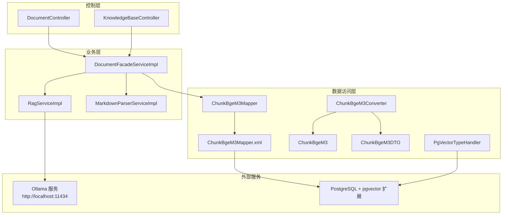
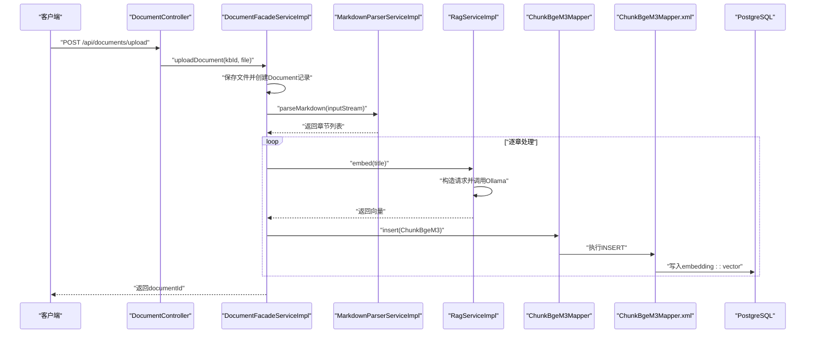
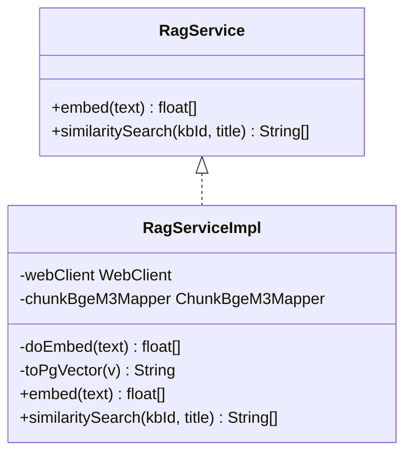
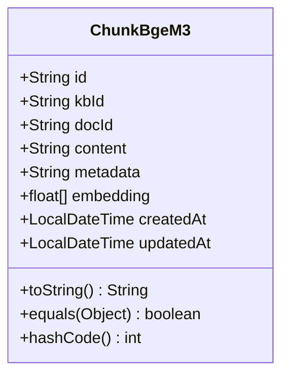
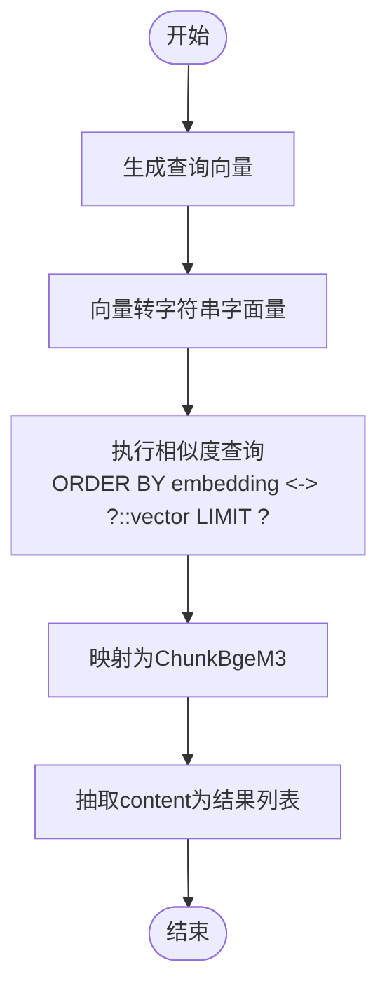
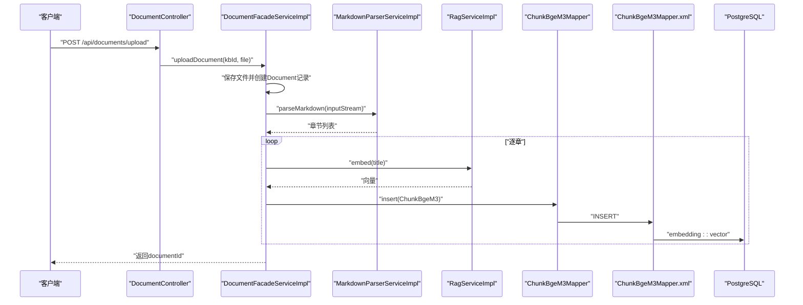
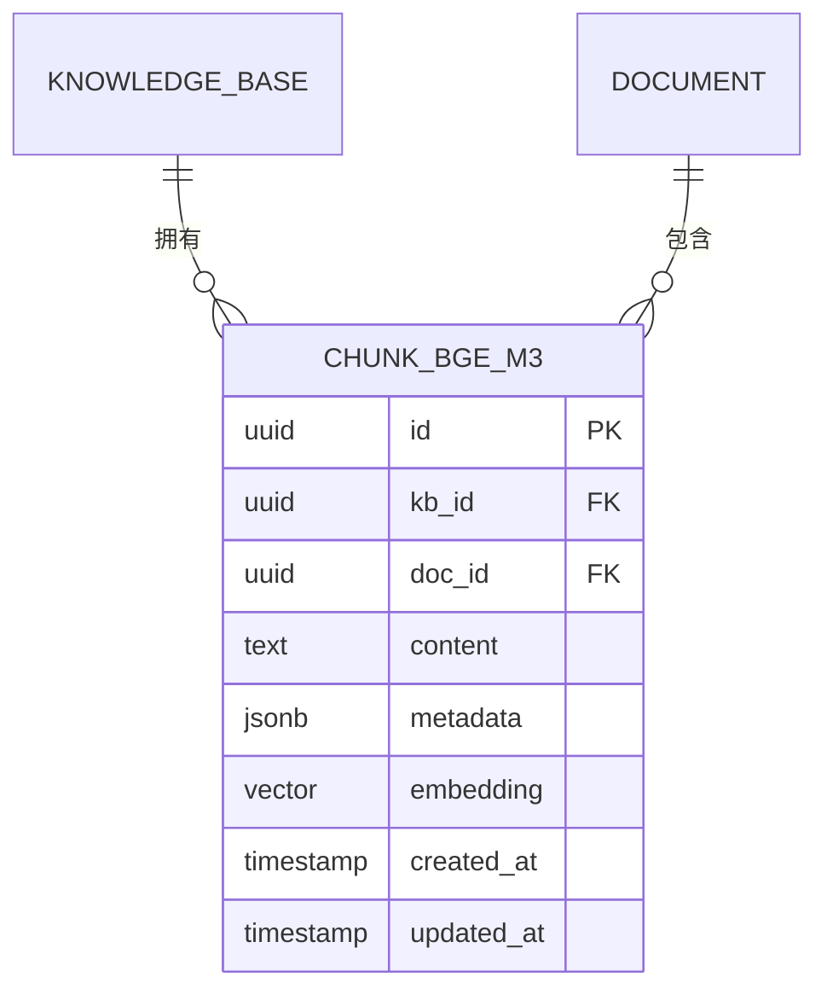
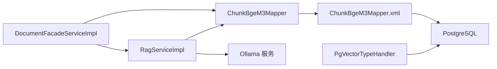

# RAG知识库服务

<cite>
**本文引用的文件**
- [RagService.java](file://jchatmind/src/main/java/com/kama/jchatmind/service/RagService.java)
- [RagServiceImpl.java](file://jchatmind/src/main/java/com/kama/jchatmind/service/impl/RagServiceImpl.java)
- [ChunkBgeM3.java](file://jchatmind/src/main/java/com/kama/jchatmind/model/entity/ChunkBgeM3.java)
- [ChunkBgeM3Mapper.java](file://jchatmind/src/main/java/com/kama/jchatmind/mapper/ChunkBgeM3Mapper.java)
- [ChunkBgeM3Mapper.xml](file://jchatmind/src/main/resources/mapper/ChunkBgeM3Mapper.xml)
- [ChunkBgeM3Converter.java](file://jchatmind/src/main/java/com/kama/jchatmind/converter/ChunkBgeM3Converter.java)
- [ChunkBgeM3DTO.java](file://jchatmind/src/main/java/com/kama/jchatmind/model/dto/ChunkBgeM3DTO.java)
- [DocumentFacadeServiceImpl.java](file://jchatmind/src/main/java/com/kama/jchatmind/service/impl/DocumentFacadeServiceImpl.java)
- [MarkdownParserServiceImpl.java](file://jchatmind/src/main/java/com/kama/jchatmind/service/impl/MarkdownParserServiceImpl.java)
- [DocumentController.java](file://jchatmind/src/main/java/com/kama/jchatmind/controller/DocumentController.java)
- [application.yaml](file://jchatmind/src/main/resources/application.yaml)
- [PgVectorTypeHandler.java](file://jchatmind/src/main/java/com/kama/jchatmind/typehandler/PgVectorTypeHandler.java)
- [jchatmind.sql](file://sql/jchatmind.sql)
</cite>

## 目录
1. [简介](#简介)
2. [项目结构](#项目结构)
3. [核心组件](#核心组件)
4. [架构总览](#架构总览)
5. [详细组件分析](#详细组件分析)
6. [依赖分析](#依赖分析)
7. [性能考虑](#性能考虑)
8. [故障排查指南](#故障排查指南)
9. [结论](#结论)
10. [附录](#附录)

## 简介
本文件面向RAG知识库服务的技术实现，围绕RagService接口与RagServiceImpl实现展开，深入解析向量嵌入生成、相似度计算与文档检索机制；详解BGE M3向量模型的应用与ChunkBgeM3实体的数据结构设计；梳理知识库构建流程（文档上传、文本分割、向量索引）；给出向量检索算法（余弦相似度与Top-K）的实现要点；覆盖数据库配置、性能优化与缓存策略，并提供API使用示例与最佳实践。

## 项目结构
RAG知识库服务位于后端模块中，采用分层架构：控制层负责HTTP接口，业务层封装文档处理与RAG流程，数据访问层通过MyBatis映射数据库表，类型处理器负责PostgreSQL向量类型转换。核心文件分布如下：
- 控制层：DocumentController、KnowledgeBaseController
- 业务层：DocumentFacadeServiceImpl、RagServiceImpl、MarkdownParserServiceImpl
- 数据模型与映射：ChunkBgeM3、ChunkBgeM3Mapper、ChunkBgeM3Mapper.xml、ChunkBgeM3Converter、ChunkBgeM3DTO
- 类型处理器：PgVectorTypeHandler
- 应用配置：application.yaml
- 数据库脚本：jchatmind.sql

图表来源
- [DocumentController.java:1-60](file://jchatmind/src/main/java/com/kama/jchatmind/controller/DocumentController.java#L1-L60)
- [DocumentFacadeServiceImpl.java:1-312](file://jchatmind/src/main/java/com/kama/jchatmind/service/impl/DocumentFacadeServiceImpl.java#L1-L312)
- [RagServiceImpl.java:1-67](file://jchatmind/src/main/java/com/kama/jchatmind/service/impl/RagServiceImpl.java#L1-L67)
- [ChunkBgeM3Mapper.xml:1-102](file://jchatmind/src/main/resources/mapper/ChunkBgeM3Mapper.xml#L1-L102)
- [ChunkBgeM3.java:1-83](file://jchatmind/src/main/java/com/kama/jchatmind/model/entity/ChunkBgeM3.java#L1-L83)
- [ChunkBgeM3Converter.java:1-51](file://jchatmind/src/main/java/com/kama/jchatmind/converter/ChunkBgeM3Converter.java#L1-L51)
- [ChunkBgeM3DTO.java:1-31](file://jchatmind/src/main/java/com/kama/jchatmind/model/dto/ChunkBgeM3DTO.java#L1-L31)
- [PgVectorTypeHandler.java:1-54](file://jchatmind/src/main/java/com/kama/jchatmind/typehandler/PgVectorTypeHandler.java#L1-L54)
- [jchatmind.sql:1-88](file://sql/jchatmind.sql#L1-L88)

章节来源
- [DocumentController.java:1-60](file://jchatmind/src/main/java/com/kama/jchatmind/controller/DocumentController.java#L1-L60)
- [DocumentFacadeServiceImpl.java:1-312](file://jchatmind/src/main/java/com/kama/jchatmind/service/impl/DocumentFacadeServiceImpl.java#L1-L312)
- [RagServiceImpl.java:1-67](file://jchatmind/src/main/java/com/kama/jchatmind/service/impl/RagServiceImpl.java#L1-L67)
- [ChunkBgeM3Mapper.xml:1-102](file://jchatmind/src/main/resources/mapper/ChunkBgeM3Mapper.xml#L1-L102)
- [jchatmind.sql:1-88](file://sql/jchatmind.sql#L1-L88)

## 核心组件
- RagService接口：定义向量嵌入与相似度检索能力
- RagServiceImpl实现：封装Ollama服务调用、向量生成、向量字符串转换与相似度检索
- ChunkBgeM3实体：承载知识库切片的标识、所属知识库与文档、内容、元数据与向量
- ChunkBgeM3Mapper与XML映射：提供切片插入、查询与基于向量索引的相似度检索
- DocumentFacadeServiceImpl：文档上传、Markdown解析、切片生成与入库
- MarkdownParserServiceImpl：Markdown文档解析，按标题分段
- PgVectorTypeHandler：float[]与PostgreSQL向量类型的双向转换
- application.yaml：数据源、MyBatis配置与文档存储基础路径

章节来源
- [RagService.java:1-10](file://jchatmind/src/main/java/com/kama/jchatmind/service/RagService.java#L1-L10)
- [RagServiceImpl.java:1-67](file://jchatmind/src/main/java/com/kama/jchatmind/service/impl/RagServiceImpl.java#L1-L67)
- [ChunkBgeM3.java:1-83](file://jchatmind/src/main/java/com/kama/jchatmind/model/entity/ChunkBgeM3.java#L1-L83)
- [ChunkBgeM3Mapper.java:1-31](file://jchatmind/src/main/java/com/kama/jchatmind/mapper/ChunkBgeM3Mapper.java#L1-L31)
- [ChunkBgeM3Mapper.xml:1-102](file://jchatmind/src/main/resources/mapper/ChunkBgeM3Mapper.xml#L1-L102)
- [DocumentFacadeServiceImpl.java:1-312](file://jchatmind/src/main/java/com/kama/jchatmind/service/impl/DocumentFacadeServiceImpl.java#L1-L312)
- [MarkdownParserServiceImpl.java:1-236](file://jchatmind/src/main/java/com/kama/jchatmind/service/impl/MarkdownParserServiceImpl.java#L1-L236)
- [PgVectorTypeHandler.java:1-54](file://jchatmind/src/main/java/com/kama/jchatmind/typehandler/PgVectorTypeHandler.java#L1-L54)
- [application.yaml:1-43](file://jchatmind/src/main/resources/application.yaml#L1-L43)

## 架构总览
RAG服务整体流程：
- 文档上传：DocumentController接收上传请求，委托DocumentFacadeServiceImpl完成文件落地与记录创建
- 文档解析：Markdown文件交由MarkdownParserServiceImpl解析为章节（标题+内容）
- 向量生成：对每个章节标题调用RagServiceImpl.embed生成向量
- 切片入库：将章节标题向量与内容写入chunk_bge_m3表
- 相似度检索：RagServiceImpl.similaritySearch对查询标题生成向量，调用ChunkBgeM3Mapper执行向量相似度排序并返回Top-K内容

图表来源
- [DocumentController.java:38-44](file://jchatmind/src/main/java/com/kama/jchatmind/controller/DocumentController.java#L38-L44)
- [DocumentFacadeServiceImpl.java:109-176](file://jchatmind/src/main/java/com/kama/jchatmind/service/impl/DocumentFacadeServiceImpl.java#L109-L176)
- [MarkdownParserServiceImpl.java:33-51](file://jchatmind/src/main/java/com/kama/jchatmind/service/impl/MarkdownParserServiceImpl.java#L33-L51)
- [RagServiceImpl.java:31-48](file://jchatmind/src/main/java/com/kama/jchatmind/service/impl/RagServiceImpl.java#L31-L48)
- [ChunkBgeM3Mapper.java:17-23](file://jchatmind/src/main/java/com/kama/jchatmind/mapper/ChunkBgeM3Mapper.java#L17-L23)
- [ChunkBgeM3Mapper.xml:24-41](file://jchatmind/src/main/resources/mapper/ChunkBgeM3Mapper.xml#L24-L41)

## 详细组件分析

### RagService接口与RagServiceImpl实现
- 接口职责
  - embed：对输入文本生成向量
  - similaritySearch：基于知识库ID与查询标题进行相似度检索，返回Top-K内容
- 实现要点
  - 通过WebClient调用本地Ollama服务的/embeddings端点，模型选择bge-m3
  - 将float[]向量转换为PostgreSQL向量字面量字符串，供SQL排序使用
  - 相似度检索使用向量距离运算符，返回指定数量的最相似片段

图表来源
- [RagService.java:5-9](file://jchatmind/src/main/java/com/kama/jchatmind/service/RagService.java#L5-L9)
- [RagServiceImpl.java:14-67](file://jchatmind/src/main/java/com/kama/jchatmind/service/impl/RagServiceImpl.java#L14-L67)

章节来源
- [RagService.java:1-10](file://jchatmind/src/main/java/com/kama/jchatmind/service/RagService.java#L1-L10)
- [RagServiceImpl.java:1-67](file://jchatmind/src/main/java/com/kama/jchatmind/service/impl/RagServiceImpl.java#L1-L67)

### ChunkBgeM3实体与数据结构设计
- 字段说明
  - id/docId/kbId/content/metadata：唯一标识、所属文档与知识库、内容与元数据
  - embedding：float[]向量，对应BGE M3的1024维
  - 时间戳：createdAt/updatedAt
- 设计考量
  - 使用float[]直接承载向量，配合PgVectorTypeHandler持久化为PostgreSQL向量类型
  - equals/hashCode基于所有字段，便于集合比较与去重

图表来源
- [ChunkBgeM3.java:14-83](file://jchatmind/src/main/java/com/kama/jchatmind/model/entity/ChunkBgeM3.java#L14-L83)

章节来源
- [ChunkBgeM3.java:1-83](file://jchatmind/src/main/java/com/kama/jchatmind/model/entity/ChunkBgeM3.java#L1-L83)

### 相似度检索算法与Top-K策略
- SQL相似度计算
  - 使用向量距离运算符“<->”，即L2距离，越小越相似
  - 通过WHERE kb_id过滤目标知识库，ORDER BY排序，LIMIT限制Top-K
- Java侧处理
  - 将float[]向量转为字符串字面量，传入SQL作为参数
  - 返回结果映射为ChunkBgeM3，抽取content组成结果列表

图表来源
- [RagServiceImpl.java:50-55](file://jchatmind/src/main/java/com/kama/jchatmind/service/impl/RagServiceImpl.java#L50-L55)
- [ChunkBgeM3Mapper.xml:85-99](file://jchatmind/src/main/resources/mapper/ChunkBgeM3Mapper.xml#L85-L99)

章节来源
- [RagServiceImpl.java:50-55](file://jchatmind/src/main/java/com/kama/jchatmind/service/impl/RagServiceImpl.java#L50-L55)
- [ChunkBgeM3Mapper.xml:85-99](file://jchatmind/src/main/resources/mapper/ChunkBgeM3Mapper.xml#L85-L99)

### 知识库构建流程（上传-解析-切片-入库）
- 文档上传
  - 控制器接收multipart文件，调用DocumentFacadeServiceImpl.uploadDocument
  - 保存文件至存储路径，更新文档记录的元数据（含文件路径）
- Markdown解析
  - 使用MarkdownParserServiceImpl解析为章节列表（标题+内容）
- 切片与向量生成
  - 对每个章节标题调用RagServiceImpl.embed生成向量
  - 构造ChunkBgeM3并插入chunk_bge_m3表
- 向量索引
  - 数据库脚本创建向量索引，提升相似度检索性能

图表来源
- [DocumentController.java:38-44](file://jchatmind/src/main/java/com/kama/jchatmind/controller/DocumentController.java#L38-L44)
- [DocumentFacadeServiceImpl.java:109-176](file://jchatmind/src/main/java/com/kama/jchatmind/service/impl/DocumentFacadeServiceImpl.java#L109-L176)
- [MarkdownParserServiceImpl.java:33-51](file://jchatmind/src/main/java/com/kama/jchatmind/service/impl/MarkdownParserServiceImpl.java#L33-L51)
- [RagServiceImpl.java:31-48](file://jchatmind/src/main/java/com/kama/jchatmind/service/impl/RagServiceImpl.java#L31-L48)
- [ChunkBgeM3Mapper.java:17-23](file://jchatmind/src/main/java/com/kama/jchatmind/mapper/ChunkBgeM3Mapper.java#L17-L23)
- [ChunkBgeM3Mapper.xml:24-41](file://jchatmind/src/main/resources/mapper/ChunkBgeM3Mapper.xml#L24-L41)

章节来源
- [DocumentController.java:1-60](file://jchatmind/src/main/java/com/kama/jchatmind/controller/DocumentController.java#L1-L60)
- [DocumentFacadeServiceImpl.java:109-266](file://jchatmind/src/main/java/com/kama/jchatmind/service/impl/DocumentFacadeServiceImpl.java#L109-L266)
- [MarkdownParserServiceImpl.java:1-236](file://jchatmind/src/main/java/com/kama/jchatmind/service/impl/MarkdownParserServiceImpl.java#L1-L236)
- [RagServiceImpl.java:1-67](file://jchatmind/src/main/java/com/kama/jchatmind/service/impl/RagServiceImpl.java#L1-L67)
- [ChunkBgeM3Mapper.java:1-31](file://jchatmind/src/main/java/com/kama/jchatmind/mapper/ChunkBgeM3Mapper.java#L1-L31)
- [ChunkBgeM3Mapper.xml:1-102](file://jchatmind/src/main/resources/mapper/ChunkBgeM3Mapper.xml#L1-L102)

### 数据模型与映射
- 实体与DTO
  - ChunkBgeM3：实体，承载向量字段
  - ChunkBgeM3DTO：传输对象，支持元数据序列化/反序列化
  - Converter：实体与DTO之间的双向转换
- MyBatis映射
  - Mapper接口声明CRUD与相似度查询
  - XML映射定义INSERT/UPDATE/SELECT与向量类型转换
- 类型处理器
  - PgVectorTypeHandler：将float[]与字符串字面量互转，适配PostgreSQL向量类型

图表来源
- [ChunkBgeM3.java:14-29](file://jchatmind/src/main/java/com/kama/jchatmind/model/entity/ChunkBgeM3.java#L14-L29)
- [ChunkBgeM3DTO.java:10-25](file://jchatmind/src/main/java/com/kama/jchatmind/model/dto/ChunkBgeM3DTO.java#L10-L25)
- [ChunkBgeM3Mapper.xml:7-16](file://jchatmind/src/main/resources/mapper/ChunkBgeM3Mapper.xml#L7-L16)
- [jchatmind.sql:68-81](file://sql/jchatmind.sql#L68-L81)

章节来源
- [ChunkBgeM3.java:1-83](file://jchatmind/src/main/java/com/kama/jchatmind/model/entity/ChunkBgeM3.java#L1-L83)
- [ChunkBgeM3DTO.java:1-31](file://jchatmind/src/main/java/com/kama/jchatmind/model/dto/ChunkBgeM3DTO.java#L1-L31)
- [ChunkBgeM3Converter.java:1-51](file://jchatmind/src/main/java/com/kama/jchatmind/converter/ChunkBgeM3Converter.java#L1-L51)
- [ChunkBgeM3Mapper.java:1-31](file://jchatmind/src/main/java/com/kama/jchatmind/mapper/ChunkBgeM3Mapper.java#L1-L31)
- [ChunkBgeM3Mapper.xml:1-102](file://jchatmind/src/main/resources/mapper/ChunkBgeM3Mapper.xml#L1-L102)
- [PgVectorTypeHandler.java:1-54](file://jchatmind/src/main/java/com/kama/jchatmind/typehandler/PgVectorTypeHandler.java#L1-L54)
- [jchatmind.sql:68-88](file://sql/jchatmind.sql#L68-L88)

## 依赖分析
- 组件耦合
  - DocumentFacadeServiceImpl依赖RagService与ChunkBgeM3Mapper，承担文档生命周期与RAG数据准备
  - RagServiceImpl依赖WebClient与ChunkBgeM3Mapper，负责向量生成与检索
  - ChunkBgeM3Mapper通过XML映射与PostgreSQL交互，类型处理器贯穿向量序列化
- 外部依赖
  - Ollama服务：提供bge-m3模型的嵌入能力
  - PostgreSQL + pgvector扩展：存储向量并提供向量索引与相似度运算
- 潜在循环依赖
  - 当前未发现循环依赖，各层职责清晰

图表来源
- [DocumentFacadeServiceImpl.java:36-44](file://jchatmind/src/main/java/com/kama/jchatmind/service/impl/DocumentFacadeServiceImpl.java#L36-L44)
- [RagServiceImpl.java:18-24](file://jchatmind/src/main/java/com/kama/jchatmind/service/impl/RagServiceImpl.java#L18-L24)
- [ChunkBgeM3Mapper.java:1-31](file://jchatmind/src/main/java/com/kama/jchatmind/mapper/ChunkBgeM3Mapper.java#L1-L31)
- [ChunkBgeM3Mapper.xml:1-102](file://jchatmind/src/main/resources/mapper/ChunkBgeM3Mapper.xml#L1-L102)
- [PgVectorTypeHandler.java:1-54](file://jchatmind/src/main/java/com/kama/jchatmind/typehandler/PgVectorTypeHandler.java#L1-L54)

章节来源
- [DocumentFacadeServiceImpl.java:1-312](file://jchatmind/src/main/java/com/kama/jchatmind/service/impl/DocumentFacadeServiceImpl.java#L1-L312)
- [RagServiceImpl.java:1-67](file://jchatmind/src/main/java/com/kama/jchatmind/service/impl/RagServiceImpl.java#L1-L67)
- [ChunkBgeM3Mapper.java:1-31](file://jchatmind/src/main/java/com/kama/jchatmind/mapper/ChunkBgeM3Mapper.java#L1-L31)
- [ChunkBgeM3Mapper.xml:1-102](file://jchatmind/src/main/resources/mapper/ChunkBgeM3Mapper.xml#L1-L102)
- [PgVectorTypeHandler.java:1-54](file://jchatmind/src/main/java/com/kama/jchatmind/typehandler/PgVectorTypeHandler.java#L1-L54)

## 性能考虑
- 向量索引
  - 数据库脚本创建IVFFLAT索引，lists参数可调优吞吐与精度平衡
- 相似度计算
  - 使用L2距离，适合BGE M3输出的已归一化向量；若需余弦相似度，可在应用层将向量归一化后再用点积或调整SQL
- 并发与批处理
  - Markdown解析与向量生成建议批量处理，减少网络往返
- 缓存策略
  - 可引入Redis缓存常用查询向量与Top-K结果，降低重复检索开销
- 存储与I/O
  - 文档存储路径在配置中设置，建议使用高性能文件系统或对象存储

章节来源
- [jchatmind.sql:83-87](file://sql/jchatmind.sql#L83-L87)
- [application.yaml:40-43](file://jchatmind/src/main/resources/application.yaml#L40-L43)
- [RagServiceImpl.java:50-55](file://jchatmind/src/main/java/com/kama/jchatmind/service/impl/RagServiceImpl.java#L50-L55)

## 故障排查指南
- 向量生成失败
  - 检查Ollama服务是否启动且监听端口可用
  - 确认模型名称与请求体字段一致
- 相似度检索无结果
  - 核对kbId是否正确、是否存在匹配记录
  - 检查向量索引是否创建成功
- 数据库写入异常
  - 确认pgvector扩展已安装、向量维度匹配
  - 检查类型处理器是否生效
- 文档上传失败
  - 检查文件权限与存储路径
  - 关注Markdown解析异常日志

章节来源
- [RagServiceImpl.java:21-48](file://jchatmind/src/main/java/com/kama/jchatmind/service/impl/RagServiceImpl.java#L21-L48)
- [ChunkBgeM3Mapper.xml:34-40](file://jchatmind/src/main/resources/mapper/ChunkBgeM3Mapper.xml#L34-L40)
- [jchatmind.sql:1-1](file://sql/jchatmind.sql#L1-L1)
- [DocumentFacadeServiceImpl.java:172-176](file://jchatmind/src/main/java/com/kama/jchatmind/service/impl/DocumentFacadeServiceImpl.java#L172-L176)

## 结论
本RAG知识库服务以简洁的分层架构实现了从文档上传到向量检索的完整链路。通过BGE M3模型生成1024维向量，结合PostgreSQL向量索引与相似度运算，快速实现知识库内容的语义检索。建议在生产环境中进一步完善缓存、并发与监控体系，持续优化索引参数与检索策略。

## 附录

### API使用示例与最佳实践
- 文档上传
  - 请求：POST /api/documents/upload，参数：kbId、file
  - 响应：documentId
  - 最佳实践：仅上传Markdown文件以获得结构化章节；上传后等待解析完成再发起检索
- 相似度检索
  - 请求：POST /api/documents/upload 后，调用RagService.similaritySearch(kbId, queryTitle)
  - 响应：Top-K内容列表
  - 最佳实践：查询标题尽量贴近原文档章节标题，提升召回质量

章节来源
- [DocumentController.java:38-44](file://jchatmind/src/main/java/com/kama/jchatmind/controller/DocumentController.java#L38-L44)
- [RagService.java:6-8](file://jchatmind/src/main/java/com/kama/jchatmind/service/RagService.java#L6-L8)
- [RagServiceImpl.java:50-55](file://jchatmind/src/main/java/com/kama/jchatmind/service/impl/RagServiceImpl.java#L50-L55)