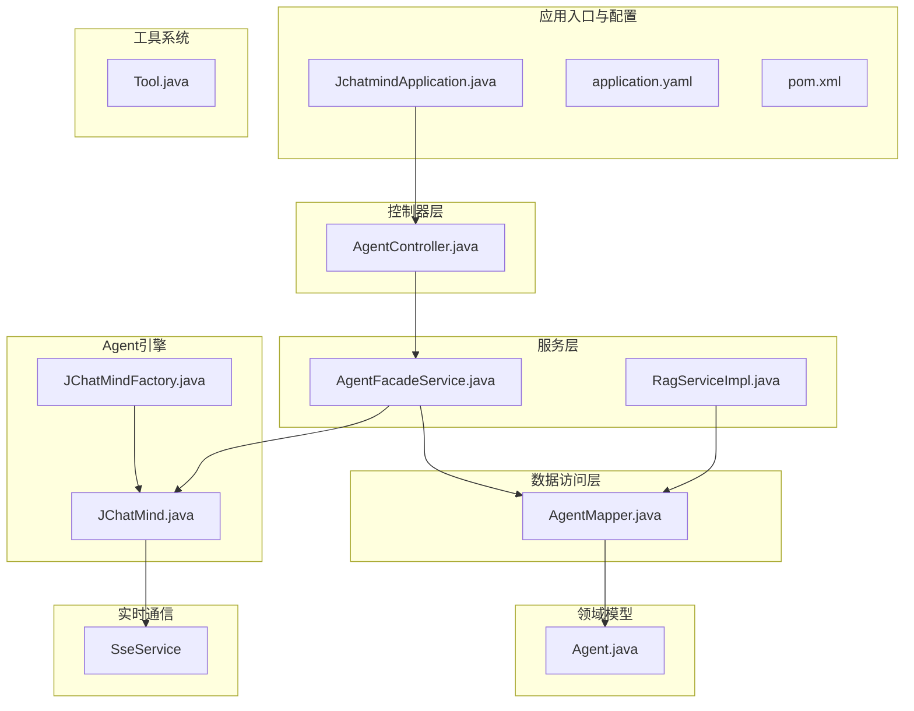
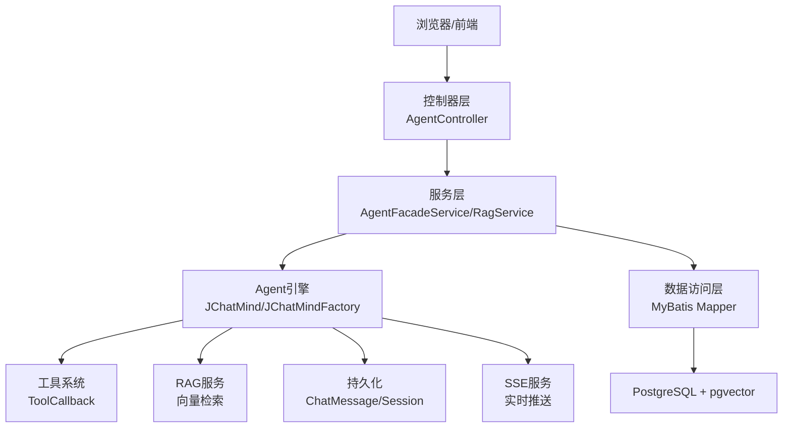
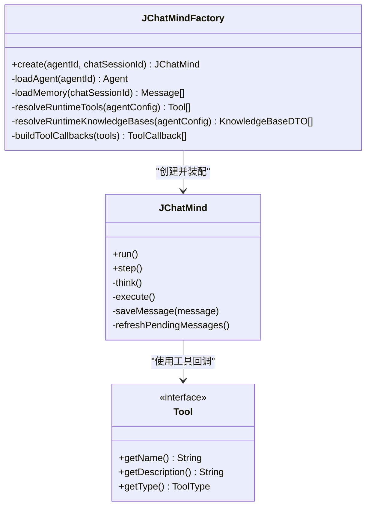
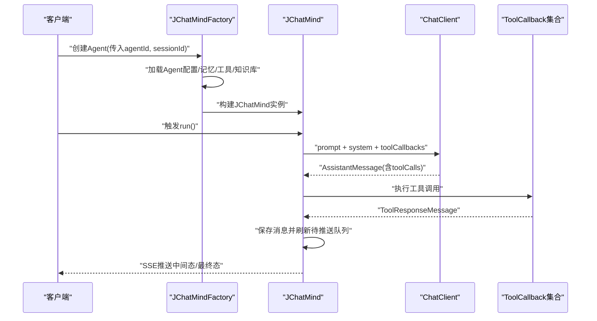
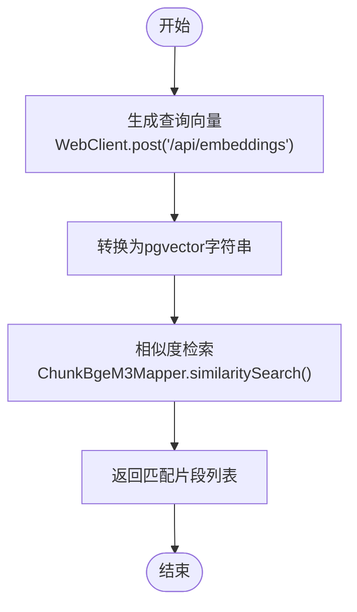
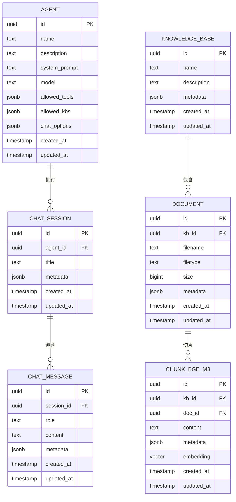
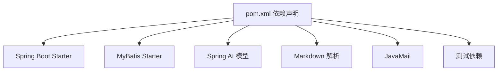

# 后端开发指南

<cite>
**本文档引用的文件**
- [JchatmindApplication.java](file://jchatmind/src/main/java/com/kama/jchatmind/JchatmindApplication.java)
- [pom.xml](file://jchatmind/pom.xml)
- [application.yaml](file://jchatmind/src/main/resources/application.yaml)
- [README.md](file://README.md)
- [jchatmind.sql](file://sql/jchatmind.sql)
- [JChatMind.java](file://jchatmind/src/main/java/com/kama/jchatmind/agent/JChatMind.java)
- [JChatMindFactory.java](file://jchatmind/src/main/java/com/kama/jchatmind/agent/JChatMindFactory.java)
- [Tool.java](file://jchatmind/src/main/java/com/kama/jchatmind/agent/tools/Tool.java)
- [RagServiceImpl.java](file://jchatmind/src/main/java/com/kama/jchatmind/service/impl/RagServiceImpl.java)
- [AgentController.java](file://jchatmind/src/main/java/com/kama/jchatmind/controller/AgentController.java)
- [AgentFacadeService.java](file://jchatmind/src/main/java/com/kama/jchatmind/service/AgentFacadeService.java)
- [AsyncConfig.java](file://jchatmind/src/main/java/com/kama/jchatmind/config/AsyncConfig.java)
- [CorsConfig.java](file://jchatmind/src/main/java/com/kama/jchatmind/config/CorsConfig.java)
- [AgentMapper.java](file://jchatmind/src/main/java/com/kama/jchatmind/mapper/AgentMapper.java)
- [Agent.java](file://jchatmind/src/main/java/com/kama/jchatmind/model/entity/Agent.java)
</cite>

## 目录
1. [简介](#简介)
2. [项目结构](#项目结构)
3. [核心组件](#核心组件)
4. [架构总览](#架构总览)
5. [详细组件分析](#详细组件分析)
6. [依赖分析](#依赖分析)
7. [性能考虑](#性能考虑)
8. [故障排查指南](#故障排查指南)
9. [结论](#结论)
10. [附录](#附录)

## 简介
本指南面向JChatMind后端开发者，系统性讲解基于Spring Boot与Spring AI的Agent智能体系统。内容涵盖项目结构、MVC分层架构、核心模块设计、Agent引擎实现、工具调用系统、RAG知识库服务、实时通信机制、MyBatis配置与实体关系设计、API控制器设计模式、服务层业务逻辑与数据访问层优化策略，并提供开发环境搭建、调试技巧与最佳实践。

## 项目结构
JChatMind后端采用标准Spring Boot目录组织，主要模块包括：
- 应用入口与配置：JchatmindApplication、application.yaml、pom.xml
- 控制器层：AgentController等REST接口
- 服务层：AgentFacadeService及其实现、RagServiceImpl等
- 数据访问层：MyBatis Mapper接口与XML映射
- 领域模型：实体类与DTO/VO/Request/Response
- Agent引擎：JChatMind与JChatMindFactory
- 工具系统：Tool接口与具体工具实现
- 实时通信：SSE服务与事件监听
- 配置：异步线程池、CORS跨域、客户端注册表

图表来源
- [JchatmindApplication.java:1-14](file://jchatmind/src/main/java/com/kama/jchatmind/JchatmindApplication.java#L1-L14)
- [application.yaml:1-43](file://jchatmind/src/main/resources/application.yaml#L1-L43)
- [pom.xml:1-131](file://jchatmind/pom.xml#L1-L131)
- [AgentController.java:1-45](file://jchatmind/src/main/java/com/kama/jchatmind/controller/AgentController.java#L1-L45)
- [AgentFacadeService.java:1-17](file://jchatmind/src/main/java/com/kama/jchatmind/service/AgentFacadeService.java#L1-L17)
- [RagServiceImpl.java:1-67](file://jchatmind/src/main/java/com/kama/jchatmind/service/impl/RagServiceImpl.java#L1-L67)
- [AgentMapper.java:1-26](file://jchatmind/src/main/java/com/kama/jchatmind/mapper/AgentMapper.java#L1-L26)
- [Agent.java:1-95](file://jchatmind/src/main/java/com/kama/jchatmind/model/entity/Agent.java#L1-L95)
- [JChatMind.java:1-348](file://jchatmind/src/main/java/com/kama/jchatmind/agent/JChatMind.java#L1-L348)
- [JChatMindFactory.java:1-248](file://jchatmind/src/main/java/com/kama/jchatmind/agent/JChatMindFactory.java#L1-L248)
- [Tool.java:1-10](file://jchatmind/src/main/java/com/kama/jchatmind/agent/tools/Tool.java#L1-L10)

章节来源
- [README.md:1-71](file://README.md#L1-L71)
- [pom.xml:1-131](file://jchatmind/pom.xml#L1-L131)
- [application.yaml:1-43](file://jchatmind/src/main/resources/application.yaml#L1-L43)

## 核心组件
- 应用入口与启动：Spring Boot应用入口负责启动Web容器与加载配置。
- 配置中心：application.yaml集中管理数据源、邮件、AI模型、MyBatis等配置。
- 控制器层：以AgentController为代表的REST控制器，统一返回ApiResponse包装。
- 服务层：封装业务逻辑，如Agent生命周期管理、RAG嵌入与相似度检索。
- 数据访问层：MyBatis Mapper接口与XML映射，结合实体类完成CRUD与查询。
- Agent引擎：JChatMind实现Think-Execute循环；JChatMindFactory负责运行时装配。
- 工具系统：Tool接口定义工具契约，MethodToolCallbackProvider绑定到ChatClient。
- 实时通信：SSE服务将AI生成内容与中间状态推送到前端。
- 异步与跨域：AsyncConfig提供线程池；CorsConfig处理跨域请求。

章节来源
- [JchatmindApplication.java:1-14](file://jchatmind/src/main/java/com/kama/jchatmind/JchatmindApplication.java#L1-L14)
- [application.yaml:1-43](file://jchatmind/src/main/resources/application.yaml#L1-L43)
- [AgentController.java:1-45](file://jchatmind/src/main/java/com/kama/jchatmind/controller/AgentController.java#L1-L45)
- [AgentFacadeService.java:1-17](file://jchatmind/src/main/java/com/kama/jchatmind/service/AgentFacadeService.java#L1-L17)
- [RagServiceImpl.java:1-67](file://jchatmind/src/main/java/com/kama/jchatmind/service/impl/RagServiceImpl.java#L1-L67)
- [AgentMapper.java:1-26](file://jchatmind/src/main/java/com/kama/jchatmind/mapper/AgentMapper.java#L1-L26)
- [Agent.java:1-95](file://jchatmind/src/main/java/com/kama/jchatmind/model/entity/Agent.java#L1-L95)
- [JChatMind.java:1-348](file://jchatmind/src/main/java/com/kama/jchatmind/agent/JChatMind.java#L1-L348)
- [JChatMindFactory.java:1-248](file://jchatmind/src/main/java/com/kama/jchatmind/agent/JChatMindFactory.java#L1-L248)
- [Tool.java:1-10](file://jchatmind/src/main/java/com/kama/jchatmind/agent/tools/Tool.java#L1-L10)
- [AsyncConfig.java:1-25](file://jchatmind/src/main/java/com/kama/jchatmind/config/AsyncConfig.java#L1-L25)
- [CorsConfig.java:1-61](file://jchatmind/src/main/java/com/kama/jchatmind/config/CorsConfig.java#L1-L61)

## 架构总览
JChatMind采用分层架构与模块化设计，将AI能力（模型、RAG、工具）抽象为可组合、可扩展的系统模块。整体流程：控制器接收请求，调用服务层，服务层协调Agent引擎与工具/RAG模块，持久化消息并通过SSE推送至前端。

图表来源
- [AgentController.java:1-45](file://jchatmind/src/main/java/com/kama/jchatmind/controller/AgentController.java#L1-L45)
- [AgentFacadeService.java:1-17](file://jchatmind/src/main/java/com/kama/jchatmind/service/AgentFacadeService.java#L1-L17)
- [RagServiceImpl.java:1-67](file://jchatmind/src/main/java/com/kama/jchatmind/service/impl/RagServiceImpl.java#L1-L67)
- [JChatMind.java:1-348](file://jchatmind/src/main/java/com/kama/jchatmind/agent/JChatMind.java#L1-L348)
- [JChatMindFactory.java:1-248](file://jchatmind/src/main/java/com/kama/jchatmind/agent/JChatMindFactory.java#L1-L248)
- [AgentMapper.java:1-26](file://jchatmind/src/main/java/com/kama/jchatmind/mapper/AgentMapper.java#L1-L26)

## 详细组件分析

### Agent核心引擎实现
- Think-Execute循环：JChatMind.run()控制最多MAX_STEPS次迭代，think()生成工具调用计划，execute()执行工具并更新记忆。
- 记忆与上下文：通过MessageWindowChatMemory维护窗口大小，支持System/User/Assistant/Tool消息类型。
- 工具调用：ToolCallingManager接管工具调用执行，工具回调由MethodToolCallbackProvider从Tool实现生成。
- 持久化与SSE：Assistant/ToolResponse消息被持久化并转化为VO，通过SseService推送至前端。

图表来源
- [JChatMind.java:1-348](file://jchatmind/src/main/java/com/kama/jchatmind/agent/JChatMind.java#L1-L348)
- [JChatMindFactory.java:1-248](file://jchatmind/src/main/java/com/kama/jchatmind/agent/JChatMindFactory.java#L1-L248)
- [Tool.java:1-10](file://jchatmind/src/main/java/com/kama/jchatmind/agent/tools/Tool.java#L1-L10)

章节来源
- [JChatMind.java:1-348](file://jchatmind/src/main/java/com/kama/jchatmind/agent/JChatMind.java#L1-L348)
- [JChatMindFactory.java:1-248](file://jchatmind/src/main/java/com/kama/jchatmind/agent/JChatMindFactory.java#L1-L248)
- [Tool.java:1-10](file://jchatmind/src/main/java/com/kama/jchatmind/agent/tools/Tool.java#L1-L10)

### 工具调用系统架构
- 工具契约：Tool接口定义名称、描述与类型。
- 工具装配：JChatMindFactory.resolveRuntimeTools()聚合固定工具与可选工具，MethodToolCallbackProvider生成ToolCallback。
- 工具执行：ToolCallingManager在think阶段收集工具调用，在execute阶段执行并回写消息。

图表来源
- [JChatMindFactory.java:227-246](file://jchatmind/src/main/java/com/kama/jchatmind/agent/JChatMindFactory.java#L227-L246)
- [JChatMind.java:220-337](file://jchatmind/src/main/java/com/kama/jchatmind/agent/JChatMind.java#L220-L337)

章节来源
- [JChatMindFactory.java:149-194](file://jchatmind/src/main/java/com/kama/jchatmind/agent/JChatMindFactory.java#L149-L194)
- [JChatMind.java:133-304](file://jchatmind/src/main/java/com/kama/jchatmind/agent/JChatMind.java#L133-L304)

### RAG知识库服务
- 嵌入模型：通过本地Ollama服务(bge-m3)生成向量。
- 向量检索：将查询文本嵌入为pgvector格式，调用ChunkBgeM3Mapper.similaritySearch()进行相似度检索。
- 数据映射：RagServiceImpl封装WebClient与Mapper，返回匹配片段列表。

图表来源
- [RagServiceImpl.java:31-65](file://jchatmind/src/main/java/com/kama/jchatmind/service/impl/RagServiceImpl.java#L31-L65)

章节来源
- [RagServiceImpl.java:1-67](file://jchatmind/src/main/java/com/kama/jchatmind/service/impl/RagServiceImpl.java#L1-L67)

### 实时通信机制（SSE）
- 消息推送：JChatMind在保存消息后调用SseService.send()，将ChatMessageVO通过SSE发送至前端。
- 事件驱动：配合事件监听器与线程池，确保高并发下的稳定性。

章节来源
- [JChatMind.java:201-217](file://jchatmind/src/main/java/com/kama/jchatmind/agent/JChatMind.java#L201-L217)
- [AsyncConfig.java:1-25](file://jchatmind/src/main/java/com/kama/jchatmind/config/AsyncConfig.java#L1-L25)

### API控制器设计模式
- 统一响应：所有控制器返回ApiResponse<T>，便于前端统一处理。
- 路由规范：/api前缀下提供资源接口，遵循REST风格。
- 参数校验：通过DTO/VO与请求/响应对象隔离业务与传输层。

章节来源
- [AgentController.java:1-45](file://jchatmind/src/main/java/com/kama/jchatmind/controller/AgentController.java#L1-L45)

### 服务层业务逻辑实现
- AgentFacadeService：封装Agent的增删改查与查询列表。
- RagService：对外暴露embed与similaritySearch，屏蔽底层WebClient与Mapper细节。

章节来源
- [AgentFacadeService.java:1-17](file://jchatmind/src/main/java/com/kama/jchatmind/service/AgentFacadeService.java#L1-L17)
- [RagServiceImpl.java:14-67](file://jchatmind/src/main/java/com/kama/jchatmind/service/impl/RagServiceImpl.java#L14-L67)

### 数据访问层优化策略
- MyBatis配置：application.yaml中设置type-aliases-package、mapper-locations、type-handlers-package。
- XML映射：Mapper接口与XML分离，便于SQL优化与复用。
- 实体关系：Agent/ChatSession/ChatMessage/KnowledgeBase/Document/ChunkBgeM3形成完整对话与知识链路。

章节来源
- [application.yaml:35-43](file://jchatmind/src/main/resources/application.yaml#L35-L43)
- [AgentMapper.java:1-26](file://jchatmind/src/main/java/com/kama/jchatmind/mapper/AgentMapper.java#L1-L26)
- [Agent.java:1-95](file://jchatmind/src/main/java/com/kama/jchatmind/model/entity/Agent.java#L1-L95)

### MyBatis配置、数据库映射与实体关系设计
- 数据库：PostgreSQL + pgvector扩展，向量维度1024。
- 表结构要点：agent、chat_session、chat_message、knowledge_base、document、chunk_bge_m3。
- 索引：为向量字段建立IVFFLAT索引，提升相似度检索性能。
- 实体关系图：

图表来源
- [jchatmind.sql:1-88](file://sql/jchatmind.sql#L1-L88)

章节来源
- [application.yaml:35-43](file://jchatmind/src/main/resources/application.yaml#L35-L43)
- [jchatmind.sql:1-88](file://sql/jchatmind.sql#L1-L88)

## 依赖分析
- Spring Boot Starter：web、jdbc、mail、devtools、test。
- MyBatis：mybatis-spring-boot-starter，连接PostgreSQL。
- Spring AI：deepseek与zhipuai模型starter，注册表模式管理ChatClient。
- 工具与邮件：flexmark解析Markdown，JavaMail发送邮件。
- 测试：JUnit、Mockito、H2内存数据库。

图表来源
- [pom.xml:46-121](file://jchatmind/pom.xml#L46-L121)

章节来源
- [pom.xml:1-131](file://jchatmind/pom.xml#L1-L131)

## 性能考虑
- 向量检索索引：IVFFLAT索引与lists参数需结合数据规模调优。
- 记忆窗口：MessageWindowChatMemory的maxMessages限制对话长度，降低上下文成本。
- 异步推送：SSE与线程池并行处理，避免阻塞主线程。
- 工具调用：批量工具回调合并执行，减少模型往返次数。
- 数据库连接：合理配置连接池与只读事务，避免长事务锁表。

## 故障排查指南
- 启动失败：检查application.yaml中的数据库URL、用户名、密码与AI模型API Key是否正确。
- 工具不可用：确认Tool实现已注入容器，MethodToolCallbackProvider能正确生成ToolCallback。
- RAG异常：验证本地Ollama服务可用且bge-m3模型已拉取；检查pgvector扩展与索引是否存在。
- SSE断流：检查SseService实现与前端连接状态，关注线程池饱和与内存溢出。
- 跨域问题：开发环境允许本地origin，生产环境需明确域名与凭证配置。

章节来源
- [application.yaml:1-43](file://jchatmind/src/main/resources/application.yaml#L1-L43)
- [JChatMindFactory.java:203-206](file://jchatmind/src/main/java/com/kama/jchatmind/agent/JChatMindFactory.java#L203-L206)
- [RagServiceImpl.java:21-24](file://jchatmind/src/main/java/com/kama/jchatmind/service/impl/RagServiceImpl.java#L21-L24)
- [CorsConfig.java:19-34](file://jchatmind/src/main/java/com/kama/jchatmind/config/CorsConfig.java#L19-L34)

## 结论
JChatMind后端以清晰的分层架构与模块化设计，将Agent引擎、工具系统、RAG检索与实时通信有机结合。通过Spring AI与MyBatis的协同，系统具备良好的可扩展性与可维护性。建议在生产环境中完善监控与日志、优化向量索引与线程池参数，并持续演进工具与知识库治理策略。

## 附录
- 快速启动：后端使用Maven Wrapper，执行命令启动Spring Boot应用。
- 环境要求：JDK 17+、Node.js 18+、PostgreSQL 14+（需安装pgvector扩展）。
- 前端联调：确保CORS配置允许前端开发服务器地址，SSE通道正常。

章节来源
- [README.md:46-66](file://README.md#L46-L66)