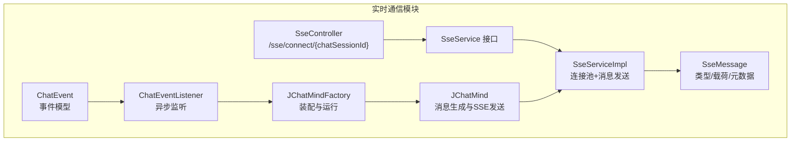
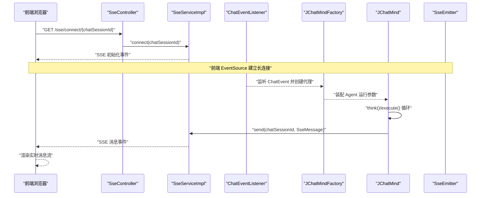
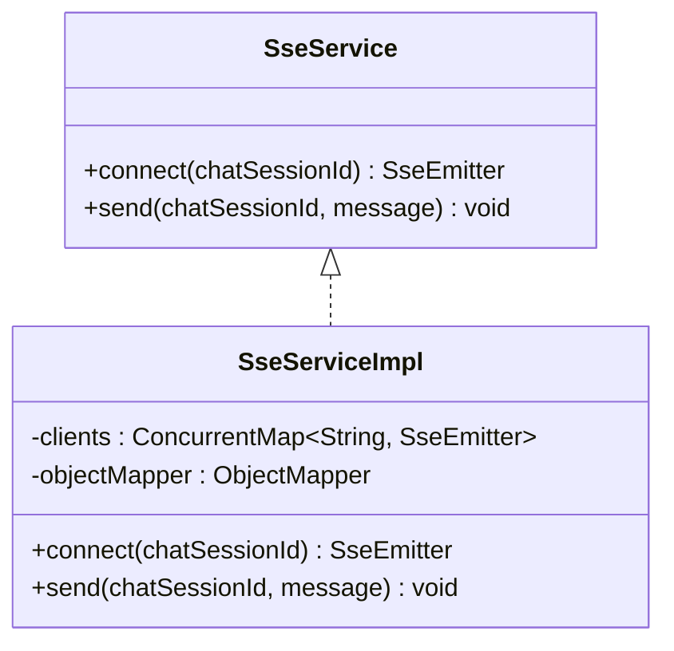
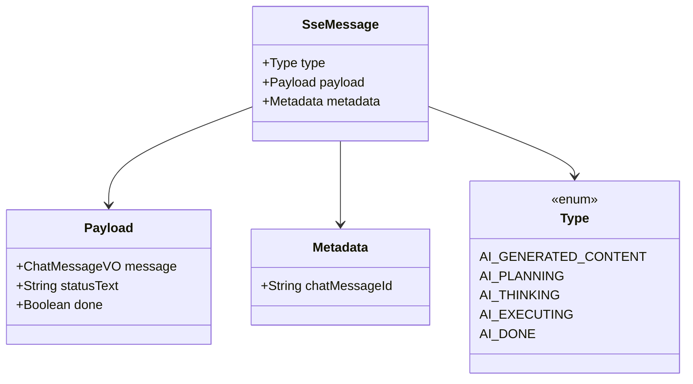
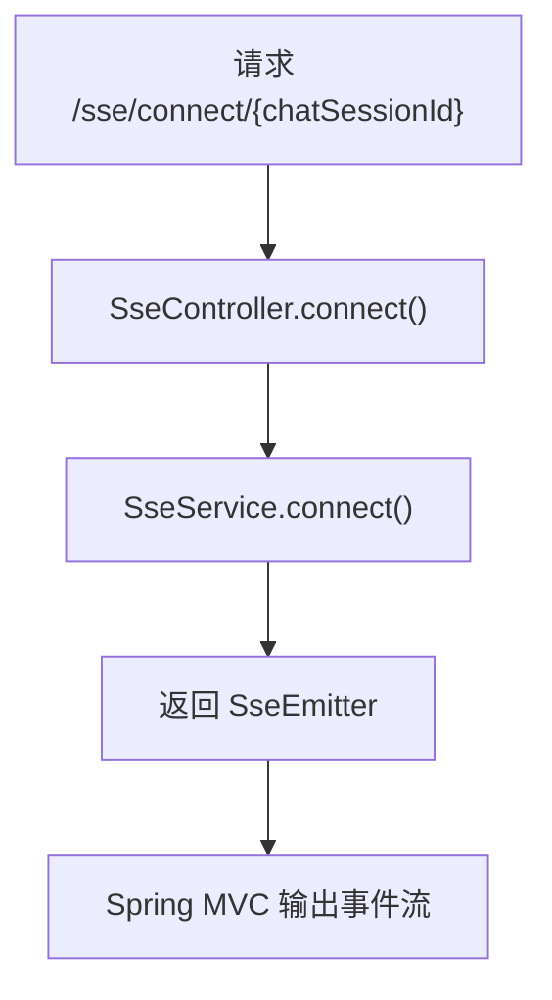
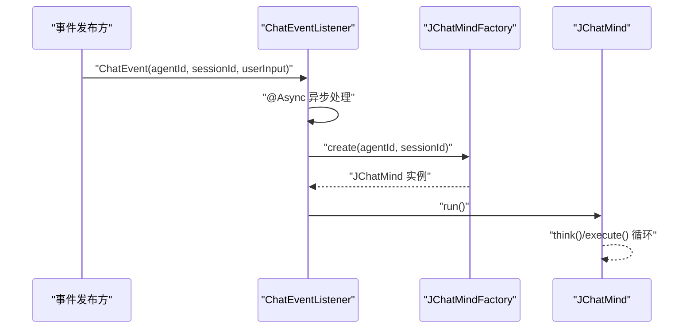
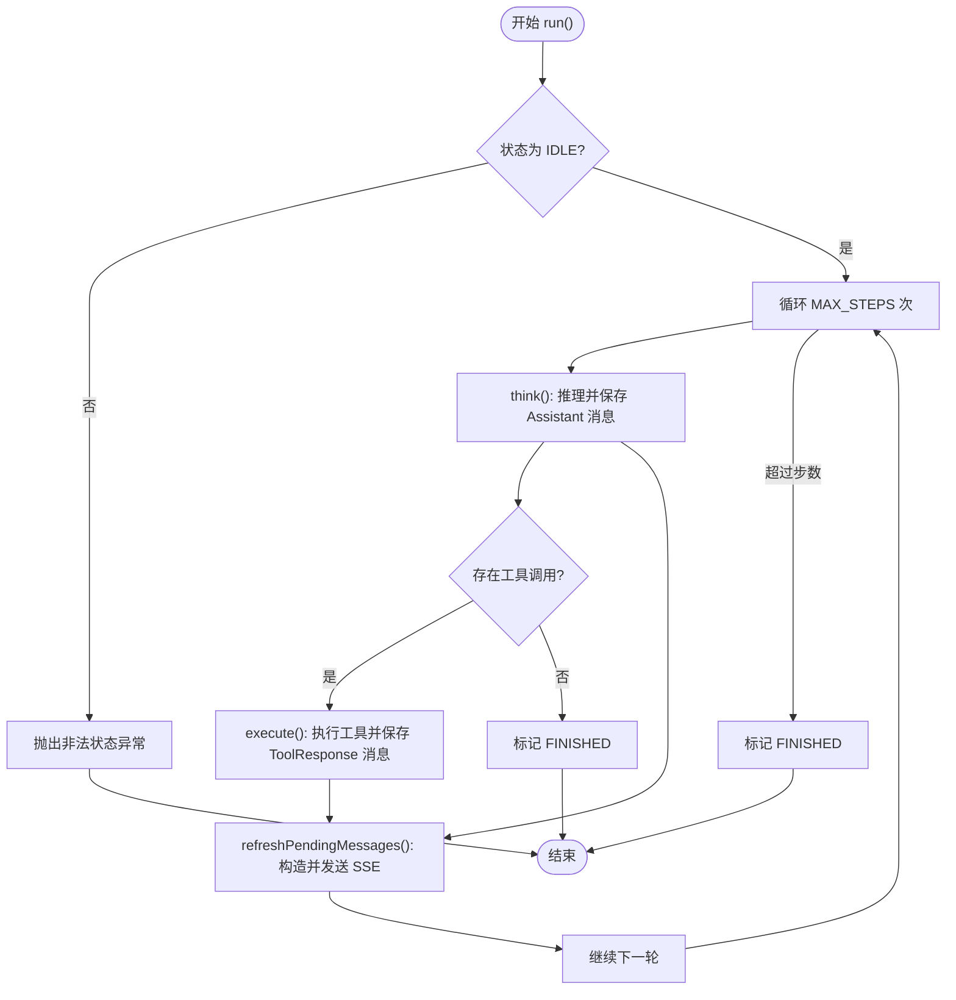

# 实时通信机制

<cite>
**本文引用的文件**
- [SseService.java](file://jchatmind/src/main/java/com/kama/jchatmind/service/SseService.java)
- [SseServiceImpl.java](file://jchatmind/src/main/java/com/kama/jchatmind/service/impl/SseServiceImpl.java)
- [SseMessage.java](file://jchatmind/src/main/java/com/kama/jchatmind/message/SseMessage.java)
- [SseController.java](file://jchatmind/src/main/java/com/kama/jchatmind/controller/SseController.java)
- [ChatEvent.java](file://jchatmind/src/main/java/com/kama/jchatmind/event/ChatEvent.java)
- [ChatEventListener.java](file://jchatmind/src/main/java/com/kama/jchatmind/event/listener/ChatEventListener.java)
- [JChatMind.java](file://jchatmind/src/main/java/com/kama/jchatmind/agent/JChatMind.java)
- [JChatMindFactory.java](file://jchatmind/src/main/java/com/kama/jchatmind/agent/JChatMindFactory.java)
- [AsyncConfig.java](file://jchatmind/src/main/java/com/kama/jchatmind/config/AsyncConfig.java)
- [application.yaml](file://jchatmind/src/main/resources/application.yaml)
- [example3.html](file://examples/example3.html)
</cite>

## 目录
1. [引言](#引言)
2. [项目结构](#项目结构)
3. [核心组件](#核心组件)
4. [架构总览](#架构总览)
5. [组件详解](#组件详解)
6. [依赖关系分析](#依赖关系分析)
7. [性能与可扩展性](#性能与可扩展性)
8. [故障排查指南](#故障排查指南)
9. [结论](#结论)
10. [附录](#附录)

## 引言
本技术文档围绕 JChatMind 项目的实时通信机制展开，重点解析基于 Spring MVC 的服务器推送事件（SSE）实现，包括 SseService 接口与 SseServiceImpl 的具体实现、SseMessage 消息格式设计、SseController 控制器的事件处理逻辑、ChatEvent 事件模型与 ChatEventListener 监听器的事件驱动架构，并给出从消息生成、事件发布到前端接收的完整实时通信流程说明。同时，文档还覆盖连接管理、错误处理与重连策略，并对 WebSocket 替代方案进行简要对比与性能分析，帮助读者全面理解该系统的实时通信能力与优化方向。

## 项目结构
实时通信相关代码主要分布在以下包与文件中：
- 服务层：SseService 接口与 SseServiceImpl 实现
- 消息模型：SseMessage 数据结构
- 控制器：SseController 提供 SSE 连接端点
- 事件模型与监听：ChatEvent 与 ChatEventListener
- 业务代理：JChatMind 与 JChatMindFactory 负责消息生成与 SSE 发送
- 异步配置：AsyncConfig 启用异步事件处理
- 配置文件：application.yaml 提供外部服务配置（如大模型 API）

图表来源
- [SseController.java:1-24](file://jchatmind/src/main/java/com/kama/jchatmind/controller/SseController.java#L1-L24)
- [SseService.java:1-12](file://jchatmind/src/main/java/com/kama/jchatmind/service/SseService.java#L1-L12)
- [SseServiceImpl.java:1-64](file://jchatmind/src/main/java/com/kama/jchatmind/service/impl/SseServiceImpl.java#L1-L64)
- [SseMessage.java:1-47](file://jchatmind/src/main/java/com/kama/jchatmind/message/SseMessage.java#L1-L47)
- [ChatEvent.java:1-13](file://jchatmind/src/main/java/com/kama/jchatmind/event/ChatEvent.java#L1-L13)
- [ChatEventListener.java:1-25](file://jchatmind/src/main/java/com/kama/jchatmind/event/listener/ChatEventListener.java#L1-L25)
- [JChatMind.java:1-348](file://jchatmind/src/main/java/com/kama/jchatmind/agent/JChatMind.java#L1-L348)
- [JChatMindFactory.java:1-248](file://jchatmind/src/main/java/com/kama/jchatmind/agent/JChatMindFactory.java#L1-L248)

章节来源
- [SseController.java:1-24](file://jchatmind/src/main/java/com/kama/jchatmind/controller/SseController.java#L1-L24)
- [SseService.java:1-12](file://jchatmind/src/main/java/com/kama/jchatmind/service/SseService.java#L1-L12)
- [SseServiceImpl.java:1-64](file://jchatmind/src/main/java/com/kama/jchatmind/service/impl/SseServiceImpl.java#L1-L64)
- [SseMessage.java:1-47](file://jchatmind/src/main/java/com/kama/jchatmind/message/SseMessage.java#L1-L47)
- [ChatEvent.java:1-13](file://jchatmind/src/main/java/com/kama/jchatmind/event/ChatEvent.java#L1-L13)
- [ChatEventListener.java:1-25](file://jchatmind/src/main/java/com/kama/jchatmind/event/listener/ChatEventListener.java#L1-L25)
- [JChatMind.java:1-348](file://jchatmind/src/main/java/com/kama/jchatmind/agent/JChatMind.java#L1-L348)
- [JChatMindFactory.java:1-248](file://jchatmind/src/main/java/com/kama/jchatmind/agent/JChatMindFactory.java#L1-L248)
- [AsyncConfig.java:1-25](file://jchatmind/src/main/java/com/kama/jchatmind/config/AsyncConfig.java#L1-L25)
- [application.yaml:1-43](file://jchatmind/src/main/resources/application.yaml#L1-L43)

## 核心组件
- SseService 接口：定义连接建立与消息发送两个核心方法，使用 chatSessionId 作为连接标识。
- SseServiceImpl：基于 ConcurrentHashMap 维护 SSE 客户端映射，使用 SseEmitter 管理连接生命周期，完成初始化事件与消息事件的发送。
- SseMessage：统一的 SSE 消息载体，包含类型、载荷与元数据；类型枚举覆盖“AI 生成内容”“规划中”“思考中”“执行中”“完成”等状态。
- SseController：暴露 /sse/connect/{chatSessionId} 端点，返回 SseEmitter，供前端以 EventSource 订阅。
- ChatEvent/ChatEventListener：事件驱动架构，监听业务事件，异步创建并运行 JChatMind 代理，逐步生成消息并通过 SSE 推送。
- JChatMind/JChatMindFactory：负责从数据库加载记忆、构建工具回调、调用大模型推理、保存消息并分批通过 SSE 发送。

章节来源
- [SseService.java:6-11](file://jchatmind/src/main/java/com/kama/jchatmind/service/SseService.java#L6-L11)
- [SseServiceImpl.java:14-64](file://jchatmind/src/main/java/com/kama/jchatmind/service/impl/SseServiceImpl.java#L14-L64)
- [SseMessage.java:11-46](file://jchatmind/src/main/java/com/kama/jchatmind/message/SseMessage.java#L11-L46)
- [SseController.java:18-22](file://jchatmind/src/main/java/com/kama/jchatmind/controller/SseController.java#L18-L22)
- [ChatEvent.java:8-12](file://jchatmind/src/main/java/com/kama/jchatmind/event/ChatEvent.java#L8-L12)
- [ChatEventListener.java:17-23](file://jchatmind/src/main/java/com/kama/jchatmind/event/listener/ChatEventListener.java#L17-L23)
- [JChatMind.java:201-217](file://jchatmind/src/main/java/com/kama/jchatmind/agent/JChatMind.java#L201-L217)
- [JChatMindFactory.java:227-246](file://jchatmind/src/main/java/com/kama/jchatmind/agent/JChatMindFactory.java#L227-L246)

## 架构总览
下图展示了从前端发起连接，到后端事件监听、代理运行、消息生成与 SSE 推送的全链路：

图表来源
- [SseController.java:18-22](file://jchatmind/src/main/java/com/kama/jchatmind/controller/SseController.java#L18-L22)
- [SseServiceImpl.java:21-42](file://jchatmind/src/main/java/com/kama/jchatmind/service/impl/SseServiceImpl.java#L21-L42)
- [ChatEventListener.java:17-23](file://jchatmind/src/main/java/com/kama/jchatmind/event/listener/ChatEventListener.java#L17-L23)
- [JChatMindFactory.java:227-246](file://jchatmind/src/main/java/com/kama/jchatmind/agent/JChatMindFactory.java#L227-L246)
- [JChatMind.java:201-217](file://jchatmind/src/main/java/com/kama/jchatmind/agent/JChatMind.java#L201-L217)

## 组件详解

### SseService 接口与 SseServiceImpl 实现
- 连接管理
  - 使用 ConcurrentHashMap<String, SseEmitter> 维护 chatSessionId 到 SseEmitter 的映射。
  - 连接超时设置为 30 分钟，避免长时间占用内存。
  - 注册 onCompletion/onTimeout/onError 回调，在连接断开时清理客户端映射。
- 初始化与消息发送
  - 连接成功后立即发送名为 “init” 的事件，数据为 “connected”，便于前端确认连接状态。
  - send 方法将 SseMessage 序列化为字符串，以 “message” 事件名发送，确保前后端协议一致。
  - 若找不到对应客户端，抛出运行时异常，便于上层捕获并处理。

图表来源
- [SseService.java:6-11](file://jchatmind/src/main/java/com/kama/jchatmind/service/SseService.java#L6-L11)
- [SseServiceImpl.java:14-64](file://jchatmind/src/main/java/com/kama/jchatmind/service/impl/SseServiceImpl.java#L14-L64)

章节来源
- [SseService.java:6-11](file://jchatmind/src/main/java/com/kama/jchatmind/service/SseService.java#L6-L11)
- [SseServiceImpl.java:18-42](file://jchatmind/src/main/java/com/kama/jchatmind/service/impl/SseServiceImpl.java#L18-L42)
- [SseServiceImpl.java:44-62](file://jchatmind/src/main/java/com/kama/jchatmind/service/impl/SseServiceImpl.java#L44-L62)

### SseMessage 消息格式设计
- 结构组成
  - type：消息类型枚举，覆盖“AI 生成内容”“规划中”“思考中”“执行中”“完成”等状态，便于前端状态机渲染。
  - payload：消息载荷，包含 ChatMessageVO、状态文本与完成标记，满足增量输出与最终完成通知。
  - metadata：消息元数据，携带 chatMessageId，用于前端去重与关联。
- 设计要点
  - 采用可序列化结构，便于通过 SSE 传输。
  - 类型与载荷分离，降低前端解析复杂度。
  - 元数据中携带后端生成的消息 ID，便于后续业务追踪。

图表来源
- [SseMessage.java:11-46](file://jchatmind/src/main/java/com/kama/jchatmind/message/SseMessage.java#L11-L46)

章节来源
- [SseMessage.java:11-46](file://jchatmind/src/main/java/com/kama/jchatmind/message/SseMessage.java#L11-L46)

### SseController 控制器
- 端点定义
  - 路径：/sse/connect/{chatSessionId}
  - 响应类型：TEXT_EVENT_STREAM_VALUE（即 text/event-stream）
- 行为说明
  - 直接委托给 SseService.connect，返回 SseEmitter，由 Spring MVC 负责底层 SSE 编解码与事件流输出。
- 前端对接
  - 前端使用 EventSource 订阅该路径，即可接收后端推送的事件流。

图表来源
- [SseController.java:18-22](file://jchatmind/src/main/java/com/kama/jchatmind/controller/SseController.java#L18-L22)
- [SseService.java:8](file://jchatmind/src/main/java/com/kama/jchatmind/service/SseService.java#L8)

章节来源
- [SseController.java:18-22](file://jchatmind/src/main/java/com/kama/jchatmind/controller/SseController.java#L18-L22)

### ChatEvent 事件模型与 ChatEventListener 监听器
- ChatEvent
  - 字段：agentId、sessionId、userInput，承载一次聊天触发的关键信息。
- ChatEventListener
  - 使用 @EventListener 监听 ChatEvent，@Async 异步执行，避免阻塞事件发布线程。
  - 通过 JChatMindFactory 创建 JChatMind 实例并运行，启动代理的推理与消息生成流程。

图表来源
- [ChatEvent.java:8-12](file://jchatmind/src/main/java/com/kama/jchatmind/event/ChatEvent.java#L8-L12)
- [ChatEventListener.java:17-23](file://jchatmind/src/main/java/com/kama/jchatmind/event/listener/ChatEventListener.java#L17-L23)
- [JChatMindFactory.java:227-246](file://jchatmind/src/main/java/com/kama/jchatmind/agent/JChatMindFactory.java#L227-L246)

章节来源
- [ChatEvent.java:8-12](file://jchatmind/src/main/java/com/kama/jchatmind/event/ChatEvent.java#L8-L12)
- [ChatEventListener.java:17-23](file://jchatmind/src/main/java/com/kama/jchatmind/event/listener/ChatEventListener.java#L17-L23)
- [JChatMindFactory.java:227-246](file://jchatmind/src/main/java/com/kama/jchatmind/agent/JChatMindFactory.java#L227-L246)

### JChatMind 与消息生成、SSE 推送
- 运行流程
  - 初始化：从数据库加载最近对话记忆，构建工具回调与知识库集合，设置最大步数与内存窗口。
  - 推理循环：think() 决策是否需要工具调用；若需要则 execute() 执行工具并将结果写入记忆。
  - 消息持久化：将 Assistant 与 ToolResponse 消息持久化，记录 chatMessageId。
  - SSE 推送：refreshPendingMessages() 将待推送消息批量转换为 SseMessage 并通过 SseService 发送。
- 错误处理：运行过程中捕获异常并标记状态为 ERROR，便于前端感知异常并进行重试或提示。

图表来源
- [JChatMind.java:316-337](file://jchatmind/src/main/java/com/kama/jchatmind/agent/JChatMind.java#L316-L337)
- [JChatMind.java:201-217](file://jchatmind/src/main/java/com/kama/jchatmind/agent/JChatMind.java#L201-L217)
- [JChatMind.java:266-304](file://jchatmind/src/main/java/com/kama/jchatmind/agent/JChatMind.java#L266-L304)

章节来源
- [JChatMind.java:316-337](file://jchatmind/src/main/java/com/kama/jchatmind/agent/JChatMind.java#L316-L337)
- [JChatMind.java:201-217](file://jchatmind/src/main/java/com/kama/jchatmind/agent/JChatMind.java#L201-L217)
- [JChatMind.java:266-304](file://jchatmind/src/main/java/com/kama/jchatmind/agent/JChatMind.java#L266-L304)

### 前端对接与示例
- 前端通过 EventSource 订阅 /sse/connect/{chatSessionId}，接收两类事件：
  - init：连接初始化事件，数据为 “connected”
  - message：消息事件，数据为 SseMessage 的字符串表示
- 示例页面展示了如何在浏览器中订阅事件流并渲染消息，包括多轮对话与工具调用场景。

章节来源
- [SseServiceImpl.java:26-30](file://jchatmind/src/main/java/com/kama/jchatmind/service/impl/SseServiceImpl.java#L26-L30)
- [SseServiceImpl.java:51-55](file://jchatmind/src/main/java/com/kama/jchatmind/service/impl/SseServiceImpl.java#L51-L55)
- [example3.html:265-601](file://examples/example3.html#L265-L601)

## 依赖关系分析
- 组件耦合
  - SseController 仅依赖 SseService 接口，低耦合高内聚。
  - SseServiceImpl 依赖 ObjectMapper 进行消息序列化，依赖并发容器维护连接表。
  - ChatEventListener 依赖 JChatMindFactory 创建代理，通过异步执行解耦事件发布与业务处理。
  - JChatMind 依赖 SseService 进行消息推送，依赖 ChatMessageFacadeService 持久化消息。
- 外部依赖
  - application.yaml 提供大模型 API 配置（如 DeepSeek/Zhipu），影响 JChatMind 的推理性能与稳定性。

```mermaid
graph LR
Ctrl["SseController"] --> Svc["SseService"]
SvcImpl["SseServiceImpl"] --> Svc
Lsn["ChatEventListener"] --> Fac["JChatMindFactory"]
Fac --> Agent["JChatMind"]
Agent --> SvcImpl
Agent --> MsgSvc["ChatMessageFacadeService"]
Agent --> Sse["SseService"]
Conf["application.yaml"] --> Fac
```

图表来源
- [SseController.java:16](file://jchatmind/src/main/java/com/kama/jchatmind/controller/SseController.java#L16)
- [SseServiceImpl.java:18-19](file://jchatmind/src/main/java/com/kama/jchatmind/service/impl/SseServiceImpl.java#L18-L19)
- [ChatEventListener.java:15](file://jchatmind/src/main/java/com/kama/jchatmind/event/listener/ChatEventListener.java#L15)
- [JChatMindFactory.java:34-70](file://jchatmind/src/main/java/com/kama/jchatmind/agent/JChatMindFactory.java#L34-L70)
- [JChatMind.java:74-79](file://jchatmind/src/main/java/com/kama/jchatmind/agent/JChatMind.java#L74-L79)
- [application.yaml:22-34](file://jchatmind/src/main/resources/application.yaml#L22-L34)

章节来源
- [SseController.java:16](file://jchatmind/src/main/java/com/kama/jchatmind/controller/SseController.java#L16)
- [SseServiceImpl.java:18-19](file://jchatmind/src/main/java/com/kama/jchatmind/service/impl/SseServiceImpl.java#L18-L19)
- [ChatEventListener.java:15](file://jchatmind/src/main/java/com/kama/jchatmind/event/listener/ChatEventListener.java#L15)
- [JChatMindFactory.java:34-70](file://jchatmind/src/main/java/com/kama/jchatmind/agent/JChatMindFactory.java#L34-L70)
- [JChatMind.java:74-79](file://jchatmind/src/main/java/com/kama/jchatmind/agent/JChatMind.java#L74-L79)
- [application.yaml:22-34](file://jchatmind/src/main/resources/application.yaml#L22-L34)

## 性能与可扩展性
- 连接管理
  - 使用 ConcurrentHashMap 保证高并发下的读写效率；SseEmitter 超时与回调清理避免资源泄漏。
- 异步处理
  - ChatEventListener 使用 @Async 与线程池执行，隔离事件发布与业务处理，提升吞吐。
- 序列化与网络
  - SseMessage 采用 JSON 序列化，建议保持字段精简，避免过大数据包导致延迟。
- 可扩展方向
  - 连接池容量与超时时间可根据业务峰值调整。
  - 可引入消息队列（如 RabbitMQ/Kafka）进一步削峰填谷，适用于高并发场景。
  - 对于强实时与双向交互需求，可评估 WebSocket 方案，但 SSE 在单向推送场景具备更低的实现复杂度与更好的兼容性。

[本节为通用性能讨论，不直接分析具体文件]

## 故障排查指南
- 常见问题与定位
  - 连接无法建立：检查 /sse/connect/{chatSessionId} 是否返回 200 与正确的 Content-Type；确认 chatSessionId 是否有效。
  - 前端未收到消息：确认前端 EventSource 是否正确订阅；检查后端是否成功发送 “init” 与 “message” 事件。
  - 连接被关闭：关注 SseServiceImpl 的 onCompletion/onTimeout/onError 回调是否触发，排查网络中断或超时。
  - 事件未触发：检查 AsyncConfig 的线程池配置与 @Async 是否生效；确认 ChatEvent 是否被正确发布。
  - 消息未持久化：核对 JChatMind 的 saveMessage 逻辑与 ChatMessageFacadeService 的调用链。
- 建议的日志与监控
  - 记录连接建立/断开、消息发送、异常堆栈与代理状态变化，便于快速定位问题。

章节来源
- [SseServiceImpl.java:35-39](file://jchatmind/src/main/java/com/kama/jchatmind/service/impl/SseServiceImpl.java#L35-L39)
- [AsyncConfig.java:14-23](file://jchatmind/src/main/java/com/kama/jchatmind/config/AsyncConfig.java#L14-L23)
- [JChatMind.java:332-336](file://jchatmind/src/main/java/com/kama/jchatmind/agent/JChatMind.java#L332-L336)

## 结论
JChatMind 的实时通信机制以 SSE 为核心，结合事件驱动与异步处理，实现了从事件发布到前端接收的完整闭环。SseService/SseServiceImpl 提供稳定的连接管理与消息推送能力；SseMessage 统一了消息格式；JChatMind 通过 think/execute 循环生成消息并分批推送；ChatEvent/ChatEventListener 将业务事件与实时通信解耦。整体架构简洁、可扩展性强，适合在需要单向实时推送的场景中部署与演进。对于更高实时性与双向交互需求，可评估 WebSocket 方案，但在当前实现中，SSE 已能满足大多数聊天与工具调用的实时反馈场景。

[本节为总结性内容，不直接分析具体文件]

## 附录
- 前端示例页面
  - example3.html 展示了如何订阅 SSE 事件流并渲染多轮对话与工具调用过程，可作为前端集成参考。
- 配置参考
  - application.yaml 中的大模型 API 配置项，影响 JChatMind 的推理性能与可用性。

章节来源
- [example3.html:265-601](file://examples/example3.html#L265-L601)
- [application.yaml:22-34](file://jchatmind/src/main/resources/application.yaml#L22-L34)