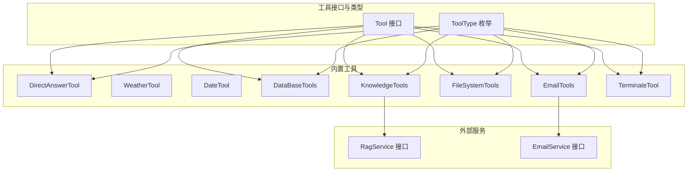
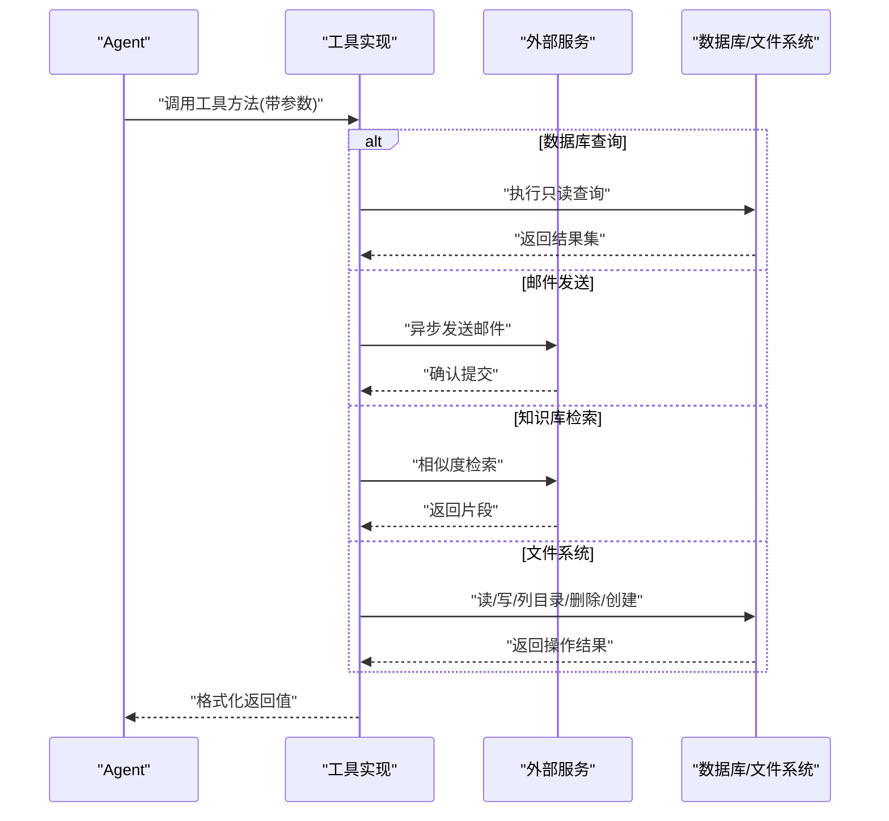
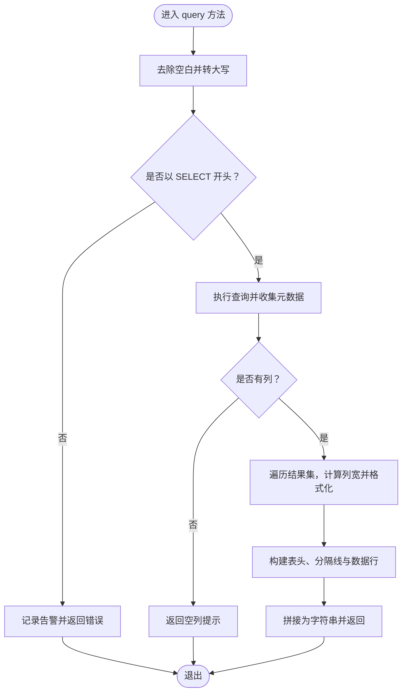
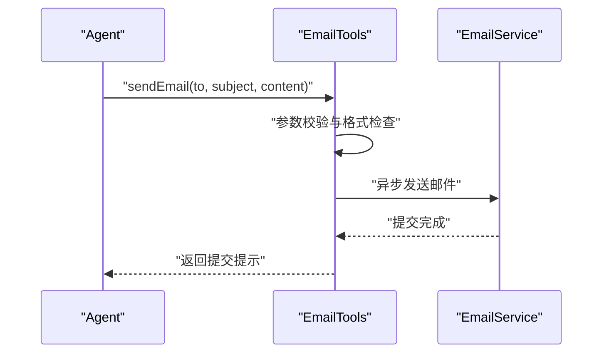
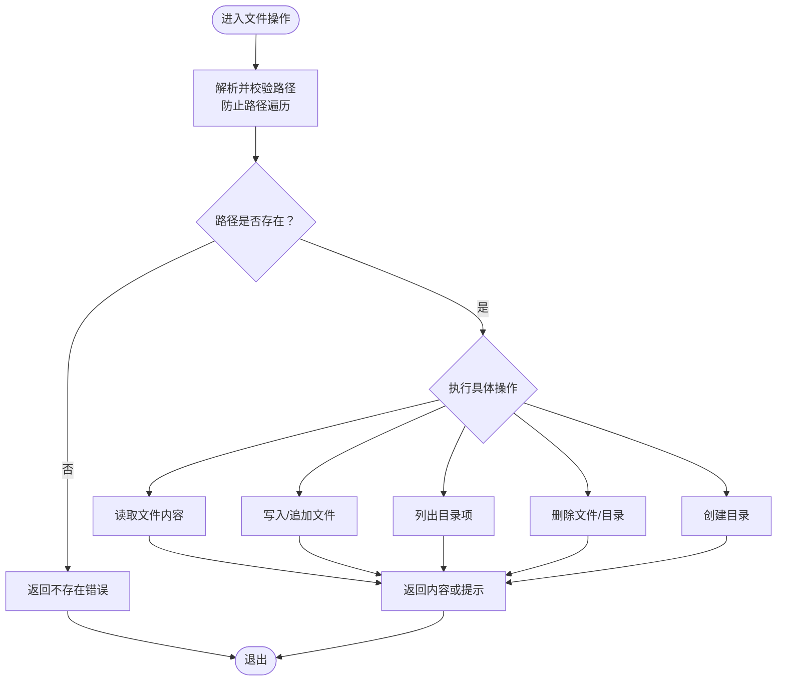
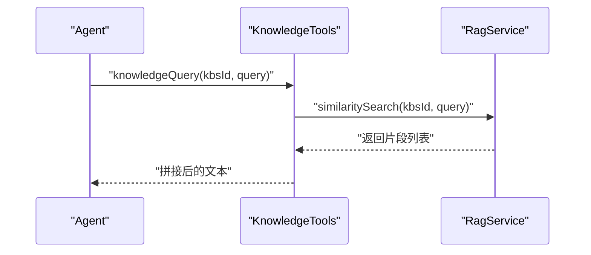
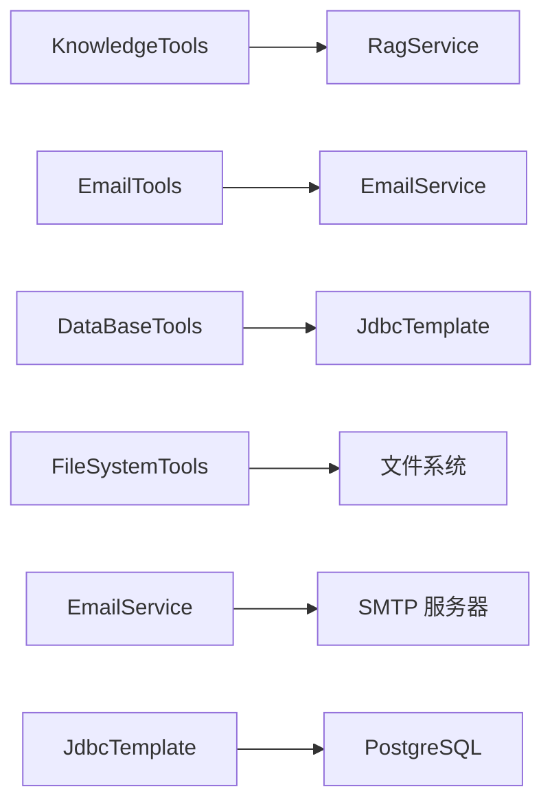

# 内置工具实现

<cite>
**本文引用的文件**
- [DirectAnswerTool.java](file://jchatmind/src/main/java/com/kama/jchatmind/agent/tools/DirectAnswerTool.java)
- [WeatherTool.java](file://jchatmind/src/main/java/com/kama/jchatmind/agent/tools/test/WeatherTool.java)
- [DateTool.java](file://jchatmind/src/main/java/com/kama/jchatmind/agent/tools/test/DateTool.java)
- [DataBaseTools.java](file://jchatmind/src/main/java/com/kama/jchatmind/agent/tools/DataBaseTools.java)
- [EmailTools.java](file://jchatmind/src/main/java/com/kama/jchatmind/agent/tools/EmailTools.java)
- [FileSystemTools.java](file://jchatmind/src/main/java/com/kama/jchatmind/agent/tools/FileSystemTools.java)
- [KnowledgeTools.java](file://jchatmind/src/main/java/com/kama/jchatmind/agent/tools/KnowledgeTools.java)
- [TerminateTool.java](file://jchatmind/src/main/java/com/kama/jchatmind/agent/tools/TerminateTool.java)
- [Tool.java](file://jchatmind/src/main/java/com/kama/jchatmind/agent/tools/Tool.java)
- [ToolType.java](file://jchatmind/src/main/java/com/kama/jchatmind/agent/tools/ToolType.java)
- [RagService.java](file://jchatmind/src/main/java/com/kama/jchatmind/service/RagService.java)
- [EmailService.java](file://jchatmind/src/main/java/com/kama/jchatmind/service/EmailService.java)
- [application.yaml](file://jchatmind/src/main/resources/application.yaml)
</cite>

## 目录
1. [简介](#简介)
2. [项目结构](#项目结构)
3. [核心组件](#核心组件)
4. [架构总览](#架构总览)
5. [详细组件分析](#详细组件分析)
6. [依赖分析](#依赖分析)
7. [性能考虑](#性能考虑)
8. [故障排查指南](#故障排查指南)
9. [结论](#结论)
10. [附录](#附录)

## 简介
本文件面向内置工具实现，系统性解析以下工具的实现细节与使用方法：DirectAnswerTool（直接回答工具）、WeatherTool（天气查询工具）、DateTool（日期工具）、DataBaseTools（数据库操作工具）、EmailTools（邮件发送工具）、FileSystemTools（文件系统工具）、KnowledgeTools（知识库工具）与 TerminateTool（终止工具）。文档涵盖参数格式、返回值结构、错误处理策略、调用序列图、最佳实践与性能建议。

## 项目结构
内置工具位于 agent/tools 包下，遵循“接口 + 工具实现 + 类型枚举”的分层设计；部分测试工具位于 test 子包中。工具通过注解暴露给大模型调用，统一实现 Tool 接口并标注 ToolType（固定/可选）。

图表来源
- [Tool.java:1-10](file://jchatmind/src/main/java/com/kama/jchatmind/agent/tools/Tool.java#L1-L10)
- [ToolType.java:1-9](file://jchatmind/src/main/java/com/kama/jchatmind/agent/tools/ToolType.java#L1-L9)
- [DirectAnswerTool.java:1-30](file://jchatmind/src/main/java/com/kama/jchatmind/agent/tools/DirectAnswerTool.java#L1-L30)
- [WeatherTool.java:1-31](file://jchatmind/src/main/java/com/kama/jchatmind/agent/tools/test/WeatherTool.java#L1-L31)
- [DateTool.java:1-32](file://jchatmind/src/main/java/com/kama/jchatmind/agent/tools/test/DateTool.java#L1-L32)
- [DataBaseTools.java:1-147](file://jchatmind/src/main/java/com/kama/jchatmind/agent/tools/DataBaseTools.java#L1-L147)
- [EmailTools.java:1-68](file://jchatmind/src/main/java/com/kama/jchatmind/agent/tools/EmailTools.java#L1-L68)
- [FileSystemTools.java:1-342](file://jchatmind/src/main/java/com/kama/jchatmind/agent/tools/FileSystemTools.java#L1-L342)
- [KnowledgeTools.java:1-41](file://jchatmind/src/main/java/com/kama/jchatmind/agent/tools/KnowledgeTools.java#L1-L41)
- [TerminateTool.java:1-26](file://jchatmind/src/main/java/com/kama/jchatmind/agent/tools/TerminateTool.java#L1-L26)
- [RagService.java:1-10](file://jchatmind/src/main/java/com/kama/jchatmind/service/RagService.java#L1-L10)
- [EmailService.java:1-16](file://jchatmind/src/main/java/com/kama/jchatmind/service/EmailService.java#L1-L16)

章节来源
- [Tool.java:1-10](file://jchatmind/src/main/java/com/kama/jchatmind/agent/tools/Tool.java#L1-L10)
- [ToolType.java:1-9](file://jchatmind/src/main/java/com/kama/jchatmind/agent/tools/ToolType.java#L1-L9)

## 核心组件
- Tool 接口：定义工具名称、描述与类型，作为所有工具的契约。
- ToolType 枚举：区分 FIXED（固定）与 OPTIONAL（可选）两类工具。
- 工具实现：每个工具实现 Tool 接口并通过注解暴露给模型调用，部分工具依赖外部服务（如数据库、邮件、RAG）。

章节来源
- [Tool.java:1-10](file://jchatmind/src/main/java/com/kama/jchatmind/agent/tools/Tool.java#L1-L10)
- [ToolType.java:1-9](file://jchatmind/src/main/java/com/kama/jchatmind/agent/tools/ToolType.java#L1-L9)

## 架构总览
工具通过注解声明对外能力，Agent 在推理过程中根据上下文选择合适工具执行。数据库与文件系统等工具受安全策略约束，邮件与知识库工具依赖后端服务。

图表来源
- [DataBaseTools.java:44-145](file://jchatmind/src/main/java/com/kama/jchatmind/agent/tools/DataBaseTools.java#L44-L145)
- [EmailTools.java:44-66](file://jchatmind/src/main/java/com/kama/jchatmind/agent/tools/EmailTools.java#L44-L66)
- [KnowledgeTools.java:36-39](file://jchatmind/src/main/java/com/kama/jchatmind/agent/tools/KnowledgeTools.java#L36-L39)
- [FileSystemTools.java:46-261](file://jchatmind/src/main/java/com/kama/jchatmind/agent/tools/FileSystemTools.java#L46-L261)

## 详细组件分析

### DirectAnswerTool（直接回答工具）
- 角色定位：FIXED 类型工具，用于无需进一步操作的直接回答。
- 能力声明：通过注解声明工具名与描述，供模型直接调用。
- 参数与返回：无参数，返回空结果；通常用于快速结束对话或给出明确结论。
- 错误处理：由于无外部依赖，异常风险低。
- 使用示例：当用户询问无需查询或操作的问题时，直接调用该工具返回自然语言回答。

章节来源
- [DirectAnswerTool.java:1-30](file://jchatmind/src/main/java/com/kama/jchatmind/agent/tools/DirectAnswerTool.java#L1-L30)

### WeatherTool（天气查询工具）
- 角色定位：FIXED 类型工具，用于演示天气查询能力。
- 能力声明：通过注解声明工具名与描述，参数包含城市与日期。
- 参数格式：city（城市名）、date（日期字符串）。
- 返回值结构：字符串形式的天气描述。
- 错误处理：未见显式校验，建议在生产环境增加参数校验与异常捕获。
- 使用示例：传入城市与日期，返回对应天气描述。

章节来源
- [WeatherTool.java:1-31](file://jchatmind/src/main/java/com/kama/jchatmind/agent/tools/test/WeatherTool.java#L1-L31)

### DateTool（日期工具）
- 角色定位：FIXED 类型工具，用于获取当前日期。
- 能力声明：通过注解声明工具名与描述。
- 参数格式：无参数。
- 返回值结构：格式化后的日期字符串（年-月-日）。
- 错误处理：无外部依赖，异常风险低。
- 使用示例：调用后返回当前日期字符串。

章节来源
- [DateTool.java:1-32](file://jchatmind/src/main/java/com/kama/jchatmind/agent/tools/test/DateTool.java#L1-L32)

### DataBaseTools（数据库操作工具）
- 角色定位：OPTIONAL 类型工具，提供只读查询能力。
- 能力声明：通过注解声明工具名与描述，仅支持 SELECT 查询。
- 参数格式：sql（SQL 查询语句，必须以 SELECT 开头）。
- 返回值结构：格式化的表格字符串，包含表头、分隔线与数据行。
- 安全策略：
  - 严格限制仅允许 SELECT 语句；
  - 记录日志并返回错误信息；
  - 对列宽动态计算，保证输出对齐。
- 错误处理：
  - 非 SELECT 语句直接拒绝；
  - 查询异常捕获并返回错误信息；
  - 空结果集与无列情况有专门分支处理。
- 性能考虑：
  - 输出格式化为字符串，适合小规模结果展示；
  - 大结果集可能导致内存与传输压力，建议配合分页或限制返回条数。
- 使用示例：传入合法 SELECT 语句，返回格式化表格。

图表来源
- [DataBaseTools.java:44-145](file://jchatmind/src/main/java/com/kama/jchatmind/agent/tools/DataBaseTools.java#L44-L145)

章节来源
- [DataBaseTools.java:1-147](file://jchatmind/src/main/java/com/kama/jchatmind/agent/tools/DataBaseTools.java#L1-L147)

### EmailTools（邮件发送工具）
- 角色定位：OPTIONAL 类型工具，负责异步发送邮件。
- 能力声明：通过注解声明工具名与描述，参数包含收件人、主题与内容。
- 参数格式：to（收件人邮箱地址，必填）、subject（邮件主题，必填）、content（邮件正文，必填）。
- 返回值结构：提交成功提示信息（包含收件人与主题）。
- 安全策略：
  - 参数非空校验；
  - 简单邮箱格式校验（包含 @ 符号）；
  - 异步发送，避免阻塞工具调用。
- 错误处理：
  - 参数非法直接返回错误；
  - 邮件服务异常由 EmailService 实现处理；
  - 日志记录提交状态。
- 使用示例：传入 to、subject、content，返回“已提交发送”提示。

图表来源
- [EmailTools.java:44-66](file://jchatmind/src/main/java/com/kama/jchatmind/agent/tools/EmailTools.java#L44-L66)
- [EmailService.java:1-16](file://jchatmind/src/main/java/com/kama/jchatmind/service/EmailService.java#L1-L16)

章节来源
- [EmailTools.java:1-68](file://jchatmind/src/main/java/com/kama/jchatmind/agent/tools/EmailTools.java#L1-L68)
- [EmailService.java:1-16](file://jchatmind/src/main/java/com/kama/jchatmind/service/EmailService.java#L1-L16)
- [application.yaml:9-21](file://jchatmind/src/main/resources/application.yaml#L9-L21)

### FileSystemTools（文件系统工具）
- 角色定位：OPTIONAL 类型工具，提供文件读写、目录操作等能力。
- 能力声明：通过注解声明多个工具方法（读取、写入、追加、列出、删除、创建目录）。
- 安全策略：
  - 限定基础目录为工作目录；
  - 路径解析后进行规范化与前缀校验，防止路径遍历攻击；
  - 对异常进行分类处理（安全、IO、未知）。
- 功能清单与参数：
  - readFile(filePath)：读取文件内容。
  - writeFile(filePath, content)：写入文件（覆盖）。
  - appendToFile(filePath, content)：追加内容。
  - listFiles(directoryPath?)：列出目录内容（为空则当前目录）。
  - deleteFile(path)：删除文件或目录（递归删除目录）。
  - createDirectory(directoryPath)：创建目录（含父目录）。
- 返回值结构：标准提示信息或内容文本。
- 错误处理：针对不同异常返回统一格式的错误信息。
- 使用示例：传入相对工作目录的路径，返回操作结果或错误提示。

图表来源
- [FileSystemTools.java:46-261](file://jchatmind/src/main/java/com/kama/jchatmind/agent/tools/FileSystemTools.java#L46-L261)
- [FileSystemTools.java:308-322](file://jchatmind/src/main/java/com/kama/jchatmind/agent/tools/FileSystemTools.java#L308-L322)

章节来源
- [FileSystemTools.java:1-342](file://jchatmind/src/main/java/com/kama/jchatmind/agent/tools/FileSystemTools.java#L1-L342)

### KnowledgeTools（知识库工具）
- 角色定位：FIXED 类型工具，用于基于 RAG 的语义检索。
- 能力声明：通过注解声明工具名与描述，参数为知识库 ID 与查询文本。
- 参数格式：kbsId（知识库 ID）、query（查询文本）。
- 返回值结构：按换行拼接的相关片段列表。
- 依赖关系：依赖 RagService 接口的 similaritySearch 方法。
- 错误处理：未见显式异常捕获，建议在生产环境包装异常并返回友好提示。
- 使用示例：传入知识库 ID 与查询文本，返回相关片段集合。

图表来源
- [KnowledgeTools.java:36-39](file://jchatmind/src/main/java/com/kama/jchatmind/agent/tools/KnowledgeTools.java#L36-L39)
- [RagService.java](file://jchatmind/src/main/java/com/kama/jchatmind/service/RagService.java#L8)

章节来源
- [KnowledgeTools.java:1-41](file://jchatmind/src/main/java/com/kama/jchatmind/agent/tools/KnowledgeTools.java#L1-L41)
- [RagService.java:1-10](file://jchatmind/src/main/java/com/kama/jchatmind/service/RagService.java#L1-L10)

### TerminateTool（终止工具）
- 角色定位：FIXED 类型工具，用于结束 Agent 循环。
- 能力声明：通过注解声明工具名与描述，无参数。
- 参数格式：无参数。
- 返回值结构：无返回值（void）。
- 使用示例：当任务完成后调用该工具结束对话循环。

章节来源
- [TerminateTool.java:1-26](file://jchatmind/src/main/java/com/kama/jchatmind/agent/tools/TerminateTool.java#L1-L26)

## 依赖分析
- 工具与服务的耦合：
  - KnowledgeTools 依赖 RagService；
  - EmailTools 依赖 EmailService；
  - DataBaseTools 依赖 JDBC 模板（由 Spring 提供）。
- 配置依赖：
  - 数据源与邮件服务配置位于 application.yaml；
  - 文档存储路径在配置中定义，供知识库/文档相关功能使用。

图表来源
- [KnowledgeTools.java:11-15](file://jchatmind/src/main/java/com/kama/jchatmind/agent/tools/KnowledgeTools.java#L11-L15)
- [EmailTools.java:11-15](file://jchatmind/src/main/java/com/kama/jchatmind/agent/tools/EmailTools.java#L11-L15)
- [DataBaseTools.java:16-20](file://jchatmind/src/main/java/com/kama/jchatmind/agent/tools/DataBaseTools.java#L16-L20)
- [application.yaml:5-8](file://jchatmind/src/main/resources/application.yaml#L5-L8)
- [application.yaml:9-21](file://jchatmind/src/main/resources/application.yaml#L9-L21)

章节来源
- [application.yaml:1-43](file://jchatmind/src/main/resources/application.yaml#L1-L43)

## 性能考虑
- 数据库查询：
  - 仅支持 SELECT，避免锁与写入开销；
  - 结果集格式化为字符串，适合中小规模数据展示；
  - 建议限制返回行数与列数，避免大结果集导致内存与网络压力。
- 邮件发送：
  - 异步发送避免阻塞，提升吞吐；
  - 建议引入队列与重试机制，确保高并发下的可靠性。
- 文件系统：
  - 路径校验与目录创建减少 IO 异常；
  - 大文件读写建议分块处理与流式写入。
- 知识库检索：
  - 向量化嵌入与相似度计算成本较高，建议缓存常用查询或分批检索。

## 故障排查指南
- 数据库查询
  - 现象：返回“仅支持 SELECT 查询”。
  - 排查：确认 SQL 是否以 SELECT 开头；查看日志中拒绝记录。
  - 现象：返回“操作失败”+异常信息。
  - 排查：检查 SQL 语法、权限与连接配置。
- 邮件发送
  - 现象：返回“收件人邮箱地址不能为空/格式不正确”。
  - 排查：检查 to、subject、content 是否为空；邮箱格式是否包含 @。
  - 现象：返回“已提交发送”，但未收到邮件。
  - 排查：检查 SMTP 配置与授权码；查看异步任务执行状态。
- 文件系统
  - 现象：返回“访问被拒绝/路径遍历攻击被阻止”。
  - 排查：确认路径是否在工作目录范围内；检查权限。
  - 现象：返回“文件不存在/目录不存在”。
  - 排查：确认相对路径与绝对路径映射。
- 知识库检索
  - 现象：返回空结果或异常。
  - 排查：确认知识库 ID 有效；检查嵌入模型与索引状态。
- 终止工具
  - 现象：Agent 未结束循环。
  - 排查：确认工具调用是否被模型识别；检查 Agent 状态机逻辑。

章节来源
- [DataBaseTools.java:44-145](file://jchatmind/src/main/java/com/kama/jchatmind/agent/tools/DataBaseTools.java#L44-L145)
- [EmailTools.java:44-66](file://jchatmind/src/main/java/com/kama/jchatmind/agent/tools/EmailTools.java#L44-L66)
- [FileSystemTools.java:46-261](file://jchatmind/src/main/java/com/kama/jchatmind/agent/tools/FileSystemTools.java#L46-L261)
- [KnowledgeTools.java:36-39](file://jchatmind/src/main/java/com/kama/jchatmind/agent/tools/KnowledgeTools.java#L36-L39)
- [TerminateTool.java:1-26](file://jchatmind/src/main/java/com/kama/jchatmind/agent/tools/TerminateTool.java#L1-L26)

## 结论
内置工具通过统一接口与注解机制，为 Agent 提供了直接回答、日期时间、数据库查询、邮件发送、文件系统操作、知识库检索与终止控制等能力。在生产环境中，建议增强参数校验、异常处理与异步任务可靠性，并结合配置优化性能与安全性。

## 附录
- 最佳实践
  - 明确区分 FIXED 与 OPTIONAL 工具，按需装配；
  - 对外部服务调用进行超时与重试控制；
  - 对敏感操作（数据库写入、文件删除）增加二次确认或审计日志；
  - 使用配置中心集中管理 SMTP、数据库与模型 API Key。
- 参数与返回规范（汇总）
  - 直接回答：无参数，无返回。
  - 天气查询：city、date → 字符串。
  - 日期工具：无参数 → 格式化日期字符串。
  - 数据库查询：sql（仅 SELECT）→ 格式化表格字符串。
  - 邮件发送：to、subject、content → 提交提示。
  - 文件系统：多种操作 → 提示或内容文本。
  - 知识库检索：kbsId、query → 片段拼接文本。
  - 终止工具：无参数 → 结束循环。