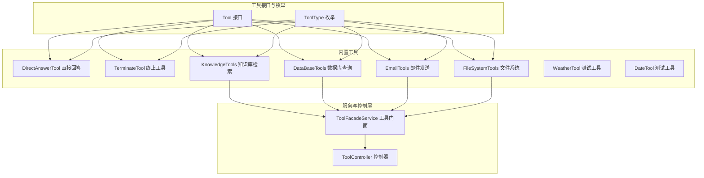
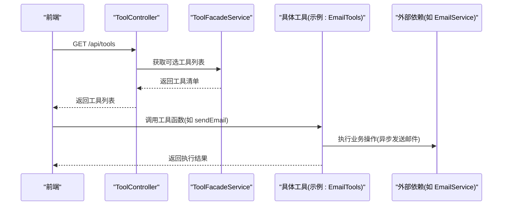
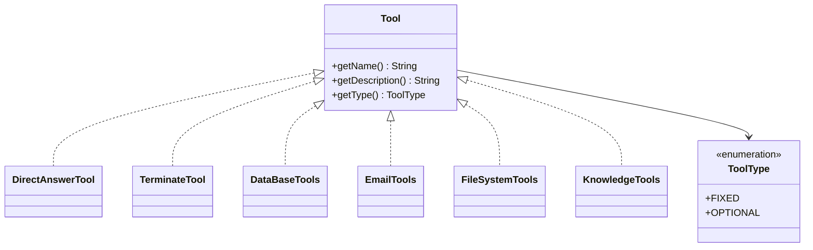
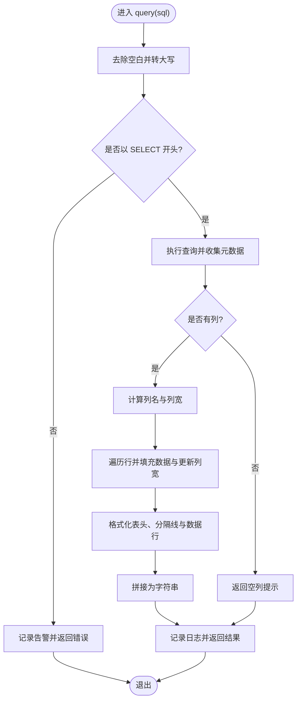
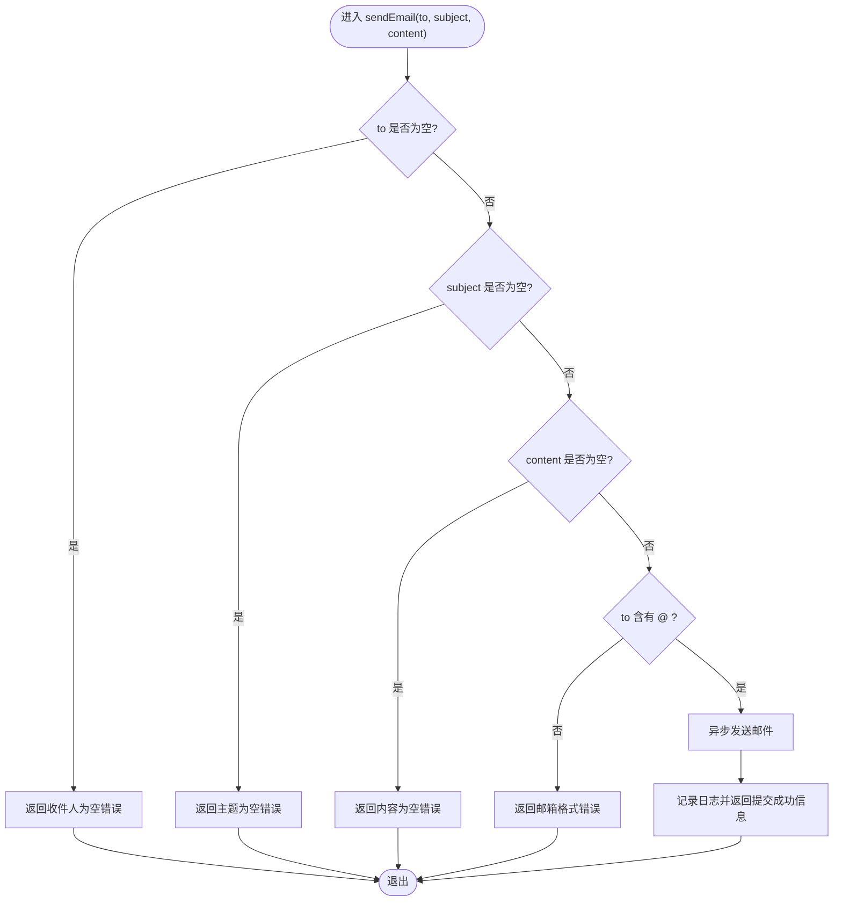
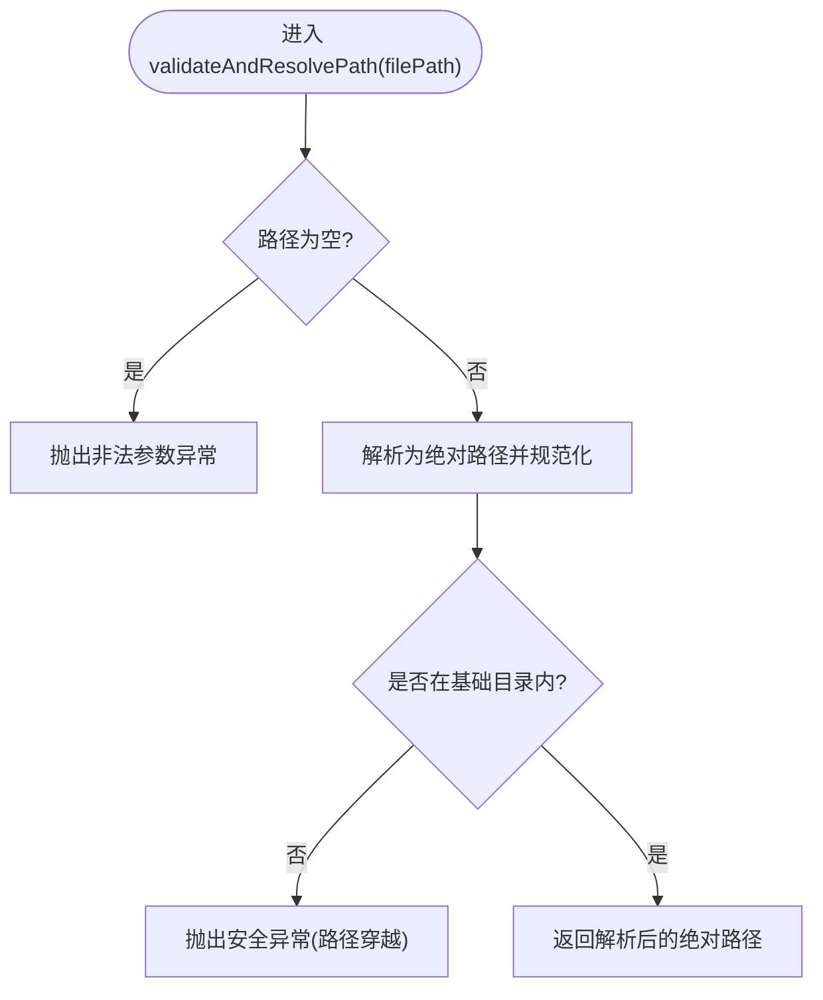
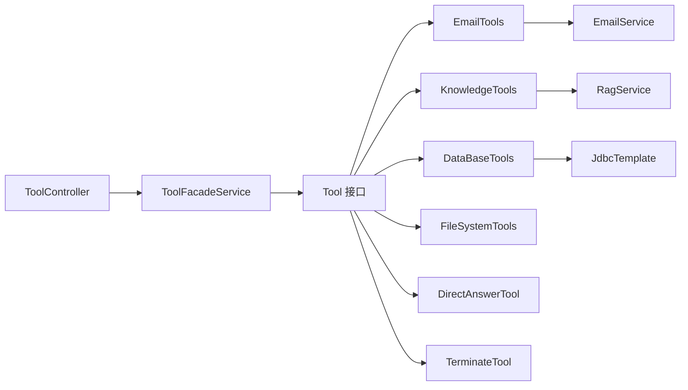

# 工具调用系统

<cite>
**本文引用的文件**
- [Tool.java](file://jchatmind/src/main/java/com/kama/jchatmind/agent/tools/Tool.java)
- [ToolType.java](file://jchatmind/src/main/java/com/kama/jchatmind/agent/tools/ToolType.java)
- [DirectAnswerTool.java](file://jchatmind/src/main/java/com/kama/jchatmind/agent/tools/DirectAnswerTool.java)
- [TerminateTool.java](file://jchatmind/src/main/java/com/kama/jchatmind/agent/tools/TerminateTool.java)
- [DataBaseTools.java](file://jchatmind/src/main/java/com/kama/jchatmind/agent/tools/DataBaseTools.java)
- [EmailTools.java](file://jchatmind/src/main/java/com/kama/jchatmind/agent/tools/EmailTools.java)
- [FileSystemTools.java](file://jchatmind/src/main/java/com/kama/jchatmind/agent/tools/FileSystemTools.java)
- [KnowledgeTools.java](file://jchatmind/src/main/java/com/kama/jchatmind/agent/tools/KnowledgeTools.java)
- [WeatherTool.java](file://jchatmind/src/main/java/com/kama/jchatmind/agent/tools/test/WeatherTool.java)
- [DateTool.java](file://jchatmind/src/main/java/com/kama/jchatmind/agent/tools/test/DateTool.java)
- [ToolFacadeService.java](file://jchatmind/src/main/java/com/kama/jchatmind/service/ToolFacadeService.java)
- [ToolController.java](file://jchatmind/src/main/java/com/kama/jchatmind/controller/ToolController.java)
- [JchatmindApplication.java](file://jchatmind/src/main/java/com/kama/jchatmind/JchatmindApplication.java)
</cite>

## 目录
1. [简介](#简介)
2. [项目结构](#项目结构)
3. [核心组件](#核心组件)
4. [架构总览](#架构总览)
5. [详细组件分析](#详细组件分析)
6. [依赖分析](#依赖分析)
7. [性能考虑](#性能考虑)
8. [故障排查指南](#故障排查指南)
9. [结论](#结论)
10. [附录](#附录)

## 简介
本文件面向“工具调用系统”的技术文档，系统基于统一的工具接口与类型枚举，提供可插拔的工具能力，覆盖直接回答、终止流程、数据库查询、邮件发送、文件系统操作以及知识库检索等内置工具，并给出自定义工具开发指南、工具注册与调用管理流程、以及性能优化建议。文档同时包含类图、序列图与流程图，帮助不同背景读者快速理解系统设计与实现。

## 项目结构
工具相关代码主要位于后端模块的 agent.tools 包下，配套的服务层与控制器提供工具清单的对外暴露与管理入口。整体采用 Spring Boot 应用启动，工具通过注解声明为可被 AI 模型识别的工具函数。

**图表来源**
- [Tool.java:1-10](file://jchatmind/src/main/java/com/kama/jchatmind/agent/tools/Tool.java#L1-L10)
- [ToolType.java:1-9](file://jchatmind/src/main/java/com/kama/jchatmind/agent/tools/ToolType.java#L1-L9)
- [DirectAnswerTool.java:1-30](file://jchatmind/src/main/java/com/kama/jchatmind/agent/tools/DirectAnswerTool.java#L1-L30)
- [TerminateTool.java:1-26](file://jchatmind/src/main/java/com/kama/jchatmind/agent/tools/TerminateTool.java#L1-L26)
- [DataBaseTools.java:1-147](file://jchatmind/src/main/java/com/kama/jchatmind/agent/tools/DataBaseTools.java#L1-L147)
- [EmailTools.java:1-68](file://jchatmind/src/main/java/com/kama/jchatmind/agent/tools/EmailTools.java#L1-L68)
- [FileSystemTools.java:1-342](file://jchatmind/src/main/java/com/kama/jchatmind/agent/tools/FileSystemTools.java#L1-L342)
- [KnowledgeTools.java:1-41](file://jchatmind/src/main/java/com/kama/jchatmind/agent/tools/KnowledgeTools.java#L1-L41)
- [ToolFacadeService.java:1-14](file://jchatmind/src/main/java/com/kama/jchatmind/service/ToolFacadeService.java#L1-L14)
- [ToolController.java:1-26](file://jchatmind/src/main/java/com/kama/jchatmind/controller/ToolController.java#L1-L26)

**章节来源**
- [JchatmindApplication.java:1-14](file://jchatmind/src/main/java/com/kama/jchatmind/JchatmindApplication.java#L1-L14)

## 核心组件
- 工具接口 Tool：定义工具名称、描述与类型三要素，作为所有工具的契约。
- 工具类型枚举 ToolType：区分固定工具（FIXED）与可选工具（OPTIONAL），用于工具注册与选择。
- 工具门面 ToolFacadeService：提供获取全部工具、固定工具与可选工具的能力，供控制器与上层逻辑使用。
- 工具控制器 ToolController：对外暴露可选工具列表，便于前端展示与选择。

**章节来源**
- [Tool.java:1-10](file://jchatmind/src/main/java/com/kama/jchatmind/agent/tools/Tool.java#L1-L10)
- [ToolType.java:1-9](file://jchatmind/src/main/java/com/kama/jchatmind/agent/tools/ToolType.java#L1-L9)
- [ToolFacadeService.java:1-14](file://jchatmind/src/main/java/com/kama/jchatmind/service/ToolFacadeService.java#L1-L14)
- [ToolController.java:1-26](file://jchatmind/src/main/java/com/kama/jchatmind/controller/ToolController.java#L1-L26)

## 架构总览
工具系统围绕“统一接口 + 类型分类 + 注解声明 + 门面聚合 + 控制器暴露”展开。AI 模型根据工具描述与签名选择合适工具；工具内部通过 Spring 管理的依赖完成具体功能；控制器负责将可选工具清单暴露给前端。

**图表来源**
- [ToolController.java:1-26](file://jchatmind/src/main/java/com/kama/jchatmind/controller/ToolController.java#L1-L26)
- [ToolFacadeService.java:1-14](file://jchatmind/src/main/java/com/kama/jchatmind/service/ToolFacadeService.java#L1-L14)
- [EmailTools.java:1-68](file://jchatmind/src/main/java/com/kama/jchatmind/agent/tools/EmailTools.java#L1-L68)

## 详细组件分析

### 接口与类型体系
- Tool 接口：提供 getName、getDescription、getType 三个方法，确保每个工具具备唯一标识、用途说明与类型归属。
- ToolType 枚举：FIXED 代表所有 Agent 必备工具，OPTIONAL 代表按需启用的扩展工具。

**图表来源**
- [Tool.java:1-10](file://jchatmind/src/main/java/com/kama/jchatmind/agent/tools/Tool.java#L1-L10)
- [ToolType.java:1-9](file://jchatmind/src/main/java/com/kama/jchatmind/agent/tools/ToolType.java#L1-L9)
- [DirectAnswerTool.java:1-30](file://jchatmind/src/main/java/com/kama/jchatmind/agent/tools/DirectAnswerTool.java#L1-L30)
- [TerminateTool.java:1-26](file://jchatmind/src/main/java/com/kama/jchatmind/agent/tools/TerminateTool.java#L1-L26)
- [DataBaseTools.java:1-147](file://jchatmind/src/main/java/com/kama/jchatmind/agent/tools/DataBaseTools.java#L1-L147)
- [EmailTools.java:1-68](file://jchatmind/src/main/java/com/kama/jchatmind/agent/tools/EmailTools.java#L1-L68)
- [FileSystemTools.java:1-342](file://jchatmind/src/main/java/com/kama/jchatmind/agent/tools/FileSystemTools.java#L1-L342)
- [KnowledgeTools.java:1-41](file://jchatmind/src/main/java/com/kama/jchatmind/agent/tools/KnowledgeTools.java#L1-L41)

**章节来源**
- [Tool.java:1-10](file://jchatmind/src/main/java/com/kama/jchatmind/agent/tools/Tool.java#L1-L10)
- [ToolType.java:1-9](file://jchatmind/src/main/java/com/kama/jchatmind/agent/tools/ToolType.java#L1-L9)

### 直接回答工具 DirectAnswerTool
- 角色：当用户请求无需进一步操作时，直接返回自然语言回答。
- 特点：固定工具（FIXED），通过注解声明工具名与描述，方法体为空，表示直接返回。
- 使用场景：澄清、确认、无需调用其他工具即可回应的问答。

**章节来源**
- [DirectAnswerTool.java:1-30](file://jchatmind/src/main/java/com/kama/jchatmind/agent/tools/DirectAnswerTool.java#L1-L30)

### 终止工具 TerminateTool
- 角色：跳出 Agent 循环，结束任务。
- 特点：固定工具（FIXED），通过注解声明工具名与描述，方法体为空，表示结束流程。
- 使用场景：任务完成、需要提前终止时。

**章节来源**
- [TerminateTool.java:1-26](file://jchatmind/src/main/java/com/kama/jchatmind/agent/tools/TerminateTool.java#L1-L26)

### 数据库工具 DataBaseTools
- 角色：在 PostgreSQL 中执行只读查询（SELECT）。
- 安全性：严格校验 SQL 语句，仅允许 SELECT 开头，拒绝其他语句；捕获异常并返回友好提示。
- 输出格式：将查询结果格式化为表格字符串，包含表头、分隔线与数据行。
- 性能：使用 JDBC 模板查询，避免手动连接管理；日志记录查询行数与错误信息。
- 复杂度：列宽动态计算，时间复杂度 O(N×M)，N 为行数，M 为列数；空间复杂度 O(N×M)。

**图表来源**
- [DataBaseTools.java:1-147](file://jchatmind/src/main/java/com/kama/jchatmind/agent/tools/DataBaseTools.java#L1-L147)

**章节来源**
- [DataBaseTools.java:1-147](file://jchatmind/src/main/java/com/kama/jchatmind/agent/tools/DataBaseTools.java#L1-L147)

### 邮件工具 EmailTools
- 角色：异步发送邮件至指定收件人。
- 参数校验：收件人、主题、内容均不能为空；简单校验邮箱格式（包含 @）。
- 异步执行：调用 EmailService 的异步发送方法，工具调用立即返回，后台继续发送。
- 错误处理：捕获参数非法、格式错误与 IO 异常，返回明确错误信息并记录日志。

**图表来源**
- [EmailTools.java:1-68](file://jchatmind/src/main/java/com/kama/jchatmind/agent/tools/EmailTools.java#L1-L68)

**章节来源**
- [EmailTools.java:1-68](file://jchatmind/src/main/java/com/kama/jchatmind/agent/tools/EmailTools.java#L1-L68)

### 文件系统工具 FileSystemTools
- 角色：提供文件读取、写入、追加、列出、删除、创建目录等操作。
- 安全性：限定基础目录为工作目录，通过路径解析与规范化防止路径穿越；对非法路径抛出安全异常。
- 功能点：
  - readFile：读取文件内容，不存在或非文件返回错误。
  - writeFile：写入内容，自动创建父目录，覆盖写入。
  - appendToFile：追加内容，自动创建父目录。
  - listFiles：列出目录项，包含文件大小与类型标记。
  - deleteFile：删除文件或目录（递归删除目录）。
  - createDirectory：创建目录（含多级父目录）。
- 错误处理：分别捕获安全、IO 与通用异常，返回明确错误信息并记录日志。

**图表来源**
- [FileSystemTools.java:308-322](file://jchatmind/src/main/java/com/kama/jchatmind/agent/tools/FileSystemTools.java#L308-L322)

**章节来源**
- [FileSystemTools.java:1-342](file://jchatmind/src/main/java/com/kama/jchatmind/agent/tools/FileSystemTools.java#L1-L342)

### 知识库工具 KnowledgeTools
- 角色：基于 RAG（检索增强生成）从知识库检索与查询最相关的片段。
- 输入：知识库 ID 与查询文本。
- 实现：调用 RagService 的 similaritySearch，将结果拼接为字符串返回。
- 类型：固定工具（FIXED），强调知识检索是 Agent 的核心能力之一。

**章节来源**
- [KnowledgeTools.java:1-41](file://jchatmind/src/main/java/com/kama/jchatmind/agent/tools/KnowledgeTools.java#L1-L41)

### 测试工具（内置示例）
- WeatherTool：演示天气查询工具，返回模拟结果。
- DateTool：演示获取当前日期工具。
- 作用：展示工具接口与注解的使用方式，便于自定义工具开发参考。

**章节来源**
- [WeatherTool.java:1-31](file://jchatmind/src/main/java/com/kama/jchatmind/agent/tools/test/WeatherTool.java#L1-L31)
- [DateTool.java:1-32](file://jchatmind/src/main/java/com/kama/jchatmind/agent/tools/test/DateTool.java#L1-L32)

## 依赖分析
- 工具接口与类型：所有工具实现 Tool 接口并标注 ToolType，保证统一契约。
- 服务依赖：
  - EmailTools 依赖 EmailService 实现异步发送。
  - KnowledgeTools 依赖 RagService 实现相似性检索。
  - DataBaseTools 依赖 JdbcTemplate 执行 SQL 查询。
- 控制层依赖：ToolController 依赖 ToolFacadeService 提供工具清单；ToolFacadeService 依赖 Spring 容器管理的工具实例聚合。

**图表来源**
- [Tool.java:1-10](file://jchatmind/src/main/java/com/kama/jchatmind/agent/tools/Tool.java#L1-L10)
- [EmailTools.java:1-68](file://jchatmind/src/main/java/com/kama/jchatmind/agent/tools/EmailTools.java#L1-L68)
- [KnowledgeTools.java:1-41](file://jchatmind/src/main/java/com/kama/jchatmind/agent/tools/KnowledgeTools.java#L1-L41)
- [DataBaseTools.java:1-147](file://jchatmind/src/main/java/com/kama/jchatmind/agent/tools/DataBaseTools.java#L1-L147)
- [ToolFacadeService.java:1-14](file://jchatmind/src/main/java/com/kama/jchatmind/service/ToolFacadeService.java#L1-L14)
- [ToolController.java:1-26](file://jchatmind/src/main/java/com/kama/jchatmind/controller/ToolController.java#L1-L26)

**章节来源**
- [ToolFacadeService.java:1-14](file://jchatmind/src/main/java/com/kama/jchatmind/service/ToolFacadeService.java#L1-L14)
- [ToolController.java:1-26](file://jchatmind/src/main/java/com/kama/jchatmind/controller/ToolController.java#L1-L26)

## 性能考虑
- 数据库查询
  - 仅支持 SELECT，避免锁与写入开销；合理限制查询范围与字段数量。
  - 结果格式化为表格字符串，注意大数据量时的内存占用与序列化成本。
- 邮件发送
  - 异步发送降低调用延迟；建议结合消息队列或线程池配置提升吞吐。
- 文件系统
  - 大文件读写建议分块处理；目录遍历使用流式处理避免一次性加载。
  - 路径校验与目录创建减少 IO 异常重试。
- 知识库检索
  - 检索前对查询文本做清洗与分词；缓存热点知识片段以减少重复检索。
- 日志与监控
  - 对关键路径增加计时与错误统计，便于定位性能瓶颈。

## 故障排查指南
- 数据库查询
  - 现象：返回“仅支持 SELECT 查询”或 SQL 报错。
  - 排查：确认 SQL 以 SELECT 开头；检查数据库连接与权限；查看日志中的错误堆栈。
- 邮件发送
  - 现象：返回参数错误或发送未生效。
  - 排查：核对收件人、主题、内容是否为空；检查邮箱格式；确认异步发送是否触发。
- 文件系统
  - 现象：返回“访问被拒绝”或“路径不存在”。
  - 排查：确认路径在基础目录范围内；检查父目录是否存在；查看权限与磁盘状态。
- 知识库检索
  - 现象：返回空结果或异常。
  - 排查：确认知识库 ID 正确；检查向量化索引与分片配置；查看 RagService 的日志。

**章节来源**
- [DataBaseTools.java:141-145](file://jchatmind/src/main/java/com/kama/jchatmind/agent/tools/DataBaseTools.java#L141-L145)
- [EmailTools.java:44-66](file://jchatmind/src/main/java/com/kama/jchatmind/agent/tools/EmailTools.java#L44-L66)
- [FileSystemTools.java:308-322](file://jchatmind/src/main/java/com/kama/jchatmind/agent/tools/FileSystemTools.java#L308-L322)
- [KnowledgeTools.java:36-39](file://jchatmind/src/main/java/com/kama/jchatmind/agent/tools/KnowledgeTools.java#L36-L39)

## 结论
工具调用系统通过统一接口与类型体系，实现了固定与可选工具的清晰分离；内置工具覆盖常见业务场景，并在安全性、健壮性与易用性方面做了充分设计。配合门面与控制器，系统既满足 Agent 的自动化编排需求，也为前端提供了可控的工具选择能力。建议在生产环境中进一步完善参数校验、异常隔离与性能监控，持续优化工具链路的稳定性与效率。

## 附录

### 自定义工具开发指南
- 实现步骤
  - 实现 Tool 接口：提供工具名称、描述与类型。
  - 使用注解声明工具函数：为每个可调用方法添加工具注解，明确参数与用途。
  - 依赖注入：在构造函数中注入所需服务（如 EmailService、RagService、JdbcTemplate）。
  - 参数校验：在方法内对输入参数进行合法性检查，必要时进行格式验证。
  - 异常处理：捕获预期异常并返回明确错误信息，记录日志以便追踪。
  - 安全性：涉及文件系统与数据库的操作，务必进行路径校验与 SQL 安全过滤。
- 示例参考
  - 参考现有工具的实现风格与注解用法，保持一致的命名与描述规范。
- 注册与暴露
  - Spring 容器会自动发现带组件注解的工具；通过 ToolFacadeService 聚合，ToolController 暴露可选工具列表。

**章节来源**
- [Tool.java:1-10](file://jchatmind/src/main/java/com/kama/jchatmind/agent/tools/Tool.java#L1-L10)
- [ToolType.java:1-9](file://jchatmind/src/main/java/com/kama/jchatmind/agent/tools/ToolType.java#L1-L9)
- [EmailTools.java:1-68](file://jchatmind/src/main/java/com/kama/jchatmind/agent/tools/EmailTools.java#L1-L68)
- [KnowledgeTools.java:1-41](file://jchatmind/src/main/java/com/kama/jchatmind/agent/tools/KnowledgeTools.java#L1-L41)
- [DataBaseTools.java:1-147](file://jchatmind/src/main/java/com/kama/jchatmind/agent/tools/DataBaseTools.java#L1-L147)
- [FileSystemTools.java:1-342](file://jchatmind/src/main/java/com/kama/jchatmind/agent/tools/FileSystemTools.java#L1-L342)
- [ToolFacadeService.java:1-14](file://jchatmind/src/main/java/com/kama/jchatmind/service/ToolFacadeService.java#L1-L14)
- [ToolController.java:1-26](file://jchatmind/src/main/java/com/kama/jchatmind/controller/ToolController.java#L1-L26)