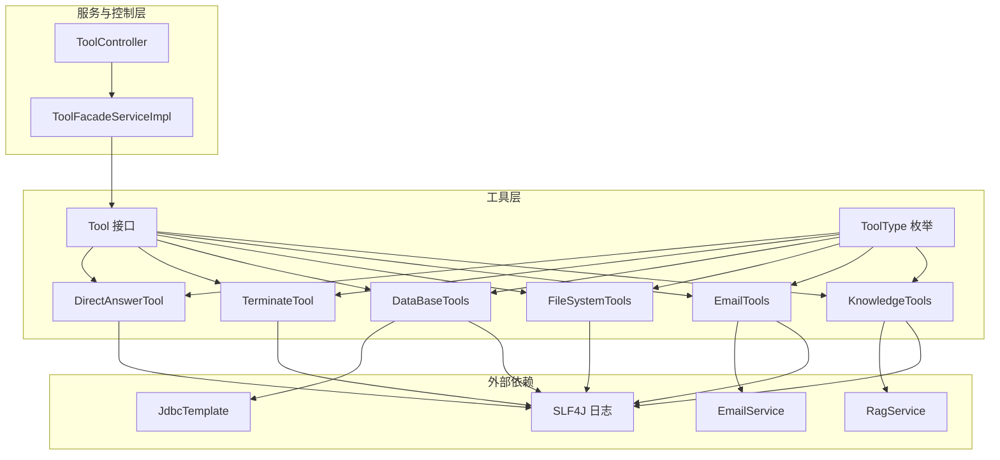
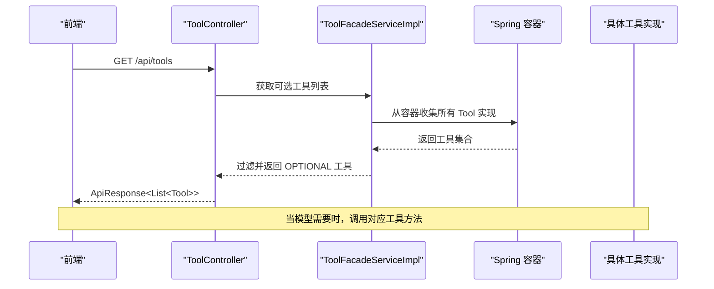
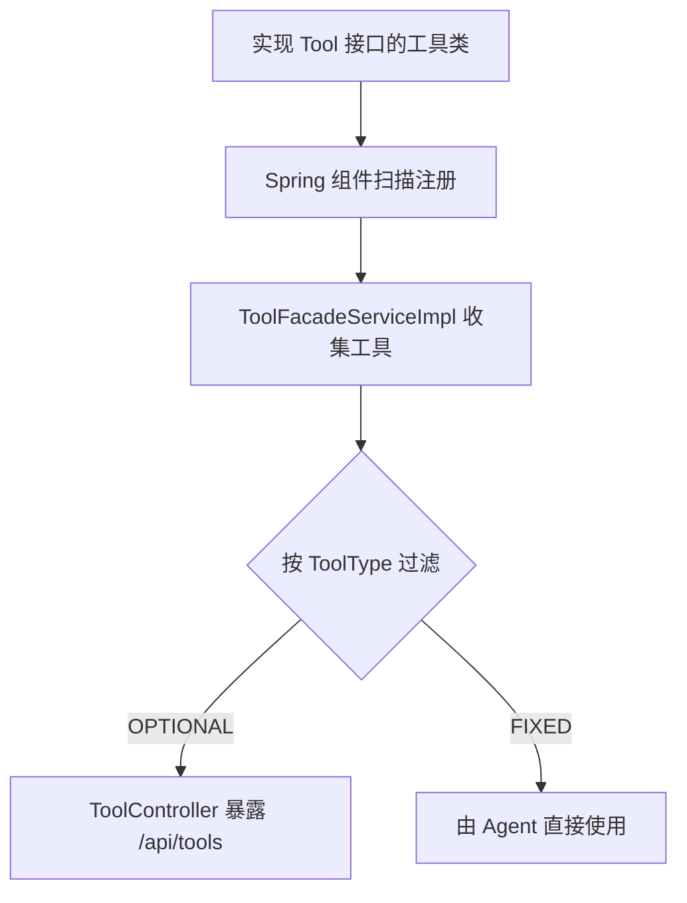
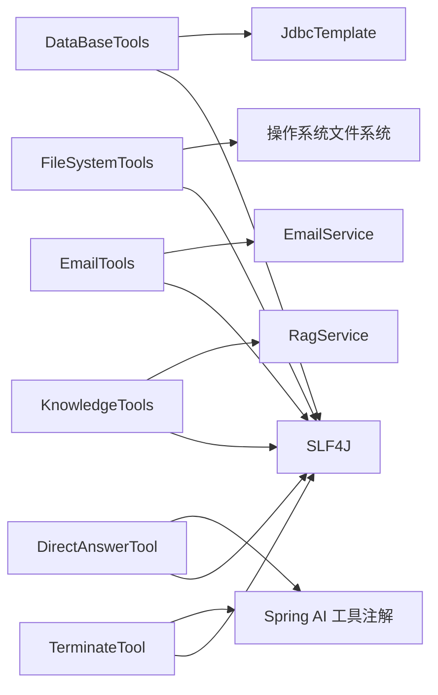

# 自定义工具开发

<cite>
**本文引用的文件**
- [Tool.java](file://jchatmind/src/main/java/com/kama/jchatmind/agent/tools/Tool.java)
- [ToolType.java](file://jchatmind/src/main/java/com/kama/jchatmind/agent/tools/ToolType.java)
- [ToolController.java](file://jchatmind/src/main/java/com/kama/jchatmind/controller/ToolController.java)
- [ToolFacadeServiceImpl.java](file://jchatmind/src/main/java/com/kama/jchatmind/service/impl/ToolFacadeServiceImpl.java)
- [DirectAnswerTool.java](file://jchatmind/src/main/java/com/kama/jchatmind/agent/tools/DirectAnswerTool.java)
- [TerminateTool.java](file://jchatmind/src/main/java/com/kama/jchatmind/agent/tools/TerminateTool.java)
- [DataBaseTools.java](file://jchatmind/src/main/java/com/kama/jchatmind/agent/tools/DataBaseTools.java)
- [FileSystemTools.java](file://jchatmind/src/main/java/com/kama/jchatmind/agent/tools/FileSystemTools.java)
- [EmailTools.java](file://jchatmind/src/main/java/com/kama/jchatmind/agent/tools/EmailTools.java)
- [KnowledgeTools.java](file://jchatmind/src/main/java/com/kama/jchatmind/agent/tools/KnowledgeTools.java)
- [CityTool.java](file://jchatmind/src/main/java/com/kama/jchatmind/agent/tools/test/CityTool.java)
- [DateTool.java](file://jchatmind/src/main/java/com/kama/jchatmind/agent/tools/test/DateTool.java)
- [WeatherTool.java](file://jchatmind/src/main/java/com/kama/jchatmind/agent/tools/test/WeatherTool.java)
- [BizException.java](file://jchatmind/src/main/java/com/kama/jchatmind/exception/BizException.java)
- [GlobalExceptionHandler.java](file://jchatmind/src/main/java/com/kama/jchatmind/exception/GlobalExceptionHandler.java)
- [application.yaml](file://jchatmind/src/main/resources/application.yaml)
</cite>

## 目录
1. [简介](#简介)
2. [项目结构](#项目结构)
3. [核心组件](#核心组件)
4. [架构总览](#架构总览)
5. [详细组件分析](#详细组件分析)
6. [依赖分析](#依赖分析)
7. [性能考量](#性能考量)
8. [故障排查指南](#故障排查指南)
9. [结论](#结论)
10. [附录](#附录)

## 简介
本指南面向希望在系统中开发“自定义工具”的工程师，围绕工具接口设计、类型体系、实现规范、注册与暴露、参数校验、异常处理、日志记录、安全防护、生命周期与性能优化、调试方法以及测试与质量保障等方面，提供从入门到进阶的完整实践路径。文档基于仓库中的真实代码进行分析，确保可操作性与可追溯性。

## 项目结构
工具能力主要位于后端模块的 agent.tools 包中，通过 Spring 组件装配，经由服务门面与控制器对外暴露。关键路径如下：
- 接口与类型：agent.tools 包下的 Tool 接口与 ToolType 枚举
- 工具实现：agent.tools 下的各类具体工具类
- 门面与控制器：service.impl 下的 ToolFacadeServiceImpl 与 controller 下的 ToolController
- 配置与异常：resources/application.yaml 与 exception 下的全局异常处理器

图示来源
- [Tool.java:1-10](file://jchatmind/src/main/java/com/kama/jchatmind/agent/tools/Tool.java#L1-L10)
- [ToolType.java:1-9](file://jchatmind/src/main/java/com/kama/jchatmind/agent/tools/ToolType.java#L1-L9)
- [DirectAnswerTool.java:1-30](file://jchatmind/src/main/java/com/kama/jchatmind/agent/tools/DirectAnswerTool.java#L1-L30)
- [TerminateTool.java:1-26](file://jchatmind/src/main/java/com/kama/jchatmind/agent/tools/TerminateTool.java#L1-L26)
- [DataBaseTools.java:1-147](file://jchatmind/src/main/java/com/kama/jchatmind/agent/tools/DataBaseTools.java#L1-L147)
- [FileSystemTools.java:1-342](file://jchatmind/src/main/java/com/kama/jchatmind/agent/tools/FileSystemTools.java#L1-L342)
- [EmailTools.java:1-68](file://jchatmind/src/main/java/com/kama/jchatmind/agent/tools/EmailTools.java#L1-L68)
- [KnowledgeTools.java:1-41](file://jchatmind/src/main/java/com/kama/jchatmind/agent/tools/KnowledgeTools.java#L1-L41)
- [ToolFacadeServiceImpl.java:1-38](file://jchatmind/src/main/java/com/kama/jchatmind/service/impl/ToolFacadeServiceImpl.java#L1-L38)
- [ToolController.java:1-26](file://jchatmind/src/main/java/com/kama/jchatmind/controller/ToolController.java#L1-L26)

章节来源
- [Tool.java:1-10](file://jchatmind/src/main/java/com/kama/jchatmind/agent/tools/Tool.java#L1-L10)
- [ToolType.java:1-9](file://jchatmind/src/main/java/com/kama/jchatmind/agent/tools/ToolType.java#L1-L9)
- [ToolFacadeServiceImpl.java:1-38](file://jchatmind/src/main/java/com/kama/jchatmind/service/impl/ToolFacadeServiceImpl.java#L1-L38)
- [ToolController.java:1-26](file://jchatmind/src/main/java/com/kama/jchatmind/controller/ToolController.java#L1-L26)

## 核心组件
- Tool 接口：定义工具的最小契约，包含名称、描述与类型三要素，供上层识别与筛选。
- ToolType 枚举：区分固定工具与可选工具两类，便于按需装配与暴露。
- 工具实现：各工具类实现 Tool 接口，并通过注解声明工具方法，供大模型调用。
- 门面与控制器：ToolFacadeServiceImpl 提供按类型过滤工具的能力；ToolController 暴露可选工具列表给前端。

章节来源
- [Tool.java:1-10](file://jchatmind/src/main/java/com/kama/jchatmind/agent/tools/Tool.java#L1-L10)
- [ToolType.java:1-9](file://jchatmind/src/main/java/com/kama/jchatmind/agent/tools/ToolType.java#L1-L9)
- [ToolFacadeServiceImpl.java:1-38](file://jchatmind/src/main/java/com/kama/jchatmind/service/impl/ToolFacadeServiceImpl.java#L1-L38)
- [ToolController.java:1-26](file://jchatmind/src/main/java/com/kama/jchatmind/controller/ToolController.java#L1-L26)

## 架构总览
工具的运行时交互链路如下：前端通过控制器获取可选工具列表；工具方法由注解暴露给模型；模型根据上下文决定调用哪些工具；工具在实现类中完成参数校验、安全检查、日志记录与外部依赖调用；异常统一由全局异常处理器捕获并返回标准响应。

图示来源
- [ToolController.java:1-26](file://jchatmind/src/main/java/com/kama/jchatmind/controller/ToolController.java#L1-L26)
- [ToolFacadeServiceImpl.java:1-38](file://jchatmind/src/main/java/com/kama/jchatmind/service/impl/ToolFacadeServiceImpl.java#L1-L38)

## 详细组件分析

### Tool 接口与实现规范
- 设计原则
  - 命名清晰且唯一：getName() 应返回稳定、可辨识的工具标识。
  - 描述准确：getDescription() 应简洁说明工具用途与边界。
  - 类型明确：getType() 应返回 FIXED 或 OPTIONAL，决定装配与暴露策略。
- 实现建议
  - 使用注解声明工具方法，确保模型侧能正确识别签名与用途。
  - 在工具方法中进行参数校验与安全检查，避免越权或危险操作。
  - 记录必要的日志，便于审计与排障。

章节来源
- [Tool.java:1-10](file://jchatmind/src/main/java/com/kama/jchatmind/agent/tools/Tool.java#L1-L10)

### ToolType 枚举与应用场景
- FIXED：固定工具，通常为通用能力（如直接回答、终止循环），所有 Agent 必须具备。
- OPTIONAL：可选工具，按需装配（如数据库查询、文件系统操作、邮件发送、RAG 检索）。

章节来源
- [ToolType.java:1-9](file://jchatmind/src/main/java/com/kama/jchatmind/agent/tools/ToolType.java#L1-L9)

### 工具注册与暴露流程
- 组件装配：工具实现类使用组件注解注册为 Spring Bean，由容器收集。
- 门面过滤：ToolFacadeServiceImpl 依据 ToolType 进行过滤，提供按类型获取工具列表的能力。
- 控制器暴露：ToolController 暴露 GET /api/tools，返回 OPTIONAL 工具集合，供前端展示与选择。

图示来源
- [Tool.java:1-10](file://jchatmind/src/main/java/com/kama/jchatmind/agent/tools/Tool.java#L1-L10)
- [ToolType.java:1-9](file://jchatmind/src/main/java/com/kama/jchatmind/agent/tools/ToolType.java#L1-L9)
- [ToolFacadeServiceImpl.java:1-38](file://jchatmind/src/main/java/com/kama/jchatmind/service/impl/ToolFacadeServiceImpl.java#L1-L38)
- [ToolController.java:1-26](file://jchatmind/src/main/java/com/kama/jchatmind/controller/ToolController.java#L1-L26)

章节来源
- [ToolFacadeServiceImpl.java:1-38](file://jchatmind/src/main/java/com/kama/jchatmind/service/impl/ToolFacadeServiceImpl.java#L1-L38)
- [ToolController.java:1-26](file://jchatmind/src/main/java/com/kama/jchatmind/controller/ToolController.java#L1-L26)

### 参数验证、异常处理与日志记录最佳实践
- 参数验证
  - 在工具方法入口处进行空值、格式、范围校验，尽早失败。
  - 对外部输入（如文件路径、邮箱地址）进行白名单或正则约束。
- 异常处理
  - 使用统一的业务异常类型与全局异常处理器，保证错误信息一致、可控。
  - 对于不可恢复的异常，记录堆栈并返回友好提示。
- 日志记录
  - 关键路径打点（开始/结束、成功/失败、安全拦截），便于审计与定位。

章节来源
- [EmailTools.java:1-68](file://jchatmind/src/main/java/com/kama/jchatmind/agent/tools/EmailTools.java#L1-L68)
- [FileSystemTools.java:1-342](file://jchatmind/src/main/java/com/kama/jchatmind/agent/tools/FileSystemTools.java#L1-L342)
- [BizException.java:1-15](file://jchatmind/src/main/java/com/kama/jchatmind/exception/BizException.java#L1-L15)
- [GlobalExceptionHandler.java:1-38](file://jchatmind/src/main/java/com/kama/jchatmind/exception/GlobalExceptionHandler.java#L1-L38)

### 安全考虑
- 文件系统工具对路径进行规范化与基座目录限制，防止路径穿越。
- 数据库工具严格限制只读查询，拒绝非 SELECT 语句。
- 邮件工具对邮箱格式进行简单校验，避免无效投递。

章节来源
- [FileSystemTools.java:1-342](file://jchatmind/src/main/java/com/kama/jchatmind/agent/tools/FileSystemTools.java#L1-L342)
- [DataBaseTools.java:1-147](file://jchatmind/src/main/java/com/kama/jchatmind/agent/tools/DataBaseTools.java#L1-L147)
- [EmailTools.java:1-68](file://jchatmind/src/main/java/com/kama/jchatmind/agent/tools/EmailTools.java#L1-L68)

### 生命周期管理与性能优化
- 生命周期
  - 工具作为 Spring Bean，随应用启动加载；通过构造注入依赖（如 JDBC、邮件、RAG）。
  - 控制器与门面为单例，工具方法应保持幂等与无状态特性。
- 性能优化
  - 数据库查询：合理分页、避免 N+1、必要时缓存只读元数据。
  - 文件系统：批量 IO 合并、避免大文件频繁读写、注意磁盘配额。
  - 异步处理：邮件发送采用异步，避免阻塞工具调用。

章节来源
- [DataBaseTools.java:1-147](file://jchatmind/src/main/java/com/kama/jchatmind/agent/tools/DataBaseTools.java#L1-L147)
- [EmailTools.java:1-68](file://jchatmind/src/main/java/com/kama/jchatmind/agent/tools/EmailTools.java#L1-L68)
- [application.yaml:1-43](file://jchatmind/src/main/resources/application.yaml#L1-L43)

### 调试方法
- 开启相应日志级别，观察工具方法的输入输出与异常路径。
- 使用最小化样例快速复现问题（如最小 SQL、最小文件路径）。
- 结合单元测试与集成测试，覆盖正常与异常分支。

### 测试策略与质量保证
- 单元测试：针对工具方法的输入域、边界条件与异常路径进行断言。
- 集成测试：连接真实依赖（数据库、文件系统、邮件服务），验证端到端行为。
- 安全测试：路径穿越、SQL 注入、非法输入等场景的回归。

## 依赖分析
工具实现依赖外部服务与框架能力，主要包括：
- Spring JDBC：数据库查询能力
- EmailService：异步邮件发送
- RagService：RAG 检索
- SLF4J：日志记录
- Spring AI 工具注解：将方法暴露给模型

图示来源
- [DataBaseTools.java:1-147](file://jchatmind/src/main/java/com/kama/jchatmind/agent/tools/DataBaseTools.java#L1-L147)
- [FileSystemTools.java:1-342](file://jchatmind/src/main/java/com/kama/jchatmind/agent/tools/FileSystemTools.java#L1-L342)
- [EmailTools.java:1-68](file://jchatmind/src/main/java/com/kama/jchatmind/agent/tools/EmailTools.java#L1-L68)
- [KnowledgeTools.java:1-41](file://jchatmind/src/main/java/com/kama/jchatmind/agent/tools/KnowledgeTools.java#L1-L41)
- [DirectAnswerTool.java:1-30](file://jchatmind/src/main/java/com/kama/jchatmind/agent/tools/DirectAnswerTool.java#L1-L30)
- [TerminateTool.java:1-26](file://jchatmind/src/main/java/com/kama/jchatmind/agent/tools/TerminateTool.java#L1-L26)

章节来源
- [application.yaml:1-43](file://jchatmind/src/main/resources/application.yaml#L1-L43)

## 性能考量
- I/O 密集型工具（文件、邮件）优先采用异步或批处理策略，降低延迟。
- 数据库查询避免一次性返回大量数据，必要时分页或投影字段。
- 缓存只读数据（如元数据、配置），减少重复查询。
- 合理设置连接池与超时时间，避免资源泄露。

## 故障排查指南
- 无法获取工具列表
  - 检查工具类是否被 Spring 正确注册（组件注解与包扫描路径）。
  - 确认 ToolController 的返回路径与 ApiResponse 格式。
- 工具调用失败
  - 查看工具方法的日志输出，定位参数校验、安全拦截或外部依赖异常。
  - 使用最小样例复现，逐步缩小范围。
- 全局异常处理
  - 业务异常会被统一包装为标准响应；未知异常记录日志并返回通用错误信息。

章节来源
- [ToolController.java:1-26](file://jchatmind/src/main/java/com/kama/jchatmind/controller/ToolController.java#L1-L26)
- [GlobalExceptionHandler.java:1-38](file://jchatmind/src/main/java/com/kama/jchatmind/exception/GlobalExceptionHandler.java#L1-L38)

## 结论
通过统一的 Tool 接口与 ToolType 分类，结合 Spring 组件化与门面控制器的暴露机制，系统实现了灵活、可扩展的工具生态。遵循参数校验、安全防护、日志与异常处理的最佳实践，配合性能优化与完善的测试策略，可以高质量地交付各类工具，满足多样化的业务需求。

## 附录

### 自定义工具开发流程（从接口实现到注册）
- 明确工具职责与类型
  - 选择 FIXED 或 OPTIONAL，确定是否需要对外暴露给前端。
- 实现 Tool 接口
  - 实现 getName()/getDescription()/getType()，并添加工具方法。
- 参数校验与安全检查
  - 在方法入口进行空值、格式、范围与路径/SQL/邮箱等专项校验。
- 外部依赖与日志
  - 通过构造注入所需依赖，记录关键路径日志。
- 异步与性能
  - 对耗时操作采用异步或批处理，避免阻塞。
- 注册与暴露
  - 使用组件注解注册为 Bean；通过门面与控制器按需暴露 OPTIONAL 工具。
- 测试与上线
  - 编写单元与集成测试，覆盖正常与异常路径；上线前进行安全与性能评估。

章节来源
- [Tool.java:1-10](file://jchatmind/src/main/java/com/kama/jchatmind/agent/tools/Tool.java#L1-L10)
- [ToolType.java:1-9](file://jchatmind/src/main/java/com/kama/jchatmind/agent/tools/ToolType.java#L1-L9)
- [ToolFacadeServiceImpl.java:1-38](file://jchatmind/src/main/java/com/kama/jchatmind/service/impl/ToolFacadeServiceImpl.java#L1-L38)
- [ToolController.java:1-26](file://jchatmind/src/main/java/com/kama/jchatmind/controller/ToolController.java#L1-L26)

### 示例参考（不含代码内容，仅路径）
- 直接回答工具：[DirectAnswerTool.java:1-30](file://jchatmind/src/main/java/com/kama/jchatmind/agent/tools/DirectAnswerTool.java#L1-L30)
- 终止工具：[TerminateTool.java:1-26](file://jchatmind/src/main/java/com/kama/jchatmind/agent/tools/TerminateTool.java#L1-L26)
- 数据库查询工具：[DataBaseTools.java:1-147](file://jchatmind/src/main/java/com/kama/jchatmind/agent/tools/DataBaseTools.java#L1-L147)
- 文件系统工具：[FileSystemTools.java:1-342](file://jchatmind/src/main/java/com/kama/jchatmind/agent/tools/FileSystemTools.java#L1-L342)
- 邮件发送工具：[EmailTools.java:1-68](file://jchatmind/src/main/java/com/kama/jchatmind/agent/tools/EmailTools.java#L1-L68)
- RAG 检索工具：[KnowledgeTools.java:1-41](file://jchatmind/src/main/java/com/kama/jchatmind/agent/tools/KnowledgeTools.java#L1-L41)
- 测试工具（城市/日期/天气）：[CityTool.java:1-29](file://jchatmind/src/main/java/com/kama/jchatmind/agent/tools/test/CityTool.java#L1-L29)，[DateTool.java:1-32](file://jchatmind/src/main/java/com/kama/jchatmind/agent/tools/test/DateTool.java#L1-L32)，[WeatherTool.java:1-31](file://jchatmind/src/main/java/com/kama/jchatmind/agent/tools/test/WeatherTool.java#L1-L31)