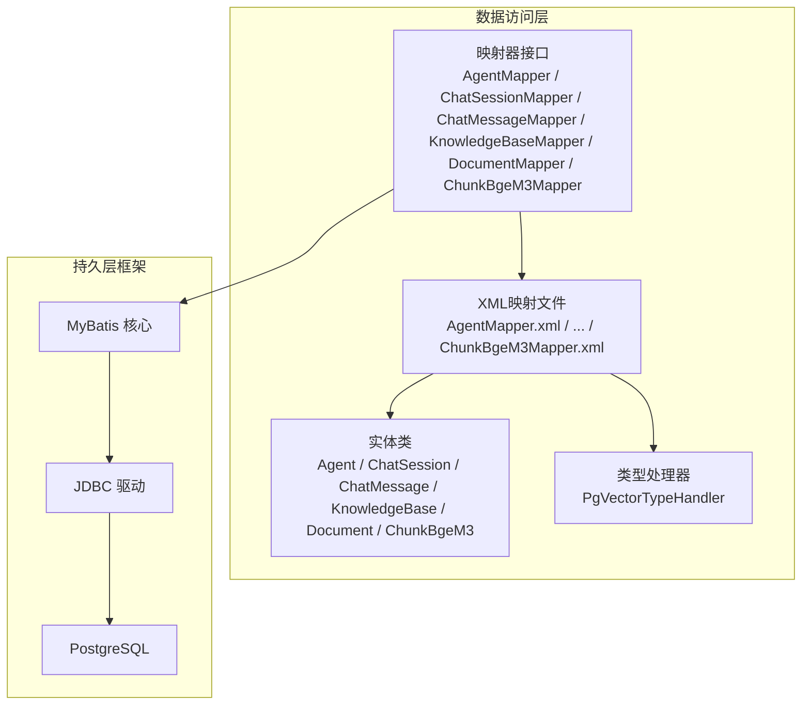
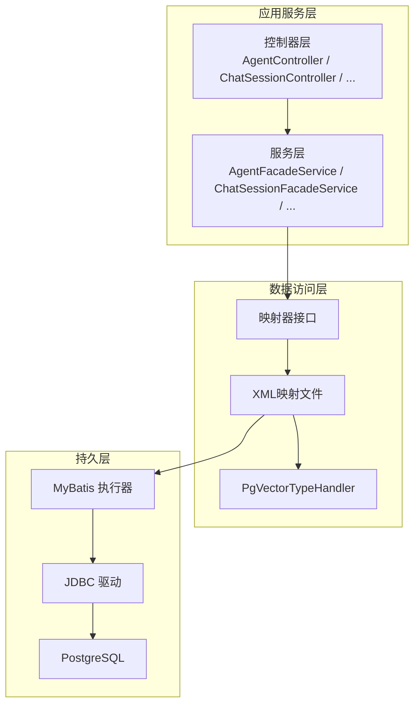
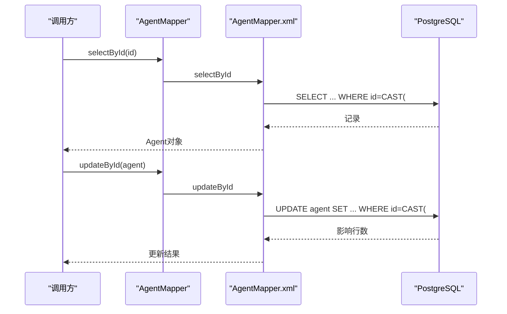
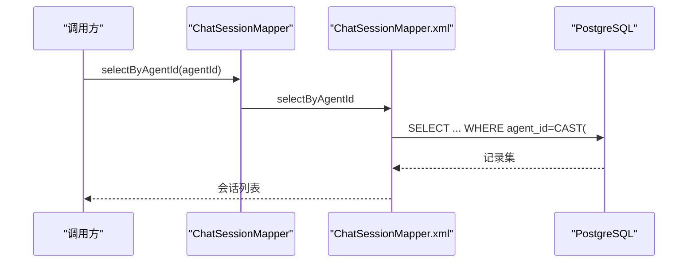
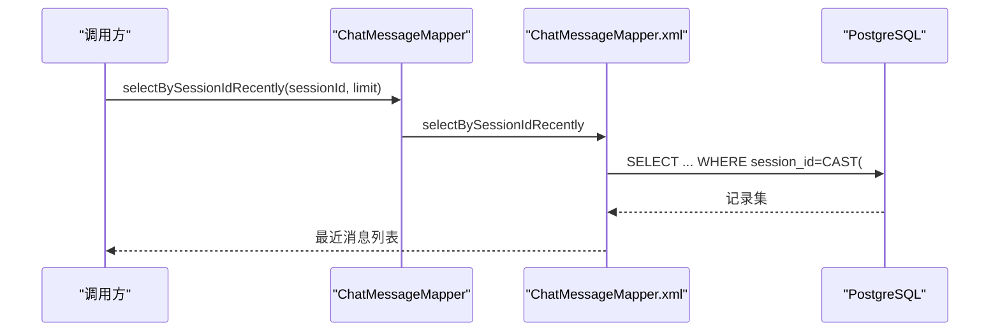
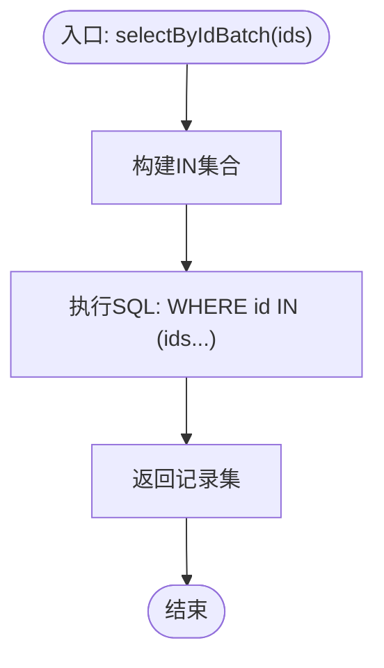
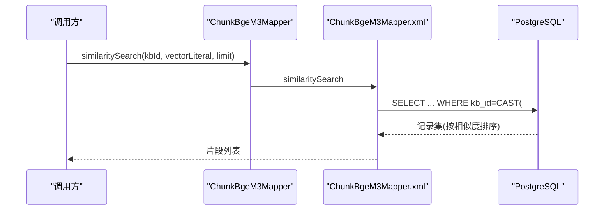
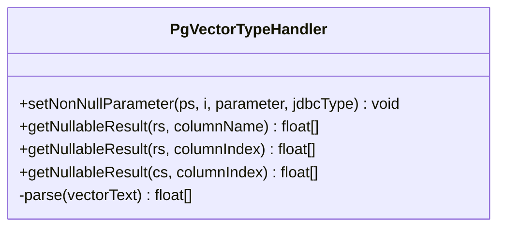
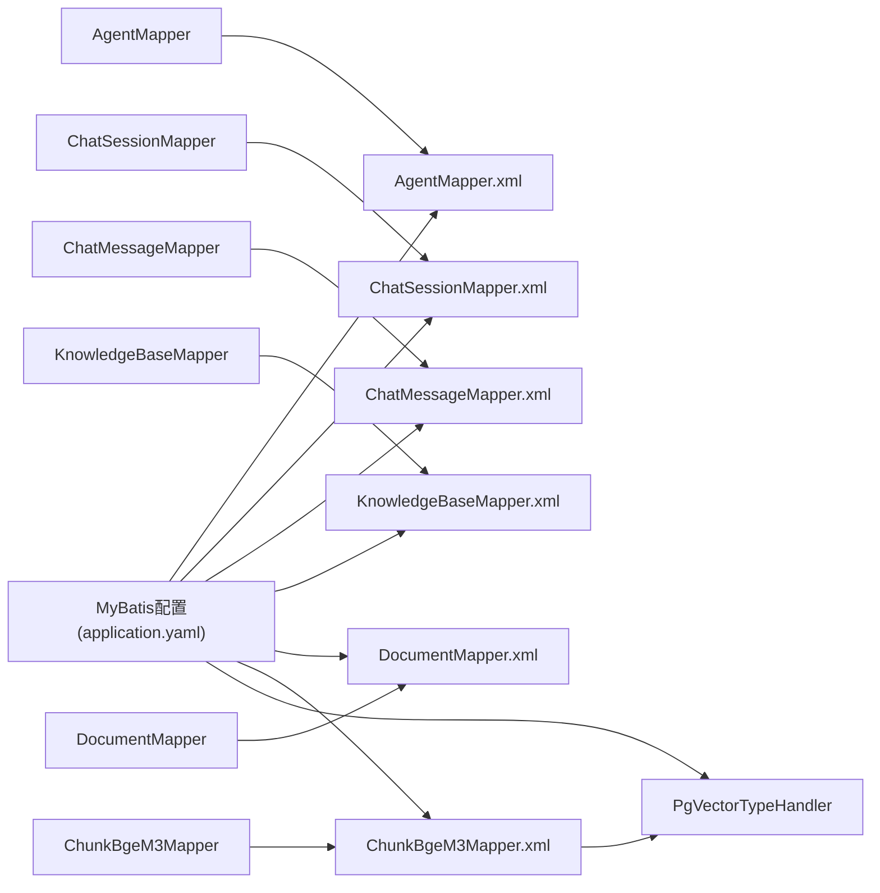

# 数据访问层

<cite>
**本文引用的文件**
- [AgentMapper.java](file://jchatmind/src/main/java/com/kama/jchatmind/mapper/AgentMapper.java)
- [ChatSessionMapper.java](file://jchatmind/src/main/java/com/kama/jchatmind/mapper/ChatSessionMapper.java)
- [ChatMessageMapper.java](file://jchatmind/src/main/java/com/kama/jchatmind/mapper/ChatMessageMapper.java)
- [KnowledgeBaseMapper.java](file://jchatmind/src/main/java/com/kama/jchatmind/mapper/KnowledgeBaseMapper.java)
- [DocumentMapper.java](file://jchatmind/src/main/java/com/kama/jchatmind/mapper/DocumentMapper.java)
- [ChunkBgeM3Mapper.java](file://jchatmind/src/main/java/com/kama/jchatmind/mapper/ChunkBgeM3Mapper.java)
- [AgentMapper.xml](file://jchatmind/src/main/resources/mapper/AgentMapper.xml)
- [ChatSessionMapper.xml](file://jchatmind/src/main/resources/mapper/ChatSessionMapper.xml)
- [ChatMessageMapper.xml](file://jchatmind/src/main/resources/mapper/ChatMessageMapper.xml)
- [KnowledgeBaseMapper.xml](file://jchatmind/src/main/resources/mapper/KnowledgeBaseMapper.xml)
- [DocumentMapper.xml](file://jchatmind/src/main/resources/mapper/DocumentMapper.xml)
- [ChunkBgeM3Mapper.xml](file://jchatmind/src/main/resources/mapper/ChunkBgeM3Mapper.xml)
- [PgVectorTypeHandler.java](file://jchatmind/src/main/java/com/kama/jchatmind/typehandler/PgVectorTypeHandler.java)
- [application.yaml](file://jchatmind/src/main/resources/application.yaml)
- [Agent.java](file://jchatmind/src/main/java/com/kama/jchatmind/model/entity/Agent.java)
- [ChatSession.java](file://jchatmind/src/main/java/com/kama/jchatmind/model/entity/ChatSession.java)
- [ChatMessage.java](file://jchatmind/src/main/java/com/kama/jchatmind/model/entity/ChatMessage.java)
- [KnowledgeBase.java](file://jchatmind/src/main/java/com/kama/jchatmind/model/entity/KnowledgeBase.java)
- [Document.java](file://jchatmind/src/main/java/com/kama/jchatmind/model/entity/Document.java)
- [ChunkBgeM3.java](file://jchatmind/src/main/java/com/kama/jchatmind/model/entity/ChunkBgeM3.java)
</cite>

## 目录
1. [简介](#简介)
2. [项目结构](#项目结构)
3. [核心组件](#核心组件)
4. [架构总览](#架构总览)
5. [详细组件分析](#详细组件分析)
6. [依赖分析](#依赖分析)
7. [性能考虑](#性能考虑)
8. [故障排查指南](#故障排查指南)
9. [结论](#结论)
10. [附录](#附录)

## 简介
本技术文档聚焦于JChatMind项目的“数据访问层”，系统性解析基于MyBatis的映射器设计与实现，覆盖以下方面：
- 映射器接口设计：AgentMapper、ChatSessionMapper、ChatMessageMapper、KnowledgeBaseMapper、DocumentMapper、ChunkBgeM3Mapper 的职责与方法约定
- XML映射文件：SQL语句设计、动态SQL构建、JSON字段与向量字段的处理策略
- 类型处理器：PgVectorTypeHandler 对PostgreSQL向量类型的读写转换
- 数据访问模式：CRUD、批量查询、相似度检索、事务边界建议
- 性能优化：查询排序、索引利用、分页与限制、连接池配置与监控要点
- 运维与排障：常见问题定位与修复建议

## 项目结构
数据访问层采用“接口 + XML映射 + 实体 + 类型处理器”的标准MyBatis组织方式，按领域模型划分映射器与对应表：
- 接口位于 mapper 包，声明CRUD与业务查询方法
- XML映射文件位于 resources/mapper，命名与接口一致
- 实体类位于 model/entity，字段与数据库列一一对应
- 类型处理器位于 typehandler，负责特殊类型（如向量）的序列化/反序列化

图表来源
- [AgentMapper.java:1-26](file://jchatmind/src/main/java/com/kama/jchatmind/mapper/AgentMapper.java#L1-L26)
- [AgentMapper.xml:1-119](file://jchatmind/src/main/resources/mapper/AgentMapper.xml#L1-L119)
- [PgVectorTypeHandler.java:1-54](file://jchatmind/src/main/java/com/kama/jchatmind/typehandler/PgVectorTypeHandler.java#L1-L54)

章节来源
- [AgentMapper.java:1-26](file://jchatmind/src/main/java/com/kama/jchatmind/mapper/AgentMapper.java#L1-L26)
- [ChatSessionMapper.java:1-28](file://jchatmind/src/main/java/com/kama/jchatmind/mapper/ChatSessionMapper.java#L1-L28)
- [ChatMessageMapper.java:1-28](file://jchatmind/src/main/java/com/kama/jchatmind/mapper/ChatMessageMapper.java#L1-L28)
- [KnowledgeBaseMapper.java:1-28](file://jchatmind/src/main/java/com/kama/jchatmind/mapper/KnowledgeBaseMapper.java#L1-L28)
- [DocumentMapper.java:1-28](file://jchatmind/src/main/java/com/kama/jchatmind/mapper/DocumentMapper.java#L1-L28)
- [ChunkBgeM3Mapper.java:1-31](file://jchatmind/src/main/java/com/kama/jchatmind/mapper/ChunkBgeM3Mapper.java#L1-L31)
- [AgentMapper.xml:1-119](file://jchatmind/src/main/resources/mapper/AgentMapper.xml#L1-L119)
- [ChatSessionMapper.xml:1-99](file://jchatmind/src/main/resources/mapper/ChatSessionMapper.xml#L1-L99)
- [ChatMessageMapper.xml:1-110](file://jchatmind/src/main/resources/mapper/ChatMessageMapper.xml#L1-L110)
- [KnowledgeBaseMapper.xml:1-101](file://jchatmind/src/main/resources/mapper/KnowledgeBaseMapper.xml#L1-L101)
- [DocumentMapper.xml:1-118](file://jchatmind/src/main/resources/mapper/DocumentMapper.xml#L1-L118)
- [ChunkBgeM3Mapper.xml:1-102](file://jchatmind/src/main/resources/mapper/ChunkBgeM3Mapper.xml#L1-L102)
- [application.yaml:1-43](file://jchatmind/src/main/resources/application.yaml#L1-L43)

## 核心组件
- 映射器接口：每个接口对应一张表，提供基础CRUD与业务查询方法，如按主键查询、列表查询、批量查询、删除、更新等；部分接口还提供相似度检索（向量）或最近消息查询等
- XML映射文件：定义resultMap、SQL片段、插入/更新/删除/查询语句；大量使用动态SQL（<if>）与JSON/向量类型转换
- 实体类：与表结构一一对应，包含时间戳、JSON字符串、向量数组等字段
- 类型处理器：PgVectorTypeHandler 将float[]与PostgreSQL vector类型互转

章节来源
- [AgentMapper.java:14-25](file://jchatmind/src/main/java/com/kama/jchatmind/mapper/AgentMapper.java#L14-L25)
- [ChatSessionMapper.java:14-27](file://jchatmind/src/main/java/com/kama/jchatmind/mapper/ChatSessionMapper.java#L14-L27)
- [ChatMessageMapper.java:14-27](file://jchatmind/src/main/java/com/kama/jchatmind/mapper/ChatMessageMapper.java#L14-L27)
- [KnowledgeBaseMapper.java:14-27](file://jchatmind/src/main/java/com/kama/jchatmind/mapper/KnowledgeBaseMapper.java#L14-L27)
- [DocumentMapper.java:14-27](file://jchatmind/src/main/java/com/kama/jchatmind/mapper/DocumentMapper.java#L14-L27)
- [ChunkBgeM3Mapper.java:15-30](file://jchatmind/src/main/java/com/kama/jchatmind/mapper/ChunkBgeM3Mapper.java#L15-L30)
- [PgVectorTypeHandler.java:10-54](file://jchatmind/src/main/java/com/kama/jchatmind/typehandler/PgVectorTypeHandler.java#L10-L54)

## 架构总览
下图展示数据访问层在系统中的位置与交互关系。

图表来源
- [application.yaml:35-38](file://jchatmind/src/main/resources/application.yaml#L35-L38)
- [PgVectorTypeHandler.java:10-12](file://jchatmind/src/main/java/com/kama/jchatmind/typehandler/PgVectorTypeHandler.java#L10-L12)
- [ChunkBgeM3Mapper.xml:13-13](file://jchatmind/src/main/resources/mapper/ChunkBgeM3Mapper.xml#L13-L13)

## 详细组件分析

### AgentMapper 分析
- 职责：对 agent 表进行增删改查，支持按ID查询、全量查询、按JSON字段存储的工具与知识库白名单、系统提示、模型等字段的更新
- 动态SQL：使用<if>条件拼接，仅在字段非空时更新对应列
- JSON字段：插入与更新时通过CAST(JSON字符串为jsonb)，查询时以文本形式返回，便于前端处理
- UUID参数：所有where条件均对传入ID进行CAST(uuid)

图表来源
- [AgentMapper.java:18-24](file://jchatmind/src/main/java/com/kama/jchatmind/mapper/AgentMapper.java#L18-L24)
- [AgentMapper.xml:50-117](file://jchatmind/src/main/resources/mapper/AgentMapper.xml#L50-L117)

章节来源
- [AgentMapper.java:1-26](file://jchatmind/src/main/java/com/kama/jchatmind/mapper/AgentMapper.java#L1-L26)
- [AgentMapper.xml:1-119](file://jchatmind/src/main/resources/mapper/AgentMapper.xml#L1-L119)
- [Agent.java:1-95](file://jchatmind/src/main/java/com/kama/jchatmind/model/entity/Agent.java#L1-L95)

### ChatSessionMapper 分析
- 职责：对 chat_session 表进行增删改查，支持按agentId关联查询会话列表
- 关联查询：selectByAgentId 按 agent_id 进行过滤并按更新时间倒序
- JSON元数据：metadata 字段以jsonb存储，查询时转换为文本
- UUID参数：统一使用CAST(uuid)保证类型一致性

图表来源
- [ChatSessionMapper.java:22-22](file://jchatmind/src/main/java/com/kama/jchatmind/mapper/ChatSessionMapper.java#L22-L22)
- [ChatSessionMapper.xml:65-76](file://jchatmind/src/main/resources/mapper/ChatSessionMapper.xml#L65-L76)

章节来源
- [ChatSessionMapper.java:1-28](file://jchatmind/src/main/java/com/kama/jchatmind/mapper/ChatSessionMapper.java#L1-L28)
- [ChatSessionMapper.xml:1-99](file://jchatmind/src/main/resources/mapper/ChatSessionMapper.xml#L1-L99)
- [ChatSession.java:1-73](file://jchatmind/src/main/java/com/kama/jchatmind/model/entity/ChatSession.java#L1-L73)

### ChatMessageMapper 分析
- 职责：对 chat_message 表进行增删改查，支持按会话ID查询完整历史与“最近N条”查询
- 最近消息：selectBySessionIdRecently 使用LIMIT控制返回数量，适合流式对话展示
- JSON元数据：metadata 以jsonb存储，查询时转换为文本
- UUID参数：统一使用CAST(uuid)保证类型一致性

图表来源
- [ChatMessageMapper.java:22-22](file://jchatmind/src/main/java/com/kama/jchatmind/mapper/ChatMessageMapper.java#L22-L22)
- [ChatMessageMapper.xml:72-84](file://jchatmind/src/main/resources/mapper/ChatMessageMapper.xml#L72-L84)

章节来源
- [ChatMessageMapper.java:1-28](file://jchatmind/src/main/java/com/kama/jchatmind/mapper/ChatMessageMapper.java#L1-L28)
- [ChatMessageMapper.xml:1-110](file://jchatmind/src/main/resources/mapper/ChatMessageMapper.xml#L1-L110)
- [ChatMessage.java:1-78](file://jchatmind/src/main/java/com/kama/jchatmind/model/entity/ChatMessage.java#L1-L78)

### KnowledgeBaseMapper 分析
- 职责：对 knowledge_base 表进行增删改查，支持批量ID查询（IN集合）
- 批量查询：selectByIdBatch 使用<foreach>遍历ids集合，生成IN子句
- JSON元数据：metadata 以jsonb存储，查询时转换为文本
- UUID参数：统一使用CAST(uuid)保证类型一致性

图表来源
- [KnowledgeBaseMapper.java:22-22](file://jchatmind/src/main/java/com/kama/jchatmind/mapper/KnowledgeBaseMapper.java#L22-L22)
- [KnowledgeBaseMapper.xml:65-78](file://jchatmind/src/main/resources/mapper/KnowledgeBaseMapper.xml#L65-L78)

章节来源
- [KnowledgeBaseMapper.java:1-28](file://jchatmind/src/main/java/com/kama/jchatmind/mapper/KnowledgeBaseMapper.java#L1-L28)
- [KnowledgeBaseMapper.xml:1-101](file://jchatmind/src/main/resources/mapper/KnowledgeBaseMapper.xml#L1-L101)
- [KnowledgeBase.java:1-72](file://jchatmind/src/main/java/com/kama/jchatmind/model/entity/KnowledgeBase.java#L1-L72)

### DocumentMapper 分析
- 职责：对 document 表进行增删改查，支持按知识库ID查询文档列表
- 关联查询：selectByKbId 按 kb_id 过滤并按更新时间倒序
- JSON元数据：metadata 以jsonb存储，查询时转换为文本
- UUID参数：统一使用CAST(uuid)保证类型一致性

章节来源
- [DocumentMapper.java:1-28](file://jchatmind/src/main/java/com/kama/jchatmind/mapper/DocumentMapper.java#L1-L28)
- [DocumentMapper.xml:1-118](file://jchatmind/src/main/resources/mapper/DocumentMapper.xml#L1-L118)
- [Document.java:1-83](file://jchatmind/src/main/java/com/kama/jchatmind/model/entity/Document.java#L1-L83)

### ChunkBgeM3Mapper 分析
- 职责：对 chunk_bge_m3 表进行增删改查，提供向量相似度检索
- 向量相似度：similaritySearch 使用 <-> 欧氏距离操作符，并对向量字面量进行::vector转换
- 类型处理器：PgVectorTypeHandler 负责float[]与PostgreSQL vector的双向转换
- 结果映射：embedding 字段使用JdbcType.OTHER并绑定float[]类型

图表来源
- [ChunkBgeM3Mapper.java:25-29](file://jchatmind/src/main/java/com/kama/jchatmind/mapper/ChunkBgeM3Mapper.java#L25-L29)
- [ChunkBgeM3Mapper.xml:85-100](file://jchatmind/src/main/resources/mapper/ChunkBgeM3Mapper.xml#L85-L100)
- [PgVectorTypeHandler.java:14-39](file://jchatmind/src/main/java/com/kama/jchatmind/typehandler/PgVectorTypeHandler.java#L14-L39)

章节来源
- [ChunkBgeM3Mapper.java:1-31](file://jchatmind/src/main/java/com/kama/jchatmind/mapper/ChunkBgeM3Mapper.java#L1-L31)
- [ChunkBgeM3Mapper.xml:1-102](file://jchatmind/src/main/resources/mapper/ChunkBgeM3Mapper.xml#L1-L102)
- [ChunkBgeM3.java:1-83](file://jchatmind/src/main/java/com/kama/jchatmind/model/entity/ChunkBgeM3.java#L1-L83)
- [PgVectorTypeHandler.java:1-54](file://jchatmind/src/main/java/com/kama/jchatmind/typehandler/PgVectorTypeHandler.java#L1-L54)

### 类型处理器：PgVectorTypeHandler
- 目标：将Java float[] 与PostgreSQL vector类型互转
- 写入：将float[]序列化为“[v1,v2,...,vn]”字符串，设置为Types.OTHER
- 读取：从字符串解析出float[]，支持空字符串与null值
- 注册：在application.yaml中通过type-handlers-package自动扫描注册

图表来源
- [PgVectorTypeHandler.java:10-54](file://jchatmind/src/main/java/com/kama/jchatmind/typehandler/PgVectorTypeHandler.java#L10-L54)

章节来源
- [PgVectorTypeHandler.java:1-54](file://jchatmind/src/main/java/com/kama/jchatmind/typehandler/PgVectorTypeHandler.java#L1-L54)
- [application.yaml:38-38](file://jchatmind/src/main/resources/application.yaml#L38-L38)

## 依赖分析
- 组件内聚：每个映射器与其XML文件强耦合，职责单一
- 外部依赖：MyBatis、PostgreSQL驱动、PostgreSQL数据库（含pgvector扩展）
- 类型映射：PgVectorTypeHandler 与ChunkBgeM3Mapper的embedding字段绑定
- 配置依赖：application.yaml 中的MyBatis扫描路径与类型处理器包

图表来源
- [application.yaml:35-38](file://jchatmind/src/main/resources/application.yaml#L35-L38)
- [ChunkBgeM3Mapper.xml:13-13](file://jchatmind/src/main/resources/mapper/ChunkBgeM3Mapper.xml#L13-L13)
- [PgVectorTypeHandler.java:10-12](file://jchatmind/src/main/java/com/kama/jchatmind/typehandler/PgVectorTypeHandler.java#L10-L12)

章节来源
- [application.yaml:1-43](file://jchatmind/src/main/resources/application.yaml#L1-L43)

## 性能考虑
- 查询排序与索引
  - 多处查询按时间字段排序（如按created_at或updated_at），建议在相关列上建立索引以提升排序与过滤性能
  - 相似度检索使用 <-> 操作符，建议在embedding列上建立IVFFLAT或HNSW索引（需结合pgvector版本与数据规模评估）
- 分页与限制
  - 最近消息查询使用LIMIT，避免一次性返回大量历史消息
  - 批量查询使用IN集合，注意集合大小对SQL长度与执行计划的影响
- JSON字段处理
  - 插入/更新时使用CAST(jsonb)，查询时以文本返回，减少复杂JSON解析开销
- 连接池与监控
  - application.yaml中未显式配置连接池参数，建议在生产环境补充HikariCP相关参数（如maximumPoolSize、connectionTimeout、idleTimeout等）并开启监控指标采集
- 缓存策略
  - MyBatis一级缓存在SqlSession生命周期内有效；可按场景启用二级缓存（需谨慎处理脏读与失效策略）

[本节为通用性能指导，不直接分析具体文件]

## 故障排查指南
- UUID类型错误
  - 症状：WHERE条件无法匹配或报类型不匹配
  - 排查：确认传入ID是否为UUID格式；检查XML中是否使用了CAST(uuid)
  - 参考：各XML文件的where条件均使用CAST(uuid)
- JSON字段异常
  - 症状：JSON字段插入失败或查询为空
  - 排查：确认传入字符串为合法JSON；检查XML中是否使用了CAST(jsonb)
  - 参考：Agent/ChatSession/ChatMessage/KnowledgeBase/Document的metadata/allowed_*字段
- 向量字段异常
  - 症状：向量插入失败或相似度查询报错
  - 排查：确认向量维度与模型一致；确保pgvector扩展已安装；检查PgVectorTypeHandler是否生效
  - 参考：ChunkBgeM3Mapper.xml的embedding字段与PgVectorTypeHandler
- SQL执行慢
  - 症状：大表查询、IN集合过大、相似度检索慢
  - 排查：为高频过滤与排序列建立索引；拆分批量查询；限制返回条数；评估是否需要更高效的索引方案

章节来源
- [AgentMapper.xml:62-62](file://jchatmind/src/main/resources/mapper/AgentMapper.xml#L62-L62)
- [ChatSessionMapper.xml:74-74](file://jchatmind/src/main/resources/mapper/ChatSessionMapper.xml#L74-L74)
- [ChatMessageMapper.xml:82-82](file://jchatmind/src/main/resources/mapper/ChatMessageMapper.xml#L82-L82)
- [KnowledgeBaseMapper.xml:76-76](file://jchatmind/src/main/resources/mapper/KnowledgeBaseMapper.xml#L76-L76)
- [DocumentMapper.xml:87-87](file://jchatmind/src/main/resources/mapper/DocumentMapper.xml#L87-L87)
- [ChunkBgeM3Mapper.xml:96-98](file://jchatmind/src/main/resources/mapper/ChunkBgeM3Mapper.xml#L96-L98)
- [PgVectorTypeHandler.java:14-39](file://jchatmind/src/main/java/com/kama/jchatmind/typehandler/PgVectorTypeHandler.java#L14-L39)

## 结论
本数据访问层以MyBatis为核心，通过清晰的映射器接口与XML映射文件实现了对多表的标准化CRUD与业务查询，配合PgVectorTypeHandler完成了向量类型与PostgreSQL的无缝集成。通过动态SQL与JSON/UUID处理策略，满足了聊天、知识库与向量检索的多样化需求。建议在生产环境中完善索引、连接池与监控配置，持续优化相似度检索与批量查询的性能表现。

[本节为总结性内容，不直接分析具体文件]

## 附录
- 配置参考
  - MyBatis扫描路径与类型处理器包已在application.yaml中配置
  - 数据源URL、用户名、密码、驱动类名已在application.yaml中配置
- 实体字段概览
  - Agent/ChatSession/ChatMessage/KnowledgeBase/Document/ChunkBgeM3 的字段与数据库列一一对应，注意JSON与UUID字段的处理方式

章节来源
- [application.yaml:5-8](file://jchatmind/src/main/resources/application.yaml#L5-L8)
- [application.yaml:35-38](file://jchatmind/src/main/resources/application.yaml#L35-L38)
- [Agent.java:14-35](file://jchatmind/src/main/java/com/kama/jchatmind/model/entity/Agent.java#L14-L35)
- [ChatSession.java:14-25](file://jchatmind/src/main/java/com/kama/jchatmind/model/entity/ChatSession.java#L14-L25)
- [ChatMessage.java:14-27](file://jchatmind/src/main/java/com/kama/jchatmind/model/entity/ChatMessage.java#L14-L27)
- [KnowledgeBase.java:14-24](file://jchatmind/src/main/java/com/kama/jchatmind/model/entity/KnowledgeBase.java#L14-L24)
- [Document.java:14-29](file://jchatmind/src/main/java/com/kama/jchatmind/model/entity/Document.java#L14-L29)
- [ChunkBgeM3.java:14-29](file://jchatmind/src/main/java/com/kama/jchatmind/model/entity/ChunkBgeM3.java#L14-L29)