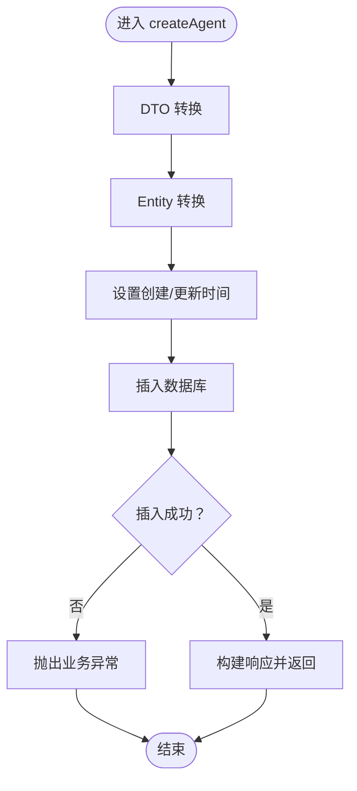
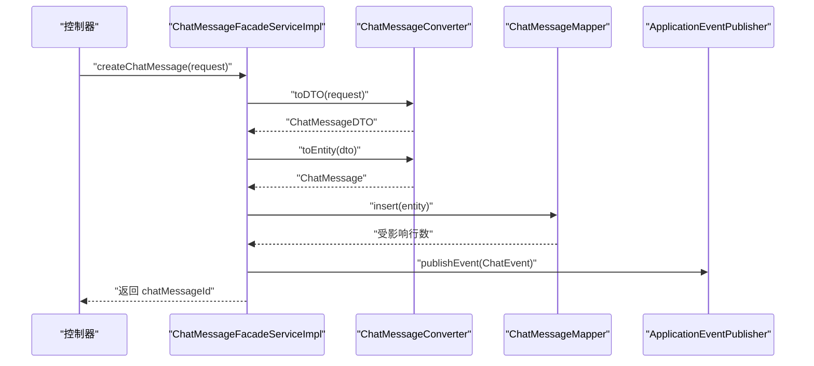
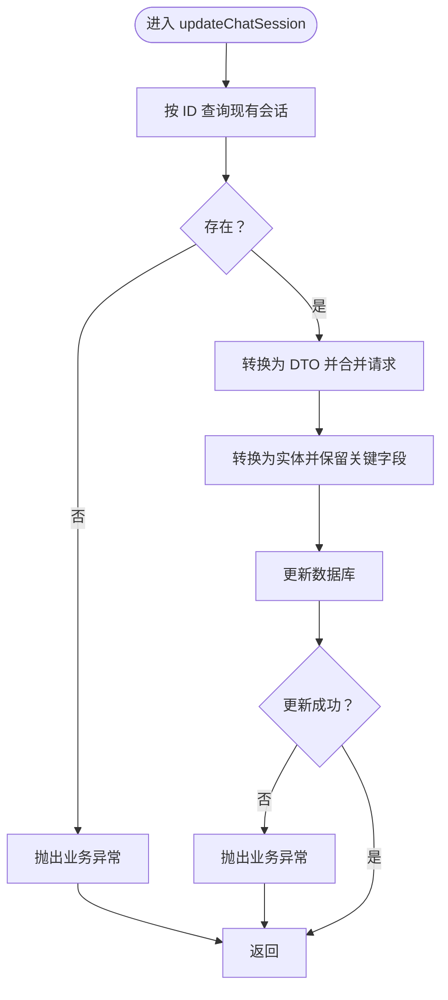
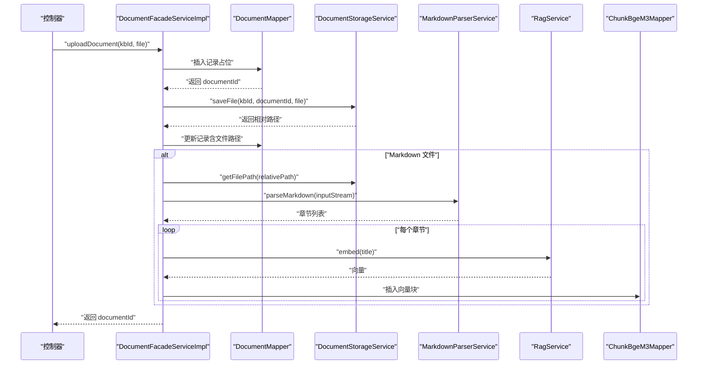
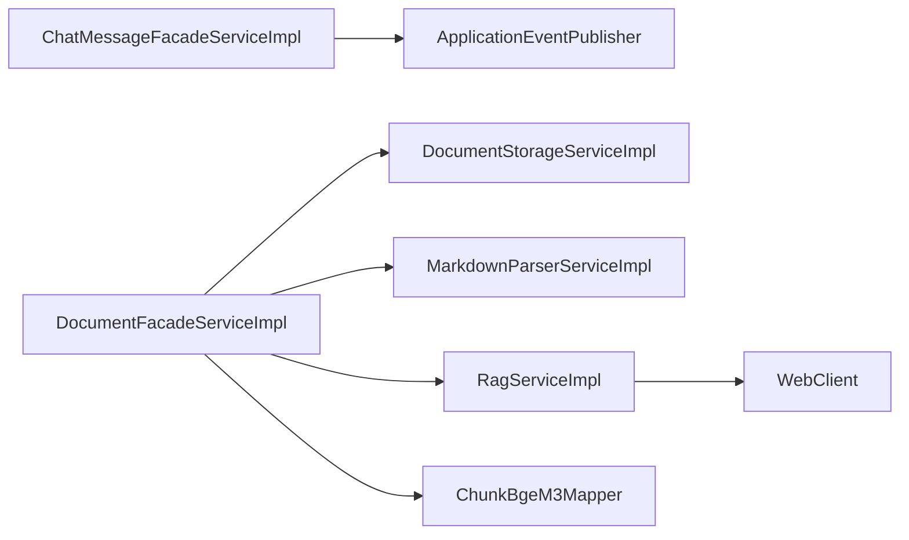

# 服务实现类

<cite>
**本文引用的文件**
- [AgentFacadeServiceImpl.java](file://jchatmind/src/main/java/com/kama/jchatmind/service/impl/AgentFacadeServiceImpl.java)
- [ChatMessageFacadeServiceImpl.java](file://jchatmind/src/main/java/com/kama/jchatmind/service/impl/ChatMessageFacadeServiceImpl.java)
- [ChatSessionFacadeServiceImpl.java](file://jchatmind/src/main/java/com/kama/jchatmind/service/impl/ChatSessionFacadeServiceImpl.java)
- [KnowledgeBaseFacadeServiceImpl.java](file://jchatmind/src/main/java/com/kama/jchatmind/service/impl/KnowledgeBaseFacadeServiceImpl.java)
- [DocumentFacadeServiceImpl.java](file://jchatmind/src/main/java/com/kama/jchatmind/service/impl/DocumentFacadeServiceImpl.java)
- [DocumentStorageServiceImpl.java](file://jchatmind/src/main/java/com/kama/jchatmind/service/impl/DocumentStorageServiceImpl.java)
- [EmailServiceImpl.java](file://jchatmind/src/main/java/com/kama/jchatmind/service/impl/EmailServiceImpl.java)
- [MarkdownParserServiceImpl.java](file://jchatmind/src/main/java/com/kama/jchatmind/service/impl/MarkdownParserServiceImpl.java)
- [RagServiceImpl.java](file://jchatmind/src/main/java/com/kama/jchatmind/service/impl/RagServiceImpl.java)
- [SseServiceImpl.java](file://jchatmind/src/main/java/com/kama/jchatmind/service/impl/SseServiceImpl.java)
- [ToolFacadeServiceImpl.java](file://jchatmind/src/main/java/com/kama/jchatmind/service/impl/ToolFacadeServiceImpl.java)
- [AgentFacadeService.java](file://jchatmind/src/main/java/com/kama/jchatmind/service/AgentFacadeService.java)
- [ChatMessageFacadeService.java](file://jchatmind/src/main/java/com/kama/jchatmind/service/ChatMessageFacadeService.java)
- [ChatSessionFacadeService.java](file://jchatmind/src/main/java/com/kama/jchatmind/service/ChatSessionFacadeService.java)
- [KnowledgeBaseFacadeService.java](file://jchatmind/src/main/java/com/kama/jchatmind/service/KnowledgeBaseFacadeService.java)
- [DocumentFacadeService.java](file://jchatmind/src/main/java/com/kama/jchatmind/service/DocumentFacadeService.java)
- [DocumentStorageService.java](file://jchatmind/src/main/java/com/kama/jchatmind/service/DocumentStorageService.java)
- [EmailService.java](file://jchatmind/src/main/java/com/kama/jchatmind/service/EmailService.java)
- [MarkdownParserService.java](file://jchatmind/src/main/java/com/kama/jchatmind/service/MarkdownParserService.java)
- [RagService.java](file://jchatmind/src/main/java/com/kama/jchatmind/service/RagService.java)
- [SseService.java](file://jchatmind/src/main/java/com/kama/jchatmind/service/SseService.java)
- [ToolFacadeService.java](file://jchatmind/src/main/java/com/kama/jchatmind/service/ToolFacadeService.java)
</cite>

## 目录
1. [简介](#简介)
2. [项目结构](#项目结构)
3. [核心组件](#核心组件)
4. [架构总览](#架构总览)
5. [详细组件分析](#详细组件分析)
6. [依赖分析](#依赖分析)
7. [性能考虑](#性能考虑)
8. [故障排查指南](#故障排查指南)
9. [结论](#结论)
10. [附录](#附录)

## 简介
本文件聚焦于 JChatMind 后端服务层的实现类，系统性梳理并解析以下服务实现与门面实现：AgentFacadeServiceImpl、ChatMessageFacadeServiceImpl、ChatSessionFacadeServiceImpl、KnowledgeBaseFacadeServiceImpl、DocumentFacadeServiceImpl；以及底层支撑服务：DocumentStorageServiceImpl、EmailServiceImpl、MarkdownParserServiceImpl、RagServiceImpl、SseServiceImpl、ToolFacadeServiceImpl。文档从职责边界、数据流、依赖注入、异常处理、事务特性与性能优化等方面进行深入剖析，并给出最佳实践与常见问题解决方案。

## 项目结构
服务层采用“门面 + Mapper/Converter + 底层服务”的分层设计：
- 门面实现负责编排业务流程、参数转换、异常包装与事件发布。
- Mapper 负责与数据库交互。
- Converter 负责 DTO/VO/Entity 之间的转换。
- 底层服务封装具体能力（如文件存储、RAG、SSE、邮件等）。

```mermaid
graph TB
subgraph "门面层"
AFS["AgentFacadeServiceImpl"]
CMS["ChatMessageFacadeServiceImpl"]
CSS["ChatSessionFacadeServiceImpl"]
KBS["KnowledgeBaseFacadeServiceImpl"]
DFS["DocumentFacadeServiceImpl"]
TFS["ToolFacadeServiceImpl"]
end
subgraph "Mapper/Converter"
AM["AgentMapper"]
CMM["ChatMessageMapper"]
CSM["ChatSessionMapper"]
KBM["KnowledgeBaseMapper"]
DM["DocumentMapper"]
CB3["ChunkBgeM3Mapper"]
AC["AgentConverter"]
CMc["ChatMessageConverter"]
CSoc["ChatSessionConverter"]
KBC["KnowledgeBaseConverter"]
DC["DocumentConverter"]
end
subgraph "底层服务"
DSS["DocumentStorageServiceImpl"]
EPS["EmailServiceImpl"]
MPS["MarkdownParserServiceImpl"]
RGS["RagServiceImpl"]
SSES["SseServiceImpl"]
end
AFS --> AM
AFS --> AC
CMS --> CMM
CMS --> CMc
CMS --> |"发布事件"| Evt["ApplicationEventPublisher"]
CSS --> CSM
CSS --> CSoc
KBS --> KBM
KBS --> KBC
DFS --> DM
DFS --> DC
DFS --> DSS
DFS --> MPS
DFS --> RGS
DFS --> CB3
TFS --> Tools["List<Tool>"]
```

图表来源
- [AgentFacadeServiceImpl.java:23-28](file://jchatmind/src/main/java/com/kama/jchatmind/service/impl/AgentFacadeServiceImpl.java#L23-L28)
- [ChatMessageFacadeServiceImpl.java:24-30](file://jchatmind/src/main/java/com/kama/jchatmind/service/impl/ChatMessageFacadeServiceImpl.java#L24-L30)
- [ChatSessionFacadeServiceImpl.java:23-28](file://jchatmind/src/main/java/com/kama/jchatmind/service/impl/ChatSessionFacadeServiceImpl.java#L23-L28)
- [KnowledgeBaseFacadeServiceImpl.java:22-27](file://jchatmind/src/main/java/com/kama/jchatmind/service/impl/KnowledgeBaseFacadeServiceImpl.java#L22-L27)
- [DocumentFacadeServiceImpl.java:33-43](file://jchatmind/src/main/java/com/kama/jchatmind/service/impl/DocumentFacadeServiceImpl.java#L33-L43)
- [ToolFacadeServiceImpl.java:11-15](file://jchatmind/src/main/java/com/kama/jchatmind/service/impl/ToolFacadeServiceImpl.java#L11-L15)

章节来源
- [AgentFacadeServiceImpl.java:23-28](file://jchatmind/src/main/java/com/kama/jchatmind/service/impl/AgentFacadeServiceImpl.java#L23-L28)
- [ChatMessageFacadeServiceImpl.java:24-30](file://jchatmind/src/main/java/com/kama/jchatmind/service/impl/ChatMessageFacadeServiceImpl.java#L24-L30)
- [ChatSessionFacadeServiceImpl.java:23-28](file://jchatmind/src/main/java/com/kama/jchatmind/service/impl/ChatSessionFacadeServiceImpl.java#L23-L28)
- [KnowledgeBaseFacadeServiceImpl.java:22-27](file://jchatmind/src/main/java/com/kama/jchatmind/service/impl/KnowledgeBaseFacadeServiceImpl.java#L22-L27)
- [DocumentFacadeServiceImpl.java:33-43](file://jchatmind/src/main/java/com/kama/jchatmind/service/impl/DocumentFacadeServiceImpl.java#L33-L43)
- [ToolFacadeServiceImpl.java:11-15](file://jchatmind/src/main/java/com/kama/jchatmind/service/impl/ToolFacadeServiceImpl.java#L11-L15)

## 核心组件
本节概述各服务实现的关键职责与行为特征：
- AgentFacadeServiceImpl：管理智能体的增删改查，统一设置时间戳，使用 JSON 转换器进行序列化/反序列化。
- ChatMessageFacadeServiceImpl：管理聊天消息的查询、创建、追加、更新与删除；支持事件发布；提供多种创建入口。
- ChatSessionFacadeServiceImpl：管理聊天会话的查询、创建、更新与删除；按 Agent 过滤会话。
- KnowledgeBaseFacadeServiceImpl：管理知识库的查询、创建、更新与删除。
- DocumentFacadeServiceImpl：管理文档的查询、创建、上传、删除与更新；上传时持久化元数据；Markdown 文件解析并生成向量块；删除时同步清理文件与记录。
- DocumentStorageServiceImpl：基于文件系统实现的文档存储，支持保存、删除、路径解析与存在性检查。
- EmailServiceImpl：基于 JavaMailSender 的异步邮件发送服务。
- MarkdownParserServiceImpl：基于 flexmark 的 Markdown 解析器，提取章节标题与正文，保留表格原始 Markdown。
- RagServiceImpl：封装本地嵌入服务调用，将文本转为向量并执行相似度检索，结果映射为内容片段。
- SseServiceImpl：基于 SseEmitter 的服务端推送，维护客户端连接池并发送消息。
- ToolFacadeServiceImpl：聚合工具集合，按类型筛选可选或固定工具。

章节来源
- [AgentFacadeServiceImpl.java:30-120](file://jchatmind/src/main/java/com/kama/jchatmind/service/impl/AgentFacadeServiceImpl.java#L30-L120)
- [ChatMessageFacadeServiceImpl.java:32-209](file://jchatmind/src/main/java/com/kama/jchatmind/service/impl/ChatMessageFacadeServiceImpl.java#L32-L209)
- [ChatSessionFacadeServiceImpl.java:30-154](file://jchatmind/src/main/java/com/kama/jchatmind/service/impl/ChatSessionFacadeServiceImpl.java#L30-L154)
- [KnowledgeBaseFacadeServiceImpl.java:29-119](file://jchatmind/src/main/java/com/kama/jchatmind/service/impl/KnowledgeBaseFacadeServiceImpl.java#L29-L119)
- [DocumentFacadeServiceImpl.java:45-310](file://jchatmind/src/main/java/com/kama/jchatmind/service/impl/DocumentFacadeServiceImpl.java#L45-L310)
- [DocumentStorageServiceImpl.java:16-88](file://jchatmind/src/main/java/com/kama/jchatmind/service/impl/DocumentStorageServiceImpl.java#L16-L88)
- [EmailServiceImpl.java:11-42](file://jchatmind/src/main/java/com/kama/jchatmind/service/impl/EmailServiceImpl.java#L11-L42)
- [MarkdownParserServiceImpl.java:20-233](file://jchatmind/src/main/java/com/kama/jchatmind/service/impl/MarkdownParserServiceImpl.java#L20-L233)
- [RagServiceImpl.java:14-65](file://jchatmind/src/main/java/com/kama/jchatmind/service/impl/RagServiceImpl.java#L14-L65)
- [SseServiceImpl.java:14-62](file://jchatmind/src/main/java/com/kama/jchatmind/service/impl/SseServiceImpl.java#L14-L62)
- [ToolFacadeServiceImpl.java:11-36](file://jchatmind/src/main/java/com/kama/jchatmind/service/impl/ToolFacadeServiceImpl.java#L11-L36)

## 架构总览
下图展示服务层与外部依赖的关系：门面实现通过 Converter/Mapper 访问数据库，通过底层服务访问外部资源（文件系统、嵌入服务、邮件、SSE 客户端）。

```mermaid
graph TB
subgraph "门面实现"
AF["AgentFacadeServiceImpl"]
CF["ChatMessageFacadeServiceImpl"]
CSF["ChatSessionFacadeServiceImpl"]
KBF["KnowledgeBaseFacadeServiceImpl"]
DF["DocumentFacadeServiceImpl"]
TF["ToolFacadeServiceImpl"]
end
subgraph "Mapper/Converter"
AM["AgentMapper"]
CMM["ChatMessageMapper"]
CSM["ChatSessionMapper"]
KBM["KnowledgeBaseMapper"]
DM["DocumentMapper"]
CB3["ChunkBgeM3Mapper"]
AC["AgentConverter"]
CMc["ChatMessageConverter"]
CSoc["ChatSessionConverter"]
KBC["KnowledgeBaseConverter"]
DC["DocumentConverter"]
end
subgraph "底层服务"
DSS["DocumentStorageServiceImpl"]
EPS["EmailServiceImpl"]
MPS["MarkdownParserServiceImpl"]
RGS["RagServiceImpl"]
SSES["SseServiceImpl"]
end
AF --> AM
AF --> AC
CF --> CMM
CF --> CMc
CSF --> CSM
CSF --> CSoc
KBF --> KBM
KBF --> KBC
DF --> DM
DF --> DC
DF --> DSS
DF --> MPS
DF --> RGS
DF --> CB3
TF --> Tools["List<Tool>"]
```

图表来源
- [AgentFacadeServiceImpl.java:23-28](file://jchatmind/src/main/java/com/kama/jchatmind/service/impl/AgentFacadeServiceImpl.java#L23-L28)
- [ChatMessageFacadeServiceImpl.java:24-30](file://jchatmind/src/main/java/com/kama/jchatmind/service/impl/ChatMessageFacadeServiceImpl.java#L24-L30)
- [ChatSessionFacadeServiceImpl.java:23-28](file://jchatmind/src/main/java/com/kama/jchatmind/service/impl/ChatSessionFacadeServiceImpl.java#L23-L28)
- [KnowledgeBaseFacadeServiceImpl.java:22-27](file://jchatmind/src/main/java/com/kama/jchatmind/service/impl/KnowledgeBaseFacadeServiceImpl.java#L22-L27)
- [DocumentFacadeServiceImpl.java:33-43](file://jchatmind/src/main/java/com/kama/jchatmind/service/impl/DocumentFacadeServiceImpl.java#L33-L43)
- [ToolFacadeServiceImpl.java:11-15](file://jchatmind/src/main/java/com/kama/jchatmind/service/impl/ToolFacadeServiceImpl.java#L11-L15)

## 详细组件分析

### AgentFacadeServiceImpl 智能代理门面实现
- 职责：提供智能体的查询、创建、删除、更新能力；统一设置创建/更新时间；通过转换器完成序列化。
- 关键点：
  - 查询：遍历实体并转换为 VO。
  - 创建：DTO → Entity，设置时间戳，插入数据库，返回生成 ID。
  - 更新：合并请求与现有实体，保留 ID 与创建时间，更新数据库。
  - 删除：校验存在性后删除。
- 异常：JSON 序列化异常包装为业务异常；数据库写入失败抛出业务异常。
- 性能：单次批量转换与数据库写入，建议在上层控制批量规模；避免在循环中重复转换。

图表来源
- [AgentFacadeServiceImpl.java:47-74](file://jchatmind/src/main/java/com/kama/jchatmind/service/impl/AgentFacadeServiceImpl.java#L47-L74)

章节来源
- [AgentFacadeServiceImpl.java:30-120](file://jchatmind/src/main/java/com/kama/jchatmind/service/impl/AgentFacadeServiceImpl.java#L30-L120)

### ChatMessageFacadeServiceImpl 聊天消息门面实现
- 职责：查询会话内消息、最近若干条消息；创建消息（支持请求与 DTO 两种入口）、追加内容、更新、删除；创建消息后发布聊天事件。
- 关键点：
  - 查询：支持按会话 ID 查询全部与最近 N 条。
  - 创建：统一转换为实体并设置时间戳；区分“普通创建”与“Agent 创建”，前者发布事件。
  - 追加：基于现有内容拼接新内容，保留角色与会话信息。
  - 更新：DTO 合并请求字段，保留关键字段不变，更新数据库。
  - 删除：先校验再删除。
- 异常：JSON 序列化异常包装为业务异常；数据库写入失败抛出业务异常；事件发布失败不影响主流程。
- 性能：事件发布使用异步发布器；追加操作避免大对象重复加载。

图表来源
- [ChatMessageFacadeServiceImpl.java:67-80](file://jchatmind/src/main/java/com/kama/jchatmind/service/impl/ChatMessageFacadeServiceImpl.java#L67-L80)
- [ChatMessageFacadeServiceImpl.java:99-124](file://jchatmind/src/main/java/com/kama/jchatmind/service/impl/ChatMessageFacadeServiceImpl.java#L99-L124)

章节来源
- [ChatMessageFacadeServiceImpl.java:32-209](file://jchatmind/src/main/java/com/kama/jchatmind/service/impl/ChatMessageFacadeServiceImpl.java#L32-L209)

### ChatSessionFacadeServiceImpl 聊天会话门面实现
- 职责：查询全部会话、按 ID 查询、按 Agent 过滤、创建、更新、删除。
- 关键点：
  - 查询：支持全量、单个、按 Agent 过滤。
  - 创建/更新/删除：统一设置时间戳，保留关键字段不变。
- 异常：JSON 序列化异常包装为业务异常；数据库写入失败抛出业务异常。
- 性能：按需查询，避免不必要的全表扫描。

图表来源
- [ChatSessionFacadeServiceImpl.java:122-154](file://jchatmind/src/main/java/com/kama/jchatmind/service/impl/ChatSessionFacadeServiceImpl.java#L122-L154)

章节来源
- [ChatSessionFacadeServiceImpl.java:30-154](file://jchatmind/src/main/java/com/kama/jchatmind/service/impl/ChatSessionFacadeServiceImpl.java#L30-L154)

### KnowledgeBaseFacadeServiceImpl 知识库门面实现
- 职责：知识库的查询、创建、更新、删除。
- 关键点：
  - 创建/更新/删除：统一设置时间戳，保留关键字段不变。
- 异常：JSON 序列化异常包装为业务异常；数据库写入失败抛出业务异常。
- 性能：按需查询，避免全量转换。

章节来源
- [KnowledgeBaseFacadeServiceImpl.java:29-119](file://jchatmind/src/main/java/com/kama/jchatmind/service/impl/KnowledgeBaseFacadeServiceImpl.java#L29-L119)

### DocumentFacadeServiceImpl 文档门面实现
- 职责：文档的查询、创建、上传、删除、更新；上传时保存文件并更新元数据；Markdown 文件解析并生成向量块；删除时同步清理文件与记录。
- 关键点：
  - 上传流程：创建记录 → 保存文件 → 更新记录（含文件路径）→ 若为 Markdown 则解析并生成 chunks。
  - 删除流程：优先尝试删除文件，若失败仅记录告警；最终删除数据库记录。
  - 解析流程：读取文件 → 解析为章节 → 对标题做嵌入 → 写入向量块表。
- 异常：IO/序列化异常包装为业务异常；解析失败不中断上传流程。
- 性能：解析与嵌入为 CPU/IO 密集，建议限流与异步化；文件路径采用相对路径便于迁移。

图表来源
- [DocumentFacadeServiceImpl.java:108-176](file://jchatmind/src/main/java/com/kama/jchatmind/service/impl/DocumentFacadeServiceImpl.java#L108-L176)
- [DocumentFacadeServiceImpl.java:207-266](file://jchatmind/src/main/java/com/kama/jchatmind/service/impl/DocumentFacadeServiceImpl.java#L207-L266)

章节来源
- [DocumentFacadeServiceImpl.java:45-310](file://jchatmind/src/main/java/com/kama/jchatmind/service/impl/DocumentFacadeServiceImpl.java#L45-L310)

### DocumentStorageServiceImpl 文档存储服务
- 职责：文件系统存储，按 kbId/documentId 组织目录结构；UUID 命名保证唯一性；提供删除、路径解析与存在性检查。
- 关键点：
  - 保存：创建目录 → 生成 UUID 文件名 → 复制文件 → 返回相对路径。
  - 删除：删除文件并尝试删除空目录。
  - 路径：基于基础路径与相对路径组合。
- 异常：文件为空、IO 异常包装为运行时异常。
- 性能：目录层级浅，适合小到中型部署；生产环境建议使用对象存储或分布式文件系统。

章节来源
- [DocumentStorageServiceImpl.java:16-88](file://jchatmind/src/main/java/com/kama/jchatmind/service/impl/DocumentStorageServiceImpl.java#L16-L88)

### EmailServiceImpl 邮件服务
- 职责：异步发送简单邮件，使用 JavaMailSender。
- 关键点：
  - 异步：标注 @Async，避免阻塞主线程。
  - 参数：收件人、主题、内容、发件人来自配置。
- 异常：捕获异常并记录日志，不影响调用方线程。
- 性能：异步化降低延迟；建议配合队列实现削峰填谷。

章节来源
- [EmailServiceImpl.java:11-42](file://jchatmind/src/main/java/com/kama/jchatmind/service/impl/EmailServiceImpl.java#L11-L42)

### MarkdownParserServiceImpl Markdown 解析服务
- 职责：解析 Markdown 文档，提取章节标题与正文；保留表格原始 Markdown。
- 关键点：
  - 解析：基于 flexmark AST 遍历顶层节点，遇到标题即收集其内容直至下一个标题。
  - 表格：优先从原始 Markdown 截取，否则回退为纯文本。
  - 文本：递归提取叶子节点文本，保留段落分隔。
- 异常：解析失败抛出运行时异常。
- 性能：单文件解析，复杂度与内容长度线性相关；建议缓存解析结果或限制单文件大小。

章节来源
- [MarkdownParserServiceImpl.java:20-233](file://jchatmind/src/main/java/com/kama/jchatmind/service/impl/MarkdownParserServiceImpl.java#L20-L233)

### RagServiceImpl RAG 服务
- 职责：封装本地嵌入服务调用，提供文本向量化与相似度检索。
- 关键点：
  - 嵌入：POST 请求到本地模型服务，解析响应为向量数组。
  - 检索：将查询向量转换为 pgvector 字符串，调用 Mapper 执行相似度搜索。
- 异常：响应为空时断言失败，抛出运行时异常。
- 性能：网络调用为瓶颈，建议连接池与超时控制；相似度检索依赖向量索引（由数据库支持）。

章节来源
- [RagServiceImpl.java:14-65](file://jchatmind/src/main/java/com/kama/jchatmind/service/impl/RagServiceImpl.java#L14-L65)

### SseServiceImpl SSE 服务
- 职责：基于 SseEmitter 的服务端推送，维护会话级连接池并发送消息。
- 关键点：
  - 连接：初始化 SseEmitter，设置超时与回调清理。
  - 发送：序列化消息为字符串，命名事件“message”。
  - 容错：客户端不存在时抛出运行时异常，便于上层处理。
- 异常：IO 异常包装为运行时异常。
- 性能：并发连接使用线程安全容器；注意连接数量与内存占用。

章节来源
- [SseServiceImpl.java:14-62](file://jchatmind/src/main/java/com/kama/jchatmind/service/impl/SseServiceImpl.java#L14-L62)

### ToolFacadeServiceImpl 工具门面实现
- 职责：聚合工具集合，按类型筛选可选或固定工具。
- 关键点：
  - 注入：构造函数注入 List<Tool>，由 Spring 自动装配。
  - 过滤：按 ToolType 进行过滤。
- 异常：无显式异常处理，依赖调用方处理。
- 性能：过滤为 O(n) 线性扫描，工具数量有限，开销可忽略。

章节来源
- [ToolFacadeServiceImpl.java:11-36](file://jchatmind/src/main/java/com/kama/jchatmind/service/impl/ToolFacadeServiceImpl.java#L11-L36)

## 依赖分析
- 组件耦合：
  - 门面实现与 Mapper/Converter 强耦合，遵循单一职责。
  - DocumentFacadeServiceImpl 与多个底层服务耦合（存储、解析、RAG、向量块），体现跨域编排能力。
  - ChatMessageFacadeServiceImpl 与事件发布器耦合，用于解耦通知。
- 外部依赖：
  - 文件系统（存储）、WebClient（嵌入服务）、JavaMailSender（邮件）、SSE 客户端（浏览器）。
- 循环依赖：未发现循环依赖迹象。

图表来源
- [ChatMessageFacadeServiceImpl.java:30](file://jchatmind/src/main/java/com/kama/jchatmind/service/impl/ChatMessageFacadeServiceImpl.java#L30)
- [DocumentFacadeServiceImpl.java:40-43](file://jchatmind/src/main/java/com/kama/jchatmind/service/impl/DocumentFacadeServiceImpl.java#L40-L43)
- [RagServiceImpl.java:18-24](file://jchatmind/src/main/java/com/kama/jchatmind/service/impl/RagServiceImpl.java#L18-L24)

章节来源
- [ChatMessageFacadeServiceImpl.java:30](file://jchatmind/src/main/java/com/kama/jchatmind/service/impl/ChatMessageFacadeServiceImpl.java#L30)
- [DocumentFacadeServiceImpl.java:40-43](file://jchatmind/src/main/java/com/kama/jchatmind/service/impl/DocumentFacadeServiceImpl.java#L40-L43)
- [RagServiceImpl.java:18-24](file://jchatmind/src/main/java/com/kama/jchatmind/service/impl/RagServiceImpl.java#L18-L24)

## 性能考虑
- 数据库写入：
  - 门面实现均采用单条写入，建议在批量场景下上层聚合后再调用，减少往返。
  - 对象转换与序列化在循环中应避免重复创建，保持转换器实例复用。
- IO 与网络：
  - 文件上传与解析为 IO 密集，建议限制文件大小与并发数；解析失败不阻断流程。
  - 嵌入服务调用为网络瓶颈，建议设置合理超时与重试策略；连接池复用。
- 内存与连接：
  - SSE 连接池使用并发容器，注意连接上限与心跳策略；及时清理断开连接。
  - 工具聚合为轻量操作，无需额外优化。
- 缓存与索引：
  - 向量检索依赖数据库向量索引；建议开启合适索引并监控查询耗时。

## 故障排查指南
- JSON 序列化错误：
  - 症状：创建/更新时抛出业务异常。
  - 排查：检查转换器配置与字段映射；确保实体字段可序列化。
- 数据库写入失败：
  - 症状：插入/更新返回非正数。
  - 排查：确认主键生成策略、外键约束、幂等性；查看数据库日志。
- 文件保存失败：
  - 症状：上传后抛出业务异常或解析失败。
  - 排查：检查存储路径权限、磁盘空间、文件名合法性；确认基础路径配置。
- Markdown 解析异常：
  - 症状：解析失败抛出运行时异常。
  - 排查：检查输入流编码与内容完整性；关注表格解析回退逻辑。
- 嵌入服务不可达：
  - 症状：相似度检索失败或超时。
  - 排查：确认本地模型服务地址与端口；检查网络连通性与服务状态。
- SSE 客户端丢失：
  - 症状：发送消息时报运行时异常。
  - 排查：确认 chatSessionId 是否正确；检查连接是否已断开。
- 邮件发送失败：
  - 症状：异步发送日志报错。
  - 排查：检查 SMTP 配置、发件人、网络连通性；查看异常堆栈。

章节来源
- [AgentFacadeServiceImpl.java:38-73](file://jchatmind/src/main/java/com/kama/jchatmind/service/impl/AgentFacadeServiceImpl.java#L38-L73)
- [ChatMessageFacadeServiceImpl.java:41-123](file://jchatmind/src/main/java/com/kama/jchatmind/service/impl/ChatMessageFacadeServiceImpl.java#L41-L123)
- [ChatSessionFacadeServiceImpl.java:38-153](file://jchatmind/src/main/java/com/kama/jchatmind/service/impl/ChatSessionFacadeServiceImpl.java#L38-L153)
- [KnowledgeBaseFacadeServiceImpl.java:37-118](file://jchatmind/src/main/java/com/kama/jchatmind/service/impl/KnowledgeBaseFacadeServiceImpl.java#L37-L118)
- [DocumentFacadeServiceImpl.java:172-265](file://jchatmind/src/main/java/com/kama/jchatmind/service/impl/DocumentFacadeServiceImpl.java#L172-L265)
- [MarkdownParserServiceImpl.java:47-49](file://jchatmind/src/main/java/com/kama/jchatmind/service/impl/MarkdownParserServiceImpl.java#L47-L49)
- [RagServiceImpl.java:31-43](file://jchatmind/src/main/java/com/kama/jchatmind/service/impl/RagServiceImpl.java#L31-L43)
- [SseServiceImpl.java:45-62](file://jchatmind/src/main/java/com/kama/jchatmind/service/impl/SseServiceImpl.java#L45-L62)
- [EmailServiceImpl.java:26-42](file://jchatmind/src/main/java/com/kama/jchatmind/service/impl/EmailServiceImpl.java#L26-L42)

## 结论
上述服务实现遵循清晰的分层与职责划分：门面实现专注业务编排与异常包装，底层服务聚焦具体能力，Converter/Mapper 保障数据一致性。整体设计具备良好的扩展性与可维护性。建议在生产环境中完善限流、重试、监控与日志体系，进一步提升稳定性与可观测性。

## 附录
- 最佳实践清单：
  - 使用统一的时间戳设置与幂等写入策略。
  - 对大文件与网络调用进行超时与重试控制。
  - SSE 连接池容量与清理策略需结合业务峰值评估。
  - 工具注册通过 Spring 自动装配，确保类型安全与可测试性。
  - Markdown 解析与向量生成建议异步化与批量化。