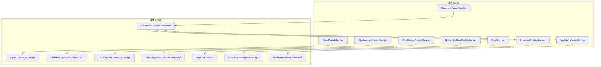
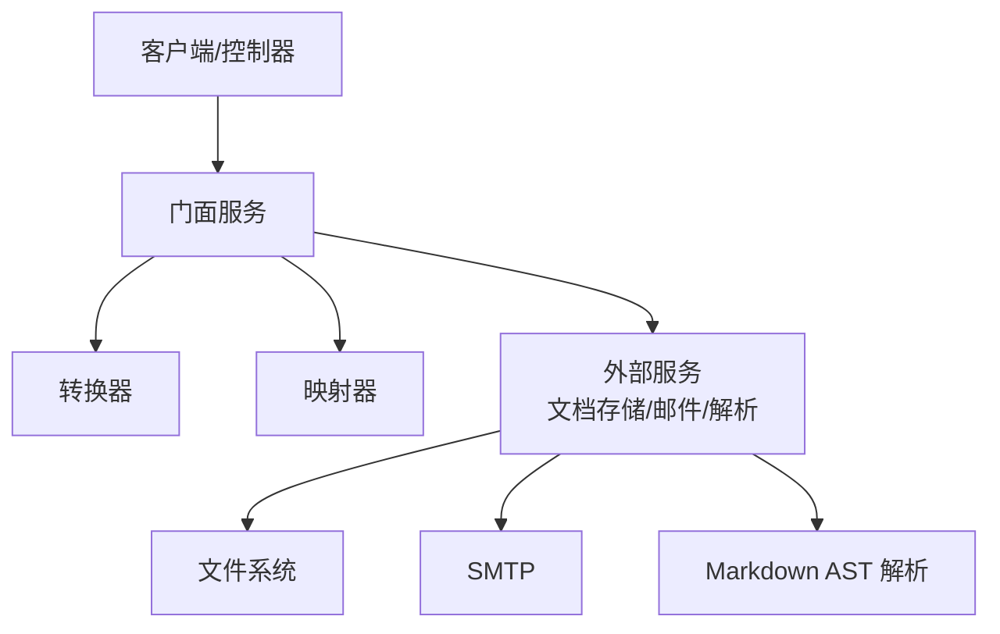
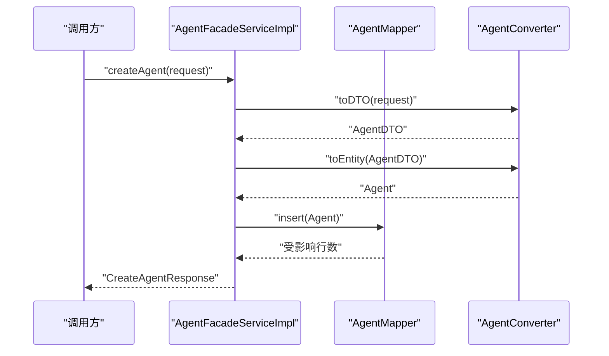
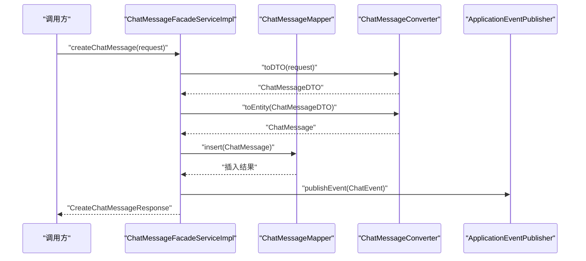
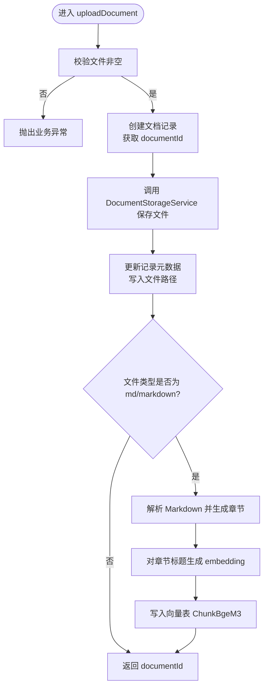
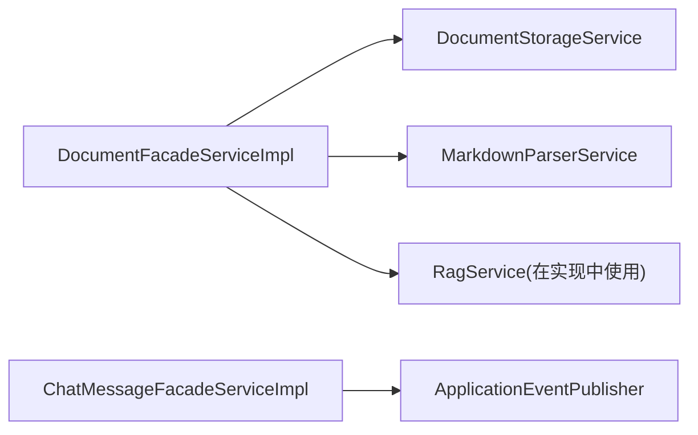

# 服务层架构

<cite>
**本文引用的文件**
- [AgentFacadeService.java](file://jchatmind/src/main/java/com/kama/jchatmind/service/AgentFacadeService.java)
- [AgentFacadeServiceImpl.java](file://jchatmind/src/main/java/com/kama/jchatmind/service/impl/AgentFacadeServiceImpl.java)
- [ChatMessageFacadeService.java](file://jchatmind/src/main/java/com/kama/jchatmind/service/ChatMessageFacadeService.java)
- [ChatMessageFacadeServiceImpl.java](file://jchatmind/src/main/java/com/kama/jchatmind/service/impl/ChatMessageFacadeServiceImpl.java)
- [ChatSessionFacadeService.java](file://jchatmind/src/main/java/com/kama/jchatmind/service/ChatSessionFacadeService.java)
- [ChatSessionFacadeServiceImpl.java](file://jchatmind/src/main/java/com/kama/jchatmind/service/impl/ChatSessionFacadeServiceImpl.java)
- [KnowledgeBaseFacadeService.java](file://jchatmind/src/main/java/com/kama/jchatmind/service/KnowledgeBaseFacadeService.java)
- [KnowledgeBaseFacadeServiceImpl.java](file://jchatmind/src/main/java/com/kama/jchatmind/service/impl/KnowledgeBaseFacadeServiceImpl.java)
- [DocumentFacadeService.java](file://jchatmind/src/main/java/com/kama/jchatmind/service/DocumentFacadeService.java)
- [DocumentFacadeServiceImpl.java](file://jchatmind/src/main/java/com/kama/jchatmind/service/impl/DocumentFacadeServiceImpl.java)
- [DocumentStorageService.java](file://jchatmind/src/main/java/com/kama/jchatmind/service/DocumentStorageService.java)
- [DocumentStorageServiceImpl.java](file://jchatmind/src/main/java/com/kama/jchatmind/service/impl/DocumentStorageServiceImpl.java)
- [EmailService.java](file://jchatmind/src/main/java/com/kama/jchatmind/service/EmailService.java)
- [EmailServiceImpl.java](file://jchatmind/src/main/java/com/kama/jchatmind/service/impl/EmailServiceImpl.java)
- [MarkdownParserService.java](file://jchatmind/src/main/java/com/kama/jchatmind/service/MarkdownParserService.java)
- [MarkdownParserServiceImpl.java](file://jchatmind/src/main/java/com/kama/jchatmind/service/impl/MarkdownParserServiceImpl.java)
</cite>

## 目录
1. [引言](#引言)
2. [项目结构](#项目结构)
3. [核心组件](#核心组件)
4. [架构总览](#架构总览)
5. [详细组件分析](#详细组件分析)
6. [依赖分析](#依赖分析)
7. [性能考虑](#性能考虑)
8. [故障排查指南](#故障排查指南)
9. [结论](#结论)
10. [附录](#附录)

## 引言
本文件系统性梳理 JChatMind 服务层架构，重点解析门面模式在 AgentFacadeService、ChatMessageFacadeService、ChatSessionFacadeService、KnowledgeBaseFacadeService、DocumentFacadeService 中的应用与职责边界；深入说明各实现类如何通过 Converter/Mapper/Service 组件协同完成业务编排；并总结文档存储、邮件与 Markdown 解析等支撑服务的设计要点。同时给出服务层设计原则（依赖注入、事务管理、异常处理）、服务间通信与容错策略、以及性能监控与调优建议。

## 项目结构
服务层位于模块的 service 与 service/impl 包中，采用“接口 + 实现”的清晰分层，并通过 Spring 组件注解暴露为可注入的 Bean。门面服务统一对外暴露稳定的领域操作接口，内部通过转换器、持久层映射器与第三方服务协作完成具体任务。

图表来源
- [AgentFacadeService.java:1-17](file://jchatmind/src/main/java/com/kama/jchatmind/service/AgentFacadeService.java#L1-L17)
- [AgentFacadeServiceImpl.java:1-122](file://jchatmind/src/main/java/com/kama/jchatmind/service/impl/AgentFacadeServiceImpl.java#L1-L122)
- [ChatMessageFacadeService.java:1-28](file://jchatmind/src/main/java/com/kama/jchatmind/service/ChatMessageFacadeService.java#L1-L28)
- [ChatMessageFacadeServiceImpl.java:1-212](file://jchatmind/src/main/java/com/kama/jchatmind/service/impl/ChatMessageFacadeServiceImpl.java#L1-L212)
- [ChatSessionFacadeService.java:1-22](file://jchatmind/src/main/java/com/kama/jchatmind/service/ChatSessionFacadeService.java#L1-L22)
- [ChatSessionFacadeServiceImpl.java:1-156](file://jchatmind/src/main/java/com/kama/jchatmind/service/impl/ChatSessionFacadeServiceImpl.java#L1-L156)
- [KnowledgeBaseFacadeService.java:1-18](file://jchatmind/src/main/java/com/kama/jchatmind/service/KnowledgeBaseFacadeService.java#L1-L18)
- [KnowledgeBaseFacadeServiceImpl.java:1-121](file://jchatmind/src/main/java/com/kama/jchatmind/service/impl/KnowledgeBaseFacadeServiceImpl.java#L1-L121)
- [DocumentFacadeService.java:1-22](file://jchatmind/src/main/java/com/kama/jchatmind/service/DocumentFacadeService.java#L1-L22)
- [DocumentFacadeServiceImpl.java:1-312](file://jchatmind/src/main/java/com/kama/jchatmind/service/impl/DocumentFacadeServiceImpl.java#L1-L312)
- [EmailService.java:1-16](file://jchatmind/src/main/java/com/kama/jchatmind/service/EmailService.java#L1-L16)
- [EmailServiceImpl.java:1-45](file://jchatmind/src/main/java/com/kama/jchatmind/service/impl/EmailServiceImpl.java#L1-L45)
- [DocumentStorageService.java:1-47](file://jchatmind/src/main/java/com/kama/jchatmind/service/DocumentStorageService.java#L1-L47)
- [DocumentStorageServiceImpl.java:1-90](file://jchatmind/src/main/java/com/kama/jchatmind/service/impl/DocumentStorageServiceImpl.java#L1-L90)
- [MarkdownParserService.java:1-33](file://jchatmind/src/main/java/com/kama/jchatmind/service/MarkdownParserService.java#L1-L33)
- [MarkdownParserServiceImpl.java:1-236](file://jchatmind/src/main/java/com/kama/jchatmind/service/impl/MarkdownParserServiceImpl.java#L1-L236)

章节来源
- [AgentFacadeService.java:1-17](file://jchatmind/src/main/java/com/kama/jchatmind/service/AgentFacadeService.java#L1-L17)
- [ChatMessageFacadeService.java:1-28](file://jchatmind/src/main/java/com/kama/jchatmind/service/ChatMessageFacadeService.java#L1-L28)
- [ChatSessionFacadeService.java:1-22](file://jchatmind/src/main/java/com/kama/jchatmind/service/ChatSessionFacadeService.java#L1-L22)
- [KnowledgeBaseFacadeService.java:1-18](file://jchatmind/src/main/java/com/kama/jchatmind/service/KnowledgeBaseFacadeService.java#L1-L18)
- [DocumentFacadeService.java:1-22](file://jchatmind/src/main/java/com/kama/jchatmind/service/DocumentFacadeService.java#L1-L22)

## 核心组件
- 门面服务接口：定义稳定的领域操作契约，屏蔽底层实现细节，便于客户端调用与版本演进。
- 门面实现类：负责业务编排、参数校验、DTO/实体转换、持久化调用、事件发布与异常处理。
- 支撑服务：
  - 文档存储服务：封装文件落盘、路径管理与存在性检查。
  - 邮件服务：基于 JavaMailSender 的异步发送能力。
  - Markdown 解析服务：基于 flexmark AST 抽象语法树解析标题与内容块，保留表格等格式。

章节来源
- [AgentFacadeServiceImpl.java:1-122](file://jchatmind/src/main/java/com/kama/jchatmind/service/impl/AgentFacadeServiceImpl.java#L1-L122)
- [ChatMessageFacadeServiceImpl.java:1-212](file://jchatmind/src/main/java/com/kama/jchatmind/service/impl/ChatMessageFacadeServiceImpl.java#L1-L212)
- [ChatSessionFacadeServiceImpl.java:1-156](file://jchatmind/src/main/java/com/kama/jchatmind/service/impl/ChatSessionFacadeServiceImpl.java#L1-L156)
- [KnowledgeBaseFacadeServiceImpl.java:1-121](file://jchatmind/src/main/java/com/kama/jchatmind/service/impl/KnowledgeBaseFacadeServiceImpl.java#L1-L121)
- [DocumentFacadeServiceImpl.java:1-312](file://jchatmind/src/main/java/com/kama/jchatmind/service/impl/DocumentFacadeServiceImpl.java#L1-L312)
- [DocumentStorageServiceImpl.java:1-90](file://jchatmind/src/main/java/com/kama/jchatmind/service/impl/DocumentStorageServiceImpl.java#L1-L90)
- [EmailServiceImpl.java:1-45](file://jchatmind/src/main/java/com/kama/jchatmind/service/impl/EmailServiceImpl.java#L1-L45)
- [MarkdownParserServiceImpl.java:1-236](file://jchatmind/src/main/java/com/kama/jchatmind/service/impl/MarkdownParserServiceImpl.java#L1-L236)

## 架构总览
服务层采用“门面 + 转换器 + 映射器 + 第三方服务”的组合模式：
- 门面层统一对外暴露领域操作；
- 转换器负责请求/响应对象与 DTO/实体之间的双向转换；
- 映射器负责与数据库交互；
- 第三方服务（如文档存储、邮件、Markdown 解析）提供横切能力。

图表来源
- [DocumentFacadeServiceImpl.java:33-44](file://jchatmind/src/main/java/com/kama/jchatmind/service/impl/DocumentFacadeServiceImpl.java#L33-L44)
- [DocumentStorageServiceImpl.java:18-54](file://jchatmind/src/main/java/com/kama/jchatmind/service/impl/DocumentStorageServiceImpl.java#L18-L54)
- [EmailServiceImpl.java:13-42](file://jchatmind/src/main/java/com/kama/jchatmind/service/impl/EmailServiceImpl.java#L13-L42)
- [MarkdownParserServiceImpl.java:22-51](file://jchatmind/src/main/java/com/kama/jchatmind/service/impl/MarkdownParserServiceImpl.java#L22-L51)

## 详细组件分析

### Agent 门面：AgentFacadeService/Impl
- 设计要点
  - 通过 Converter 将请求/实体转换为 DTO，再持久化；
  - 统一设置创建/更新时间；
  - 使用 BizException 进行业务异常包装；
  - JSON 序列化异常转为运行时异常或业务异常。
- 关键流程
  - 列表查询：Mapper 查询 -> VO 转换；
  - 新增：DTO -> Entity -> Mapper 插入；
  - 删除：按 ID 查询存在性 -> Mapper 删除；
  - 更新：合并请求到 DTO -> Entity -> Mapper 更新。

图表来源
- [AgentFacadeServiceImpl.java:48-74](file://jchatmind/src/main/java/com/kama/jchatmind/service/impl/AgentFacadeServiceImpl.java#L48-L74)
- [AgentFacadeService.java:8-16](file://jchatmind/src/main/java/com/kama/jchatmind/service/AgentFacadeService.java#L8-L16)

章节来源
- [AgentFacadeService.java:1-17](file://jchatmind/src/main/java/com/kama/jchatmind/service/AgentFacadeService.java#L1-L17)
- [AgentFacadeServiceImpl.java:1-122](file://jchatmind/src/main/java/com/kama/jchatmind/service/impl/AgentFacadeServiceImpl.java#L1-L122)

### 聊天消息门面：ChatMessageFacadeService/Impl
- 设计要点
  - 支持多种创建入口（请求对象或 DTO），统一转换与持久化；
  - 事件发布：普通创建触发 ChatEvent，Agent 创建不触发；
  - 内容追加：基于现有记录拼接新内容并更新；
  - 更新保持部分字段不变（如 sessionId、role、创建时间）。
- 关键流程
  - 列表查询：按会话 ID 查询 -> VO/DTO 转换；
  - 最近消息：按限制条数查询 -> DTO 转换；
  - 创建：DTO -> Entity -> Mapper 插入 -> 事件发布；
  - 追加：查询 -> 拼接 -> 更新；
  - 删除/更新：存在性校验 -> Mapper 操作。

图表来源
- [ChatMessageFacadeServiceImpl.java:67-80](file://jchatmind/src/main/java/com/kama/jchatmind/service/impl/ChatMessageFacadeServiceImpl.java#L67-L80)
- [ChatMessageFacadeService.java:11-27](file://jchatmind/src/main/java/com/kama/jchatmind/service/ChatMessageFacadeService.java#L11-L27)

章节来源
- [ChatMessageFacadeService.java:1-28](file://jchatmind/src/main/java/com/kama/jchatmind/service/ChatMessageFacadeService.java#L1-L28)
- [ChatMessageFacadeServiceImpl.java:1-212](file://jchatmind/src/main/java/com/kama/jchatmind/service/impl/ChatMessageFacadeServiceImpl.java#L1-L212)

### 聊天会话门面：ChatSessionFacadeService/Impl
- 设计要点
  - 列表/按 Agent 查询 -> VO 转换；
  - 新增/删除/更新与 Agent 类似，保持创建/更新时间；
  - 更新时保留 agentId 与创建时间。

章节来源
- [ChatSessionFacadeService.java:1-22](file://jchatmind/src/main/java/com/kama/jchatmind/service/ChatSessionFacadeService.java#L1-L22)
- [ChatSessionFacadeServiceImpl.java:1-156](file://jchatmind/src/main/java/com/kama/jchatmind/service/impl/ChatSessionFacadeServiceImpl.java#L1-L156)

### 知识库门面：KnowledgeBaseFacadeService/Impl
- 设计要点
  - 列表查询 -> VO 转换；
  - 新增/删除/更新：DTO -> Entity -> Mapper；
  - 更新时保留创建时间。

章节来源
- [KnowledgeBaseFacadeService.java:1-18](file://jchatmind/src/main/java/com/kama/jchatmind/service/KnowledgeBaseFacadeService.java#L1-L18)
- [KnowledgeBaseFacadeServiceImpl.java:1-121](file://jchatmind/src/main/java/com/kama/jchatmind/service/impl/KnowledgeBaseFacadeServiceImpl.java#L1-L121)

### 文档门面：DocumentFacadeService/Impl
- 设计要点
  - 列表/按知识库查询 -> VO 转换；
  - 新增：DTO -> Entity -> Mapper；
  - 上传：先创建记录获取 ID -> 存储文件 -> 更新记录元数据；
  - 删除：优先删除文件，再删除记录；
  - 更新：DTO 合并 -> Entity -> Mapper；
  - Markdown 特性：解析章节 -> 生成 embedding -> 写入向量表。
- 关键流程（上传与 Markdown 处理）

图表来源
- [DocumentFacadeServiceImpl.java:109-176](file://jchatmind/src/main/java/com/kama/jchatmind/service/impl/DocumentFacadeServiceImpl.java#L109-L176)
- [DocumentStorageServiceImpl.java:24-54](file://jchatmind/src/main/java/com/kama/jchatmind/service/impl/DocumentStorageServiceImpl.java#L24-L54)
- [MarkdownParserServiceImpl.java:33-51](file://jchatmind/src/main/java/com/kama/jchatmind/service/impl/MarkdownParserServiceImpl.java#L33-L51)

章节来源
- [DocumentFacadeService.java:1-22](file://jchatmind/src/main/java/com/kama/jchatmind/service/DocumentFacadeService.java#L1-L22)
- [DocumentFacadeServiceImpl.java:1-312](file://jchatmind/src/main/java/com/kama/jchatmind/service/impl/DocumentFacadeServiceImpl.java#L1-L312)

### 文档存储服务：DocumentStorageService/Impl
- 设计要点
  - 基于配置的根路径，按 kbId/documentId 维度组织目录；
  - 保存文件时生成唯一文件名，确保幂等覆盖；
  - 删除文件时尝试清理空目录；
  - 提供文件存在性检查与路径解析。

章节来源
- [DocumentStorageService.java:1-47](file://jchatmind/src/main/java/com/kama/jchatmind/service/DocumentStorageService.java#L1-L47)
- [DocumentStorageServiceImpl.java:1-90](file://jchatmind/src/main/java/com/kama/jchatmind/service/impl/DocumentStorageServiceImpl.java#L1-L90)

### 邮件服务：EmailService/Impl
- 设计要点
  - 异步发送，避免阻塞主线程；
  - 使用 JavaMailSender 发送简单文本邮件；
  - 记录成功/失败日志。

章节来源
- [EmailService.java:1-16](file://jchatmind/src/main/java/com/kama/jchatmind/service/EmailService.java#L1-L16)
- [EmailServiceImpl.java:1-45](file://jchatmind/src/main/java/com/kama/jchatmind/service/impl/EmailServiceImpl.java#L1-L45)

### Markdown 解析服务：MarkdownParserService/Impl
- 设计要点
  - 基于 flexmark AST 解析 Markdown；
  - 顶层节点遍历，按标题划分章节；
  - 表格保留原始 Markdown 格式；
  - 递归提取文本，保留段落与换行。

章节来源
- [MarkdownParserService.java:1-33](file://jchatmind/src/main/java/com/kama/jchatmind/service/MarkdownParserService.java#L1-L33)
- [MarkdownParserServiceImpl.java:1-236](file://jchatmind/src/main/java/com/kama/jchatmind/service/impl/MarkdownParserServiceImpl.java#L1-L236)

## 依赖分析
- 组件内聚与耦合
  - 门面实现类内聚于各自领域，依赖转换器与映射器，耦合度适中；
  - DocumentFacadeServiceImpl 与外部服务耦合较强（存储、解析、RAG），但通过接口隔离。
- 外部依赖
  - 文档存储：文件系统；
  - 邮件：JavaMailSender；
  - Markdown：flexmark 依赖。
- 循环依赖
  - 当前实现未见循环依赖迹象。

图表来源
- [DocumentFacadeServiceImpl.java:33-44](file://jchatmind/src/main/java/com/kama/jchatmind/service/impl/DocumentFacadeServiceImpl.java#L33-L44)
- [ChatMessageFacadeServiceImpl.java:24-31](file://jchatmind/src/main/java/com/kama/jchatmind/service/impl/ChatMessageFacadeServiceImpl.java#L24-L31)

章节来源
- [DocumentFacadeServiceImpl.java:1-312](file://jchatmind/src/main/java/com/kama/jchatmind/service/impl/DocumentFacadeServiceImpl.java#L1-L312)
- [ChatMessageFacadeServiceImpl.java:1-212](file://jchatmind/src/main/java/com/kama/jchatmind/service/impl/ChatMessageFacadeServiceImpl.java#L1-L212)

## 性能考虑
- 依赖注入与线程模型
  - 门面实现类通过构造器注入多个依赖，Spring 容器负责生命周期管理；
  - 邮件服务使用异步注解，避免阻塞请求线程。
- 数据访问优化
  - 批量查询时注意分页与索引；
  - 事件发布发生在创建消息之后，可结合异步队列进一步削峰。
- 文件与解析开销
  - 上传流程先入库再落盘，避免重复 IO；
  - Markdown 解析与 embedding 生成在后台执行，不影响上传主流程。
- 监控与调优建议
  - 为门面方法增加埋点（耗时、异常率、成功率）；
  - 对频繁查询的 DAO 加缓存（如知识库/会话列表）；
  - 对大文件上传增加进度上报与断点续传（扩展点）。

## 故障排查指南
- 常见异常与定位
  - 业务异常：统一包装为业务异常，便于前端识别；
  - JSON 序列化异常：通常出现在转换器阶段，检查字段与序列化配置；
  - 文件操作异常：存储服务抛出 IO 异常，关注路径权限与磁盘空间。
- 排查步骤
  - 确认请求参数与 DTO 映射是否正确；
  - 检查数据库插入/更新是否成功；
  - 核对文件路径与存储服务日志；
  - 观察 Markdown 解析与 embedding 写入日志。

章节来源
- [AgentFacadeServiceImpl.java:38-73](file://jchatmind/src/main/java/com/kama/jchatmind/service/impl/AgentFacadeServiceImpl.java#L38-L73)
- [ChatMessageFacadeServiceImpl.java:41-123](file://jchatmind/src/main/java/com/kama/jchatmind/service/impl/ChatMessageFacadeServiceImpl.java#L41-L123)
- [DocumentStorageServiceImpl.java:57-88](file://jchatmind/src/main/java/com/kama/jchatmind/service/impl/DocumentStorageServiceImpl.java#L57-L88)
- [MarkdownParserServiceImpl.java:47-50](file://jchatmind/src/main/java/com/kama/jchatmind/service/impl/MarkdownParserServiceImpl.java#L47-L50)

## 结论
服务层通过门面模式实现了清晰的领域边界与稳定的对外接口，配合转换器与映射器完成数据编排，借助文档存储、邮件与 Markdown 解析等支撑服务形成完整的文档与对话处理链路。整体设计遵循高内聚、低耦合原则，具备良好的可维护性与扩展性。建议后续在事件驱动、缓存与监控方面持续增强，以提升吞吐与可观测性。

## 附录
- 服务层设计原则
  - 依赖注入：通过构造器注入，保证不可变与可测试性；
  - 事务管理：建议在门面层统一声明事务语义，确保跨 DAO 的一致性；
  - 异常处理：区分业务异常与系统异常，统一包装与日志记录。
- 服务间通信与容错
  - 异步化：邮件发送采用异步，降低延迟；
  - 降级策略：存储/解析失败时记录告警并继续流程（如 Markdown 处理失败不阻塞上传）。
- 性能监控与调优
  - 埋点指标：请求耗时、QPS、错误率、重试次数；
  - 资源优化：连接池、线程池、IO 与 CPU 利用率。