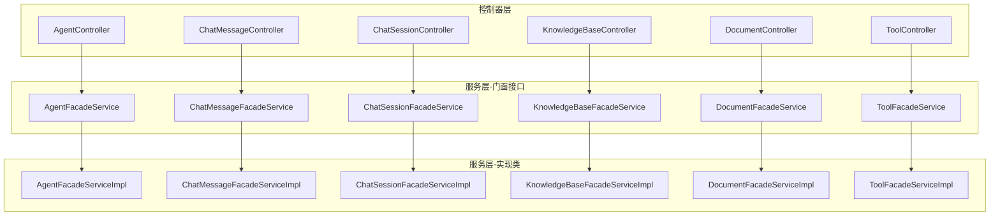
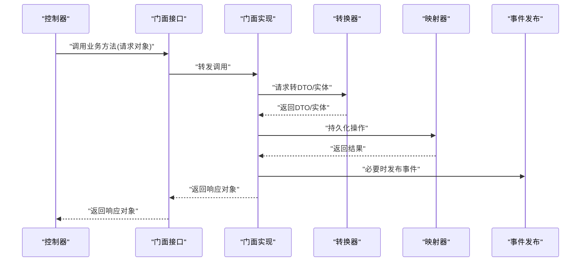
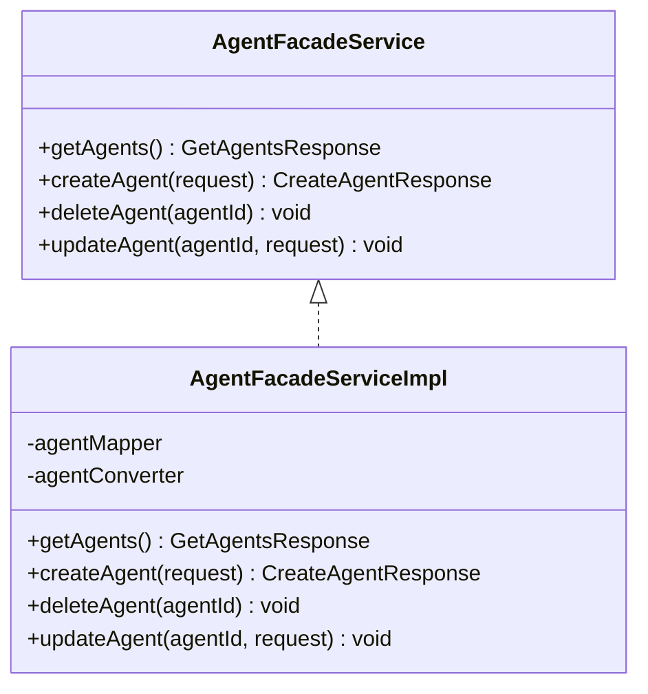
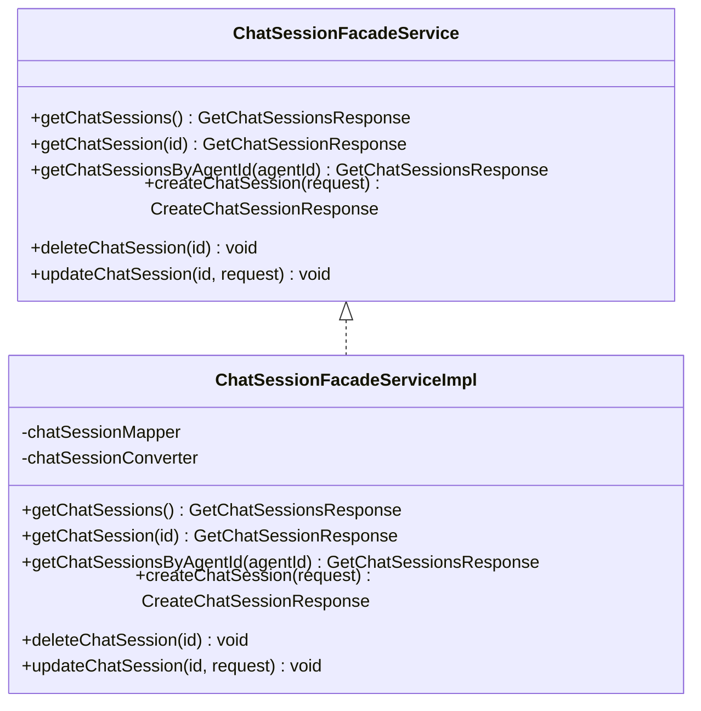
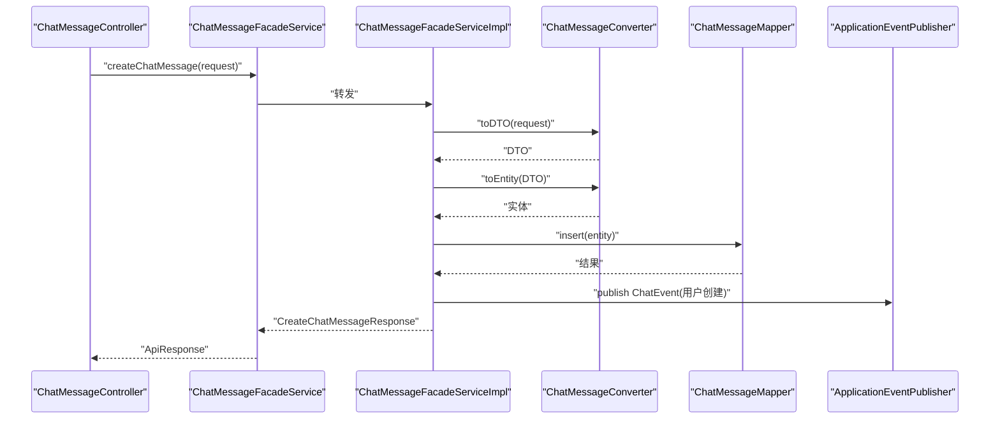
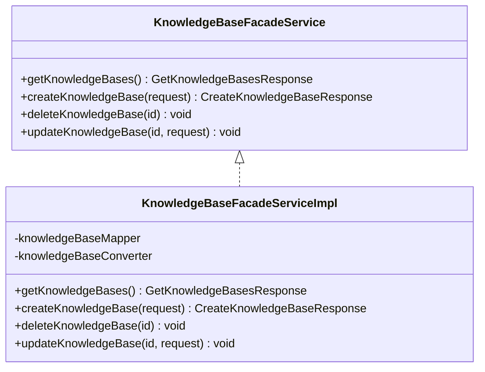
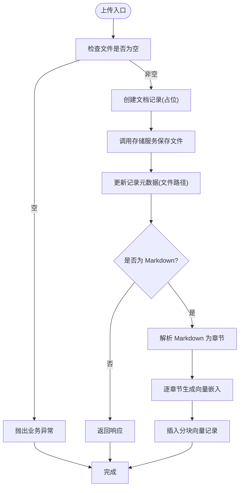
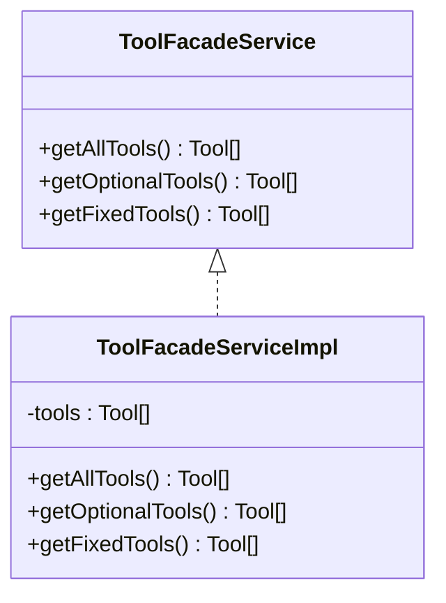
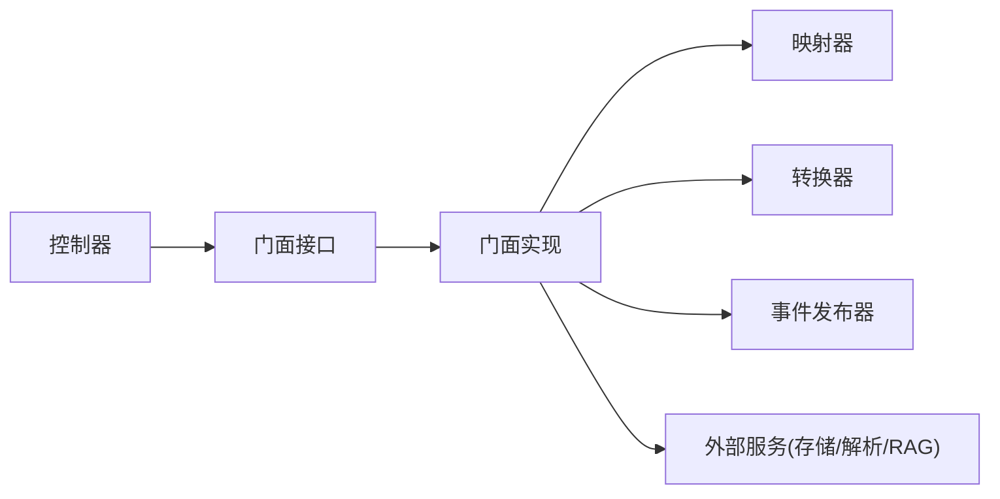

# 门面服务设计

<cite>
**本文引用的文件**
- [AgentFacadeService.java](file://jchatmind/src/main/java/com/kama/jchatmind/service/AgentFacadeService.java)
- [ChatMessageFacadeService.java](file://jchatmind/src/main/java/com/kama/jchatmind/service/ChatMessageFacadeService.java)
- [ChatSessionFacadeService.java](file://jchatmind/src/main/java/com/kama/jchatmind/service/ChatSessionFacadeService.java)
- [KnowledgeBaseFacadeService.java](file://jchatmind/src/main/java/com/kama/jchatmind/service/KnowledgeBaseFacadeService.java)
- [DocumentFacadeService.java](file://jchatmind/src/main/java/com/kama/jchatmind/service/DocumentFacadeService.java)
- [ToolFacadeService.java](file://jchatmind/src/main/java/com/kama/jchatmind/service/ToolFacadeService.java)
- [AgentFacadeServiceImpl.java](file://jchatmind/src/main/java/com/kama/jchatmind/service/impl/AgentFacadeServiceImpl.java)
- [ChatMessageFacadeServiceImpl.java](file://jchatmind/src/main/java/com/kama/jchatmind/service/impl/ChatMessageFacadeServiceImpl.java)
- [ChatSessionFacadeServiceImpl.java](file://jchatmind/src/main/java/com/kama/jchatmind/service/impl/ChatSessionFacadeServiceImpl.java)
- [KnowledgeBaseFacadeServiceImpl.java](file://jchatmind/src/main/java/com/kama/jchatmind/service/impl/KnowledgeBaseFacadeServiceImpl.java)
- [DocumentFacadeServiceImpl.java](file://jchatmind/src/main/java/com/kama/jchatmind/service/impl/DocumentFacadeServiceImpl.java)
- [ToolFacadeServiceImpl.java](file://jchatmind/src/main/java/com/kama/jchatmind/service/impl/ToolFacadeServiceImpl.java)
- [AgentController.java](file://jchatmind/src/main/java/com/kama/jchatmind/controller/AgentController.java)
- [ChatMessageController.java](file://jchatmind/src/main/java/com/kama/jchatmind/controller/ChatMessageController.java)
- [ChatSessionController.java](file://jchatmind/src/main/java/com/kama/jchatmind/controller/ChatSessionController.java)
- [DocumentController.java](file://jchatmind/src/main/java/com/kama/jchatmind/controller/DocumentController.java)
- [KnowledgeBaseController.java](file://jchatmind/src/main/java/com/kama/jchatmind/controller/KnowledgeBaseController.java)
- [ToolController.java](file://jchatmind/src/main/java/com/kama/jchatmind/controller/ToolController.java)
</cite>

## 目录
1. [引言](#引言)
2. [项目结构](#项目结构)
3. [核心组件](#核心组件)
4. [架构总览](#架构总览)
5. [详细组件分析](#详细组件分析)
6. [依赖分析](#依赖分析)
7. [性能考虑](#性能考虑)
8. [故障排查指南](#故障排查指南)
9. [结论](#结论)

## 引言
本文件系统性阐述 JChatMind 项目中门面服务的设计与实现，重点覆盖以下门面接口：AgentFacadeService、ChatMessageFacadeService、ChatSessionFacadeService、KnowledgeBaseFacadeService、DocumentFacadeService、ToolFacadeService。我们将从设计理念、职责边界、接口设计原则、参数与返回值规范、与控制器层的交互模式等方面展开，并通过多种图示帮助读者理解整体架构与关键流程。

## 项目结构
门面服务位于服务层，面向控制器层暴露统一的业务接口；实现类封装了数据转换、持久化、事件发布、外部服务集成等细节，确保控制器层无需关心内部复杂度。

**图表来源**
- [AgentController.java:1-45](file://jchatmind/src/main/java/com/kama/jchatmind/controller/AgentController.java#L1-45)
- [ChatMessageController.java:1-45](file://jchatmind/src/main/java/com/kama/jchatmind/controller/ChatMessageController.java#L1-45)
- [ChatSessionController.java:1-58](file://jchatmind/src/main/java/com/kama/jchatmind/controller/ChatSessionController.java#L1-58)
- [DocumentController.java:1-60](file://jchatmind/src/main/java/com/kama/jchatmind/controller/DocumentController.java#L1-60)
- [KnowledgeBaseController.java:1-45](file://jchatmind/src/main/java/com/kama/jchatmind/controller/KnowledgeBaseController.java#L1-45)
- [ToolController.java:1-26](file://jchatmind/src/main/java/com/kama/jchatmind/controller/ToolController.java#L1-26)
- [AgentFacadeService.java:1-17](file://jchatmind/src/main/java/com/kama/jchatmind/service/AgentFacadeService.java#L1-17)
- [ChatMessageFacadeService.java:1-28](file://jchatmind/src/main/java/com/kama/jchatmind/service/ChatMessageFacadeService.java#L1-28)
- [ChatSessionFacadeService.java:1-22](file://jchatmind/src/main/java/com/kama/jchatmind/service/ChatSessionFacadeService.java#L1-22)
- [KnowledgeBaseFacadeService.java:1-18](file://jchatmind/src/main/java/com/kama/jchatmind/service/KnowledgeBaseFacadeService.java#L1-18)
- [DocumentFacadeService.java:1-22](file://jchatmind/src/main/java/com/kama/jchatmind/service/DocumentFacadeService.java#L1-22)
- [ToolFacadeService.java:1-14](file://jchatmind/src/main/java/com/kama/jchatmind/service/ToolFacadeService.java#L1-14)
- [AgentFacadeServiceImpl.java:1-122](file://jchatmind/src/main/java/com/kama/jchatmind/service/impl/AgentFacadeServiceImpl.java#L1-122)
- [ChatMessageFacadeServiceImpl.java:1-212](file://jchatmind/src/main/java/com/kama/jchatmind/service/impl/ChatMessageFacadeServiceImpl.java#L1-212)
- [ChatSessionFacadeServiceImpl.java:1-156](file://jchatmind/src/main/java/com/kama/jchatmind/service/impl/ChatSessionFacadeServiceImpl.java#L1-156)
- [KnowledgeBaseFacadeServiceImpl.java:1-121](file://jchatmind/src/main/java/com/kama/jchatmind/service/impl/KnowledgeBaseFacadeServiceImpl.java#L1-121)
- [DocumentFacadeServiceImpl.java:1-312](file://jchatmind/src/main/java/com/kama/jchatmind/service/impl/DocumentFacadeServiceImpl.java#L1-312)
- [ToolFacadeServiceImpl.java:1-38](file://jchatmind/src/main/java/com/kama/jchatmind/service/impl/ToolFacadeServiceImpl.java#L1-38)

**章节来源**
- [AgentController.java:1-45](file://jchatmind/src/main/java/com/kama/jchatmind/controller/AgentController.java#L1-45)
- [ChatMessageController.java:1-45](file://jchatmind/src/main/java/com/kama/jchatmind/controller/ChatMessageController.java#L1-45)
- [ChatSessionController.java:1-58](file://jchatmind/src/main/java/com/kama/jchatmind/controller/ChatSessionController.java#L1-58)
- [DocumentController.java:1-60](file://jchatmind/src/main/java/com/kama/jchatmind/controller/DocumentController.java#L1-60)
- [KnowledgeBaseController.java:1-45](file://jchatmind/src/main/java/com/kama/jchatmind/controller/KnowledgeBaseController.java#L1-45)
- [ToolController.java:1-26](file://jchatmind/src/main/java/com/kama/jchatmind/controller/ToolController.java#L1-26)

## 核心组件
本节概述六大门面接口的职责边界与典型用法，体现门面模式“对外统一接口、对内隐藏复杂”的优势。

- AgentFacadeService：面向智能代理的全生命周期管理，包括查询、创建、删除、更新。
- ChatSessionFacadeService：面向聊天会话的管理，支持按会话查询、按代理查询、创建、删除、更新。
- ChatMessageFacadeService：面向聊天消息的管理，支持按会话查询、最近消息查询、创建、追加内容、删除、更新；区分用户触发与代理触发的消息创建。
- KnowledgeBaseFacadeService：面向知识库的管理，支持查询、创建、删除、更新。
- DocumentFacadeService：面向文档的管理，支持查询、创建、上传（含文件落地与分块嵌入）、删除、更新；对 Markdown 进行解析与向量化分块。
- ToolFacadeService：面向工具集合的查询，按固定/可选两类筛选工具列表。

这些接口均以请求/响应对象作为参数与返回值，避免直接暴露实体或映射器，从而降低耦合度、提升可维护性。

**章节来源**
- [AgentFacadeService.java:1-17](file://jchatmind/src/main/java/com/kama/jchatmind/service/AgentFacadeService.java#L1-17)
- [ChatSessionFacadeService.java:1-22](file://jchatmind/src/main/java/com/kama/jchatmind/service/ChatSessionFacadeService.java#L1-22)
- [ChatMessageFacadeService.java:1-28](file://jchatmind/src/main/java/com/kama/jchatmind/service/ChatMessageFacadeService.java#L1-28)
- [KnowledgeBaseFacadeService.java:1-18](file://jchatmind/src/main/java/com/kama/jchatmind/service/KnowledgeBaseFacadeService.java#L1-18)
- [DocumentFacadeService.java:1-22](file://jchatmind/src/main/java/com/kama/jchatmind/service/DocumentFacadeService.java#L1-22)
- [ToolFacadeService.java:1-14](file://jchatmind/src/main/java/com/kama/jchatmind/service/ToolFacadeService.java#L1-14)

## 架构总览
下图展示控制器层与门面层的调用关系，以及门面实现类内部的协作方式（以 ChatMessageFacadeServiceImpl 为例）：

**图表来源**
- [ChatMessageController.java:1-45](file://jchatmind/src/main/java/com/kama/jchatmind/controller/ChatMessageController.java#L1-45)
- [ChatMessageFacadeService.java:1-28](file://jchatmind/src/main/java/com/kama/jchatmind/service/ChatMessageFacadeService.java#L1-28)
- [ChatMessageFacadeServiceImpl.java:1-212](file://jchatmind/src/main/java/com/kama/jchatmind/service/impl/ChatMessageFacadeServiceImpl.java#L1-212)

## 详细组件分析

### AgentFacadeService 与 AgentFacadeServiceImpl
- 设计理念：对外暴露统一的代理管理接口，内部完成请求对象到实体的转换、时间戳设置、持久化与异常处理。
- 关键点：
  - 查询：遍历实体并转换为 VO，统一返回响应对象。
  - 创建：请求对象 → DTO → 实体，设置创建/更新时间为当前时间，插入数据库并返回生成的 ID。
  - 更新：先校验存在性，再基于现有实体生成 DTO，使用请求更新 DTO 后回写实体，保留 ID 与创建时间，更新数据库。
  - 删除：先校验存在性，再执行删除。
- 参数与返回：
  - 请求对象：CreateAgentRequest、UpdateAgentRequest
  - 响应对象：GetAgentsResponse、CreateAgentResponse
- 控制器交互：AgentController 直接注入 AgentFacadeService 并返回 ApiResponse 包裹的响应对象。

**图表来源**
- [AgentFacadeService.java:1-17](file://jchatmind/src/main/java/com/kama/jchatmind/service/AgentFacadeService.java#L1-17)
- [AgentFacadeServiceImpl.java:1-122](file://jchatmind/src/main/java/com/kama/jchatmind/service/impl/AgentFacadeServiceImpl.java#L1-122)

**章节来源**
- [AgentFacadeService.java:1-17](file://jchatmind/src/main/java/com/kama/jchatmind/service/AgentFacadeService.java#L1-17)
- [AgentFacadeServiceImpl.java:1-122](file://jchatmind/src/main/java/com/kama/jchatmind/service/impl/AgentFacadeServiceImpl.java#L1-122)
- [AgentController.java:1-45](file://jchatmind/src/main/java/com/kama/jchatmind/controller/AgentController.java#L1-45)

### ChatSessionFacadeService 与 ChatSessionFacadeServiceImpl
- 设计理念：统一会话管理接口，支持按会话 ID、按代理 ID 查询，以及创建、删除、更新。
- 关键点：
  - 查询：支持全部会话、指定会话、按代理 ID 列表查询，统一转换为 VO 并返回响应对象。
  - 创建：请求 → DTO → 实体，设置时间戳，插入数据库并返回会话 ID。
  - 更新：保留 ID 与关联字段，更新其余字段与时间戳。
  - 删除：先校验存在性，再删除。
- 参数与返回：
  - 请求对象：CreateChatSessionRequest、UpdateChatSessionRequest
  - 响应对象：GetChatSessionsResponse、GetChatSessionResponse、CreateChatSessionResponse
- 控制器交互：ChatSessionController 注入 ChatSessionFacadeService，按路径变量与请求体分别处理 GET/POST/PATCH/DELETE。

**图表来源**
- [ChatSessionFacadeService.java:1-22](file://jchatmind/src/main/java/com/kama/jchatmind/service/ChatSessionFacadeService.java#L1-22)
- [ChatSessionFacadeServiceImpl.java:1-156](file://jchatmind/src/main/java/com/kama/jchatmind/service/impl/ChatSessionFacadeServiceImpl.java#L1-156)

**章节来源**
- [ChatSessionFacadeService.java:1-22](file://jchatmind/src/main/java/com/kama/jchatmind/service/ChatSessionFacadeService.java#L1-22)
- [ChatSessionFacadeServiceImpl.java:1-156](file://jchatmind/src/main/java/com/kama/jchatmind/service/impl/ChatSessionFacadeServiceImpl.java#L1-156)
- [ChatSessionController.java:1-58](file://jchatmind/src/main/java/com/kama/jchatmind/controller/ChatSessionController.java#L1-58)

### ChatMessageFacadeService 与 ChatMessageFacadeServiceImpl
- 设计理念：统一消息管理接口，支持按会话查询、最近 N 条查询、创建、追加内容、删除、更新；区分用户触发与代理触发的消息创建。
- 关键点：
  - 查询：按会话 ID 获取完整列表，或获取最近 N 条消息，统一转换为 DTO/VO。
  - 创建：请求 → DTO → 实体，设置时间戳，插入数据库；用户触发创建会发布事件，代理触发创建不发布事件。
  - 追加内容：对现有消息内容进行拼接，更新时间戳并持久化。
  - 更新：保留 ID、会话 ID、角色等不变字段，更新其余字段与时间戳。
  - 删除：先校验存在性，再删除。
- 参数与返回：
  - 请求对象：CreateChatMessageRequest、UpdateChatMessageRequest
  - 响应对象：GetChatMessagesResponse、CreateChatMessageResponse
  - 数据传输对象：ChatMessageDTO
- 控制器交互：ChatMessageController 注入 ChatMessageFacadeService，处理 GET/POST/PATCH/DELETE。

**图表来源**
- [ChatMessageController.java:1-45](file://jchatmind/src/main/java/com/kama/jchatmind/controller/ChatMessageController.java#L1-45)
- [ChatMessageFacadeService.java:1-28](file://jchatmind/src/main/java/com/kama/jchatmind/service/ChatMessageFacadeService.java#L1-28)
- [ChatMessageFacadeServiceImpl.java:1-212](file://jchatmind/src/main/java/com/kama/jchatmind/service/impl/ChatMessageFacadeServiceImpl.java#L1-212)

**章节来源**
- [ChatMessageFacadeService.java:1-28](file://jchatmind/src/main/java/com/kama/jchatmind/service/ChatMessageFacadeService.java#L1-28)
- [ChatMessageFacadeServiceImpl.java:1-212](file://jchatmind/src/main/java/com/kama/jchatmind/service/impl/ChatMessageFacadeServiceImpl.java#L1-212)
- [ChatMessageController.java:1-45](file://jchatmind/src/main/java/com/kama/jchatmind/controller/ChatMessageController.java#L1-45)

### KnowledgeBaseFacadeService 与 KnowledgeBaseFacadeServiceImpl
- 设计理念：统一知识库管理接口，支持查询、创建、删除、更新。
- 关键点：
  - 查询：遍历实体并转换为 VO，统一返回响应对象。
  - 创建：请求 → DTO → 实体，设置时间戳，插入数据库并返回知识库 ID。
  - 更新：保留 ID 与创建时间，更新其余字段与时间戳。
  - 删除：先校验存在性，再删除。
- 参数与返回：
  - 请求对象：CreateKnowledgeBaseRequest、UpdateKnowledgeBaseRequest
  - 响应对象：GetKnowledgeBasesResponse、CreateKnowledgeBaseResponse
- 控制器交互：KnowledgeBaseController 注入 KnowledgeBaseFacadeService。

**图表来源**
- [KnowledgeBaseFacadeService.java:1-18](file://jchatmind/src/main/java/com/kama/jchatmind/service/KnowledgeBaseFacadeService.java#L1-18)
- [KnowledgeBaseFacadeServiceImpl.java:1-121](file://jchatmind/src/main/java/com/kama/jchatmind/service/impl/KnowledgeBaseFacadeServiceImpl.java#L1-121)

**章节来源**
- [KnowledgeBaseFacadeService.java:1-18](file://jchatmind/src/main/java/com/kama/jchatmind/service/KnowledgeBaseFacadeService.java#L1-18)
- [KnowledgeBaseFacadeServiceImpl.java:1-121](file://jchatmind/src/main/java/com/kama/jchatmind/service/impl/KnowledgeBaseFacadeServiceImpl.java#L1-121)
- [KnowledgeBaseController.java:1-45](file://jchatmind/src/main/java/com/kama/jchatmind/controller/KnowledgeBaseController.java#L1-45)

### DocumentFacadeService 与 DocumentFacadeServiceImpl
- 设计理念：统一文档管理接口，支持查询、创建、上传（含文件落地与元数据更新）、删除、更新；对 Markdown 进行解析与分块嵌入。
- 关键点：
  - 查询：支持全部文档与按知识库 ID 查询，统一转换为 VO。
  - 创建：仅创建记录，返回文档 ID。
  - 上传：创建记录获取 ID → 保存文件 → 更新记录元数据（文件路径）→ 若为 Markdown，解析并生成分块与向量嵌入。
  - 删除：尝试删除文件（若失败仅记录告警），再删除数据库记录。
  - 更新：保留 ID 与知识库 ID 等不变字段，更新其余字段与时间戳。
- 参数与返回：
  - 请求对象：CreateDocumentRequest、UpdateDocumentRequest
  - 响应对象：GetDocumentsResponse、CreateDocumentResponse
  - 文件上传：MultipartFile
- 外部依赖：文档存储服务、Markdown 解析服务、RAG 服务、分块向量映射器。
- 控制器交互：DocumentController 注入 DocumentFacadeService，处理 GET/POST/DELETE/PATCH，其中上传使用 multipart/form-data。

**图表来源**
- [DocumentController.java:1-60](file://jchatmind/src/main/java/com/kama/jchatmind/controller/DocumentController.java#L1-60)
- [DocumentFacadeService.java:1-22](file://jchatmind/src/main/java/com/kama/jchatmind/service/DocumentFacadeService.java#L1-22)
- [DocumentFacadeServiceImpl.java:1-312](file://jchatmind/src/main/java/com/kama/jchatmind/service/impl/DocumentFacadeServiceImpl.java#L1-312)

**章节来源**
- [DocumentFacadeService.java:1-22](file://jchatmind/src/main/java/com/kama/jchatmind/service/DocumentFacadeService.java#L1-22)
- [DocumentFacadeServiceImpl.java:1-312](file://jchatmind/src/main/java/com/kama/jchatmind/service/impl/DocumentFacadeServiceImpl.java#L1-312)
- [DocumentController.java:1-60](file://jchatmind/src/main/java/com/kama/jchatmind/controller/DocumentController.java#L1-60)

### ToolFacadeService 与 ToolFacadeServiceImpl
- 设计理念：统一工具查询接口，按类型筛选工具列表，供前端选择使用。
- 关键点：
  - 查询：提供全部工具、可选工具、固定工具三类接口。
  - 实现：基于注入的工具列表按类型过滤。
- 参数与返回：
  - 输入：无
  - 输出：List<Tool>
- 控制器交互：ToolController 注入 ToolFacadeService，提供 GET /api/tools 返回可选工具列表。

**图表来源**
- [ToolFacadeService.java:1-14](file://jchatmind/src/main/java/com/kama/jchatmind/service/ToolFacadeService.java#L1-14)
- [ToolFacadeServiceImpl.java:1-38](file://jchatmind/src/main/java/com/kama/jchatmind/service/impl/ToolFacadeServiceImpl.java#L1-38)

**章节来源**
- [ToolFacadeService.java:1-14](file://jchatmind/src/main/java/com/kama/jchatmind/service/ToolFacadeService.java#L1-14)
- [ToolFacadeServiceImpl.java:1-38](file://jchatmind/src/main/java/com/kama/jchatmind/service/impl/ToolFacadeServiceImpl.java#L1-38)
- [ToolController.java:1-26](file://jchatmind/src/main/java/com/kama/jchatmind/controller/ToolController.java#L1-26)

## 依赖分析
- 控制器层与门面层解耦：控制器仅依赖门面接口，不直接访问实现类或映射器，降低耦合度。
- 门面实现类内部依赖：
  - 映射器：用于持久化操作。
  - 转换器：用于请求/响应对象与实体之间的转换。
  - 事件发布器：用于消息创建后的事件通知（聊天消息）。
  - 外部服务：文档存储、Markdown 解析、RAG 分块嵌入等。
- 依赖方向：
  - 控制器 → 门面接口
  - 门面接口 ← 门面实现
  - 门面实现 → 映射器/转换器/事件发布器/外部服务

**图表来源**
- [AgentController.java:1-45](file://jchatmind/src/main/java/com/kama/jchatmind/controller/AgentController.java#L1-45)
- [ChatMessageFacadeServiceImpl.java:1-212](file://jchatmind/src/main/java/com/kama/jchatmind/service/impl/ChatMessageFacadeServiceImpl.java#L1-212)
- [DocumentFacadeServiceImpl.java:1-312](file://jchatmind/src/main/java/com/kama/jchatmind/service/impl/DocumentFacadeServiceImpl.java#L1-312)

**章节来源**
- [AgentController.java:1-45](file://jchatmind/src/main/java/com/kama/jchatmind/controller/AgentController.java#L1-45)
- [ChatMessageFacadeServiceImpl.java:1-212](file://jchatmind/src/main/java/com/kama/jchatmind/service/impl/ChatMessageFacadeServiceImpl.java#L1-212)
- [DocumentFacadeServiceImpl.java:1-312](file://jchatmind/src/main/java/com/kama/jchatmind/service/impl/DocumentFacadeServiceImpl.java#L1-312)

## 性能考虑
- 批量查询与转换：在批量查询场景中，建议在实现类中使用批量转换与一次性构建数组的方式，减少对象构造开销。
- 事件发布：消息创建时的事件发布应异步化或限流，避免阻塞主流程。
- 文件上传与分块：Markdown 解析与分块嵌入应采用流式处理与分批插入，避免内存峰值过高。
- 缓存策略：对只读查询（如知识库、工具列表）可引入缓存，降低数据库压力。
- 错误处理：异常应尽量在实现层捕获并转换为业务异常，避免将底层异常直接透传至控制器。

## 故障排查指南
- 通用异常处理：
  - 业务异常：实现类在关键操作失败时抛出业务异常，控制器统一包装为 ApiResponse。
  - 序列化异常：转换器在 JSON 序列化/反序列化失败时抛出业务异常，定位请求/响应对象结构问题。
- 常见问题定位：
  - 记录不存在：删除/更新前先查询并校验存在性，不存在时抛出业务异常。
  - 文件操作失败：删除文档时若文件删除失败仅记录告警并继续删除记录，避免中断流程。
  - 上传文件为空：上传接口显式校验文件是否为空，防止后续处理异常。
- 排查步骤建议：
  - 检查控制器入参绑定与路径变量。
  - 检查门面实现的转换链路与持久化结果。
  - 检查外部服务（存储/解析/RAG）日志与返回状态。
  - 查看全局异常处理器对业务异常的统一处理。

**章节来源**
- [AgentFacadeServiceImpl.java:76-120](file://jchatmind/src/main/java/com/kama/jchatmind/service/impl/AgentFacadeServiceImpl.java#L76-120)
- [ChatMessageFacadeServiceImpl.java:163-209](file://jchatmind/src/main/java/com/kama/jchatmind/service/impl/ChatMessageFacadeServiceImpl.java#L163-209)
- [ChatSessionFacadeServiceImpl.java:109-154](file://jchatmind/src/main/java/com/kama/jchatmind/service/impl/ChatSessionFacadeServiceImpl.java#L109-154)
- [KnowledgeBaseFacadeServiceImpl.java:75-119](file://jchatmind/src/main/java/com/kama/jchatmind/service/impl/KnowledgeBaseFacadeServiceImpl.java#L75-119)
- [DocumentFacadeServiceImpl.java:108-202](file://jchatmind/src/main/java/com/kama/jchatmind/service/impl/DocumentFacadeServiceImpl.java#L108-202)

## 结论
JChatMind 的门面服务设计遵循了清晰的分层与职责分离原则：控制器层仅关注路由与响应包装，门面接口统一对外暴露业务能力，门面实现封装了转换、持久化、事件与外部服务集成等复杂逻辑。该设计提升了系统的可维护性、可扩展性与可测试性，同时通过严格的参数与返回值规范，降低了前后端对接成本。建议在后续迭代中进一步完善异步化与缓存策略，持续优化大文件与批量操作的性能表现。