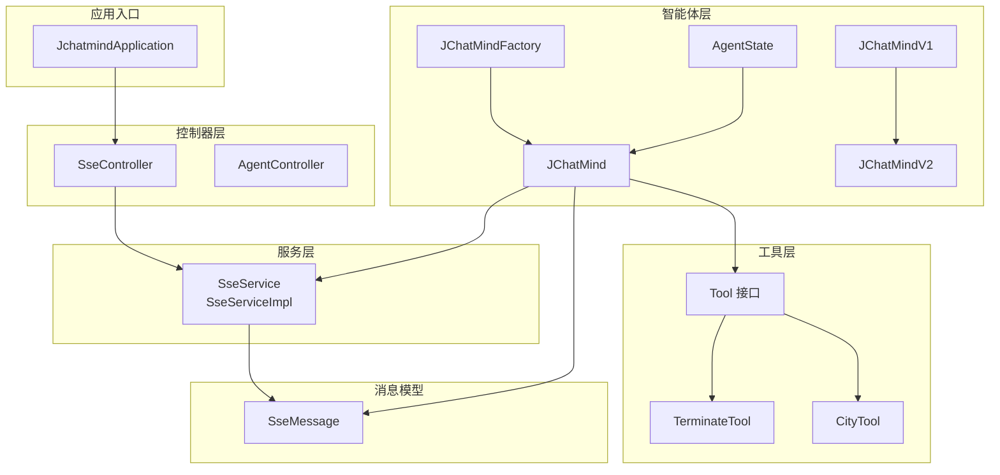
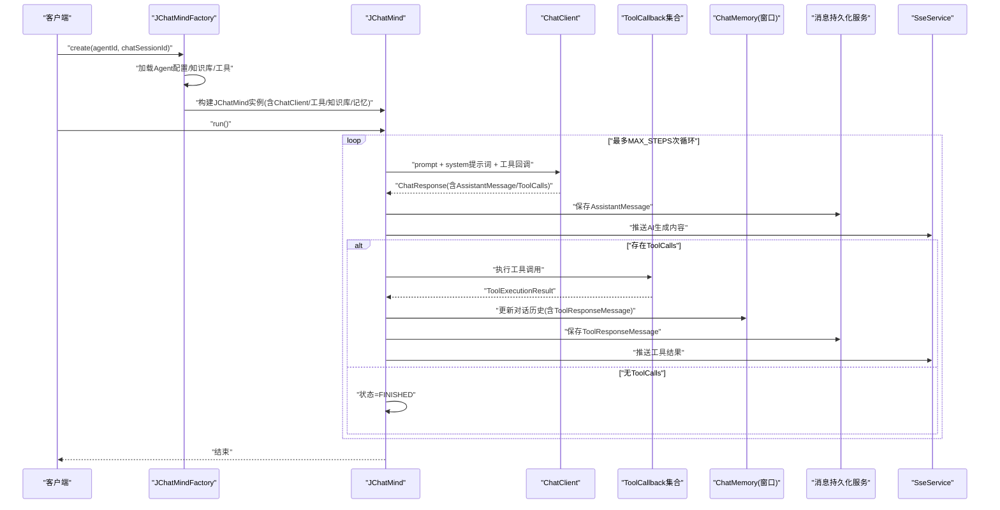
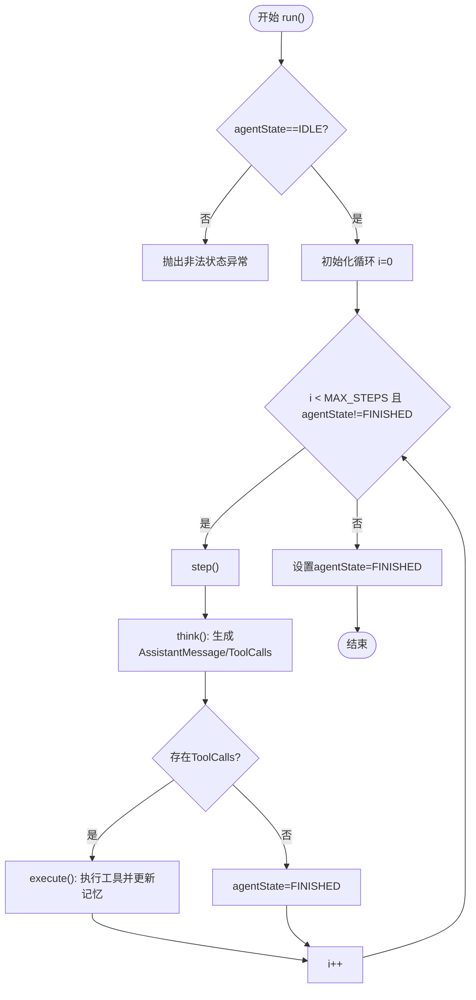
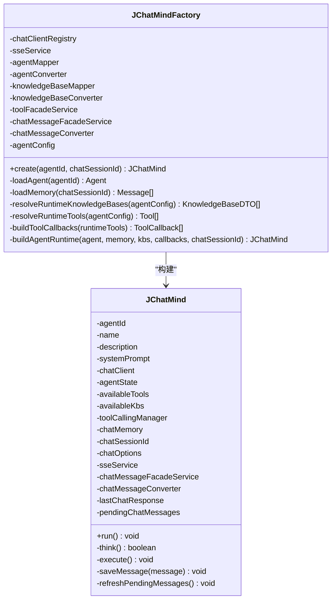
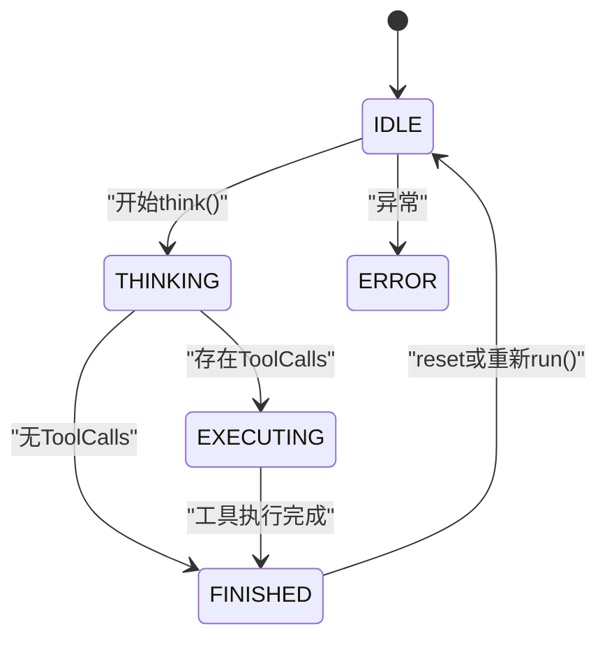
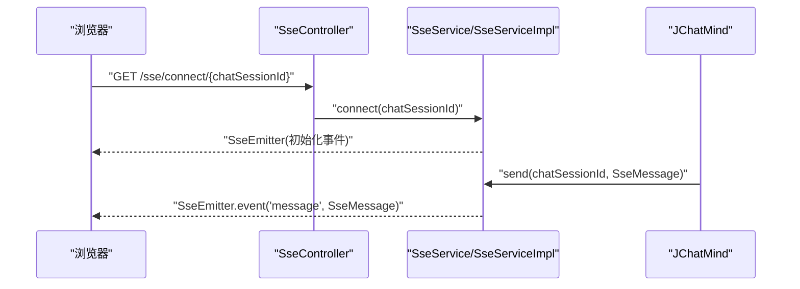
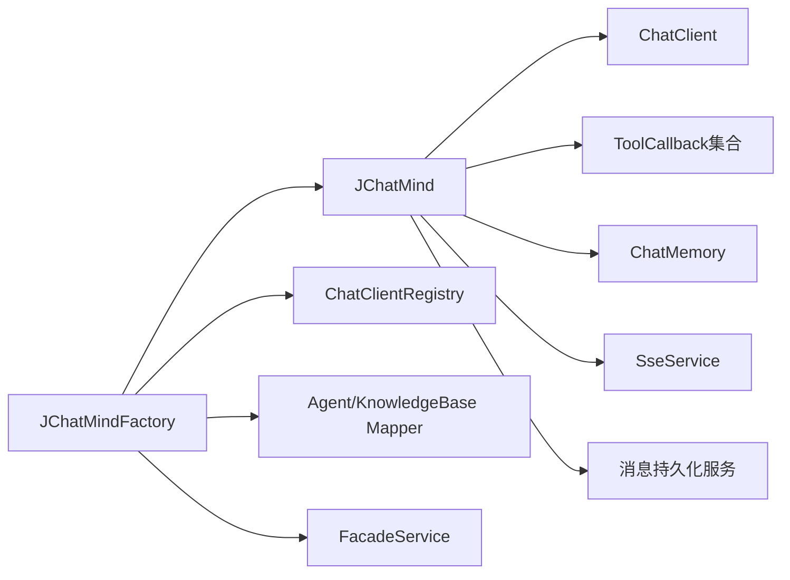

# 核心引擎模块

<cite>
**本文引用的文件**
- [JChatMind.java](file://jchatmind/src/main/java/com/kama/jchatmind/agent/JChatMind.java)
- [JChatMindFactory.java](file://jchatmind/src/main/java/com/kama/jchatmind/agent/JChatMindFactory.java)
- [AgentState.java](file://jchatmind/src/main/java/com/kama/jchatmind/agent/AgentState.java)
- [JChatMindV1.java](file://jchatmind/src/main/java/com/kama/jchatmind/agent/examples/JChatMindV1.java)
- [JChatMindV2.java](file://jchatmind/src/main/java/com/kama/jchatmind/agent/examples/JChatMindV2.java)
- [SseService.java](file://jchatmind/src/main/java/com/kama/jchatmind/service/SseService.java)
- [SseServiceImpl.java](file://jchatmind/src/main/java/com/kama/jchatmind/service/impl/SseServiceImpl.java)
- [SseMessage.java](file://jchatmind/src/main/java/com/kama/jchatmind/message/SseMessage.java)
- [SseController.java](file://jchatmind/src/main/java/com/kama/jchatmind/controller/SseController.java)
- [application.yaml](file://jchatmind/src/main/resources/application.yaml)
- [JChatMindV1Test.java](file://jchatmind/src/test/java/com/kama/jchatmind/agent/examples/JChatMindV1Test.java)
- [JChatMindV2Test.java](file://jchatmind/src/test/java/com/kama/jchatmind/agent/examples/JChatMindV2Test.java)
- [Tool.java](file://jchatmind/src/main/java/com/kama/jchatmind/agent/tools/Tool.java)
- [TerminateTool.java](file://jchatmind/src/main/java/com/kama/jchatmind/agent/tools/TerminateTool.java)
- [CityTool.java](file://jchatmind/src/main/java/com/kama/jchatmind/agent/tools/test/CityTool.java)
</cite>

## 目录
1. [简介](#简介)
2. [项目结构](#项目结构)
3. [核心组件](#核心组件)
4. [架构总览](#架构总览)
5. [详细组件分析](#详细组件分析)
6. [依赖分析](#依赖分析)
7. [性能考虑](#性能考虑)
8. [故障排查指南](#故障排查指南)
9. [结论](#结论)
10. [附录](#附录)

## 简介
本文件面向JChatMind核心引擎模块，聚焦于JChatMind类的“思考-执行”循环机制，系统性解析其状态管理、内存管理、工具调用流程、系统提示词处理、消息持久化与SSE实时通信集成。同时提供V1与V2版本的差异对比，覆盖错误处理、性能优化与调试技巧，帮助开发者快速理解并正确使用智能代理。

## 项目结构
JChatMind采用分层与职责分离设计：
- agent层：核心智能体实现（JChatMind、JChatMindV1/V2、AgentState、JChatMindFactory）
- service层：业务服务（SseService、SseServiceImpl等）
- controller层：HTTP接口（SseController等）
- message层：SSE消息模型（SseMessage）
- tools层：工具接口与具体工具（Tool、TerminateTool、CityTool等）
- 配置与资源：application.yaml、MyBatis映射XML等

图表来源
- [JchatmindApplication.java:1-14](file://jchatmind/src/main/java/com/kama/jchatmind/JchatmindApplication.java#L1-L14)
- [SseController.java:1-24](file://jchatmind/src/main/java/com/kama/jchatmind/controller/SseController.java#L1-L24)
- [SseService.java:1-12](file://jchatmind/src/main/java/com/kama/jchatmind/service/SseService.java#L1-L12)
- [SseServiceImpl.java:1-64](file://jchatmind/src/main/java/com/kama/jchatmind/service/impl/SseServiceImpl.java#L1-L64)
- [SseMessage.java:1-47](file://jchatmind/src/main/java/com/kama/jchatmind/message/SseMessage.java#L1-L47)
- [JChatMindFactory.java:1-248](file://jchatmind/src/main/java/com/kama/jchatmind/agent/JChatMindFactory.java#L1-L248)
- [JChatMind.java:1-348](file://jchatmind/src/main/java/com/kama/jchatmind/agent/JChatMind.java#L1-L348)
- [AgentState.java:1-11](file://jchatmind/src/main/java/com/kama/jchatmind/agent/AgentState.java#L1-L11)
- [JChatMindV1.java:1-153](file://jchatmind/src/main/java/com/kama/jchatmind/agent/examples/JChatMindV1.java#L1-L153)
- [JChatMindV2.java:1-268](file://jchatmind/src/main/java/com/kama/jchatmind/agent/examples/JChatMindV2.java#L1-L268)
- [Tool.java:1-10](file://jchatmind/src/main/java/com/kama/jchatmind/agent/tools/Tool.java#L1-L10)
- [TerminateTool.java:1-26](file://jchatmind/src/main/java/com/kama/jchatmind/agent/tools/TerminateTool.java#L1-L26)
- [CityTool.java:1-29](file://jchatmind/src/main/java/com/kama/jchatmind/agent/tools/test/CityTool.java#L1-L29)

章节来源
- [JchatmindApplication.java:1-14](file://jchatmind/src/main/java/com/kama/jchatmind/JchatmindApplication.java#L1-L14)
- [application.yaml:1-43](file://jchatmind/src/main/resources/application.yaml#L1-L43)

## 核心组件
- JChatMind：核心智能体，负责“思考-执行”循环、状态机驱动、内存窗口管理、工具调用与执行、消息持久化、SSE推送。
- JChatMindFactory：工厂类，负责加载Agent配置、恢复记忆、解析可用知识库与工具、构建JChatMind运行时实例。
- AgentState：智能体状态枚举，定义IDLE、PLANNING、THINKING、EXECUTING、FINISHED、ERROR等状态。
- V1/V2示例：演示从基础聊天到ReAct工具调用的演进路径。
- SSE服务链路：SseService/SseServiceImpl/SseMessage/SseController构成前后端流式通信通道。
- 工具体系：Tool接口与具体工具（如TerminateTool、CityTool），配合MethodToolCallbackProvider注册为ToolCallback。

章节来源
- [JChatMind.java:32-140](file://jchatmind/src/main/java/com/kama/jchatmind/agent/JChatMind.java#L32-L140)
- [JChatMindFactory.java:34-246](file://jchatmind/src/main/java/com/kama/jchatmind/agent/JChatMindFactory.java#L34-L246)
- [AgentState.java:3-10](file://jchatmind/src/main/java/com/kama/jchatmind/agent/AgentState.java#L3-L10)
- [JChatMindV1.java:30-152](file://jchatmind/src/main/java/com/kama/jchatmind/agent/examples/JChatMindV1.java#L30-L152)
- [JChatMindV2.java:32-267](file://jchatmind/src/main/java/com/kama/jchatmind/agent/examples/JChatMindV2.java#L32-L267)
- [SseService.java:6-11](file://jchatmind/src/main/java/com/kama/jchatmind/service/SseService.java#L6-L11)
- [SseServiceImpl.java:14-63](file://jchatmind/src/main/java/com/kama/jchatmind/service/impl/SseServiceImpl.java#L14-L63)
- [SseMessage.java:11-46](file://jchatmind/src/main/java/com/kama/jchatmind/message/SseMessage.java#L11-L46)
- [Tool.java:3-9](file://jchatmind/src/main/java/com/kama/jchatmind/agent/tools/Tool.java#L3-L9)
- [TerminateTool.java:6-25](file://jchatmind/src/main/java/com/kama/jchatmind/agent/tools/TerminateTool.java#L6-L25)
- [CityTool.java:8-28](file://jchatmind/src/main/java/com/kama/jchatmind/agent/tools/test/CityTool.java#L8-L28)

## 架构总览
JChatMind通过工厂加载Agent配置与运行时依赖，结合Spring AI的ChatClient与工具回调，实现“思考-执行”循环。循环中，智能体先以系统提示词与历史消息生成带工具调用的输出，再由工具调用管理器执行工具并将结果写回对话历史，最终将AI生成内容持久化并通过SSE推送到前端。

图表来源
- [JChatMindFactory.java:227-246](file://jchatmind/src/main/java/com/kama/jchatmind/agent/JChatMindFactory.java#L227-L246)
- [JChatMind.java:220-337](file://jchatmind/src/main/java/com/kama/jchatmind/agent/JChatMind.java#L220-L337)
- [SseServiceImpl.java:44-62](file://jchatmind/src/main/java/com/kama/jchatmind/service/impl/SseServiceImpl.java#L44-L62)

## 详细组件分析

### JChatMind：思考-执行循环与状态管理
- 状态管理
  - 使用AgentState枚举管理生命周期：IDLE、THINKING、EXECUTING、FINISHED、ERROR。
  - run()中以MAX_STEPS上限与状态机协同，防止无限循环。
- 内存管理
  - 基于MessageWindowChatMemory，按maxMessages限制窗口大小，自动丢弃最旧消息。
  - 构造时注入初始memory，并可追加systemPrompt。
- 工具调用流程
  - think()阶段：构建Prompt+system提示词+工具回调，生成带ToolCalls的AssistantMessage。
  - execute()阶段：ToolCallingManager执行工具调用，更新对话历史，识别terminate工具结束循环。
- 消息持久化与SSE推送
  - saveMessage()仅持久化AssistantMessage与ToolResponseMessage，SystemMessage不持久化。
  - refreshPendingMessages()将待推送消息转VO并通过SseMessage封装后发送。
- 系统提示词处理
  - 构造函数中将systemPrompt作为SystemMessage加入记忆；think()阶段通过system(thinkPrompt)临时注入“决策模块”提示词，避免污染长期记忆。

图表来源
- [JChatMind.java:316-337](file://jchatmind/src/main/java/com/kama/jchatmind/agent/JChatMind.java#L316-L337)
- [JChatMind.java:307-313](file://jchatmind/src/main/java/com/kama/jchatmind/agent/JChatMind.java#L307-L313)
- [JChatMind.java:220-263](file://jchatmind/src/main/java/com/kama/jchatmind/agent/JChatMind.java#L220-L263)
- [JChatMind.java:266-304](file://jchatmind/src/main/java/com/kama/jchatmind/agent/JChatMind.java#L266-L304)

章节来源
- [JChatMind.java:32-140](file://jchatmind/src/main/java/com/kama/jchatmind/agent/JChatMind.java#L32-L140)
- [JChatMind.java:162-217](file://jchatmind/src/main/java/com/kama/jchatmind/agent/JChatMind.java#L162-L217)
- [JChatMind.java:219-304](file://jchatmind/src/main/java/com/kama/jchatmind/agent/JChatMind.java#L219-L304)
- [JChatMind.java:315-337](file://jchatmind/src/main/java/com/kama/jchatmind/agent/JChatMind.java#L315-L337)

### JChatMindFactory：工厂模式与运行时装配
- 职责
  - 加载Agent实体与DTO配置，解析允许的知识库与工具集合。
  - 从ChatClientRegistry按模型名获取ChatClient。
  - 将工具转换为ToolCallback，构建JChatMind运行时实例。
- 关键流程
  - loadAgent()/toAgentConfig()：读取Agent元数据与配置。
  - loadMemory()：从最近消息重建Message历史，支持SYSTEM/USER/ASSISTANT/TOOL四种类型。
  - resolveRuntimeKnowledgeBases()/resolveRuntimeTools()：按Agent配置过滤可用KB与工具。
  - buildToolCallbacks()：MethodToolCallbackProvider生成回调。
  - buildAgentRuntime()：组装JChatMind所需依赖。

图表来源
- [JChatMindFactory.java:34-246](file://jchatmind/src/main/java/com/kama/jchatmind/agent/JChatMindFactory.java#L34-L246)
- [JChatMind.java:90-140](file://jchatmind/src/main/java/com/kama/jchatmind/agent/JChatMind.java#L90-L140)

章节来源
- [JChatMindFactory.java:72-116](file://jchatmind/src/main/java/com/kama/jchatmind/agent/JChatMindFactory.java#L72-L116)
- [JChatMindFactory.java:118-170](file://jchatmind/src/main/java/com/kama/jchatmind/agent/JChatMindFactory.java#L118-L170)
- [JChatMindFactory.java:172-222](file://jchatmind/src/main/java/com/kama/jchatmind/agent/JChatMindFactory.java#L172-L222)
- [JChatMindFactory.java:227-246](file://jchatmind/src/main/java/com/kama/jchatmind/agent/JChatMindFactory.java#L227-L246)

### AgentState：状态转换逻辑
- 状态定义：IDLE、PLANNING、THINKING、EXECUTING、FINISHED、ERROR。
- 转换要点
  - run()启动前必须为IDLE；异常时置ERROR；成功或达到MAX_STEPS或收到terminate工具时置FINISHED。
  - think()阶段对应THINKING；execute()阶段对应EXECUTING；中间可能经历PLANNING（工厂装配阶段）。

图表来源
- [AgentState.java:3-10](file://jchatmind/src/main/java/com/kama/jchatmind/agent/AgentState.java#L3-L10)
- [JChatMind.java:316-337](file://jchatmind/src/main/java/com/kama/jchatmind/agent/JChatMind.java#L316-L337)
- [JChatMind.java:266-304](file://jchatmind/src/main/java/com/kama/jchatmind/agent/JChatMind.java#L266-L304)

章节来源
- [AgentState.java:3-10](file://jchatmind/src/main/java/com/kama/jchatmind/agent/AgentState.java#L3-L10)
- [JChatMind.java:316-337](file://jchatmind/src/main/java/com/kama/jchatmind/agent/JChatMind.java#L316-L337)

### V1与V2版本差异对比
- V1（基础聊天）
  - 功能：ChatClient交互、ChatMemory窗口、系统提示词、单轮对话。
  - 状态：IDLE/THINKING/FINISHED/ERROR。
  - 无工具调用，无think-execute循环。
- V2（ReAct模型）
  - 功能：继承V1，新增工具调用、think-execute循环、ToolCallingManager自动执行工具、终止工具检测。
  - 状态：IDLE/THINKING/EXECUTING/FINISHED/ERROR。
  - 通过DefaultToolCallingChatOptions禁用内置工具自动执行，改为手动控制。

章节来源
- [JChatMindV1.java:30-152](file://jchatmind/src/main/java/com/kama/jchatmind/agent/examples/JChatMindV1.java#L30-L152)
- [JChatMindV2.java:32-267](file://jchatmind/src/main/java/com/kama/jchatmind/agent/examples/JChatMindV2.java#L32-L267)

### 系统提示词处理
- 构造函数：将systemPrompt作为SystemMessage加入记忆，保证后续对话具备上下文基线。
- think()阶段：通过system(thinkPrompt)注入“决策模块”提示词，临时影响本次推理但不写入长期记忆，避免污染历史。

章节来源
- [JChatMind.java:128-136](file://jchatmind/src/main/java/com/kama/jchatmind/agent/JChatMind.java#L128-L136)
- [JChatMind.java:220-244](file://jchatmind/src/main/java/com/kama/jchatmind/agent/JChatMind.java#L220-L244)

### 消息持久化机制
- 仅持久化两类消息：
  - AssistantMessage：AI回复文本与工具调用元数据。
  - ToolResponseMessage：工具返回数据，拆分为多条Tool消息。
- SystemMessage与UserMessage不在JChatMind内持久化，前者由构造注入，后者在用户发送时已持久化。
- 持久化后加入pending队列，通过refreshPendingMessages()统一转换为VO并通过SseMessage推送。

章节来源
- [JChatMind.java:167-199](file://jchatmind/src/main/java/com/kama/jchatmind/agent/JChatMind.java#L167-L199)
- [JChatMind.java:201-217](file://jchatmind/src/main/java/com/kama/jchatmind/agent/JChatMind.java#L201-L217)

### SSE实时通信集成
- SseController：提供/sse/connect/{chatSessionId}建立SSE连接。
- SseService：抽象连接与发送能力。
- SseServiceImpl：基于SseEmitter维护客户端映射，发送SseMessage事件。
- SseMessage：定义消息类型（AI_GENERATED_CONTENT等）、负载与元数据（包含chatMessageId）。

图表来源
- [SseController.java:18-22](file://jchatmind/src/main/java/com/kama/jchatmind/controller/SseController.java#L18-L22)
- [SseService.java:6-11](file://jchatmind/src/main/java/com/kama/jchatmind/service/SseService.java#L6-L11)
- [SseServiceImpl.java:21-62](file://jchatmind/src/main/java/com/kama/jchatmind/service/impl/SseServiceImpl.java#L21-L62)
- [SseMessage.java:11-46](file://jchatmind/src/main/java/com/kama/jchatmind/message/SseMessage.java#L11-L46)
- [JChatMind.java:201-217](file://jchatmind/src/main/java/com/kama/jchatmind/agent/JChatMind.java#L201-L217)

章节来源
- [SseController.java:1-24](file://jchatmind/src/main/java/com/kama/jchatmind/controller/SseController.java#L1-L24)
- [SseService.java:1-12](file://jchatmind/src/main/java/com/kama/jchatmind/service/SseService.java#L1-L12)
- [SseServiceImpl.java:1-64](file://jchatmind/src/main/java/com/kama/jchatmind/service/impl/SseServiceImpl.java#L1-L64)
- [SseMessage.java:1-47](file://jchatmind/src/main/java/com/kama/jchatmind/message/SseMessage.java#L1-L47)

### 工具调用与终止机制
- 工具接口：Tool接口定义名称、描述与类型；具体工具通过注解暴露方法。
- 终止工具：TerminateTool在工具链中触发，当工具返回包含terminate时，智能体立即结束循环。
- 示例工具：CityTool等通过MethodToolCallbackProvider注册为ToolCallback。

章节来源
- [Tool.java:3-9](file://jchatmind/src/main/java/com/kama/jchatmind/agent/tools/Tool.java#L3-L9)
- [TerminateTool.java:6-25](file://jchatmind/src/main/java/com/kama/jchatmind/agent/tools/TerminateTool.java#L6-L25)
- [CityTool.java:8-28](file://jchatmind/src/main/java/com/kama/jchatmind/agent/tools/test/CityTool.java#L8-L28)
- [JChatMind.java:298-303](file://jchatmind/src/main/java/com/kama/jchatmind/agent/JChatMind.java#L298-L303)

## 依赖分析
- 组件耦合
  - JChatMind依赖ChatClient、ChatMemory、ToolCallback集合、SseService、消息持久化服务与转换器。
  - JChatMindFactory承担装配职责，解耦上层调用者与底层依赖。
- 外部依赖
  - Spring AI ChatClient与工具回调框架。
  - Spring MVC SSE支持。
  - 数据源与邮件配置（application.yaml）。

图表来源
- [JChatMind.java:90-140](file://jchatmind/src/main/java/com/kama/jchatmind/agent/JChatMind.java#L90-L140)
- [JChatMindFactory.java:50-70](file://jchatmind/src/main/java/com/kama/jchatmind/agent/JChatMindFactory.java#L50-L70)
- [application.yaml:4-43](file://jchatmind/src/main/resources/application.yaml#L4-L43)

章节来源
- [JChatMind.java:9-25](file://jchatmind/src/main/java/com/kama/jchatmind/agent/JChatMind.java#L9-L25)
- [JChatMindFactory.java:3-31](file://jchatmind/src/main/java/com/kama/jchatmind/agent/JChatMindFactory.java#L3-L31)
- [application.yaml:1-43](file://jchatmind/src/main/resources/application.yaml#L1-L43)

## 性能考虑
- 内存窗口大小：通过maxMessages限制对话历史长度，建议根据上下文需求与模型token预算合理设置。
- 工具调用开销：工具执行可能涉及网络I/O，建议在execute()后批量刷新pending消息，减少SSE发送频率。
- 最大步数：MAX_STEPS限制循环次数，避免长链路阻塞；可根据任务复杂度调整。
- 异常与回退：run()中捕获异常并置ERROR状态，便于上层感知与重试策略。

[本节为通用指导，无需特定文件引用]

## 故障排查指南
- 状态异常
  - 若run()前非IDLE，抛出非法状态异常；检查调用顺序与并发控制。
- 工具未生效
  - 确认工具已注册为ToolCallback并传入ChatClient；检查工具名称与参数匹配。
- SSE无推送
  - 检查SseController连接路径与chatSessionId；确认SseServiceImpl客户端映射存在。
- 持久化缺失
  - 仅AssistantMessage与ToolResponseMessage会被持久化；SystemMessage与UserMessage在其他位置已持久化。
- 终止无效
  - 确认工具返回包含terminate；检查工具返回值与名称一致性。

章节来源
- [JChatMind.java:316-337](file://jchatmind/src/main/java/com/kama/jchatmind/agent/JChatMind.java#L316-L337)
- [JChatMind.java:298-303](file://jchatmind/src/main/java/com/kama/jchatmind/agent/JChatMind.java#L298-L303)
- [SseController.java:18-22](file://jchatmind/src/main/java/com/kama/jchatmind/controller/SseController.java#L18-L22)
- [SseServiceImpl.java:44-62](file://jchatmind/src/main/java/com/kama/jchatmind/service/impl/SseServiceImpl.java#L44-L62)

## 结论
JChatMind通过清晰的状态机、可控的内存窗口、可插拔的工具链与SSE实时反馈，实现了从基础对话到ReAct工具调用的完整闭环。JChatMindFactory负责运行时装配，使智能体配置与执行解耦。遵循本文的使用规范与优化建议，可在保证稳定性的同时提升交互体验与扩展性。

[本节为总结，无需特定文件引用]

## 附录

### 使用示例与最佳实践（路径指引）
- V1基础聊天
  - 创建与调用：参考[JChatMindV1Test.java:24-46](file://jchatmind/src/test/java/com/kama/jchatmind/agent/examples/JChatMindV1Test.java#L24-L46)
  - 多轮对话与重置：参考[JChatMindV1Test.java:48-74](file://jchatmind/src/test/java/com/kama/jchatmind/agent/examples/JChatMindV1Test.java#L48-L74)、[JChatMindV1Test.java:76-102](file://jchatmind/src/test/java/com/kama/jchatmind/agent/examples/JChatMindV1Test.java#L76-L102)
- V2工具调用
  - 工具回调准备：参考[JChatMindV2Test.java:42-47](file://jchatmind/src/test/java/com/kama/jchatmind/agent/examples/JChatMindV2Test.java#L42-L47)
  - 单工具调用：参考[JChatMindV2Test.java:41-70](file://jchatmind/src/test/java/com/kama/jchatmind/agent/examples/JChatMindV2Test.java#L41-L70)
  - 多工具调用与ReAct循环：参考[JChatMindV2Test.java:72-102](file://jchatmind/src/test/java/com/kama/jchatmind/agent/examples/JChatMindV2Test.java#L72-L102)、[JChatMindV2Test.java:129-159](file://jchatmind/src/test/java/com/kama/jchatmind/agent/examples/JChatMindV2Test.java#L129-L159)
- 工厂装配与运行
  - 工厂创建智能体：参考[JChatMindFactory.java:227-246](file://jchatmind/src/main/java/com/kama/jchatmind/agent/JChatMindFactory.java#L227-L246)
  - 智能体运行：参考[JChatMind.java:315-337](file://jchatmind/src/main/java/com/kama/jchatmind/agent/JChatMind.java#L315-L337)

### 配置参考
- 数据源与模型配置：参考[application.yaml:4-38](file://jchatmind/src/main/resources/application.yaml#L4-L38)
- 文档存储路径：参考[application.yaml:40-43](file://jchatmind/src/main/resources/application.yaml#L40-L43)