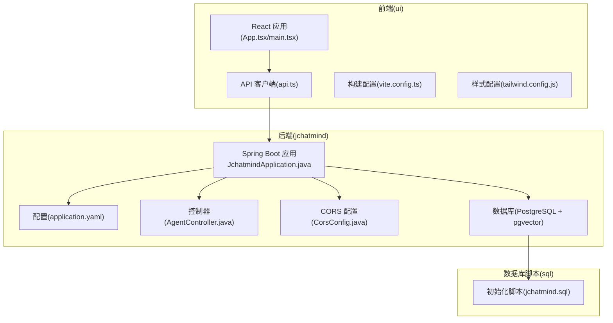
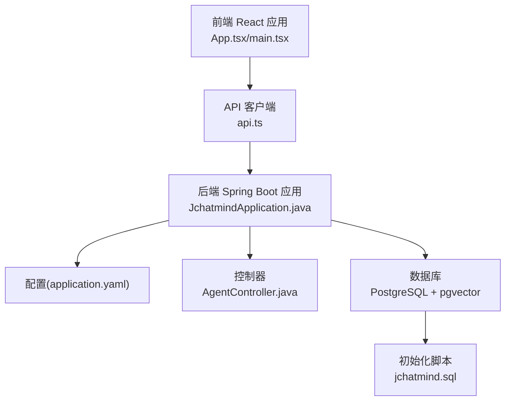
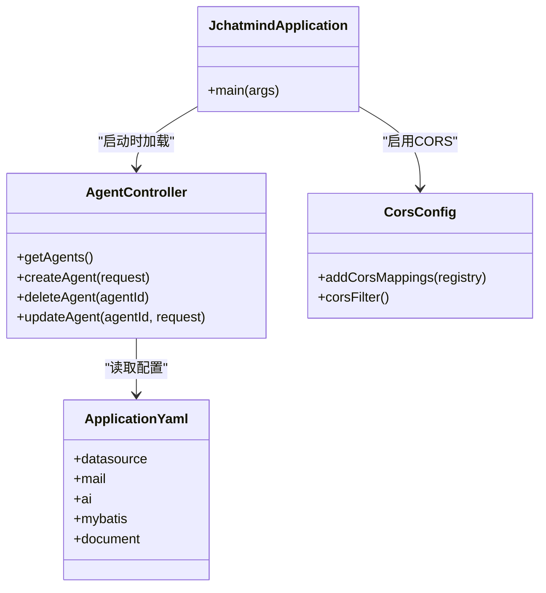
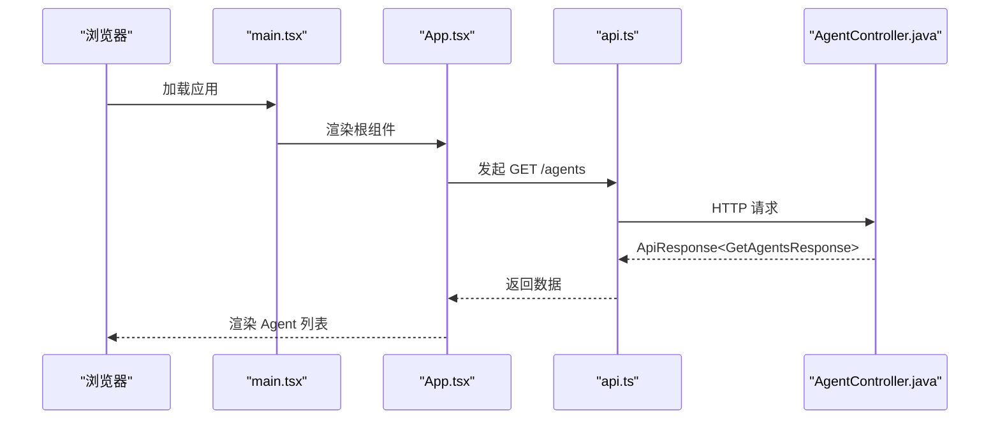
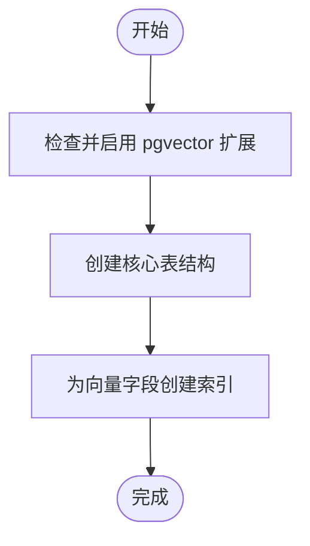
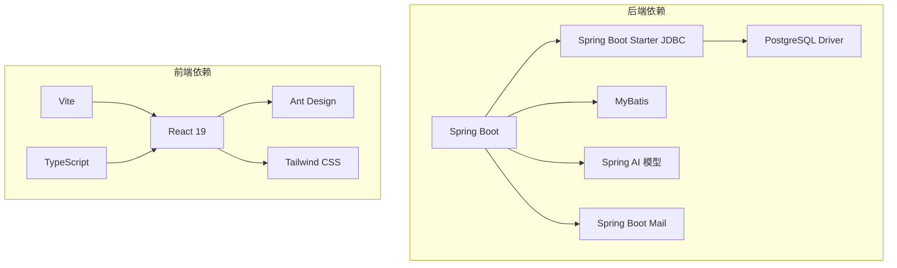

# 快速开始

<cite>
**本文引用的文件**
- [README.md](file://README.md)
- [JchatmindApplication.java](file://jchatmind/src/main/java/com/kama/jchatmind/JchatmindApplication.java)
- [application.yaml](file://jchatmind/src/main/resources/application.yaml)
- [pom.xml](file://jchatmind/pom.xml)
- [CorsConfig.java](file://jchatmind/src/main/java/com/kama/jchatmind/config/CorsConfig.java)
- [AgentController.java](file://jchatmind/src/main/java/com/kama/jchatmind/controller/AgentController.java)
- [jchatmind.sql](file://sql/jchatmind.sql)
- [package.json](file://ui/package.json)
- [vite.config.ts](file://ui/vite.config.ts)
- [api.ts](file://ui/src/api/api.ts)
- [App.tsx](file://ui/src/App.tsx)
- [main.tsx](file://ui/src/main.tsx)
- [tailwind.config.js](file://ui/tailwind.config.js)
- [example1.html](file://examples/example1.html)
</cite>

## 目录
1. [简介](#简介)
2. [项目结构](#项目结构)
3. [核心组件](#核心组件)
4. [架构总览](#架构总览)
5. [详细组件分析](#详细组件分析)
6. [依赖关系分析](#依赖关系分析)
7. [性能考虑](#性能考虑)
8. [故障排除指南](#故障排除指南)
9. [结论](#结论)
10. [附录](#附录)

## 简介
JChatMind 是一个基于 Spring AI 框架构建的智能 Agent 系统，具备 Think-Execute 循环、工具调用与 RAG 知识库检索能力。系统采用分层架构与 Agent 核心服务，将 AI 能力（模型、RAG、工具）抽象为可组合、可扩展的模块化系统。

本快速开始指南面向新手开发者，帮助你在约 30 分钟内完成环境准备、安装配置与首次运行，涵盖：
- 环境要求与安装步骤
- 后端 Spring Boot 应用与前端 React 应用的完整启动流程
- 数据库初始化脚本说明与初始配置示例
- 常见问题解决方案与验证安装成功的方法

## 项目结构
项目采用前后端分离架构，后端为 Spring Boot 应用，前端为 React 应用，数据库使用 PostgreSQL + pgvector 扩展。

图表来源
- [JchatmindApplication.java:1-14](file://jchatmind/src/main/java/com/kama/jchatmind/JchatmindApplication.java#L1-L14)
- [application.yaml:1-43](file://jchatmind/src/main/resources/application.yaml#L1-L43)
- [AgentController.java:1-45](file://jchatmind/src/main/java/com/kama/jchatmind/controller/AgentController.java#L1-L45)
- [CorsConfig.java:1-61](file://jchatmind/src/main/java/com/kama/jchatmind/config/CorsConfig.java#L1-L61)
- [jchatmind.sql:1-88](file://sql/jchatmind.sql#L1-L88)
- [App.tsx:1-16](file://ui/src/App.tsx#L1-L16)
- [main.tsx:1-11](file://ui/src/main.tsx#L1-L11)
- [api.ts:1-378](file://ui/src/api/api.ts#L1-L378)
- [vite.config.ts:1-9](file://ui/vite.config.ts#L1-L9)
- [tailwind.config.js:1-59](file://ui/tailwind.config.js#L1-L59)

章节来源
- [README.md:1-71](file://README.md#L1-L71)
- [pom.xml:1-131](file://jchatmind/pom.xml#L1-L131)
- [package.json:1-44](file://ui/package.json#L1-L44)

## 核心组件
- 后端 Spring Boot 应用：负责业务逻辑、数据持久化、模型调用与工具集成。
- 前端 React 应用：提供用户界面，通过 API 客户端与后端交互。
- 数据库：PostgreSQL + pgvector，用于存储 Agent、会话、消息、知识库与向量嵌入。
- 构建工具：Vite + Tailwind CSS，提供现代化的前端开发体验。

章节来源
- [README.md:31-45](file://README.md#L31-L45)
- [application.yaml:1-43](file://jchatmind/src/main/resources/application.yaml#L1-L43)
- [jchatmind.sql:1-88](file://sql/jchatmind.sql#L1-L88)

## 架构总览
系统采用前后端分离架构，前端通过 RESTful API 与后端通信，后端使用 Spring MVC 提供接口，MyBatis 进行数据访问，PostgreSQL 存储结构化数据与向量索引。

图表来源
- [App.tsx:1-16](file://ui/src/App.tsx#L1-L16)
- [main.tsx:1-11](file://ui/src/main.tsx#L1-L11)
- [api.ts:1-378](file://ui/src/api/api.ts#L1-L378)
- [JchatmindApplication.java:1-14](file://jchatmind/src/main/java/com/kama/jchatmind/JchatmindApplication.java#L1-L14)
- [application.yaml:1-43](file://jchatmind/src/main/resources/application.yaml#L1-L43)
- [AgentController.java:1-45](file://jchatmind/src/main/java/com/kama/jchatmind/controller/AgentController.java#L1-L45)
- [jchatmind.sql:1-88](file://sql/jchatmind.sql#L1-L88)

## 详细组件分析

### 后端 Spring Boot 应用
- 启动入口：应用主类负责启动 Spring Boot 容器。
- 配置中心：application.yaml 定义数据源、邮件、AI 模型、MyBatis 参数与文档存储路径。
- 控制器层：提供 REST 接口，统一返回 ApiResponse 包装格式。
- CORS 配置：允许本地开发环境跨域访问，便于前后端联调。

图表来源
- [JchatmindApplication.java:1-14](file://jchatmind/src/main/java/com/kama/jchatmind/JchatmindApplication.java#L1-L14)
- [AgentController.java:1-45](file://jchatmind/src/main/java/com/kama/jchatmind/controller/AgentController.java#L1-L45)
- [CorsConfig.java:1-61](file://jchatmind/src/main/java/com/kama/jchatmind/config/CorsConfig.java#L1-L61)
- [application.yaml:1-43](file://jchatmind/src/main/resources/application.yaml#L1-L43)

章节来源
- [JchatmindApplication.java:1-14](file://jchatmind/src/main/java/com/kama/jchatmind/JchatmindApplication.java#L1-L14)
- [AgentController.java:1-45](file://jchatmind/src/main/java/com/kama/jchatmind/controller/AgentController.java#L1-L45)
- [CorsConfig.java:1-61](file://jchatmind/src/main/java/com/kama/jchatmind/config/CorsConfig.java#L1-L61)
- [application.yaml:1-43](file://jchatmind/src/main/resources/application.yaml#L1-L43)

### 前端 React 应用
- 应用入口：main.tsx 设置 Ant Design 中文语言包并渲染根组件。
- 路由与布局：App.tsx 使用 BrowserRouter 与上下文 Provider 包裹布局组件。
- API 客户端：api.ts 定义了 Agent、会话、消息、知识库、文档与工具的 CRUD 接口。
- 构建与样式：vite.config.ts 集成 React 与 Tailwind CSS 插件；tailwind.config.js 定义动画与主题扩展。

图表来源
- [main.tsx:1-11](file://ui/src/main.tsx#L1-L11)
- [App.tsx:1-16](file://ui/src/App.tsx#L1-L16)
- [api.ts:54-85](file://ui/src/api/api.ts#L54-L85)
- [AgentController.java:19-23](file://jchatmind/src/main/java/com/kama/jchatmind/controller/AgentController.java#L19-L23)

章节来源
- [main.tsx:1-11](file://ui/src/main.tsx#L1-L11)
- [App.tsx:1-16](file://ui/src/App.tsx#L1-L16)
- [api.ts:1-378](file://ui/src/api/api.ts#L1-L378)
- [vite.config.ts:1-9](file://ui/vite.config.ts#L1-L9)
- [tailwind.config.js:1-59](file://ui/tailwind.config.js#L1-L59)

### 数据库初始化脚本
- 扩展：确保启用 pgvector 向量扩展。
- 表结构：agent、chat_session、chat_message、knowledge_base、document、chunk_bge_m3。
- 索引：为向量字段创建 IVFFLAT 索引以提升相似度检索性能。

图表来源
- [jchatmind.sql:1-88](file://sql/jchatmind.sql#L1-L88)

章节来源
- [jchatmind.sql:1-88](file://sql/jchatmind.sql#L1-L88)

## 依赖关系分析
- 后端依赖：Spring Boot Web、JDBC、MyBatis、PostgreSQL 驱动、Spring AI 模型（DeepSeek、智谱 AI）、邮件 Starter。
- 前端依赖：React 19、Ant Design、Tailwind CSS、Vite、TypeScript。
- 构建工具：Maven（后端）、NPM（前端）。

图表来源
- [pom.xml:46-121](file://jchatmind/pom.xml#L46-L121)
- [package.json:12-39](file://ui/package.json#L12-L39)

章节来源
- [pom.xml:1-131](file://jchatmind/pom.xml#L1-L131)
- [package.json:1-44](file://ui/package.json#L1-L44)

## 性能考虑
- 向量索引：使用 IVFFLAT 索引加速相似度检索，建议根据数据规模调整 lists 参数。
- 数据库连接池：合理配置连接池大小与超时时间，避免高并发下的连接争用。
- 前端懒加载：对重型组件进行按需加载，减少首屏体积。
- 缓存策略：对静态资源与不频繁变更的数据使用缓存，降低后端压力。

## 故障排除指南
- 端口冲突
  - 现象：启动后端或前端报端口占用。
  - 处理：修改默认端口或释放占用端口。
- CORS 跨域问题
  - 现象：前端无法访问后端接口。
  - 处理：确认 CORS 配置允许本地开发域名，或临时关闭凭证限制。
- 数据库连接失败
  - 现象：应用启动时报数据库连接异常。
  - 处理：检查数据库服务状态、账号密码与网络连通性。
- pgvector 扩展缺失
  - 现象：初始化脚本报错找不到 vector 类型。
  - 处理：在目标数据库中执行扩展安装命令后再运行脚本。
- API Key 无效
  - 现象：调用模型接口返回鉴权错误。
  - 处理：在配置中更新有效的 API Key 与基础地址。

章节来源
- [CorsConfig.java:19-34](file://jchatmind/src/main/java/com/kama/jchatmind/config/CorsConfig.java#L19-L34)
- [application.yaml:5-7](file://jchatmind/src/main/resources/application.yaml#L5-L7)
- [jchatmind.sql:1-1](file://sql/jchatmind.sql#L1-L1)
- [api.ts:1-378](file://ui/src/api/api.ts#L1-L378)

## 结论
通过本指南，你可以在 30 分钟内完成 JChatMind 的环境准备、安装配置与首次运行。建议先完成数据库初始化与后端启动，再启动前端进行联调验证。遇到问题时，优先检查端口、CORS、数据库连接与 pgvector 扩展状态。

## 附录

### 环境要求
- JDK 17+
- Node.js 18+
- PostgreSQL 14+（需安装 pgvector 扩展）

章节来源
- [README.md:48-51](file://README.md#L48-L51)

### 安装步骤
- 克隆仓库到本地
- 准备数据库：创建数据库并启用 pgvector 扩展
- 初始化数据库：执行初始化脚本
- 配置后端：在 application.yaml 中设置数据库连接与模型 API Key
- 安装依赖：后端使用 Maven，前端使用 NPM
- 启动后端：进入 jchatmind 目录，使用 Maven Wrapper 启动
- 启动前端：进入 ui 目录，安装依赖后启动开发服务器

章节来源
- [README.md:46-66](file://README.md#L46-L66)
- [application.yaml:1-43](file://jchatmind/src/main/resources/application.yaml#L1-L43)
- [jchatmind.sql:1-88](file://sql/jchatmind.sql#L1-L88)
- [pom.xml:1-131](file://jchatmind/pom.xml#L1-L131)
- [package.json:1-44](file://ui/package.json#L1-L44)

### 基本配置示例
- 数据库连接：在 application.yaml 中设置正确的主机、端口、数据库名、用户名与密码
- 邮件配置：根据实际邮箱服务商配置 SMTP 参数
- AI 模型：在 application.yaml 中设置 DeepSeek 或智谱 AI 的 API Key 与基础地址
- 文档存储：设置本地文件存储的基础路径

章节来源
- [application.yaml:5-43](file://jchatmind/src/main/resources/application.yaml#L5-L43)

### 后端启动流程
- 进入 jchatmind 目录
- 使用 Maven Wrapper 启动 Spring Boot 应用
- 访问后端接口进行验证（如获取 Agent 列表）

章节来源
- [README.md:53-58](file://README.md#L53-L58)
- [JchatmindApplication.java:1-14](file://jchatmind/src/main/java/com/kama/jchatmind/JchatmindApplication.java#L1-L14)
- [AgentController.java:19-23](file://jchatmind/src/main/java/com/kama/jchatmind/controller/AgentController.java#L19-L23)

### 前端启动流程
- 进入 ui 目录
- 安装依赖
- 启动开发服务器
- 在浏览器中访问前端页面并进行联调

章节来源
- [README.md:60-66](file://README.md#L60-L66)
- [package.json:6-11](file://ui/package.json#L6-L11)
- [vite.config.ts:1-9](file://ui/vite.config.ts#L1-L9)
- [App.tsx:1-16](file://ui/src/App.tsx#L1-L16)
- [main.tsx:1-11](file://ui/src/main.tsx#L1-L11)

### 数据库初始化脚本说明
- 执行顺序：先启用 pgvector，再创建表与索引
- 表结构：包含 Agent、会话、消息、知识库、文档与向量切片表
- 索引：为向量字段建立 IVFFLAT 索引以优化检索性能

章节来源
- [jchatmind.sql:1-88](file://sql/jchatmind.sql#L1-L88)

### 初始配置示例
- 在 application.yaml 中设置数据库连接信息
- 配置邮件服务参数
- 设置 AI 模型的 API Key 与基础地址
- 配置文档存储路径

章节来源
- [application.yaml:5-43](file://jchatmind/src/main/resources/application.yaml#L5-L43)

### 常见问题解决方案
- 端口被占用：修改默认端口或释放占用端口
- CORS 跨域：确认允许本地开发域名或临时关闭凭证限制
- 数据库连接失败：检查数据库服务状态、账号密码与网络连通性
- pgvector 扩展缺失：在目标数据库中安装扩展后再运行脚本
- API Key 无效：在配置中更新有效的 API Key 与基础地址

章节来源
- [CorsConfig.java:19-34](file://jchatmind/src/main/java/com/kama/jchatmind/config/CorsConfig.java#L19-L34)
- [application.yaml:5-7](file://jchatmind/src/main/resources/application.yaml#L5-L7)
- [jchatmind.sql:1-1](file://sql/jchatmind.sql#L1-L1)
- [api.ts:1-378](file://ui/src/api/api.ts#L1-L378)

### 验证安装成功的方法
- 后端：访问后端接口（如获取 Agent 列表），确认返回正常数据
- 前端：启动前端并打开页面，确认页面可正常加载
- 数据库：确认数据库中存在初始化脚本创建的表与索引
- API 测试：使用示例页面或 curl 验证模型接口可用性

章节来源
- [AgentController.java:19-23](file://jchatmind/src/main/java/com/kama/jchatmind/controller/AgentController.java#L19-L23)
- [App.tsx:1-16](file://ui/src/App.tsx#L1-L16)
- [jchatmind.sql:1-88](file://sql/jchatmind.sql#L1-L88)
- [example1.html:1-267](file://examples/example1.html#L1-L267)