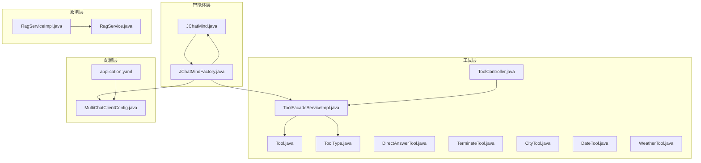
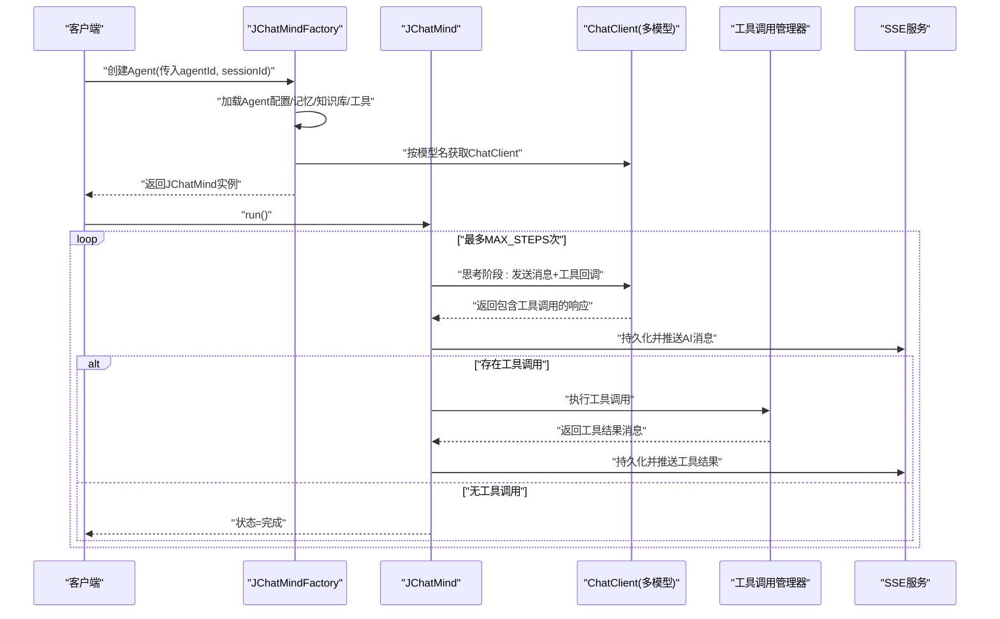
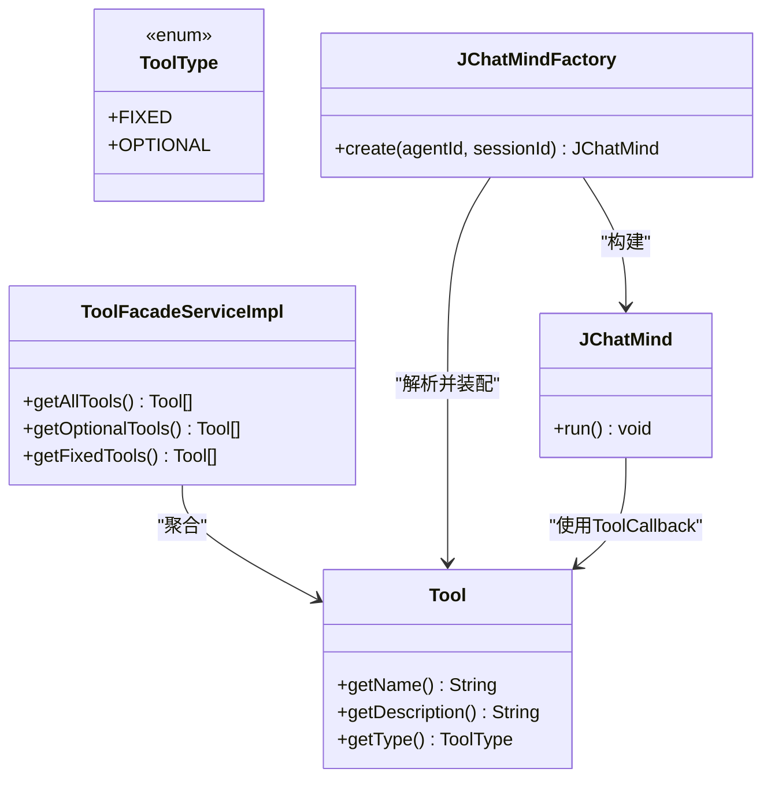
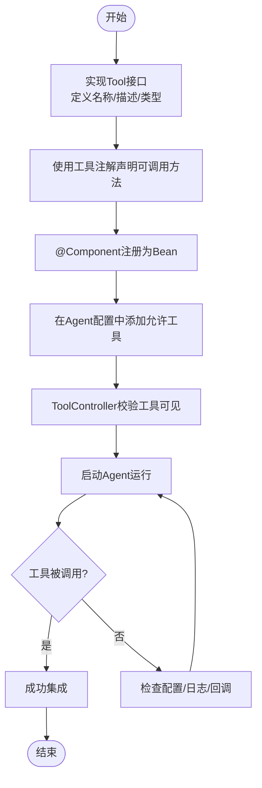
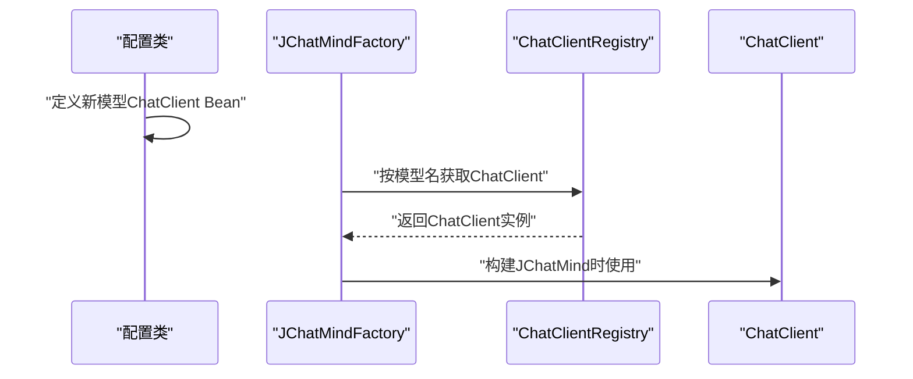
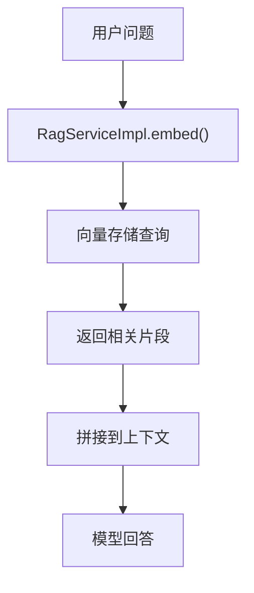
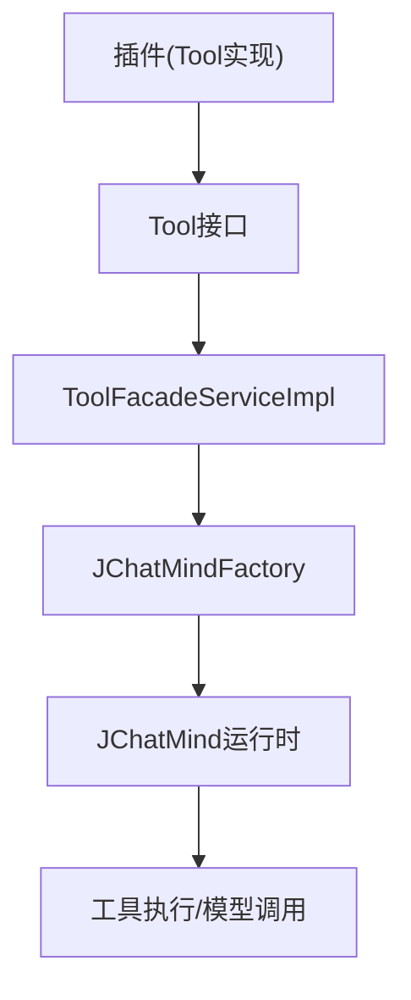
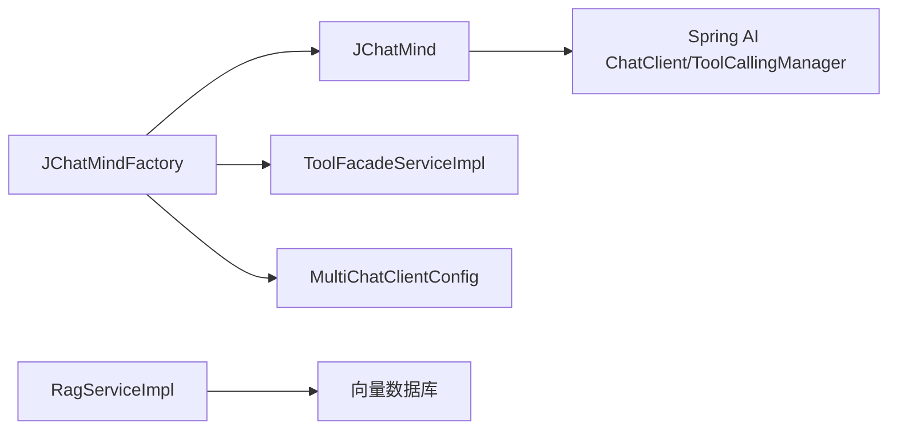

# 扩展开发

<cite>
**本文引用的文件**
- [Tool.java](file://jchatmind/src/main/java/com/kama/jchatmind/agent/tools/Tool.java)
- [ToolType.java](file://jchatmind/src/main/java/com/kama/jchatmind/agent/tools/ToolType.java)
- [JChatMind.java](file://jchatmind/src/main/java/com/kama/jchatmind/agent/JChatMind.java)
- [JChatMindFactory.java](file://jchatmind/src/main/java/com/kama/jchatmind/agent/JChatMindFactory.java)
- [ToolFacadeServiceImpl.java](file://jchatmind/src/main/java/com/kama/jchatmind/service/impl/ToolFacadeServiceImpl.java)
- [CityTool.java](file://jchatmind/src/main/java/com/kama/jchatmind/agent/tools/test/CityTool.java)
- [DateTool.java](file://jchatmind/src/main/java/com/kama/jchatmind/agent/tools/test/DateTool.java)
- [WeatherTool.java](file://jchatmind/src/main/java/com/kama/jchatmind/agent/tools/test/WeatherTool.java)
- [DirectAnswerTool.java](file://jchatmind/src/main/java/com/kama/jchatmind/agent/tools/DirectAnswerTool.java)
- [TerminateTool.java](file://jchatmind/src/main/java/com/kama/jchatmind/agent/tools/TerminateTool.java)
- [RagService.java](file://jchatmind/src/main/java/com/kama/jchatmind/service/RagService.java)
- [RagServiceImpl.java](file://jchatmind/src/main/java/com/kama/jchatmind/service/impl/RagServiceImpl.java)
- [MultiChatClientConfig.java](file://jchatmind/src/main/java/com/kama/jchatmind/config/MultiChatClientConfig.java)
- [ToolController.java](file://jchatmind/src/main/java/com/kama/jchatmind/controller/ToolController.java)
- [application.yaml](file://jchatmind/src/main/resources/application.yaml)
</cite>

## 目录
1. [简介](#简介)
2. [项目结构](#项目结构)
3. [核心组件](#核心组件)
4. [架构总览](#架构总览)
5. [详细组件分析](#详细组件分析)
6. [依赖分析](#依赖分析)
7. [性能考虑](#性能考虑)
8. [故障排查指南](#故障排查指南)
9. [结论](#结论)
10. [附录](#附录)

## 简介
本指南面向希望在JChatMind平台上进行扩展开发的工程师，围绕工具系统的设计与扩展、工具类型分类与注册流程、自定义工具开发的端到端示例、新AI模型集成方法、RAG知识库扩展策略、插件系统设计思路、性能优化与安全注意事项，以及调试与测试策略进行全面阐述。文档中的所有技术细节均来自仓库源码，确保可追溯性与可复现性。

## 项目结构
JChatMind采用分层清晰的Spring Boot工程结构，核心扩展点集中在以下区域：
- agent：智能体运行时与工具回调集成
- agent.tools：工具接口、类型枚举与示例工具
- service：工具门面、RAG服务等业务服务
- config：多模型ChatClient配置
- controller：对外暴露的REST接口（如工具列表）
- resources：应用配置与MyBatis映射

图表来源
- [JChatMind.java:1-348](file://jchatmind/src/main/java/com/kama/jchatmind/agent/JChatMind.java#L1-L348)
- [JChatMindFactory.java:1-248](file://jchatmind/src/main/java/com/kama/jchatmind/agent/JChatMindFactory.java#L1-L248)
- [Tool.java:1-10](file://jchatmind/src/main/java/com/kama/jchatmind/agent/tools/Tool.java#L1-L10)
- [ToolType.java:1-9](file://jchatmind/src/main/java/com/kama/jchatmind/agent/tools/ToolType.java#L1-L9)
- [ToolFacadeServiceImpl.java:1-38](file://jchatmind/src/main/java/com/kama/jchatmind/service/impl/ToolFacadeServiceImpl.java#L1-L38)
- [ToolController.java:1-26](file://jchatmind/src/main/java/com/kama/jchatmind/controller/ToolController.java#L1-L26)
- [RagService.java:1-10](file://jchatmind/src/main/java/com/kama/jchatmind/service/RagService.java#L1-L10)
- [RagServiceImpl.java:1-67](file://jchatmind/src/main/java/com/kama/jchatmind/service/impl/RagServiceImpl.java#L1-L67)
- [MultiChatClientConfig.java:1-23](file://jchatmind/src/main/java/com/kama/jchatmind/config/MultiChatClientConfig.java#L1-L23)
- [application.yaml:1-43](file://jchatmind/src/main/resources/application.yaml#L1-L43)

章节来源
- [JChatMind.java:1-348](file://jchatmind/src/main/java/com/kama/jchatmind/agent/JChatMind.java#L1-L348)
- [JChatMindFactory.java:1-248](file://jchatmind/src/main/java/com/kama/jchatmind/agent/JChatMindFactory.java#L1-L248)
- [application.yaml:1-43](file://jchatmind/src/main/resources/application.yaml#L1-L43)

## 核心组件
- 工具接口与类型
  - Tool接口定义工具名称、描述与类型，作为扩展点的契约。
  - ToolType枚举区分固定工具与可选工具，用于Agent运行时的工具装配。
- 工具门面与工厂
  - ToolFacadeServiceImpl聚合所有Tool Bean，并按类型过滤出固定/可选工具集合。
  - JChatMindFactory负责加载Agent配置、记忆、知识库、工具回调，并构建JChatMind运行时。
- 智能体运行时
  - JChatMind封装思考与执行两阶段：思考阶段生成工具调用；执行阶段由工具调用管理器执行并回写记忆。
- RAG服务
  - RagServiceImpl封装嵌入模型调用与相似度检索，支持向量存储查询。
- 多模型配置
  - MultiChatClientConfig提供不同模型的ChatClient Bean，供工厂按模型名选择。

章节来源
- [Tool.java:1-10](file://jchatmind/src/main/java/com/kama/jchatmind/agent/tools/Tool.java#L1-L10)
- [ToolType.java:1-9](file://jchatmind/src/main/java/com/kama/jchatmind/agent/tools/ToolType.java#L1-L9)
- [ToolFacadeServiceImpl.java:1-38](file://jchatmind/src/main/java/com/kama/jchatmind/service/impl/ToolFacadeServiceImpl.java#L1-L38)
- [JChatMindFactory.java:1-248](file://jchatmind/src/main/java/com/kama/jchatmind/agent/JChatMindFactory.java#L1-L248)
- [JChatMind.java:1-348](file://jchatmind/src/main/java/com/kama/jchatmind/agent/JChatMind.java#L1-L348)
- [RagServiceImpl.java:1-67](file://jchatmind/src/main/java/com/kama/jchatmind/service/impl/RagServiceImpl.java#L1-L67)
- [MultiChatClientConfig.java:1-23](file://jchatmind/src/main/java/com/kama/jchatmind/config/MultiChatClientConfig.java#L1-L23)

## 架构总览
下图展示了从Agent创建到工具调用与执行的关键交互路径，以及RAG与多模型配置的集成位置。

图表来源
- [JChatMindFactory.java:227-246](file://jchatmind/src/main/java/com/kama/jchatmind/agent/JChatMindFactory.java#L227-L246)
- [JChatMind.java:220-337](file://jchatmind/src/main/java/com/kama/jchatmind/agent/JChatMind.java#L220-L337)
- [MultiChatClientConfig.java:10-22](file://jchatmind/src/main/java/com/kama/jchatmind/config/MultiChatClientConfig.java#L10-L22)

## 详细组件分析

### 工具系统设计与扩展机制
- 设计模式
  - 接口驱动：Tool接口统一工具能力；ToolType区分固定与可选，便于运行时装配。
  - 工厂模式：JChatMindFactory集中解析Agent配置、工具与知识库，构建运行时。
  - 适配器/回调：通过MethodToolCallbackProvider将Tool对象方法适配为ToolCallback，交由Spring AI执行。
- 工具类型分类
  - 固定工具：如直接回答、终止工具，Agent必须具备。
  - 可选工具：如城市、日期、天气工具，按Agent配置启用。
- 注册流程
  - Spring容器扫描@Component注解的Tool实现。
  - ToolFacadeServiceImpl注入所有Tool Bean，按类型筛选。
  - JChatMindFactory读取Agent配置中的允许工具列表，合并固定工具与可选工具，构建ToolCallback集合。
  - JChatMind在思考阶段将ToolCallback传递给ChatClient，执行阶段由ToolCallingManager执行并更新记忆。

图表来源
- [Tool.java:1-10](file://jchatmind/src/main/java/com/kama/jchatmind/agent/tools/Tool.java#L1-L10)
- [ToolType.java:1-9](file://jchatmind/src/main/java/com/kama/jchatmind/agent/tools/ToolType.java#L1-L9)
- [ToolFacadeServiceImpl.java:1-38](file://jchatmind/src/main/java/com/kama/jchatmind/service/impl/ToolFacadeServiceImpl.java#L1-L38)
- [JChatMindFactory.java:149-183](file://jchatmind/src/main/java/com/kama/jchatmind/agent/JChatMindFactory.java#L149-L183)
- [JChatMind.java:316-337](file://jchatmind/src/main/java/com/kama/jchatmind/agent/JChatMind.java#L316-L337)

章节来源
- [Tool.java:1-10](file://jchatmind/src/main/java/com/kama/jchatmind/agent/tools/Tool.java#L1-L10)
- [ToolType.java:1-9](file://jchatmind/src/main/java/com/kama/jchatmind/agent/tools/ToolType.java#L1-L9)
- [ToolFacadeServiceImpl.java:1-38](file://jchatmind/src/main/java/com/kama/jchatmind/service/impl/ToolFacadeServiceImpl.java#L1-L38)
- [JChatMindFactory.java:149-183](file://jchatmind/src/main/java/com/kama/jchatmind/agent/JChatMindFactory.java#L149-L183)
- [JChatMind.java:316-337](file://jchatmind/src/main/java/com/kama/jchatmind/agent/JChatMind.java#L316-L337)

### 自定义工具开发全流程示例
- 步骤一：实现Tool接口
  - 定义工具名称、描述与类型。
  - 使用Spring AI工具注解声明可被模型调用的方法。
- 步骤二：注册为Spring Bean
  - 为实现类添加@Component注解，确保被容器扫描。
- 步骤三：在Agent配置中启用
  - 在Agent允许工具列表中加入该工具名称。
- 步骤四：验证与集成测试
  - 通过ToolController获取可选工具列表，确认工具已注册。
  - 启动Agent运行，观察工具是否被调用与执行。

图表来源
- [Tool.java:1-10](file://jchatmind/src/main/java/com/kama/jchatmind/agent/tools/Tool.java#L1-L10)
- [ToolController.java:20-24](file://jchatmind/src/main/java/com/kama/jchatmind/controller/ToolController.java#L20-L24)
- [JChatMindFactory.java:149-170](file://jchatmind/src/main/java/com/kama/jchatmind/agent/JChatMindFactory.java#L149-L170)

章节来源
- [Tool.java:1-10](file://jchatmind/src/main/java/com/kama/jchatmind/agent/tools/Tool.java#L1-L10)
- [ToolController.java:20-24](file://jchatmind/src/main/java/com/kama/jchatmind/controller/ToolController.java#L20-L24)
- [JChatMindFactory.java:149-170](file://jchatmind/src/main/java/com/kama/jchatmind/agent/JChatMindFactory.java#L149-L170)

### 新AI模型集成方法
- 在配置层新增ChatClient Bean
  - 参考MultiChatClientConfig，为新模型提供命名Bean（如“new-model”）。
- 在Agent配置中指定模型
  - 在Agent实体中设置对应模型标识，工厂将据此获取ChatClient。
- 验证与测试
  - 启动Agent运行，观察是否能正常调用新模型。

图表来源
- [MultiChatClientConfig.java:10-22](file://jchatmind/src/main/java/com/kama/jchatmind/config/MultiChatClientConfig.java#L10-L22)
- [JChatMindFactory.java:203-206](file://jchatmind/src/main/java/com/kama/jchatmind/agent/JChatMindFactory.java#L203-L206)
- [application.yaml:22-34](file://jchatmind/src/main/resources/application.yaml#L22-L34)

章节来源
- [MultiChatClientConfig.java:1-23](file://jchatmind/src/main/java/com/kama/jchatmind/config/MultiChatClientConfig.java#L1-L23)
- [JChatMindFactory.java:203-206](file://jchatmind/src/main/java/com/kama/jchatmind/agent/JChatMindFactory.java#L203-L206)
- [application.yaml:22-34](file://jchatmind/src/main/resources/application.yaml#L22-L34)

### RAG知识库扩展策略
- 嵌入与检索
  - RagServiceImpl封装嵌入调用与相似度检索，支持向量存储查询。
- 知识库装配
  - JChatMindFactory根据Agent配置解析允许的知识库ID，转换为运行时知识库列表。
- 使用建议
  - 在Agent配置中声明允许的知识库ID集合，确保工厂正确装配。
  - 对RAG检索结果进行后处理与上下文拼接，提升模型回答质量。

图表来源
- [RagServiceImpl.java:45-55](file://jchatmind/src/main/java/com/kama/jchatmind/service/impl/RagServiceImpl.java#L45-L55)
- [JChatMindFactory.java:127-147](file://jchatmind/src/main/java/com/kama/jchatmind/agent/JChatMindFactory.java#L127-L147)

章节来源
- [RagServiceImpl.java:1-67](file://jchatmind/src/main/java/com/kama/jchatmind/service/impl/RagServiceImpl.java#L1-L67)
- [JChatMindFactory.java:127-147](file://jchatmind/src/main/java/com/kama/jchatmind/agent/JChatMindFactory.java#L127-L147)

### 插件系统设计（概念性说明）
- 插件边界
  - 以Tool接口为插件边界，遵循统一契约即可动态注册与卸载。
- 生命周期
  - 注册：Spring容器扫描并注入ToolFacadeServiceImpl。
  - 装配：JChatMindFactory按Agent配置装配工具回调。
  - 执行：JChatMind在思考与执行阶段调度工具。
- 扩展点
  - 新增工具：实现Tool接口并注册为Bean。
  - 新增模型：在配置层新增ChatClient Bean并在Agent中引用。
  - 新增知识库：在Agent配置中添加允许KB ID，配合RAG服务检索。

图表来源
- [Tool.java:1-10](file://jchatmind/src/main/java/com/kama/jchatmind/agent/tools/Tool.java#L1-L10)
- [ToolFacadeServiceImpl.java:1-38](file://jchatmind/src/main/java/com/kama/jchatmind/service/impl/ToolFacadeServiceImpl.java#L1-L38)
- [JChatMindFactory.java:149-183](file://jchatmind/src/main/java/com/kama/jchatmind/agent/JChatMindFactory.java#L149-L183)
- [JChatMind.java:220-304](file://jchatmind/src/main/java/com/kama/jchatmind/agent/JChatMind.java#L220-L304)

## 依赖分析
- 组件耦合
  - JChatMindFactory对Agent、知识库、工具、ChatClient与SSE服务均有依赖，承担装配职责。
  - ToolFacadeServiceImpl仅依赖工具集合，低耦合高内聚。
  - JChatMind对Spring AI的ChatClient与ToolCallingManager有直接依赖。
- 外部依赖
  - 多模型ChatClient通过配置类注册，Agent通过模型标识选择。
  - RAG服务依赖本地嵌入服务与向量存储。

图表来源
- [JChatMindFactory.java:1-248](file://jchatmind/src/main/java/com/kama/jchatmind/agent/JChatMindFactory.java#L1-L248)
- [JChatMind.java:1-348](file://jchatmind/src/main/java/com/kama/jchatmind/agent/JChatMind.java#L1-L348)
- [RagServiceImpl.java:1-67](file://jchatmind/src/main/java/com/kama/jchatmind/service/impl/RagServiceImpl.java#L1-L67)
- [MultiChatClientConfig.java:1-23](file://jchatmind/src/main/java/com/kama/jchatmind/config/MultiChatClientConfig.java#L1-L23)

章节来源
- [JChatMindFactory.java:1-248](file://jchatmind/src/main/java/com/kama/jchatmind/agent/JChatMindFactory.java#L1-L248)
- [JChatMind.java:1-348](file://jchatmind/src/main/java/com/kama/jchatmind/agent/JChatMind.java#L1-L348)
- [RagServiceImpl.java:1-67](file://jchatmind/src/main/java/com/kama/jchatmind/service/impl/RagServiceImpl.java#L1-L67)
- [MultiChatClientConfig.java:1-23](file://jchatmind/src/main/java/com/kama/jchatmind/config/MultiChatClientConfig.java#L1-L23)

## 性能考虑
- 工具调用限制
  - JChatMind对最大步数进行限制，防止无限循环。
- 记忆窗口控制
  - 通过消息窗口控制记忆长度，减少上下文开销。
- RAG检索优化
  - 控制相似度检索返回数量，降低向量查询压力。
- 并发与异步
  - SSE推送与工具执行应避免阻塞主线程，必要时引入异步处理。

章节来源
- [JChatMind.java:67-69](file://jchatmind/src/main/java/com/kama/jchatmind/agent/JChatMind.java#L67-L69)
- [JChatMind.java:123-126](file://jchatmind/src/main/java/com/kama/jchatmind/agent/JChatMind.java#L123-L126)
- [RagServiceImpl.java:50-55](file://jchatmind/src/main/java/com/kama/jchatmind/service/impl/RagServiceImpl.java#L50-L55)

## 故障排查指南
- 工具不可见
  - 检查ToolController返回的可选工具列表，确认工具已注册。
- 工具未被调用
  - 查看JChatMind的日志输出，确认思考阶段是否生成工具调用。
  - 检查Agent配置中的允许工具列表与工具名称是否一致。
- 模型不可用
  - 确认配置类中是否存在对应模型的ChatClient Bean。
  - 检查Agent模型标识与配置Bean名称一致。
- RAG检索异常
  - 检查嵌入服务地址与模型名称，确认向量存储查询参数正确。

章节来源
- [ToolController.java:20-24](file://jchatmind/src/main/java/com/kama/jchatmind/controller/ToolController.java#L20-L24)
- [JChatMind.java:143-160](file://jchatmind/src/main/java/com/kama/jchatmind/agent/JChatMind.java#L143-L160)
- [JChatMindFactory.java:203-206](file://jchatmind/src/main/java/com/kama/jchatmind/agent/JChatMindFactory.java#L203-L206)
- [application.yaml:22-34](file://jchatmind/src/main/resources/application.yaml#L22-L34)
- [RagServiceImpl.java:31-43](file://jchatmind/src/main/java/com/kama/jchatmind/service/impl/RagServiceImpl.java#L31-L43)

## 结论
JChatMind通过Tool接口与ToolType实现了清晰的工具扩展机制，结合JChatMindFactory的装配逻辑与JChatMind的思考/执行循环，形成了可插拔的智能体运行时。配合RAG服务与多模型配置，平台具备良好的扩展性与可维护性。开发者可按本文指南快速实现自定义工具、集成新模型与扩展知识库，并通过日志与控制器接口进行高效调试与验证。

## 附录
- 示例工具参考
  - 固定工具：直接回答、终止工具
  - 测试工具：城市、日期、天气工具
- 关键实现路径
  - 工具接口与类型：[Tool.java:1-10](file://jchatmind/src/main/java/com/kama/jchatmind/agent/tools/Tool.java#L1-L10)，[ToolType.java:1-9](file://jchatmind/src/main/java/com/kama/jchatmind/agent/tools/ToolType.java#L1-L9)
  - 工具门面与工厂：[ToolFacadeServiceImpl.java:1-38](file://jchatmind/src/main/java/com/kama/jchatmind/service/impl/ToolFacadeServiceImpl.java#L1-L38)，[JChatMindFactory.java:1-248](file://jchatmind/src/main/java/com/kama/jchatmind/agent/JChatMindFactory.java#L1-L248)
  - 智能体运行时：[JChatMind.java:1-348](file://jchatmind/src/main/java/com/kama/jchatmind/agent/JChatMind.java#L1-L348)
  - RAG服务：[RagService.java:1-10](file://jchatmind/src/main/java/com/kama/jchatmind/service/RagService.java#L1-L10)，[RagServiceImpl.java:1-67](file://jchatmind/src/main/java/com/kama/jchatmind/service/impl/RagServiceImpl.java#L1-L67)
  - 多模型配置：[MultiChatClientConfig.java:1-23](file://jchatmind/src/main/java/com/kama/jchatmind/config/MultiChatClientConfig.java#L1-L23)
  - 工具列表接口：[ToolController.java:1-26](file://jchatmind/src/main/java/com/kama/jchatmind/controller/ToolController.java#L1-L26)
  - 应用配置：[application.yaml:1-43](file://jchatmind/src/main/resources/application.yaml#L1-L43)