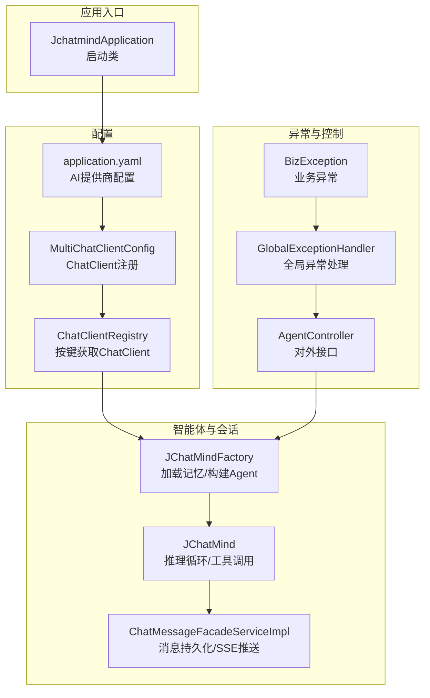
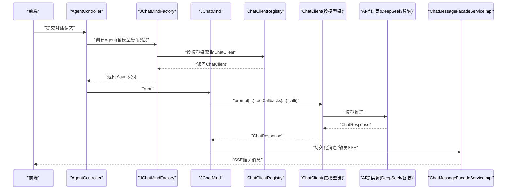
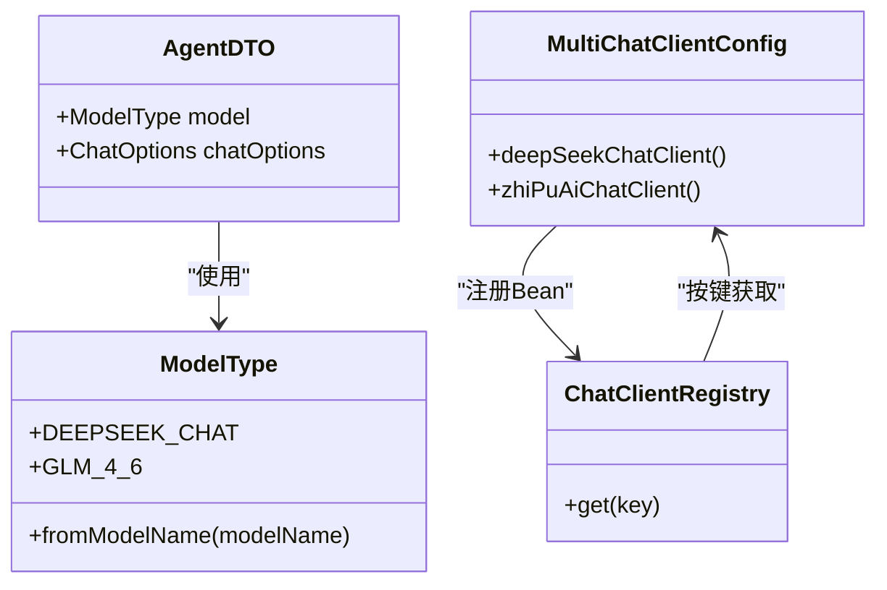
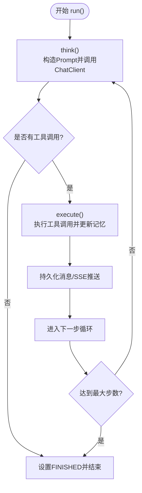
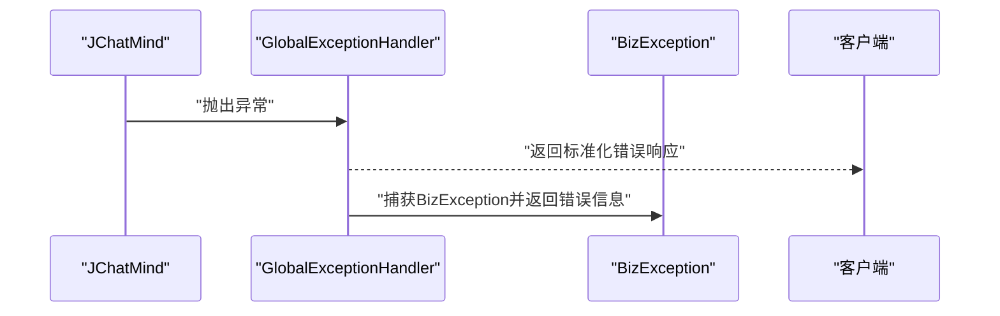
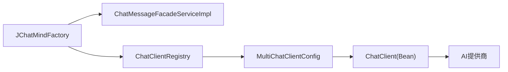

# AI模型问题

<cite>
**本文引用的文件**
- [JchatmindApplication.java](file://jchatmind/src/main/java/com/kama/jchatmind/JchatmindApplication.java)
- [application.yaml](file://jchatmind/src/main/resources/application.yaml)
- [MultiChatClientConfig.java](file://jchatmind/src/main/java/com/kama/jchatmind/config/MultiChatClientConfig.java)
- [ChatClientRegistry.java](file://jchatmind/src/main/java/com/kama/jchatmind/config/ChatClientRegistry.java)
- [AgentDTO.java](file://jchatmind/src/main/java/com/kama/jchatmind/model/dto/AgentDTO.java)
- [JChatMind.java](file://jchatmind/src/main/java/com/kama/jchatmind/agent/JChatMind.java)
- [JChatMindFactory.java](file://jchatmind/src/main/java/com/kama/jchatmind/agent/JChatMindFactory.java)
- [ChatMessageFacadeServiceImpl.java](file://jchatmind/src/main/java/com/kama/jchatmind/service/impl/ChatMessageFacadeServiceImpl.java)
- [GlobalExceptionHandler.java](file://jchatmind/src/main/java/com/kama/jchatmind/exception/GlobalExceptionHandler.java)
- [BizException.java](file://jchatmind/src/main/java/com/kama/jchatmind/exception/BizException.java)
- [AgentController.java](file://jchatmind/src/main/java/com/kama/jchatmind/controller/AgentController.java)
- [JChatMindTest.java](file://jchatmind/src/test/java/com/kama/jchatmind/agent/JChatMindTest.java)
- [AgentEvaluationTest.java](file://jchatmind/src/test/java/com/kama/jchatmind/evaluation/AgentEvaluationTest.java)
- [example1.html](file://examples/example1.html)
- [example2.html](file://examples/example2.html)
- [example3.html](file://examples/example3.html)
- [JChatMind_API.postman_collection.json](file://jchatmind/postman/JChatMind_API.postman_collection.json)
</cite>

## 目录
1. [简介](#简介)
2. [项目结构](#项目结构)
3. [核心组件](#核心组件)
4. [架构总览](#架构总览)
5. [详细组件分析](#详细组件分析)
6. [依赖分析](#依赖分析)
7. [性能考虑](#性能考虑)
8. [故障排除指南](#故障排除指南)
9. [结论](#结论)
10. [附录](#附录)

## 简介
本指南聚焦于JChatMind中AI模型相关的问题排查与优化，覆盖API密钥配置错误、网络连接超时、模型响应格式异常、限流与重试、模型切换策略、版本兼容性与性能优化等主题。文档结合实际代码与配置文件，提供可操作的诊断路径与修复建议。

## 项目结构
JChatMind采用Spring Boot工程，AI模型能力通过Spring AI集成，支持多模型客户端注册与按模型键选择调用。配置位于YAML文件中，包含DeepSeek与智谱AI的API密钥、基础URL与模型选项。Agent运行时通过ChatClient与工具链协作完成多轮对话与工具调用。

图表来源
- [JchatmindApplication.java:1-14](file://jchatmind/src/main/java/com/kama/jchatmind/JchatmindApplication.java#L1-L14)
- [application.yaml:22-34](file://jchatmind/src/main/resources/application.yaml#L22-L34)
- [MultiChatClientConfig.java:10-22](file://jchatmind/src/main/java/com/kama/jchatmind/config/MultiChatClientConfig.java#L10-L22)
- [ChatClientRegistry.java:8-20](file://jchatmind/src/main/java/com/kama/jchatmind/config/ChatClientRegistry.java#L8-L20)
- [JChatMindFactory.java:76-116](file://jchatmind/src/main/java/com/kama/jchatmind/agent/JChatMindFactory.java#L76-L116)
- [JChatMind.java:316-337](file://jchatmind/src/main/java/com/kama/jchatmind/agent/JChatMind.java#L316-L337)
- [ChatMessageFacadeServiceImpl.java:66-97](file://jchatmind/src/main/java/com/kama/jchatmind/service/impl/ChatMessageFacadeServiceImpl.java#L66-L97)
- [GlobalExceptionHandler.java:10-37](file://jchatmind/src/main/java/com/kama/jchatmind/exception/GlobalExceptionHandler.java#L10-L37)
- [BizException.java:1-15](file://jchatmind/src/main/java/com/kama/jchatmind/exception/BizException.java#L1-L15)
- [AgentController.java:12-45](file://jchatmind/src/main/java/com/kama/jchatmind/controller/AgentController.java#L12-L45)

章节来源
- [JchatmindApplication.java:1-14](file://jchatmind/src/main/java/com/kama/jchatmind/JchatmindApplication.java#L1-L14)
- [application.yaml:1-43](file://jchatmind/src/main/resources/application.yaml#L1-L43)
- [MultiChatClientConfig.java:1-23](file://jchatmind/src/main/java/com/kama/jchatmind/config/MultiChatClientConfig.java#L1-L23)
- [ChatClientRegistry.java:1-20](file://jchatmind/src/main/java/com/kama/jchatmind/config/ChatClientRegistry.java#L1-L20)
- [AgentDTO.java:1-74](file://jchatmind/src/main/java/com/kama/jchatmind/model/dto/AgentDTO.java#L1-L74)
- [JChatMind.java:1-348](file://jchatmind/src/main/java/com/kama/jchatmind/agent/JChatMind.java#L1-L348)
- [JChatMindFactory.java:76-116](file://jchatmind/src/main/java/com/kama/jchatmind/agent/JChatMindFactory.java#L76-L116)
- [ChatMessageFacadeServiceImpl.java:1-212](file://jchatmind/src/main/java/com/kama/jchatmind/service/impl/ChatMessageFacadeServiceImpl.java#L1-L212)
- [GlobalExceptionHandler.java:1-37](file://jchatmind/src/main/java/com/kama/jchatmind/exception/GlobalExceptionHandler.java#L1-L37)
- [BizException.java:1-15](file://jchatmind/src/main/java/com/kama/jchatmind/exception/BizException.java#L1-L15)
- [AgentController.java:1-45](file://jchatmind/src/main/java/com/kama/jchatmind/controller/AgentController.java#L1-L45)

## 核心组件
- AI提供商配置与模型选择
  - application.yaml中定义了DeepSeek与智谱AI的API密钥、基础URL与模型选项，用于初始化对应ChatModel与ChatClient。
  - MultiChatClientConfig通过@Bean按模型键注册ChatClient，键名与AgentDTO中的ModelType一致。
  - ChatClientRegistry提供按键获取ChatClient的能力，便于运行时动态选择模型。
- Agent推理与工具调用
  - JChatMind负责单步think/execute循环，将模型输出与工具调用结果写入内存并持久化消息，通过SSE推送至前端。
  - JChatMindFactory从最近会话消息加载记忆，构建Message窗口，受AgentDTO.ChatOptions.messageLength控制。
- 异常与控制
  - GlobalExceptionHandler统一捕获异常并返回标准响应；BizException用于业务错误。
  - AgentController提供对外接口，Agent运行过程中的异常会被上抛并由全局异常处理器处理。

章节来源
- [application.yaml:22-34](file://jchatmind/src/main/resources/application.yaml#L22-L34)
- [MultiChatClientConfig.java:10-22](file://jchatmind/src/main/java/com/kama/jchatmind/config/MultiChatClientConfig.java#L10-L22)
- [ChatClientRegistry.java:8-20](file://jchatmind/src/main/java/com/kama/jchatmind/config/ChatClientRegistry.java#L8-L20)
- [AgentDTO.java:37-52](file://jchatmind/src/main/java/com/kama/jchatmind/model/dto/AgentDTO.java#L37-L52)
- [JChatMind.java:220-304](file://jchatmind/src/main/java/com/kama/jchatmind/agent/JChatMind.java#L220-L304)
- [JChatMindFactory.java:76-116](file://jchatmind/src/main/java/com/kama/jchatmind/agent/JChatMindFactory.java#L76-L116)
- [GlobalExceptionHandler.java:10-37](file://jchatmind/src/main/java/com/kama/jchatmind/exception/GlobalExceptionHandler.java#L10-L37)
- [BizException.java:1-15](file://jchatmind/src/main/java/com/kama/jchatmind/exception/BizException.java#L1-L15)
- [AgentController.java:12-45](file://jchatmind/src/main/java/com/kama/jchatmind/controller/AgentController.java#L12-L45)

## 架构总览
下图展示AI模型调用在JChatMind中的端到端流程：前端发起请求，后端通过AgentController进入Agent运行逻辑，按模型键选择ChatClient，调用模型并执行工具链，最终通过SSE推送消息。

图表来源
- [AgentController.java:12-45](file://jchatmind/src/main/java/com/kama/jchatmind/controller/AgentController.java#L12-L45)
- [JChatMindFactory.java:76-116](file://jchatmind/src/main/java/com/kama/jchatmind/agent/JChatMindFactory.java#L76-L116)
- [ChatClientRegistry.java:8-20](file://jchatmind/src/main/java/com/kama/jchatmind/config/ChatClientRegistry.java#L8-L20)
- [JChatMind.java:220-304](file://jchatmind/src/main/java/com/kama/jchatmind/agent/JChatMind.java#L220-L304)
- [ChatMessageFacadeServiceImpl.java:66-97](file://jchatmind/src/main/java/com/kama/jchatmind/service/impl/ChatMessageFacadeServiceImpl.java#L66-L97)

## 详细组件分析

### 组件A：AI模型配置与注册
- 配置差异
  - DeepSeek：键名如“deepseek-chat”，基础URL与模型名在YAML中定义。
  - 智谱AI：键名如“glm-4.6”，基础URL与模型名在YAML中定义。
- 注册机制
  - MultiChatClientConfig为每个模型键创建ChatClient Bean，键名需与AgentDTO.ModelType一致，否则运行时无法解析模型键。
- 常见错误
  - 模型键不匹配：AgentDTO.ModelType与ChatClient Bean键不一致会导致运行时找不到对应ChatClient。
  - API密钥或基础URL错误：将导致模型调用直接失败。
  - 模型选项不兼容：例如temperature/topP不在目标模型支持范围内。

图表来源
- [AgentDTO.java:23-52](file://jchatmind/src/main/java/com/kama/jchatmind/model/dto/AgentDTO.java#L23-L52)
- [MultiChatClientConfig.java:10-22](file://jchatmind/src/main/java/com/kama/jchatmind/config/MultiChatClientConfig.java#L10-L22)
- [ChatClientRegistry.java:8-20](file://jchatmind/src/main/java/com/kama/jchatmind/config/ChatClientRegistry.java#L8-L20)

章节来源
- [application.yaml:22-34](file://jchatmind/src/main/resources/application.yaml#L22-L34)
- [MultiChatClientConfig.java:10-22](file://jchatmind/src/main/java/com/kama/jchatmind/config/MultiChatClientConfig.java#L10-L22)
- [AgentDTO.java:37-52](file://jchatmind/src/main/java/com/kama/jchatmind/model/dto/AgentDTO.java#L37-L52)
- [ChatClientRegistry.java:8-20](file://jchatmind/src/main/java/com/kama/jchatmind/config/ChatClientRegistry.java#L8-L20)

### 组件B：Agent推理与工具调用
- 推理循环
  - think阶段：构造Prompt并调用ChatClient，得到包含工具调用的AssistantMessage。
  - execute阶段：使用ToolCallingManager执行工具调用，更新内存并持久化消息。
- 记忆窗口
  - 通过JChatMindFactory从最近消息加载记忆，窗口大小由AgentDTO.ChatOptions.messageLength控制。
- 常见问题
  - 工具调用失败：工具执行异常将导致Agent状态变为ERROR。
  - 模型调用异常：如限流或网络错误，异常会被捕获并上抛。

图表来源
- [JChatMind.java:220-304](file://jchatmind/src/main/java/com/kama/jchatmind/agent/JChatMind.java#L220-L304)
- [JChatMindFactory.java:76-116](file://jchatmind/src/main/java/com/kama/jchatmind/agent/JChatMindFactory.java#L76-L116)

章节来源
- [JChatMind.java:220-304](file://jchatmind/src/main/java/com/kama/jchatmind/agent/JChatMind.java#L220-L304)
- [JChatMindFactory.java:76-116](file://jchatmind/src/main/java/com/kama/jchatmind/agent/JChatMindFactory.java#L76-L116)

### 组件C：异常处理与日志
- 全局异常
  - GlobalExceptionHandler统一捕获BizException与未知异常，返回标准化响应。
- 业务异常
  - BizException用于业务错误（如消息创建失败），便于前端友好提示。
- 日志
  - Agent运行过程中的异常会记录错误日志，便于定位模型调用失败原因。

图表来源
- [GlobalExceptionHandler.java:10-37](file://jchatmind/src/main/java/com/kama/jchatmind/exception/GlobalExceptionHandler.java#L10-L37)
- [BizException.java:1-15](file://jchatmind/src/main/java/com/kama/jchatmind/exception/BizException.java#L1-L15)
- [JChatMind.java:332-337](file://jchatmind/src/main/java/com/kama/jchatmind/agent/JChatMind.java#L332-L337)

章节来源
- [GlobalExceptionHandler.java:10-37](file://jchatmind/src/main/java/com/kama/jchatmind/exception/GlobalExceptionHandler.java#L10-L37)
- [BizException.java:1-15](file://jchatmind/src/main/java/com/kama/jchatmind/exception/BizException.java#L1-L15)
- [JChatMind.java:332-337](file://jchatmind/src/main/java/com/kama/jchatmind/agent/JChatMind.java#L332-L337)

## 依赖分析
- 组件耦合
  - JChatMindFactory依赖ChatMessageFacadeService加载记忆，依赖ChatClientRegistry按模型键获取ChatClient。
  - MultiChatClientConfig与ChatClientRegistry共同构成模型选择基础设施。
- 外部依赖
  - Spring AI ChatClient与具体AI提供商SDK对接，异常与响应格式由提供商决定。
- 潜在风险
  - 模型键不一致将导致运行时找不到ChatClient。
  - 工具链异常或模型调用异常未被上抛，可能掩盖真实问题。

图表来源
- [JChatMindFactory.java:76-116](file://jchatmind/src/main/java/com/kama/jchatmind/agent/JChatMindFactory.java#L76-L116)
- [ChatClientRegistry.java:8-20](file://jchatmind/src/main/java/com/kama/jchatmind/config/ChatClientRegistry.java#L8-L20)
- [MultiChatClientConfig.java:10-22](file://jchatmind/src/main/java/com/kama/jchatmind/config/MultiChatClientConfig.java#L10-L22)

章节来源
- [JChatMindFactory.java:76-116](file://jchatmind/src/main/java/com/kama/jchatmind/agent/JChatMindFactory.java#L76-L116)
- [ChatClientRegistry.java:8-20](file://jchatmind/src/main/java/com/kama/jchatmind/config/ChatClientRegistry.java#L8-L20)
- [MultiChatClientConfig.java:10-22](file://jchatmind/src/main/java/com/kama/jchatmind/config/MultiChatClientConfig.java#L10-L22)

## 性能考虑
- 记忆窗口控制
  - 通过AgentDTO.ChatOptions.messageLength限制消息窗口长度，减少上下文长度带来的延迟与成本。
- 工具调用批处理
  - 合理组织工具调用顺序，避免不必要的多次往返。
- SSE推送
  - 持续消息推送可能带来带宽压力，建议前端按需订阅并节流。

章节来源
- [AgentDTO.java:57-72](file://jchatmind/src/main/java/com/kama/jchatmind/model/dto/AgentDTO.java#L57-L72)
- [JChatMind.java:220-304](file://jchatmind/src/main/java/com/kama/jchatmind/agent/JChatMind.java#L220-L304)

## 故障排除指南

### 一、API密钥配置错误
- 症状
  - 模型调用立即失败，返回鉴权相关错误。
- 诊断
  - 检查application.yaml中对应提供商的api-key是否正确。
  - 确认模型键与ChatClient Bean键一致（如“deepseek-chat”、“glm-4.6”）。
- 解决
  - 更新application.yaml中的api-key与base-url。
  - 如更换模型键，同步修改AgentDTO.ModelType与ChatClient Bean键。

章节来源
- [application.yaml:22-34](file://jchatmind/src/main/resources/application.yaml#L22-L34)
- [AgentDTO.java:37-52](file://jchatmind/src/main/java/com/kama/jchatmind/model/dto/AgentDTO.java#L37-L52)
- [MultiChatClientConfig.java:10-22](file://jchatmind/src/main/java/com/kama/jchatmind/config/MultiChatClientConfig.java#L10-L22)

### 二、网络连接超时
- 症状
  - 模型调用长时间无响应或抛出超时异常。
- 诊断
  - 查看Agent运行日志，确认异常类型是否为超时。
  - 使用Postman集合中的SSE网络恢复场景验证连接稳定性。
- 解决
  - 前端重连SSE并补偿断线期间的消息。
  - 后端增加超时与重试策略（见“请求重试机制配置”）。

章节来源
- [JChatMindTest.java:475-490](file://jchatmind/src/test/java/com/kama/jchatmind/agent/JChatMindTest.java#L475-L490)
- [JChatMind_API.postman_collection.json:794-824](file://jchatmind/postman/JChatMind_API.postman_collection.json#L794-L824)

### 三、模型响应格式异常
- 症状
  - 模型返回无choices或缺少必要字段，导致解析失败。
- 诊断
  - 检查模型返回结构是否符合预期（如存在choices与message字段）。
  - 前端示例脚本对响应进行校验，可参考其错误处理逻辑。
- 解决
  - 在调用层增加健壮的响应校验与降级策略。
  - 若响应格式异常，优先切换到备用模型或提供默认回复。

章节来源
- [example3.html:508-536](file://examples/example3.html#L508-L536)
- [AgentEvaluationTest.java:137-149](file://jchatmind/src/test/java/com/kama/jchatmind/evaluation/AgentEvaluationTest.java#L137-L149)

### 四、请求重试机制配置
- 建议
  - 在ChatClient层或外部HTTP客户端配置指数退避重试，针对429/5xx与超时进行重试。
  - 为SSE连接配置自动重连与断线补偿（参考Postman集合中的网络恢复场景）。
- 验证
  - 使用Postman集合中的网络中断/恢复场景验证重试与恢复效果。

章节来源
- [JChatMind_API.postman_collection.json:794-824](file://jchatmind/postman/JChatMind_API.postman_collection.json#L794-L824)

### 五、模型切换策略
- 策略
  - 当前模型失败时，按优先级切换到备用模型（如从DeepSeek切换到智谱AI）。
  - 切换后保持相同的模型键命名约定，确保ChatClientRegistry可正常解析。
- 验证
  - 通过AgentController创建Agent时传入不同模型键，验证切换生效。

章节来源
- [AgentController.java:26-43](file://jchatmind/src/main/java/com/kama/jchatmind/controller/AgentController.java#L26-L43)
- [AgentDTO.java:37-52](file://jchatmind/src/main/java/com/kama/jchatmind/model/dto/AgentDTO.java#L37-L52)

### 六、API限流处理
- 症状
  - 抛出“rate limit exceeded”等限流错误。
- 处理
  - 在调用层捕获限流异常，等待冷却期后重试。
  - 记录限流事件并调整并发策略。

章节来源
- [JChatMindTest.java:649-666](file://jchatmind/src/test/java/com/kama/jchatmind/agent/JChatMindTest.java#L649-L666)

### 七、模型版本兼容性问题
- 症状
  - 某些参数在新版本模型中不再支持，导致调用失败。
- 处理
  - 降低参数复杂度（如禁用不支持的temperature/topP组合）。
  - 为不同模型维护独立的ChatOptions配置。

章节来源
- [AgentDTO.java:57-72](file://jchatmind/src/main/java/com/kama/jchatmind/model/dto/AgentDTO.java#L57-L72)

### 八、日志分析与定位
- 关键点
  - 关注Agent运行过程中的异常日志，定位模型调用失败的具体环节。
  - 使用全局异常处理器返回的错误信息辅助前端提示。

章节来源
- [JChatMind.java:332-337](file://jchatmind/src/main/java/com/kama/jchatmind/agent/JChatMind.java#L332-L337)
- [GlobalExceptionHandler.java:10-37](file://jchatmind/src/main/java/com/kama/jchatmind/exception/GlobalExceptionHandler.java#L10-L37)

## 结论
JChatMind通过Spring AI实现了多模型接入与统一调度。针对AI模型问题，建议从配置一致性、响应健壮性、限流与重试、模型切换与版本兼容等方面入手，结合日志与测试用例快速定位并解决问题。同时，合理控制记忆窗口与SSE推送频率，有助于提升整体性能与用户体验。

## 附录
- 快速检查清单
  - 配置：api-key/base-url/model键是否正确。
  - 注册：ChatClient Bean键与AgentDTO.ModelType一致。
  - 调用：响应结构校验与异常捕获。
  - 限流：指数退避重试与冷却策略。
  - 切换：备用模型可用性与配置差异。
  - 性能：消息窗口长度与SSE推送频率。