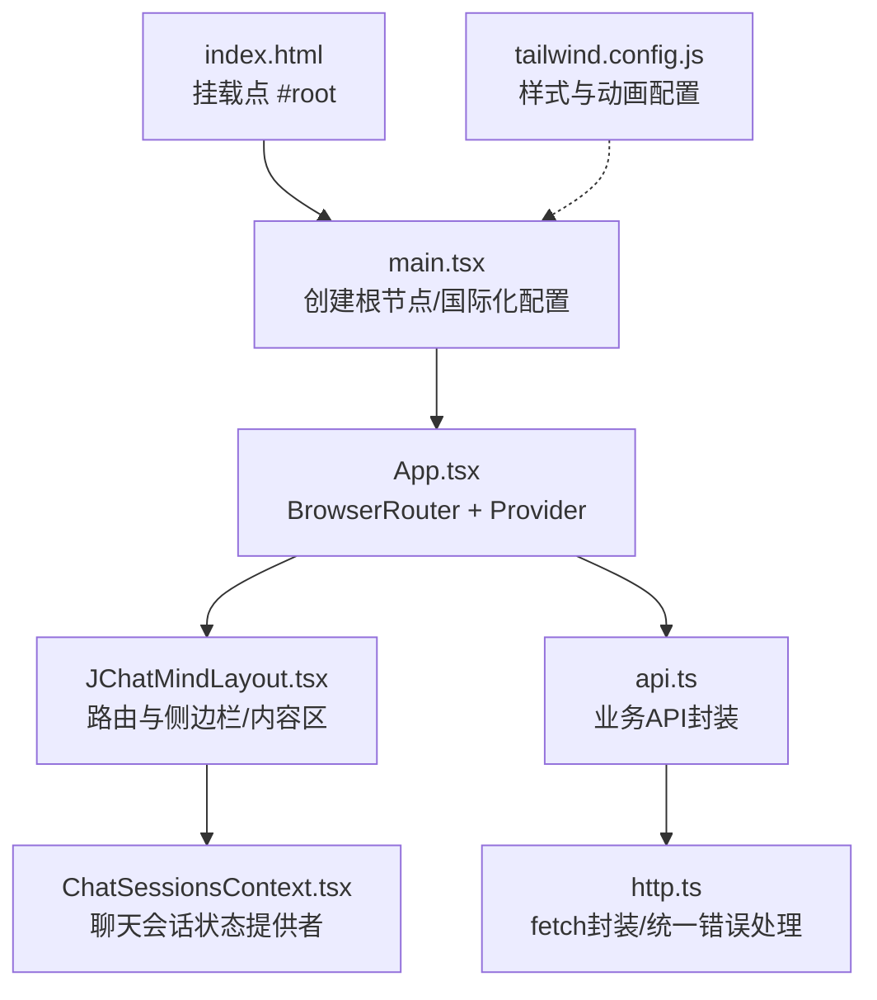
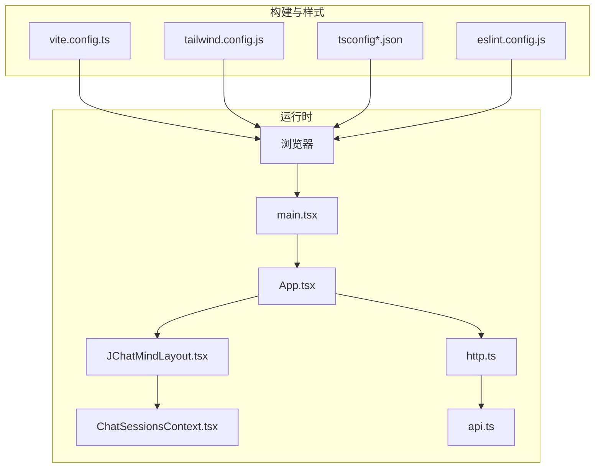
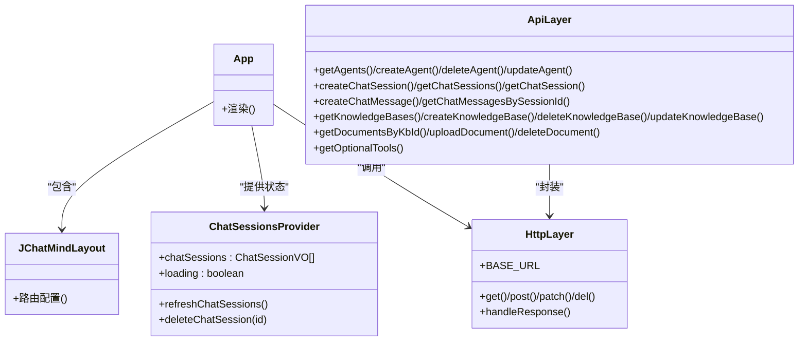
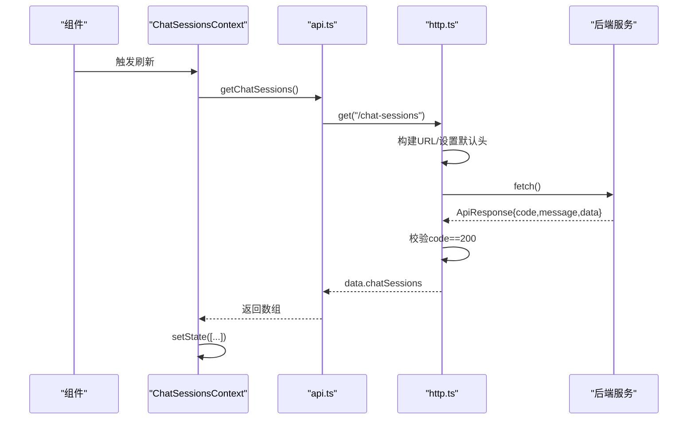
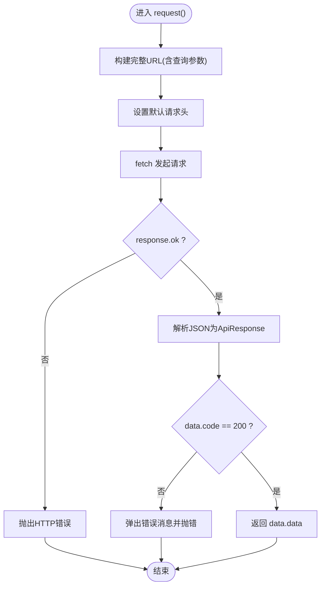
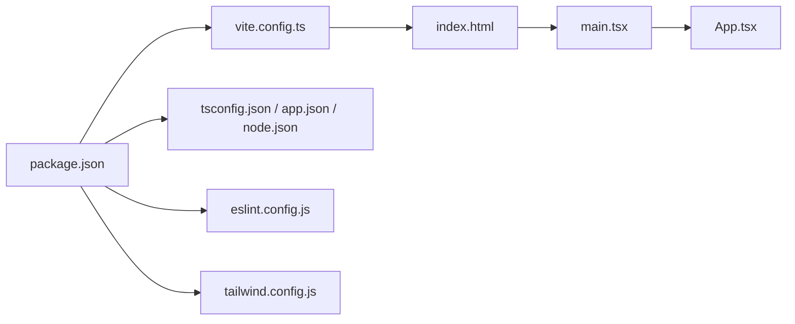

# 前端问题

<cite>
**本文引用的文件**
- [vite.config.ts](file://ui/vite.config.ts)
- [package.json](file://ui/package.json)
- [tsconfig.json](file://ui/tsconfig.json)
- [tsconfig.app.json](file://ui/tsconfig.app.json)
- [eslint.config.js](file://ui/eslint.config.js)
- [tailwind.config.js](file://ui/tailwind.config.js)
- [index.html](file://ui/index.html)
- [main.tsx](file://ui/src/main.tsx)
- [App.tsx](file://ui/src/App.tsx)
- [JChatMindLayout.tsx](file://ui/src/components/JChatMindLayout.tsx)
- [ChatSessionsContext.tsx](file://ui/src/contexts/ChatSessionsContext.tsx)
- [useChatSessions.ts](file://ui/src/hooks/useChatSessions.ts)
- [http.ts](file://ui/src/api/http.ts)
- [api.ts](file://ui/src/api/api.ts)
- [index.ts](file://ui/src/types/index.ts)
</cite>

## 目录
1. [简介](#简介)
2. [项目结构](#项目结构)
3. [核心组件](#核心组件)
4. [架构总览](#架构总览)
5. [详细组件分析](#详细组件分析)
6. [依赖关系分析](#依赖关系分析)
7. [性能考虑](#性能考虑)
8. [故障排除指南](#故障排除指南)
9. [结论](#结论)
10. [附录](#附录)

## 简介
本指南面向JChatMind前端团队与运维人员，聚焦于React/Vite/TypeScript前端在开发与生产中的常见问题：应用启动失败、API请求错误、资源加载失败、构建编译问题、CORS跨域、状态管理异常、浏览器调试与性能优化等。文档基于实际代码仓库进行分析，并提供可操作的排查步骤与可视化图示。

## 项目结构
前端位于 ui 目录，采用Vite + React + TypeScript + TailwindCSS组合。核心入口为 index.html 引入 /src/main.tsx，应用根组件在 App.tsx 中装配路由与全局状态提供者，页面布局由 JChatMindLayout.tsx 定义，数据访问通过 api.ts 与 http.ts 封装的HTTP层完成，状态管理通过 ChatSessionsContext.tsx 提供。

**图表来源**
- [index.html:1-13](file://ui/index.html#L1-L13)
- [main.tsx:1-11](file://ui/src/main.tsx#L1-L11)
- [App.tsx:1-16](file://ui/src/App.tsx#L1-L16)
- [JChatMindLayout.tsx:1-31](file://ui/src/components/JChatMindLayout.tsx#L1-L31)
- [ChatSessionsContext.tsx:1-66](file://ui/src/contexts/ChatSessionsContext.tsx#L1-L66)
- [api.ts:1-378](file://ui/src/api/api.ts#L1-L378)
- [http.ts:1-177](file://ui/src/api/http.ts#L1-L177)
- [tailwind.config.js:1-59](file://ui/tailwind.config.js#L1-L59)

**章节来源**
- [index.html:1-13](file://ui/index.html#L1-L13)
- [main.tsx:1-11](file://ui/src/main.tsx#L1-L11)
- [App.tsx:1-16](file://ui/src/App.tsx#L1-L16)
- [JChatMindLayout.tsx:1-31](file://ui/src/components/JChatMindLayout.tsx#L1-L31)
- [ChatSessionsContext.tsx:1-66](file://ui/src/contexts/ChatSessionsContext.tsx#L1-L66)
- [api.ts:1-378](file://ui/src/api/api.ts#L1-L378)
- [http.ts:1-177](file://ui/src/api/http.ts#L1-L177)
- [tailwind.config.js:1-59](file://ui/tailwind.config.js#L1-L59)

## 核心组件
- 应用入口与国际化：main.tsx 创建根节点并注入 antd 的 ConfigProvider 以启用中文本地化。
- 应用根组件：App.tsx 使用 BrowserRouter 包裹，注入 ChatSessionsProvider 作为全局状态容器。
- 路由与布局：JChatMindLayout.tsx 定义多路由视图，覆盖代理聊天与知识库视图。
- 状态管理：ChatSessionsContext.tsx 提供聊天会话列表、加载状态与刷新/删除能力。
- API封装：http.ts 封装 fetch，统一处理URL拼接、请求头、响应校验与错误提示；api.ts 对具体业务接口进行分组与类型化封装。
- 类型系统：types/index.ts 定义消息、SSE消息、工具调用等核心类型。

**章节来源**
- [main.tsx:1-11](file://ui/src/main.tsx#L1-L11)
- [App.tsx:1-16](file://ui/src/App.tsx#L1-L16)
- [JChatMindLayout.tsx:1-31](file://ui/src/components/JChatMindLayout.tsx#L1-L31)
- [ChatSessionsContext.tsx:1-66](file://ui/src/contexts/ChatSessionsContext.tsx#L1-L66)
- [http.ts:1-177](file://ui/src/api/http.ts#L1-L177)
- [api.ts:1-378](file://ui/src/api/api.ts#L1-L378)
- [index.ts:1-57](file://ui/src/types/index.ts#L1-L57)

## 架构总览
前端采用“入口脚本 -> 根组件 -> 路由布局 -> 全局状态 -> API层”的分层架构。TailwindCSS负责样式与动画扩展，Vite提供开发服务器与打包能力。

**图表来源**
- [main.tsx:1-11](file://ui/src/main.tsx#L1-L11)
- [App.tsx:1-16](file://ui/src/App.tsx#L1-L16)
- [JChatMindLayout.tsx:1-31](file://ui/src/components/JChatMindLayout.tsx#L1-L31)
- [ChatSessionsContext.tsx:1-66](file://ui/src/contexts/ChatSessionsContext.tsx#L1-L66)
- [http.ts:1-177](file://ui/src/api/http.ts#L1-L177)
- [api.ts:1-378](file://ui/src/api/api.ts#L1-L378)
- [vite.config.ts:1-9](file://ui/vite.config.ts#L1-L9)
- [tailwind.config.js:1-59](file://ui/tailwind.config.js#L1-L59)
- [tsconfig.app.json:1-29](file://ui/tsconfig.app.json#L1-L29)
- [eslint.config.js:1-24](file://ui/eslint.config.js#L1-L24)

## 详细组件分析

### 组件类图（状态与API）

**图表来源**
- [App.tsx:1-16](file://ui/src/App.tsx#L1-L16)
- [JChatMindLayout.tsx:1-31](file://ui/src/components/JChatMindLayout.tsx#L1-L31)
- [ChatSessionsContext.tsx:1-66](file://ui/src/contexts/ChatSessionsContext.tsx#L1-L66)
- [http.ts:1-177](file://ui/src/api/http.ts#L1-L177)
- [api.ts:1-378](file://ui/src/api/api.ts#L1-L378)

**章节来源**
- [App.tsx:1-16](file://ui/src/App.tsx#L1-L16)
- [JChatMindLayout.tsx:1-31](file://ui/src/components/JChatMindLayout.tsx#L1-L31)
- [ChatSessionsContext.tsx:1-66](file://ui/src/contexts/ChatSessionsContext.tsx#L1-L66)
- [http.ts:1-177](file://ui/src/api/http.ts#L1-L177)
- [api.ts:1-378](file://ui/src/api/api.ts#L1-L378)

### API请求序列图（获取聊天会话）

**图表来源**
- [ChatSessionsContext.tsx:23-31](file://ui/src/contexts/ChatSessionsContext.tsx#L23-L31)
- [api.ts:129-131](file://ui/src/api/api.ts#L129-L131)
- [http.ts:62-92](file://ui/src/api/http.ts#L62-L92)

**章节来源**
- [ChatSessionsContext.tsx:23-31](file://ui/src/contexts/ChatSessionsContext.tsx#L23-L31)
- [api.ts:129-131](file://ui/src/api/api.ts#L129-L131)
- [http.ts:62-92](file://ui/src/api/http.ts#L62-L92)

### 复杂逻辑流程图（HTTP响应处理）

**图表来源**
- [http.ts:21-37](file://ui/src/api/http.ts#L21-L37)
- [http.ts:77-92](file://ui/src/api/http.ts#L77-L92)

**章节来源**
- [http.ts:21-37](file://ui/src/api/http.ts#L21-L37)
- [http.ts:77-92](file://ui/src/api/http.ts#L77-L92)

## 依赖关系分析
- 构建与运行：Vite插件链包含 @vitejs/plugin-react 与 @tailwindcss/vite；包管理器脚本 dev/build/preview/lint 控制开发、构建与预览。
- 类型系统：tsconfig.json 通过 references 引入 tsconfig.app.json 与 tsconfig.node.json，app配置启用严格模式与bundler解析。
- 代码质量：eslint.config.js 集成typescript-eslint、react-hooks、react-refresh等规则集。
- 样式系统：tailwind.config.js 扩展动画与关键帧，content范围覆盖 index.html 与 src 下TS/JS文件。

**图表来源**
- [package.json:1-44](file://ui/package.json#L1-L44)
- [vite.config.ts:1-9](file://ui/vite.config.ts#L1-L9)
- [tsconfig.json:1-8](file://ui/tsconfig.json#L1-L8)
- [tsconfig.app.json:1-29](file://ui/tsconfig.app.json#L1-L29)
- [eslint.config.js:1-24](file://ui/eslint.config.js#L1-L24)
- [tailwind.config.js:1-59](file://ui/tailwind.config.js#L1-L59)
- [index.html:1-13](file://ui/index.html#L1-L13)
- [main.tsx:1-11](file://ui/src/main.tsx#L1-L11)
- [App.tsx:1-16](file://ui/src/App.tsx#L1-L16)

**章节来源**
- [package.json:1-44](file://ui/package.json#L1-L44)
- [vite.config.ts:1-9](file://ui/vite.config.ts#L1-L9)
- [tsconfig.json:1-8](file://ui/tsconfig.json#L1-L8)
- [tsconfig.app.json:1-29](file://ui/tsconfig.app.json#L1-L29)
- [eslint.config.js:1-24](file://ui/eslint.config.js#L1-L24)
- [tailwind.config.js:1-59](file://ui/tailwind.config.js#L1-L59)
- [index.html:1-13](file://ui/index.html#L1-L13)
- [main.tsx:1-11](file://ui/src/main.tsx#L1-L11)
- [App.tsx:1-16](file://ui/src/App.tsx#L1-L16)

## 性能考虑
- 构建与打包：Vite默认按需编译与热更新，建议在生产构建中开启压缩与Tree-shaking（由Vite默认策略保障）。
- 代码分割：保持组件按功能拆分，避免一次性引入大模块；路由级组件可利用React.lazy与Suspense实现懒加载。
- 网络请求：合并小请求、缓存必要数据、对长列表使用虚拟滚动；在http.ts中统一拦截与去重。
- 样式体积：TailwindCSS按需扫描 content 范围，确保仅生成使用到的样式；避免在组件内动态拼接大量类名。
- 图标与媒体：优先使用矢量图标与WebP格式图片；对大文件采用CDN或分片上传策略。
- 开发体验：启用严格的TypeScript检查与ESLint规则，减少运行期错误与内存泄漏风险。

## 故障排除指南

### 一、应用启动失败（开发服务器/预览）
- 症状
  - 启动命令执行后无页面或白屏
  - 控制台报模块解析错误或找不到入口
- 排查步骤
  1) 确认开发脚本可用且端口未被占用
     - 参考：[package.json:6-11](file://ui/package.json#L6-L11)
  2) 检查入口HTML是否正确挂载根节点
     - 参考：[index.html:8-10](file://ui/index.html#L8-L10)
  3) 确认main.tsx已正确创建根节点并注入ConfigProvider
     - 参考：[main.tsx:7-11](file://ui/src/main.tsx#L7-L11)
  4) 检查Vite配置插件是否安装
     - 参考：[vite.config.ts:6-8](file://ui/vite.config.ts#L6-L8)
  5) 清理缓存并重新安装依赖
     - 参考：[package.json:12-39](file://ui/package.json#L12-L39)
- 常见原因
  - 缺少 @vitejs/plugin-react 或 @tailwindcss/vite
  - index.html 中 script 路径不正确
  - main.tsx 渲染目标元素不存在

**章节来源**
- [package.json:6-11](file://ui/package.json#L6-L11)
- [index.html:8-10](file://ui/index.html#L8-L10)
- [main.tsx:7-11](file://ui/src/main.tsx#L7-L11)
- [vite.config.ts:6-8](file://ui/vite.config.ts#L6-L8)

### 二、API请求错误（HTTP/业务码）
- 症状
  - 控制台出现HTTP错误或业务错误提示
  - 页面无数据或显示错误消息
- 排查步骤
  1) 检查BASE_URL是否指向正确的后端地址
     - 参考：[http.ts:16](file://ui/src/api/http.ts#L16)
  2) 在Network面板确认请求URL、方法、头信息与响应体
     - 参考：[http.ts:77-92](file://ui/src/api/http.ts#L77-L92)
  3) 核对后端返回的ApiResponse结构（code/message/data）
     - 参考：[http.ts:4-8](file://ui/src/api/http.ts#L4-L8)
  4) 若为404/405，请核对api.ts中的路由路径
     - 参考：[api.ts:57-58](file://ui/src/api/api.ts#L57-L58)
- 常见原因
  - 域名或端口错误
  - CORS未配置或凭证传递问题
  - 后端未返回标准ApiResponse或code非200

**章节来源**
- [http.ts:16](file://ui/src/api/http.ts#L16)
- [http.ts:4-8](file://ui/src/api/http.ts#L4-L8)
- [http.ts:77-92](file://ui/src/api/http.ts#L77-L92)
- [api.ts:57-58](file://ui/src/api/api.ts#L57-L58)

### 三、资源加载失败（静态资源/CSS/字体）
- 症状
  - 页面样式缺失、图标不显示、字体加载失败
- 排查步骤
  1) 检查TailwindCSS是否正确集成
     - 参考：[vite.config.ts:3](file://ui/vite.config.ts#L3)
  2) 确认tailwind.config.js的content扫描范围覆盖到组件
     - 参考：[tailwind.config.js:3](file://ui/tailwind.config.js#L3)
  3) 查看Network面板是否存在404或CSP阻断
  4) 清理浏览器缓存与Vite缓存后重试
- 常见原因
  - content路径遗漏导致未生成所需样式
  - CDN或本地路径错误

**章节来源**
- [vite.config.ts:3](file://ui/vite.config.ts#L3)
- [tailwind.config.js:3](file://ui/tailwind.config.js#L3)

### 四、构建/编译问题（TypeScript/Vite）
- 症状
  - tsc编译报错、Vite构建中断、类型检查失败
- 排查步骤
  1) 运行类型检查与修复
     - 参考：[tsconfig.app.json:20-25](file://ui/tsconfig.app.json#L20-L25)
  2) 检查bundler解析与模块语法
     - 参考：[tsconfig.app.json:12-16](file://ui/tsconfig.app.json#L12-L16)
  3) 确认Vite版本与插件兼容性
     - 参考：[package.json:38-42](file://ui/package.json#L38-L42)
  4) 清理tsbuildinfo与node_modules后重装
- 常见原因
  - 严格模式下未满足noUnused/erasable等规则
  - bundler解析与模块检测冲突

**章节来源**
- [tsconfig.app.json:12-16](file://ui/tsconfig.app.json#L12-L16)
- [tsconfig.app.json:20-25](file://ui/tsconfig.app.json#L20-L25)
- [package.json:38-42](file://ui/package.json#L38-L42)

### 五、CORS跨域问题
- 症状
  - 浏览器控制台出现CORS错误，请求被阻止
- 排查步骤
  1) 确认后端已配置允许前端Origin与方法
  2) 若使用代理，检查Vite代理配置（如需要）
  3) 确保携带Cookie或凭证时后端正确设置凭据策略
- 建议
  - 在开发阶段统一使用同源或明确代理规则，避免跨域干扰
  - 生产环境通过网关或反向代理统一处理CORS

[本节为通用指导，无需特定文件引用]

### 六、状态管理异常（聊天会话列表为空/不刷新）
- 症状
  - 列表初始为空、新增/删除后未刷新
- 排查步骤
  1) 确认ChatSessionsProvider包裹范围包含使用方
     - 参考：[App.tsx:8](file://ui/src/App.tsx#L8)
  2) 检查useChatSessions是否在Provider内部使用
     - 参考：[useChatSessions.ts:1-6](file://ui/src/hooks/useChatSessions.ts#L1-L6)
  3) 核对刷新逻辑是否在依赖数组中触发
     - 参考：[ChatSessionsContext.tsx:33-35](file://ui/src/contexts/ChatSessionsContext.tsx#L33-L35)
  4) 确认删除后再次拉取最新列表
     - 参考：[ChatSessionsContext.tsx:37-40](file://ui/src/contexts/ChatSessionsContext.tsx#L37-L40)
- 常见原因
  - Provider未包裹或Hook误用
  - 依赖数组未包含回调导致未重新拉取

**章节来源**
- [App.tsx:8](file://ui/src/App.tsx#L8)
- [useChatSessions.ts:1-6](file://ui/src/hooks/useChatSessions.ts#L1-L6)
- [ChatSessionsContext.tsx:33-35](file://ui/src/contexts/ChatSessionsContext.tsx#L33-L35)
- [ChatSessionsContext.tsx:37-40](file://ui/src/contexts/ChatSessionsContext.tsx#L37-L40)

### 七、浏览器开发者工具使用技巧
- Network
  - 观察请求URL、方法、状态码、响应头与响应体
  - 关注CORS、缓存策略与重定向
- Sources
  - 断点调试、查看调用栈、定位异常抛出处
- Elements
  - 检查Tailwind类是否生效、关键帧动画是否加载
- Performance/Profiler
  - 分析渲染耗时、重绘与垃圾回收
- Console
  - 关注业务错误提示（http.ts中message.error）

[本节为通用指导，无需特定文件引用]

### 八、前端性能优化建议
- 代码层面
  - 合理拆分组件，避免不必要的重渲染
  - 使用useCallback/useMemo稳定回调与计算结果
- 网络层面
  - 合并请求、缓存响应、延迟加载非关键资源
- 样式层面
  - 仅使用实际使用的Tailwind类，避免过度样式
- 构建层面
  - 使用Vite默认优化策略，按需引入第三方库

[本节为通用指导，无需特定文件引用]

## 结论
本指南从架构与代码层面梳理了JChatMind前端常见问题的定位与解决路径，结合Vite、TypeScript、TailwindCSS与React生态的最佳实践，提供了可落地的排障步骤与可视化图示。建议在日常开发中持续完善ESLint与TypeScript配置，强化单元测试与端到端测试，以降低线上故障率。

## 附录
- 快速检查清单
  - 开发服务器：端口占用、入口HTML、main.tsx根节点
  - API：BASE_URL、CORS、响应结构一致性
  - 构建：TypeScript严格模式、bundler解析、Vite版本
  - 样式：Tailwind content范围、动画类使用
  - 状态：Provider包裹范围、Hook使用位置、依赖数组

[本节为通用指导，无需特定文件引用]