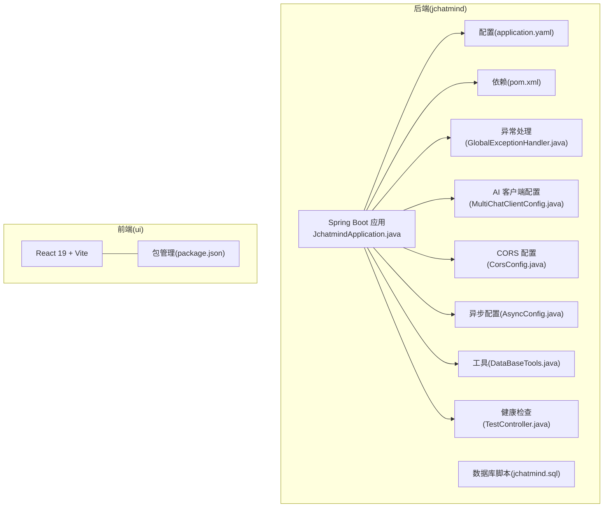
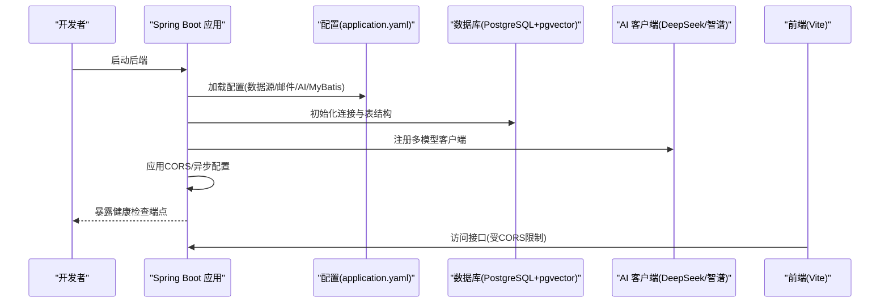
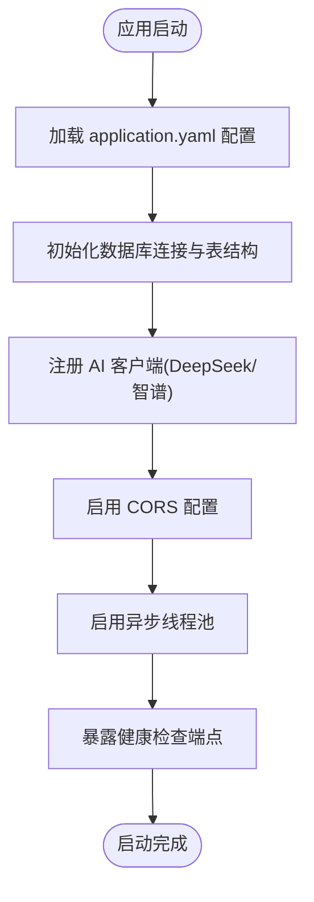
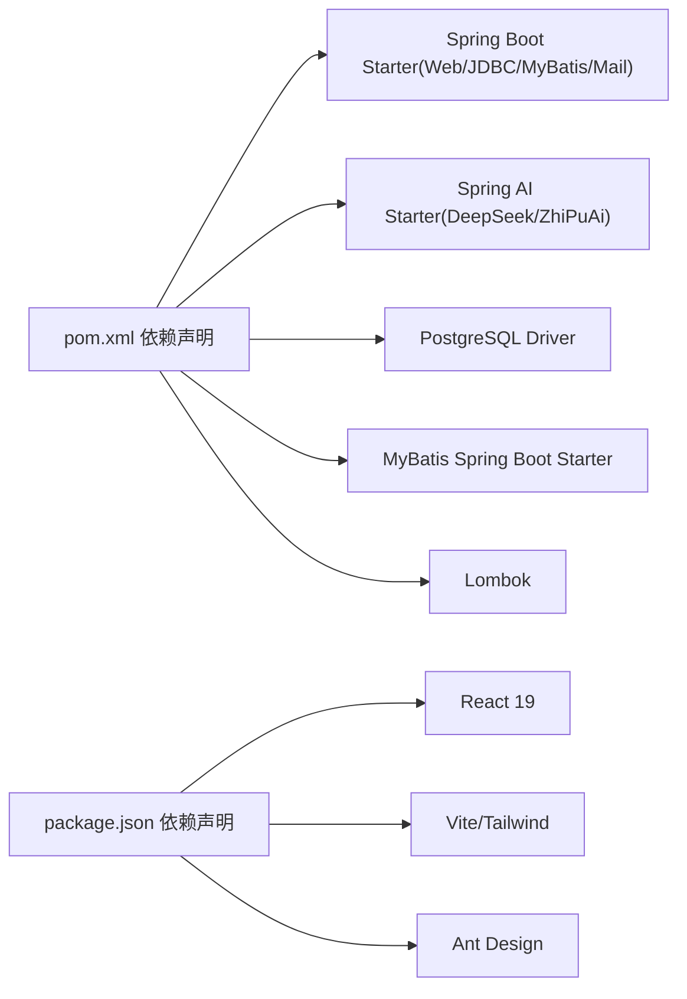

# 启动问题

<cite>
**本文引用的文件**
- [application.yaml](file://jchatmind/src/main/resources/application.yaml)
- [pom.xml](file://jchatmind/pom.xml)
- [JchatmindApplication.java](file://jchatmind/src/main/java/com/kama/jchatmind/JchatmindApplication.java)
- [README.md](file://README.md)
- [GlobalExceptionHandler.java](file://jchatmind/src/main/java/com/kama/jchatmind/exception/GlobalExceptionHandler.java)
- [BizException.java](file://jchatmind/src/main/java/com/kama/jchatmind/exception/BizException.java)
- [jchatmind.sql](file://sql/jchatmind.sql)
- [AsyncConfig.java](file://jchatmind/src/main/java/com/kama/jchatmind/config/AsyncConfig.java)
- [CorsConfig.java](file://jchatmind/src/main/java/com/kama/jchatmind/config/CorsConfig.java)
- [MultiChatClientConfig.java](file://jchatmind/src/main/java/com/kama/jchatmind/config/MultiChatClientConfig.java)
- [DataBaseTools.java](file://jchatmind/src/main/java/com/kama/jchatmind/agent/tools/DataBaseTools.java)
- [TestController.java](file://jchatmind/src/main/java/com/kama/jchatmind/controller/TestController.java)
- [package.json](file://ui/package.json)
- [mvnw.cmd](file://jchatmind/mvnw.cmd)
</cite>

## 目录
1. [简介](#简介)
2. [项目结构](#项目结构)
3. [核心组件](#核心组件)
4. [架构总览](#架构总览)
5. [详细组件分析](#详细组件分析)
6. [依赖分析](#依赖分析)
7. [性能考虑](#性能考虑)
8. [故障排除指南](#故障排除指南)
9. [结论](#结论)
10. [附录](#附录)

## 简介
本指南聚焦于 JChatMind 的启动问题排查与解决，覆盖应用启动失败、端口冲突、依赖缺失、配置错误、数据库初始化失败、AI 模型配置错误等常见场景。文档提供启动前准备清单（application.yaml 检查、Maven 依赖安装、Node.js 环境准备）、启动日志分析方法、常见启动错误码与解决方案，以及针对数据库连接与 AI 模型配置的具体排查步骤。

## 项目结构
JChatMind 采用前后端分离架构：后端基于 Spring Boot 3.x + Spring AI，前端基于 React 19 + Vite。后端负责 AI 模型接入、RAG 向量检索、数据库访问与 SSE 推送；前端提供交互界面与实时消息展示。

图表来源
- [JchatmindApplication.java:1-14](file://jchatmind/src/main/java/com/kama/jchatmind/JchatmindApplication.java#L1-L14)
- [application.yaml:1-43](file://jchatmind/src/main/resources/application.yaml#L1-L43)
- [pom.xml:1-132](file://jchatmind/pom.xml#L1-L132)
- [GlobalExceptionHandler.java:1-38](file://jchatmind/src/main/java/com/kama/jchatmind/exception/GlobalExceptionHandler.java#L1-L38)
- [jchatmind.sql:1-88](file://sql/jchatmind.sql#L1-L88)
- [MultiChatClientConfig.java:1-23](file://jchatmind/src/main/java/com/kama/jchatmind/config/MultiChatClientConfig.java#L1-L23)
- [CorsConfig.java:1-61](file://jchatmind/src/main/java/com/kama/jchatmind/config/CorsConfig.java#L1-L61)
- [AsyncConfig.java:1-25](file://jchatmind/src/main/java/com/kama/jchatmind/config/AsyncConfig.java#L1-L25)
- [DataBaseTools.java:1-62](file://jchatmind/src/main/java/com/kama/jchatmind/agent/tools/DataBaseTools.java#L1-L62)
- [TestController.java:1-25](file://jchatmind/src/main/java/com/kama/jchatmind/controller/TestController.java#L1-L25)
- [package.json:1-44](file://ui/package.json#L1-L44)

章节来源
- [README.md:46-66](file://README.md#L46-L66)
- [JchatmindApplication.java:1-14](file://jchatmind/src/main/java/com/kama/jchatmind/JchatmindApplication.java#L1-L14)
- [application.yaml:1-43](file://jchatmind/src/main/resources/application.yaml#L1-L43)
- [pom.xml:1-132](file://jchatmind/pom.xml#L1-L132)
- [package.json:1-44](file://ui/package.json#L1-L44)

## 核心组件
- 应用入口与启动：Spring Boot 应用入口类负责加载配置与启动容器。
- 配置中心：application.yaml 提供数据库、邮件、AI 模型、MyBatis、文档存储等关键配置。
- 依赖管理：pom.xml 管理 Spring Boot、Spring AI、MyBatis、PostgreSQL 驱动、邮件等依赖。
- 异常处理：全局异常处理器统一捕获业务异常与未处理异常，保障对外输出一致。
- 数据库与向量：PostgreSQL + pgvector，提供向量索引与 RAG 能力。
- AI 客户端：多模型客户端注册，支持 DeepSeek 与智谱 AI。
- 前后端联调：CORS 配置与健康检查接口便于联调与监控。

章节来源
- [JchatmindApplication.java:1-14](file://jchatmind/src/main/java/com/kama/jchatmind/JchatmindApplication.java#L1-L14)
- [application.yaml:1-43](file://jchatmind/src/main/resources/application.yaml#L1-L43)
- [pom.xml:46-122](file://jchatmind/pom.xml#L46-L122)
- [GlobalExceptionHandler.java:1-38](file://jchatmind/src/main/java/com/kama/jchatmind/exception/GlobalExceptionHandler.java#L1-L38)
- [jchatmind.sql:1-88](file://sql/jchatmind.sql#L1-L88)
- [MultiChatClientConfig.java:1-23](file://jchatmind/src/main/java/com/kama/jchatmind/config/MultiChatClientConfig.java#L1-L23)
- [CorsConfig.java:1-61](file://jchatmind/src/main/java/com/kama/jchatmind/config/CorsConfig.java#L1-L61)
- [AsyncConfig.java:1-25](file://jchatmind/src/main/java/com/kama/jchatmind/config/AsyncConfig.java#L1-L25)
- [TestController.java:1-25](file://jchatmind/src/main/java/com/kama/jchatmind/controller/TestController.java#L1-L25)

## 架构总览
下图展示启动阶段的关键交互：应用启动、配置加载、数据库初始化、AI 客户端装配、CORS/异步配置生效，以及健康检查端点可用性。

图表来源
- [application.yaml:1-43](file://jchatmind/src/main/resources/application.yaml#L1-L43)
- [jchatmind.sql:1-88](file://sql/jchatmind.sql#L1-L88)
- [MultiChatClientConfig.java:1-23](file://jchatmind/src/main/java/com/kama/jchatmind/config/MultiChatClientConfig.java#L1-L23)
- [CorsConfig.java:1-61](file://jchatmind/src/main/java/com/kama/jchatmind/config/CorsConfig.java#L1-L61)
- [TestController.java:1-25](file://jchatmind/src/main/java/com/kama/jchatmind/controller/TestController.java#L1-L25)

## 详细组件分析

### 启动流程与控制流
应用启动从入口类触发，随后加载 application.yaml 中的配置，初始化数据库连接与表结构，装配 AI 客户端 Bean，启用 CORS 与异步线程池，最终暴露健康检查端点。

图表来源
- [JchatmindApplication.java:1-14](file://jchatmind/src/main/java/com/kama/jchatmind/JchatmindApplication.java#L1-L14)
- [application.yaml:1-43](file://jchatmind/src/main/resources/application.yaml#L1-L43)
- [jchatmind.sql:1-88](file://sql/jchatmind.sql#L1-L88)
- [MultiChatClientConfig.java:1-23](file://jchatmind/src/main/java/com/kama/jchatmind/config/MultiChatClientConfig.java#L1-L23)
- [CorsConfig.java:1-61](file://jchatmind/src/main/java/com/kama/jchatmind/config/CorsConfig.java#L1-L61)
- [AsyncConfig.java:1-25](file://jchatmind/src/main/java/com/kama/jchatmind/config/AsyncConfig.java#L1-L25)
- [TestController.java:1-25](file://jchatmind/src/main/java/com/kama/jchatmind/controller/TestController.java#L1-L25)

章节来源
- [JchatmindApplication.java:1-14](file://jchatmind/src/main/java/com/kama/jchatmind/JchatmindApplication.java#L1-L14)
- [application.yaml:1-43](file://jchatmind/src/main/resources/application.yaml#L1-L43)
- [TestController.java:1-25](file://jchatmind/src/main/java/com/kama/jchatmind/controller/TestController.java#L1-L25)

### 配置检查要点（application.yaml）
- 数据库连接：确认 JDBC URL、用户名、密码与驱动类名正确，数据库已创建且可访问。
- 邮件配置：SMTP 主机、端口、用户名、授权码与 TLS 设置需匹配邮箱服务商要求。
- AI 模型：DeepSeek 与智谱 AI 的 API Key、基础地址与模型名称需有效。
- MyBatis：别名包、Mapper XML 路径与类型处理器包需指向正确位置。
- 文档存储：本地存储基路径存在且具备读写权限。

章节来源
- [application.yaml:1-43](file://jchatmind/src/main/resources/application.yaml#L1-L43)

### 依赖与运行环境准备
- Java 与 Maven：确保 JDK 17+ 与 Maven Wrapper 正常工作。
- PostgreSQL：安装 14+ 并启用 pgvector 扩展，执行数据库初始化脚本。
- Node.js：前端开发需 Node.js 18+，安装依赖后启动 Vite。
- Spring AI 依赖：pom.xml 中声明了 DeepSeek 与智谱 AI 的 Starter 依赖，确保网络可达。

章节来源
- [README.md:48-51](file://README.md#L48-L51)
- [pom.xml:33-44](file://jchatmind/pom.xml#L33-L44)
- [pom.xml:107-116](file://jchatmind/pom.xml#L107-L116)
- [mvnw.cmd:91-189](file://jchatmind/mvnw.cmd#L91-L189)
- [package.json:1-44](file://ui/package.json#L1-L44)

### 异常处理与错误码
- 全局异常：对未处理异常统一记录日志并返回通用错误响应。
- 业务异常：BizException 用于封装业务错误，对外返回标准化错误信息。
- 404 处理：NoResourceFoundException 统一返回 404。

章节来源
- [GlobalExceptionHandler.java:1-38](file://jchatmind/src/main/java/com/kama/jchatmind/exception/GlobalExceptionHandler.java#L1-L38)
- [BizException.java:1-15](file://jchatmind/src/main/java/com/kama/jchatmind/exception/BizException.java#L1-L15)

### 数据库初始化与向量索引
- 扩展与表：确保启用 vector 扩展，创建 agent、chat_session、chat_message、knowledge_base、document、chunk_bge_m3 表。
- 索引：为向量字段建立 IVFFLAT 索引以提升检索性能。
- 连接：application.yaml 中的数据库连接信息需与实际环境一致。

章节来源
- [jchatmind.sql:1-88](file://sql/jchatmind.sql#L1-L88)
- [application.yaml:4-8](file://jchatmind/src/main/resources/application.yaml#L4-L8)

### AI 模型配置与客户端装配
- 多模型客户端：通过 @Configuration 注册 DeepSeek 与智谱 AI 的 ChatClient Bean。
- 模型选项：application.yaml 中定义模型名称与基础地址，需与实际 API 一致。
- 工具集成：数据库工具使用 JdbcTemplate 访问 PostgreSQL，确保数据库连通。

章节来源
- [MultiChatClientConfig.java:1-23](file://jchatmind/src/main/java/com/kama/jchatmind/config/MultiChatClientConfig.java#L1-L23)
- [application.yaml:22-34](file://jchatmind/src/main/resources/application.yaml#L22-L34)
- [DataBaseTools.java:1-62](file://jchatmind/src/main/java/com/kama/jchatmind/agent/tools/DataBaseTools.java#L1-L62)

## 依赖分析
后端依赖围绕 Spring Boot、Spring AI、MyBatis、PostgreSQL 与邮件展开，前端依赖 React 生态与 Vite。

图表来源
- [pom.xml:46-122](file://jchatmind/pom.xml#L46-L122)
- [package.json:12-38](file://ui/package.json#L12-L38)

章节来源
- [pom.xml:46-122](file://jchatmind/pom.xml#L46-L122)
- [package.json:12-38](file://ui/package.json#L12-L38)

## 性能考虑
- 异步线程池：默认核心池大小、最大线程数与队列容量可根据并发需求调整。
- CORS 预检缓存：合理设置 maxAge，减少重复预检请求。
- 向量索引：IVFFLAT 参数与 lists 数量影响检索性能与内存占用。

章节来源
- [AsyncConfig.java:1-25](file://jchatmind/src/main/java/com/kama/jchatmind/config/AsyncConfig.java#L1-L25)
- [CorsConfig.java:1-61](file://jchatmind/src/main/java/com/kama/jchatmind/config/CorsConfig.java#L1-L61)
- [jchatmind.sql:83-87](file://sql/jchatmind.sql#L83-L87)

## 故障排除指南

### 一、启动前准备清单
- Java 与 Maven
  - 确认 JDK 17+ 已安装，PATH 正确。
  - 使用 Maven Wrapper 启动后端，避免本地 Maven 版本差异导致的问题。
  - 参考路径：[mvnw.cmd:91-189](file://jchatmind/mvnw.cmd#L91-L189)
- PostgreSQL
  - 安装 14+ 并启用 pgvector 扩展。
  - 执行数据库初始化脚本，确保表与索引创建成功。
  - 参考路径：[jchatmind.sql:1-88](file://sql/jchatmind.sql#L1-L88)
- Node.js 与前端
  - 安装 Node.js 18+，执行 npm install，启动 Vite 开发服务器。
  - 参考路径：[package.json:1-44](file://ui/package.json#L1-L44)
- 环境变量
  - 如需代理或私有仓库，请在启动前配置网络环境。

章节来源
- [README.md:48-51](file://README.md#L48-L51)
- [mvnw.cmd:91-189](file://jchatmind/mvnw.cmd#L91-L189)
- [jchatmind.sql:1-88](file://sql/jchatmind.sql#L1-L88)
- [package.json:1-44](file://ui/package.json#L1-L44)

### 二、启动失败排查步骤
- 端口占用
  - Spring Boot 默认端口为 8080，若被占用需修改端口或释放端口。
  - 建议在 application.yaml 中显式配置 server.port。
  - 参考路径：[application.yaml:1-43](file://jchatmind/src/main/resources/application.yaml#L1-L43)
- 依赖缺失
  - 确认 pom.xml 中依赖完整，尤其是 Spring AI、MyBatis、PostgreSQL 驱动与邮件相关依赖。
  - 参考路径：[pom.xml:46-122](file://jchatmind/pom.xml#L46-L122)
- 配置错误
  - application.yaml 中数据库、邮件、AI 模型配置必须与实际环境一致。
  - 参考路径：[application.yaml:1-43](file://jchatmind/src/main/resources/application.yaml#L1-L43)
- 数据库连接初始化失败
  - 检查 JDBC URL、用户名、密码与驱动类名。
  - 确认数据库已创建、pgvector 扩展已启用、表与索引已初始化。
  - 参考路径：[application.yaml:4-8](file://jchatmind/src/main/resources/application.yaml#L4-L8)，[jchatmind.sql:1-88](file://sql/jchatmind.sql#L1-L88)
- AI 模型配置错误
  - 检查 API Key、基础地址与模型名称是否正确。
  - 确保网络可访问对应 AI 服务。
  - 参考路径：[application.yaml:22-34](file://jchatmind/src/main/resources/application.yaml#L22-L34)，[MultiChatClientConfig.java:1-23](file://jchatmind/src/main/java/com/kama/jchatmind/config/MultiChatClientConfig.java#L1-L23)
- 健康检查不可用
  - 访问 /health 端点验证后端是否正常启动。
  - 参考路径：[TestController.java:15-18](file://jchatmind/src/main/java/com/kama/jchatmind/controller/TestController.java#L15-L18)

章节来源
- [application.yaml:1-43](file://jchatmind/src/main/resources/application.yaml#L1-L43)
- [pom.xml:46-122](file://jchatmind/pom.xml#L46-L122)
- [jchatmind.sql:1-88](file://sql/jchatmind.sql#L1-L88)
- [MultiChatClientConfig.java:1-23](file://jchatmind/src/main/java/com/kama/jchatmind/config/MultiChatClientConfig.java#L1-L23)
- [TestController.java:15-18](file://jchatmind/src/main/java/com/kama/jchatmind/controller/TestController.java#L15-L18)

### 三、启动日志分析方法
- 关键日志定位
  - 数据库连接：查找与 JDBC URL、驱动类名、连接超时相关的日志条目。
  - AI 客户端：查找 ChatClient Bean 创建与模型初始化的日志。
  - CORS/异步：查找相关配置生效的日志。
- 常见错误模式
  - NoResourceFoundException：资源未找到，检查路由与静态资源映射。
  - 业务异常：BizException 触发，关注业务参数与外部依赖状态。
- 日志输出
  - 全局异常处理器会记录服务器内部错误，便于定位未捕获异常。

章节来源
- [GlobalExceptionHandler.java:1-38](file://jchatmind/src/main/java/com/kama/jchatmind/exception/GlobalExceptionHandler.java#L1-L38)
- [BizException.java:1-15](file://jchatmind/src/main/java/com/kama/jchatmind/exception/BizException.java#L1-L15)

### 四、常见启动错误码与解决方案
- 404（未找到）
  - 现象：访问接口返回 404。
  - 排查：确认路由是否存在、CORS 是否正确配置、静态资源是否映射。
  - 参考路径：[GlobalExceptionHandler.java:24-27](file://jchatmind/src/main/java/com/kama/jchatmind/exception/GlobalExceptionHandler.java#L24-L27)，[CorsConfig.java:1-61](file://jchatmind/src/main/java/com/kama/jchatmind/config/CorsConfig.java#L1-L61)
- 服务器内部错误
  - 现象：未处理异常导致统一返回服务器内部错误。
  - 排查：查看日志中的异常堆栈，定位具体异常来源。
  - 参考路径：[GlobalExceptionHandler.java:32-36](file://jchatmind/src/main/java/com/kama/jchatmind/exception/GlobalExceptionHandler.java#L32-L36)
- 数据库连接失败
  - 现象：启动时报数据库连接异常。
  - 排查：核对 JDBC URL、用户名、密码、驱动类名；确认数据库服务运行与网络可达。
  - 参考路径：[application.yaml:4-8](file://jchatmind/src/main/resources/application.yaml#L4-L8)，[jchatmind.sql:1-88](file://sql/jchatmind.sql#L1-L88)
- AI 模型初始化失败
  - 现象：AI 客户端无法创建或调用报错。
  - 排查：核对 API Key、基础地址与模型名称；检查网络连通性与服务可用性。
  - 参考路径：[application.yaml:22-34](file://jchatmind/src/main/resources/application.yaml#L22-L34)，[MultiChatClientConfig.java:1-23](file://jchatmind/src/main/java/com/kama/jchatmind/config/MultiChatClientConfig.java#L1-L23)

章节来源
- [GlobalExceptionHandler.java:1-38](file://jchatmind/src/main/java/com/kama/jchatmind/exception/GlobalExceptionHandler.java#L1-L38)
- [application.yaml:4-8](file://jchatmind/src/main/resources/application.yaml#L4-L8)
- [application.yaml:22-34](file://jchatmind/src/main/resources/application.yaml#L22-L34)
- [jchatmind.sql:1-88](file://sql/jchatmind.sql#L1-L88)
- [MultiChatClientConfig.java:1-23](file://jchatmind/src/main/java/com/kama/jchatmind/config/MultiChatClientConfig.java#L1-L23)

### 五、特定启动问题排查
- 数据库连接初始化失败
  - 步骤
    1) 检查 application.yaml 中数据库连接参数。
    2) 确认 PostgreSQL 已安装并启用 pgvector。
    3) 执行 jchatmind.sql 初始化表与索引。
    4) 使用最小化测试连接验证。
  - 参考路径：[application.yaml:4-8](file://jchatmind/src/main/resources/application.yaml#L4-L8)，[jchatmind.sql:1-88](file://sql/jchatmind.sql#L1-L88)
- AI 模型配置错误
  - 步骤
    1) 在 application.yaml 中校验 API Key、基础地址与模型名称。
    2) 确认网络可访问对应 AI 服务。
    3) 查看 AI 客户端装配日志，确认 Bean 创建成功。
  - 参考路径：[application.yaml:22-34](file://jchatmind/src/main/resources/application.yaml#L22-L34)，[MultiChatClientConfig.java:1-23](file://jchatmind/src/main/java/com/kama/jchatmind/config/MultiChatClientConfig.java#L1-L23)
- 健康检查与联调
  - 步骤
    1) 访问 /health 确认后端启动。
    2) 配置 CORS，允许前端开发端口访问。
    3) 前端通过 Vite 启动，验证接口连通性。
  - 参考路径：[TestController.java:15-18](file://jchatmind/src/main/java/com/kama/jchatmind/controller/TestController.java#L15-L18)，[CorsConfig.java:1-61](file://jchatmind/src/main/java/com/kama/jchatmind/config/CorsConfig.java#L1-L61)，[package.json:1-44](file://ui/package.json#L1-L44)

章节来源
- [application.yaml:4-8](file://jchatmind/src/main/resources/application.yaml#L4-L8)
- [application.yaml:22-34](file://jchatmind/src/main/resources/application.yaml#L22-L34)
- [jchatmind.sql:1-88](file://sql/jchatmind.sql#L1-L88)
- [MultiChatClientConfig.java:1-23](file://jchatmind/src/main/java/com/kama/jchatmind/config/MultiChatClientConfig.java#L1-L23)
- [TestController.java:15-18](file://jchatmind/src/main/java/com/kama/jchatmind/controller/TestController.java#L15-L18)
- [CorsConfig.java:1-61](file://jchatmind/src/main/java/com/kama/jchatmind/config/CorsConfig.java#L1-L61)
- [package.json:1-44](file://ui/package.json#L1-L44)

## 结论
JChatMind 的启动问题多源于配置错误、依赖缺失与环境不满足。按照“启动前准备—配置检查—日志分析—逐项排查”的流程，可快速定位并解决问题。建议在生产部署前完成数据库初始化、AI 模型连通性测试与 CORS 联调，确保健康检查端点可用。

## 附录
- 快速启动命令参考
  - 后端：进入 jchatmind 目录，使用 Maven Wrapper 启动 Spring Boot 应用。
  - 前端：进入 ui 目录，安装依赖后启动 Vite 开发服务器。
- 参考路径
  - [README.md:53-66](file://README.md#L53-L66)

章节来源
- [README.md:53-66](file://README.md#L53-L66)