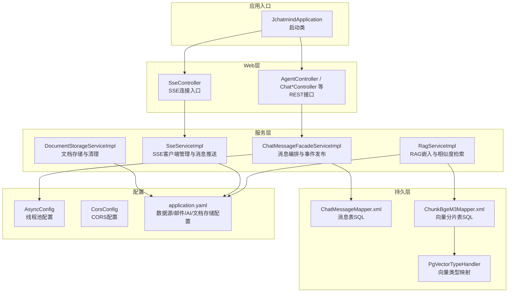
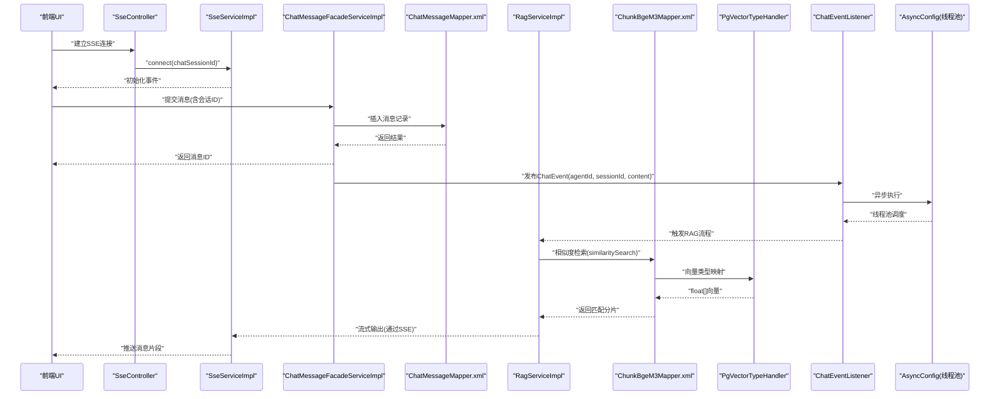
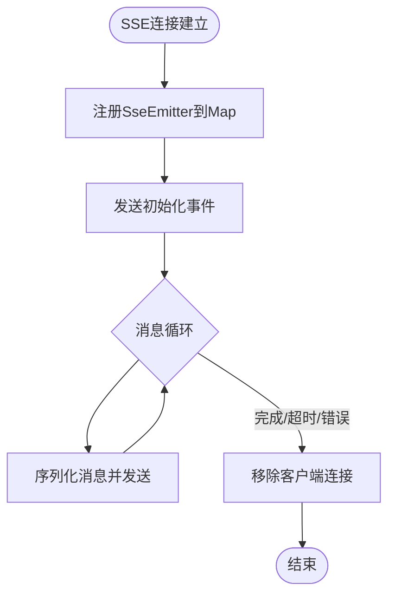
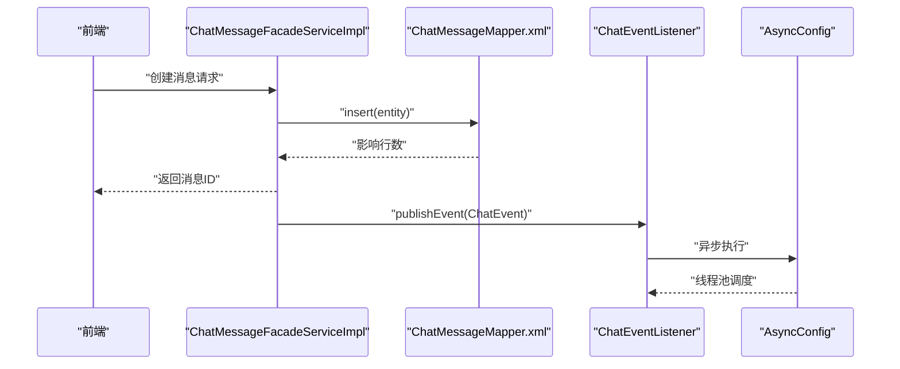
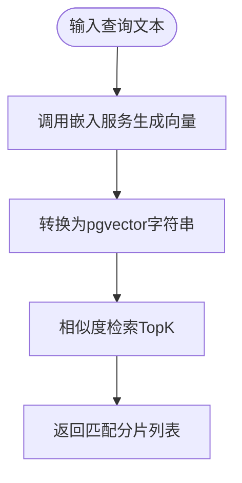
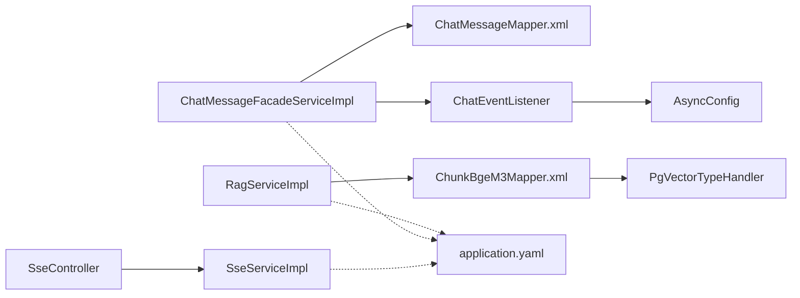

# 性能问题

<cite>
**本文引用的文件**
- [JchatmindApplication.java](file://jchatmind/src/main/java/com/kama/jchatmind/JchatmindApplication.java)
- [application.yaml](file://jchatmind/src/main/resources/application.yaml)
- [AsyncConfig.java](file://jchatmind/src/main/java/com/kama/jchatmind/config/AsyncConfig.java)
- [CorsConfig.java](file://jchatmind/src/main/java/com/kama/jchatmind/config/CorsConfig.java)
- [RagServiceImpl.java](file://jchatmind/src/main/java/com/kama/jchatmind/service/impl/RagServiceImpl.java)
- [SseServiceImpl.java](file://jchatmind/src/main/java/com/kama/jchatmind/service/impl/SseServiceImpl.java)
- [SseController.java](file://jchatmind/src/main/java/com/kama/jchatmind/controller/SseController.java)
- [ChatMessageFacadeServiceImpl.java](file://jchatmind/src/main/java/com/kama/jchatmind/service/impl/ChatMessageFacadeServiceImpl.java)
- [ChatMessageMapper.java](file://jchatmind/src/main/java/com/kama/jchatmind/mapper/ChatMessageMapper.java)
- [ChatMessageMapper.xml](file://jchatmind/src/main/resources/mapper/ChatMessageMapper.xml)
- [ChunkBgeM3Mapper.xml](file://jchatmind/src/main/resources/mapper/ChunkBgeM3Mapper.xml)
- [PgVectorTypeHandler.java](file://jchatmind/src/main/java/com/kama/jchatmind/typehandler/PgVectorTypeHandler.java)
- [ChatEventListener.java](file://jchatmind/src/main/java/com/kama/jchatmind/event/listener/ChatEventListener.java)
- [DocumentStorageServiceImpl.java](file://jchatmind/src/main/java/com/kama/jchatmind/service/impl/DocumentStorageServiceImpl.java)
</cite>

## 目录
1. [简介](#简介)
2. [项目结构](#项目结构)
3. [核心组件](#核心组件)
4. [架构总览](#架构总览)
5. [详细组件分析](#详细组件分析)
6. [依赖分析](#依赖分析)
7. [性能考量](#性能考量)
8. [故障排查指南](#故障排查指南)
9. [结论](#结论)
10. [附录](#附录)

## 简介
本指南聚焦于JChatMind在实际运行中可能出现的性能问题与优化路径，覆盖系统响应缓慢、内存占用过高、并发处理能力不足等典型瓶颈，并针对以下关键场景给出可落地的诊断与优化建议：
- RAG查询优化（向量检索与嵌入计算）
- SSE实时通信性能调优（连接管理、消息发送）
- 异步任务处理优化（事件驱动与线程池配置）
- 数据库查询优化（SQL执行计划、索引与类型映射）
- 缓存策略与I/O优化（文档存储与向量数据）
- 负载测试与容量规划建议

## 项目结构
JChatMind采用Spring Boot应用结构，后端以控制器-服务-持久层分层组织，结合MyBatis XML映射实现数据库访问；前端位于ui目录，通过HTTP与SSE与后端交互。

图表来源
- [JchatmindApplication.java:1-14](file://jchatmind/src/main/java/com/kama/jchatmind/JchatmindApplication.java#L1-L14)
- [SseController.java:1-24](file://jchatmind/src/main/java/com/kama/jchatmind/controller/SseController.java#L1-L24)
- [ChatMessageFacadeServiceImpl.java:1-212](file://jchatmind/src/main/java/com/kama/jchatmind/service/impl/ChatMessageFacadeServiceImpl.java#L1-L212)
- [RagServiceImpl.java:1-67](file://jchatmind/src/main/java/com/kama/jchatmind/service/impl/RagServiceImpl.java#L1-L67)
- [SseServiceImpl.java:1-64](file://jchatmind/src/main/java/com/kama/jchatmind/service/impl/SseServiceImpl.java#L1-L64)
- [DocumentStorageServiceImpl.java:1-90](file://jchatmind/src/main/java/com/kama/jchatmind/service/impl/DocumentStorageServiceImpl.java#L1-L90)
- [ChatMessageMapper.xml:1-110](file://jchatmind/src/main/resources/mapper/ChatMessageMapper.xml#L1-L110)
- [ChunkBgeM3Mapper.xml:1-102](file://jchatmind/src/main/resources/mapper/ChunkBgeM3Mapper.xml#L1-L102)
- [PgVectorTypeHandler.java:1-54](file://jchatmind/src/main/java/com/kama/jchatmind/typehandler/PgVectorTypeHandler.java#L1-L54)
- [AsyncConfig.java:1-25](file://jchatmind/src/main/java/com/kama/jchatmind/config/AsyncConfig.java#L1-L25)
- [CorsConfig.java:1-61](file://jchatmind/src/main/java/com/kama/jchatmind/config/CorsConfig.java#L1-L61)
- [application.yaml:1-43](file://jchatmind/src/main/resources/application.yaml#L1-L43)

章节来源
- [JchatmindApplication.java:1-14](file://jchatmind/src/main/java/com/kama/jchatmind/JchatmindApplication.java#L1-L14)
- [application.yaml:1-43](file://jchatmind/src/main/resources/application.yaml#L1-L43)

## 核心组件
- 应用启动与基础配置：应用入口负责Spring Boot启动；全局配置集中于application.yaml，包括数据源、邮件、AI服务、文档存储路径等。
- SSE实时通信：SseController提供SSE连接端点，SseServiceImpl维护客户端连接、消息序列化与推送。
- 消息编排与事件：ChatMessageFacadeServiceImpl负责消息的增删改查与事件发布；ChatEventListener监听事件并异步触发Agent处理。
- RAG检索：RagServiceImpl封装本地嵌入服务调用，将文本转为向量并在PostgreSQL+pgvector中进行相似度检索。
- 文档存储：DocumentStorageServiceImpl负责知识库文档的上传、存储与清理，避免磁盘碎片与空间浪费。
- 线程池与跨域：AsyncConfig提供异步线程池；CorsConfig提供跨域策略，保障前后端联调与生产部署的灵活性。

章节来源
- [SseController.java:1-24](file://jchatmind/src/main/java/com/kama/jchatmind/controller/SseController.java#L1-L24)
- [SseServiceImpl.java:1-64](file://jchatmind/src/main/java/com/kama/jchatmind/service/impl/SseServiceImpl.java#L1-L64)
- [ChatMessageFacadeServiceImpl.java:1-212](file://jchatmind/src/main/java/com/kama/jchatmind/service/impl/ChatMessageFacadeServiceImpl.java#L1-L212)
- [ChatEventListener.java:1-25](file://jchatmind/src/main/java/com/kama/jchatmind/event/listener/ChatEventListener.java#L1-L25)
- [RagServiceImpl.java:1-67](file://jchatmind/src/main/java/com/kama/jchatmind/service/impl/RagServiceImpl.java#L1-L67)
- [DocumentStorageServiceImpl.java:1-90](file://jchatmind/src/main/java/com/kama/jchatmind/service/impl/DocumentStorageServiceImpl.java#L1-L90)
- [AsyncConfig.java:1-25](file://jchatmind/src/main/java/com/kama/jchatmind/config/AsyncConfig.java#L1-L25)
- [CorsConfig.java:1-61](file://jchatmind/src/main/java/com/kama/jchatmind/config/CorsConfig.java#L1-L61)
- [application.yaml:1-43](file://jchatmind/src/main/resources/application.yaml#L1-L43)

## 架构总览
下图展示从客户端到后端服务、数据库与外部嵌入服务的整体交互路径，以及异步事件链路。

图表来源
- [SseController.java:1-24](file://jchatmind/src/main/java/com/kama/jchatmind/controller/SseController.java#L1-L24)
- [SseServiceImpl.java:1-64](file://jchatmind/src/main/java/com/kama/jchatmind/service/impl/SseServiceImpl.java#L1-L64)
- [ChatMessageFacadeServiceImpl.java:1-212](file://jchatmind/src/main/java/com/kama/jchatmind/service/impl/ChatMessageFacadeServiceImpl.java#L1-L212)
- [ChatMessageMapper.xml:1-110](file://jchatmind/src/main/resources/mapper/ChatMessageMapper.xml#L1-L110)
- [RagServiceImpl.java:1-67](file://jchatmind/src/main/java/com/kama/jchatmind/service/impl/RagServiceImpl.java#L1-L67)
- [ChunkBgeM3Mapper.xml:1-102](file://jchatmind/src/main/resources/mapper/ChunkBgeM3Mapper.xml#L1-L102)
- [PgVectorTypeHandler.java:1-54](file://jchatmind/src/main/java/com/kama/jchatmind/typehandler/PgVectorTypeHandler.java#L1-L54)
- [ChatEventListener.java:1-25](file://jchatmind/src/main/java/com/kama/jchatmind/event/listener/ChatEventListener.java#L1-L25)
- [AsyncConfig.java:1-25](file://jchatmind/src/main/java/com/kama/jchatmind/config/AsyncConfig.java#L1-L25)

## 详细组件分析

### 组件A：SSE实时通信性能
- 连接生命周期：SseServiceImpl维护ConcurrentHashMap存储SseEmitter实例，设置超时回调与完成回调，确保异常断开时及时清理。
- 消息序列化：使用Jackson将消息对象序列化为字符串再发送，避免直接写入复杂对象导致的阻塞或异常。
- 可扩展性：当前连接超时时间较长，适合长对话；若需支持高并发短连接，应考虑按会话粒度动态调整超时与并发上限。

图表来源
- [SseServiceImpl.java:1-64](file://jchatmind/src/main/java/com/kama/jchatmind/service/impl/SseServiceImpl.java#L1-L64)

章节来源
- [SseController.java:1-24](file://jchatmind/src/main/java/com/kama/jchatmind/controller/SseController.java#L1-L24)
- [SseServiceImpl.java:1-64](file://jchatmind/src/main/java/com/kama/jchatmind/service/impl/SseServiceImpl.java#L1-L64)

### 组件B：消息编排与事件发布
- 写入路径：消息创建时先转换实体，设置时间戳后插入数据库；异常统一抛出业务异常，便于上层处理。
- 事件发布：创建消息后发布ChatEvent，交由ChatEventListener异步处理，避免阻塞主流程。
- 更新与追加：支持按ID更新与内容追加，注意更新时保留必要字段不变，减少不必要的写放大。

图表来源
- [ChatMessageFacadeServiceImpl.java:1-212](file://jchatmind/src/main/java/com/kama/jchatmind/service/impl/ChatMessageFacadeServiceImpl.java#L1-L212)
- [ChatMessageMapper.xml:1-110](file://jchatmind/src/main/resources/mapper/ChatMessageMapper.xml#L1-L110)
- [ChatEventListener.java:1-25](file://jchatmind/src/main/java/com/kama/jchatmind/event/listener/ChatEventListener.java#L1-L25)
- [AsyncConfig.java:1-25](file://jchatmind/src/main/java/com/kama/jchatmind/config/AsyncConfig.java#L1-L25)

章节来源
- [ChatMessageFacadeServiceImpl.java:1-212](file://jchatmind/src/main/java/com/kama/jchatmind/service/impl/ChatMessageFacadeServiceImpl.java#L1-L212)
- [ChatMessageMapper.java:1-28](file://jchatmind/src/main/java/com/kama/jchatmind/mapper/ChatMessageMapper.java#L1-L28)
- [ChatMessageMapper.xml:1-110](file://jchatmind/src/main/resources/mapper/ChatMessageMapper.xml#L1-L110)
- [ChatEventListener.java:1-25](file://jchatmind/src/main/java/com/kama/jchatmind/event/listener/ChatEventListener.java#L1-L25)

### 组件C：RAG查询与向量检索
- 嵌入计算：RagServiceImpl通过WebClient调用本地Ollama服务生成bge-m3向量，阻塞等待响应；该调用是同步阻塞点，易成为性能瓶颈。
- 向量存储与检索：向量以float[]形式存储，PgVectorTypeHandler负责与PostgreSQL vector类型互转；相似度检索使用向量索引运算符，LIMIT控制返回数量。
- 优化要点：嵌入调用应改为非阻塞或引入连接池/超时重试；向量检索SQL已使用向量索引运算符，建议确认向量列已建立合适的索引。

图表来源
- [RagServiceImpl.java:1-67](file://jchatmind/src/main/java/com/kama/jchatmind/service/impl/RagServiceImpl.java#L1-L67)
- [ChunkBgeM3Mapper.xml:1-102](file://jchatmind/src/main/resources/mapper/ChunkBgeM3Mapper.xml#L1-L102)
- [PgVectorTypeHandler.java:1-54](file://jchatmind/src/main/java/com/kama/jchatmind/typehandler/PgVectorTypeHandler.java#L1-L54)

章节来源
- [RagServiceImpl.java:1-67](file://jchatmind/src/main/java/com/kama/jchatmind/service/impl/RagServiceImpl.java#L1-L67)
- [ChunkBgeM3Mapper.xml:1-102](file://jchatmind/src/main/resources/mapper/ChunkBgeM3Mapper.xml#L1-L102)
- [PgVectorTypeHandler.java:1-54](file://jchatmind/src/main/java/com/kama/jchatmind/typehandler/PgVectorTypeHandler.java#L1-L54)

### 组件D：文档存储与I/O
- 存储策略：基于配置的base-path，按kbId与documentId分层创建目录，UUID命名避免冲突；保存后返回相对路径便于后续读取。
- 清理策略：删除文件时尝试删除空目录，避免磁盘碎片；对不存在文件进行告警但不中断流程。
- 性能建议：大文件上传建议采用分块/断点续传；定期扫描与清理无效文件；对热点目录启用更高效的文件系统。

章节来源
- [DocumentStorageServiceImpl.java:1-90](file://jchatmind/src/main/java/com/kama/jchatmind/service/impl/DocumentStorageServiceImpl.java#L1-L90)
- [application.yaml:40-43](file://jchatmind/src/main/resources/application.yaml#L40-L43)

## 依赖分析
- 组件耦合：SseServiceImpl与SseController紧耦合；消息编排层与事件层通过Spring事件解耦；RAG层与数据库层通过MyBatis映射解耦。
- 外部依赖：PostgreSQL + pgvector用于向量检索；Ollama本地嵌入服务；Redis/本地缓存未在代码中出现，可考虑引入以缓解热点查询压力。
- 线程池：AsyncConfig提供固定大小线程池，适用于中低并发事件处理；高并发场景需评估队列长度与拒绝策略。

图表来源
- [SseController.java:1-24](file://jchatmind/src/main/java/com/kama/jchatmind/controller/SseController.java#L1-L24)
- [SseServiceImpl.java:1-64](file://jchatmind/src/main/java/com/kama/jchatmind/service/impl/SseServiceImpl.java#L1-L64)
- [ChatMessageFacadeServiceImpl.java:1-212](file://jchatmind/src/main/java/com/kama/jchatmind/service/impl/ChatMessageFacadeServiceImpl.java#L1-L212)
- [ChatMessageMapper.xml:1-110](file://jchatmind/src/main/resources/mapper/ChatMessageMapper.xml#L1-L110)
- [ChatEventListener.java:1-25](file://jchatmind/src/main/java/com/kama/jchatmind/event/listener/ChatEventListener.java#L1-L25)
- [AsyncConfig.java:1-25](file://jchatmind/src/main/java/com/kama/jchatmind/config/AsyncConfig.java#L1-L25)
- [RagServiceImpl.java:1-67](file://jchatmind/src/main/java/com/kama/jchatmind/service/impl/RagServiceImpl.java#L1-L67)
- [ChunkBgeM3Mapper.xml:1-102](file://jchatmind/src/main/resources/mapper/ChunkBgeM3Mapper.xml#L1-L102)
- [PgVectorTypeHandler.java:1-54](file://jchatmind/src/main/java/com/kama/jchatmind/typehandler/PgVectorTypeHandler.java#L1-L54)
- [application.yaml:1-43](file://jchatmind/src/main/resources/application.yaml#L1-L43)

## 性能考量

### 系统响应缓慢
- 排查要点
  - 嵌入服务调用是否阻塞：RagServiceImpl的doEmbed为同步阻塞调用，建议引入超时、重试与连接池，或改为异步非阻塞。
  - 数据库慢查询：检查消息与向量表的查询计划，确认向量列索引是否生效；关注ORDER BY与LIMIT的组合。
  - 事件处理延迟：AsyncConfig线程池较小，大量并发事件可能导致排队；应根据峰值QPS调整核心线程与队列容量。
- 优化建议
  - 嵌入调用异步化：使用WebClient的非阻塞方式或引入限流与熔断。
  - 数据库索引：确保向量列建立向量索引；对常用过滤字段建立复合索引。
  - 线程池扩容：提升核心线程与最大线程，增加队列容量，设置合理的拒绝策略。

章节来源
- [RagServiceImpl.java:1-67](file://jchatmind/src/main/java/com/kama/jchatmind/service/impl/RagServiceImpl.java#L1-L67)
- [AsyncConfig.java:1-25](file://jchatmind/src/main/java/com/kama/jchatmind/config/AsyncConfig.java#L1-L25)
- [ChunkBgeM3Mapper.xml:85-100](file://jchatmind/src/main/resources/mapper/ChunkBgeM3Mapper.xml#L85-L100)

### 内存占用过高
- 排查要点
  - SSE客户端过多：SseServiceImpl使用ConcurrentHashMap存储连接，连接数过多会导致内存增长；应限制并发连接数并设置合理超时。
  - 消息序列化：频繁序列化大对象会增加GC压力；建议复用序列化器或采用二进制协议。
  - 向量数据：向量数组较大，注意避免重复构造与拷贝；在RAG流程中尽量复用中间结果。
- 优化建议
  - 连接配额与超时：限制每个会话的连接数，缩短超时时间，及时清理断开连接。
  - 对象复用：使用对象池或缓冲区减少分配；避免在热路径上进行大对象拼接。
  - 分页与限流：对RAG返回结果进行分页与限流，避免一次性加载过多数据。

章节来源
- [SseServiceImpl.java:1-64](file://jchatmind/src/main/java/com/kama/jchatmind/service/impl/SseServiceImpl.java#L1-L64)
- [RagServiceImpl.java:1-67](file://jchatmind/src/main/java/com/kama/jchatmind/service/impl/RagServiceImpl.java#L1-L67)

### 并发处理能力不足
- 排查要点
  - 线程池配置：默认线程池较小，事件密集场景容易积压；应根据CPU核数与任务特征调优。
  - SSE并发：大量SSE连接同时写入可能造成IO瓶颈；应限制并发并采用批量刷新策略。
  - 数据库连接池：未在代码中显式配置，建议在application.yaml中明确设置连接池参数。
- 优化建议
  - 线程池参数：核心线程=CPU核数×期望并发度；队列容量与拒绝策略按SLA设定。
  - SSE批量推送：合并小消息，降低网络与序列化开销。
  - 数据库连接池：设置最大连接数、空闲超时与连接泄漏检测。

章节来源
- [AsyncConfig.java:1-25](file://jchatmind/src/main/java/com/kama/jchatmind/config/AsyncConfig.java#L1-L25)
- [SseServiceImpl.java:1-64](file://jchatmind/src/main/java/com/kama/jchatmind/service/impl/SseServiceImpl.java#L1-L64)
- [application.yaml:1-43](file://jchatmind/src/main/resources/application.yaml#L1-L43)

### RAG查询优化
- 嵌入服务调用
  - 当前为同步阻塞调用，建议改为非阻塞或引入超时/重试；对高频查询引入本地缓存（如Redis）。
- 向量检索
  - SQL已使用向量索引运算符；建议确认向量列已建立向量索引；控制LIMIT值，避免返回过多结果。
- 文本预处理
  - 对输入文本进行清洗与截断，减少嵌入维度与数据库存储压力。

章节来源
- [RagServiceImpl.java:1-67](file://jchatmind/src/main/java/com/kama/jchatmind/service/impl/RagServiceImpl.java#L1-L67)
- [ChunkBgeM3Mapper.xml:85-100](file://jchatmind/src/main/resources/mapper/ChunkBgeM3Mapper.xml#L85-L100)

### SSE实时通信性能调优
- 连接管理
  - 限制并发连接数，设置合理超时与清理策略；对断连进行幂等处理。
- 消息发送
  - 批量发送与压缩消息体；避免在主线程进行序列化与IO。
- 前端配合
  - 前端侧实现重连与背压策略，避免过多并发请求。

章节来源
- [SseServiceImpl.java:1-64](file://jchatmind/src/main/java/com/kama/jchatmind/service/impl/SseServiceImpl.java#L1-L64)
- [SseController.java:1-24](file://jchatmind/src/main/java/com/kama/jchatmind/controller/SseController.java#L1-L24)

### 异步任务处理优化
- 事件驱动
  - ChatEventListener使用@Async异步处理，避免阻塞消息写入路径；建议对事件进行去重与限速。
- 线程池
  - AsyncConfig提供固定线程池，建议根据业务峰值调整；对长时间任务拆分为多个短任务。

章节来源
- [ChatEventListener.java:1-25](file://jchatmind/src/main/java/com/kama/jchatmind/event/listener/ChatEventListener.java#L1-L25)
- [AsyncConfig.java:1-25](file://jchatmind/src/main/java/com/kama/jchatmind/config/AsyncConfig.java#L1-L25)

### 数据库查询优化
- SQL执行计划
  - 检查消息与向量表的执行计划，确认WHERE、ORDER BY、LIMIT是否命中索引。
- 索引策略
  - 向量列使用向量索引；对session_id、created_at等常用过滤字段建立复合索引。
- 类型映射
  - PgVectorTypeHandler负责float[]与vector的互转，确保序列化与解析高效。

章节来源
- [ChatMessageMapper.xml:1-110](file://jchatmind/src/main/resources/mapper/ChatMessageMapper.xml#L1-L110)
- [ChunkBgeM3Mapper.xml:1-102](file://jchatmind/src/main/resources/mapper/ChunkBgeM3Mapper.xml#L1-L102)
- [PgVectorTypeHandler.java:1-54](file://jchatmind/src/main/java/com/kama/jchatmind/typehandler/PgVectorTypeHandler.java#L1-L54)

### 缓存策略配置
- 建议
  - 引入Redis缓存热点消息与RAG结果；对向量嵌入结果进行短期缓存，降低重复计算。
  - 对SSE连接状态与会话元信息进行缓存，减少数据库查询。
- 注意
  - 缓存键设计要避免过期风暴；对缓存失效与穿透进行防护。

（本节为通用建议，不直接分析具体文件）

### 负载测试与容量规划
- 负载测试
  - 使用工具模拟并发SSE连接与消息写入；逐步提升并发与消息大小，观察CPU、内存、数据库连接与响应时间。
- 容量规划
  - 基于P95/P99响应时间与错误率确定线程池与数据库连接池上限；预留20%-30%安全余量。
- 监控指标
  - 关键指标：请求QPS、P95/P99响应时间、错误率、线程池队列长度、数据库连接池使用率、SSE连接数、GC停顿时间。

（本节为通用建议，不直接分析具体文件）

## 故障排查指南
- SSE连接异常
  - 症状：连接频繁断开、消息丢失。
  - 排查：检查SseServiceImpl的超时与回调清理逻辑；确认客户端重连策略。
- 嵌入服务不可用
  - 症状：RAG查询超时或失败。
  - 排查：确认Ollama服务可达与响应时间；为嵌入调用增加超时与重试。
- 数据库慢查询
  - 症状：消息写入或RAG检索变慢。
  - 排查：查看执行计划与索引使用情况；对热点查询增加索引或改写SQL。
- 事件堆积
  - 症状：消息写入快但回复慢。
  - 排查：检查AsyncConfig线程池配置与队列长度；对事件进行限速与去重。

章节来源
- [SseServiceImpl.java:1-64](file://jchatmind/src/main/java/com/kama/jchatmind/service/impl/SseServiceImpl.java#L1-L64)
- [RagServiceImpl.java:1-67](file://jchatmind/src/main/java/com/kama/jchatmind/service/impl/RagServiceImpl.java#L1-L67)
- [ChatMessageMapper.xml:1-110](file://jchatmind/src/main/resources/mapper/ChatMessageMapper.xml#L1-L110)
- [AsyncConfig.java:1-25](file://jchatmind/src/main/java/com/kama/jchatmind/config/AsyncConfig.java#L1-L25)

## 结论
JChatMind的性能瓶颈主要集中在RAG嵌入调用阻塞、SSE连接与消息序列化、事件处理线程池配置与数据库索引等方面。通过引入异步非阻塞调用、合理设置线程池与连接池、完善数据库索引与缓存策略，以及实施系统化的负载测试与容量规划，可显著提升系统响应速度、降低内存占用并增强并发处理能力。

## 附录
- 关键配置参考
  - 数据源与AI服务：见application.yaml中的数据源、邮件与AI配置段落。
  - 文档存储路径：见application.yaml中的document.storage.base-path。
- 建议新增配置项
  - 数据库连接池参数（如最大连接数、空闲超时）
  - Redis缓存连接与过期策略
  - 嵌入服务超时与重试配置
  - SSE连接数上限与消息批处理阈值

章节来源
- [application.yaml:1-43](file://jchatmind/src/main/resources/application.yaml#L1-L43)