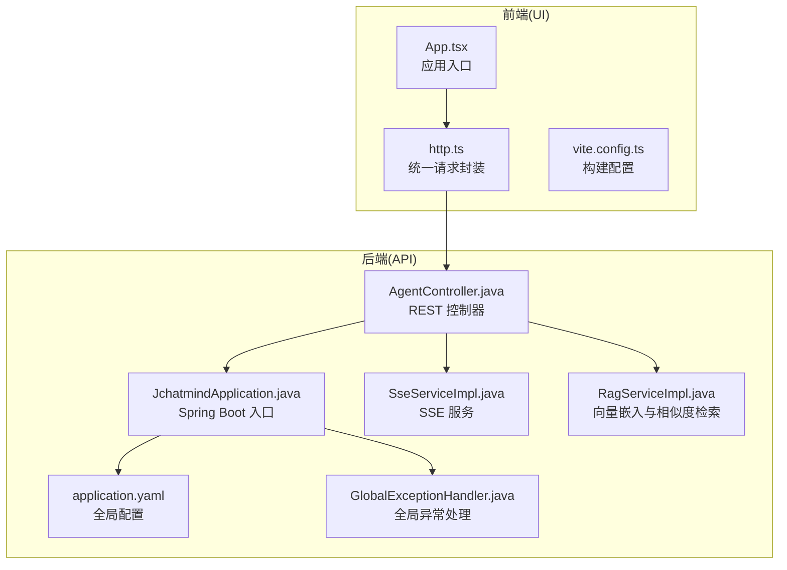
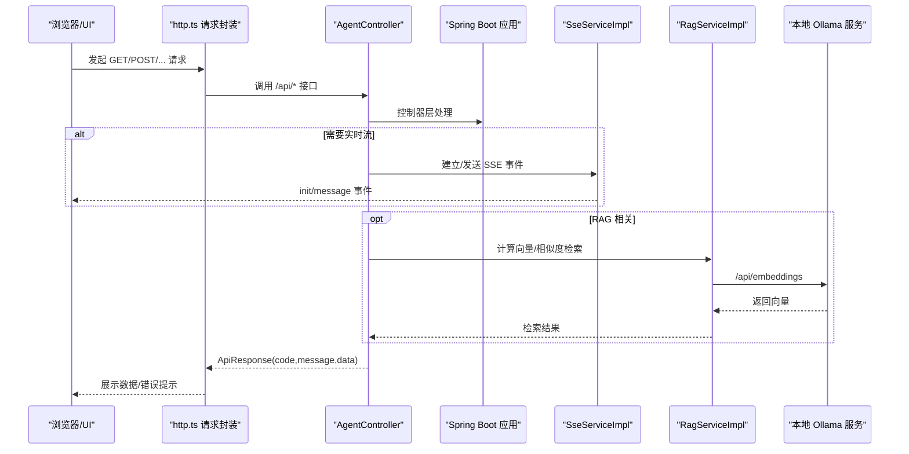
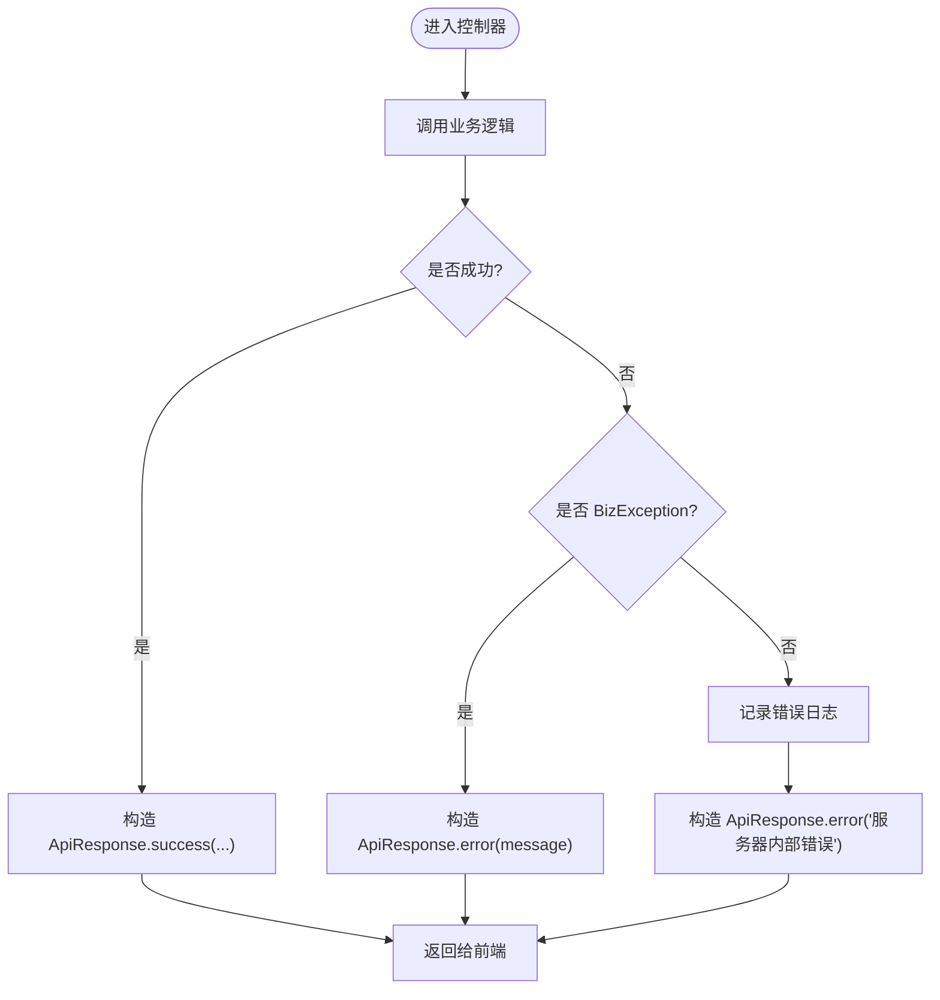
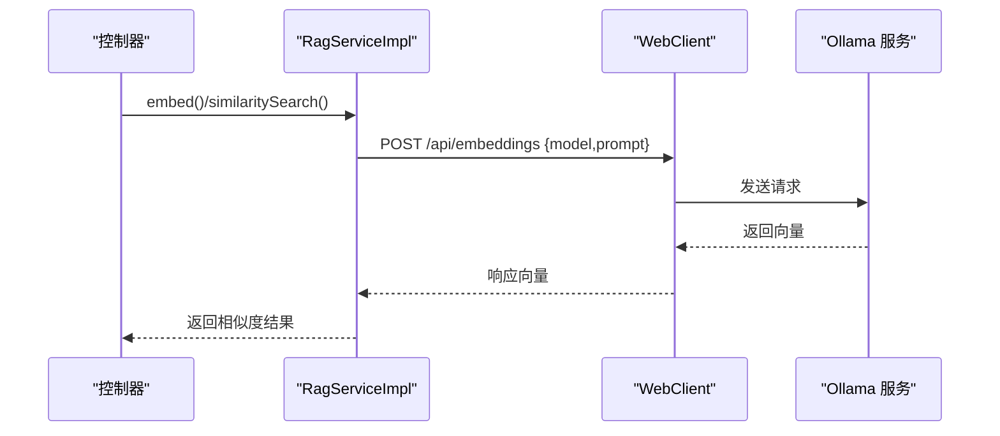
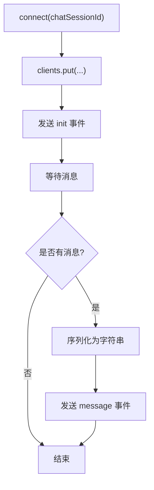
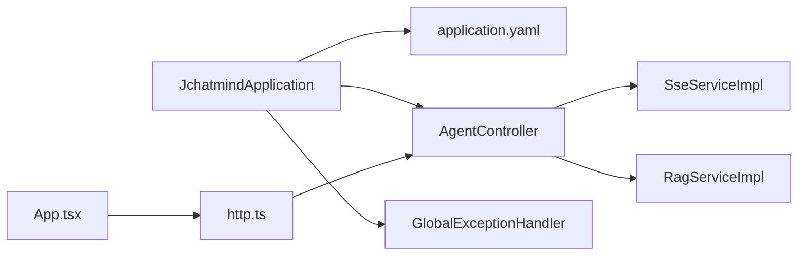

# 故障排除

<cite>
**本文引用的文件**
- [JchatmindApplication.java](file://jchatmind/src/main/java/com/kama/jchatmind/JchatmindApplication.java)
- [application.yaml](file://jchatmind/src/main/resources/application.yaml)
- [GlobalExceptionHandler.java](file://jchatmind/src/main/java/com/kama/jchatmind/exception/GlobalExceptionHandler.java)
- [BizException.java](file://jchatmind/src/main/java/com/kama/jchatmind/exception/BizException.java)
- [ApiResponse.java](file://jchatmind/src/main/java/com/kama/jchatmind/model/common/ApiResponse.java)
- [MultiChatClientConfig.java](file://jchatmind/src/main/java/com/kama/jchatmind/config/MultiChatClientConfig.java)
- [RagServiceImpl.java](file://jchatmind/src/main/java/com/kama/jchatmind/service/impl/RagServiceImpl.java)
- [SseServiceImpl.java](file://jchatmind/src/main/java/com/kama/jchatmind/service/impl/SseServiceImpl.java)
- [AgentController.java](file://jchatmind/src/main/java/com/kama/jchatmind/controller/AgentController.java)
- [http.ts](file://ui/src/api/http.ts)
- [App.tsx](file://ui/src/App.tsx)
- [vite.config.ts](file://ui/vite.config.ts)
- [README.md](file://README.md)
</cite>

## 目录
1. [简介](#简介)
2. [项目结构](#项目结构)
3. [核心组件](#核心组件)
4. [架构总览](#架构总览)
5. [详细组件分析](#详细组件分析)
6. [依赖分析](#依赖分析)
7. [性能考虑](#性能考虑)
8. [故障排除指南](#故障排除指南)
9. [结论](#结论)
10. [附录](#附录)

## 简介
本指南面向运维与开发人员，系统化梳理 JChatMind 在启动、数据库连接、AI 模型调用、前端资源加载、网络与并发、内存与性能等方面可能出现的常见问题与排障流程。文档结合后端 Spring Boot 应用、前端 React/Vite 工程以及 YAML 配置文件，提供可操作的诊断步骤、日志分析要点、错误码含义与调试工具使用建议，并给出监控告警与问题预防措施。

## 项目结构
JChatMind 采用前后端分离架构：
- 后端：Spring Boot 应用，提供 REST 接口、SSE 实时推送、RAG 向量检索、多模型客户端注册等。
- 前端：React + Vite 应用，通过统一的 http.ts 封装发起 API 请求，路由基于 React Router。
- 配置：application.yaml 定义数据源、邮件、AI 模型、MyBatis、文档存储等关键参数。

图表来源
- [App.tsx:1-16](file://ui/src/App.tsx#L1-L16)
- [http.ts:1-177](file://ui/src/api/http.ts#L1-L177)
- [vite.config.ts:1-9](file://ui/vite.config.ts#L1-L9)
- [JchatmindApplication.java:1-14](file://jchatmind/src/main/java/com/kama/jchatmind/JchatmindApplication.java#L1-L14)
- [application.yaml:1-43](file://jchatmind/src/main/resources/application.yaml#L1-L43)
- [AgentController.java:1-45](file://jchatmind/src/main/java/com/kama/jchatmind/controller/AgentController.java#L1-L45)
- [SseServiceImpl.java:1-64](file://jchatmind/src/main/java/com/kama/jchatmind/service/impl/SseServiceImpl.java#L1-L64)
- [RagServiceImpl.java:1-67](file://jchatmind/src/main/java/com/kama/jchatmind/service/impl/RagServiceImpl.java#L1-L67)
- [GlobalExceptionHandler.java:1-38](file://jchatmind/src/main/java/com/kama/jchatmind/exception/GlobalExceptionHandler.java#L1-L38)

章节来源
- [README.md:1-71](file://README.md#L1-L71)
- [JchatmindApplication.java:1-14](file://jchatmind/src/main/java/com/kama/jchatmind/JchatmindApplication.java#L1-L14)
- [application.yaml:1-43](file://jchatmind/src/main/resources/application.yaml#L1-L43)
- [http.ts:1-177](file://ui/src/api/http.ts#L1-L177)
- [App.tsx:1-16](file://ui/src/App.tsx#L1-L16)
- [vite.config.ts:1-9](file://ui/vite.config.ts#L1-L9)

## 核心组件
- 全局异常处理：捕获业务异常与未处理异常，统一返回 ApiResponse；对 404 资源错误进行专门处理。
- API 响应模型：统一的 ApiResponse 结构，包含 code、message、data 字段，便于前端一致化处理。
- 多模型客户端：注册 DeepSeek 与智谱 AI 的 ChatClient Bean，支持按名称选择模型。
- RAG 服务：通过本地 Ollama 服务计算向量嵌入，与 PostgreSQL + pgvector 进行相似度检索。
- SSE 服务：维护聊天会话的 SSE 连接，发送实时事件。
- 前端请求封装：http.ts 提供 get/post/put/patch/delete 方法，内置统一错误提示与业务状态校验。

章节来源
- [GlobalExceptionHandler.java:1-38](file://jchatmind/src/main/java/com/kama/jchatmind/exception/GlobalExceptionHandler.java#L1-L38)
- [BizException.java:1-15](file://jchatmind/src/main/java/com/kama/jchatmind/exception/BizException.java#L1-L15)
- [ApiResponse.java:1-59](file://jchatmind/src/main/java/com/kama/jchatmind/model/common/ApiResponse.java#L1-L59)
- [MultiChatClientConfig.java:1-23](file://jchatmind/src/main/java/com/kama/jchatmind/config/MultiChatClientConfig.java#L1-L23)
- [RagServiceImpl.java:1-67](file://jchatmind/src/main/java/com/kama/jchatmind/service/impl/RagServiceImpl.java#L1-L67)
- [SseServiceImpl.java:1-64](file://jchatmind/src/main/java/com/kama/jchatmind/service/impl/SseServiceImpl.java#L1-L64)
- [http.ts:1-177](file://ui/src/api/http.ts#L1-L177)

## 架构总览
下图展示从浏览器到后端 API、SSE、RAG 与本地模型服务的关键交互路径，帮助定位问题环节。

图表来源
- [http.ts:1-177](file://ui/src/api/http.ts#L1-L177)
- [AgentController.java:1-45](file://jchatmind/src/main/java/com/kama/jchatmind/controller/AgentController.java#L1-L45)
- [SseServiceImpl.java:1-64](file://jchatmind/src/main/java/com/kama/jchatmind/service/impl/SseServiceImpl.java#L1-L64)
- [RagServiceImpl.java:1-67](file://jchatmind/src/main/java/com/kama/jchatmind/service/impl/RagServiceImpl.java#L1-L67)

## 详细组件分析

### 异常处理与错误码
- 全局异常处理器：
  - 捕获业务异常 BizException，返回带 message 的 ApiResponse.error。
  - 捕获 NoResourceFoundException，返回 404。
  - 捕获其他未处理异常，记录日志并返回通用“服务器内部错误”。
- 错误码约定：
  - ApiResponse 内置 SUCCESS(200) 与 ERROR(500) 枚举；前端请求封装会根据 data.code !== 200 触发错误提示。
- 建议：
  - 业务侧抛出 BizException 时携带明确 message，便于前端展示与日志追踪。
  - 对于敏感错误，避免将堆栈细节直接暴露给前端。

图表来源
- [GlobalExceptionHandler.java:1-38](file://jchatmind/src/main/java/com/kama/jchatmind/exception/GlobalExceptionHandler.java#L1-L38)
- [BizException.java:1-15](file://jchatmind/src/main/java/com/kama/jchatmind/exception/BizException.java#L1-L15)
- [ApiResponse.java:1-59](file://jchatmind/src/main/java/com/kama/jchatmind/model/common/ApiResponse.java#L1-L59)

章节来源
- [GlobalExceptionHandler.java:1-38](file://jchatmind/src/main/java/com/kama/jchatmind/exception/GlobalExceptionHandler.java#L1-L38)
- [BizException.java:1-15](file://jchatmind/src/main/java/com/kama/jchatmind/exception/BizException.java#L1-L15)
- [ApiResponse.java:1-59](file://jchatmind/src/main/java/com/kama/jchatmind/model/common/ApiResponse.java#L1-L59)

### 数据库连接与 MyBatis
- 关键配置项：
  - 数据源 URL、用户名、密码、驱动类名。
  - MyBatis 类型别名包、Mapper XML 路径、类型处理器包。
- 常见问题：
  - 连接串格式错误、主机/端口不可达、认证失败、pgvector 扩展缺失。
  - Mapper XML 未正确加载导致 SQL 映射失败。
- 诊断步骤：
  - 使用 JDBC URL 直连验证网络与凭据。
  - 检查 application.yaml 中 mybatis.* 配置是否与实际目录一致。
  - 查看启动日志中的数据源初始化与 MyBatis 映射加载信息。

章节来源
- [application.yaml:1-43](file://jchatmind/src/main/resources/application.yaml#L1-L43)

### AI 模型调用与 RAG
- 多模型客户端：
  - 注册名称分别为 “deepseek-chat” 与 “glm-4.6”，分别对应 DeepSeek 与智谱 AI。
- RAG 流程：
  - 通过 RagServiceImpl 调用本地 Ollama 服务的 /api/embeddings 获取向量。
  - 将向量转换为 pgvector 字符串，查询向量相似度。
- 常见问题：
  - Ollama 服务未启动或端口被占用。
  - 模型 bge-m3 未拉取或加载失败。
  - 向量维度不匹配或 pgvector 未启用。
- 诊断步骤：
  - curl 验证 http://localhost:11434/api/embeddings 是否可达。
  - 检查 RagServiceImpl 中 baseUrl 与模型名配置。
  - 确认数据库中已安装并启用 pgvector 扩展。

图表来源
- [RagServiceImpl.java:1-67](file://jchatmind/src/main/java/com/kama/jchatmind/service/impl/RagServiceImpl.java#L1-L67)
- [MultiChatClientConfig.java:1-23](file://jchatmind/src/main/java/com/kama/jchatmind/config/MultiChatClientConfig.java#L1-L23)

章节来源
- [RagServiceImpl.java:1-67](file://jchatmind/src/main/java/com/kama/jchatmind/service/impl/RagServiceImpl.java#L1-L67)
- [MultiChatClientConfig.java:1-23](file://jchatmind/src/main/java/com/kama/jchatmind/config/MultiChatClientConfig.java#L1-L23)

### SSE 实时推送
- 连接生命周期：
  - 建立连接后发送 init 事件，超时/完成/错误时清理客户端映射。
  - 发送 message 事件时序列化为字符串。
- 常见问题：
  - 客户端断开未清理，导致内存增长。
  - 服务端发送异常未捕获，连接中断。
- 诊断步骤：
  - 检查连接建立与 onCompletion/onTimeout/onError 回调是否触发。
  - 关注 send 时的序列化与 IO 异常。

图表来源
- [SseServiceImpl.java:1-64](file://jchatmind/src/main/java/com/kama/jchatmind/service/impl/SseServiceImpl.java#L1-L64)

章节来源
- [SseServiceImpl.java:1-64](file://jchatmind/src/main/java/com/kama/jchatmind/service/impl/SseServiceImpl.java#L1-L64)

### 前端资源加载与请求封装
- 请求封装：
  - 统一 BASE_URL 为 http://localhost:8080/api。
  - 自动拼接查询参数，设置默认 Content-Type。
  - 校验 HTTP 状态与业务 code，错误时弹窗并抛错。
- 常见问题：
  - 后端未启动或端口冲突，导致 404/ETIMEDOUT。
  - CORS 未配置导致跨域失败。
  - 前端路由或静态资源未正确打包。
- 诊断步骤：
  - 浏览器 Network 面板查看请求与响应。
  - 检查 http.ts 中 BASE_URL 与后端实际端口一致性。
  - 确认 vite.config.ts 插件配置与构建产物。

章节来源
- [http.ts:1-177](file://ui/src/api/http.ts#L1-L177)
- [App.tsx:1-16](file://ui/src/App.tsx#L1-L16)
- [vite.config.ts:1-9](file://ui/vite.config.ts#L1-L9)

## 依赖分析
- 后端依赖关系概览：
  - JchatmindApplication 作为启动入口。
  - MultiChatClientConfig 注册多个 ChatClient Bean。
  - AgentController 依赖 Agent 幕后服务，返回 ApiResponse。
  - GlobalExceptionHandler 全局拦截异常。
  - SseServiceImpl 与 RagServiceImpl 作为服务层组件被控制器调用。
- 前端依赖关系概览：
  - App.tsx 作为根组件，注入路由与上下文。
  - http.ts 作为统一请求层，被各页面/组件调用。

图表来源
- [JchatmindApplication.java:1-14](file://jchatmind/src/main/java/com/kama/jchatmind/JchatmindApplication.java#L1-L14)
- [application.yaml:1-43](file://jchatmind/src/main/resources/application.yaml#L1-L43)
- [AgentController.java:1-45](file://jchatmind/src/main/java/com/kama/jchatmind/controller/AgentController.java#L1-L45)
- [GlobalExceptionHandler.java:1-38](file://jchatmind/src/main/java/com/kama/jchatmind/exception/GlobalExceptionHandler.java#L1-L38)
- [SseServiceImpl.java:1-64](file://jchatmind/src/main/java/com/kama/jchatmind/service/impl/SseServiceImpl.java#L1-L64)
- [RagServiceImpl.java:1-67](file://jchatmind/src/main/java/com/kama/jchatmind/service/impl/RagServiceImpl.java#L1-L67)
- [App.tsx:1-16](file://ui/src/App.tsx#L1-L16)
- [http.ts:1-177](file://ui/src/api/http.ts#L1-L177)

章节来源
- [AgentController.java:1-45](file://jchatmind/src/main/java/com/kama/jchatmind/controller/AgentController.java#L1-L45)
- [SseServiceImpl.java:1-64](file://jchatmind/src/main/java/com/kama/jchatmind/service/impl/SseServiceImpl.java#L1-L64)
- [RagServiceImpl.java:1-67](file://jchatmind/src/main/java/com/kama/jchatmind/service/impl/RagServiceImpl.java#L1-L67)
- [GlobalExceptionHandler.java:1-38](file://jchatmind/src/main/java/com/kama/jchatmind/exception/GlobalExceptionHandler.java#L1-L38)
- [JchatmindApplication.java:1-14](file://jchatmind/src/main/java/com/kama/jchatmind/JchatmindApplication.java#L1-L14)

## 性能考虑
- SSE 连接池与内存：
  - 使用并发安全 Map 存储客户端，注意连接断开后的清理，避免内存泄漏。
  - 合理设置超时时间与心跳策略。
- RAG 向量计算：
  - 本地 Ollama 服务的可用性直接影响响应时间；建议预热常用模型。
  - 向量维度与相似度阈值影响查询性能。
- 前端渲染：
  - 大列表渲染时采用虚拟滚动与分页策略。
  - 减少不必要的重渲染，合理使用 React.memo/useMemo。
- 数据库：
  - 为向量字段建立合适的索引，确保相似度检索效率。
  - 控制单次检索返回条数，避免过长的排序与过滤。

[本节为通用指导，无需列出章节来源]

## 故障排除指南

### 启动失败
- 症状
  - 启动时报数据源初始化失败、MyBatis 映射加载失败、端口占用。
- 诊断步骤
  - 检查 application.yaml 中数据源 URL/用户名/密码与驱动类名是否正确。
  - 确认数据库服务运行且 pgvector 已安装启用。
  - 查看启动日志中数据源与 MyBatis 的初始化输出。
  - 如端口被占用，修改 application.yaml 中 server.port 或释放端口。
- 解决方案
  - 修正配置项；重启应用；确认数据库权限与网络连通性。

章节来源
- [application.yaml:1-43](file://jchatmind/src/main/resources/application.yaml#L1-L43)
- [JchatmindApplication.java:1-14](file://jchatmind/src/main/java/com/kama/jchatmind/JchatmindApplication.java#L1-L14)

### 数据库连接问题
- 症状
  - 应用启动阶段报无法连接数据库、SQL 映射失败。
- 诊断步骤
  - 使用 JDBC URL 直连数据库验证主机/端口/凭据。
  - 检查 mybatis.type-aliases-package 与 mapper-locations 是否指向正确包与资源路径。
  - 确认数据库用户具备读写权限。
- 解决方案
  - 修复连接串与凭据；确保 pgvector 扩展已启用；检查网络策略与防火墙。

章节来源
- [application.yaml:1-43](file://jchatmind/src/main/resources/application.yaml#L1-L43)

### AI 模型调用异常（RAG/Embedding）
- 症状
  - /api/embeddings 404 或超时；相似度检索无结果。
- 诊断步骤
  - curl http://localhost:11434/api/embeddings 验证 Ollama 服务可达。
  - 检查 RagServiceImpl 中 baseUrl 与模型名是否与本地服务一致。
  - 确认数据库中已安装 pgvector 并创建向量索引。
- 解决方案
  - 启动 Ollama 服务并拉取 bge-m3 模型；修正 RagServiceImpl 配置；重建索引。

章节来源
- [RagServiceImpl.java:1-67](file://jchatmind/src/main/java/com/kama/jchatmind/service/impl/RagServiceImpl.java#L1-L67)
- [application.yaml:22-34](file://jchatmind/src/main/resources/application.yaml#L22-L34)

### 前端资源加载错误
- 症状
  - 页面空白、静态资源 404、接口跨域失败。
- 诊断步骤
  - 检查 http.ts 中 BASE_URL 与后端实际端口是否一致。
  - 浏览器 Network 面板查看请求状态码与响应内容。
  - 确认 Vite 开发服务器已启动且端口未被占用。
- 解决方案
  - 修正 BASE_URL；确保后端已启动；检查 CORS 配置（如需要）；重新构建前端。

章节来源
- [http.ts:1-177](file://ui/src/api/http.ts#L1-L177)
- [App.tsx:1-16](file://ui/src/App.tsx#L1-L16)
- [vite.config.ts:1-9](file://ui/vite.config.ts#L1-L9)

### 网络连接问题
- 症状
  - 请求超时、连接被拒绝、SSE 断开。
- 诊断步骤
  - 使用 telnet/curl 验证后端端口与 Ollama 端口连通性。
  - 检查代理、防火墙与安全组规则。
  - 关注浏览器控制台与后端日志中的连接异常。
- 解决方案
  - 修复网络策略；调整超时与重试策略；必要时开启代理透传。

[本节为通用指导，无需列出章节来源]

### 内存泄漏排查
- 症状
  - 长时间运行后内存持续增长；SSE 客户端未清理。
- 诊断步骤
  - 检查 SseServiceImpl 中 clients Map 是否在 onCompletion/onTimeout/onError 中移除。
  - 使用 JVM 分析工具观察堆栈与线程。
- 解决方案
  - 确保连接断开时清理映射；限制单会话消息队列长度；定期 GC 与内存回收。

章节来源
- [SseServiceImpl.java:1-64](file://jchatmind/src/main/java/com/kama/jchatmind/service/impl/SseServiceImpl.java#L1-L64)

### 并发问题
- 症状
  - 多用户同时访问时出现竞态、消息丢失或重复。
- 诊断步骤
  - 检查共享状态（如 Map）是否线程安全；关注高并发下的锁竞争。
  - 关注 SSE 事件发送顺序与幂等性。
- 解决方案
  - 使用并发容器与原子操作；引入限流与排队机制；确保事件幂等处理。

[本节为通用指导，无需列出章节来源]

### 日志分析技巧
- 后端
  - 关注 GlobalExceptionHandler 的错误日志输出，定位异常来源。
  - 查看数据源初始化、MyBatis 映射加载、SSE 连接生命周期日志。
- 前端
  - 浏览器 Network 面板查看请求与响应；结合 http.ts 的错误抛出定位问题。
- 建议
  - 统一日志级别与字段（traceId/会话ID），便于跨端关联。

章节来源
- [GlobalExceptionHandler.java:1-38](file://jchatmind/src/main/java/com/kama/jchatmind/exception/GlobalExceptionHandler.java#L1-L38)
- [http.ts:1-177](file://ui/src/api/http.ts#L1-L177)

### 监控告警配置与预防措施
- 监控指标
  - 后端：启动耗时、数据源连接数、RAG 嵌入耗时、SSE 连接数、异常率。
  - 前端：首屏加载时间、接口成功率、错误弹窗次数。
- 告警策略
  - 启动超时、RAG 嵌入失败率、SSE 连接异常、数据库连接失败。
- 预防措施
  - 预热 Ollama 模型；为向量检索建立索引；限制单次检索返回条数；完善异常降级与重试。

[本节为通用指导，无需列出章节来源]

## 结论
JChatMind 的故障多集中在启动配置、数据库与向量检索、SSE 实时流与前端跨域四个方面。通过统一的异常处理与 ApiResponse 约定、严格的日志与监控体系，以及规范的排障流程，可以快速定位并解决问题。建议在生产环境中进一步完善健康检查、限流熔断与自动恢复策略，以提升系统稳定性与用户体验。

[本节为总结性内容，无需列出章节来源]

## 附录

### 常用命令与端口
- 后端启动：在 jchatmind 目录执行启动脚本。
- 前端启动：在 ui 目录执行安装与开发命令。
- 默认端口：后端 8080，Ollama 11434。
- 数据库：PostgreSQL 5432，需启用 pgvector 扩展。

章节来源
- [README.md:46-66](file://README.md#L46-L66)
- [application.yaml:1-43](file://jchatmind/src/main/resources/application.yaml#L1-L43)
- [RagServiceImpl.java:1-67](file://jchatmind/src/main/java/com/kama/jchatmind/service/impl/RagServiceImpl.java#L1-L67)