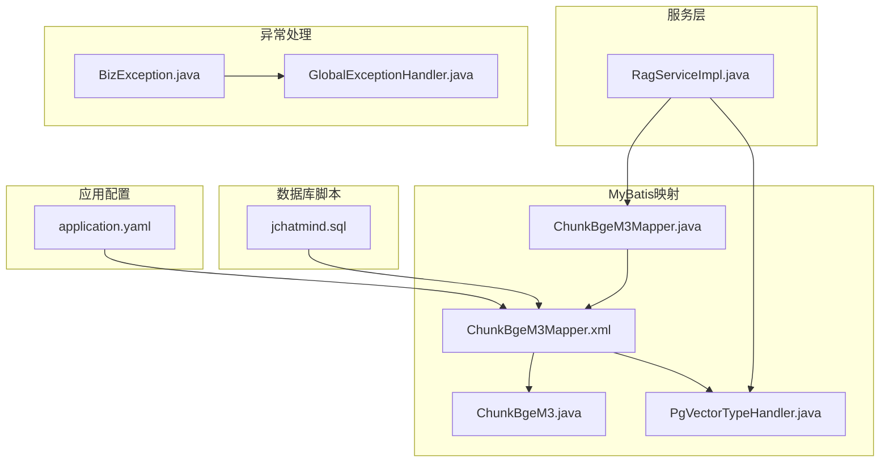
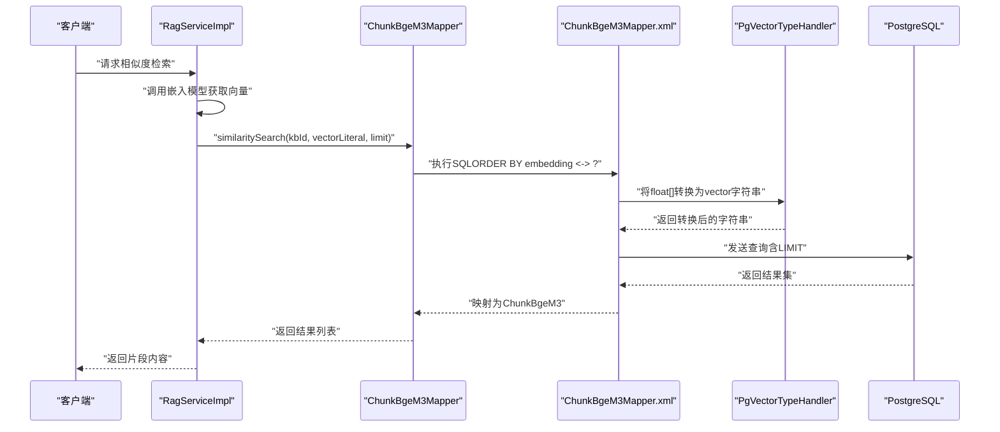
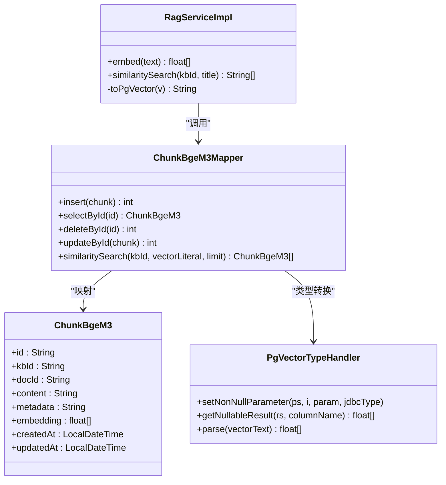
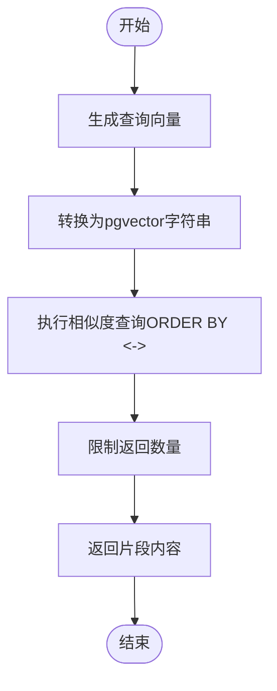

# 数据库问题

<cite>
**本文引用的文件**
- [application.yaml](file://jchatmind/src/main/resources/application.yaml)
- [jchatmind.sql](file://sql/jchatmind.sql)
- [ChunkBgeM3Mapper.java](file://jchatmind/src/main/java/com/kama/jchatmind/mapper/ChunkBgeM3Mapper.java)
- [ChunkBgeM3Mapper.xml](file://jchatmind/src/main/resources/mapper/ChunkBgeM3Mapper.xml)
- [ChunkBgeM3.java](file://jchatmind/src/main/java/com/kama/jchatmind/model/entity/ChunkBgeM3.java)
- [PgVectorTypeHandler.java](file://jchatmind/src/main/java/com/kama/jchatmind/typehandler/PgVectorTypeHandler.java)
- [RagServiceImpl.java](file://jchatmind/src/main/java/com/kama/jchatmind/service/impl/RagServiceImpl.java)
- [BizException.java](file://jchatmind/src/main/java/com/kama/jchatmind/exception/BizException.java)
- [GlobalExceptionHandler.java](file://jchatmind/src/main/java/com/kama/jchatmind/exception/GlobalExceptionHandler.java)
</cite>

## 目录
1. [简介](#简介)
2. [项目结构](#项目结构)
3. [核心组件](#核心组件)
4. [架构总览](#架构总览)
5. [详细组件分析](#详细组件分析)
6. [依赖分析](#依赖分析)
7. [性能考虑](#性能考虑)
8. [故障排除指南](#故障排除指南)
9. [结论](#结论)
10. [附录](#附录)

## 简介
本指南聚焦于JChatMind在使用PostgreSQL与pgvector进行RAG（检索增强生成）时常见的数据库问题，涵盖以下主题：
- PostgreSQL连接失败
- pgvector扩展缺失或版本不匹配
- 表结构初始化错误（含UUID、JSONB、VECTOR列、索引）
- SQL脚本执行问题
- MyBatis映射与类型处理器问题
- 向量相似度检索与索引重建
- 数据迁移与一致性校验
- 异常捕获与错误响应

目标是为开发者与运维人员提供系统化的诊断思路与修复路径，确保数据库层稳定可靠。

## 项目结构
与数据库直接相关的关键位置如下：
- 数据源与MyBatis配置：application.yaml
- 初始化脚本：sql/jchatmind.sql
- 向量表与索引：chunk_bge_m3（VECTOR列、IVFFLAT索引）
- MyBatis映射：ChunkBgeM3Mapper.xml
- 映射接口：ChunkBgeM3Mapper.java
- 实体类：ChunkBgeM3.java
- 类型处理器：PgVectorTypeHandler.java
- RAG服务：RagServiceImpl.java
- 异常体系：BizException.java、GlobalExceptionHandler.java

**图表来源**
- [application.yaml:1-43](file://jchatmind/src/main/resources/application.yaml#L1-L43)
- [jchatmind.sql:1-88](file://sql/jchatmind.sql#L1-L88)
- [ChunkBgeM3Mapper.java:1-31](file://jchatmind/src/main/java/com/kama/jchatmind/mapper/ChunkBgeM3Mapper.java#L1-L31)
- [ChunkBgeM3Mapper.xml:1-102](file://jchatmind/src/main/resources/mapper/ChunkBgeM3Mapper.xml#L1-L102)
- [ChunkBgeM3.java:1-83](file://jchatmind/src/main/java/com/kama/jchatmind/model/entity/ChunkBgeM3.java#L1-L83)
- [PgVectorTypeHandler.java:1-54](file://jchatmind/src/main/java/com/kama/jchatmind/typehandler/PgVectorTypeHandler.java#L1-L54)
- [RagServiceImpl.java:1-67](file://jchatmind/src/main/java/com/kama/jchatmind/service/impl/RagServiceImpl.java#L1-L67)
- [BizException.java:1-15](file://jchatmind/src/main/java/com/kama/jchatmind/exception/BizException.java#L1-L15)
- [GlobalExceptionHandler.java:1-38](file://jchatmind/src/main/java/com/kama/jchatmind/exception/GlobalExceptionHandler.java#L1-L38)

**章节来源**
- [application.yaml:1-43](file://jchatmind/src/main/resources/application.yaml#L1-L43)
- [jchatmind.sql:1-88](file://sql/jchatmind.sql#L1-L88)

## 核心组件
- 数据源配置：包含PostgreSQL JDBC URL、用户名、密码与驱动类名，用于建立数据库连接。
- MyBatis配置：实体包扫描、映射XML位置、类型处理器包，确保VECTOR数组能正确映射。
- 初始化脚本：启用pgvector扩展、创建表结构、定义VECTOR列维度、建立IVFFLAT索引。
- 映射器与XML：定义插入、查询、更新与相似度检索SQL，包含VECTOR类型转换与LIMIT限制。
- 类型处理器：将float[]与PostgreSQL的vector类型互转。
- RAG服务：封装嵌入模型调用与相似度检索流程。
- 异常处理：统一捕获业务异常与未处理异常，输出标准化响应。

**章节来源**
- [application.yaml:4-8](file://jchatmind/src/main/resources/application.yaml#L4-L8)
- [application.yaml:35-38](file://jchatmind/src/main/resources/application.yaml#L35-L38)
- [jchatmind.sql:1-88](file://sql/jchatmind.sql#L1-L88)
- [ChunkBgeM3Mapper.java:15-30](file://jchatmind/src/main/java/com/kama/jchatmind/mapper/ChunkBgeM3Mapper.java#L15-L30)
- [ChunkBgeM3Mapper.xml:24-41](file://jchatmind/src/main/resources/mapper/ChunkBgeM3Mapper.xml#L24-L41)
- [PgVectorTypeHandler.java:10-53](file://jchatmind/src/main/java/com/kama/jchatmind/typehandler/PgVectorTypeHandler.java#L10-L53)
- [RagServiceImpl.java:14-66](file://jchatmind/src/main/java/com/kama/jchatmind/service/impl/RagServiceImpl.java#L14-L66)
- [BizException.java:6-14](file://jchatmind/src/main/java/com/kama/jchatmind/exception/BizException.java#L6-L14)
- [GlobalExceptionHandler.java:12-37](file://jchatmind/src/main/java/com/kama/jchatmind/exception/GlobalExceptionHandler.java#L12-L37)

## 架构总览
下图展示从应用到数据库的端到端流程，包括连接、映射、类型转换与检索：

**图表来源**
- [RagServiceImpl.java:31-65](file://jchatmind/src/main/java/com/kama/jchatmind/service/impl/RagServiceImpl.java#L31-L65)
- [ChunkBgeM3Mapper.java:25-29](file://jchatmind/src/main/java/com/kama/jchatmind/mapper/ChunkBgeM3Mapper.java#L25-L29)
- [ChunkBgeM3Mapper.xml:85-99](file://jchatmind/src/main/resources/mapper/ChunkBgeM3Mapper.xml#L85-L99)
- [PgVectorTypeHandler.java:14-24](file://jchatmind/src/main/java/com/kama/jchatmind/typehandler/PgVectorTypeHandler.java#L14-L24)

## 详细组件分析

### 数据库配置与连接
- 关键点
  - JDBC URL、用户名、密码与驱动类名需与实际环境一致。
  - Spring Boot会基于配置自动创建数据源与MyBatis会话工厂。
- 常见问题
  - 连接超时、认证失败、网络不可达、数据库不存在。
- 排查步骤
  - 使用命令行或客户端工具验证URL可达性与凭据正确性。
  - 检查防火墙与安全组策略。
  - 确认PostgreSQL服务状态与监听端口。
  - 在application.yaml中核对连接参数与驱动类名。

**章节来源**
- [application.yaml:4-8](file://jchatmind/src/main/resources/application.yaml#L4-L8)

### 初始化脚本与表结构
- 关键点
  - 启用pgvector扩展。
  - 创建知识库、文档、消息、Agent等表，并建立外键约束。
  - chunk_bge_m3表使用VECTOR(1024)，并建立IVFFLAT索引。
- 常见问题
  - 扩展未安装或权限不足。
  - 索引建模参数不当导致检索性能差。
  - 列类型与索引操作符不匹配。
- 排查步骤
  - 登录数据库执行脚本，确认扩展已启用。
  - 检查VECTOR列是否为1024维（与bge-m3模型一致）。
  - 验证索引是否存在且状态正常。
  - 如需重建索引，先DROP再CREATE。

**章节来源**
- [jchatmind.sql:1-88](file://sql/jchatmind.sql#L1-L88)

### MyBatis映射与类型处理器
- 关键点
  - 映射XML中通过::vector将字符串转换为vector类型。
  - 类型处理器负责float[]与PostgreSQL vector字符串之间的双向转换。
  - 实体类字段与数据库列名、JDBC类型需一一对应。
- 常见问题
  - 类型不匹配导致插入/查询异常。
  - 结果映射缺失或JDBC类型错误。
  - 向量字符串格式不符合预期。
- 排查步骤
  - 核对映射XML中的jdbcType与实体字段类型。
  - 验证类型处理器注册与扫描路径。
  - 手工构造向量字符串，确保格式为“[v1,v2,...]”。

**章节来源**
- [ChunkBgeM3Mapper.xml:13](file://jchatmind/src/main/resources/mapper/ChunkBgeM3Mapper.xml#L13)
- [ChunkBgeM3Mapper.xml:38](file://jchatmind/src/main/resources/mapper/ChunkBgeM3Mapper.xml#L38)
- [ChunkBgeM3Mapper.xml:77](file://jchatmind/src/main/resources/mapper/ChunkBgeM3Mapper.xml#L77)
- [PgVectorTypeHandler.java:10-53](file://jchatmind/src/main/java/com/kama/jchatmind/typehandler/PgVectorTypeHandler.java#L10-L53)
- [ChunkBgeM3.java:25](file://jchatmind/src/main/java/com/kama/jchatmind/model/entity/ChunkBgeM3.java#L25)

### 相似度检索与索引
- 关键点
  - 使用向量距离操作符“<->”进行L2距离排序。
  - 通过LIMIT控制返回数量。
  - IVFFLAT索引支持快速近似最近邻搜索。
- 常见问题
  - 索引未建立或损坏。
  - 向量维度不匹配导致查询失败。
  - 查询参数未按要求格式化。
- 排查步骤
  - 确认索引存在且状态可用。
  - 验证向量维度与模型一致。
  - 使用小批量数据验证查询逻辑。

**章节来源**
- [ChunkBgeM3Mapper.xml:97](file://jchatmind/src/main/resources/mapper/ChunkBgeM3Mapper.xml#L97)
- [jchatmind.sql:83-87](file://sql/jchatmind.sql#L83-L87)
- [RagServiceImpl.java:50-55](file://jchatmind/src/main/java/com/kama/jchatmind/service/impl/RagServiceImpl.java#L50-L55)

### 异常处理与错误响应
- 关键点
  - 自定义业务异常BizException用于语义化错误。
  - 全局异常处理器统一拦截并返回标准化响应。
- 常见问题
  - 未捕获的数据库异常导致堆栈泄露。
  - 响应体未按约定格式返回。
- 排查步骤
  - 检查异常是否被全局处理器捕获。
  - 核对错误码与消息是否符合前端约定。

**章节来源**
- [BizException.java:6-14](file://jchatmind/src/main/java/com/kama/jchatmind/exception/BizException.java#L6-L14)
- [GlobalExceptionHandler.java:16-36](file://jchatmind/src/main/java/com/kama/jchatmind/exception/GlobalExceptionHandler.java#L16-L36)

## 依赖分析
- 组件耦合
  - RagServiceImpl依赖ChunkBgeM3Mapper与WebClient。
  - ChunkBgeM3Mapper通过XML与数据库交互。
  - PgVectorTypeHandler贯穿向量序列化/反序列化。
  - 全局异常处理器统一处理运行期异常。
- 外部依赖
  - PostgreSQL与pgvector扩展。
  - MyBatis框架与类型处理器机制。
  - 嵌入模型服务（本地Ollama或其他）。

**图表来源**
- [RagServiceImpl.java:14-66](file://jchatmind/src/main/java/com/kama/jchatmind/service/impl/RagServiceImpl.java#L14-L66)
- [ChunkBgeM3Mapper.java:15-30](file://jchatmind/src/main/java/com/kama/jchatmind/mapper/ChunkBgeM3Mapper.java#L15-L30)
- [ChunkBgeM3.java:14-29](file://jchatmind/src/main/java/com/kama/jchatmind/model/entity/ChunkBgeM3.java#L14-L29)
- [PgVectorTypeHandler.java:12](file://jchatmind/src/main/java/com/kama/jchatmind/typehandler/PgVectorTypeHandler.java#L12)

## 性能考虑
- 索引参数调优
  - IVFFLAT lists参数影响索引质量与内存占用，建议根据数据规模与查询延迟权衡设置。
- 查询优化
  - 控制LIMIT数量，避免一次性返回过多结果。
  - 使用WHERE过滤条件（如kb_id）减少候选集。
- 数据类型与存储
  - 确保VECTOR维度与模型一致，避免隐式转换开销。
- 连接池与并发
  - 调整连接池大小与超时参数，避免高并发下的连接争用。

[本节为通用指导，无需列出章节来源]

## 故障排除指南

### 一、PostgreSQL连接失败
- 症状
  - 应用启动报连接超时、认证失败或拒绝连接。
- 诊断
  - 使用psql或同机命令行验证URL、端口、数据库名、用户名与密码。
  - 检查PostgreSQL日志与网络连通性。
  - 确认JDBC驱动类名与PostgreSQL版本兼容。
- 修复
  - 在application.yaml中修正连接参数。
  - 开放防火墙与安全组策略。
  - 重启数据库服务后重试。

**章节来源**
- [application.yaml:4-8](file://jchatmind/src/main/resources/application.yaml#L4-L8)

### 二、pgvector扩展问题
- 症状
  - 执行初始化脚本报错，提示扩展不存在或无法加载。
- 诊断
  - 登录数据库检查扩展是否已安装。
  - 确认当前数据库用户具备安装扩展的权限。
- 修复
  - 以超级用户执行安装扩展命令。
  - 重新执行初始化脚本。

**章节来源**
- [jchatmind.sql:1](file://sql/jchatmind.sql#L1)

### 三、表结构初始化错误
- 症状
  - 创建表失败、外键约束冲突、列类型不匹配。
- 诊断
  - 检查各表DDL是否完整执行。
  - 确认UUID默认值、JSONB列与VECTOR列定义。
- 修复
  - 删除冲突对象后重新执行脚本。
  - 确保依赖顺序：先扩展，再表，再索引。

**章节来源**
- [jchatmind.sql:3-81](file://sql/jchatmind.sql#L3-L81)

### 四、SQL脚本执行问题
- 症状
  - 插入/更新/查询报错，或相似度检索无结果。
- 诊断
  - 核对映射XML中的类型转换与列名。
  - 验证向量字符串格式与维度。
- 修复
  - 在XML中显式使用::vector进行类型转换。
  - 使用类型处理器确保float[]正确序列化。

**章节来源**
- [ChunkBgeM3Mapper.xml:38](file://jchatmind/src/main/resources/mapper/ChunkBgeM3Mapper.xml#L38)
- [ChunkBgeM3Mapper.xml:77](file://jchatmind/src/main/resources/mapper/ChunkBgeM3Mapper.xml#L77)
- [PgVectorTypeHandler.java:14-24](file://jchatmind/src/main/java/com/kama/jchatmind/typehandler/PgVectorTypeHandler.java#L14-L24)

### 五、MyBatis映射错误
- 症状
  - 结果映射失败、字段为空、类型不匹配。
- 诊断
  - 检查resultMap与result节点的jdbcType与property映射。
  - 确认实体类字段与数据库列一致。
- 修复
  - 在resultMap中为embedding指定正确的jdbcType。
  - 确保类型处理器包被扫描。

**章节来源**
- [ChunkBgeM3Mapper.xml:7-16](file://jchatmind/src/main/resources/mapper/ChunkBgeM3Mapper.xml#L7-L16)
- [application.yaml:35-38](file://jchatmind/src/main/resources/application.yaml#L35-L38)

### 六、向量索引重建
- 症状
  - 相似度检索性能下降或查询异常。
- 诊断
  - 检查索引状态与统计信息。
  - 验证向量维度与模型一致。
- 修复
  - DROP旧索引，重新CREATE IVFFLAT索引。
  - 调整lists参数以平衡精度与性能。

**章节来源**
- [jchatmind.sql:83-87](file://sql/jchatmind.sql#L83-L87)

### 七、数据迁移失败
- 症状
  - 迁移过程中断、重复导入、主键冲突。
- 诊断
  - 检查迁移脚本执行顺序与幂等性。
  - 核对UUID生成与外键引用。
- 修复
  - 清理残留数据后重试迁移。
  - 使用事务包裹关键步骤，失败回滚。

**章节来源**
- [jchatmind.sql:68-81](file://sql/jchatmind.sql#L68-L81)

### 八、异常捕获与错误响应
- 症状
  - 前端收到堆栈信息或错误码不一致。
- 诊断
  - 检查全局异常处理器是否生效。
  - 确认业务异常是否被正确包装。
- 修复
  - 统一抛出BizException并设置合理错误码。
  - 确保全局处理器返回标准化响应。

**章节来源**
- [BizException.java:6-14](file://jchatmind/src/main/java/com/kama/jchatmind/exception/BizException.java#L6-L14)
- [GlobalExceptionHandler.java:16-36](file://jchatmind/src/main/java/com/kama/jchatmind/exception/GlobalExceptionHandler.java#L16-L36)

## 结论
JChatMind的数据库层围绕PostgreSQL与pgvector构建，关键在于：
- 正确的连接配置与权限
- 完整的初始化脚本与索引
- MyBatis映射与类型处理器的一致性
- 索引参数与查询策略的协同优化
- 规范的异常处理与错误响应

遵循本指南的诊断与修复步骤，可有效降低数据库相关故障率，提升系统稳定性与检索性能。

## 附录

### A. 关键流程图：相似度检索

**图表来源**
- [RagServiceImpl.java:50-55](file://jchatmind/src/main/java/com/kama/jchatmind/service/impl/RagServiceImpl.java#L50-L55)
- [ChunkBgeM3Mapper.xml:97](file://jchatmind/src/main/resources/mapper/ChunkBgeM3Mapper.xml#L97)