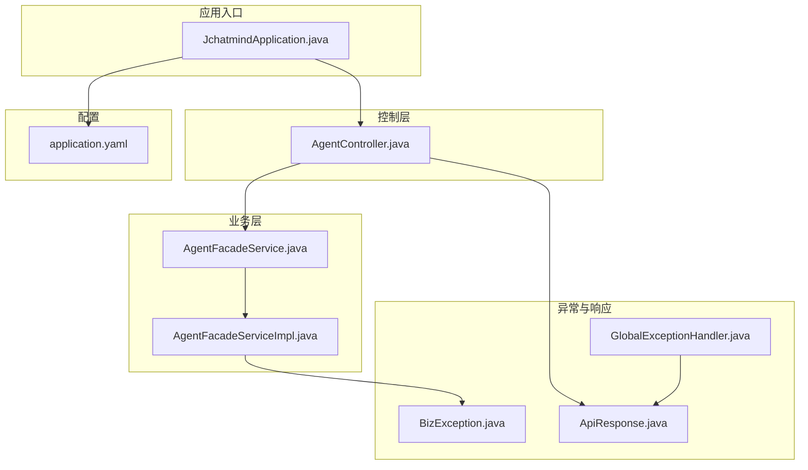
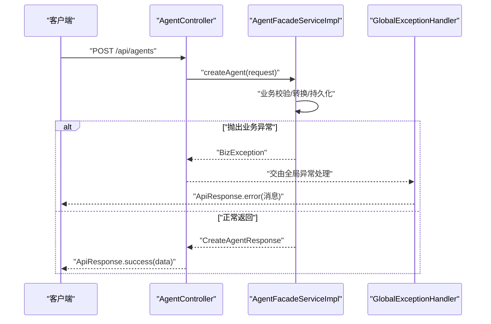
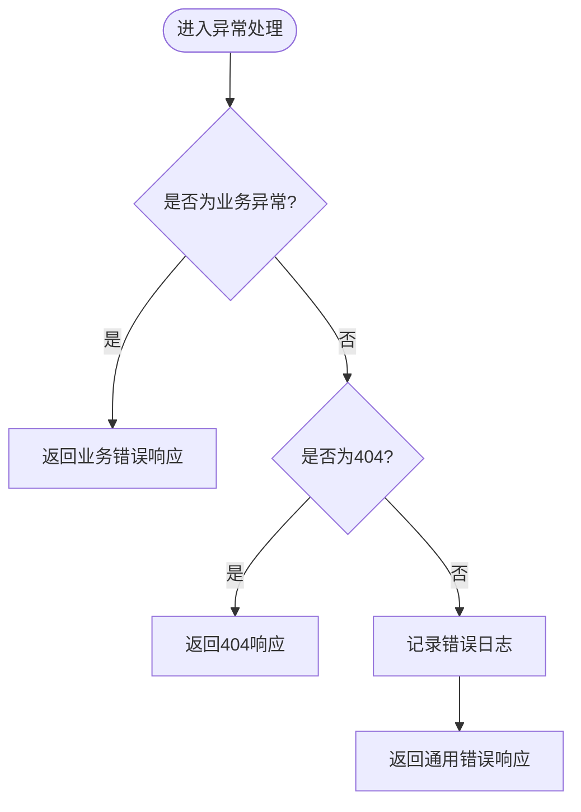
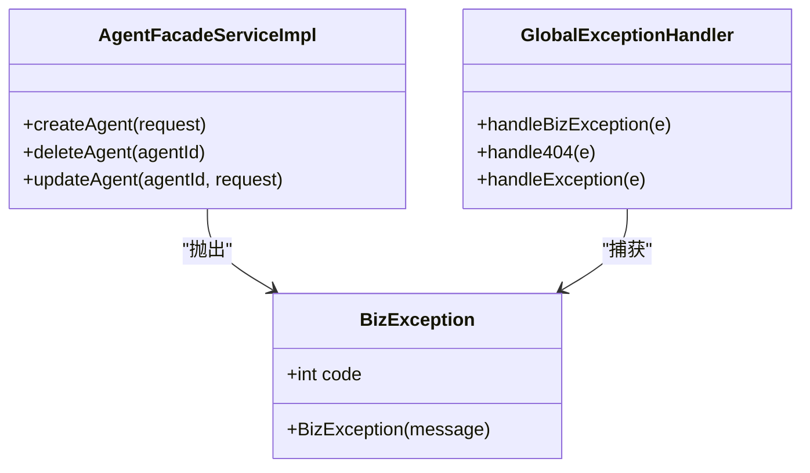
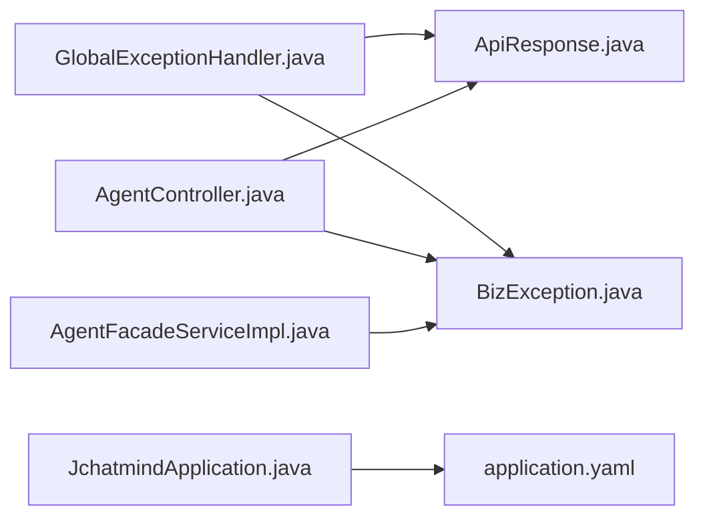

# 日志分析与调试

<cite>
**本文引用的文件**
- [BizException.java](file://jchatmind/src/main/java/com/kama/jchatmind/exception/BizException.java)
- [GlobalExceptionHandler.java](file://jchatmind/src/main/java/com/kama/jchatmind/exception/GlobalExceptionHandler.java)
- [ApiResponse.java](file://jchatmind/src/main/java/com/kama/jchatmind/model/common/ApiResponse.java)
- [application.yaml](file://jchatmind/src/main/resources/application.yaml)
- [AgentController.java](file://jchatmind/src/main/java/com/kama/jchatmind/controller/AgentController.java)
- [AgentFacadeServiceImpl.java](file://jchatmind/src/main/java/com/kama/jchatmind/service/impl/AgentFacadeServiceImpl.java)
- [AgentFacadeService.java](file://jchatmind/src/main/java/com/kama/jchatmind/service/AgentFacadeService.java)
- [JchatmindApplication.java](file://jchatmind/src/main/java/com/kama/jchatmind/JchatmindApplication.java)
- [pom.xml](file://jchatmind/pom.xml)
- [AgentControllerTest.java](file://jchatmind/src/test/java/com/kama/jchatmind/controller/AgentControllerTest.java)
- [AgentFacadeServiceTest.java](file://jchatmind/src/test/java/com/kama/jchatmind/service/AgentFacadeServiceTest.java)
- [TEST-AgentControllerTest.xml](file://jchatmind/target/surefire-reports/TEST-com.kama.jchatmind.controller.AgentControllerTest.xml)
</cite>

## 目录
1. [简介](#简介)
2. [项目结构](#项目结构)
3. [核心组件](#核心组件)
4. [架构总览](#架构总览)
5. [详细组件分析](#详细组件分析)
6. [依赖分析](#依赖分析)
7. [性能考虑](#性能考虑)
8. [故障排查指南](#故障排查指南)
9. [结论](#结论)
10. [附录](#附录)

## 简介
本指南面向JChatMind后端工程，聚焦于日志分析与调试实践，覆盖系统日志结构、异常日志解读、业务日志追踪方法；详解全局异常处理器工作原理、业务异常定义与处理机制；提供断点调试、远程调试、测试报告解析等开发调试技巧；并总结生产环境日志监控、错误追踪与问题定位的最佳实践。

## 项目结构
JChatMind后端采用Spring Boot分层架构，核心目录与职责概览如下：
- exception：统一异常处理与业务异常定义
- model/common：通用响应模型与状态码
- controller：REST接口层
- service：业务门面与实现
- mapper：MyBatis数据映射
- resources：配置文件（application.yaml）
- test：单元与集成测试（含Surefire测试报告）

图表来源
- [JchatmindApplication.java:1-14](file://jchatmind/src/main/java/com/kama/jchatmind/JchatmindApplication.java#L1-L14)
- [AgentController.java:1-45](file://jchatmind/src/main/java/com/kama/jchatmind/controller/AgentController.java#L1-L45)
- [AgentFacadeService.java:1-17](file://jchatmind/src/main/java/com/kama/jchatmind/service/AgentFacadeService.java#L1-L17)
- [AgentFacadeServiceImpl.java:1-122](file://jchatmind/src/main/java/com/kama/jchatmind/service/impl/AgentFacadeServiceImpl.java#L1-L122)
- [BizException.java:1-15](file://jchatmind/src/main/java/com/kama/jchatmind/exception/BizException.java#L1-L15)
- [GlobalExceptionHandler.java:1-38](file://jchatmind/src/main/java/com/kama/jchatmind/exception/GlobalExceptionHandler.java#L1-L38)
- [ApiResponse.java:1-59](file://jchatmind/src/main/java/com/kama/jchatmind/model/common/ApiResponse.java#L1-L59)
- [application.yaml:1-43](file://jchatmind/src/main/resources/application.yaml#L1-L43)

章节来源
- [JchatmindApplication.java:1-14](file://jchatmind/src/main/java/com/kama/jchatmind/JchatmindApplication.java#L1-L14)
- [application.yaml:1-43](file://jchatmind/src/main/resources/application.yaml#L1-L43)

## 核心组件
- 全局异常处理器：统一捕获业务异常与未处理异常，标准化响应与日志输出
- 业务异常：用于表达“用户可感知”的错误场景
- 通用响应模型：统一前后端交互的数据结构
- 控制器与服务：业务日志的关键落点

章节来源
- [GlobalExceptionHandler.java:1-38](file://jchatmind/src/main/java/com/kama/jchatmind/exception/GlobalExceptionHandler.java#L1-L38)
- [BizException.java:1-15](file://jchatmind/src/main/java/com/kama/jchatmind/exception/BizException.java#L1-L15)
- [ApiResponse.java:1-59](file://jchatmind/src/main/java/com/kama/jchatmind/model/common/ApiResponse.java#L1-L59)
- [AgentController.java:1-45](file://jchatmind/src/main/java/com/kama/jchatmind/controller/AgentController.java#L1-L45)
- [AgentFacadeServiceImpl.java:1-122](file://jchatmind/src/main/java/com/kama/jchatmind/service/impl/AgentFacadeServiceImpl.java#L1-L122)

## 架构总览
下图展示一次典型请求在系统中的流转路径，以及异常处理与日志输出的关键节点。

图表来源
- [AgentController.java:26-29](file://jchatmind/src/main/java/com/kama/jchatmind/controller/AgentController.java#L26-L29)
- [AgentFacadeServiceImpl.java:48-74](file://jchatmind/src/main/java/com/kama/jchatmind/service/impl/AgentFacadeServiceImpl.java#L48-L74)
- [GlobalExceptionHandler.java:16-19](file://jchatmind/src/main/java/com/kama/jchatmind/exception/GlobalExceptionHandler.java#L16-L19)

## 详细组件分析

### 全局异常处理器
- 职责
  - 捕获业务异常并返回统一响应
  - 处理404资源未找到
  - 捕获所有未处理异常，记录错误日志并返回通用错误响应
- 日志策略
  - 对未处理异常进行错误级别日志记录，便于问题定位
- 响应策略
  - 业务异常：返回错误码与消息
  - 未处理异常：返回通用错误提示，避免泄露内部细节

图表来源
- [GlobalExceptionHandler.java:13-36](file://jchatmind/src/main/java/com/kama/jchatmind/exception/GlobalExceptionHandler.java#L13-L36)

章节来源
- [GlobalExceptionHandler.java:1-38](file://jchatmind/src/main/java/com/kama/jchatmind/exception/GlobalExceptionHandler.java#L1-L38)

### 业务异常与业务日志
- 业务异常定义
  - 用于表达“用户可感知”的错误，如参数缺失、资源不存在、操作失败等
- 业务日志落点
  - 控制器：对外可见的错误消息通过全局异常处理器统一返回
  - 服务层：对内部错误进行日志记录，便于问题定位
- 示例流程
  - 控制器接收请求并调用服务
  - 服务层抛出业务异常或执行失败
  - 全局异常处理器捕获并返回统一响应

图表来源
- [BizException.java:6-14](file://jchatmind/src/main/java/com/kama/jchatmind/exception/BizException.java#L6-L14)
- [AgentFacadeServiceImpl.java:48-87](file://jchatmind/src/main/java/com/kama/jchatmind/service/impl/AgentFacadeServiceImpl.java#L48-L87)
- [GlobalExceptionHandler.java:16-36](file://jchatmind/src/main/java/com/kama/jchatmind/exception/GlobalExceptionHandler.java#L16-L36)

章节来源
- [BizException.java:1-15](file://jchatmind/src/main/java/com/kama/jchatmind/exception/BizException.java#L1-L15)
- [AgentFacadeServiceImpl.java:1-122](file://jchatmind/src/main/java/com/kama/jchatmind/service/impl/AgentFacadeServiceImpl.java#L1-L122)
- [AgentController.java:1-45](file://jchatmind/src/main/java/com/kama/jchatmind/controller/AgentController.java#L1-L45)

### 通用响应模型
- 统一字段：状态码、消息、数据
- 成功/错误工厂方法：便于在各层快速构造标准响应
- 与异常处理配合：保证前后端交互一致性

章节来源
- [ApiResponse.java:1-59](file://jchatmind/src/main/java/com/kama/jchatmind/model/common/ApiResponse.java#L1-L59)

### 控制器与服务层
- 控制器：负责请求接入与响应封装
- 服务层：负责业务逻辑与异常抛出
- 测试：通过Mock验证异常路径与响应码

章节来源
- [AgentController.java:1-45](file://jchatmind/src/main/java/com/kama/jchatmind/controller/AgentController.java#L1-L45)
- [AgentFacadeService.java:1-17](file://jchatmind/src/main/java/com/kama/jchatmind/service/AgentFacadeService.java#L1-L17)
- [AgentFacadeServiceImpl.java:1-122](file://jchatmind/src/main/java/com/kama/jchatmind/service/impl/AgentFacadeServiceImpl.java#L1-L122)
- [AgentControllerTest.java:93-123](file://jchatmind/src/test/java/com/kama/jchatmind/controller/AgentControllerTest.java#L93-L123)
- [AgentFacadeServiceTest.java:141-156](file://jchatmind/src/test/java/com/kama/jchatmind/service/AgentFacadeServiceTest.java#L141-L156)

## 依赖分析
- 异常处理依赖
  - 控制器依赖统一响应模型
  - 全局异常处理器依赖业务异常与统一响应模型
- 运行时依赖
  - Spring Boot Web、MyBatis、邮件、Spring AI等

图表来源
- [AgentController.java:1-45](file://jchatmind/src/main/java/com/kama/jchatmind/controller/AgentController.java#L1-L45)
- [AgentFacadeServiceImpl.java:1-122](file://jchatmind/src/main/java/com/kama/jchatmind/service/impl/AgentFacadeServiceImpl.java#L1-L122)
- [BizException.java:1-15](file://jchatmind/src/main/java/com/kama/jchatmind/exception/BizException.java#L1-L15)
- [GlobalExceptionHandler.java:1-38](file://jchatmind/src/main/java/com/kama/jchatmind/exception/GlobalExceptionHandler.java#L1-L38)
- [ApiResponse.java:1-59](file://jchatmind/src/main/java/com/kama/jchatmind/model/common/ApiResponse.java#L1-L59)
- [JchatmindApplication.java:1-14](file://jchatmind/src/main/java/com/kama/jchatmind/JchatmindApplication.java#L1-L14)
- [application.yaml:1-43](file://jchatmind/src/main/resources/application.yaml#L1-L43)

章节来源
- [pom.xml:46-122](file://jchatmind/pom.xml#L46-L122)

## 性能考虑
- 异常路径尽量轻量化：避免在异常处理中执行昂贵操作
- 统一日志格式：便于批量采集与检索
- 控制器与服务层分离：减少异常传播成本
- 生产环境建议开启异步日志与限流，防止异常风暴放大

## 故障排查指南

### 日志结构与解读
- 应用名称标识
  - 测试报告中包含应用名标识，可用于筛选日志
- 时间戳与级别
  - 标准化时间戳与日志级别，便于排序与过滤
- 请求上下文
  - 在控制器与服务层增加关键步骤的日志，形成完整的调用链路

章节来源
- [TEST-AgentControllerTest.xml:66-66](file://jchatmind/target/surefire-reports/TEST-com.kama.jchatmind.controller.AgentControllerTest.xml#L66-L66)

### 异常日志解读
- 业务异常
  - 由服务层抛出，全局异常处理器返回统一错误响应
  - 建议在服务层补充上下文日志，便于定位
- 未处理异常
  - 全局异常处理器记录错误日志并返回通用错误响应
  - 建议在控制器层补充请求参数日志，辅助复现

章节来源
- [GlobalExceptionHandler.java:32-36](file://jchatmind/src/main/java/com/kama/jchatmind/exception/GlobalExceptionHandler.java#L32-L36)
- [AgentFacadeServiceImpl.java:64-65](file://jchatmind/src/main/java/com/kama/jchatmind/service/impl/AgentFacadeServiceImpl.java#L64-L65)

### 业务日志追踪
- 关键路径
  - 控制器：请求到达、参数校验、调用服务、封装响应
  - 服务层：业务规则、数据转换、持久化、异常抛出
- 建议
  - 在每个关键节点输出结构化日志（如traceId、userId、参数摘要等）
  - 对异常路径补充堆栈日志，确保可追溯

章节来源
- [AgentController.java:26-29](file://jchatmind/src/main/java/com/kama/jchatmind/controller/AgentController.java#L26-L29)
- [AgentFacadeServiceImpl.java:48-74](file://jchatmind/src/main/java/com/kama/jchatmind/service/impl/AgentFacadeServiceImpl.java#L48-L74)

### 开发调试实践

#### 断点调试
- 步骤
  - 在控制器入口设置断点，观察请求参数与响应结构
  - 在服务层关键分支设置断点，检查业务逻辑与异常抛出点
- 建议
  - 使用条件断点过滤特定参数或异常类型
  - 结合日志输出，快速定位问题范围

章节来源
- [AgentController.java:1-45](file://jchatmind/src/main/java/com/kama/jchatmind/controller/AgentController.java#L1-L45)
- [AgentFacadeServiceImpl.java:1-122](file://jchatmind/src/main/java/com/kama/jchatmind/service/impl/AgentFacadeServiceImpl.java#L1-L122)

#### 远程调试配置
- 方式
  - 通过IDE附加到运行中的进程，或以调试模式启动
- 注意
  - 生产环境谨慎开启远程调试，避免安全风险
  - 使用独立的调试环境，隔离对线上流量的影响

#### 测试报告解析
- 作用
  - 通过测试报告中的应用名标识与启动日志，确认运行环境与版本
- 方法
  - 查找报告中的应用名标识，核对日志输出与断言结果

章节来源
- [TEST-AgentControllerTest.xml:66-66](file://jchatmind/target/surefire-reports/TEST-com.kama.jchatmind.controller.AgentControllerTest.xml#L66-L66)

### 生产环境日志监控与问题定位最佳实践
- 日志采集
  - 使用集中式日志系统收集应用日志
  - 为不同级别设置告警阈值
- 结构化日志
  - 输出统一格式的日志，包含时间戳、级别、应用名、线程、类名、行号、消息、异常堆栈
- 链路追踪
  - 为每个请求生成唯一traceId，贯穿请求生命周期
- 错误追踪
  - 对未处理异常进行统一记录与告警
  - 对高频错误建立指标监控与自动降级策略

## 结论
通过对JChatMind异常处理与日志体系的梳理，可以形成一套从开发调试到生产监控的完整闭环：以统一响应与异常处理为基础，以结构化日志与链路追踪为手段，以测试报告与远程调试为支撑，最终实现高效的问题定位与稳定的服务保障。

## 附录

### 配置参考
- 数据源与邮件、AI模型等配置位于应用配置文件中，可据此调整运行参数与日志输出行为

章节来源
- [application.yaml:1-43](file://jchatmind/src/main/resources/application.yaml#L1-L43)