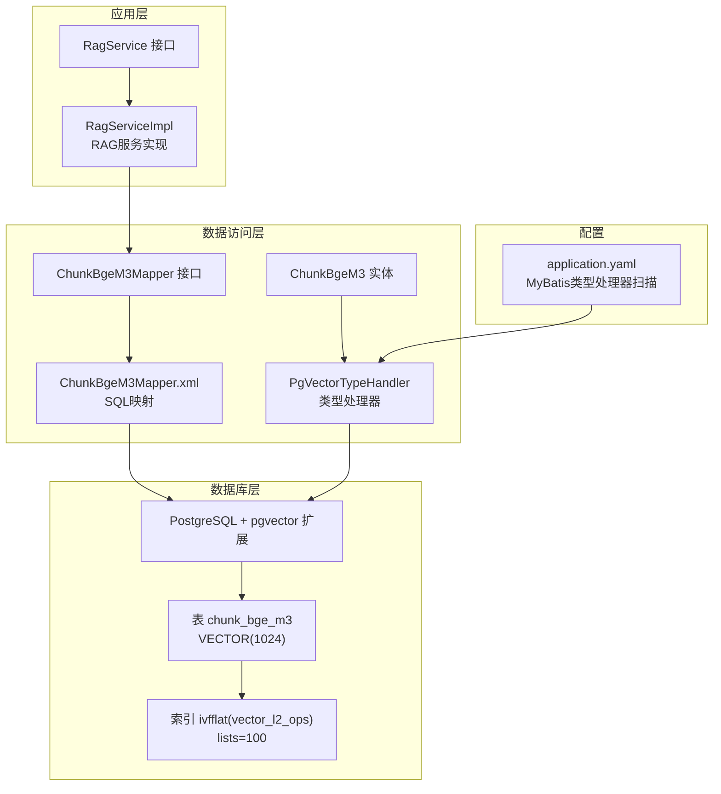
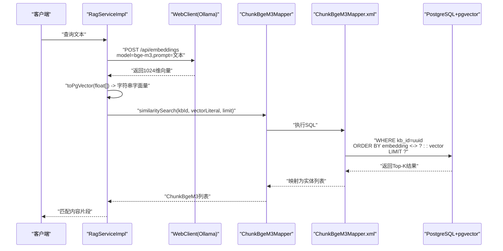
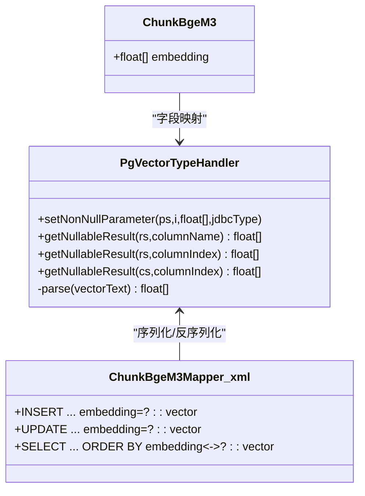
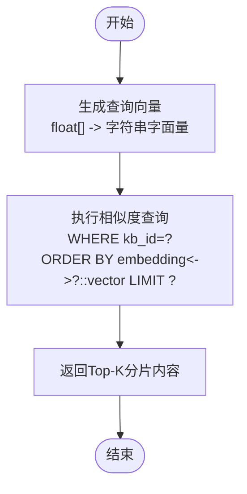
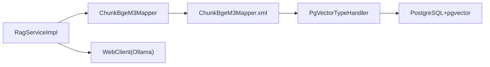

# 向量数据库设计

<cite>
**本文引用的文件**
- [PgVectorTypeHandler.java](file://jchatmind/src/main/java/com/kama/jchatmind/typehandler/PgVectorTypeHandler.java)
- [ChunkBgeM3.java](file://jchatmind/src/main/java/com/kama/jchatmind/model/entity/ChunkBgeM3.java)
- [ChunkBgeM3Mapper.java](file://jchatmind/src/main/java/com/kama/jchatmind/mapper/ChunkBgeM3Mapper.java)
- [ChunkBgeM3Mapper.xml](file://jchatmind/src/main/resources/mapper/ChunkBgeM3Mapper.xml)
- [RagService.java](file://jchatmind/src/main/java/com/kama/jchatmind/service/RagService.java)
- [RagServiceImpl.java](file://jchatmind/src/main/java/com/kama/jchatmind/service/impl/RagServiceImpl.java)
- [application.yaml](file://jchatmind/src/main/resources/application.yaml)
- [jchatmind.sql](file://sql/jchatmind.sql)
- [ChunkBgeM3Converter.java](file://jchatmind/src/main/java/com/kama/jchatmind/converter/ChunkBgeM3Converter.java)
</cite>

## 目录
1. [简介](#简介)
2. [项目结构](#项目结构)
3. [核心组件](#核心组件)
4. [架构总览](#架构总览)
5. [详细组件分析](#详细组件分析)
6. [依赖分析](#依赖分析)
7. [性能考虑](#性能考虑)
8. [故障排查指南](#故障排查指南)
9. [结论](#结论)
10. [附录](#附录)

## 简介
本文件面向JChatMind项目的向量数据库设计，系统化阐述基于PostgreSQL与pgvector扩展的向量嵌入存储与检索方案。重点包括：
- pgvector扩展的安装与表结构定义
- bge_m3模型1024维向量的存储策略与类型处理器实现
- 向量相似度计算（L2距离）与索引创建策略
- 查询优化与批量处理思路
- 向量数据导入流程、内存管理策略
- 维度选择依据、存储空间优化与性能调优建议
- 精度控制、召回率优化与实际应用场景

## 项目结构
JChatMind采用Spring Boot + MyBatis的后端架构，向量数据通过专用实体与映射层进行持久化与检索。关键目录与文件如下：
- 数据访问层：实体类、Mapper接口与XML映射
- 类型处理器：自定义float[]与pgvector字符串互转
- 服务层：RAG嵌入生成与相似度检索
- 配置：数据源与MyBatis类型处理器扫描路径
- SQL脚本：扩展安装、表结构与索引定义

图表来源
- [RagServiceImpl.java:1-67](file://jchatmind/src/main/java/com/kama/jchatmind/service/impl/RagServiceImpl.java#L1-67)
- [ChunkBgeM3Mapper.java:1-31](file://jchatmind/src/main/java/com/kama/jchatmind/mapper/ChunkBgeM3Mapper.java#L1-31)
- [ChunkBgeM3Mapper.xml:1-102](file://jchatmind/src/main/resources/mapper/ChunkBgeM3Mapper.xml#L1-102)
- [ChunkBgeM3.java:1-83](file://jchatmind/src/main/java/com/kama/jchatmind/model/entity/ChunkBgeM3.java#L1-83)
- [PgVectorTypeHandler.java:1-54](file://jchatmind/src/main/java/com/kama/jchatmind/typehandler/PgVectorTypeHandler.java#L1-54)
- [application.yaml:35-38](file://jchatmind/src/main/resources/application.yaml#L35-38)
- [jchatmind.sql:68-87](file://sql/jchatmind.sql#L68-87)

章节来源
- [application.yaml:1-43](file://jchatmind/src/main/resources/application.yaml#L1-43)
- [jchatmind.sql:1-88](file://sql/jchatmind.sql#L1-88)

## 核心组件
- 实体与数据模型
  - ChunkBgeM3：封装知识库条目分片的UUID主键、所属知识库与文档、文本内容、元数据JSON以及float[]向量字段。
- 数据访问层
  - ChunkBgeM3Mapper：定义插入、查询、删除、更新与相似度检索方法。
  - ChunkBgeM3Mapper.xml：映射SQL，包含向量插入、更新与相似度查询（L2距离）。
- 类型处理器
  - PgVectorTypeHandler：将float[]序列化为pgvector字符串，反序列化时解析字符串为float[]。
- RAG服务
  - RagService/RagServiceImpl：封装本地Ollama bge-m3嵌入服务调用，生成1024维向量；将查询文本转换为向量后执行相似度检索。

章节来源
- [ChunkBgeM3.java:14-29](file://jchatmind/src/main/java/com/kama/jchatmind/model/entity/ChunkBgeM3.java#L14-29)
- [ChunkBgeM3Mapper.java:15-30](file://jchatmind/src/main/java/com/kama/jchatmind/mapper/ChunkBgeM3Mapper.java#L15-30)
- [ChunkBgeM3Mapper.xml:24-100](file://jchatmind/src/main/resources/mapper/ChunkBgeM3Mapper.xml#L24-100)
- [PgVectorTypeHandler.java:12-52](file://jchatmind/src/main/java/com/kama/jchatmind/typehandler/PgVectorTypeHandler.java#L12-52)
- [RagService.java:5-9](file://jchatmind/src/main/java/com/kama/jchatmind/service/RagService.java#L5-9)
- [RagServiceImpl.java:14-66](file://jchatmind/src/main/java/com/kama/jchatmind/service/impl/RagServiceImpl.java#L14-66)

## 架构总览
下图展示从查询到向量检索的整体流程，包括嵌入生成、向量入库与相似度查询。

图表来源
- [RagServiceImpl.java:31-55](file://jchatmind/src/main/java/com/kama/jchatmind/service/impl/RagServiceImpl.java#L31-55)
- [ChunkBgeM3Mapper.java:25-29](file://jchatmind/src/main/java/com/kama/jchatmind/mapper/ChunkBgeM3Mapper.java#L25-29)
- [ChunkBgeM3Mapper.xml:85-99](file://jchatmind/src/main/resources/mapper/ChunkBgeM3Mapper.xml#L85-99)

## 详细组件分析

### pgvector扩展与表结构
- 扩展启用：在数据库初始化脚本中启用vector扩展。
- 表结构：chunk_bge_m3包含UUID主键、外键关联知识库与文档、文本内容、元数据JSON以及VECTOR(1024)向量字段。
- 约束：向量字段非空，确保每条分片都有可用嵌入。

章节来源
- [jchatmind.sql](file://sql/jchatmind.sql#L1)
- [jchatmind.sql:68-81](file://sql/jchatmind.sql#L68-81)

### 向量相似度计算与索引策略
- 相似度算法：使用L2距离（向量 <-> 字面量），在SQL中直接表达。
- 索引类型：IVFFLAT（lists=100），适合大规模向量近似最近邻检索，兼顾速度与精度。
- 查询限制：通过LIMIT控制返回数量，平衡召回与性能。

章节来源
- [ChunkBgeM3Mapper.xml](file://jchatmind/src/main/resources/mapper/ChunkBgeM3Mapper.xml#L97)
- [jchatmind.sql:83-87](file://sql/jchatmind.sql#L83-87)

### 类型处理器实现（float[] ↔ pgvector字符串）
- 写入流程：将float[]按“[v1,v2,...,vn]”格式写入，交由数据库自动转换为vector类型。
- 读取流程：从数据库读取字符串形式的向量，去除方括号并按逗号拆分，还原为float[]。
- MyBatis映射：通过jdbcType=OTHER与float[]类型绑定，配合类型处理器完成序列化/反序列化。

图表来源
- [PgVectorTypeHandler.java:12-52](file://jchatmind/src/main/java/com/kama/jchatmind/typehandler/PgVectorTypeHandler.java#L12-52)
- [ChunkBgeM3Mapper.xml](file://jchatmind/src/main/resources/mapper/ChunkBgeM3Mapper.xml#L38)
- [ChunkBgeM3.java](file://jchatmind/src/main/java/com/kama/jchatmind/model/entity/ChunkBgeM3.java#L25)

章节来源
- [PgVectorTypeHandler.java:14-52](file://jchatmind/src/main/java/com/kama/jchatmind/typehandler/PgVectorTypeHandler.java#L14-52)
- [ChunkBgeM3Mapper.xml:38-78](file://jchatmind/src/main/resources/mapper/ChunkBgeM3Mapper.xml#L38-78)

### 嵌入生成与相似度检索服务
- 嵌入生成：通过WebClient调用本地Ollama服务，模型为bge-m3，输出1024维浮点数组。
- 向量字面量：将float[]拼接为"[v1,v2,...,v1024]"字符串，作为查询参数传入SQL。
- 相似度检索：按kb_id过滤，使用L2距离排序，返回Top-K结果。

图表来源
- [RagServiceImpl.java:51-55](file://jchatmind/src/main/java/com/kama/jchatmind/service/impl/RagServiceImpl.java#L51-55)
- [ChunkBgeM3Mapper.xml:96-99](file://jchatmind/src/main/resources/mapper/ChunkBgeM3Mapper.xml#L96-99)

章节来源
- [RagService.java:5-9](file://jchatmind/src/main/java/com/kama/jchatmind/service/RagService.java#L5-9)
- [RagServiceImpl.java:31-65](file://jchatmind/src/main/java/com/kama/jchatmind/service/impl/RagServiceImpl.java#L31-65)

### 数据导入与批量处理
- 单条导入：Mapper.insert支持将包含float[] embedding的实体写入数据库，底层通过类型处理器序列化为字符串字面量，再由数据库转换为vector类型。
- 批量导入：可复用相同流程，将多个ChunkBgeM3对象逐条或批量插入；注意避免单事务过大导致锁竞争与内存压力。
- 元数据处理：元数据以JSON字符串形式存储，便于后续检索时进行条件过滤（可在SQL中结合JSONB字段实现更复杂筛选）。

章节来源
- [ChunkBgeM3Mapper.xml:24-41](file://jchatmind/src/main/resources/mapper/ChunkBgeM3Mapper.xml#L24-41)
- [ChunkBgeM3Converter.java:17-32](file://jchatmind/src/main/java/com/kama/jchatmind/converter/ChunkBgeM3Converter.java#L17-32)

### 内存管理策略
- 向量维度：bge_m3为1024维，单条向量占用约4KB（float*4B）。建议在导入阶段对float[]进行必要校验与裁剪，避免异常值导致存储膨胀。
- 序列化开销：类型处理器在JDBC层进行字符串拼接与解析，建议在高并发场景下减少不必要的字符串复制，保持向量数组长度稳定。
- 连接池与事务：合理设置连接池大小与超时时间，避免长时间持有大对象导致内存占用过高。

章节来源
- [PgVectorTypeHandler.java:15-23](file://jchatmind/src/main/java/com/kama/jchatmind/typehandler/PgVectorTypeHandler.java#L15-23)
- [ChunkBgeM3.java](file://jchatmind/src/main/java/com/kama/jchatmind/model/entity/ChunkBgeM3.java#L25)

## 依赖分析
- 组件耦合
  - RagServiceImpl依赖ChunkBgeM3Mapper与WebClient，承担嵌入生成与检索编排。
  - ChunkBgeM3Mapper.xml依赖PgVectorTypeHandler完成float[]与pgvector字符串的双向转换。
  - 实体ChunkBgeM3与类型处理器解耦，仅通过MyBatis映射层交互。
- 外部依赖
  - PostgreSQL + pgvector扩展：提供向量类型与索引能力。
  - Ollama服务：提供本地嵌入模型推理能力。

图表来源
- [RagServiceImpl.java:19-24](file://jchatmind/src/main/java/com/kama/jchatmind/service/impl/RagServiceImpl.java#L19-24)
- [ChunkBgeM3Mapper.xml](file://jchatmind/src/main/resources/mapper/ChunkBgeM3Mapper.xml#L13)
- [PgVectorTypeHandler.java:10-11](file://jchatmind/src/main/java/com/kama/jchatmind/typehandler/PgVectorTypeHandler.java#L10-11)

章节来源
- [application.yaml:35-38](file://jchatmind/src/main/resources/application.yaml#L35-38)
- [jchatmind.sql](file://sql/jchatmind.sql#L1)

## 性能考虑
- 维度选择依据
  - bge_m3官方为1024维，适配多语言与通用语义理解，推荐保持一致以获得最佳召回效果。
- 存储空间优化
  - 使用VECTOR(1024)固定维度，避免动态调整带来的额外开销。
  - 控制元数据JSON大小，避免冗余字段影响I/O与索引维护成本。
- 索引与查询优化
  - IVFFLAT + L2：lists参数可根据数据规模与内存预算调整；更大的lists提升召回但增加构建与查询成本。
  - 限定查询范围：优先按kb_id过滤，减少候选集规模。
  - 控制返回数量：通过LIMIT限制Top-K，降低网络与前端渲染压力。
- 并发与吞吐
  - 合理设置数据库连接池与线程数，避免高并发下频繁GC与锁争用。
  - 对于大批量导入，采用分批提交与异步处理，避免单次事务过大。

## 故障排查指南
- 嵌入为空或异常
  - 检查Ollama服务是否正常运行与可达；确认模型名称与prompt格式正确。
  - 若返回null，需在服务层进行断言与降级处理。
- 向量序列化问题
  - 确认类型处理器已注册并生效；检查float[]长度与数值范围。
  - 若出现解析异常，检查数据库中embedding字段是否为合法的向量字符串格式。
- 查询无结果或性能差
  - 确认索引存在且未被破坏；检查kb_id过滤条件是否正确。
  - 调整lists参数与LIMIT值，观察召回与延迟变化。
- 元数据不生效
  - 确认元数据以JSON字符串形式存储，并在需要时在SQL中进行JSONB过滤。

章节来源
- [RagServiceImpl.java:31-43](file://jchatmind/src/main/java/com/kama/jchatmind/service/impl/RagServiceImpl.java#L31-43)
- [PgVectorTypeHandler.java:41-52](file://jchatmind/src/main/java/com/kama/jchatmind/typehandler/PgVectorTypeHandler.java#L41-52)
- [ChunkBgeM3Mapper.xml:96-99](file://jchatmind/src/main/resources/mapper/ChunkBgeM3Mapper.xml#L96-99)

## 结论
JChatMind的向量数据库设计以pgvector为核心，结合自定义类型处理器与MyBatis映射，实现了bge_m3 1024维向量的高效存储与检索。通过IVFFLAT索引与L2距离查询，在保证召回质量的同时兼顾了查询性能。建议在实际部署中根据数据规模与资源情况调优索引参数与查询阈值，并持续监控嵌入服务与数据库的健康状态，以获得稳定的RAG体验。

## 附录
- 关键配置与路径
  - 数据源与MyBatis类型处理器扫描路径位于application.yaml中。
  - 初始化脚本包含扩展启用、表结构与索引定义。
- 实体与映射
  - 实体类与Mapper接口/XML共同定义了向量字段的持久化与查询逻辑。
- 转换器
  - DTO与Entity之间的转换器负责元数据的序列化/反序列化，确保向量字段不受影响。

章节来源
- [application.yaml:35-38](file://jchatmind/src/main/resources/application.yaml#L35-38)
- [jchatmind.sql:1-88](file://sql/jchatmind.sql#L1-88)
- [ChunkBgeM3Converter.java:17-49](file://jchatmind/src/main/java/com/kama/jchatmind/converter/ChunkBgeM3Converter.java#L17-49)