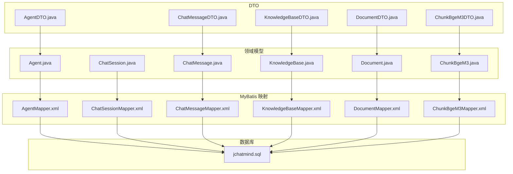
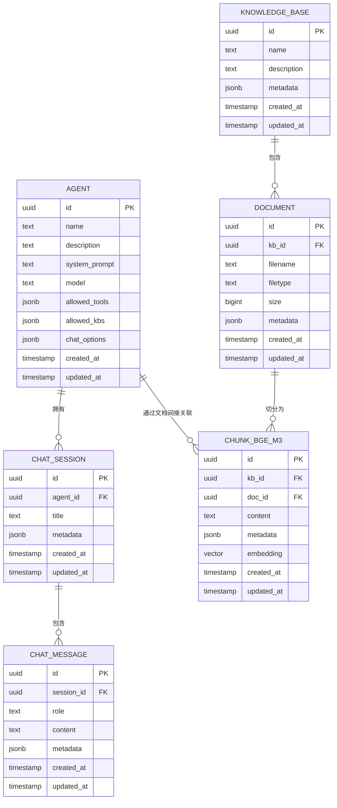
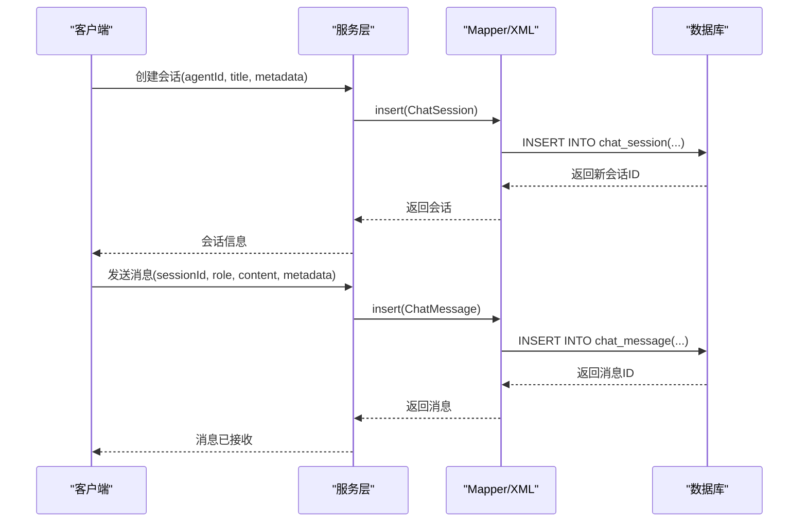
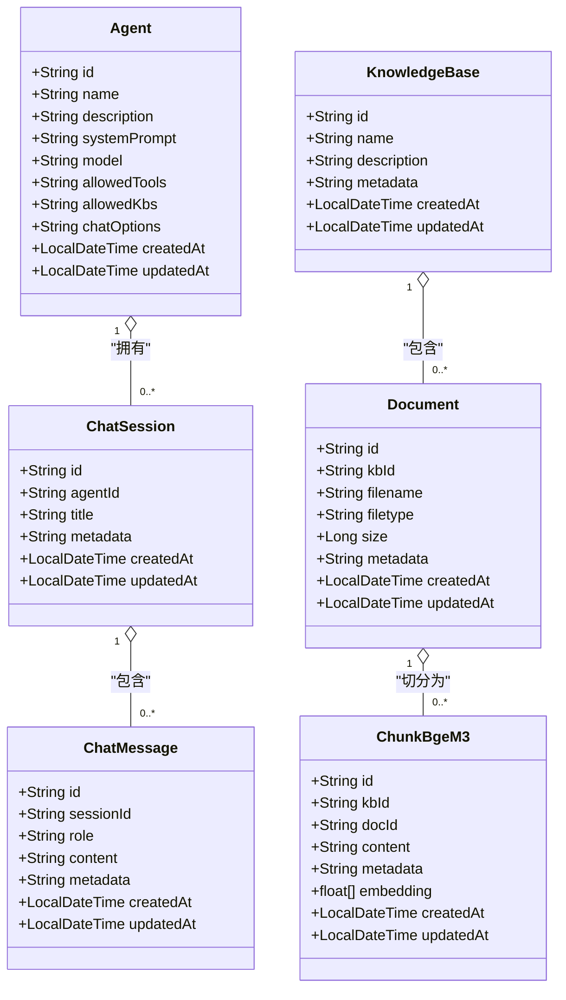

# 实体模型设计

<cite>
**本文引用的文件**
- [Agent.java](file://jchatmind/src/main/java/com/kama/jchatmind/model/entity/Agent.java)
- [ChatSession.java](file://jchatmind/src/main/java/com/kama/jchatmind/model/entity/ChatSession.java)
- [ChatMessage.java](file://jchatmind/src/main/java/com/kama/jchatmind/model/entity/ChatMessage.java)
- [KnowledgeBase.java](file://jchatmind/src/main/java/com/kama/jchatmind/model/entity/KnowledgeBase.java)
- [Document.java](file://jchatmind/src/main/java/com/kama/jchatmind/model/entity/Document.java)
- [ChunkBgeM3.java](file://jchatmind/src/main/java/com/kama/jchatmind/model/entity/ChunkBgeM3.java)
- [AgentMapper.xml](file://jchatmind/src/main/resources/mapper/AgentMapper.xml)
- [ChatSessionMapper.xml](file://jchatmind/src/main/resources/mapper/ChatSessionMapper.xml)
- [ChatMessageMapper.xml](file://jchatmind/src/main/resources/mapper/ChatMessageMapper.xml)
- [KnowledgeBaseMapper.xml](file://jchatmind/src/main/resources/mapper/KnowledgeBaseMapper.xml)
- [DocumentMapper.xml](file://jchatmind/src/main/resources/mapper/DocumentMapper.xml)
- [ChunkBgeM3Mapper.xml](file://jchatmind/src/main/resources/mapper/ChunkBgeM3Mapper.xml)
- [jchatmind.sql](file://sql/jchatmind.sql)
- [AgentDTO.java](file://jchatmind/src/main/java/com/kama/jchatmind/model/dto/AgentDTO.java)
- [ChatMessageDTO.java](file://jchatmind/src/main/java/com/kama/jchatmind/model/dto/ChatMessageDTO.java)
- [KnowledgeBaseDTO.java](file://jchatmind/src/main/java/com/kama/jchatmind/model/dto/KnowledgeBaseDTO.java)
- [DocumentDTO.java](file://jchatmind/src/main/java/com/kama/jchatmind/model/dto/DocumentDTO.java)
- [ChunkBgeM3DTO.java](file://jchatmind/src/main/java/com/kama/jchatmind/model/dto/ChunkBgeM3DTO.java)
</cite>

## 目录
1. [简介](#简介)
2. [项目结构](#项目结构)
3. [核心组件](#核心组件)
4. [架构总览](#架构总览)
5. [详细组件分析](#详细组件分析)
6. [依赖分析](#依赖分析)
7. [性能考虑](#性能考虑)
8. [故障排查指南](#故障排查指南)
9. [结论](#结论)
10. [附录](#附录)

## 简介
本文件系统化梳理 JChatMind 的六大核心实体模型：Agent、ChatSession、ChatMessage、KnowledgeBase、Document、ChunkBgeM3。围绕每个实体的字段定义、数据类型、约束与业务含义进行深入解析；明确实体间的一对一、一对多、多对多关系及外键约束策略；给出实体关系图（ERD）、主键/外键设计原则与数据完整性保障机制；并总结字段命名规范、数据验证规则与业务逻辑约束。

## 项目结构
六大实体均采用“领域模型 + MyBatis 映射 + DTO”的分层设计：
- 领域模型（Entity）：位于 model/entity 包，承载业务实体与默认相等性/哈希/字符串化实现。
- 数据访问映射（Mapper XML）：位于 resources/mapper，定义 SQL、JSONB 类型转换、向量类型转换与索引查询。
- 数据传输对象（DTO）：位于 model/dto，用于 API 层的数据封装与枚举校验。
- 数据库脚本：位于 sql/jchatmind.sql，定义表结构、主外键约束、扩展与索引。

图表来源
- [Agent.java:1-95](file://jchatmind/src/main/java/com/kama/jchatmind/model/entity/Agent.java#L1-L95)
- [ChatSession.java:1-73](file://jchatmind/src/main/java/com/kama/jchatmind/model/entity/ChatSession.java#L1-L73)
- [ChatMessage.java:1-78](file://jchatmind/src/main/java/com/kama/jchatmind/model/entity/ChatMessage.java#L1-L78)
- [KnowledgeBase.java:1-72](file://jchatmind/src/main/java/com/kama/jchatmind/model/entity/KnowledgeBase.java#L1-L72)
- [Document.java:1-83](file://jchatmind/src/main/java/com/kama/jchatmind/model/entity/Document.java#L1-L83)
- [ChunkBgeM3.java:1-83](file://jchatmind/src/main/java/com/kama/jchatmind/model/entity/ChunkBgeM3.java#L1-L83)
- [AgentMapper.xml:1-119](file://jchatmind/src/main/resources/mapper/AgentMapper.xml#L1-L119)
- [ChatSessionMapper.xml:1-99](file://jchatmind/src/main/resources/mapper/ChatSessionMapper.xml#L1-L99)
- [ChatMessageMapper.xml:1-110](file://jchatmind/src/main/resources/mapper/ChatMessageMapper.xml#L1-L110)
- [KnowledgeBaseMapper.xml:1-101](file://jchatmind/src/main/resources/mapper/KnowledgeBaseMapper.xml#L1-L101)
- [DocumentMapper.xml:1-118](file://jchatmind/src/main/resources/mapper/DocumentMapper.xml#L1-L118)
- [ChunkBgeM3Mapper.xml:1-102](file://jchatmind/src/main/resources/mapper/ChunkBgeM3Mapper.xml#L1-L102)
- [jchatmind.sql:1-88](file://sql/jchatmind.sql#L1-L88)

章节来源
- [Agent.java:1-95](file://jchatmind/src/main/java/com/kama/jchatmind/model/entity/Agent.java#L1-L95)
- [ChatSession.java:1-73](file://jchatmind/src/main/java/com/kama/jchatmind/model/entity/ChatSession.java#L1-L73)
- [ChatMessage.java:1-78](file://jchatmind/src/main/java/com/kama/jchatmind/model/entity/ChatMessage.java#L1-L78)
- [KnowledgeBase.java:1-72](file://jchatmind/src/main/java/com/kama/jchatmind/model/entity/KnowledgeBase.java#L1-L72)
- [Document.java:1-83](file://jchatmind/src/main/java/com/kama/jchatmind/model/entity/Document.java#L1-L83)
- [ChunkBgeM3.java:1-83](file://jchatmind/src/main/java/com/kama/jchatmind/model/entity/ChunkBgeM3.java#L1-L83)
- [AgentMapper.xml:1-119](file://jchatmind/src/main/resources/mapper/AgentMapper.xml#L1-L119)
- [ChatSessionMapper.xml:1-99](file://jchatmind/src/main/resources/mapper/ChatSessionMapper.xml#L1-L99)
- [ChatMessageMapper.xml:1-110](file://jchatmind/src/main/resources/mapper/ChatMessageMapper.xml#L1-L110)
- [KnowledgeBaseMapper.xml:1-101](file://jchatmind/src/main/resources/mapper/KnowledgeBaseMapper.xml#L1-L101)
- [DocumentMapper.xml:1-118](file://jchatmind/src/main/resources/mapper/DocumentMapper.xml#L1-L118)
- [ChunkBgeM3Mapper.xml:1-102](file://jchatmind/src/main/resources/mapper/ChunkBgeM3Mapper.xml#L1-L102)
- [jchatmind.sql:1-88](file://sql/jchatmind.sql#L1-L88)

## 核心组件
本节从“字段定义、数据类型、约束、业务含义”四个维度，逐个剖析六大实体，并结合 Mapper XML 与数据库脚本确认持久化细节。

- Agent（智能体）
  - 字段与类型：id(UUID, 主键), name(TEXT, 非空), description(TEXT), systemPrompt(TEXT), model(TEXT), allowedTools(JSONB), allowedKbs(JSONB), chatOptions(JSONB), createdAt/Timestamp, updatedAt/Timestamp
  - 约束与策略：UUID 主键；JSONB 存储允许工具、允许知识库、聊天选项；默认时间戳
  - 业务含义：描述可被调用的智能体，包含系统提示、默认模型、可用工具与知识库白名单、聊天参数等
  - 映射要点：插入/更新时将字符串转为 JSONB；查询时以文本形式返回 JSONB
  - 章节来源
    - [Agent.java:14-35](file://jchatmind/src/main/java/com/kama/jchatmind/model/entity/Agent.java#L14-L35)
    - [AgentMapper.xml:7-18](file://jchatmind/src/main/resources/mapper/AgentMapper.xml#L7-L18)
    - [jchatmind.sql:3-16](file://sql/jchatmind.sql#L3-L16)

- ChatSession（会话）
  - 字段与类型：id(UUID, 主键), agentId(UUID, 外键), title(TEXT), metadata(JSONB), createdAt/Timestamp, updatedAt/Timestamp
  - 约束与策略：agent_id 引用 agent(id)，删除策略为 SET NULL；JSONB 扩展元数据
  - 业务含义：一次 Agent 下的对话会话，记录标题与扩展信息
  - 映射要点：按 agentId 查询会话列表；插入/更新时 JSONB 转换；查询按更新时间倒序
  - 章节来源
    - [ChatSession.java:14-25](file://jchatmind/src/main/java/com/kama/jchatmind/model/entity/ChatSession.java#L14-L25)
    - [ChatSessionMapper.xml:7-14](file://jchatmind/src/main/resources/mapper/ChatSessionMapper.xml#L7-L14)
    - [jchatmind.sql:18-28](file://sql/jchatmind.sql#L18-L28)

- ChatMessage（消息）
  - 字段与类型：id(UUID, 主键), sessionId(UUID, 外键, 非空), role(TEXT, 非空), content(TEXT), metadata(JSONB), createdAt/Timestamp, updatedAt/Timestamp
  - 约束与策略：session_id 引用 chat_session(id)，删除策略 CASCADE；JSONB 元数据
  - 业务含义：单条对话消息，支持 user/assistant/system/tool 角色
  - 映射要点：按会话 ID 查询消息列表；支持最近 N 条查询；JSONB 转换
  - 章节来源
    - [ChatMessage.java:14-27](file://jchatmind/src/main/java/com/kama/jchatmind/model/entity/ChatMessage.java#L14-L27)
    - [ChatMessageMapper.xml:7-15](file://jchatmind/src/main/resources/mapper/ChatMessageMapper.xml#L7-L15)
    - [jchatmind.sql:30-41](file://sql/jchatmind.sql#L30-L41)

- KnowledgeBase（知识库）
  - 字段与类型：id(UUID, 主键), name(TEXT, 非空), description(TEXT), metadata(JSONB), createdAt/Timestamp, updatedAt/Timestamp
  - 约束与策略：UUID 主键；JSONB 元数据
  - 业务含义：知识库容器，可挂载多个文档并生成向量切片
  - 映射要点：按 ID 批量查询；JSONB 转换
  - 章节来源
    - [KnowledgeBase.java:14-24](file://jchatmind/src/main/java/com/kama/jchatmind/model/entity/KnowledgeBase.java#L14-L24)
    - [KnowledgeBaseMapper.xml:7-14](file://jchatmind/src/main/resources/mapper/KnowledgeBaseMapper.xml#L7-L14)
    - [jchatmind.sql:43-52](file://sql/jchatmind.sql#L43-L52)

- Document（文档）
  - 字段与类型：id(UUID, 主键), kbId(UUID, 外键, 非空), filename(TEXT, 非空), filetype(TEXT), size(BIGINT), metadata(JSONB), createdAt/Timestamp, updatedAt/Timestamp
  - 约束与策略：kb_id 引用 knowledge_base(id)，删除策略 CASCADE；JSONB 元数据
  - 业务含义：知识库下的具体文档，记录文件名、类型、大小等
  - 映射要点：按 kbId 查询文档列表；JSONB 转换
  - 章节来源
    - [Document.java:14-29](file://jchatmind/src/main/java/com/kama/jchatmind/model/entity/Document.java#L14-L29)
    - [DocumentMapper.xml:7-16](file://jchatmind/src/main/resources/mapper/DocumentMapper.xml#L7-L16)
    - [jchatmind.sql:54-66](file://sql/jchatmind.sql#L54-L66)

- ChunkBgeM3（向量切片）
  - 字段与类型：id(UUID, 主键), kbId(UUID, 外键, 非空), docId(UUID, 外键, 非空), content(TEXT, 非空), metadata(JSONB), embedding(VECTOR(1024)), createdAt/Timestamp, updatedAt/Timestamp
  - 约束与策略：kb_id 引用 knowledge_base(id)，doc_id 引用 document(id)，删除策略 CASCADE；向量列使用 PostgreSQL 向量扩展；创建 IVFFLAT 索引
  - 业务含义：文档切片后的文本块及其 1024 维向量表示，支持相似度检索
  - 映射要点：相似度搜索使用向量距离操作符；插入/更新时将数组转换为向量类型
  - 章节来源
    - [ChunkBgeM3.java:15-29](file://jchatmind/src/main/java/com/kama/jchatmind/model/entity/ChunkBgeM3.java#L15-L29)
    - [ChunkBgeM3Mapper.xml:7-16](file://jchatmind/src/main/resources/mapper/ChunkBgeM3Mapper.xml#L7-L16)
    - [jchatmind.sql:68-81](file://sql/jchatmind.sql#L68-L81)

## 架构总览
下图展示六大实体之间的关系、主外键约束与典型查询路径：

图表来源
- [jchatmind.sql:3-81](file://sql/jchatmind.sql#L3-L81)

章节来源
- [jchatmind.sql:1-88](file://sql/jchatmind.sql#L1-L88)

## 详细组件分析

### Agent 实体
- 字段与类型
  - id: UUID, 主键
  - name/description/systemPrompt/model: 文本
  - allowedTools/allowedKbs/chatOptions: JSONB，存储允许工具列表、允许访问的知识库、聊天参数
  - createdAt/updatedAt: 时间戳，默认当前时间
- 约束与策略
  - 主键唯一；JSONB 字段在插入/更新时显式转换；查询时以文本形式返回
- 业务含义
  - 定义智能体能力边界与默认行为，包括系统提示、模型选择、工具与知识库白名单、对话参数
- 映射与查询
  - 支持按 ID/全表查询；支持批量更新字段；默认时间戳自动维护
- 章节来源
  - [Agent.java:14-35](file://jchatmind/src/main/java/com/kama/jchatmind/model/entity/Agent.java#L14-L35)
  - [AgentMapper.xml:7-18](file://jchatmind/src/main/resources/mapper/AgentMapper.xml#L7-L18)
  - [jchatmind.sql:3-16](file://sql/jchatmind.sql#L3-L16)

### ChatSession 实体
- 字段与类型
  - id: UUID, 主键
  - agentId: UUID，外键引用 Agent.id，删除策略 SET NULL
  - title: 文本，自动生成标题
  - metadata: JSONB，扩展信息（如语言、设备）
  - createdAt/updatedAt: 时间戳
- 约束与策略
  - 外键约束；按更新时间倒序查询
- 业务含义
  - 表示一次智能体对话会话，承载会话级元数据
- 章节来源
  - [ChatSession.java:14-25](file://jchatmind/src/main/java/com/kama/jchatmind/model/entity/ChatSession.java#L14-L25)
  - [ChatSessionMapper.xml:7-14](file://jchatmind/src/main/resources/mapper/ChatSessionMapper.xml#L7-L14)
  - [jchatmind.sql:18-28](file://sql/jchatmind.sql#L18-L28)

### ChatMessage 实体
- 字段与类型
  - id: UUID, 主键
  - sessionId: UUID，外键引用 ChatSession.id，删除策略 CASCADE
  - role: 文本，枚举值 user/assistant/system/tool
  - content: 文本
  - metadata: JSONB，工具调用、RAG 片段等
  - createdAt/updatedAt: 时间戳
- 约束与策略
  - 外键约束；支持按会话 ID 查询与最近 N 条查询；JSONB 转换
- 业务含义
  - 记录对话中的每一条消息，支持多角色与工具交互
- 章节来源
  - [ChatMessage.java:14-27](file://jchatmind/src/main/java/com/kama/jchatmind/model/entity/ChatMessage.java#L14-L27)
  - [ChatMessageMapper.xml:7-15](file://jchatmind/src/main/resources/mapper/ChatMessageMapper.xml#L7-L15)
  - [jchatmind.sql:30-41](file://sql/jchatmind.sql#L30-L41)

### KnowledgeBase 实体
- 字段与类型
  - id: UUID, 主键
  - name/description: 文本
  - metadata: JSONB，业务属性（如行业/标签）
  - createdAt/updatedAt: 时间戳
- 约束与策略
  - 主键唯一；支持批量按 ID 查询
- 业务含义
  - 知识库容器，承载文档与向量切片
- 章节来源
  - [KnowledgeBase.java:14-24](file://jchatmind/src/main/java/com/kama/jchatmind/model/entity/KnowledgeBase.java#L14-L24)
  - [KnowledgeBaseMapper.xml:7-14](file://jchatmind/src/main/resources/mapper/KnowledgeBaseMapper.xml#L7-L14)
  - [jchatmind.sql:43-52](file://sql/jchatmind.sql#L43-L52)

### Document 实体
- 字段与类型
  - id: UUID, 主键
  - kbId: UUID，外键引用 KnowledgeBase.id，删除策略 CASCADE
  - filename/filetype: 文本
  - size: BIGINT
  - metadata: JSONB，页数、上传方式等
  - createdAt/updatedAt: 时间戳
- 约束与策略
  - 外键约束；按 kbId 查询
- 业务含义
  - 知识库下的具体文档，记录基础元信息
- 章节来源
  - [Document.java:14-29](file://jchatmind/src/main/java/com/kama/jchatmind/model/entity/Document.java#L14-L29)
  - [DocumentMapper.xml:7-16](file://jchatmind/src/main/resources/mapper/DocumentMapper.xml#L7-L16)
  - [jchatmind.sql:54-66](file://sql/jchatmind.sql#L54-L66)

### ChunkBgeM3 实体
- 字段与类型
  - id: UUID, 主键
  - kbId: UUID，外键引用 KnowledgeBase.id，删除策略 CASCADE
  - docId: UUID，外键引用 Document.id，删除策略 CASCADE
  - content: TEXT，切片文本
  - metadata: JSONB
  - embedding: VECTOR(1024)，bge_m3 向量
  - createdAt/updatedAt: 时间戳
- 约束与策略
  - 双外键约束；向量列使用 PostgreSQL 向量扩展；创建 IVFFLAT 索引
- 业务含义
  - 文档切片的向量化表示，支持相似度检索
- 章节来源
  - [ChunkBgeM3.java:15-29](file://jchatmind/src/main/java/com/kama/jchatmind/model/entity/ChunkBgeM3.java#L15-L29)
  - [ChunkBgeM3Mapper.xml:7-16](file://jchatmind/src/main/resources/mapper/ChunkBgeM3Mapper.xml#L7-L16)
  - [jchatmind.sql:68-81](file://sql/jchatmind.sql#L68-L81)

### 关系与外键策略
- 一对一/一对多
  - Agent → ChatSession：一对多（一个智能体可有多个会话）
  - KnowledgeBase → Document：一对多（一个知识库可有多个文档）
  - Document → ChunkBgeM3：一对多（一个文档可切分为多个切片）
  - ChatSession → ChatMessage：一对多（一个会话包含多条消息）
- 外键与删除策略
  - agent_id → agent(id)：SET NULL（断开绑定但保留会话）
  - session_id → chat_session(id)：CASCADE（删除会话时删除其消息）
  - kb_id → knowledge_base(id)：CASCADE（删除知识库时删除其文档与切片）
  - doc_id → document(id)：CASCADE（删除文档时删除其切片）

图表来源
- [ChatSessionMapper.xml:21-39](file://jchatmind/src/main/resources/mapper/ChatSessionMapper.xml#L21-L39)
- [ChatMessageMapper.xml:23-43](file://jchatmind/src/main/resources/mapper/ChatMessageMapper.xml#L23-L43)
- [jchatmind.sql:18-41](file://sql/jchatmind.sql#L18-L41)

章节来源
- [ChatSessionMapper.xml:1-99](file://jchatmind/src/main/resources/mapper/ChatSessionMapper.xml#L1-L99)
- [ChatMessageMapper.xml:1-110](file://jchatmind/src/main/resources/mapper/ChatMessageMapper.xml#L1-L110)
- [jchatmind.sql:1-88](file://sql/jchatmind.sql#L1-L88)

### 数据完整性与一致性
- 主键约束：所有实体均使用 UUID 主键，确保全局唯一性
- 外键约束：严格约束父子关系，避免悬挂引用
- 删除策略：根据业务语义选择 SET NULL/CASCADE，保证数据一致性
- JSONB 与向量类型：通过显式类型转换与索引提升查询效率与准确性
- 时间戳：统一使用默认当前时间，便于审计与排序

章节来源
- [jchatmind.sql:1-88](file://sql/jchatmind.sql#L1-L88)
- [AgentMapper.xml:43-47](file://jchatmind/src/main/resources/mapper/AgentMapper.xml#L43-L47)
- [ChunkBgeM3Mapper.xml:38-40](file://jchatmind/src/main/resources/mapper/ChunkBgeM3Mapper.xml#L38-L40)

## 依赖分析
- 领域模型到映射器
  - 每个实体的 Java 类与对应 Mapper XML 一一对应，字段映射通过 resultMaps 与 SQL 参数绑定完成
- 映射器到数据库
  - 所有写操作均通过 XML 中的 INSERT/UPDATE 语句执行；读操作通过 SELECT 语句与 JSONB/向量类型转换
- DTO 到实体
  - DTO 作为 API 层数据载体，内部可能包含枚举与复杂对象，最终由服务层转换为实体进行持久化

图表来源
- [Agent.java:1-95](file://jchatmind/src/main/java/com/kama/jchatmind/model/entity/Agent.java#L1-L95)
- [ChatSession.java:1-73](file://jchatmind/src/main/java/com/kama/jchatmind/model/entity/ChatSession.java#L1-L73)
- [ChatMessage.java:1-78](file://jchatmind/src/main/java/com/kama/jchatmind/model/entity/ChatMessage.java#L1-L78)
- [KnowledgeBase.java:1-72](file://jchatmind/src/main/java/com/kama/jchatmind/model/entity/KnowledgeBase.java#L1-L72)
- [Document.java:1-83](file://jchatmind/src/main/java/com/kama/jchatmind/model/entity/Document.java#L1-L83)
- [ChunkBgeM3.java:1-83](file://jchatmind/src/main/java/com/kama/jchatmind/model/entity/ChunkBgeM3.java#L1-L83)

章节来源
- [Agent.java:1-95](file://jchatmind/src/main/java/com/kama/jchatmind/model/entity/Agent.java#L1-L95)
- [ChatSession.java:1-73](file://jchatmind/src/main/java/com/kama/jchatmind/model/entity/ChatSession.java#L1-L73)
- [ChatMessage.java:1-78](file://jchatmind/src/main/java/com/kama/jchatmind/model/entity/ChatMessage.java#L1-L78)
- [KnowledgeBase.java:1-72](file://jchatmind/src/main/java/com/kama/jchatmind/model/entity/KnowledgeBase.java#L1-L72)
- [Document.java:1-83](file://jchatmind/src/main/java/com/kama/jchatmind/model/entity/Document.java#L1-L83)
- [ChunkBgeM3.java:1-83](file://jchatmind/src/main/java/com/kama/jchatmind/model/entity/ChunkBgeM3.java#L1-L83)

## 性能考虑
- 向量索引
  - 使用 IVFFLAT 索引（lists=100）加速向量相似度检索，适合中等规模向量库的近似最近邻搜索
- JSONB 查询
  - 对 JSONB 字段的过滤建议配合 GIN/BTree 索引或应用侧预处理，避免全表扫描
- 分页与限制
  - 消息查询支持限制数量，避免一次性返回过多数据
- 写入批量化
  - 文档入库后批量切片与向量化，减少多次往返

章节来源
- [jchatmind.sql:83-87](file://sql/jchatmind.sql#L83-L87)
- [ChatMessageMapper.xml:72-84](file://jchatmind/src/main/resources/mapper/ChatMessageMapper.xml#L72-L84)

## 故障排查指南
- JSONB 类型转换异常
  - 现象：插入/更新时 JSON 字符串无法转换为 JSONB
  - 排查：确认传入字符串为合法 JSON；检查 Mapper 中 CAST(jsonb) 是否正确
  - 章节来源
    - [AgentMapper.xml:43-47](file://jchatmind/src/main/resources/mapper/AgentMapper.xml#L43-L47)
    - [KnowledgeBaseMapper.xml:35-38](file://jchatmind/src/main/resources/mapper/KnowledgeBaseMapper.xml#L35-L38)

- 向量类型转换失败
  - 现象：embedding 字段无法转换为 VECTOR 类型
  - 排查：确认 PostgreSQL 已启用 vector 扩展；确保 embedding 数组长度为 1024
  - 章节来源
    - [jchatmind.sql](file://sql/jchatmind.sql#L1)
    - [ChunkBgeM3Mapper.xml:38-40](file://jchatmind/src/main/resources/mapper/ChunkBgeM3Mapper.xml#L38-L40)

- 外键约束错误
  - 现象：插入会话/消息/文档/切片时报外键不存在
  - 排查：确认父实体 ID 存在且类型为 UUID；检查删除策略是否导致引用失效
  - 章节来源
    - [jchatmind.sql:18-81](file://sql/jchatmind.sql#L18-L81)

- 删除级联影响过大
  - 现象：删除知识库导致大量文档与切片被删除
  - 排查：确认业务需求是否允许 CASCADE；必要时改为 SET NULL 或手动迁移
  - 章节来源
    - [jchatmind.sql:21-72](file://sql/jchatmind.sql#L21-L72)

## 结论
JChatMind 的实体模型以清晰的主外键关系与合理的删除策略为基础，结合 JSONB 与向量扩展，满足智能体、会话、消息、知识库、文档与向量切片的全链路需求。通过统一的 UUID 主键、显式的类型转换与索引策略，既保证了数据完整性，也兼顾了查询性能与可维护性。

## 附录

### 字段命名规范
- 表名与字段名：采用 snake_case 命名，如 agent、chat_session、knowledge_base、document、chunk_bge_m3
- 主键：统一使用 id（UUID）
- 外键：采用 {entity}_id 形式，如 agent_id、session_id、kb_id、doc_id
- JSONB 字段：以 _jsonb 结尾的命名在代码中体现为 JSON 字符串，映射时转换为 JSONB

章节来源
- [jchatmind.sql:3-81](file://sql/jchatmind.sql#L3-L81)

### 数据验证规则与业务约束
- 非空约束：name、filename、content（切片内容）等关键字段在数据库层面设置非空
- 角色枚举：消息角色限定为 user/assistant/system/tool
- 模型枚举：智能体模型类型通过 DTO 枚举校验
- 向量维度：embedding 固定 1024 维
- 时间戳：默认当前时间，支持审计与排序

章节来源
- [jchatmind.sql:6-12](file://sql/jchatmind.sql#L6-L12)
- [ChatMessageDTO.java:40-57](file://jchatmind/src/main/java/com/kama/jchatmind/model/dto/ChatMessageDTO.java#L40-L57)
- [AgentDTO.java:37-52](file://jchatmind/src/main/java/com/kama/jchatmind/model/dto/AgentDTO.java#L37-L52)
- [ChunkBgeM3Mapper.xml:38-40](file://jchatmind/src/main/resources/mapper/ChunkBgeM3Mapper.xml#L38-L40)