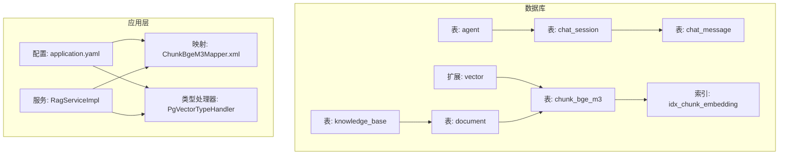
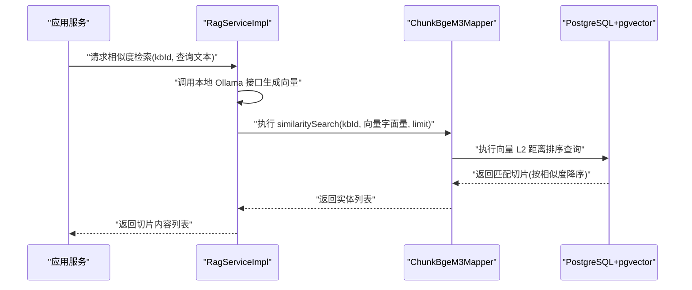
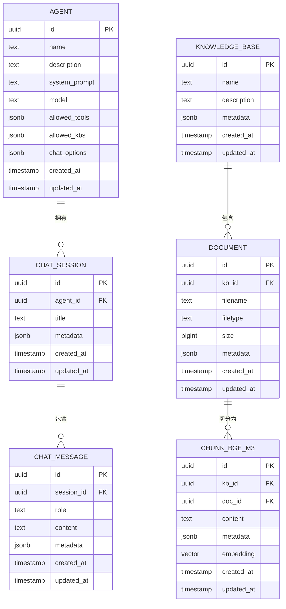
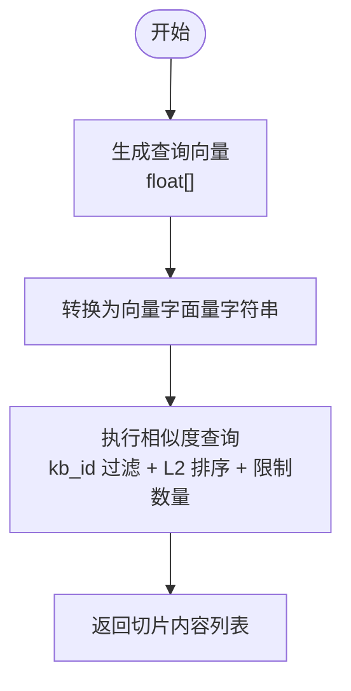
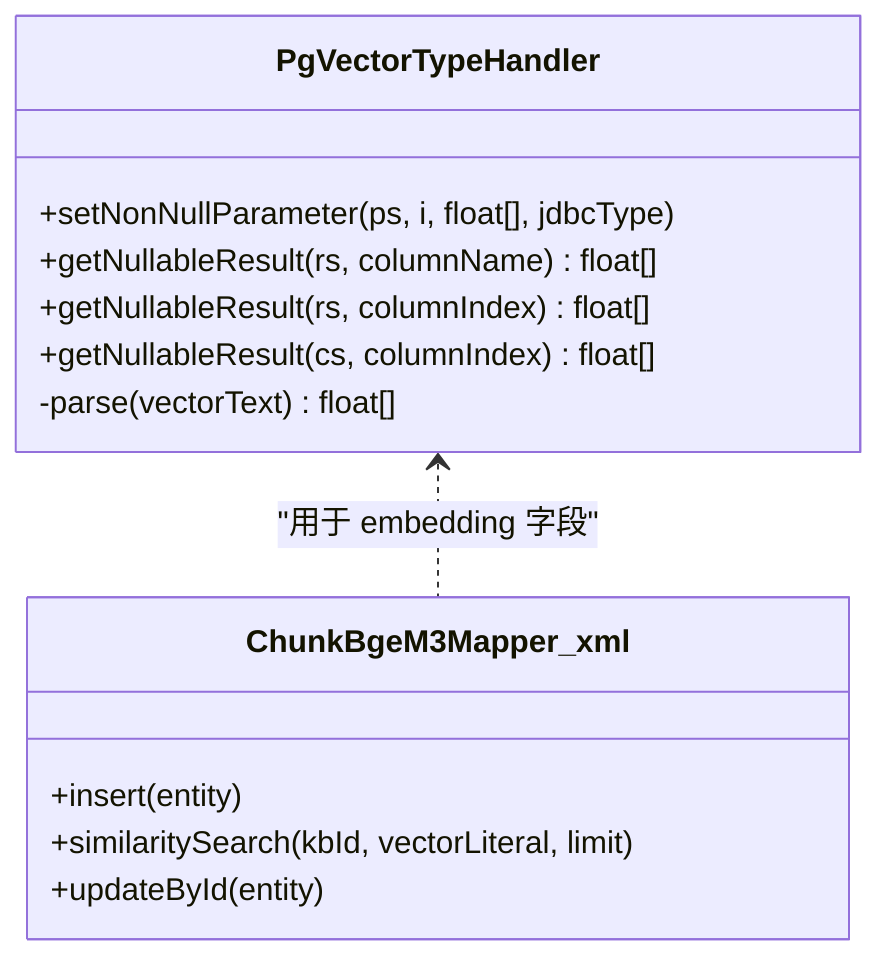
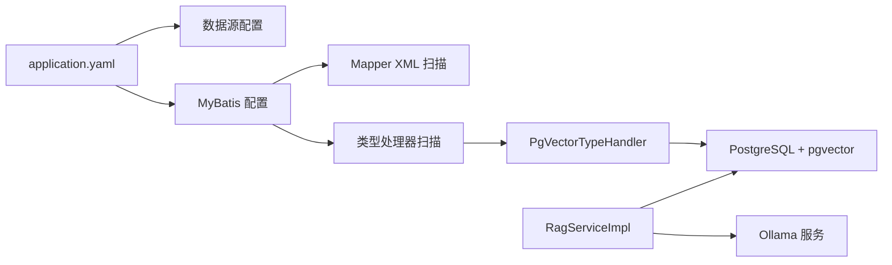

# 数据库设计

<cite>
**本文引用的文件**
- [jchatmind.sql](file://sql/jchatmind.sql)
- [application.yaml](file://jchatmind/src/main/resources/application.yaml)
- [PgVectorTypeHandler.java](file://jchatmind/src/main/java/com/kama/jchatmind/typehandler/PgVectorTypeHandler.java)
- [ChunkBgeM3Mapper.xml](file://jchatmind/src/main/resources/mapper/ChunkBgeM3Mapper.xml)
- [RagServiceImpl.java](file://jchatmind/src/main/java/com/kama/jchatmind/service/impl/RagServiceImpl.java)
- [Agent.java](file://jchatmind/src/main/java/com/kama/jchatmind/model/entity/Agent.java)
- [ChatSession.java](file://jchatmind/src/main/java/com/kama/jchatmind/model/entity/ChatSession.java)
- [ChatMessage.java](file://jchatmind/src/main/java/com/kama/jchatmind/model/entity/ChatMessage.java)
- [KnowledgeBase.java](file://jchatmind/src/main/java/com/kama/jchatmind/model/entity/KnowledgeBase.java)
- [Document.java](file://jchatmind/src/main/java/com/kama/jchatmind/model/entity/Document.java)
- [ChunkBgeM3.java](file://jchatmind/src/main/java/com/kama/jchatmind/model/entity/ChunkBgeM3.java)
</cite>

## 目录
1. [简介](#简介)
2. [项目结构](#项目结构)
3. [核心组件](#核心组件)
4. [架构总览](#架构总览)
5. [详细组件分析](#详细组件分析)
6. [依赖分析](#依赖分析)
7. [性能考虑](#性能考虑)
8. [故障排查指南](#故障排查指南)
9. [结论](#结论)
10. [附录](#附录)

## 简介
本文件系统化梳理 JChatMind 的数据库设计方案，聚焦 PostgreSQL + pgvector 向量数据库的架构与表结构。重点覆盖以下方面：
- 核心实体关系：Agent、ChatSession、ChatMessage、KnowledgeBase、Document、ChunkBgeM3
- 字段定义、约束与索引策略
- 向量嵌入存储机制、相似度检索算法与性能优化
- 数据库迁移、备份恢复与监控建议
- 数据模型图、ER 关系图与查询优化建议

## 项目结构
数据库相关的核心文件分布如下：
- SQL 初始化脚本：定义扩展、表结构、索引
- MyBatis 映射：向量字段映射、相似度检索 SQL
- 类型处理器：float[] 与 pgvector 的双向转换
- 应用配置：数据源、MyBatis 映射与类型处理器扫描路径
- 实体类：对应各表的 Java 模型

**图表来源**
- [jchatmind.sql:1-88](file://sql/jchatmind.sql#L1-L88)
- [application.yaml:1-43](file://jchatmind/src/main/resources/application.yaml#L1-L43)
- [ChunkBgeM3Mapper.xml:1-102](file://jchatmind/src/main/resources/mapper/ChunkBgeM3Mapper.xml#L1-L102)
- [PgVectorTypeHandler.java:1-54](file://jchatmind/src/main/java/com/kama/jchatmind/typehandler/PgVectorTypeHandler.java#L1-L54)
- [RagServiceImpl.java:1-67](file://jchatmind/src/main/java/com/kama/jchatmind/service/impl/RagServiceImpl.java#L1-L67)

**章节来源**
- [jchatmind.sql:1-88](file://sql/jchatmind.sql#L1-L88)
- [application.yaml:1-43](file://jchatmind/src/main/resources/application.yaml#L1-L43)

## 核心组件
本节对六大核心实体进行字段、约束与索引的系统性说明，并给出 MyBatis 映射与类型处理要点。

- 表：agent
  - 字段与类型：主键 id、名称 name、描述 description、系统提示 system_prompt、默认模型 model、允许工具 allowed_tools(JSONB)、允许知识库 allowed_kbs(JSONB)、聊天选项 chat_options(JSONB)、时间 created_at/updated_at
  - 约束：主键；JSONB 存储结构化配置
  - 用途：定义智能体配置与权限

- 表：chat_session
  - 字段与类型：主键 id、外键 agent_id 引用 agent(id)、标题 title、元数据 metadata(JSONB)、时间 created_at/updated_at
  - 约束：主键；外键级联置空（agent 删除时 session.agent_id 置空）
  - 用途：会话上下文与元信息

- 表：chat_message
  - 字段与类型：主键 id、外键 session_id 引用 chat_session(id)、角色 role、内容 content、元数据 metadata(JSONB)、时间 created_at/updated_at
  - 约束：主键；外键级联删除（session 删除时消息一并删除）
  - 用途：对话历史记录

- 表：knowledge_base
  - 字段与类型：主键 id、名称 name、描述 description、元数据 metadata(JSONB)、时间 created_at/updated_at
  - 约束：主键
  - 用途：知识库维度的业务分组

- 表：document
  - 字段与类型：主键 id、外键 kb_id 引用 knowledge_base(id)、文件名 filename、类型 filetype、大小 size、元数据 metadata(JSONB)、时间 created_at/updated_at
  - 约束：主键；外键级联删除
  - 用途：文档级元信息与解析参数

- 表：chunk_bge_m3
  - 字段与类型：主键 id、外键 kb_id 引用 knowledge_base(id)、外键 doc_id 引用 document(id)、切片内容 content、元数据 metadata(JSONB)、向量 embedding(VECTOR(1024))、时间 created_at/updated_at
  - 约束：主键；外键级联删除；向量非空
  - 索引：基于 ivfflat 的 L2 距离索引，lists=100
  - 用途：RAG 文档切片与向量检索

**章节来源**
- [jchatmind.sql:3-16](file://sql/jchatmind.sql#L3-L16)
- [jchatmind.sql:18-28](file://sql/jchatmind.sql#L18-L28)
- [jchatmind.sql:30-41](file://sql/jchatmind.sql#L30-L41)
- [jchatmind.sql:43-52](file://sql/jchatmind.sql#L43-L52)
- [jchatmind.sql:54-66](file://sql/jchatmind.sql#L54-L66)
- [jchatmind.sql:68-81](file://sql/jchatmind.sql#L68-L81)
- [jchatmind.sql:83-87](file://sql/jchatmind.sql#L83-L87)

## 架构总览
下图展示数据库层与应用层的交互：应用通过 MyBatis 访问表，使用类型处理器完成 float[] 与 pgvector 的互转；RAG 服务负责向量化与相似度检索。

**图表来源**
- [RagServiceImpl.java:50-55](file://jchatmind/src/main/java/com/kama/jchatmind/service/impl/RagServiceImpl.java#L50-L55)
- [ChunkBgeM3Mapper.xml:85-100](file://jchatmind/src/main/resources/mapper/ChunkBgeM3Mapper.xml#L85-L100)
- [PgVectorTypeHandler.java:12-53](file://jchatmind/src/main/java/com/kama/jchatmind/typehandler/PgVectorTypeHandler.java#L12-L53)

## 详细组件分析

### 数据模型与 ER 关系

**图表来源**
- [jchatmind.sql:3-16](file://sql/jchatmind.sql#L3-L16)
- [jchatmind.sql:18-28](file://sql/jchatmind.sql#L18-L28)
- [jchatmind.sql:30-41](file://sql/jchatmind.sql#L30-L41)
- [jchatmind.sql:43-52](file://sql/jchatmind.sql#L43-L52)
- [jchatmind.sql:54-66](file://sql/jchatmind.sql#L54-L66)
- [jchatmind.sql:68-81](file://sql/jchatmind.sql#L68-L81)

### 向量嵌入与相似度检索
- 向量模型：bge-m3，维度 1024
- 存储格式：pgvector 向量类型
- 相似度算法：L2 距离（pgvector <-> 操作符）
- 索引策略：ivfflat，lists=100，适用于中等规模向量库的快速近似检索
- 应用侧流程：
  - 使用本地 Ollama 服务生成查询向量
  - 将 float[] 转换为字符串字面量 "[v1,v2,...]"
  - 在 ChunkBgeM3Mapper 中按 kb_id 过滤并按 L2 距离排序取前 N

**图表来源**
- [RagServiceImpl.java:50-55](file://jchatmind/src/main/java/com/kama/jchatmind/service/impl/RagServiceImpl.java#L50-L55)
- [ChunkBgeM3Mapper.xml:85-100](file://jchatmind/src/main/resources/mapper/ChunkBgeM3Mapper.xml#L85-L100)

**章节来源**
- [jchatmind.sql:77-77](file://sql/jchatmind.sql#L77-L77)
- [jchatmind.sql:84-87](file://sql/jchatmind.sql#L84-L87)
- [RagServiceImpl.java:50-65](file://jchatmind/src/main/java/com/kama/jchatmind/service/impl/RagServiceImpl.java#L50-L65)
- [ChunkBgeM3Mapper.xml:85-100](file://jchatmind/src/main/resources/mapper/ChunkBgeM3Mapper.xml#L85-L100)

### 类型映射与序列化
- MyBatis 类型处理器：将 Java float[] 与 PostgreSQL OTHER/VECTOR 互转
- 处理器行为：
  - 写入：将 float[] 序列化为 "[v1,v2,...]" 字符串写入
  - 读取：从字符串解析为 float[] 数组
- 映射文件：
  - 结果映射 embedding 字段使用 jdbcType=OTHER
  - 插入/更新时将 Java 对象转换为 ::vector 类型

**图表来源**
- [PgVectorTypeHandler.java:12-53](file://jchatmind/src/main/java/com/kama/jchatmind/typehandler/PgVectorTypeHandler.java#L12-L53)
- [ChunkBgeM3Mapper.xml:13-40](file://jchatmind/src/main/resources/mapper/ChunkBgeM3Mapper.xml#L13-L40)

**章节来源**
- [PgVectorTypeHandler.java:12-53](file://jchatmind/src/main/java/com/kama/jchatmind/typehandler/PgVectorTypeHandler.java#L12-L53)
- [ChunkBgeM3Mapper.xml:13-40](file://jchatmind/src/main/resources/mapper/ChunkBgeM3Mapper.xml#L13-L40)

### 实体类与字段一致性
- 实体类字段与表结构一一对应，JSONB 字段以字符串形式在实体中保存
- 时间戳字段统一使用 LocalDateTime
- 向量字段在实体中以 float[] 表示，经类型处理器映射到 pgvector

**章节来源**
- [Agent.java:14-35](file://jchatmind/src/main/java/com/kama/jchatmind/model/entity/Agent.java#L14-L35)
- [ChatSession.java:14-25](file://jchatmind/src/main/java/com/kama/jchatmind/model/entity/ChatSession.java#L14-L25)
- [ChatMessage.java:14-27](file://jchatmind/src/main/java/com/kama/jchatmind/model/entity/ChatMessage.java#L14-L27)
- [KnowledgeBase.java:14-24](file://jchatmind/src/main/java/com/kama/jchatmind/model/entity/KnowledgeBase.java#L14-L24)
- [Document.java:14-29](file://jchatmind/src/main/java/com/kama/jchatmind/model/entity/Document.java#L14-L29)
- [ChunkBgeM3.java:15-29](file://jchatmind/src/main/java/com/kama/jchatmind/model/entity/ChunkBgeM3.java#L15-L29)

## 依赖分析
- 应用配置依赖：
  - 数据源：PostgreSQL JDBC
  - MyBatis：扫描实体包、Mapper XML、类型处理器包
- 运行时依赖：
  - pgvector 扩展：提供 VECTOR 类型与 <-> L2 距离操作符
  - Ollama 服务：提供 bge-m3 向量生成接口

**图表来源**
- [application.yaml:1-43](file://jchatmind/src/main/resources/application.yaml#L1-L43)
- [PgVectorTypeHandler.java:12-53](file://jchatmind/src/main/java/com/kama/jchatmind/typehandler/PgVectorTypeHandler.java#L12-L53)
- [RagServiceImpl.java:21-24](file://jchatmind/src/main/java/com/kama/jchatmind/service/impl/RagServiceImpl.java#L21-L24)

**章节来源**
- [application.yaml:1-43](file://jchatmind/src/main/resources/application.yaml#L1-L43)
- [RagServiceImpl.java:21-24](file://jchatmind/src/main/java/com/kama/jchatmind/service/impl/RagServiceImpl.java#L21-L24)

## 性能考虑
- 向量索引
  - 当前使用 ivfflat，lists=100；可根据数据规模调整 lists 参数
  - 建议定期重建索引以维持检索精度
- 查询过滤
  - 优先按 kb_id 过滤，减少向量计算范围
  - 控制返回条数 limit，避免全表扫描
- 写入路径
  - 向量入库时确保 float[] 与模型维度一致（1024）
  - 批量插入可结合 MyBatis 批处理能力
- 硬件与部署
  - 向量检索对内存敏感，建议为数据库分配充足内存
  - SSD 存储有助于提升随机 IO 场景下的检索性能

[本节为通用性能建议，不直接分析具体文件]

## 故障排查指南
- 向量无法写入或读取
  - 检查 pgvector 扩展是否启用
  - 确认类型处理器已注册且生效
  - 核对 float[] 维度与模型一致
- 相似度检索结果异常
  - 确认查询向量字面量格式正确（"[v1,v2,..]"）
  - 检查 kb_id 过滤条件是否正确
  - 验证索引是否存在且未损坏
- 数据库连接问题
  - 检查 application.yaml 中的数据源配置
  - 确认数据库服务运行状态与网络连通性

**章节来源**
- [jchatmind.sql:1-1](file://sql/jchatmind.sql#L1-L1)
- [application.yaml:5-8](file://jchatmind/src/main/resources/application.yaml#L5-L8)
- [PgVectorTypeHandler.java:12-53](file://jchatmind/src/main/java/com/kama/jchatmind/typehandler/PgVectorTypeHandler.java#L12-L53)
- [ChunkBgeM3Mapper.xml:85-100](file://jchatmind/src/main/resources/mapper/ChunkBgeM3Mapper.xml#L85-L100)

## 结论
本设计以 PostgreSQL + pgvector 为核心，围绕 RAG 场景构建了清晰的实体关系与向量检索链路。通过 ivfflat 索引与 kb_id 过滤，可在中等规模场景下实现高效相似度检索。配合 MyBatis 类型处理器与应用侧向量化服务，整体架构具备良好的可维护性与扩展性。

[本节为总结性内容，不直接分析具体文件]

## 附录

### 数据库迁移策略
- 新增/变更表结构
  - 使用版本化的 SQL 脚本，先创建扩展，再建表与索引
  - 变更时保留兼容列，逐步迁移数据
- 向量索引重建
  - 数据量变化较大时，重新评估 lists 参数并重建索引
- 元数据演进
  - JSONB 字段变更需在应用层兼容旧格式

[本节为通用迁移建议，不直接分析具体文件]

### 备份与恢复
- 完整备份
  - 使用逻辑备份导出 schema 与数据，包含扩展与索引
- 恢复验证
  - 恢复后验证 pgvector 扩展、索引与关键查询路径可用性
- 灾备演练
  - 定期进行恢复演练，验证备份完整性与时效性

[本节为通用运维建议，不直接分析具体文件]

### 监控指标
- 数据库层
  - 连接数、慢查询、索引命中率、向量查询耗时
- 应用层
  - 向量生成耗时、相似度检索耗时、错误率
- 告警阈值
  - 相似度查询 P95 超过阈值触发告警
  - 索引重建失败或数据量异常波动

[本节为通用监控建议，不直接分析具体文件]