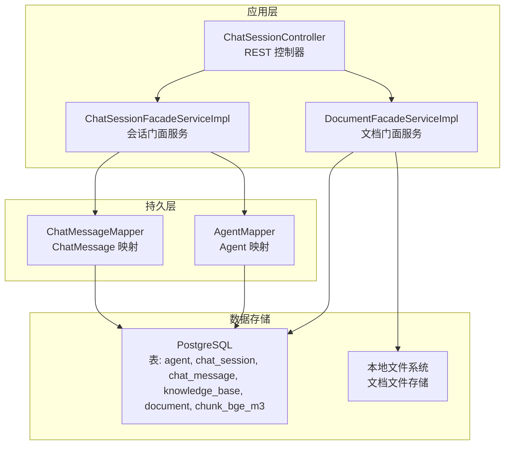
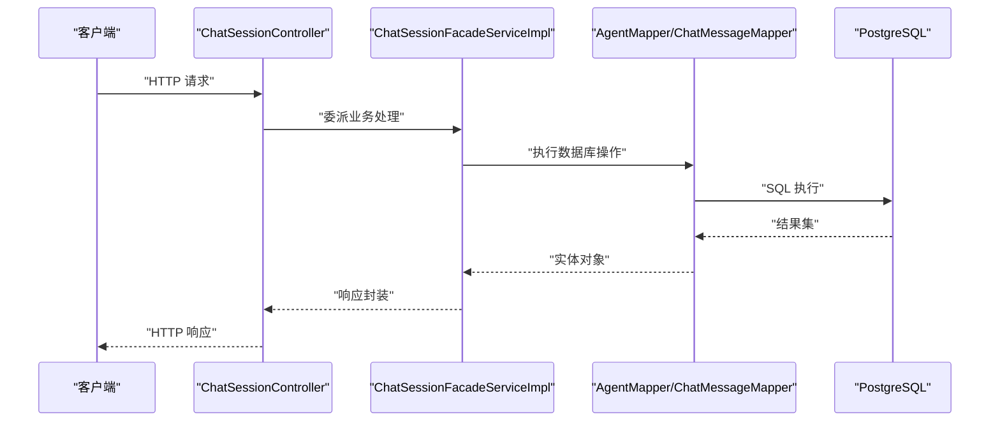
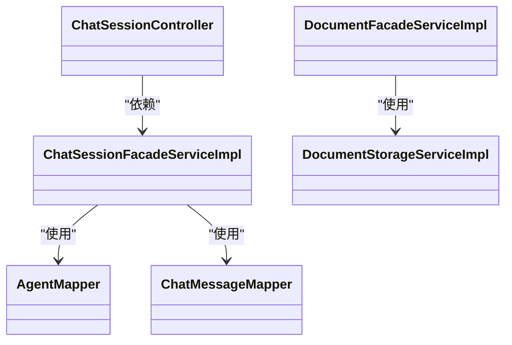
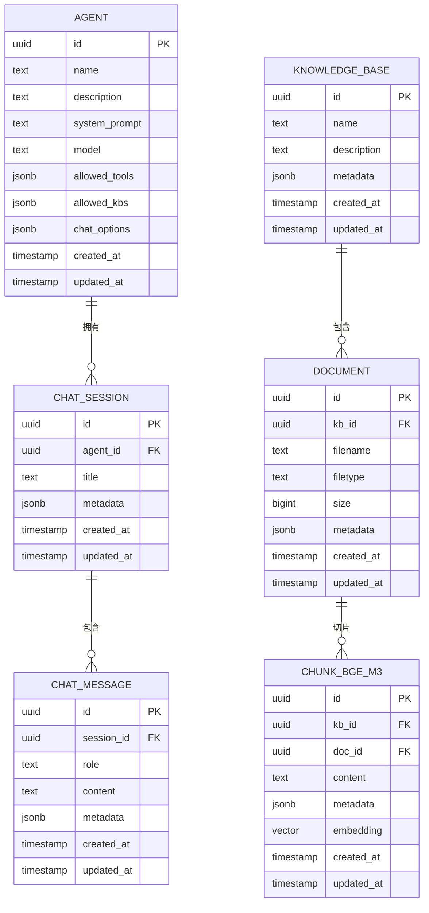
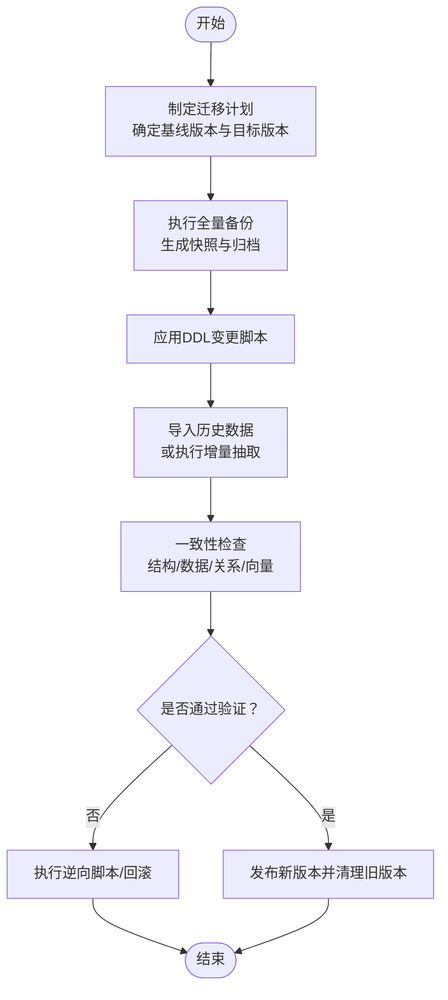
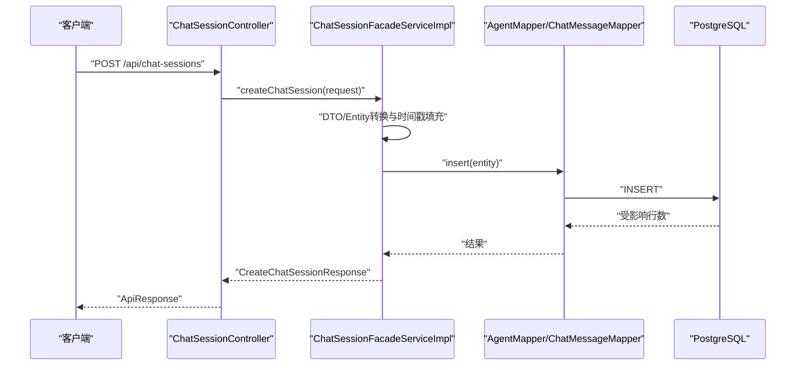

# 数据迁移与备份

<cite>
**本文引用的文件**
- [application.yaml](file://jchatmind/src/main/resources/application.yaml)
- [jchatmind.sql](file://sql/jchatmind.sql)
- [README.md](file://README.md)
- [Agent.java](file://jchatmind/src/main/java/com/kama/jchatmind/model/entity/Agent.java)
- [ChatSession.java](file://jchatmind/src/main/java/com/kama/jchatmind/model/entity/ChatSession.java)
- [ChatMessage.java](file://jchatmind/src/main/java/com/kama/jchatmind/model/entity/ChatMessage.java)
- [KnowledgeBase.java](file://jchatmind/src/main/java/com/kama/jchatmind/model/entity/KnowledgeBase.java)
- [Document.java](file://jchatmind/src/main/java/com/kama/jchatmind/model/entity/Document.java)
- [AgentMapper.java](file://jchatmind/src/main/java/com/kama/jchatmind/mapper/AgentMapper.java)
- [ChatMessageMapper.java](file://jchatmind/src/main/java/com/kama/jchatmind/mapper/ChatMessageMapper.java)
- [DocumentStorageServiceImpl.java](file://jchatmind/src/main/java/com/kama/jchatmind/service/impl/DocumentStorageServiceImpl.java)
- [ChatSessionFacadeServiceImpl.java](file://jchatmind/src/main/java/com/kama/jchatmind/service/impl/ChatSessionFacadeServiceImpl.java)
- [ChatSessionController.java](file://jchatmind/src/main/java/com/kama/jchatmind/controller/ChatSessionController.java)
- [DocumentFacadeServiceImpl.java](file://jchatmind/src/main/java/com/kama/jchatmind/service/impl/DocumentFacadeServiceImpl.java)
</cite>

## 目录
1. [简介](#简介)
2. [项目结构](#项目结构)
3. [核心组件](#核心组件)
4. [架构总览](#架构总览)
5. [详细组件分析](#详细组件分析)
6. [依赖分析](#依赖分析)
7. [性能考量](#性能考量)
8. [故障排查指南](#故障排查指南)
9. [结论](#结论)
10. [附录](#附录)

## 简介
本指南面向JChatMind系统的数据迁移与备份场景，围绕数据库版本升级策略、表结构变更管理、数据迁移流程展开；同时覆盖增量迁移、全量备份与恢复演练、数据一致性检查、迁移风险评估与回滚机制设计；并提供生产环境备份策略、灾难恢复计划与高可用架构配置建议，以及数据导出导入、跨版本兼容性与迁移工具使用指南，最后给出备份监控、告警机制与维护自动化的最佳实践。

## 项目结构
JChatMind后端采用Spring Boot + MyBatis，数据库为PostgreSQL并启用pgvector扩展用于向量检索。前端为React+TS+Vite。数据持久化涉及以下核心实体与映射：
- 实体：Agent、ChatSession、ChatMessage、KnowledgeBase、Document
- 映射：各Mapper接口
- 存储：PostgreSQL表结构定义位于SQL脚本；文档文件存储在本地路径（由配置项控制）

图表来源
- [ChatSessionController.java:1-58](file://jchatmind/src/main/java/com/kama/jchatmind/controller/ChatSessionController.java#L1-L58)
- [ChatSessionFacadeServiceImpl.java:1-156](file://jchatmind/src/main/java/com/kama/jchatmind/service/impl/ChatSessionFacadeServiceImpl.java#L1-L156)
- [DocumentFacadeServiceImpl.java:1-312](file://jchatmind/src/main/java/com/kama/jchatmind/service/impl/DocumentFacadeServiceImpl.java#L1-L312)
- [AgentMapper.java:1-26](file://jchatmind/src/main/java/com/kama/jchatmind/mapper/AgentMapper.java#L1-L26)
- [ChatMessageMapper.java:1-28](file://jchatmind/src/main/java/com/kama/jchatmind/mapper/ChatMessageMapper.java#L1-L28)
- [application.yaml:1-43](file://jchatmind/src/main/resources/application.yaml#L1-L43)
- [jchatmind.sql:1-88](file://sql/jchatmind.sql#L1-L88)

章节来源
- [application.yaml:1-43](file://jchatmind/src/main/resources/application.yaml#L1-L43)
- [jchatmind.sql:1-88](file://sql/jchatmind.sql#L1-L88)
- [README.md:1-71](file://README.md#L1-L71)

## 核心组件
- 数据库连接与MyBatis配置：通过application.yaml中的datasource与mybatis配置项，指定PostgreSQL连接、类型别名包、Mapper XML位置与类型处理器包。
- 表结构定义：jchatmind.sql定义了agent、chat_session、chat_message、knowledge_base、document、chunk_bge_m3等表及向量索引。
- 实体模型：Agent、ChatSession、ChatMessage、KnowledgeBase、Document等实体类承载字段与时间戳。
- 映射接口：AgentMapper、ChatMessageMapper等提供基础CRUD方法。
- 门面服务：ChatSessionFacadeServiceImpl负责会话查询、创建、更新、删除；DocumentFacadeServiceImpl负责文档查询、创建、上传、删除、Markdown解析与向量化切片。
- 文件存储：DocumentStorageServiceImpl负责文档文件的保存、删除与存在性校验，存储路径由配置项控制。

章节来源
- [application.yaml:1-43](file://jchatmind/src/main/resources/application.yaml#L1-L43)
- [jchatmind.sql:1-88](file://sql/jchatmind.sql#L1-L88)
- [Agent.java:1-95](file://jchatmind/src/main/java/com/kama/jchatmind/model/entity/Agent.java#L1-L95)
- [ChatSession.java:1-73](file://jchatmind/src/main/java/com/kama/jchatmind/model/entity/ChatSession.java#L1-L73)
- [ChatMessage.java:1-78](file://jchatmind/src/main/java/com/kama/jchatmind/model/entity/ChatMessage.java#L1-L78)
- [KnowledgeBase.java:1-72](file://jchatmind/src/main/java/com/kama/jchatmind/model/entity/KnowledgeBase.java#L1-L72)
- [Document.java:1-83](file://jchatmind/src/main/java/com/kama/jchatmind/model/entity/Document.java#L1-L83)
- [AgentMapper.java:1-26](file://jchatmind/src/main/java/com/kama/jchatmind/mapper/AgentMapper.java#L1-L26)
- [ChatMessageMapper.java:1-28](file://jchatmind/src/main/java/com/kama/jchatmind/mapper/ChatMessageMapper.java#L1-L28)
- [DocumentStorageServiceImpl.java:1-90](file://jchatmind/src/main/java/com/kama/jchatmind/service/impl/DocumentStorageServiceImpl.java#L1-L90)
- [ChatSessionFacadeServiceImpl.java:1-156](file://jchatmind/src/main/java/com/kama/jchatmind/service/impl/ChatSessionFacadeServiceImpl.java#L1-L156)
- [DocumentFacadeServiceImpl.java:1-312](file://jchatmind/src/main/java/com/kama/jchatmind/service/impl/DocumentFacadeServiceImpl.java#L1-L312)

## 架构总览
下图展示JChatMind的数据流与组件交互，突出数据库与文件存储的关系，以及门面服务如何协调Mapper与存储服务。

图表来源
- [ChatSessionController.java:1-58](file://jchatmind/src/main/java/com/kama/jchatmind/controller/ChatSessionController.java#L1-L58)
- [ChatSessionFacadeServiceImpl.java:1-156](file://jchatmind/src/main/java/com/kama/jchatmind/service/impl/ChatSessionFacadeServiceImpl.java#L1-L156)
- [AgentMapper.java:1-26](file://jchatmind/src/main/java/com/kama/jchatmind/mapper/AgentMapper.java#L1-L26)
- [ChatMessageMapper.java:1-28](file://jchatmind/src/main/java/com/kama/jchatmind/mapper/ChatMessageMapper.java#L1-L28)

## 详细组件分析

### 数据库版本升级策略
- 迁移基线：以jchatmind.sql为当前基线版本，后续变更通过受控的DDL脚本演进。
- 版本命名：建议采用“YYYYMMDD_版本号”命名规则，按日期顺序叠加，确保幂等与可追踪。
- 变更隔离：将新增列、索引、函数、触发器等拆分为独立脚本，先执行DDL，再执行数据修正或回填脚本。
- 回滚清单：为每个DDL脚本配套逆向脚本（DROP/ALTER/REVERT），确保回滚可执行且可验证。

### 表结构变更管理
- 变更审批：所有DDL变更需经评审，明确影响范围与回滚方案。
- 字段变更：新增JSONB字段（如allowed_tools、metadata）需考虑默认值与历史数据兼容。
- 约束变更：外键ON DELETE行为需谨慎评估（如chat_message的CASCADE），避免级联删除引发的数据丢失。
- 索引变更：向量索引（IVFFLAT）需在重建前评估停机窗口与重建耗时。

章节来源
- [jchatmind.sql:1-88](file://sql/jchatmind.sql#L1-L88)

### 数据迁移流程
- 全量迁移
  - 步骤：导出目标库schema与数据 → 应用DDL变更 → 导入历史数据 → 校验完整性 → 启动服务
  - 工具：pg_dump/pg_restore或第三方迁移工具
  - 注意：迁移期间阻断写入或采用只读快照
- 增量迁移
  - 方案：基于时间戳或序列号的增量抽取，结合批量写入与事务提交
  - 风险：并发写入导致的数据重复或遗漏，需去重与幂等处理
- 回滚机制
  - 快照回滚：使用数据库快照或物理复制回滚
  - 逆向脚本：执行配套逆向DDL/DML，恢复到变更前状态

### 数据一致性检查
- 结构一致性：比对表结构、索引、约束差异
- 数据一致性：抽样比对主键集合、关键字段聚合统计
- 关系一致性：校验外键引用完整性（如chat_message.session_id）
- 向量一致性：抽样校验embedding维度与索引命中率

### 生产环境备份策略
- 全量备份：每周一次，保留N周
- 增量备份：每日一次，保留7天
- 归档策略：压缩加密后异地归档
- 存储位置：本地+云存储备份，避免单点故障

### 灾难恢复计划
- RTO/RPO目标：明确恢复时间与数据丢失容忍度
- 恢复演练：每季度进行一次端到端演练，验证备份可用性与恢复流程
- 故障场景：数据库崩溃、磁盘损坏、误删数据、网络分区

### 高可用架构配置
- 主从复制：配置主从同步，实现读写分离与故障切换
- 负载均衡：前置LB，多实例部署
- 存储高可用：共享存储或分布式文件系统

### 数据导出导入与跨版本兼容
- 导出：使用pg_dump导出schema与数据，或仅导出数据（不含DDL）
- 导入：先导入schema（含DDL），再导入数据；或直接导入数据（需保证表结构一致）
- 跨版本兼容：保持字段向后兼容，新增字段提供默认值；JSONB字段用于扩展非结构化元数据

### 迁移工具使用指南
- DBeaver/DataGrip：图形化对比与同步
- Liquibase/ Flyway：声明式迁移管理（需适配SQL风格）
- 自研脚本：基于SQL模板与参数化，支持Dry-run与回滚

## 依赖分析
- 控制器依赖门面服务，门面服务依赖Mapper与存储服务，Mapper依赖数据库。
- 文档上传流程涉及文件系统与数据库双写，需保证事务一致性或最终一致性。

图表来源
- [ChatSessionController.java:1-58](file://jchatmind/src/main/java/com/kama/jchatmind/controller/ChatSessionController.java#L1-L58)
- [ChatSessionFacadeServiceImpl.java:1-156](file://jchatmind/src/main/java/com/kama/jchatmind/service/impl/ChatSessionFacadeServiceImpl.java#L1-L156)
- [DocumentFacadeServiceImpl.java:1-312](file://jchatmind/src/main/java/com/kama/jchatmind/service/impl/DocumentFacadeServiceImpl.java#L1-L312)
- [AgentMapper.java:1-26](file://jchatmind/src/main/java/com/kama/jchatmind/mapper/AgentMapper.java#L1-L26)
- [ChatMessageMapper.java:1-28](file://jchatmind/src/main/java/com/kama/jchatmind/mapper/ChatMessageMapper.java#L1-L28)
- [DocumentStorageServiceImpl.java:1-90](file://jchatmind/src/main/java/com/kama/jchatmind/service/impl/DocumentStorageServiceImpl.java#L1-L90)

## 性能考量
- 向量索引：IVFFLAT索引需合理设置lists参数，平衡查询延迟与索引内存占用
- 写入性能：批量插入、事务合并、索引在大事务期间禁用可提升吞吐
- 读取性能：针对高频查询建立合适索引，避免全表扫描
- 文件IO：文档存储路径与磁盘I/O性能相关，建议SSD与合理的目录层级

## 故障排查指南
- 连接问题：核对application.yaml中的数据库URL、用户名、密码是否正确
- 权限问题：确认数据库用户具备DDL与DML权限
- 文件存储：检查document.storage.base-path配置与目录权限
- 上传失败：查看DocumentFacadeServiceImpl的日志与异常分支
- 删除失败：确认文件是否存在、路径是否正确

章节来源
- [application.yaml:1-43](file://jchatmind/src/main/resources/application.yaml#L1-L43)
- [DocumentStorageServiceImpl.java:1-90](file://jchatmind/src/main/java/com/kama/jchatmind/service/impl/DocumentStorageServiceImpl.java#L1-L90)
- [DocumentFacadeServiceImpl.java:1-312](file://jchatmind/src/main/java/com/kama/jchatmind/service/impl/DocumentFacadeServiceImpl.java#L1-L312)

## 结论
JChatMind的数据迁移与备份应遵循“有计划、可审计、可回滚、可演练”的原则。通过规范的DDL变更管理、严格的全量/增量备份策略、完善的恢复演练与监控告警体系，可有效降低迁移风险，保障生产数据安全与业务连续性。

## 附录

### 数据模型与关系

图表来源
- [jchatmind.sql:1-88](file://sql/jchatmind.sql#L1-L88)

### 迁移流程（全量/增量）与一致性检查流程

### API调用链（示例：创建会话）

图表来源
- [ChatSessionController.java:1-58](file://jchatmind/src/main/java/com/kama/jchatmind/controller/ChatSessionController.java#L1-L58)
- [ChatSessionFacadeServiceImpl.java:1-156](file://jchatmind/src/main/java/com/kama/jchatmind/service/impl/ChatSessionFacadeServiceImpl.java#L1-L156)
- [AgentMapper.java:1-26](file://jchatmind/src/main/java/com/kama/jchatmind/mapper/AgentMapper.java#L1-L26)
- [ChatMessageMapper.java:1-28](file://jchatmind/src/main/java/com/kama/jchatmind/mapper/ChatMessageMapper.java#L1-L28)