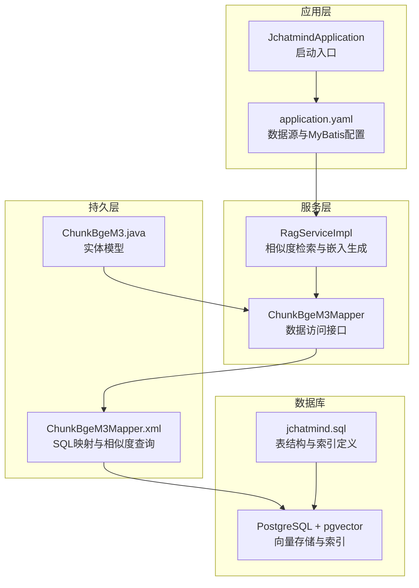
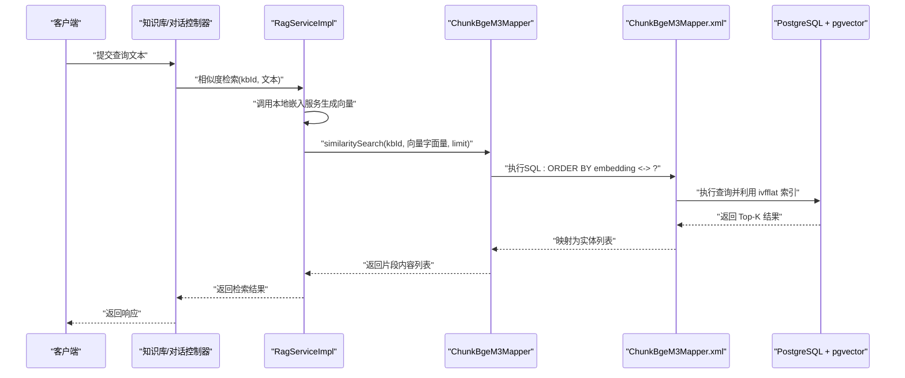
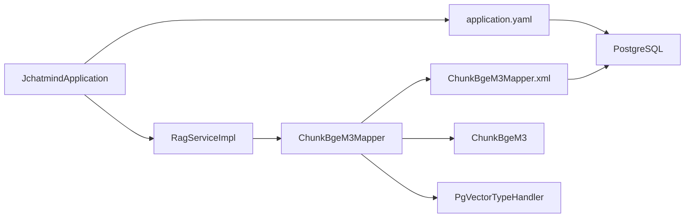
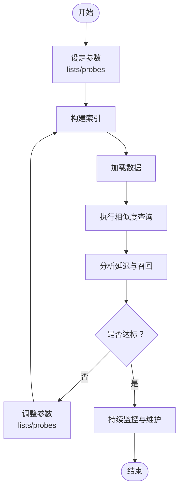

# 索引优化策略

<cite>
**本文引用的文件**
- [JchatmindApplication.java](file://jchatmind/src/main/java/com/kama/jchatmind/JchatmindApplication.java)
- [application.yaml](file://jchatmind/src/main/resources/application.yaml)
- [PgVectorTypeHandler.java](file://jchatmind/src/main/java/com/kama/jchatmind/typehandler/PgVectorTypeHandler.java)
- [ChunkBgeM3Mapper.java](file://jchatmind/src/main/java/com/kama/jchatmind/mapper/ChunkBgeM3Mapper.java)
- [ChunkBgeM3Mapper.xml](file://jchatmind/src/main/resources/mapper/ChunkBgeM3Mapper.xml)
- [ChunkBgeM3.java](file://jchatmind/src/main/java/com/kama/jchatmind/model/entity/ChunkBgeM3.java)
- [RagServiceImpl.java](file://jchatmind/src/main/java/com/kama/jchatmind/service/impl/RagServiceImpl.java)
- [RagService.java](file://jchatmind/src/main/java/com/kama/jchatmind/service/RagService.java)
- [jchatmind.sql](file://sql/jchatmind.sql)
- [pom.xml](file://jchatmind/pom.xml)
</cite>

## 目录
1. [简介](#简介)
2. [项目结构](#项目结构)
3. [核心组件](#核心组件)
4. [架构总览](#架构总览)
5. [详细组件分析](#详细组件分析)
6. [依赖分析](#依赖分析)
7. [性能考量](#性能考量)
8. [故障排查指南](#故障排查指南)
9. [结论](#结论)
10. [附录](#附录)

## 简介
本技术文档围绕 JChatMind 的数据库索引优化策略展开，重点聚焦于向量相似度检索所采用的 ivfflat 索引配置与性能优化。项目使用 PostgreSQL 的 pgvector 扩展存储 1024 维向量，并通过 MyBatis 进行数据访问。当前索引配置为 ivfflat，lists 参数设置为 100；本文将从索引参数解读、查询计划优化、复合索引设计、查询场景策略、维护成本与存储开销平衡、监控指标与基准测试、预加载与缓存、大规模数据处理以及索引重建与维护自动化等方面进行系统化梳理与实践建议。

## 项目结构
JChatMind 后端基于 Spring Boot，MyBatis 负责数据持久化，PostgreSQL 提供向量存储与索引能力。核心数据表 chunk_bge_m3 存储分片文本及其向量嵌入，应用通过 Mapper 与 Service 层完成相似度检索与嵌入生成。

**图表来源**
- [JchatmindApplication.java:1-14](file://jchatmind/src/main/java/com/kama/jchatmind/JchatmindApplication.java#L1-L14)
- [application.yaml:1-43](file://jchatmind/src/main/resources/application.yaml#L1-L43)
- [RagServiceImpl.java:1-67](file://jchatmind/src/main/java/com/kama/jchatmind/service/impl/RagServiceImpl.java#L1-L67)
- [ChunkBgeM3Mapper.java:1-31](file://jchatmind/src/main/java/com/kama/jchatmind/mapper/ChunkBgeM3Mapper.java#L1-L31)
- [ChunkBgeM3Mapper.xml:1-102](file://jchatmind/src/main/resources/mapper/ChunkBgeM3Mapper.xml#L1-L102)
- [ChunkBgeM3.java:1-83](file://jchatmind/src/main/java/com/kama/jchatmind/model/entity/ChunkBgeM3.java#L1-L83)
- [jchatmind.sql:1-88](file://sql/jchatmind.sql#L1-L88)

**章节来源**
- [JchatmindApplication.java:1-14](file://jchatmind/src/main/java/com/kama/jchatmind/JchatmindApplication.java#L1-L14)
- [application.yaml:1-43](file://jchatmind/src/main/resources/application.yaml#L1-L43)
- [jchatmind.sql:1-88](file://sql/jchatmind.sql#L1-L88)

## 核心组件
- 数据库与索引
  - 表 chunk_bge_m3：包含 kb_id、doc_id、content、metadata、embedding（VECTOR(1024)）、时间戳字段。
  - 索引 idx_chunk_embedding：使用 ivfflat，向量运算符为 vector_l2_ops，lists=100。
- MyBatis 映射与实体
  - Mapper 接口定义 similaritySearch 方法，XML 中实现基于 embedding <-> 的距离排序与 LIMIT 控制。
  - 实体类包含 embedding 字段，类型为 float[]，用于承载向量数据。
- 类型处理器
  - PgVectorTypeHandler：负责 float[] 与 PostgreSQL OTHER/VECTOR 类型之间的转换。
- 服务层
  - RagServiceImpl：封装本地嵌入服务调用，将查询文本转为向量后执行相似度检索。
  - RagService：对外暴露 embed 与 similaritySearch 两个核心方法。

**章节来源**
- [jchatmind.sql:68-87](file://sql/jchatmind.sql#L68-L87)
- [ChunkBgeM3Mapper.java:1-31](file://jchatmind/src/main/java/com/kama/jchatmind/mapper/ChunkBgeM3Mapper.java#L1-L31)
- [ChunkBgeM3Mapper.xml:85-100](file://jchatmind/src/main/resources/mapper/ChunkBgeM3Mapper.xml#L85-L100)
- [ChunkBgeM3.java:1-83](file://jchatmind/src/main/java/com/kama/jchatmind/model/entity/ChunkBgeM3.java#L1-L83)
- [PgVectorTypeHandler.java:1-54](file://jchatmind/src/main/java/com/kama/jchatmind/typehandler/PgVectorTypeHandler.java#L1-L54)
- [RagServiceImpl.java:1-67](file://jchatmind/src/main/java/com/kama/jchatmind/service/impl/RagServiceImpl.java#L1-L67)
- [RagService.java:1-10](file://jchatmind/src/main/java/com/kama/jchatmind/service/RagService.java#L1-L10)

## 架构总览
下图展示了从查询请求到向量索引检索的关键流程，包括嵌入生成、SQL 执行与索引利用。

**图表来源**
- [RagServiceImpl.java:50-65](file://jchatmind/src/main/java/com/kama/jchatmind/service/impl/RagServiceImpl.java#L50-L65)
- [ChunkBgeM3Mapper.java:25-29](file://jchatmind/src/main/java/com/kama/jchatmind/mapper/ChunkBgeM3Mapper.java#L25-L29)
- [ChunkBgeM3Mapper.xml:85-100](file://jchatmind/src/main/resources/mapper/ChunkBgeM3Mapper.xml#L85-L100)
- [jchatmind.sql:83-87](file://sql/jchatmind.sql#L83-L87)

## 详细组件分析

### ivfflat 索引配置与参数解读
- 索引定义位置：在 jchatmind.sql 中创建 idx_chunk_embedding，使用 USING ivfflat(embedding vector_l2_ops)，WITH (lists = 100)。
- 参数含义与影响：
  - lists：控制倒排表数量，决定探测的聚类中心个数。较大的 lists 提高召回率但增加内存与构建时间；较小的 lists 降低内存占用但可能牺牲召回。
  - 向量运算符 vector_l2_ops：基于 L2 距离的向量比较，适用于大多数嵌入模型的相似度计算。
- 当前配置 lists=100 的权衡：
  - 适合中等规模向量数据的快速检索，兼顾查询延迟与资源消耗。
  - 若数据量增长或对召回敏感，可考虑增大 lists 并配合其他参数（如 probes）进行调优。

**章节来源**
- [jchatmind.sql:83-87](file://sql/jchatmind.sql#L83-L87)

### 查询计划与执行效率
- 查询路径：相似度检索通过 embedding <-> 构造距离表达式，结合 WHERE kb_id 精确过滤与 ORDER BY 排序，最后 LIMIT 限制返回条目。
- 索引利用：由于查询条件包含 kb_id 与向量距离比较，建议评估是否需要复合索引以进一步减少扫描范围。
- LIMIT 控制：当前实现通过 LIMIT 控制返回数量，有助于降低网络与下游处理压力。

**章节来源**
- [ChunkBgeM3Mapper.xml:85-100](file://jchatmind/src/main/resources/mapper/ChunkBgeM3Mapper.xml#L85-L100)
- [RagServiceImpl.java:50-55](file://jchatmind/src/main/java/com/kama/jchatmind/service/impl/RagServiceImpl.java#L50-L55)

### 复合索引设计建议
- 现状：当前仅存在基于 embedding 的 ivfflat 索引。
- 建议：
  - 在 kb_id 上建立二级索引（若尚未存在），以加速按知识库维度的过滤。
  - 若查询常伴随 doc_id 或 metadata 条件，可考虑复合索引组合，例如 (kb_id, embedding) 或 (kb_id, doc_id, embedding)，以减少回表与排序成本。
  - 注意：pgvector 对复合索引的支持有限，优先确保 kb_id 的高效过滤，再依赖 ivfflat 进行向量近似搜索。

**章节来源**
- [jchatmind.sql:68-81](file://sql/jchatmind.sql#L68-L81)
- [ChunkBgeM3Mapper.xml:96-98](file://jchatmind/src/main/resources/mapper/ChunkBgeM3Mapper.xml#L96-L98)

### 查询场景与索引选择策略
- 单知识库检索：WHERE kb_id = ? + 向量相似度，推荐使用现有 ivfflat 索引，必要时配合 kb_id 的二级索引。
- 多知识库聚合：若需跨知识库检索，应避免强制走 ivfflat，优先通过应用层拆分或预分区策略降低单次查询复杂度。
- 精准匹配：对于需要精确匹配 doc_id 的场景，可先用 doc_id 过滤，再做向量检索，减少向量扫描范围。
- 时间窗口：若引入 created_at/updated_at 过滤，需评估是否纳入复合索引或通过应用层分桶策略优化。

**章节来源**
- [ChunkBgeM3Mapper.xml:96-98](file://jchatmind/src/main/resources/mapper/ChunkBgeM3Mapper.xml#L96-L98)
- [ChunkBgeM3.java:14-29](file://jchatmind/src/main/java/com/kama/jchatmind/model/entity/ChunkBgeM3.java#L14-L29)

### 索引维护成本与存储开销平衡
- 存储开销：向量维度为 1024，每条记录约 4KB（float*1024）。索引本身会带来额外存储与内存占用，lists 增大将显著增加内存与磁盘开销。
- 维护成本：插入/更新向量时，索引需要维护；批量导入建议使用批量写入与事务合并，减少频繁重建。
- 成本控制策略：
  - 分区策略：按 kb_id 或时间维度进行表分区，缩小每次检索的数据范围。
  - 渐进式重建：在低峰期对索引进行重载或重建，避免线上抖动。
  - 参数调优：根据召回与延迟目标动态调整 lists 与 probes，平衡质量与性能。

**章节来源**
- [jchatmind.sql:77-87](file://sql/jchatmind.sql#L77-L87)
- [RagServiceImpl.java:50-55](file://jchatmind/src/main/java/com/kama/jchatmind/service/impl/RagServiceImpl.java#L50-L55)

### 监控指标与性能基准测试
- 监控指标建议：
  - 查询延迟分布（P50/P95/P99）、QPS、错误率。
  - 索引命中率（通过 EXPLAIN ANALYZE 观察是否使用索引）、缓存命中率。
  - 系统资源：CPU、内存、I/O、网络带宽。
- 基准测试方案：
  - 使用不同 kb_id 与文本样本构造查询负载，固定并发与批量大小，测量延迟与吞吐。
  - 变更 lists 与 probes，对比召回与延迟差异，确定最优参数组合。
  - 引入冷热数据分离与预加载策略，验证对延迟的改善。

**章节来源**
- [ChunkBgeM3Mapper.xml:85-100](file://jchatmind/src/main/resources/mapper/ChunkBgeM3Mapper.xml#L85-L100)

### 向量索引预加载与缓存机制
- 预加载策略：
  - 热点知识库在应用启动或定时任务中预热，提前加载常用向量至内存，降低首次查询延迟。
  - 对高频检索的 kb_id 建立本地缓存，结合向量索引实现“热点优先”策略。
- 缓存机制：
  - 查询结果缓存：对相同 kb_id+文本的相似度结果进行短期缓存，避免重复计算。
  - 向量字面量缓存：将常用文本的向量结果缓存，减少嵌入服务调用。
- 大规模数据处理：
  - 批量导入：使用 COPY 或批量写入，减少单条插入带来的索引维护成本。
  - 分批查询：对长文本分词后多次查询，提高召回同时控制单次查询复杂度。

**章节来源**
- [RagServiceImpl.java:50-65](file://jchatmind/src/main/java/com/kama/jchatmind/service/impl/RagServiceImpl.java#L50-L65)
- [application.yaml:1-43](file://jchatmind/src/main/resources/application.yaml#L1-L43)

### 索引重建、碎片整理与维护自动化
- 索引重建：
  - 当数据分布发生显著变化或查询质量下降时，可重建 ivfflat 索引，重新训练聚类中心。
  - 建议在低峰期执行，避免影响在线服务。
- 碎片整理：
  - 定期清理无效或过期数据，保持表与索引的紧凑性。
  - 对于高基数字段（如 kb_id），定期统计信息更新有助于查询优化器做出更优决策。
- 维护自动化：
  - 通过定时任务或运维脚本执行索引健康检查、统计更新与重建计划。
  - 配置告警阈值（如查询延迟突增、索引碎片率上升），触发自动修复流程。

**章节来源**
- [jchatmind.sql:83-87](file://sql/jchatmind.sql#L83-L87)

## 依赖分析
- 技术栈依赖：
  - Spring Boot、MyBatis、PostgreSQL、pgvector、WebClient（嵌入服务）。
- 关键依赖关系：
  - 应用启动类引导 Spring 容器与数据源配置。
  - MyBatis Mapper 与 XML 映射向数据库操作。
  - 类型处理器负责 float[] 与 VECTOR 的互转。
  - 服务层封装嵌入生成与相似度检索逻辑。

**图表来源**
- [JchatmindApplication.java:1-14](file://jchatmind/src/main/java/com/kama/jchatmind/JchatmindApplication.java#L1-L14)
- [application.yaml:1-43](file://jchatmind/src/main/resources/application.yaml#L1-L43)
- [RagServiceImpl.java:1-67](file://jchatmind/src/main/java/com/kama/jchatmind/service/impl/RagServiceImpl.java#L1-L67)
- [ChunkBgeM3Mapper.java:1-31](file://jchatmind/src/main/java/com/kama/jchatmind/mapper/ChunkBgeM3Mapper.java#L1-L31)
- [ChunkBgeM3Mapper.xml:1-102](file://jchatmind/src/main/resources/mapper/ChunkBgeM3Mapper.xml#L1-L102)
- [ChunkBgeM3.java:1-83](file://jchatmind/src/main/java/com/kama/jchatmind/model/entity/ChunkBgeM3.java#L1-L83)
- [PgVectorTypeHandler.java:1-54](file://jchatmind/src/main/java/com/kama/jchatmind/typehandler/PgVectorTypeHandler.java#L1-L54)

**章节来源**
- [pom.xml:46-122](file://jchatmind/pom.xml#L46-L122)

## 性能考量
- 索引参数调优
  - lists：在召回与内存之间权衡，建议通过 A/B 测试确定最优值。
  - probes：与 lists 协同调优，提高命中率的同时控制扫描范围。
- 查询路径优化
  - 优先使用 kb_id 过滤，减少向量扫描规模。
  - 合理设置 LIMIT，避免返回过多结果。
- 存储与计算分离
  - 将高维向量与元数据分离存储，利用索引与缓存协同提升整体性能。
- 批处理与异步化
  - 对批量导入与相似度计算进行批处理与异步化，降低峰值负载。

[本节为通用性能指导，无需特定文件引用]

## 故障排查指南
- 嵌入向量为空或格式异常
  - 检查嵌入服务可用性与返回格式，确认向量维度与数据库定义一致。
  - 类型处理器负责 float[] 与 VECTOR 的转换，若出现转换错误，核查输入数据格式。
- 查询性能骤降
  - 使用 EXPLAIN ANALYZE 分析查询计划，确认是否命中 ivfflat 索引。
  - 检查数据分布变化与索引碎片情况，必要时重建索引。
- 内存与磁盘压力
  - 监控 lists 与 probes 对内存的影响，适当降低参数或引入缓存。
  - 对高频 kb_id 进行预热与缓存，减轻实时查询压力。

**章节来源**
- [PgVectorTypeHandler.java:14-52](file://jchatmind/src/main/java/com/kama/jchatmind/typehandler/PgVectorTypeHandler.java#L14-L52)
- [ChunkBgeM3Mapper.xml:85-100](file://jchatmind/src/main/resources/mapper/ChunkBgeM3Mapper.xml#L85-L100)
- [RagServiceImpl.java:31-48](file://jchatmind/src/main/java/com/kama/jchatmind/service/impl/RagServiceImpl.java#L31-L48)

## 结论
JChatMind 当前采用 ivfflat 索引（lists=100）支撑向量相似度检索，整体满足中等规模数据的检索需求。为进一步提升性能与稳定性，建议：
- 明确查询场景，评估复合索引与过滤条件的协同；
- 基于监控指标与基准测试持续调优 lists 与 probes；
- 引入预加载与缓存机制，优化热点数据访问；
- 建立索引维护自动化流程，保障长期稳定运行。

[本节为总结性内容，无需特定文件引用]

## 附录

### ivfflat 参数与性能关系（概念示意）

[该图为概念流程图，不对应具体源码文件，故不提供图表来源]