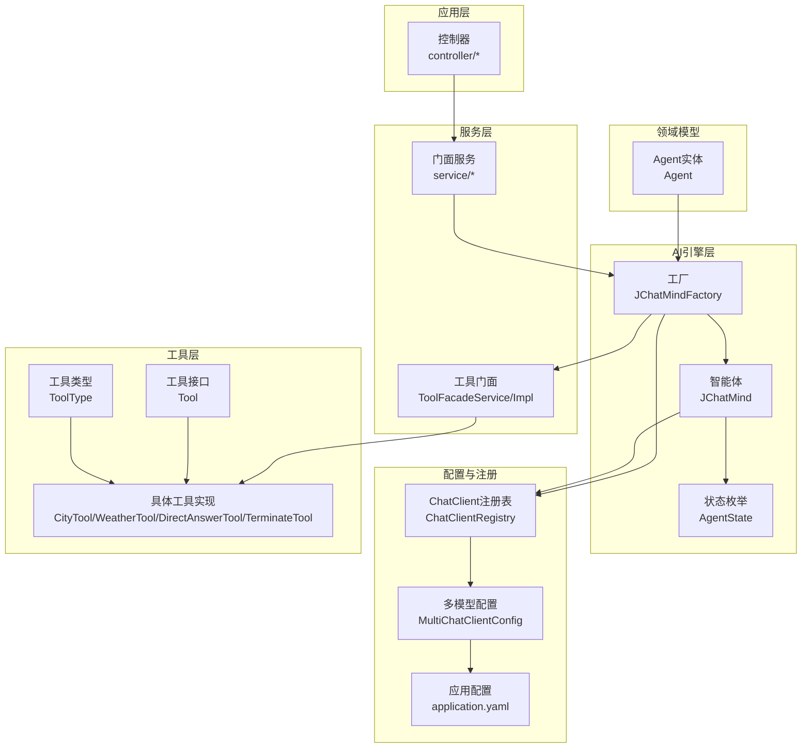
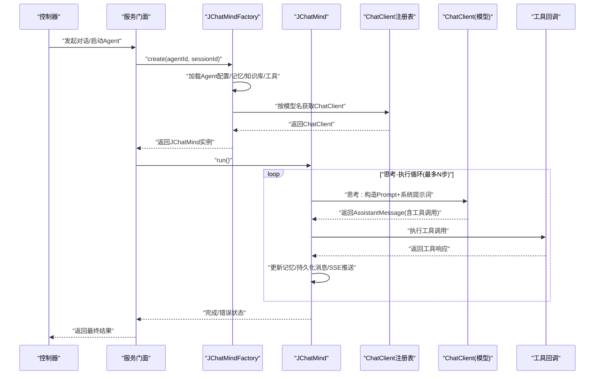
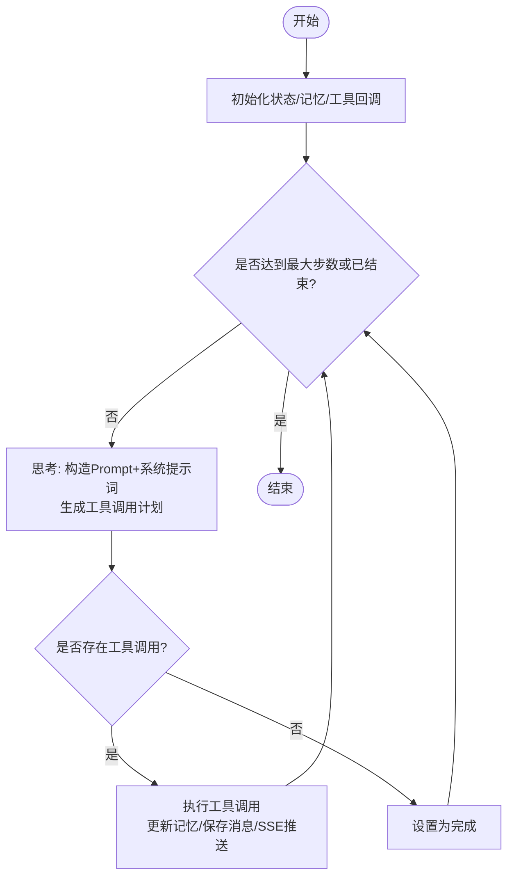
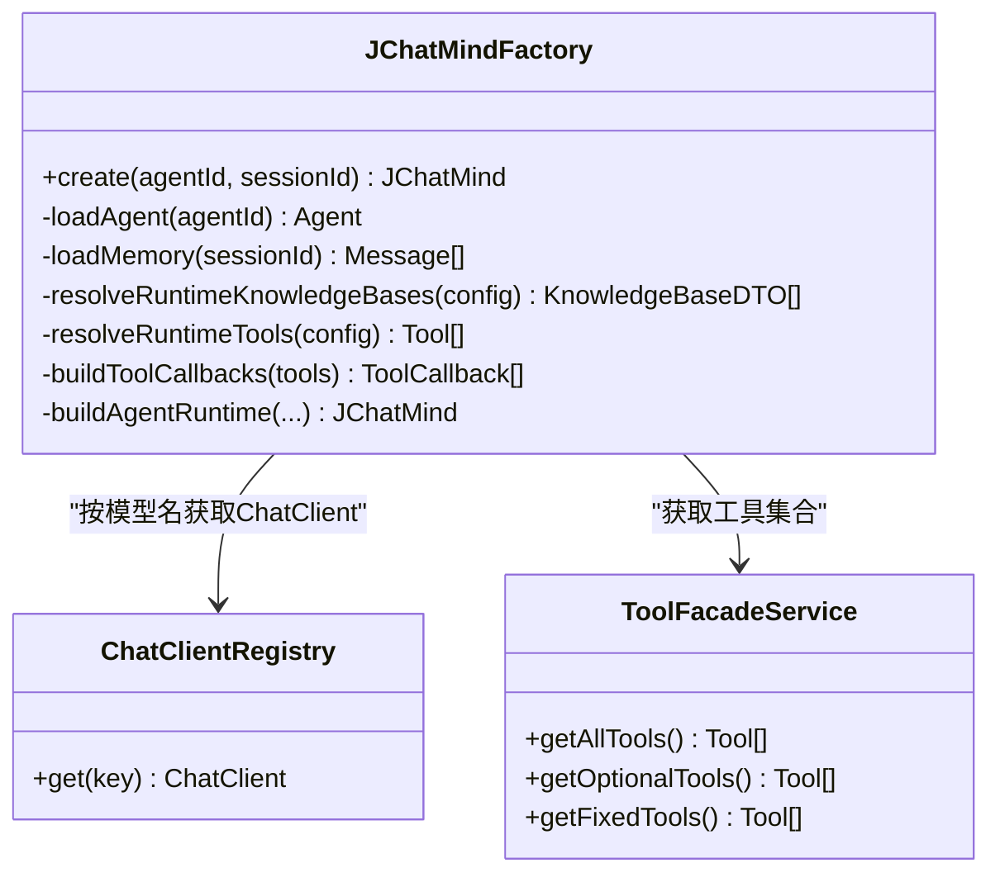
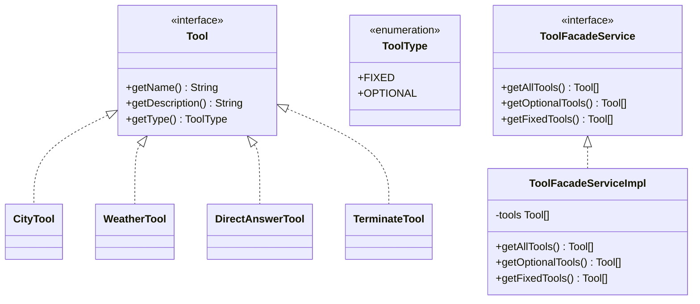
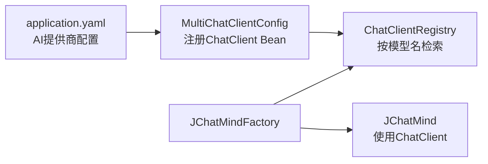
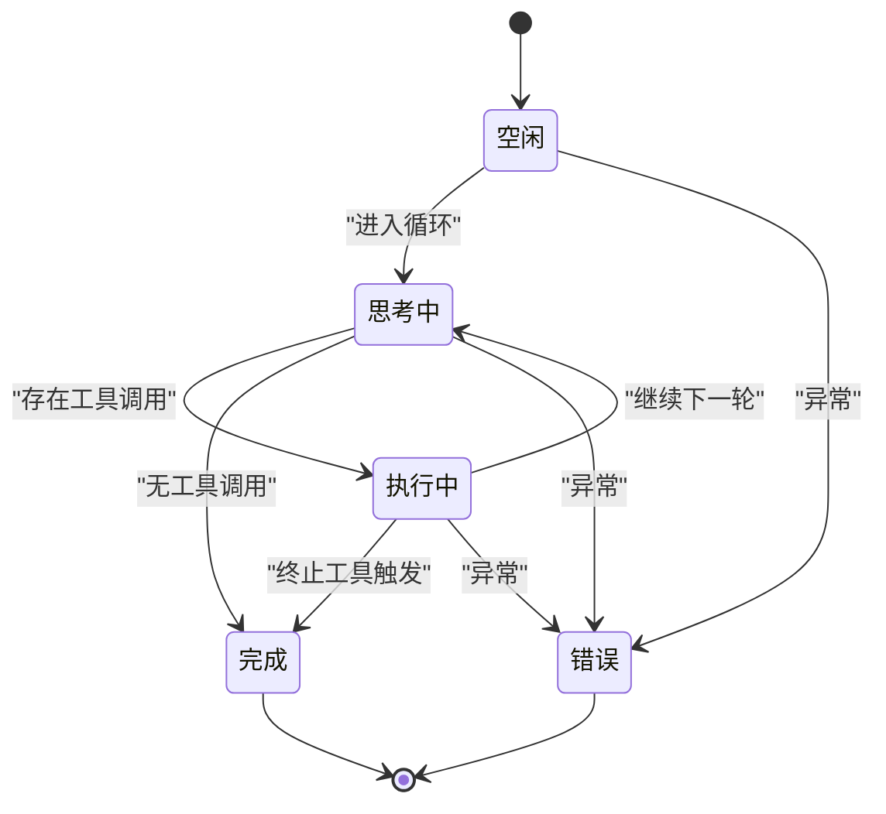
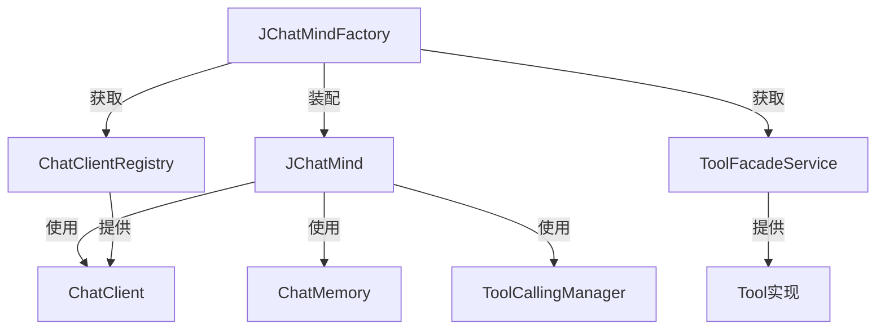
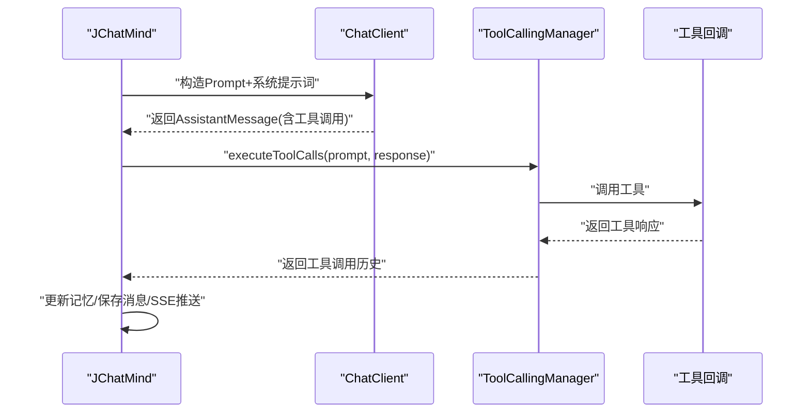

# AI引擎架构

<cite>
**本文引用的文件**
- [JChatMind.java](file://jchatmind/src/main/java/com/kama/jchatmind/agent/JChatMind.java)
- [JChatMindFactory.java](file://jchatmind/src/main/java/com/kama/jchatmind/agent/JChatMindFactory.java)
- [AgentState.java](file://jchatmind/src/main/java/com/kama/jchatmind/agent/AgentState.java)
- [Tool.java](file://jchatmind/src/main/java/com/kama/jchatmind/agent/tools/Tool.java)
- [ToolType.java](file://jchatmind/src/main/java/com/kama/jchatmind/agent/tools/ToolType.java)
- [ToolFacadeServiceImpl.java](file://jchatmind/src/main/java/com/kama/jchatmind/service/impl/ToolFacadeServiceImpl.java)
- [ToolFacadeService.java](file://jchatmind/src/main/java/com/kama/jchatmind/service/ToolFacadeService.java)
- [MultiChatClientConfig.java](file://jchatmind/src/main/java/com/kama/jchatmind/config/MultiChatClientConfig.java)
- [ChatClientRegistry.java](file://jchatmind/src/main/java/com/kama/jchatmind/config/ChatClientRegistry.java)
- [application.yaml](file://jchatmind/src/main/resources/application.yaml)
- [Agent.java](file://jchatmind/src/main/java/com/kama/jchatmind/model/entity/Agent.java)
- [CityTool.java](file://jchatmind/src/main/java/com/kama/jchatmind/agent/tools/test/CityTool.java)
- [WeatherTool.java](file://jchatmind/src/main/java/com/kama/jchatmind/agent/tools/test/WeatherTool.java)
- [DirectAnswerTool.java](file://jchatmind/src/main/java/com/kama/jchatmind/agent/tools/DirectAnswerTool.java)
- [TerminateTool.java](file://jchatmind/src/main/java/com/kama/jchatmind/agent/tools/TerminateTool.java)
</cite>

## 目录
1. [简介](#简介)
2. [项目结构](#项目结构)
3. [核心组件](#核心组件)
4. [架构总览](#架构总览)
5. [详细组件分析](#详细组件分析)
6. [依赖分析](#依赖分析)
7. [性能考虑](#性能考虑)
8. [故障排查指南](#故障排查指南)
9. [结论](#结论)
10. [附录](#附录)

## 简介
本文件面向JChatMind AI引擎，系统性阐述智能Agent的核心设计思想与“思考-执行”循环机制，详解核心引擎架构、状态管理与记忆管理，工具调用框架的接口抽象、分类体系与门面模式，以及多模型支持架构（Spring AI集成、适配器模式与模型切换）。文档同时提供AI引擎工作流程图、工具调用序列图与状态转换图，帮助读者快速理解并扩展该引擎。

## 项目结构
JChatMind采用分层清晰的Spring Boot工程组织方式，核心AI引擎位于agent包，配置与注册中心位于config包，服务门面位于service包，实体与DTO位于model包，控制器位于controller包，资源与配置位于resources目录。

图表来源
- [JChatMindFactory.java:196-222](file://jchatmind/src/main/java/com/kama/jchatmind/agent/JChatMindFactory.java#L196-L222)
- [JChatMind.java:203-221](file://jchatmind/src/main/java/com/kama/jchatmind/agent/JChatMind.java#L203-L221)
- [ChatClientRegistry.java:17-19](file://jchatmind/src/main/java/com/kama/jchatmind/config/ChatClientRegistry.java#L17-L19)
- [MultiChatClientConfig.java:12-21](file://jchatmind/src/main/java/com/kama/jchatmind/config/MultiChatClientConfig.java#L12-L21)
- [application.yaml:22-34](file://jchatmind/src/main/resources/application.yaml#L22-L34)
- [ToolFacadeServiceImpl.java:17-36](file://jchatmind/src/main/java/com/kama/jchatmind/service/impl/ToolFacadeServiceImpl.java#L17-L36)
- [Tool.java:3-9](file://jchatmind/src/main/java/com/kama/jchatmind/agent/tools/Tool.java#L3-L9)
- [ToolType.java:5-8](file://jchatmind/src/main/java/com/kama/jchatmind/agent/tools/ToolType.java#L5-L8)
- [Agent.java:24-31](file://jchatmind/src/main/java/com/kama/jchatmind/model/entity/Agent.java#L24-L31)

章节来源
- [JChatMindFactory.java:1-248](file://jchatmind/src/main/java/com/kama/jchatmind/agent/JChatMindFactory.java#L1-L248)
- [JChatMind.java:1-348](file://jchatmind/src/main/java/com/kama/jchatmind/agent/JChatMind.java#L1-L348)
- [application.yaml:1-43](file://jchatmind/src/main/resources/application.yaml#L1-L43)

## 核心组件
- 智能体JChatMind：负责执行“思考-执行”循环，管理记忆、工具调用与状态流转；通过Spring AI ChatClient与模型交互，使用ToolCallingManager协调工具调用。
- 工厂JChatMindFactory：从数据库加载Agent配置，恢复历史记忆，解析可用知识库与工具，构建JChatMind运行时实例，并注入ChatClient与工具回调。
- 状态管理AgentState：定义智能体生命周期状态，驱动循环结束与错误处理。
- 工具框架：Tool接口抽象工具能力，ToolType区分固定与可选工具；ToolFacadeService/Impl提供工具聚合与分类查询；具体工具实现通过注解暴露给Spring AI工具回调。
- 多模型支持：MultiChatClientConfig与ChatClientRegistry提供多模型ChatClient注册与按模型名检索，配合application.yaml中的AI提供商配置实现模型切换。

章节来源
- [JChatMind.java:32-140](file://jchatmind/src/main/java/com/kama/jchatmind/agent/JChatMind.java#L32-L140)
- [JChatMindFactory.java:72-246](file://jchatmind/src/main/java/com/kama/jchatmind/agent/JChatMindFactory.java#L72-L246)
- [AgentState.java:3-10](file://jchatmind/src/main/java/com/kama/jchatmind/agent/AgentState.java#L3-L10)
- [Tool.java:3-9](file://jchatmind/src/main/java/com/kama/jchatmind/agent/tools/Tool.java#L3-L9)
- [ToolType.java:5-8](file://jchatmind/src/main/java/com/kama/jchatmind/agent/tools/ToolType.java#L5-L8)
- [ToolFacadeServiceImpl.java:17-36](file://jchatmind/src/main/java/com/kama/jchatmind/service/impl/ToolFacadeServiceImpl.java#L17-L36)
- [MultiChatClientConfig.java:10-22](file://jchatmind/src/main/java/com/kama/jchatmind/config/MultiChatClientConfig.java#L10-L22)
- [ChatClientRegistry.java:9-20](file://jchatmind/src/main/java/com/kama/jchatmind/config/ChatClientRegistry.java#L9-L20)
- [application.yaml:22-34](file://jchatmind/src/main/resources/application.yaml#L22-L34)

## 架构总览
JChatMind将“思考-执行”循环与Spring AI工具调用机制深度融合：智能体先基于当前记忆与系统提示词进行思考，生成工具调用计划；随后由工具调用管理器执行工具并回写工具响应至记忆，形成闭环。工厂负责装配运行时依赖，注册表与多模型配置支撑跨模型切换。

图表来源
- [JChatMindFactory.java:227-246](file://jchatmind/src/main/java/com/kama/jchatmind/agent/JChatMindFactory.java#L227-L246)
- [JChatMind.java:316-337](file://jchatmind/src/main/java/com/kama/jchatmind/agent/JChatMind.java#L316-L337)
- [ChatClientRegistry.java:17-19](file://jchatmind/src/main/java/com/kama/jchatmind/config/ChatClientRegistry.java#L17-L19)

## 详细组件分析

### JChatMind：思考-执行循环与状态管理
- Think阶段：将系统提示词作为“思考提示”临时加入Prompt，结合历史记忆与可用工具，生成包含工具调用的AssistantMessage；保存Assistant消息并推送SSE。
- Execute阶段：借助ToolCallingManager执行工具调用，清空当前会话记忆并将工具调用历史写回；保存工具响应消息并推送SSE；若检测到终止工具则进入FINISHED状态。
- 循环控制：run方法限制最大步数，每步调用step，若无工具调用则直接结束；异常时进入ERROR状态。
- 记忆管理：使用MessageWindowChatMemory维护窗口大小，默认最近N条消息；支持系统提示词注入但不持久化。

图表来源
- [JChatMind.java:220-337](file://jchatmind/src/main/java/com/kama/jchatmind/agent/JChatMind.java#L220-L337)

章节来源
- [JChatMind.java:220-337](file://jchatmind/src/main/java/com/kama/jchatmind/agent/JChatMind.java#L220-L337)
- [AgentState.java:3-10](file://jchatmind/src/main/java/com/kama/jchatmind/agent/AgentState.java#L3-L10)

### JChatMindFactory：运行时装配与依赖注入
- 装载Agent：从Mapper读取Agent实体，转换为AgentDTO并解析JSON字段（允许的工具、知识库、聊天选项）。
- 恢复记忆：从Facade按会话拉取最近消息，重建Message列表，支持系统、用户、助手与工具响应消息。
- 解析工具：合并固定工具与按Agent配置允许的可选工具，通过MethodToolCallbackProvider生成ToolCallback集合。
- 构建智能体：依据Agent的模型名从ChatClientRegistry获取对应ChatClient，组装JChatMind实例。

图表来源
- [JChatMindFactory.java:72-246](file://jchatmind/src/main/java/com/kama/jchatmind/agent/JChatMindFactory.java#L72-L246)
- [ChatClientRegistry.java:17-19](file://jchatmind/src/main/java/com/kama/jchatmind/config/ChatClientRegistry.java#L17-L19)
- [ToolFacadeServiceImpl.java:17-36](file://jchatmind/src/main/java/com/kama/jchatmind/service/impl/ToolFacadeServiceImpl.java#L17-L36)

章节来源
- [JChatMindFactory.java:72-246](file://jchatmind/src/main/java/com/kama/jchatmind/agent/JChatMindFactory.java#L72-L246)
- [Agent.java:24-31](file://jchatmind/src/main/java/com/kama/jchatmind/model/entity/Agent.java#L24-L31)

### 工具调用框架：接口、分类与门面
- Tool接口：统一工具名称、描述与类型。
- ToolType分类：FIXED（固定工具，如直接回答、终止）、OPTIONAL（可选工具，如数据库、文件系统、天气等）。
- ToolFacadeService/Impl：聚合所有工具，按类型过滤；工厂据此构建ToolCallback。
- 具体工具示例：CityTool、WeatherTool（固定工具示例）、DirectAnswerTool、TerminateTool（内置固定工具）。

图表来源
- [Tool.java:3-9](file://jchatmind/src/main/java/com/kama/jchatmind/agent/tools/Tool.java#L3-L9)
- [ToolType.java:5-8](file://jchatmind/src/main/java/com/kama/jchatmind/agent/tools/ToolType.java#L5-L8)
- [ToolFacadeService.java:7-13](file://jchatmind/src/main/java/com/kama/jchatmind/service/ToolFacadeService.java#L7-L13)
- [ToolFacadeServiceImpl.java:17-36](file://jchatmind/src/main/java/com/kama/jchatmind/service/impl/ToolFacadeServiceImpl.java#L17-L36)
- [CityTool.java:8-28](file://jchatmind/src/main/java/com/kama/jchatmind/agent/tools/test/CityTool.java#L8-L28)
- [WeatherTool.java:8-30](file://jchatmind/src/main/java/com/kama/jchatmind/agent/tools/test/WeatherTool.java#L8-L30)
- [DirectAnswerTool.java:7-29](file://jchatmind/src/main/java/com/kama/jchatmind/agent/tools/DirectAnswerTool.java#L7-L29)
- [TerminateTool.java:6-25](file://jchatmind/src/main/java/com/kama/jchatmind/agent/tools/TerminateTool.java#L6-L25)

章节来源
- [Tool.java:3-9](file://jchatmind/src/main/java/com/kama/jchatmind/agent/tools/Tool.java#L3-L9)
- [ToolType.java:5-8](file://jchatmind/src/main/java/com/kama/jchatmind/agent/tools/ToolType.java#L5-L8)
- [ToolFacadeService.java:7-13](file://jchatmind/src/main/java/com/kama/jchatmind/service/ToolFacadeService.java#L7-L13)
- [ToolFacadeServiceImpl.java:17-36](file://jchatmind/src/main/java/com/kama/jchatmind/service/impl/ToolFacadeServiceImpl.java#L17-L36)
- [CityTool.java:8-28](file://jchatmind/src/main/java/com/kama/jchatmind/agent/tools/test/CityTool.java#L8-L28)
- [WeatherTool.java:8-30](file://jchatmind/src/main/java/com/kama/jchatmind/agent/tools/test/WeatherTool.java#L8-L30)
- [DirectAnswerTool.java:7-29](file://jchatmind/src/main/java/com/kama/jchatmind/agent/tools/DirectAnswerTool.java#L7-L29)
- [TerminateTool.java:6-25](file://jchatmind/src/main/java/com/kama/jchatmind/agent/tools/TerminateTool.java#L6-L25)

### 多模型支持架构：Spring AI集成与模型切换
- 多模型配置：在application.yaml中定义多个AI提供商的API Key、基础URL与默认模型名。
- ChatClient注册：MultiChatClientConfig为不同模型创建ChatClient Bean，命名与模型名一致。
- 注册表检索：ChatClientRegistry按模型名从容器获取对应ChatClient，工厂据此构建智能体。
- 适配器模式：通过ChatClient抽象屏蔽底层模型差异，实现统一调用入口。

图表来源
- [application.yaml:22-34](file://jchatmind/src/main/resources/application.yaml#L22-L34)
- [MultiChatClientConfig.java:10-22](file://jchatmind/src/main/java/com/kama/jchatmind/config/MultiChatClientConfig.java#L10-L22)
- [ChatClientRegistry.java:17-19](file://jchatmind/src/main/java/com/kama/jchatmind/config/ChatClientRegistry.java#L17-L19)
- [JChatMindFactory.java:203-206](file://jchatmind/src/main/java/com/kama/jchatmind/agent/JChatMindFactory.java#L203-L206)

章节来源
- [application.yaml:22-34](file://jchatmind/src/main/resources/application.yaml#L22-L34)
- [MultiChatClientConfig.java:10-22](file://jchatmind/src/main/java/com/kama/jchatmind/config/MultiChatClientConfig.java#L10-L22)
- [ChatClientRegistry.java:9-20](file://jchatmind/src/main/java/com/kama/jchatmind/config/ChatClientRegistry.java#L9-L20)
- [JChatMindFactory.java:203-206](file://jchatmind/src/main/java/com/kama/jchatmind/agent/JChatMindFactory.java#L203-L206)

### 状态转换图
智能体状态在“思考-执行”循环中动态变化，最终可能正常结束或因异常进入错误状态。

图表来源
- [AgentState.java:3-10](file://jchatmind/src/main/java/com/kama/jchatmind/agent/AgentState.java#L3-L10)
- [JChatMind.java:316-337](file://jchatmind/src/main/java/com/kama/jchatmind/agent/JChatMind.java#L316-L337)

## 依赖分析
- 组件内聚与耦合
  - JChatMind高度依赖Spring AI的ChatClient、ChatMemory与ToolCallingManager，耦合于工具回调与模型选项。
  - JChatMindFactory承担装配职责，与Mapper、Converter、Registry、Facade松耦合，通过接口注入降低变更成本。
- 外部依赖
  - Spring AI：提供ChatClient、工具回调、工具调用管理与消息模型。
  - 数据源与邮件：application.yaml中配置数据源与邮件服务，服务于消息持久化与通知。
- 潜在循环依赖
  - 工具实现通过注解暴露给回调，工厂通过MethodToolCallbackProvider生成回调，未见直接循环依赖。

图表来源
- [JChatMind.java:109-139](file://jchatmind/src/main/java/com/kama/jchatmind/agent/JChatMind.java#L109-L139)
- [JChatMindFactory.java:203-245](file://jchatmind/src/main/java/com/kama/jchatmind/agent/JChatMindFactory.java#L203-L245)
- [ChatClientRegistry.java:17-19](file://jchatmind/src/main/java/com/kama/jchatmind/config/ChatClientRegistry.java#L17-L19)
- [ToolFacadeServiceImpl.java:17-36](file://jchatmind/src/main/java/com/kama/jchatmind/service/impl/ToolFacadeServiceImpl.java#L17-L36)

章节来源
- [JChatMind.java:109-139](file://jchatmind/src/main/java/com/kama/jchatmind/agent/JChatMind.java#L109-L139)
- [JChatMindFactory.java:203-245](file://jchatmind/src/main/java/com/kama/jchatmind/agent/JChatMindFactory.java#L203-L245)

## 性能考虑
- 记忆窗口：通过MessageWindowChatMemory限制历史消息数量，建议根据上下文长度与模型Token预算调整窗口大小。
- 工具调用：工具执行可能涉及外部I/O，应避免在单次循环中过度频繁调用；必要时引入异步执行与并发控制。
- SSE推送：批量刷新pending消息，减少前端连接压力；建议在高并发场景下增加背压与限流策略。
- 模型切换：ChatClient按模型名检索，确保注册表键值与配置一致，避免重复创建实例带来的开销。

## 故障排查指南
- 工具调用失败
  - 检查工具实现是否正确标注工具注解并被MethodToolCallbackProvider识别。
  - 确认ToolFacadeService返回的工具集合包含所需工具。
- 模型不可用
  - 核对application.yaml中的AI提供商配置与模型名，确保MultiChatClientConfig已注册对应Bean。
  - 使用ChatClientRegistry.get(modelKey)验证是否能正确检索到ChatClient。
- 记忆恢复异常
  - 检查历史消息格式与角色映射，确保系统、用户、助手与工具响应消息均能正确重建。
- 循环卡死
  - 检查MAX_STEPS与智能体逻辑，确认终止工具或无工具调用路径可达。

章节来源
- [ToolFacadeServiceImpl.java:17-36](file://jchatmind/src/main/java/com/kama/jchatmind/service/impl/ToolFacadeServiceImpl.java#L17-L36)
- [application.yaml:22-34](file://jchatmind/src/main/resources/application.yaml#L22-L34)
- [MultiChatClientConfig.java:10-22](file://jchatmind/src/main/java/com/kama/jchatmind/config/MultiChatClientConfig.java#L10-L22)
- [ChatClientRegistry.java:17-19](file://jchatmind/src/main/java/com/kama/jchatmind/config/ChatClientRegistry.java#L17-L19)
- [JChatMindFactory.java:79-116](file://jchatmind/src/main/java/com/kama/jchatmind/agent/JChatMindFactory.java#L79-L116)
- [JChatMind.java:316-337](file://jchatmind/src/main/java/com/kama/jchatmind/agent/JChatMind.java#L316-L337)

## 结论
JChatMind以“思考-执行”循环为核心，结合Spring AI的工具调用与记忆管理，实现了灵活可控的智能Agent引擎。通过工厂装配、注册表与门面模式，系统在保持低耦合的同时具备良好的扩展性与可维护性。多模型支持通过配置与注册机制实现无缝切换，满足不同场景下的推理需求。

## 附录
- 工具调用序列图（基于实际代码）

图表来源
- [JChatMind.java:238-304](file://jchatmind/src/main/java/com/kama/jchatmind/agent/JChatMind.java#L238-L304)