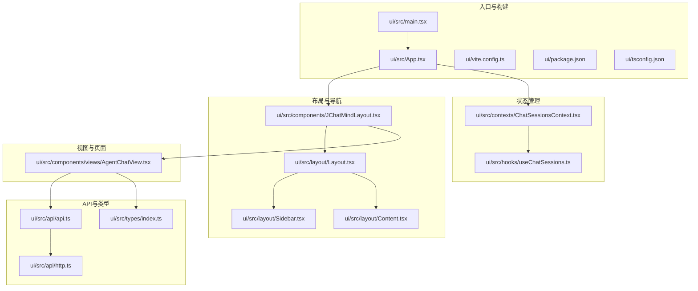
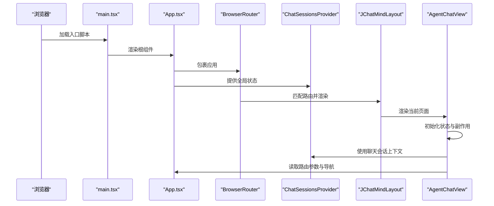
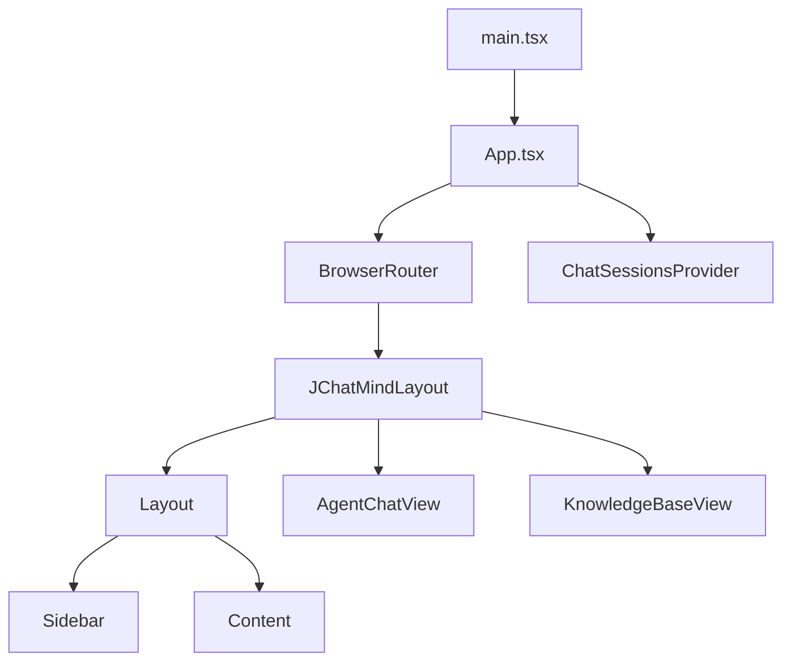
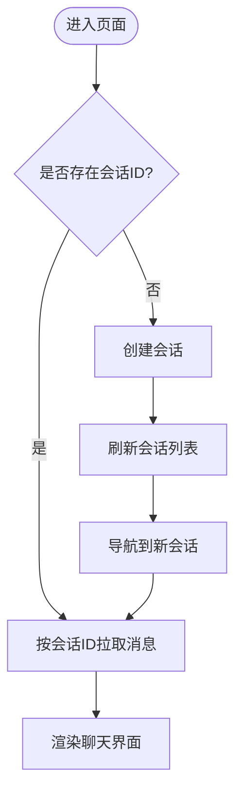
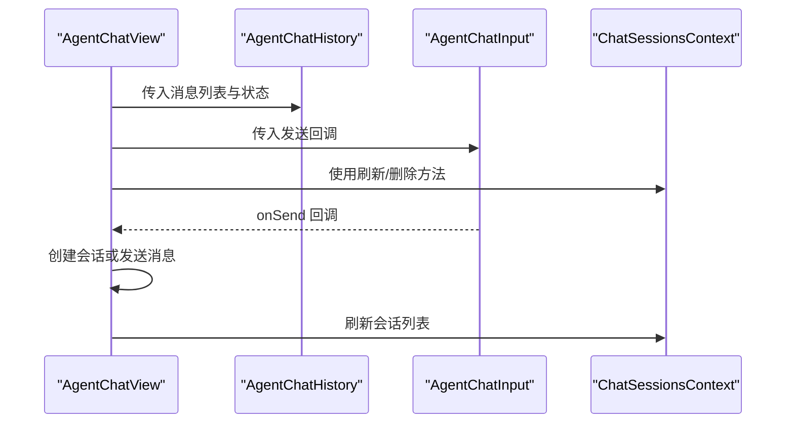
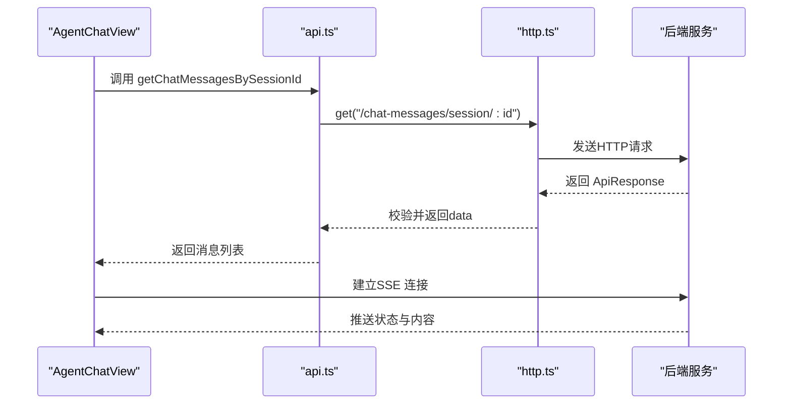
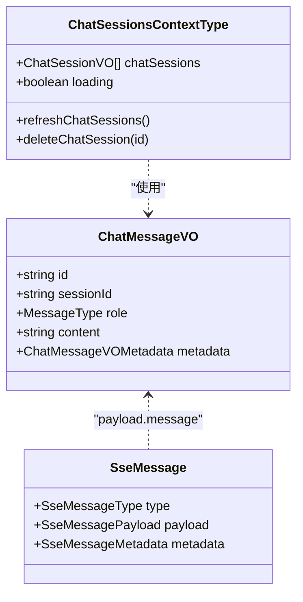
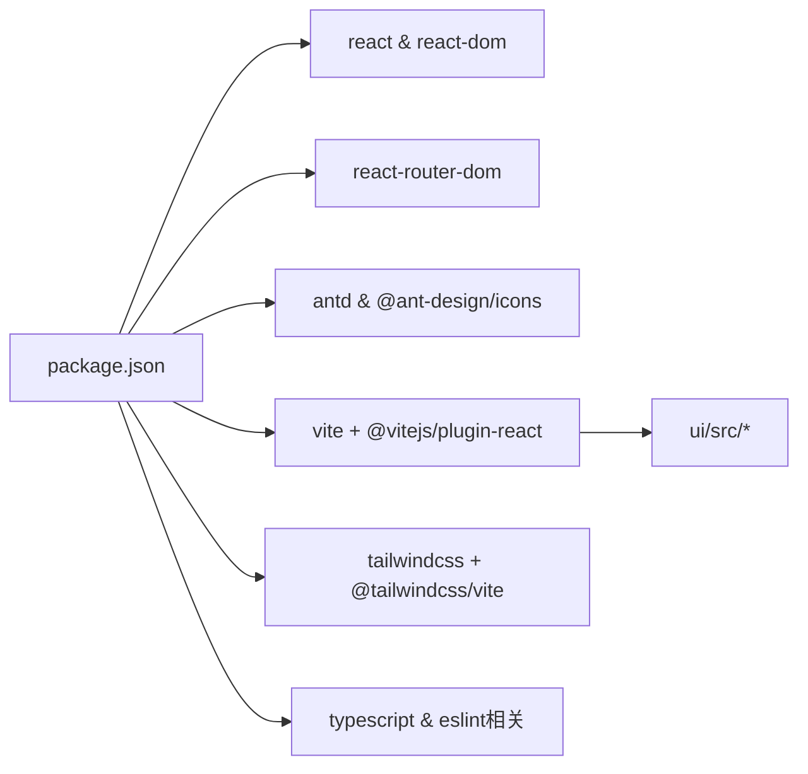

# 前端架构

<cite>
**本文引用的文件**
- [ui/src/main.tsx](file://ui/src/main.tsx)
- [ui/src/App.tsx](file://ui/src/App.tsx)
- [ui/vite.config.ts](file://ui/vite.config.ts)
- [ui/package.json](file://ui/package.json)
- [ui/tsconfig.json](file://ui/tsconfig.json)
- [ui/src/components/JChatMindLayout.tsx](file://ui/src/components/JChatMindLayout.tsx)
- [ui/src/contexts/ChatSessionsContext.tsx](file://ui/src/contexts/ChatSessionsContext.tsx)
- [ui/src/hooks/useChatSessions.ts](file://ui/src/hooks/useChatSessions.ts)
- [ui/src/api/api.ts](file://ui/src/api/api.ts)
- [ui/src/api/http.ts](file://ui/src/api/http.ts)
- [ui/src/types/index.ts](file://ui/src/types/index.ts)
- [ui/src/layout/Layout.tsx](file://ui/src/layout/Layout.tsx)
- [ui/src/layout/Content.tsx](file://ui/src/layout/Content.tsx)
- [ui/src/layout/Sidebar.tsx](file://ui/src/layout/Sidebar.tsx)
- [ui/src/components/views/AgentChatView.tsx](file://ui/src/components/views/AgentChatView.tsx)
</cite>

## 目录
1. [简介](#简介)
2. [项目结构](#项目结构)
3. [核心组件](#核心组件)
4. [架构总览](#架构总览)
5. [详细组件分析](#详细组件分析)
6. [依赖关系分析](#依赖关系分析)
7. [性能考量](#性能考量)
8. [故障排查指南](#故障排查指南)
9. [结论](#结论)
10. [附录](#附录)

## 简介
本文件面向JChatMind前端子项目，系统性梳理基于React + TypeScript的现代前端架构设计，涵盖以下方面：
- Vite构建工具配置与开发体验
- TypeScript类型系统与强类型约束
- 组件化设计理念与路由组织
- 启动流程、路由配置与状态管理模式
- Context API在全局状态管理中的应用
- 组件间通信机制与数据流管理
- 前端与后端API的集成方式、HTTP客户端封装与错误处理策略
- 组件树结构图、状态管理流程图与前后端交互时序图

## 项目结构
前端位于ui目录，采用React + TypeScript + Vite技术栈，配合TailwindCSS进行样式管理。项目采用按功能域分层的组织方式：入口、应用根组件、布局、上下文、API封装、类型定义、视图组件与自定义Hook。

**图表来源**
- [ui/src/main.tsx:1-11](file://ui/src/main.tsx#L1-L11)
- [ui/src/App.tsx:1-16](file://ui/src/App.tsx#L1-L16)
- [ui/vite.config.ts:1-9](file://ui/vite.config.ts#L1-L9)
- [ui/package.json:1-44](file://ui/package.json#L1-L44)
- [ui/tsconfig.json:1-8](file://ui/tsconfig.json#L1-L8)
- [ui/src/components/JChatMindLayout.tsx:1-31](file://ui/src/components/JChatMindLayout.tsx#L1-L31)
- [ui/src/contexts/ChatSessionsContext.tsx:1-66](file://ui/src/contexts/ChatSessionsContext.tsx#L1-L66)
- [ui/src/hooks/useChatSessions.ts:1-6](file://ui/src/hooks/useChatSessions.ts#L1-L6)
- [ui/src/api/api.ts:1-378](file://ui/src/api/api.ts#L1-L378)
- [ui/src/api/http.ts:1-177](file://ui/src/api/http.ts#L1-L177)
- [ui/src/types/index.ts:1-57](file://ui/src/types/index.ts#L1-L57)
- [ui/src/layout/Layout.tsx:1-12](file://ui/src/layout/Layout.tsx#L1-L12)
- [ui/src/layout/Content.tsx:1-12](file://ui/src/layout/Content.tsx#L1-L12)
- [ui/src/layout/Sidebar.tsx:1-21](file://ui/src/layout/Sidebar.tsx#L1-L21)
- [ui/src/components/views/AgentChatView.tsx:1-200](file://ui/src/components/views/AgentChatView.tsx#L1-L200)

**章节来源**
- [ui/src/main.tsx:1-11](file://ui/src/main.tsx#L1-L11)
- [ui/src/App.tsx:1-16](file://ui/src/App.tsx#L1-L16)
- [ui/vite.config.ts:1-9](file://ui/vite.config.ts#L1-L9)
- [ui/package.json:1-44](file://ui/package.json#L1-L44)
- [ui/tsconfig.json:1-8](file://ui/tsconfig.json#L1-L8)

## 核心组件
- 应用入口与国际化配置：通过入口文件挂载React根节点，并注入Ant Design的本地化配置，确保UI组件语言与主题一致。
- 应用根组件：包裹BrowserRouter与ChatSessionsProvider，统一提供路由与全局聊天会话状态。
- 布局系统：Layout负责整体容器，Sidebar与Content分别承载侧边菜单与主内容区域。
- 路由与页面：JChatMindLayout集中声明路由规则，映射至AgentChatView与KnowledgeBaseView等页面组件。
- 全局状态：ChatSessionsContext通过Context API提供聊天会话列表、加载状态与刷新/删除操作；useChatSessions用于简化消费。
- API封装：http.ts统一处理URL拼接、请求头、响应校验与错误提示；api.ts对各领域接口进行分组与导出。
- 类型系统：types/index.ts集中定义消息、SSE消息、元数据等类型，保证前后端契约一致。
- 视图组件：AgentChatView负责聊天会话的创建、消息拉取、SSE事件监听与渲染。

**章节来源**
- [ui/src/components/JChatMindLayout.tsx:1-31](file://ui/src/components/JChatMindLayout.tsx#L1-L31)
- [ui/src/contexts/ChatSessionsContext.tsx:1-66](file://ui/src/contexts/ChatSessionsContext.tsx#L1-L66)
- [ui/src/hooks/useChatSessions.ts:1-6](file://ui/src/hooks/useChatSessions.ts#L1-L6)
- [ui/src/api/api.ts:1-378](file://ui/src/api/api.ts#L1-L378)
- [ui/src/api/http.ts:1-177](file://ui/src/api/http.ts#L1-L177)
- [ui/src/types/index.ts:1-57](file://ui/src/types/index.ts#L1-L57)
- [ui/src/components/views/AgentChatView.tsx:1-200](file://ui/src/components/views/AgentChatView.tsx#L1-L200)

## 架构总览
下图展示从浏览器启动到页面渲染、状态管理与API调用的整体流程。

**图表来源**
- [ui/src/main.tsx:1-11](file://ui/src/main.tsx#L1-L11)
- [ui/src/App.tsx:1-16](file://ui/src/App.tsx#L1-L16)
- [ui/src/components/JChatMindLayout.tsx:1-31](file://ui/src/components/JChatMindLayout.tsx#L1-L31)
- [ui/src/contexts/ChatSessionsContext.tsx:1-66](file://ui/src/contexts/ChatSessionsContext.tsx#L1-L66)
- [ui/src/components/views/AgentChatView.tsx:1-200](file://ui/src/components/views/AgentChatView.tsx#L1-L200)

## 详细组件分析

### 组件树结构与路由
- 组件树自上而下：main.tsx -> App.tsx -> JChatMindLayout -> Layout/Sidebar/Content -> AgentChatView/KnowledgeBaseView。
- 路由规则集中在JChatMindLayout中，支持首页、智能体聊天、指定会话详情、知识库浏览等路径。
- 路由参数与状态通过useParams/useNavigate/useLocation在AgentChatView中使用，实现动态跳转与初始化消息传递。

**图表来源**
- [ui/src/main.tsx:1-11](file://ui/src/main.tsx#L1-L11)
- [ui/src/App.tsx:1-16](file://ui/src/App.tsx#L1-L16)
- [ui/src/components/JChatMindLayout.tsx:1-31](file://ui/src/components/JChatMindLayout.tsx#L1-L31)

**章节来源**
- [ui/src/components/JChatMindLayout.tsx:1-31](file://ui/src/components/JChatMindLayout.tsx#L1-L31)
- [ui/src/components/views/AgentChatView.tsx:1-200](file://ui/src/components/views/AgentChatView.tsx#L1-L200)

### Context API与状态管理
- ChatSessionsContext提供聊天会话列表、加载状态与刷新/删除能力；内部通过useEffect在组件挂载时自动拉取数据。
- useChatSessions作为定制Hook，简化消费者对上下文的访问；若未在Provider内使用则抛出明确错误。
- AgentChatView在无会话ID时触发创建流程，成功后通过navigate携带状态跳转；随后刷新会话列表以保持UI一致性。

**图表来源**
- [ui/src/contexts/ChatSessionsContext.tsx:1-66](file://ui/src/contexts/ChatSessionsContext.tsx#L1-L66)
- [ui/src/hooks/useChatSessions.ts:1-6](file://ui/src/hooks/useChatSessions.ts#L1-L6)
- [ui/src/components/views/AgentChatView.tsx:1-200](file://ui/src/components/views/AgentChatView.tsx#L1-L200)

**章节来源**
- [ui/src/contexts/ChatSessionsContext.tsx:1-66](file://ui/src/contexts/ChatSessionsContext.tsx#L1-L66)
- [ui/src/hooks/useChatSessions.ts:1-6](file://ui/src/hooks/useChatSessions.ts#L1-L6)
- [ui/src/components/views/AgentChatView.tsx:1-200](file://ui/src/components/views/AgentChatView.tsx#L1-L200)

### 组件间通信与数据流
- 父子通信：AgentChatView通过props向AgentChatHistory与AgentChatInput传递数据与回调。
- 上下文通信：多处组件共享聊天会话状态，避免跨层级传递。
- 路由驱动的数据流：通过路由参数与状态传递，实现从空态到有态的平滑过渡。

**图表来源**
- [ui/src/components/views/AgentChatView.tsx:1-200](file://ui/src/components/views/AgentChatView.tsx#L1-L200)
- [ui/src/contexts/ChatSessionsContext.tsx:1-66](file://ui/src/contexts/ChatSessionsContext.tsx#L1-L66)

**章节来源**
- [ui/src/components/views/AgentChatView.tsx:1-200](file://ui/src/components/views/AgentChatView.tsx#L1-L200)
- [ui/src/contexts/ChatSessionsContext.tsx:1-66](file://ui/src/contexts/ChatSessionsContext.tsx#L1-L66)

### 前后端交互与API集成
- HTTP客户端封装：http.ts统一处理URL拼接、查询参数、默认请求头、响应校验与错误提示；所有业务API通过api.ts导出。
- 业务API分组：api.ts按领域拆分，如智能体、聊天会话、聊天消息、知识库、文档、工具等，便于维护与复用。
- SSE集成：AgentChatView通过EventSource连接后端SSE通道，接收AI状态与生成内容，实时更新UI。
- 错误处理策略：HTTP层对HTTP状态码与业务状态码进行统一校验；UI层使用Ant Design的消息组件进行用户可见提示。

**图表来源**
- [ui/src/components/views/AgentChatView.tsx:1-200](file://ui/src/components/views/AgentChatView.tsx#L1-L200)
- [ui/src/api/api.ts:1-378](file://ui/src/api/api.ts#L1-L378)
- [ui/src/api/http.ts:1-177](file://ui/src/api/http.ts#L1-L177)

**章节来源**
- [ui/src/api/api.ts:1-378](file://ui/src/api/api.ts#L1-L378)
- [ui/src/api/http.ts:1-177](file://ui/src/api/http.ts#L1-L177)
- [ui/src/components/views/AgentChatView.tsx:1-200](file://ui/src/components/views/AgentChatView.tsx#L1-L200)

### 数据模型与类型系统
- 消息类型：定义角色枚举与消息结构，支持元数据扩展。
- SSE消息：定义消息类型枚举与负载结构，支撑AI状态与内容的增量推送。
- 会话与知识库：定义会话、文档、知识库等实体结构，确保前后端字段一致。

**图表来源**
- [ui/src/types/index.ts:1-57](file://ui/src/types/index.ts#L1-L57)
- [ui/src/contexts/ChatSessionsContext.tsx:1-66](file://ui/src/contexts/ChatSessionsContext.tsx#L1-L66)

**章节来源**
- [ui/src/types/index.ts:1-57](file://ui/src/types/index.ts#L1-L57)
- [ui/src/contexts/ChatSessionsContext.tsx:1-66](file://ui/src/contexts/ChatSessionsContext.tsx#L1-L66)

## 依赖关系分析
- 构建与运行时依赖：React、React DOM、React Router DOM、Ant Design及其图标库、Emoji选择器、TailwindCSS。
- 开发依赖：Vite、@vitejs/plugin-react、@tailwindcss/vite、TypeScript及相关ESLint插件。
- 项目配置：vite.config.ts启用React与TailwindCSS插件；tsconfig.json采用references组织应用与node类型配置。

**图表来源**
- [ui/package.json:1-44](file://ui/package.json#L1-L44)
- [ui/vite.config.ts:1-9](file://ui/vite.config.ts#L1-L9)
- [ui/tsconfig.json:1-8](file://ui/tsconfig.json#L1-L8)

**章节来源**
- [ui/package.json:1-44](file://ui/package.json#L1-L44)
- [ui/vite.config.ts:1-9](file://ui/vite.config.ts#L1-L9)
- [ui/tsconfig.json:1-8](file://ui/tsconfig.json#L1-L8)

## 性能考量
- 按需加载与懒编译：Vite提供快速冷启动与热更新；生产构建通过Rollup优化打包体积。
- 组件粒度与状态隔离：通过Context API将全局状态与局部状态分离，减少不必要重渲染。
- API调用去抖与幂等：对高频操作（如消息发送）建议增加节流/防抖与幂等键，避免重复请求。
- 图片与资源优化：结合TailwindCSS的实用类减少冗余样式，避免大体积静态资源。
- SSR/预渲染：在需要SEO或首屏性能优化时，可考虑引入SSR方案（非当前实现范围）。

## 故障排查指南
- 网络请求失败：检查BASE_URL是否正确指向后端服务；确认CORS配置；查看HTTP层错误提示与业务状态码。
- SSE连接异常：确认后端SSE端点可用；检查浏览器控制台与网络面板；关注onerror事件与连接关闭时机。
- 路由跳转异常：核对路由参数与状态传递；确认navigate调用时机与replace行为。
- Context未提供：确保在App根部已包裹ChatSessionsProvider；使用useChatSessions前保证上下文可用。
- 类型不匹配：核对后端返回结构与前端类型定义；统一字段命名与可选属性。

**章节来源**
- [ui/src/api/http.ts:1-177](file://ui/src/api/http.ts#L1-L177)
- [ui/src/components/views/AgentChatView.tsx:1-200](file://ui/src/components/views/AgentChatView.tsx#L1-L200)
- [ui/src/contexts/ChatSessionsContext.tsx:1-66](file://ui/src/contexts/ChatSessionsContext.tsx#L1-L66)

## 结论
JChatMind前端采用清晰的分层架构：入口与构建、布局与路由、状态管理、API封装与类型系统协同工作。通过Context API实现轻量级全局状态管理，结合React Router DOM完成页面导航与参数传递；HTTP客户端统一处理请求与响应，配合SSE实现实时交互。该架构具备良好的可维护性与扩展性，适合持续演进。

## 附录
- 构建与开发命令：dev/build/lint/preview由Vite与TypeScript共同驱动。
- 配置要点：vite.config.ts启用React与TailwindCSS插件；package.json锁定依赖版本与脚本；tsconfig.json通过references组织类型配置。

**章节来源**
- [ui/package.json:1-44](file://ui/package.json#L1-L44)
- [ui/vite.config.ts:1-9](file://ui/vite.config.ts#L1-L9)
- [ui/tsconfig.json:1-8](file://ui/tsconfig.json#L1-L8)