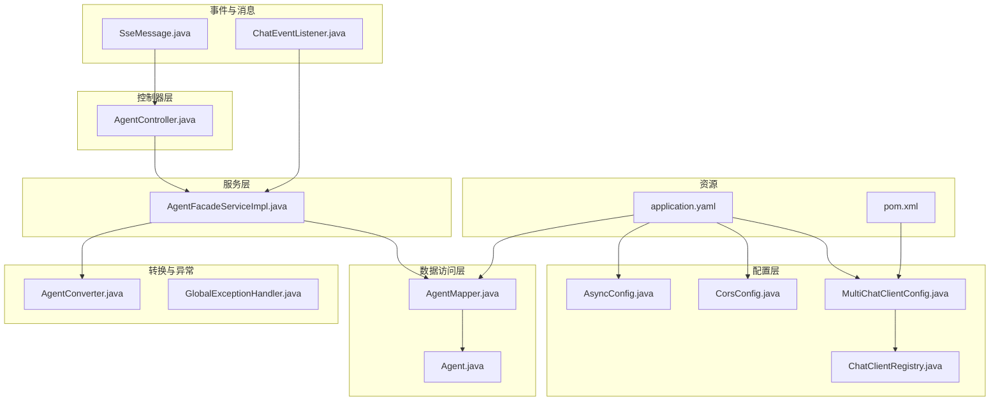
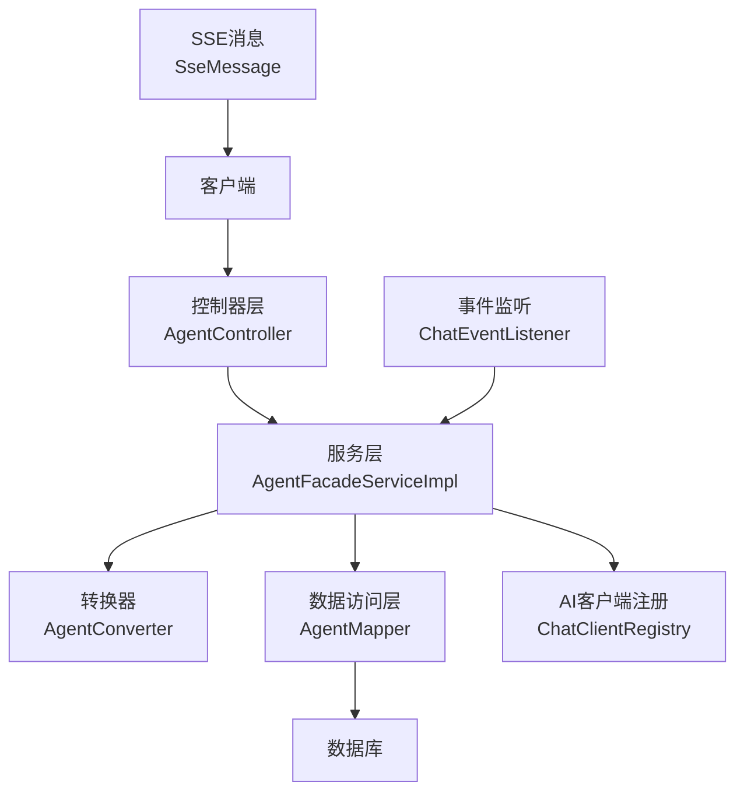
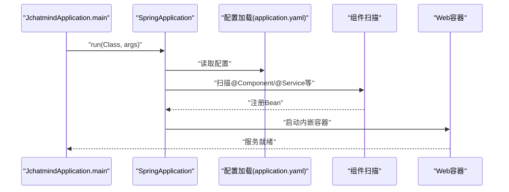
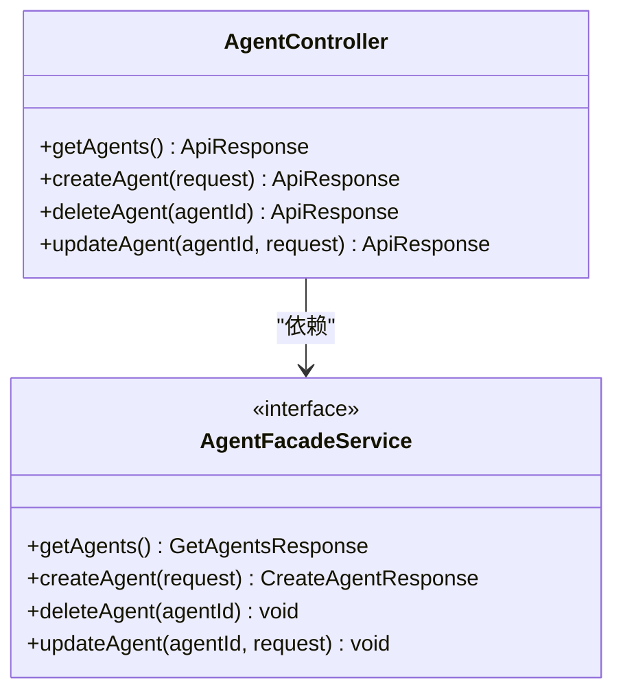
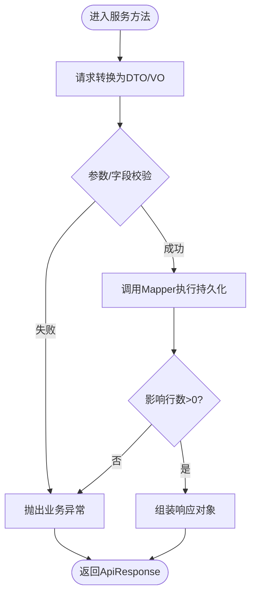
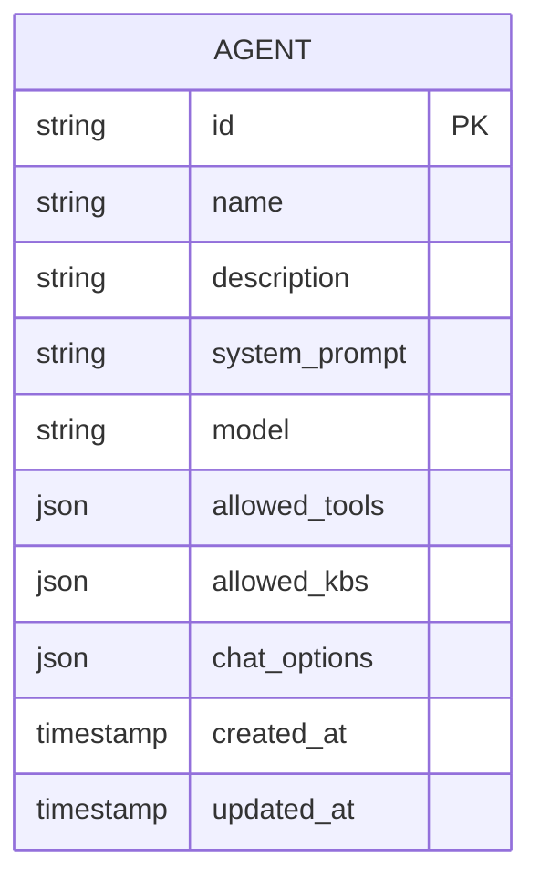
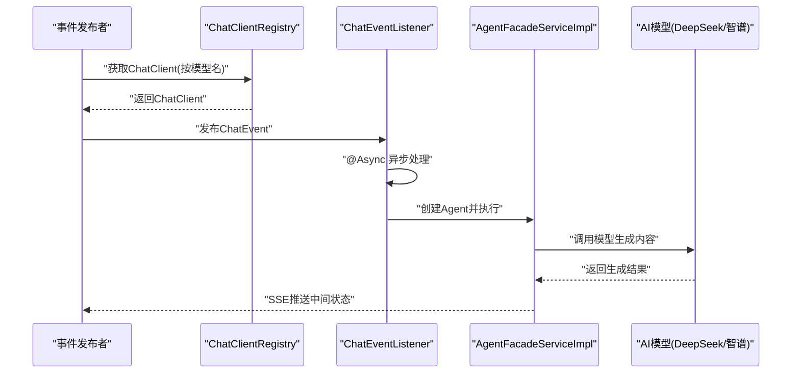
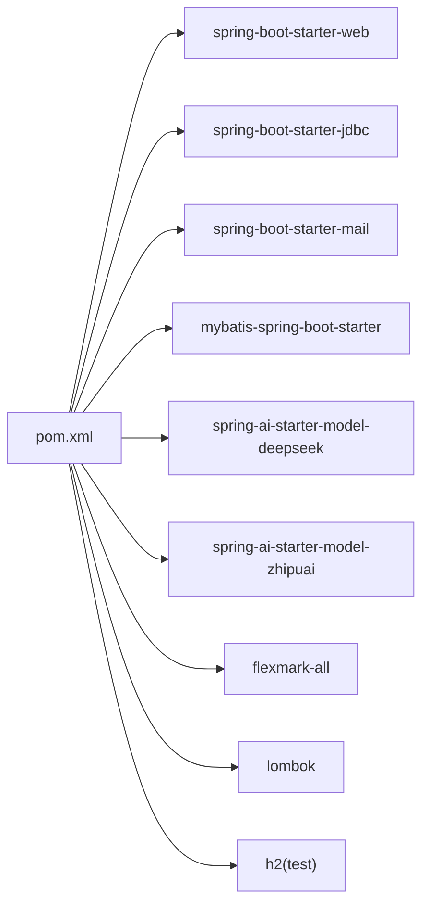

# 后端架构

<cite>
**本文引用的文件**
- [JchatmindApplication.java](file://jchatmind/src/main/java/com/kama/jchatmind/JchatmindApplication.java)
- [application.yaml](file://jchatmind/src/main/resources/application.yaml)
- [pom.xml](file://jchatmind/pom.xml)
- [AsyncConfig.java](file://jchatmind/src/main/java/com/kama/jchatmind/config/AsyncConfig.java)
- [CorsConfig.java](file://jchatmind/src/main/java/com/kama/jchatmind/config/CorsConfig.java)
- [MultiChatClientConfig.java](file://jchatmind/src/main/java/com/kama/jchatmind/config/MultiChatClientConfig.java)
- [ChatClientRegistry.java](file://jchatmind/src/main/java/com/kama/jchatmind/config/ChatClientRegistry.java)
- [AgentController.java](file://jchatmind/src/main/java/com/kama/jchatmind/controller/AgentController.java)
- [AgentFacadeServiceImpl.java](file://jchatmind/src/main/java/com/kama/jchatmind/service/impl/AgentFacadeServiceImpl.java)
- [AgentMapper.java](file://jchatmind/src/main/java/com/kama/jchatmind/mapper/AgentMapper.java)
- [Agent.java](file://jchatmind/src/main/java/com/kama/jchatmind/model/entity/Agent.java)
- [AgentConverter.java](file://jchatmind/src/main/java/com/kama/jchatmind/converter/AgentConverter.java)
- [GlobalExceptionHandler.java](file://jchatmind/src/main/java/com/kama/jchatmind/exception/GlobalExceptionHandler.java)
- [ChatEventListener.java](file://jchatmind/src/main/java/com/kama/jchatmind/event/listener/ChatEventListener.java)
- [SseMessage.java](file://jchatmind/src/main/java/com/kama/jchatmind/message/SseMessage.java)
- [README.md](file://README.md)
</cite>

## 目录
1. [简介](#简介)
2. [项目结构](#项目结构)
3. [核心组件](#核心组件)
4. [架构总览](#架构总览)
5. [详细组件分析](#详细组件分析)
6. [依赖分析](#依赖分析)
7. [性能考虑](#性能考虑)
8. [故障排查指南](#故障排查指南)
9. [结论](#结论)
10. [附录](#附录)

## 简介
本文件面向JChatMind后端，系统基于Spring Boot 3.x与Spring AI，采用分层架构（表现层-MVC、业务层、数据访问层），结合异步事件处理与SSE实时推送，实现Agent智能体的多轮对话、工具调用与RAG检索能力。后端提供REST API，使用MyBatis进行数据库访问，支持多AI模型（DeepSeek、智谱AI）通过注册表动态选择。

## 项目结构
后端代码按功能域划分，主要包结构如下：
- config：配置类，涵盖跨域、异步线程池、AI客户端注册与模型配置
- controller：REST控制器层，统一输出ApiResponse包装
- service：业务服务层，包含门面与具体实现
- mapper：MyBatis Mapper接口
- model：实体、DTO、VO、请求/响应对象
- converter：对象转换器，负责请求/响应与实体间的序列化/反序列化
- exception：全局异常处理
- event/listener：事件驱动与异步处理
- message：SSE消息模型
- resources：application.yaml配置与MyBatis XML映射文件

图表来源
- [AsyncConfig.java:1-25](file://jchatmind/src/main/java/com/kama/jchatmind/config/AsyncConfig.java#L1-L25)
- [CorsConfig.java:1-61](file://jchatmind/src/main/java/com/kama/jchatmind/config/CorsConfig.java#L1-L61)
- [MultiChatClientConfig.java:1-23](file://jchatmind/src/main/java/com/kama/jchatmind/config/MultiChatClientConfig.java#L1-L23)
- [ChatClientRegistry.java:1-21](file://jchatmind/src/main/java/com/kama/jchatmind/config/ChatClientRegistry.java#L1-L21)
- [AgentController.java:1-45](file://jchatmind/src/main/java/com/kama/jchatmind/controller/AgentController.java#L1-L45)
- [AgentFacadeServiceImpl.java:1-122](file://jchatmind/src/main/java/com/kama/jchatmind/service/impl/AgentFacadeServiceImpl.java#L1-L122)
- [AgentMapper.java:1-26](file://jchatmind/src/main/java/com/kama/jchatmind/mapper/AgentMapper.java#L1-L26)
- [Agent.java:1-95](file://jchatmind/src/main/java/com/kama/jchatmind/model/entity/Agent.java#L1-L95)
- [AgentConverter.java:1-125](file://jchatmind/src/main/java/com/kama/jchatmind/converter/AgentConverter.java#L1-L125)
- [GlobalExceptionHandler.java:1-38](file://jchatmind/src/main/java/com/kama/jchatmind/exception/GlobalExceptionHandler.java#L1-L38)
- [ChatEventListener.java:1-25](file://jchatmind/src/main/java/com/kama/jchatmind/event/listener/ChatEventListener.java#L1-L25)
- [SseMessage.java:1-47](file://jchatmind/src/main/java/com/kama/jchatmind/message/SseMessage.java#L1-L47)
- [application.yaml:1-43](file://jchatmind/src/main/resources/application.yaml#L1-L43)
- [pom.xml:1-132](file://jchatmind/pom.xml#L1-L132)

章节来源
- [JchatmindApplication.java:1-14](file://jchatmind/src/main/java/com/kama/jchatmind/JchatmindApplication.java#L1-L14)
- [application.yaml:1-43](file://jchatmind/src/main/resources/application.yaml#L1-L43)
- [pom.xml:1-132](file://jchatmind/pom.xml#L1-L132)

## 核心组件
- 应用入口与启动
  - 启动类位于应用根包下，使用SpringBootApplication注解启用自动装配与组件扫描。
  - 通过SpringApplication.run启动内嵌Web容器，默认暴露REST接口。
- 配置类
  - 跨域配置：提供基于WebMvcConfigurer的addCorsMappings与CorsFilter两种方式，支持本地开发多端口来源与凭证传递。
  - 异步配置：开启@EnableAsync并定义线程池，用于事件监听与后台任务。
  - AI模型配置：注册多个ChatClient Bean，分别对应DeepSeek与智谱AI模型，配合ChatClientRegistry集中获取。
  - MyBatis配置：通过application.yaml设置别名包、XML映射路径与TypeHandler包。
  - 邮件配置：通过application.yaml配置SMTP参数，供邮件服务使用。
- 控制器层
  - 统一以@RestController暴露REST API，使用ApiResponse包装响应，便于前后端约定。
  - 示例：AgentController提供查询、创建、删除、更新Agent的接口。
- 服务层
  - AgentFacadeServiceImpl封装业务逻辑：请求转DTO/VO、调用Mapper持久化、异常处理与返回值组装。
  - Converter负责JSON字段与对象之间的序列化/反序列化，确保allowedTools、allowedKbs、chatOptions等字段正确转换。
- 数据访问层
  - AgentMapper定义基础CRUD方法；MyBatis XML映射文件在resources/mapper目录下。
  - 实体Agent包含JSON字段与时间戳字段，Converter在入库前进行序列化，在出库后进行反序列化。
- 异步与事件
  - ChatEventListener监听ChatEvent，使用@Async异步执行，通过JChatMindFactory创建Agent实例并运行。
  - SSE消息模型SseMessage定义了AI执行状态的多种类型，用于实时推送。

章节来源
- [JchatmindApplication.java:1-14](file://jchatmind/src/main/java/com/kama/jchatmind/JchatmindApplication.java#L1-L14)
- [CorsConfig.java:1-61](file://jchatmind/src/main/java/com/kama/jchatmind/config/CorsConfig.java#L1-L61)
- [AsyncConfig.java:1-25](file://jchatmind/src/main/java/com/kama/jchatmind/config/AsyncConfig.java#L1-L25)
- [MultiChatClientConfig.java:1-23](file://jchatmind/src/main/java/com/kama/jchatmind/config/MultiChatClientConfig.java#L1-L23)
- [ChatClientRegistry.java:1-21](file://jchatmind/src/main/java/com/kama/jchatmind/config/ChatClientRegistry.java#L1-L21)
- [application.yaml:1-43](file://jchatmind/src/main/resources/application.yaml#L1-L43)
- [AgentController.java:1-45](file://jchatmind/src/main/java/com/kama/jchatmind/controller/AgentController.java#L1-L45)
- [AgentFacadeServiceImpl.java:1-122](file://jchatmind/src/main/java/com/kama/jchatmind/service/impl/AgentFacadeServiceImpl.java#L1-L122)
- [AgentConverter.java:1-125](file://jchatmind/src/main/java/com/kama/jchatmind/converter/AgentConverter.java#L1-L125)
- [AgentMapper.java:1-26](file://jchatmind/src/main/java/com/kama/jchatmind/mapper/AgentMapper.java#L1-L26)
- [Agent.java:1-95](file://jchatmind/src/main/java/com/kama/jchatmind/model/entity/Agent.java#L1-L95)
- [ChatEventListener.java:1-25](file://jchatmind/src/main/java/com/kama/jchatmind/event/listener/ChatEventListener.java#L1-L25)
- [SseMessage.java:1-47](file://jchatmind/src/main/java/com/kama/jchatmind/message/SseMessage.java#L1-L47)

## 架构总览
JChatMind后端采用经典的MVC三层架构：
- 表现层（Controller）：接收HTTP请求，调用服务层，返回统一响应格式。
- 业务层（Service）：编排领域逻辑、参数校验、异常处理与结果组装。
- 数据访问层（Mapper + Entity）：通过MyBatis执行SQL，Converter负责JSON字段转换。
- 配置层（Config）：跨域、异步、AI模型与邮件配置，以及组件注册。
- 异步与事件：事件监听器异步触发Agent执行，SSE推送执行状态。

图表来源
- [AgentController.java:1-45](file://jchatmind/src/main/java/com/kama/jchatmind/controller/AgentController.java#L1-L45)
- [AgentFacadeServiceImpl.java:1-122](file://jchatmind/src/main/java/com/kama/jchatmind/service/impl/AgentFacadeServiceImpl.java#L1-L122)
- [AgentConverter.java:1-125](file://jchatmind/src/main/java/com/kama/jchatmind/converter/AgentConverter.java#L1-L125)
- [AgentMapper.java:1-26](file://jchatmind/src/main/java/com/kama/jchatmind/mapper/AgentMapper.java#L1-L26)
- [ChatClientRegistry.java:1-21](file://jchatmind/src/main/java/com/kama/jchatmind/config/ChatClientRegistry.java#L1-L21)
- [ChatEventListener.java:1-25](file://jchatmind/src/main/java/com/kama/jchatmind/event/listener/ChatEventListener.java#L1-L25)
- [SseMessage.java:1-47](file://jchatmind/src/main/java/com/kama/jchatmind/message/SseMessage.java#L1-L47)

## 详细组件分析

### 启动流程与组件扫描
- 启动类使用@SpringBootApplication，自动扫描当前包及子包下的组件（@Component、@Service、@Repository、@Controller、@Configuration等）。
- 通过application.yaml加载外部化配置，包括数据源、邮件、AI模型、MyBatis与文档存储路径。
- Maven依赖引入spring-boot-starter-web、spring-boot-starter-jdbc、mybatis-spring-boot-starter、spring-ai相关starter与spring-boot-starter-mail。

图表来源
- [JchatmindApplication.java:1-14](file://jchatmind/src/main/java/com/kama/jchatmind/JchatmindApplication.java#L1-L14)
- [application.yaml:1-43](file://jchatmind/src/main/resources/application.yaml#L1-L43)
- [pom.xml:1-132](file://jchatmind/pom.xml#L1-L132)

章节来源
- [JchatmindApplication.java:1-14](file://jchatmind/src/main/java/com/kama/jchatmind/JchatmindApplication.java#L1-L14)
- [application.yaml:1-43](file://jchatmind/src/main/resources/application.yaml#L1-L43)
- [pom.xml:1-132](file://jchatmind/pom.xml#L1-L132)

### 配置类详解
- 跨域配置（CorsConfig）
  - 提供addCorsMappings与CorsFilter两种方式，开发环境允许http://localhost:*与http://127.0.0.1:*，支持凭证与预检缓存。
- 异步配置（AsyncConfig）
  - 开启@EnableAsync，定义ThreadPoolTaskExecutor，设置核心/最大线程、队列容量与线程前缀，满足事件监听异步执行需求。
- AI模型配置（MultiChatClientConfig + ChatClientRegistry）
  - 注册多个ChatClient Bean（如deepseek-chat、glm-4.6），通过ChatClientRegistry按名称获取对应客户端，便于在服务层按需选择模型。
- MyBatis配置（application.yaml）
  - type-aliases-package、mapper-locations、type-handlers-package，确保实体别名、XML映射与自定义TypeHandler被正确加载。
- 邮件配置（application.yaml）
  - SMTP主机、端口、用户名、密码、编码与TLS配置，供邮件服务使用。

章节来源
- [CorsConfig.java:1-61](file://jchatmind/src/main/java/com/kama/jchatmind/config/CorsConfig.java#L1-L61)
- [AsyncConfig.java:1-25](file://jchatmind/src/main/java/com/kama/jchatmind/config/AsyncConfig.java#L1-L25)
- [MultiChatClientConfig.java:1-23](file://jchatmind/src/main/java/com/kama/jchatmind/config/MultiChatClientConfig.java#L1-L23)
- [ChatClientRegistry.java:1-21](file://jchatmind/src/main/java/com/kama/jchatmind/config/ChatClientRegistry.java#L1-L21)
- [application.yaml:1-43](file://jchatmind/src/main/resources/application.yaml#L1-L43)

### 控制器层设计模式
- 统一响应包装：所有控制器返回ApiResponse<T>，便于前后端契约一致。
- 路径与方法：控制器使用@RequestMapping("/api")，各接口遵循REST风格，如GET/POST/DELETE/PATCH。
- 依赖注入：构造函数注入服务接口，保证不可变性与测试友好。

图表来源
- [AgentController.java:1-45](file://jchatmind/src/main/java/com/kama/jchatmind/controller/AgentController.java#L1-L45)

章节来源
- [AgentController.java:1-45](file://jchatmind/src/main/java/com/kama/jchatmind/controller/AgentController.java#L1-L45)

### 服务层业务逻辑封装
- AgentFacadeServiceImpl职责
  - 请求到DTO/VO转换：使用AgentConverter完成JSON字段序列化/反序列化。
  - 持久化操作：调用AgentMapper执行插入/更新/删除/查询。
  - 异常处理：捕获序列化异常与业务异常，抛出BizException或转换为统一错误响应。
  - 时间戳维护：创建与更新时设置createdAt/updatedAt。
- Converter设计
  - toEntity：将DTO写入JSON字符串字段，构建Agent实体。
  - toDTO：从JSON字符串字段读取为对象，构建DTO。
  - toVO：构建视图对象，供控制器返回。
  - updateDTOFromRequest：根据UpdateAgentRequest增量更新DTO字段。

图表来源
- [AgentFacadeServiceImpl.java:1-122](file://jchatmind/src/main/java/com/kama/jchatmind/service/impl/AgentFacadeServiceImpl.java#L1-L122)
- [AgentConverter.java:1-125](file://jchatmind/src/main/java/com/kama/jchatmind/converter/AgentConverter.java#L1-L125)
- [AgentMapper.java:1-26](file://jchatmind/src/main/java/com/kama/jchatmind/mapper/AgentMapper.java#L1-L26)

章节来源
- [AgentFacadeServiceImpl.java:1-122](file://jchatmind/src/main/java/com/kama/jchatmind/service/impl/AgentFacadeServiceImpl.java#L1-L122)
- [AgentConverter.java:1-125](file://jchatmind/src/main/java/com/kama/jchatmind/converter/AgentConverter.java#L1-L125)
- [AgentMapper.java:1-26](file://jchatmind/src/main/java/com/kama/jchatmind/mapper/AgentMapper.java#L1-L26)
- [Agent.java:1-95](file://jchatmind/src/main/java/com/kama/jchatmind/model/entity/Agent.java#L1-L95)

### 数据访问层MyBatis映射
- Mapper接口：定义基础CRUD方法，交由MyBatis动态代理实现。
- XML映射：resources/mapper/*.xml提供SQL语句，与Mapper接口方法名对应。
- 类型处理器：application.yaml中type-handlers-package指向自定义PgVectorTypeHandler，用于向量字段的读写。
- 实体与JSON字段：Agent实体中的JSON字符串字段通过Converter在DAO层之外完成序列化/反序列化，保持DAO层纯粹。

图表来源
- [Agent.java:1-95](file://jchatmind/src/main/java/com/kama/jchatmind/model/entity/Agent.java#L1-L95)
- [AgentMapper.java:1-26](file://jchatmind/src/main/java/com/kama/jchatmind/mapper/AgentMapper.java#L1-L26)
- [application.yaml:35-38](file://jchatmind/src/main/resources/application.yaml#L35-L38)

章节来源
- [AgentMapper.java:1-26](file://jchatmind/src/main/java/com/kama/jchatmind/mapper/AgentMapper.java#L1-L26)
- [Agent.java:1-95](file://jchatmind/src/main/java/com/kama/jchatmind/model/entity/Agent.java#L1-L95)
- [application.yaml:35-38](file://jchatmind/src/main/resources/application.yaml#L35-L38)

### 异步处理与事件驱动
- 事件监听
  - ChatEventListener监听ChatEvent，使用@Async异步执行，避免阻塞请求线程。
  - 通过JChatMindFactory创建Agent实例并调用run()执行思考-执行循环。
- 线程池
  - AsyncConfig定义线程池，设置合理的核心/最大线程与队列容量，满足并发事件处理。
- SSE推送
  - SseMessage定义消息类型与载荷，控制器或服务层可将中间状态通过SSE通道推送给前端。

图表来源
- [ChatClientRegistry.java:1-21](file://jchatmind/src/main/java/com/kama/jchatmind/config/ChatClientRegistry.java#L1-L21)
- [ChatEventListener.java:1-25](file://jchatmind/src/main/java/com/kama/jchatmind/event/listener/ChatEventListener.java#L1-L25)
- [AgentFacadeServiceImpl.java:1-122](file://jchatmind/src/main/java/com/kama/jchatmind/service/impl/AgentFacadeServiceImpl.java#L1-L122)
- [SseMessage.java:1-47](file://jchatmind/src/main/java/com/kama/jchatmind/message/SseMessage.java#L1-L47)

章节来源
- [AsyncConfig.java:1-25](file://jchatmind/src/main/java/com/kama/jchatmind/config/AsyncConfig.java#L1-L25)
- [ChatEventListener.java:1-25](file://jchatmind/src/main/java/com/kama/jchatmind/event/listener/ChatEventListener.java#L1-L25)
- [ChatClientRegistry.java:1-21](file://jchatmind/src/main/java/com/kama/jchatmind/config/ChatClientRegistry.java#L1-L21)
- [SseMessage.java:1-47](file://jchatmind/src/main/java/com/kama/jchatmind/message/SseMessage.java#L1-L47)

### 全局异常处理
- GlobalExceptionHandler统一捕获BizException（业务异常）与未处理异常，返回ApiResponse.error或404响应。
- 保护敏感信息：对未知异常不向客户端暴露堆栈细节，仅记录日志。

章节来源
- [GlobalExceptionHandler.java:1-38](file://jchatmind/src/main/java/com/kama/jchatmind/exception/GlobalExceptionHandler.java#L1-L38)

## 依赖分析
- Spring Boot Starter
  - web：提供Web MVC与内嵌Tomcat容器
  - jdbc：JDBC数据访问
  - mail：邮件发送
  - test：单元测试与Mock
- MyBatis
  - mybatis-spring-boot-starter：简化MyBatis集成
- Spring AI
  - spring-ai-starter-model-deepseek与spring-ai-starter-model-zhipuai：提供AI模型客户端
- 第三方工具
  - flexmark-all：Markdown解析
  - lombok：简化实体与DTO代码
  - h2：测试数据库（可选）

图表来源
- [pom.xml:1-132](file://jchatmind/pom.xml#L1-L132)

章节来源
- [pom.xml:1-132](file://jchatmind/pom.xml#L1-L132)

## 性能考虑
- 异步执行：事件监听使用线程池异步处理，避免阻塞请求线程，提升并发吞吐。
- 线程池参数：核心/最大线程与队列容量应结合实际QPS与模型推理耗时调优。
- 数据库连接：合理配置连接池大小与超时，避免长事务与锁竞争。
- JSON字段：Converter在服务层完成序列化/反序列化，减少DAO层负担，但需注意大JSON的内存占用。
- SSE推送：控制推送频率与消息大小，避免前端渲染压力过大。

## 故障排查指南
- 跨域问题
  - 确认CorsConfig中allowedOriginPatterns是否包含前端开发地址，allowCredentials与"*"的使用规则。
- AI模型调用失败
  - 检查application.yaml中的ai.deepseek与ai.zhipuai配置项是否正确，ChatClient注册Bean名称是否匹配。
- 数据库连接异常
  - 校验datasource.url、username、password与driver-class-name，确认PostgreSQL与pgvector扩展可用。
- MyBatis映射问题
  - 确认mapper-locations与type-aliases-package配置正确，XML映射文件命名与Mapper接口方法名一致。
- 异步任务未执行
  - 确认@EnableAsync已生效，AsyncConfig线程池已创建，事件监听方法标注@Async且可见性为public。
- 全局异常未按预期返回
  - 检查GlobalExceptionHandler是否被扫描，BizException是否正确抛出。

章节来源
- [CorsConfig.java:1-61](file://jchatmind/src/main/java/com/kama/jchatmind/config/CorsConfig.java#L1-L61)
- [application.yaml:1-43](file://jchatmind/src/main/resources/application.yaml#L1-L43)
- [pom.xml:1-132](file://jchatmind/pom.xml#L1-L132)
- [AsyncConfig.java:1-25](file://jchatmind/src/main/java/com/kama/jchatmind/config/AsyncConfig.java#L1-L25)
- [GlobalExceptionHandler.java:1-38](file://jchatmind/src/main/java/com/kama/jchatmind/exception/GlobalExceptionHandler.java#L1-L38)

## 结论
JChatMind后端以Spring Boot为核心，结合Spring AI与MyBatis，形成清晰的分层架构与可扩展的组件体系。通过统一的配置管理、事件驱动与异步处理，系统在保证可维护性的同时具备良好的并发性能与可演进性。建议在生产环境中进一步完善监控、限流与缓存策略，并持续优化模型调用与向量检索的性能。

## 附录
- 快速启动
  - 后端：在jchatmind目录执行命令启动Spring Boot应用。
  - 前端：在ui目录安装依赖并启动开发服务器。
- 技术栈
  - 后端：Java 17+、Spring Boot 3.x、Spring AI、MyBatis、PostgreSQL + pgvector。
  - 前端：React 18、TypeScript、Tailwind CSS、Vite。

章节来源
- [README.md:46-66](file://README.md#L46-L66)