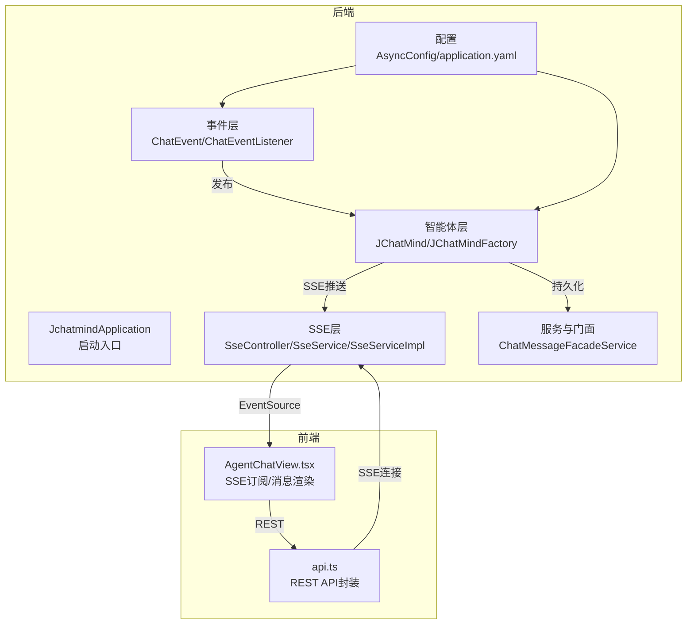
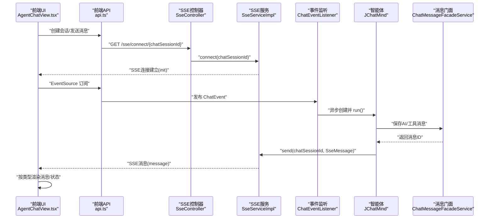
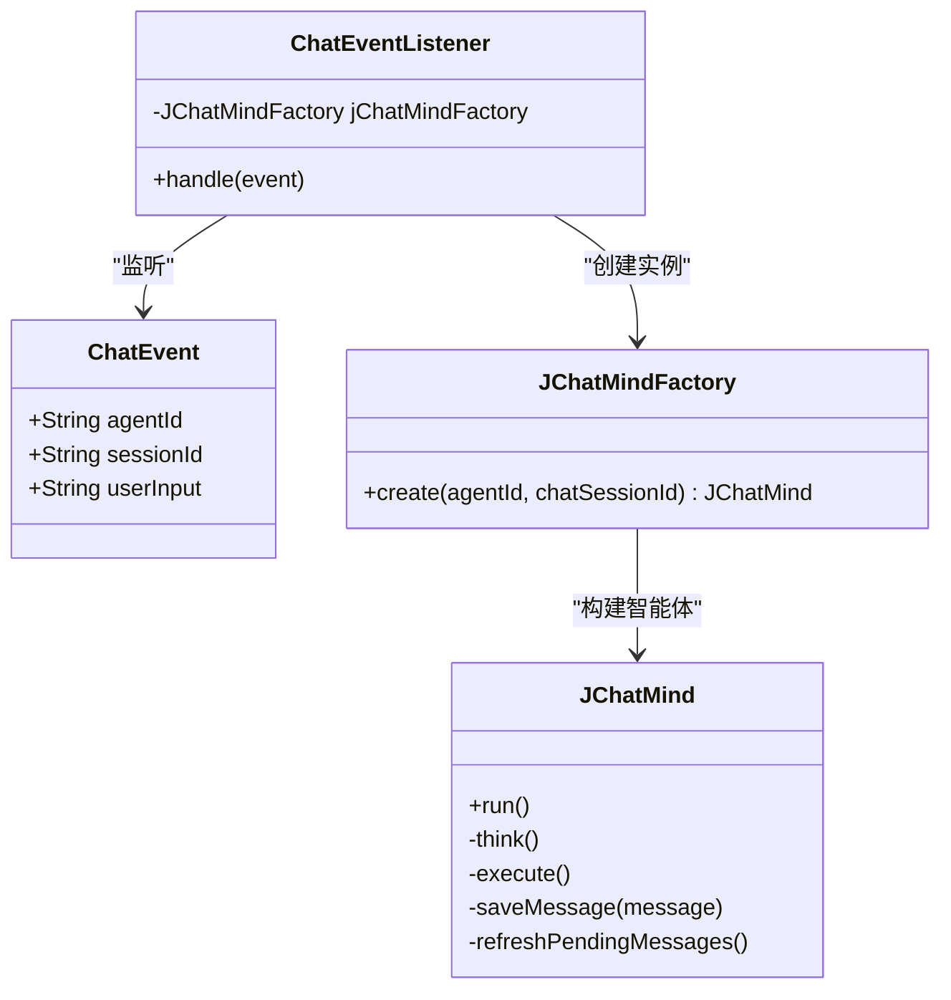
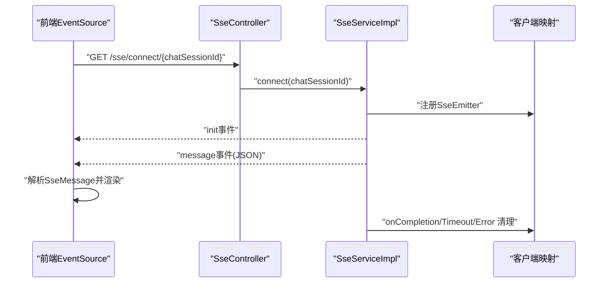
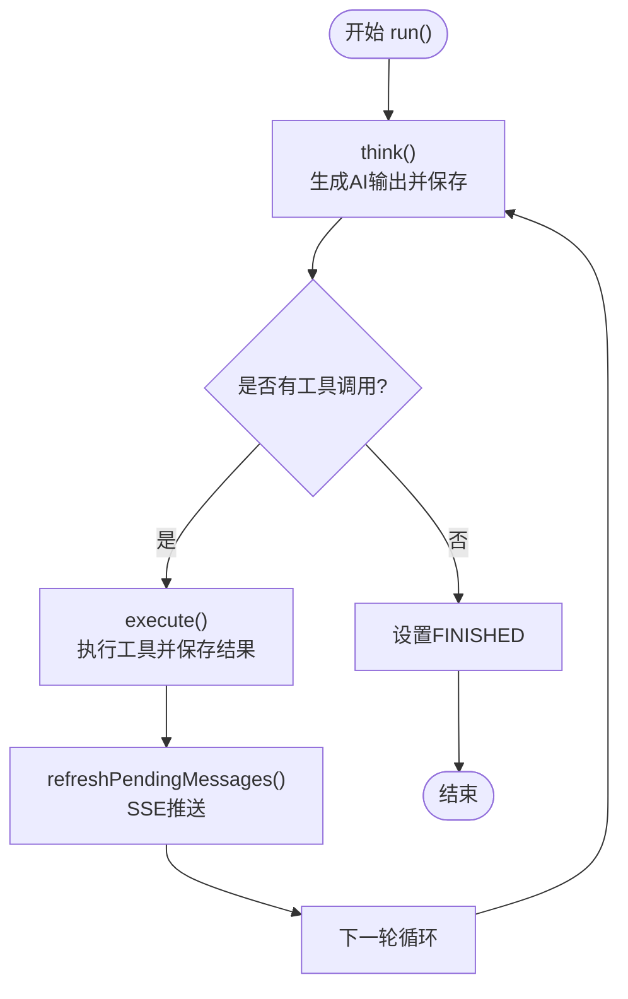
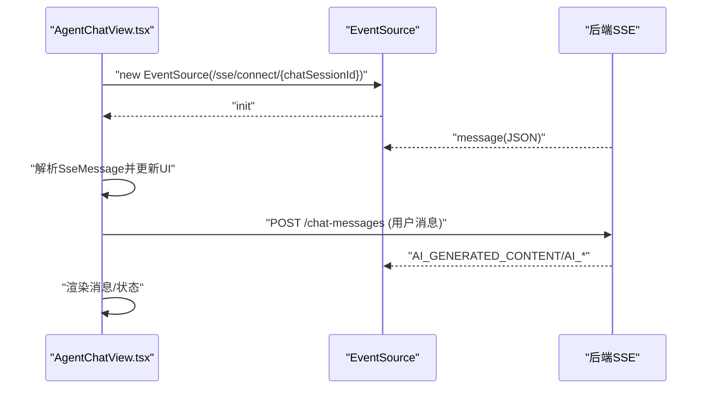
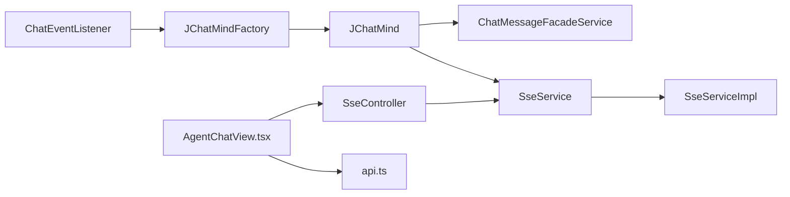

# 数据流架构

<cite>
**本文引用的文件**
- [ChatEvent.java](file://jchatmind/src/main/java/com/kama/jchatmind/event/ChatEvent.java)
- [ChatEventListener.java](file://jchatmind/src/main/java/com/kama/jchatmind/event/listener/ChatEventListener.java)
- [SseMessage.java](file://jchatmind/src/main/java/com/kama/jchatmind/message/SseMessage.java)
- [SseServiceImpl.java](file://jchatmind/src/main/java/com/kama/jchatmind/service/impl/SseServiceImpl.java)
- [SseController.java](file://jchatmind/src/main/java/com/kama/jchatmind/controller/SseController.java)
- [JChatMind.java](file://jchatmind/src/main/java/com/kama/jchatmind/agent/JChatMind.java)
- [JChatMindFactory.java](file://jchatmind/src/main/java/com/kama/jchatmind/agent/JChatMindFactory.java)
- [AsyncConfig.java](file://jchatmind/src/main/java/com/kama/jchatmind/config/AsyncConfig.java)
- [application.yaml](file://jchatmind/src/main/resources/application.yaml)
- [ChatMessageFacadeService.java](file://jchatmind/src/main/java/com/kama/jchatmind/service/ChatMessageFacadeService.java)
- [SseService.java](file://jchatmind/src/main/java/com/kama/jchatmind/service/SseService.java)
- [AgentChatView.tsx](file://ui/src/components/views/AgentChatView.tsx)
- [api.ts](file://ui/src/api/api.ts)
</cite>

## 目录
1. [简介](#简介)
2. [项目结构](#项目结构)
3. [核心组件](#核心组件)
4. [架构总览](#架构总览)
5. [详细组件分析](#详细组件分析)
6. [依赖分析](#依赖分析)
7. [性能考虑](#性能考虑)
8. [故障排查指南](#故障排查指南)
9. [结论](#结论)
10. [附录](#附录)

## 简介
本文件面向JChatMind的数据流与实时通信架构，系统采用事件驱动与服务器推送事件（SSE）相结合的设计，围绕ChatEvent事件模型、ChatEventListener监听器模式与SseService发布订阅机制，构建从用户输入到AI逐步推理与工具调用的完整数据流闭环。同时，前端通过EventSource订阅SSE通道，实现消息增量渲染与状态同步。

## 项目结构
JChatMind由后端Spring Boot应用与前端React应用组成，后端负责事件分发、智能体运行、消息持久化与SSE推送；前端负责会话管理、消息展示与SSE订阅。

图表来源
- [JchatmindApplication.java:1-14](file://jchatmind/src/main/java/com/kama/jchatmind/JchatmindApplication.java#L1-L14)
- [ChatEventListener.java:1-25](file://jchatmind/src/main/java/com/kama/jchatmind/event/listener/ChatEventListener.java#L1-L25)
- [JChatMind.java:1-348](file://jchatmind/src/main/java/com/kama/jchatmind/agent/JChatMind.java#L1-L348)
- [SseController.java:1-24](file://jchatmind/src/main/java/com/kama/jchatmind/controller/SseController.java#L1-L24)
- [SseServiceImpl.java:1-64](file://jchatmind/src/main/java/com/kama/jchatmind/service/impl/SseServiceImpl.java#L1-L64)
- [ChatMessageFacadeService.java:1-28](file://jchatmind/src/main/java/com/kama/jchatmind/service/ChatMessageFacadeService.java#L1-L28)
- [AsyncConfig.java:1-25](file://jchatmind/src/main/java/com/kama/jchatmind/config/AsyncConfig.java#L1-L25)
- [application.yaml:1-43](file://jchatmind/src/main/resources/application.yaml#L1-L43)
- [AgentChatView.tsx:1-200](file://ui/src/components/views/AgentChatView.tsx#L1-L200)
- [api.ts:1-378](file://ui/src/api/api.ts#L1-L378)

章节来源
- [JchatmindApplication.java:1-14](file://jchatmind/src/main/java/com/kama/jchatmind/JchatmindApplication.java#L1-L14)
- [application.yaml:1-43](file://jchatmind/src/main/resources/application.yaml#L1-L43)

## 核心组件
- 事件模型：ChatEvent承载会话级触发信息（agentId、sessionId、userInput），作为事件驱动的起点。
- 监听器：ChatEventListener异步监听ChatEvent，基于工厂创建JChatMind实例并执行run()。
- 智能体：JChatMind封装推理循环（思考-规划-执行-完成），与工具回调、知识库检索、消息持久化协同。
- SSE服务：SseController提供SSE端点，SseServiceImpl维护客户端映射、连接生命周期与消息发送。
- 前端视图：AgentChatView通过EventSource订阅SSE，按消息类型增量渲染消息与状态。

章节来源
- [ChatEvent.java:1-13](file://jchatmind/src/main/java/com/kama/jchatmind/event/ChatEvent.java#L1-L13)
- [ChatEventListener.java:1-25](file://jchatmind/src/main/java/com/kama/jchatmind/event/listener/ChatEventListener.java#L1-L25)
- [JChatMind.java:1-348](file://jchatmind/src/main/java/com/kama/jchatmind/agent/JChatMind.java#L1-L348)
- [SseController.java:1-24](file://jchatmind/src/main/java/com/kama/jchatmind/controller/SseController.java#L1-L24)
- [SseServiceImpl.java:1-64](file://jchatmind/src/main/java/com/kama/jchatmind/service/impl/SseServiceImpl.java#L1-L64)
- [AgentChatView.tsx:1-200](file://ui/src/components/views/AgentChatView.tsx#L1-L200)

## 架构总览
系统以“事件发布-异步监听-智能体执行-消息持久化-SSE推送-前端增量渲染”为主线，形成闭环数据流。

图表来源
- [SseController.java:1-24](file://jchatmind/src/main/java/com/kama/jchatmind/controller/SseController.java#L1-L24)
- [SseServiceImpl.java:1-64](file://jchatmind/src/main/java/com/kama/jchatmind/service/impl/SseServiceImpl.java#L1-L64)
- [ChatEventListener.java:1-25](file://jchatmind/src/main/java/com/kama/jchatmind/event/listener/ChatEventListener.java#L1-L25)
- [JChatMind.java:1-348](file://jchatmind/src/main/java/com/kama/jchatmind/agent/JChatMind.java#L1-L348)
- [ChatMessageFacadeService.java:1-28](file://jchatmind/src/main/java/com/kama/jchatmind/service/ChatMessageFacadeService.java#L1-L28)
- [AgentChatView.tsx:1-200](file://ui/src/components/views/AgentChatView.tsx#L1-L200)

## 详细组件分析

### 事件驱动架构
- ChatEvent事件模型：携带agentId、sessionId、userInput，作为智能体执行的触发信号。
- ChatEventListener监听器：使用@EnableAsync与@Async实现异步处理，接收ChatEvent后通过JChatMindFactory创建JChatMind并执行run()。
- 异步线程池：AsyncConfig配置线程池大小与队列容量，保障事件并发处理能力。

图表来源
- [ChatEvent.java:1-13](file://jchatmind/src/main/java/com/kama/jchatmind/event/ChatEvent.java#L1-L13)
- [ChatEventListener.java:1-25](file://jchatmind/src/main/java/com/kama/jchatmind/event/listener/ChatEventListener.java#L1-L25)
- [JChatMindFactory.java:1-248](file://jchatmind/src/main/java/com/kama/jchatmind/agent/JChatMindFactory.java#L1-L248)
- [JChatMind.java:1-348](file://jchatmind/src/main/java/com/kama/jchatmind/agent/JChatMind.java#L1-L348)

章节来源
- [ChatEvent.java:1-13](file://jchatmind/src/main/java/com/kama/jchatmind/event/ChatEvent.java#L1-L13)
- [ChatEventListener.java:1-25](file://jchatmind/src/main/java/com/kama/jchatmind/event/listener/ChatEventListener.java#L1-L25)
- [AsyncConfig.java:1-25](file://jchatmind/src/main/java/com/kama/jchatmind/config/AsyncConfig.java#L1-L25)

### SSE推送与消息格式
- SseController端点：提供/text/event-stream的SSE连接，路径为/sse/connect/{chatSessionId}。
- SseServiceImpl实现：维护chatSessionId到SseEmitter的并发映射，连接建立后发送init事件，处理onCompletion/onTimeout/onError清理，send方法序列化SseMessage并通过SseEmitter发送。
- SseMessage消息格式：包含type、payload（message、statusText、done）、metadata（chatMessageId），并定义多种消息类型（AI_GENERATED_CONTENT、AI_PLANNING、AI_THINKING、AI_EXECUTING、AI_DONE）。

图表来源
- [SseController.java:1-24](file://jchatmind/src/main/java/com/kama/jchatmind/controller/SseController.java#L1-L24)
- [SseServiceImpl.java:1-64](file://jchatmind/src/main/java/com/kama/jchatmind/service/impl/SseServiceImpl.java#L1-L64)
- [SseMessage.java:1-47](file://jchatmind/src/main/java/com/kama/jchatmind/message/SseMessage.java#L1-L47)

章节来源
- [SseController.java:1-24](file://jchatmind/src/main/java/com/kama/jchatmind/controller/SseController.java#L1-L24)
- [SseServiceImpl.java:1-64](file://jchatmind/src/main/java/com/kama/jchatmind/service/impl/SseServiceImpl.java#L1-L64)
- [SseMessage.java:1-47](file://jchatmind/src/main/java/com/kama/jchatmind/message/SseMessage.java#L1-L47)

### 智能体执行与消息持久化
- JChatMind.run()执行推理循环，think()阶段生成AI输出并保存至数据库，execute()阶段执行工具调用并将工具响应持久化，最终通过SseService推送增量消息。
- JChatMindFactory负责加载Agent配置、记忆、知识库与工具，并构建JChatMind实例。
- ChatMessageFacadeService提供消息的查询与创建接口，支撑智能体的持久化与回放。

图表来源
- [JChatMind.java:1-348](file://jchatmind/src/main/java/com/kama/jchatmind/agent/JChatMind.java#L1-L348)
- [JChatMindFactory.java:1-248](file://jchatmind/src/main/java/com/kama/jchatmind/agent/JChatMindFactory.java#L1-L248)
- [ChatMessageFacadeService.java:1-28](file://jchatmind/src/main/java/com/kama/jchatmind/service/ChatMessageFacadeService.java#L1-L28)

章节来源
- [JChatMind.java:1-348](file://jchatmind/src/main/java/com/kama/jchatmind/agent/JChatMind.java#L1-L348)
- [JChatMindFactory.java:1-248](file://jchatmind/src/main/java/com/kama/jchatmind/agent/JChatMindFactory.java#L1-L248)
- [ChatMessageFacadeService.java:1-28](file://jchatmind/src/main/java/com/kama/jchatmind/service/ChatMessageFacadeService.java#L1-L28)

### 前后端数据交互与状态同步
- 前端AgentChatView在存在chatSessionId时建立EventSource连接，订阅后端SSE消息；根据SseMessage.type分别更新消息列表或显示AI状态。
- 前端通过api.ts封装REST请求，创建会话、获取会话与消息、发送用户消息等。

图表来源
- [AgentChatView.tsx:1-200](file://ui/src/components/views/AgentChatView.tsx#L1-L200)
- [api.ts:1-378](file://ui/src/api/api.ts#L1-L378)
- [SseController.java:1-24](file://jchatmind/src/main/java/com/kama/jchatmind/controller/SseController.java#L1-L24)

章节来源
- [AgentChatView.tsx:1-200](file://ui/src/components/views/AgentChatView.tsx#L1-L200)
- [api.ts:1-378](file://ui/src/api/api.ts#L1-L378)

## 依赖分析
- 组件耦合：事件监听器依赖工厂创建智能体；智能体依赖SSE服务与消息门面；SSE服务依赖并发映射与JSON序列化；前端依赖SSE端点与REST API。
- 外部依赖：Spring Async、Spring MVC、Jackson、Spring AI ChatClient与工具回调框架。
- 配置依赖：application.yaml提供数据库、邮件、AI模型配置；AsyncConfig提供异步线程池配置。

图表来源
- [ChatEventListener.java:1-25](file://jchatmind/src/main/java/com/kama/jchatmind/event/listener/ChatEventListener.java#L1-L25)
- [JChatMindFactory.java:1-248](file://jchatmind/src/main/java/com/kama/jchatmind/agent/JChatMindFactory.java#L1-L248)
- [JChatMind.java:1-348](file://jchatmind/src/main/java/com/kama/jchatmind/agent/JChatMind.java#L1-L348)
- [ChatMessageFacadeService.java:1-28](file://jchatmind/src/main/java/com/kama/jchatmind/service/ChatMessageFacadeService.java#L1-L28)
- [SseController.java:1-24](file://jchatmind/src/main/java/com/kama/jchatmind/controller/SseController.java#L1-L24)
- [SseServiceImpl.java:1-64](file://jchatmind/src/main/java/com/kama/jchatmind/service/impl/SseServiceImpl.java#L1-L64)
- [AgentChatView.tsx:1-200](file://ui/src/components/views/AgentChatView.tsx#L1-L200)
- [api.ts:1-378](file://ui/src/api/api.ts#L1-L378)

章节来源
- [application.yaml:1-43](file://jchatmind/src/main/resources/application.yaml#L1-L43)
- [AsyncConfig.java:1-25](file://jchatmind/src/main/java/com/kama/jchatmind/config/AsyncConfig.java#L1-L25)

## 性能考虑
- 异步处理：事件监听器使用@Async与线程池，避免阻塞主线程，提升并发吞吐。
- SSE长连接：SseEmitter默认超时时间较长，结合onCompletion/onTimeout/onError清理，降低内存泄漏风险。
- 消息增量推送：智能体仅推送新增消息，减少前端重复渲染压力。
- 工具调用与知识库：建议对工具调用与知识库检索进行缓存与限流，避免高并发下的资源争用。

## 故障排查指南
- SSE连接失败：检查SseController端点是否可达、chatSessionId是否正确、SseServiceImpl是否成功注册SseEmitter。
- 消息未推送：确认JChatMind.refreshPendingMessages()是否被调用、SseService.send()是否抛出异常、客户端是否正确解析SseMessage。
- 事件未触发：检查@EnableAsync与@Async配置、AsyncConfig线程池是否正常、ChatEventListener是否扫描到。
- 前端无消息：确认EventSource订阅地址、SSE消息类型与前端分支逻辑一致。

章节来源
- [SseServiceImpl.java:1-64](file://jchatmind/src/main/java/com/kama/jchatmind/service/impl/SseServiceImpl.java#L1-L64)
- [JChatMind.java:1-348](file://jchatmind/src/main/java/com/kama/jchatmind/agent/JChatMind.java#L1-L348)
- [AsyncConfig.java:1-25](file://jchatmind/src/main/java/com/kama/jchatmind/config/AsyncConfig.java#L1-L25)
- [AgentChatView.tsx:1-200](file://ui/src/components/views/AgentChatView.tsx#L1-L200)

## 结论
JChatMind通过事件驱动与SSE推送实现了低耦合、高扩展的数据流架构：事件监听器解耦业务触发与执行，智能体负责复杂推理与工具调用，SSE提供高效增量消息传输，前端实现即时状态反馈。该设计具备良好的可维护性与可扩展性，适合在多Agent、多会话场景下演进。

## 附录
- 关键配置项参考：数据库连接、邮件配置、AI模型参数、SSE超时与线程池大小。
- 前端API封装：统一REST调用入口，便于扩展与测试。

章节来源
- [application.yaml:1-43](file://jchatmind/src/main/resources/application.yaml#L1-L43)
- [api.ts:1-378](file://ui/src/api/api.ts#L1-L378)