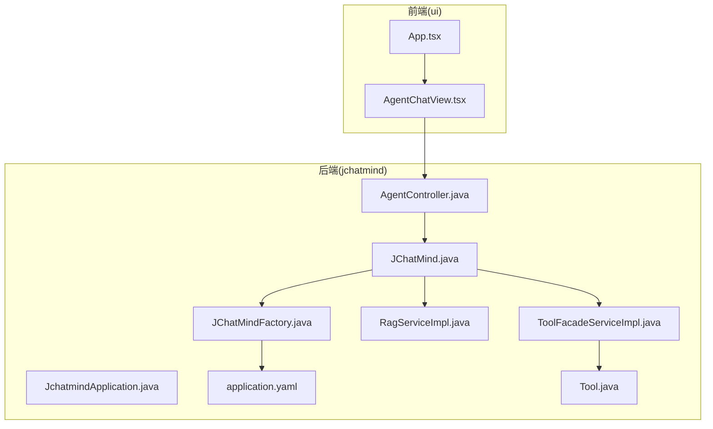
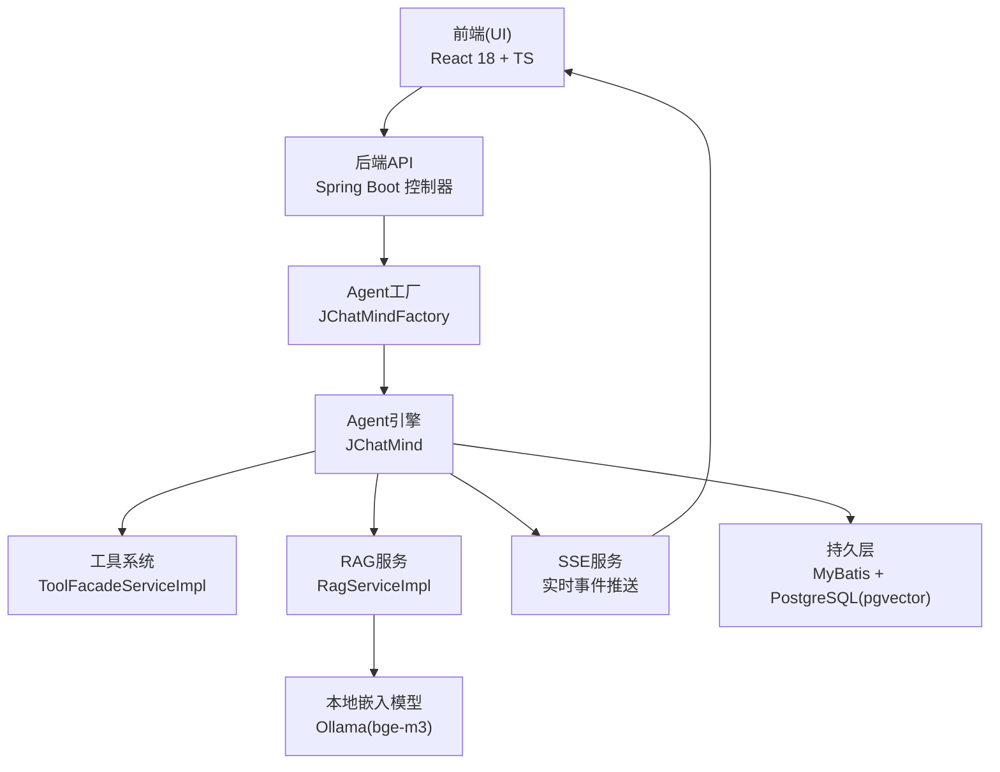
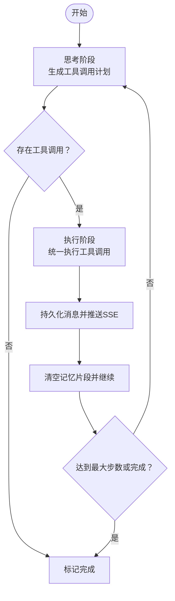
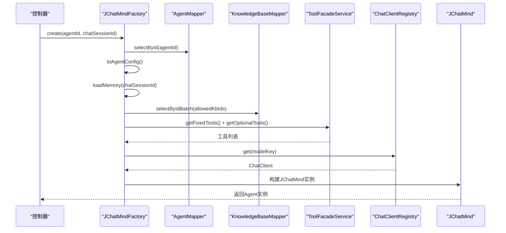
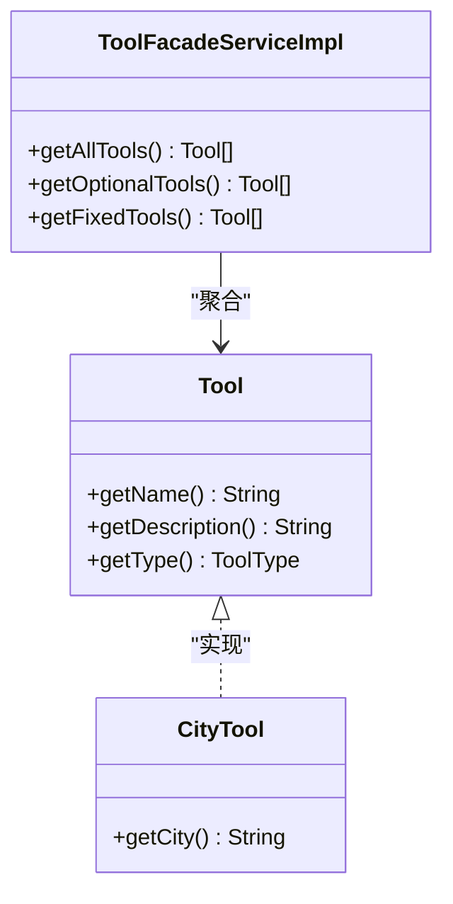
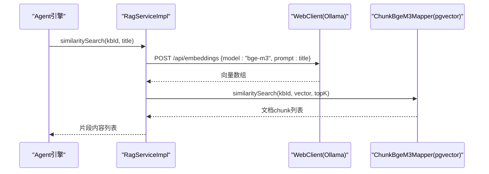
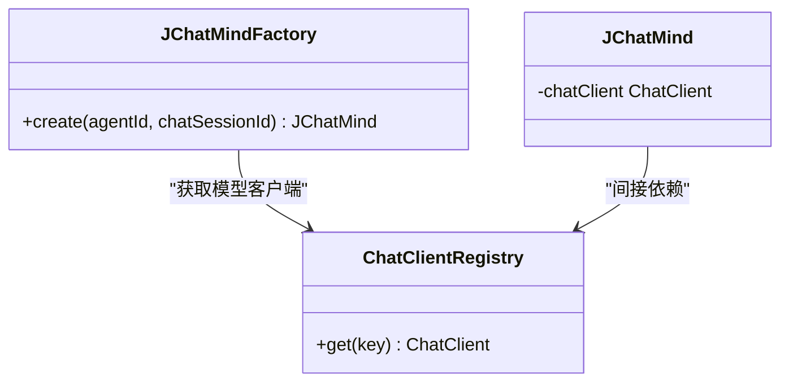
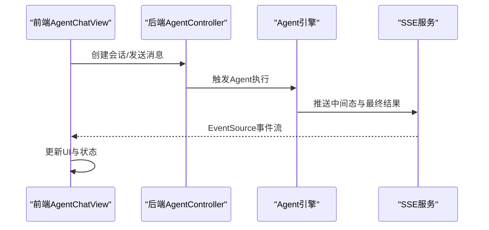
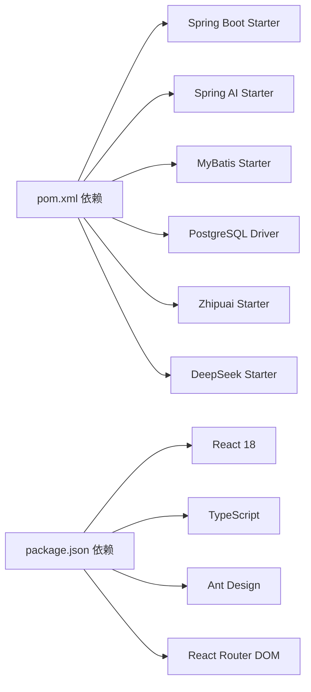

# 系统架构

<cite>
**本文引用的文件**
- [README.md](file://README.md)
- [JchatmindApplication.java](file://jchatmind/src/main/java/com/kama/jchatmind/JchatmindApplication.java)
- [application.yaml](file://jchatmind/src/main/resources/application.yaml)
- [pom.xml](file://jchatmind/pom.xml)
- [JChatMind.java](file://jchatmind/src/main/java/com/kama/jchatmind/agent/JChatMind.java)
- [JChatMindFactory.java](file://jchatmind/src/main/java/com/kama/jchatmind/agent/JChatMindFactory.java)
- [ChatClientRegistry.java](file://jchatmind/src/main/java/com/kama/jchatmind/config/ChatClientRegistry.java)
- [RagServiceImpl.java](file://jchatmind/src/main/java/com/kama/jchatmind/service/impl/RagServiceImpl.java)
- [ToolFacadeServiceImpl.java](file://jchatmind/src/main/java/com/kama/jchatmind/service/impl/ToolFacadeServiceImpl.java)
- [Tool.java](file://jchatmind/src/main/java/com/kama/jchatmind/agent/tools/Tool.java)
- [CityTool.java](file://jchatmind/src/main/java/com/kama/jchatmind/agent/tools/test/CityTool.java)
- [AgentController.java](file://jchatmind/src/main/java/com/kama/jchatmind/controller/AgentController.java)
- [App.tsx](file://ui/src/App.tsx)
- [AgentChatView.tsx](file://ui/src/components/views/AgentChatView.tsx)
- [package.json](file://ui/package.json)
</cite>

## 目录
1. [引言](#引言)
2. [项目结构](#项目结构)
3. [核心组件](#核心组件)
4. [架构总览](#架构总览)
5. [详细组件分析](#详细组件分析)
6. [依赖分析](#依赖分析)
7. [性能考虑](#性能考虑)
8. [故障排查指南](#故障排查指南)
9. [结论](#结论)
10. [附录](#附录)

## 引言
本架构文档面向JChatMind系统，围绕其分层架构与组件交互展开，重点阐释后端Spring Boot与前端React的集成方式、AI Agent核心引擎的Think-Execute循环机制、多模型支持与工具调用框架、RAG知识库技术实现，以及系统边界、数据流向与集成模式。读者可据此快速理解系统整体设计思路与关键实现。

## 项目结构
JChatMind采用前后端分离的典型工程布局：
- 后端（Spring Boot）：位于 jchatmind 目录，使用Spring Boot 3.x、Spring AI、MyBatis、PostgreSQL + pgvector，提供REST API、SSE事件流、工具调用与RAG检索能力。
- 前端（React 18 + TypeScript）：位于 ui 目录，使用Ant Design、Tailwind CSS、Vite，负责聊天界面、会话管理与SSE实时展示。
- 示例与文档：examples目录包含示例页面；README提供总体介绍与架构图。

**图表来源**
- [App.tsx:1-16](file://ui/src/App.tsx#L1-L16)
- [AgentChatView.tsx:1-200](file://ui/src/components/views/AgentChatView.tsx#L1-L200)
- [JchatmindApplication.java:1-14](file://jchatmind/src/main/java/com/kama/jchatmind/JchatmindApplication.java#L1-L14)
- [application.yaml:1-43](file://jchatmind/src/main/resources/application.yaml#L1-L43)
- [AgentController.java:1-45](file://jchatmind/src/main/java/com/kama/jchatmind/controller/AgentController.java#L1-L45)
- [JChatMind.java:1-348](file://jchatmind/src/main/java/com/kama/jchatmind/agent/JChatMind.java#L1-L348)
- [JChatMindFactory.java:1-248](file://jchatmind/src/main/java/com/kama/jchatmind/agent/JChatMindFactory.java#L1-L248)
- [RagServiceImpl.java:1-67](file://jchatmind/src/main/java/com/kama/jchatmind/service/impl/RagServiceImpl.java#L1-L67)
- [ToolFacadeServiceImpl.java:1-38](file://jchatmind/src/main/java/com/kama/jchatmind/service/impl/ToolFacadeServiceImpl.java#L1-L38)
- [Tool.java:1-10](file://jchatmind/src/main/java/com/kama/jchatmind/agent/tools/Tool.java#L1-L10)

**章节来源**
- [README.md:1-71](file://README.md#L1-L71)
- [JchatmindApplication.java:1-14](file://jchatmind/src/main/java/com/kama/jchatmind/JchatmindApplication.java#L1-L14)
- [application.yaml:1-43](file://jchatmind/src/main/resources/application.yaml#L1-L43)
- [pom.xml:1-131](file://jchatmind/pom.xml#L1-L131)
- [App.tsx:1-16](file://ui/src/App.tsx#L1-L16)
- [AgentChatView.tsx:1-200](file://ui/src/components/views/AgentChatView.tsx#L1-L200)

## 核心组件
- 后端核心
  - Agent引擎：JChatMind负责Think-Execute循环、工具调用与消息持久化，配合SSE向前端推送中间态。
  - Agent工厂：JChatMindFactory加载Agent配置、记忆、知识库与工具，构建运行时Agent实例。
  - 工具系统：Tool接口定义工具契约，ToolFacadeService按类型聚合工具集合。
  - RAG服务：RagServiceImpl封装本地嵌入模型调用与向量相似度检索。
  - 配置中心：application.yaml集中管理数据源、邮件、AI模型参数与文档存储路径。
- 前端核心
  - 应用入口：App.tsx装配路由与上下文。
  - 聊天视图：AgentChatView.tsx负责会话创建、消息拉取、SSE事件监听与UI渲染。

**章节来源**
- [JChatMind.java:1-348](file://jchatmind/src/main/java/com/kama/jchatmind/agent/JChatMind.java#L1-L348)
- [JChatMindFactory.java:1-248](file://jchatmind/src/main/java/com/kama/jchatmind/agent/JChatMindFactory.java#L1-L248)
- [Tool.java:1-10](file://jchatmind/src/main/java/com/kama/jchatmind/agent/tools/Tool.java#L1-L10)
- [ToolFacadeServiceImpl.java:1-38](file://jchatmind/src/main/java/com/kama/jchatmind/service/impl/ToolFacadeServiceImpl.java#L1-L38)
- [RagServiceImpl.java:1-67](file://jchatmind/src/main/java/com/kama/jchatmind/service/impl/RagServiceImpl.java#L1-L67)
- [application.yaml:1-43](file://jchatmind/src/main/resources/application.yaml#L1-L43)
- [App.tsx:1-16](file://ui/src/App.tsx#L1-L16)
- [AgentChatView.tsx:1-200](file://ui/src/components/views/AgentChatView.tsx#L1-L200)

## 架构总览
系统采用“分层架构 + Agent核心服务”的设计，将AI能力（模型、RAG、工具）抽象为可组合、可扩展的模块。后端以控制器为入口，经由Agent工厂与Agent引擎协调工具与知识库，前端通过REST与SSE与后端交互，形成闭环。

**图表来源**
- [AgentController.java:1-45](file://jchatmind/src/main/java/com/kama/jchatmind/controller/AgentController.java#L1-L45)
- [JChatMindFactory.java:1-248](file://jchatmind/src/main/java/com/kama/jchatmind/agent/JChatMindFactory.java#L1-L248)
- [JChatMind.java:1-348](file://jchatmind/src/main/java/com/kama/jchatmind/agent/JChatMind.java#L1-L348)
- [ToolFacadeServiceImpl.java:1-38](file://jchatmind/src/main/java/com/kama/jchatmind/service/impl/ToolFacadeServiceImpl.java#L1-L38)
- [RagServiceImpl.java:1-67](file://jchatmind/src/main/java/com/kama/jchatmind/service/impl/RagServiceImpl.java#L1-L67)
- [AgentChatView.tsx:1-200](file://ui/src/components/views/AgentChatView.tsx#L1-L200)

## 详细组件分析

### Agent核心引擎：Think-Execute循环
- 设计理念
  - 将“思考”与“执行”解耦：先由模型结合上下文与可用知识库生成工具调用计划，再统一交由工具调用管理器执行，最后将结果写回记忆并持久化。
  - 通过内存窗口限制与最大步数保护，避免无限循环与资源耗尽。
- Think阶段
  - 构造Prompt，注入系统提示词（用于决策），携带当前记忆与工具回调，获取工具调用列表。
  - 持久化Assistant消息并推送SSE中间态。
- Execute阶段
  - 使用工具调用管理器统一执行工具调用，将工具返回结果封装为ToolResponseMessage，写回记忆并持久化。
  - 若检测终止工具，标记Agent完成。
- 状态机
  - IDLE → 运行中 → FINISHED 或 ERROR。

**图表来源**
- [JChatMind.java:220-337](file://jchatmind/src/main/java/com/kama/jchatmind/agent/JChatMind.java#L220-L337)

**章节来源**
- [JChatMind.java:1-348](file://jchatmind/src/main/java/com/kama/jchatmind/agent/JChatMind.java#L1-L348)

### Agent工厂：运行时装配
- 职责
  - 加载Agent实体并解析为运行时配置（含模型、消息长度、系统提示词等）。
  - 从知识库映射器批量加载允许使用的知识库，转换为DTO。
  - 从工具门面聚合固定与可选工具，解析目标对象并生成MethodToolCallback，供模型调用。
  - 从ChatClient注册表按模型键获取对应客户端，构建JChatMind实例。
- 记忆恢复
  - 依据最近N条消息重建消息序列，还原Assistant/Tool元数据，确保上下文连续性。

**图表来源**
- [JChatMindFactory.java:72-246](file://jchatmind/src/main/java/com/kama/jchatmind/agent/JChatMindFactory.java#L72-L246)
- [ChatClientRegistry.java:1-21](file://jchatmind/src/main/java/com/kama/jchatmind/config/ChatClientRegistry.java#L1-L21)
- [JChatMind.java:90-140](file://jchatmind/src/main/java/com/kama/jchatmind/agent/JChatMind.java#L90-L140)

**章节来源**
- [JChatMindFactory.java:1-248](file://jchatmind/src/main/java/com/kama/jchatmind/agent/JChatMindFactory.java#L1-L248)
- [ChatClientRegistry.java:1-21](file://jchatmind/src/main/java/com/kama/jchatmind/config/ChatClientRegistry.java#L1-L21)

### 工具调用框架：可扩展与分类管理
- 接口与实现
  - Tool接口定义名称、描述与类型（固定/可选）。
  - ToolFacadeServiceImpl按类型过滤工具集合，便于工厂装配。
  - 示例工具CityTool演示注解式工具方法声明。
- 调用链路
  - 工厂解析工具为目标对象，MethodToolCallbackProvider生成回调，注入模型以支持函数调用。

**图表来源**
- [Tool.java:1-10](file://jchatmind/src/main/java/com/kama/jchatmind/agent/tools/Tool.java#L1-L10)
- [ToolFacadeServiceImpl.java:1-38](file://jchatmind/src/main/java/com/kama/jchatmind/service/impl/ToolFacadeServiceImpl.java#L1-L38)
- [CityTool.java:1-29](file://jchatmind/src/main/java/com/kama/jchatmind/agent/tools/test/CityTool.java#L1-L29)

**章节来源**
- [Tool.java:1-10](file://jchatmind/src/main/java/com/kama/jchatmind/agent/tools/Tool.java#L1-L10)
- [ToolFacadeServiceImpl.java:1-38](file://jchatmind/src/main/java/com/kama/jchatmind/service/impl/ToolFacadeServiceImpl.java#L1-L38)
- [CityTool.java:1-29](file://jchatmind/src/main/java/com/kama/jchatmind/agent/tools/test/CityTool.java#L1-L29)

### RAG知识库：向量检索与相似度搜索
- 技术实现
  - 使用本地Ollama服务提供的bge-m3嵌入模型，WebClient发起POST请求获取向量。
  - 将查询文本向量化后转为pgvector字符串，调用Mapper执行相似度检索，返回高相关chunk内容。
- 数据流
  - 输入：知识库ID、标题/查询文本
  - 输出：相关文档片段列表

**图表来源**
- [RagServiceImpl.java:51-55](file://jchatmind/src/main/java/com/kama/jchatmind/service/impl/RagServiceImpl.java#L51-L55)

**章节来源**
- [RagServiceImpl.java:1-67](file://jchatmind/src/main/java/com/kama/jchatmind/service/impl/RagServiceImpl.java#L1-L67)

### 多模型支持：注册表与配置
- 注册表
  - ChatClientRegistry以键值对持有多个ChatClient，按Agent配置选择对应模型。
- 配置
  - application.yaml集中管理DeepSeek与智谱AI的API Key、基础URL与模型选项，便于切换与扩展。

**图表来源**
- [ChatClientRegistry.java:1-21](file://jchatmind/src/main/java/com/kama/jchatmind/config/ChatClientRegistry.java#L1-L21)
- [JChatMindFactory.java:203-206](file://jchatmind/src/main/java/com/kama/jchatmind/agent/JChatMindFactory.java#L203-L206)
- [application.yaml:22-34](file://jchatmind/src/main/resources/application.yaml#L22-L34)

**章节来源**
- [ChatClientRegistry.java:1-21](file://jchatmind/src/main/java/com/kama/jchatmind/config/ChatClientRegistry.java#L1-L21)
- [application.yaml:22-34](file://jchatmind/src/main/resources/application.yaml#L22-L34)

### 前后端集成：REST与SSE
- 前端
  - App.tsx装配路由与上下文；AgentChatView.tsx负责会话创建、消息拉取、SSE连接与状态展示。
  - 通过EventSource订阅后端SSE通道，接收AI生成内容与状态事件。
- 后端
  - 控制器提供Agent CRUD等REST接口；Agent引擎通过SSE服务向指定会话推送消息。
- 集成要点
  - 前端仅在存在会话ID时建立SSE连接，避免无效连接。
  - 后端在消息持久化后立即通过SSE推送，保证前端实时可见。

**图表来源**
- [AgentChatView.tsx:120-170](file://ui/src/components/views/AgentChatView.tsx#L120-L170)
- [AgentController.java:1-45](file://jchatmind/src/main/java/com/kama/jchatmind/controller/AgentController.java#L1-L45)
- [JChatMind.java:202-217](file://jchatmind/src/main/java/com/kama/jchatmind/agent/JChatMind.java#L202-L217)

**章节来源**
- [AgentChatView.tsx:1-200](file://ui/src/components/views/AgentChatView.tsx#L1-L200)
- [AgentController.java:1-45](file://jchatmind/src/main/java/com/kama/jchatmind/controller/AgentController.java#L1-L45)
- [JChatMind.java:1-348](file://jchatmind/src/main/java/com/kama/jchatmind/agent/JChatMind.java#L1-L348)

## 依赖分析
- 技术栈与版本
  - 后端：Spring Boot 3.x、Spring AI、MyBatis、PostgreSQL + pgvector、邮件、Markdown解析。
  - 前端：React 18、TypeScript、Ant Design、Tailwind CSS、Vite。
- 关键依赖关系
  - 后端通过依赖管理统一Spring AI版本，按需引入DeepSeek与智谱AI Starter。
  - 前端使用Ant Design与React Router DOM，构建UI与路由。

**图表来源**
- [pom.xml:46-121](file://jchatmind/pom.xml#L46-L121)
- [package.json:12-22](file://ui/package.json#L12-L22)

**章节来源**
- [pom.xml:1-131](file://jchatmind/pom.xml#L1-L131)
- [package.json:1-44](file://ui/package.json#L1-L44)

## 性能考虑
- Agent循环上限与内存窗口
  - 通过最大步数与消息窗口限制，控制单次执行的计算与存储开销。
- 工具调用批处理
  - 工具回调统一由管理器执行，减少重复初始化成本。
- RAG向量化
  - 本地Ollama嵌入模型建议部署在低延迟网络环境；相似度检索TopK可按业务需求调整。
- SSE推送
  - 前端仅在存在会话ID时建立连接，降低无效流量；后端在持久化后立即推送，避免阻塞。

## 故障排查指南
- Agent无法启动
  - 检查模型键是否存在于ChatClient注册表；确认application.yaml中的模型配置正确。
- 工具调用失败
  - 确认工具类型与名称匹配；检查MethodToolCallback生成是否成功；查看Agent日志中的工具调用打印。
- RAG检索异常
  - 确认Ollama服务可达且bge-m3模型已加载；检查pgvector向量格式转换逻辑。
- SSE无事件
  - 确认前端已传入有效的chatSessionId；检查后端SSE服务是否正确发送；查看浏览器EventSource错误日志。

**章节来源**
- [JChatMindFactory.java:203-206](file://jchatmind/src/main/java/com/kama/jchatmind/agent/JChatMindFactory.java#L203-L206)
- [application.yaml:22-34](file://jchatmind/src/main/resources/application.yaml#L22-L34)
- [RagServiceImpl.java:22-24](file://jchatmind/src/main/java/com/kama/jchatmind/service/impl/RagServiceImpl.java#L22-L24)
- [AgentChatView.tsx:120-170](file://ui/src/components/views/AgentChatView.tsx#L120-L170)

## 结论
JChatMind通过清晰的分层架构与可插拔的Agent引擎，实现了Think-Execute循环、工具调用与RAG检索的有机融合。后端以Spring Boot与Spring AI为核心，结合MyBatis与PostgreSQL/pgvector，提供稳定的数据与模型能力；前端以React与SSE实现流畅的交互体验。该架构具备良好的扩展性与可维护性，适合在多模型、多工具、多知识库场景下演进。

## 附录
- 快速启动
  - 后端：在jchatmind目录执行启动命令。
  - 前端：在ui目录安装依赖并启动开发服务器。
- 环境要求
  - JDK 17+、Node.js 18+、PostgreSQL 14+（需安装pgvector扩展）。

**章节来源**
- [README.md:46-66](file://README.md#L46-L66)
- [JchatmindApplication.java:1-14](file://jchatmind/src/main/java/com/kama/jchatmind/JchatmindApplication.java#L1-L14)
- [package.json:1-44](file://ui/package.json#L1-L44)